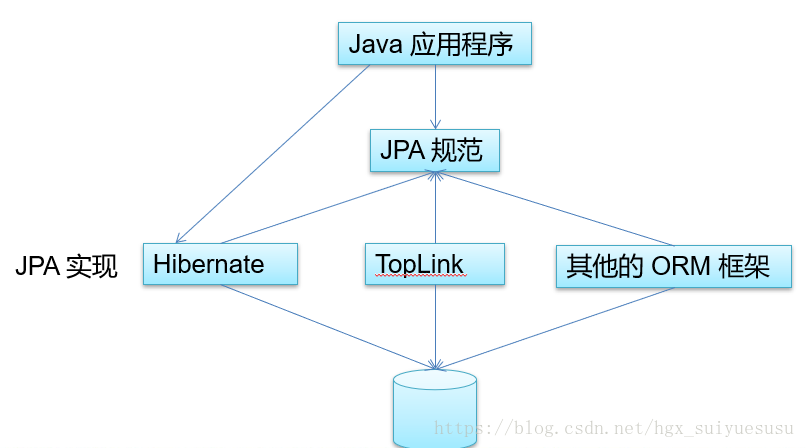
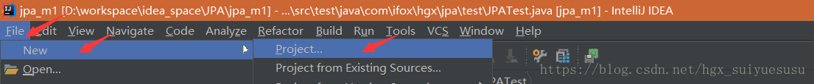
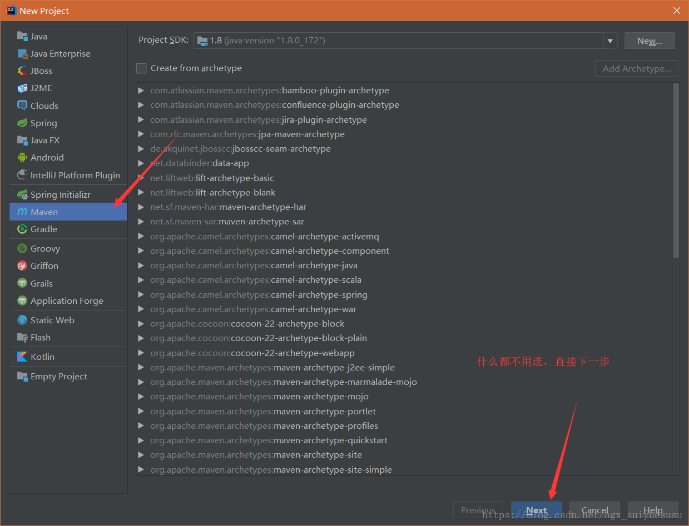
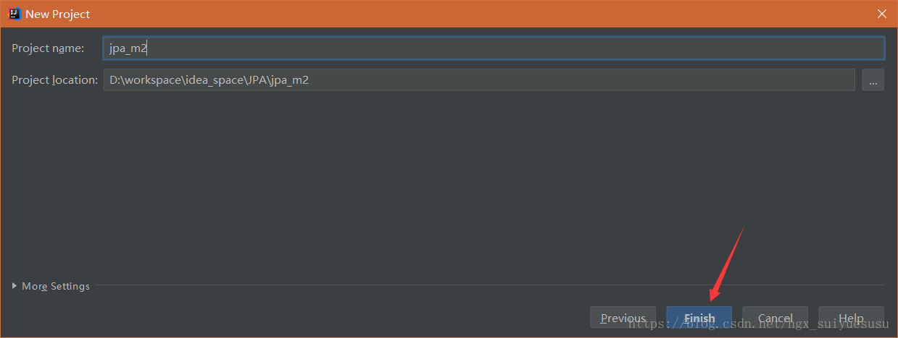
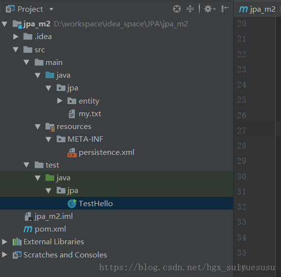
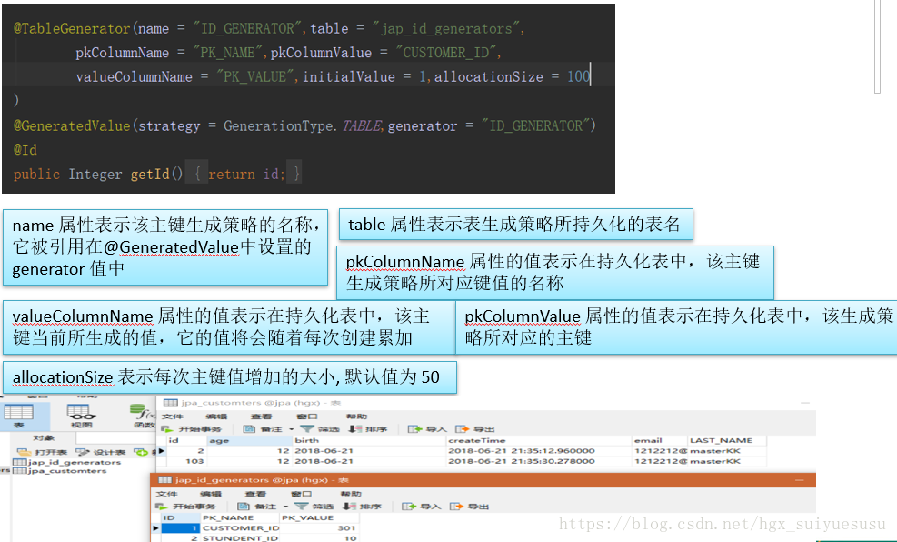
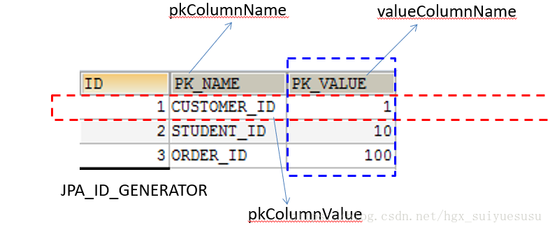

## JPA


## 一 JPA概述

### JPA 是什么

- Java Persistence API：用于对象持久化的 API
- Java EE 5.0 平台标准的 ORM 规范，使得应用程序以统一的方式访问持久层




### JPA和Hibernate的关系

- JPA 是 hibernate 的一个抽象（就像JDBC和JDBC驱动的关系）：JPA 是规范：JPA 本质上就是一种  ORM 规范，不是ORM 框架 —— 因为 JPA 并未提供 ORM 实现，它只是制订了一些规范，提供了一些编程的 API 接口，但具体实现则由 ORM 厂商提供实现

- Hibernate 是实现：Hibernate 除了作为 ORM 框架之外，它也是一种JPA 实现从功能上来说， JPA 是 Hibernate 功能的一个子集

### JPA 的供应商

- **JPA 的目标之一是制定一个可以由很多供应商实现的 API，目前Hibernate 3.2+、TopLink 10.1+ 以及 OpenJPA 都提供了 JPA 的实现**

##### **Hibernate**

- JPA 的起始就是 Hibernate 的作者Hibernate 
- 从 3.2 开始兼容 JPA

##### OpenJPA

- OpenJPA  是 Apache 组织提供的开源项目

##### TopLink

- TopLink 以前需要收费，如今开源了


### JPA的优势

- 标准化:  提供相同的 API，这保证了基于JPA 开发的企业应用能够经过少量的修改就能够在不同的 JPA 框架下运行。

- 简单易用，集成方便:  JPA 的主要目标之一就是提供更加简单的编程模型，在 JPA 框架下创建实体和创建 Java  类一样简单，只需要使用 javax.persistence.Entity 进行注释；JPA 的框架和接口也都非常简单

- 可媲美JDBC的查询能力:  JPA的查询语言是面向对象的，JPA定义了独特的JPQL，而且能够支持批量更新和修改、JOIN、GROUP BY、HAVING 等通常只有 SQL 才能够提供的高级查询特性，甚至还能够支持子查询。

- 支持面向对象的高级特性: JPA 中能够支持面向对象的高级特性，如类之间的继承、多态和类之间的复杂关系，最大限度的使用面向对象的模型


### JPA 包括 3方面的技术

- ORM  映射元数据：JPA 支持 XML 和  JDK 5.0 注解两种元数据的形式，元数据描述对象和表之间的映射关系，框架据此将实体对象持久化到数据库表中。  

- JPA 的 API：用来操作实体对象，执行CRUD操作，框架在后台完成所有的事情，开发者从繁琐的 JDBC和 SQL代码中解脱出来。  

- 查询语言（JPQL）：这是持久化操作中很重要的一个方面，通过面向对象而非面向数据库的查询语言查询数据，避免程序和具体的  SQL 紧密耦合。


## 二  JPA HelloWorld

### 使用JPA持久化对象的步骤

#### 1.创建 persistence.xml, 在这个文件中配置持久化单元

- 需要指定跟哪个数据库进行交互;

- 需要指定 JPA 使用哪个持久化的框架以及配置该框架的基本属性

#### 2.创建实体类, 使用 annotation 来描述实体类跟数据库表之间的映射关系.

#### 3.使用 JPA API 完成数据增加、删除、修改和查询操作

- 创建 EntityManagerFactory (对应 Hibernate 中的 SessionFactory)

- 创建 EntityManager (对应 Hibernate 中的Session)

### 在IntelliJ IDEA 下，创建JPA的Maven工程







-  pom.xml

```xml
<?xml version="1.0" encoding="UTF-8"?>
<project xmlns="http://maven.apache.org/POM/4.0.0"
         xmlns:xsi="http://www.w3.org/2001/XMLSchema-instance"
         xsi:schemaLocation="http://maven.apache.org/POM/4.0.0 http://maven.apache.org/xsd/maven-4.0.0.xsd">
    <modelVersion>4.0.0</modelVersion>

    <groupId>com.ifox.hgx</groupId>
    <artifactId>jpa_m2</artifactId>
    <version>1.0-SNAPSHOT</version>

    <dependencies>
        <!-- https://mvnrepository.com/artifact/org.hibernate/hibernate-core -->
        <dependency>
            <groupId>org.hibernate</groupId>
            <artifactId>hibernate-core</artifactId>
            <version>5.3.1.Final</version>
        </dependency>

        <!-- https://mvnrepository.com/artifact/org.hibernate/hibernate-entitymanager -->
        <dependency>
            <groupId>org.hibernate</groupId>
            <artifactId>hibernate-entitymanager</artifactId>
            <version>5.3.1.Final</version>
        </dependency>

        <!-- https://mvnrepository.com/artifact/mysql/mysql-connector-java -->
        <dependency>
            <groupId>mysql</groupId>
            <artifactId>mysql-connector-java</artifactId>
            <version>5.1.46</version>
        </dependency>

        <!-- https://mvnrepository.com/artifact/junit/junit -->
        <dependency>
            <groupId>junit</groupId>
            <artifactId>junit</artifactId>
            <version>4.12</version>
            <scope>test</scope>
        </dependency>
    </dependencies>
</project>
```

###  persistence.xml

-  JPA 规范要求在类路径的 META-INF 目录下放置persistence.xml，文件的名称是固定的

-  persistence.xml

```xml
<?xml version="1.0" encoding="UTF-8"?>
<persistence xmlns="http://xmlns.jcp.org/xml/ns/persistence" version="2.1"
             xmlns:xsi="http://www.w3.org/2001/XMLSchema-instance"
             xsi:schemaLocation="http://xmlns.jcp.org/xml/ns/persistence http://java.sun.com/xml/ns/persistence/persistence_2_1.xsd">


    <persistence-unit name="jpa_m2" transaction-type="RESOURCE_LOCAL">
	    <!--配置使用什么 ORM 产品来作为 JPA 的实现 -->
        <!--5.2版本以后，无法使用HibernatePersistence-->
        <!--如果JPA项目中只有一个实现产品，可以配置不这个节点-->
        <provider>org.hibernate.jpa.HibernatePersistenceProvider</provider>

        <!--添加持久化类-->
        <class>jpa.entity.Customer</class>

        <properties>
            <!-- 连接数据库的基本信息 -->
            <property name="javax.persistence.jdbc.driver" value="com.mysql.jdbc.Driver"/>
            <property name="javax.persistence.jdbc.url" value="jdbc:mysql:///jpa"/>
            <property name="javax.persistence.jdbc.user" value="root"/>
            <property name="javax.persistence.jdbc.password" value="123456"/>

            <!-- 配置 JPA 实现产品的基本属性. 配置 hibernate 的基本属性 -->
            <property name="hibernate.format_sql" value="true"/>
            <property name="hibernate.show_sql" value="true"/>
            <property name="hibernate.hbm2ddl.auto" value="update"/>

        </properties>
    </persistence-unit>

</persistence>

```

### 实体类:Customer

```java
package jpa.entity;

import javax.persistence.*;

@Table(name = "JPA_CUSTOMTERS")
@Entity
public class Customer {


    private Integer id ;
    private String lastName ;

    private String email ;
    private Integer age ;
    
//    GeneratedValue 生成方式:策略为 GenerationType.AUTO 自动选择
    @GeneratedValue(strategy = GenerationType.AUTO)
    @Id
    public Integer getId() {
        return id;
    }

    public void setId(Integer id) {
        this.id = id;
    }

    @Column(name = "LAST_NAME")
    public String getLastName() {
        return lastName;
    }

    public void setLastName(String lastName) {
        this.lastName = lastName;
    }

    public String getEmail() {
        return email;
    }

    public void setEmail(String email) {
        this.email = email;
    }

    public Integer getAge() {
        return age;
    }

    public void setAge(Integer age) {
        this.age = age;
    }


}

```


### 测试:

```java
package jpa;

import jpa.entity.Customer;

import javax.persistence.EntityManager;
import javax.persistence.EntityManagerFactory;
import javax.persistence.EntityTransaction;
import javax.persistence.Persistence;

public class TestHello {
    public static void main(String[] args) {

        //1. 创建 EntityManagerFactory
        //注意此处需要和persistence.xml下的persistence-unit name值相同
        String persistenceUnitName = "jpa_m2";
        EntityManagerFactory entityManagerFactory = Persistence.createEntityManagerFactory(persistenceUnitName);


        //2. 创建 EntityManager. 类似于 Hibernate 的 SessionFactory
        EntityManager entityManager = entityManagerFactory.createEntityManager();

        //3. 开启事务
        EntityTransaction transaction = entityManager.getTransaction();
        transaction.begin();

        //4. 进行持久化操作
        Customer customer = new Customer();
        customer.setAge(12);
        customer.setEmail("tom@153.com");
        customer.setLastName("Tom");

        entityManager.persist(customer);

        //5. 提交事务
        transaction.commit();

        //6. 关闭 EntityManager
        entityManager.close();

        //7. 关闭 EntityManagerFactory
        entityManagerFactory.close();
    }
}

```


### 工程结构




##  三 基本注解

###  @Entity

- @Entity 标注用于实体类声明语句之前，指出该Java 类为实体类，将映射到指定的数据库表。如声明一个实体类 Customer，它将映射到数据库中的 customer 表上。

### @Table

- 当实体类与其映射的数据库表名不同名时需要使用 @Table 标注说明，该标注与 @Entity 标注并列使用，置于实体类声明语句之前，可写于单独语句行，也可与声明语句同行。
- @Table 标注的常用选项是 name，用于指明数据库的表名
- @Table标注还有一个两个选项 catalog 和 schema 用于设置表所属的数据库目录或模式，通常为数据库名。uniqueConstraints 选项用于设置约束条件，通常不须设置。

### @Id

- @Id 标注用于声明一个实体类的属性映射为数据库的主键列。该属性通常置于属性声明语句之前，可与声明语句同行，也可写在单独行上。
- @Id标注也可置于属性的getter方法之前。

### @GeneratedValue

 - **@GeneratedValue  用于标注主键的生成策略，通过 strategy 属性指定。默认情况下，JPA 自动选择一个最适合底层数据库的主键生成策略：SqlServer 对应 identity，MySQL 对应 auto increment。**

- **在 javax.persistence.GenerationType 中定义了以下几种可供选择的策略：**
    - IDENTITY：采用数据库 ID自增长的方式来自增主键字段，Oracle 不支持这种方式；

    - AUTO： JPA自动选择合适的策略，是默认选项；注意:此方式下 5.3版本mysql默认选择SEQUENCE的主键增加方式

    - SEQUENCE：通过序列产生主键，通过 @SequenceGenerator 注解指定序列名，MySql 不支持这种方式

    - TABLE：通过表产生主键，框架借由表模拟序列产生主键，使用该策略可以使应用更易于数据库移植。

### @Basic

- @Basic 表示一个简单的属性到数据库表的字段的映射,对于没有任何标注的 getXxxx() 方法,默认即为@Basic

- fetch: 表示该属性的读取策略,有 EAGER 和 LAZY 两种,分别表示主支抓取和延迟加载,默认为 EAGER.

- optional:表示该属性是否允许为null, 默认为true

###  @Column

- 当实体的属性与其映射的数据库表的列不同名时需要使用@Column 标注说明，该属性通常置于实体的属性声明语句之前，还可与 @Id 标注一起使用。

- @Column 标注的常用属性是 name，用于设置映射数据库表的列名。此外，该标注还包含其它多个属性，如：unique 、nullable、length 等。

- @Column 标注的 columnDefinition 属性: 表示该字段在数据库中的实际类型.通常 ORM 框架可以根据属性类型自动判断数据库中字段的类型,但是对于Date类型仍无法确定数据库中字段类型究竟是DATE,TIME还是TIMESTAMP.此外,String的默认映射类型为VARCHAR, 如果要将 String 类型映射到特定数据库的 BLOB 或TEXT 字段类型.

- @Column标注也可置于属性的getter方法之前

### @Transient

- 表示该属性并非一个到数据库表的字段的映射,ORM框架将忽略该属性.

- 如果一个属性并非数据库表的字段映射,就务必将其标示为@Transient,否则,ORM框架默认其注解为@Basic

### @Temporal

- 在核心的 Java API 中并没有定义 Date 类型的精度(temporal precision).  而在数据库中,表示 Date 类型的数据有 DATE, TIME, 和 TIMESTAMP 三种精度(即单纯的日期,时间,或者两者 兼备). 在进行属性映射时可使用@Temporal注解来调整精度.


**代码:**


```java
package com.ifox.hgx.jpa.entity;

import javax.persistence.*;
import java.util.Date;

//对应数据库，表名
@Table(name = "JPA_CUSTOMTERS")
@Entity
public class Customer {


    private Integer id ;
    private String lastName ;

    private String email ;
    private Integer age ;

    private Date createTime ;
    private Date birth ;
    
//	调整精度,年月日时分秒，如:2018-06-21 22:01:55.964000
    @Temporal(TemporalType.TIMESTAMP)
    public Date getCreateTime() {
        return createTime;
    }

    public void setCreateTime(Date createTime) {
        this.createTime = createTime;
    }
    
//	调整精度，年月日，如:2018-06-21
    @Temporal(TemporalType.DATE)
    public Date getBirth() {
        return birth;
    }

    public void setBirth(Date birth) {
        this.birth = birth;
    }

//    GeneratedValue 生成方式:策略为 GenerationType.AUTO 自动选择
    @GeneratedValue(strategy = GenerationType.AUTO)
    @Id
    public Integer getId() {
        return id;
    }

    public void setId(Integer id) {
        this.id = id;
    }

    @Column(name = "LAST_NAME")
    public String getLastName() {
        return lastName;
    }

    public void setLastName(String lastName) {
        this.lastName = lastName;
    }

    @Column(length = 50)
    public String getEmail() {
        return email;
    }

    public void setEmail(String email) {
        this.email = email;
    }

    public Integer getAge() {
        return age;
    }

    public void setAge(Integer age) {
        this.age = age;
    }

    //不是需要映射的字段的 需要加上注解Transient
    @Transient
    public String getInfo(){
        return "lastName:"+lastName+" Email:" +email ;
    }

    @Override
    public String toString() {
        return "Customer{" +
                "id=" + id +
                ", lastName='" + lastName + '\'' +
                ", email='" + email + '\'' +
                ", age=" + age +
                ", createTime=" + createTime +
                ", birth=" + birth +
                '}';
    }
}

```


### 用 table 来生成主键详解

- 将当前主键的值单独保存到一个数据库的表中，主键的值每次都是从指定的表中查询来获得
- 这种方法生成主键的策略可以适用于任何数据库，不必担心不同数据库不兼容造成的问题。

**代码:**


```java
package com.ifox.hgx.jpa.entity;

import javax.persistence.*;
import java.util.Date;

@Table(name = "JPA_CUSTOMTERS")
@Entity
public class Customer {


    private Integer id ;
    private String lastName ;

    private String email ;
    private Integer age ;

    private Date createTime ;
    private Date birth ;

    @Temporal(TemporalType.TIMESTAMP)
    public Date getCreateTime() {
        return createTime;
    }

    public void setCreateTime(Date createTime) {
        this.createTime = createTime;
    }

    @Temporal(TemporalType.DATE)
    public Date getBirth() {
        return birth;
    }

    public void setBirth(Date birth) {
        this.birth = birth;
    }

    // pkColumnName = "PK_NAME",pkColumnValue = "CUSTOMER_ID" 确定行
    // valueColumnName = "PK_VALUE" 确定列
    // allocationSize 每次增加多少
    // name = "ID_GENERATOR",对应@GeneratedValue 的 generator = "ID_GENERATOR"
    @TableGenerator(name = "ID_GENERATOR",table = "jap_id_generators",
            pkColumnName = "PK_NAME",pkColumnValue = "CUSTOMER_ID",
            valueColumnName = "PK_VALUE",initialValue = 1,allocationSize = 100

    )
	@GeneratedValue(strategy = GenerationType.TABLE,generator = "ID_GENERATOR")
    @Id
    public Integer getId() {
        return id;
    }

    public void setId(Integer id) {
        this.id = id;
    }

    @Column(name = "LAST_NAME")
    public String getLastName() {
        return lastName;
    }

    public void setLastName(String lastName) {
        this.lastName = lastName;
    }

    @Column(length = 50)
    public String getEmail() {
        return email;
    }

    public void setEmail(String email) {
        this.email = email;
    }

    public Integer getAge() {
        return age;
    }

    public void setAge(Integer age) {
        this.age = age;
    }

    //不是需要映射的字段的 需要加上注解Transient
    @Transient
    public String getInfo(){
        return "lastName:"+lastName+" Email:" +email ;
    }

    @Override
    public String toString() {
        return "Customer{" +
                "id=" + id +
                ", lastName='" + lastName + '\'' +
                ", email='" + email + '\'' +
                ", age=" + age +
                ", createTime=" + createTime +
                ", birth=" + birth +
                '}';
    }
}

```

**详细:**




