# Docker 基础(基于javaEE)


<font color="green">*@Author:hanguixian*</font> 

<font color="green">*@Email:hn_hanguixian@163.com*<font>   

**Docker文档:https://docs.docker.com/**

**Dcker中文文档:https://docs.docker-cn.com/**


##  一.docker简介

### 1.docker是什么?

#### 1.1docker发展方向

| 方向   | 语言 | 框架等                                                 |
| ------ | ---- | ------------------------------------------------------ |
| JavaEE | java | SpringMVC/SpringBoot/Mybatis                           |
| Docker | Go   | Swarm/Compose/Machine/mesos/k8s/----CI/CD jenkinds整合 |

#### 1.2docker出现的原因

- 开发和运维之间相爱相杀:开发(打包的代码) -> 运维(部署)
  - 从产品到上线,从操作系统到运行系统,再到应用配置,需要关注很多东西.
  - 在各个版本迭代之后,不同版本环境的兼容对运维都是考验
- 运维部署多台
- 解决方案:
  - 环境配置很麻烦,换台机器就需要重来一次,能否软件带环境安装

  - 将开发环境(ok的,包含代码,配置,系统,数据) ----->打包------> 运维(部署):将原始环境一模一样复制

    ```mermaid
    graph TD
    classDef de fill:#f30,stroke:#333,stroke-width:4px;
    classDef de2 fill:#9f6,stroke:#333,stroke-width:4px;
    a[程序hello 代码 == 应用 ?] --编译-->b[hello.exe 执行文档 == 应用?]
    b --> c[windows ok]
    b --> d[Linux erro]
    b --> e[Solaris erro]
    b --> f[平台... 耦合性]
    
    class d,e,f de
    class c de2
    
    
    ```

    

- 镜像技术:
  - 打破"程序即应用"的观念

  - 从系统环境开始,自底至上打包应用,达到应用程序无缝接轨运作.

    ```mermaid
    graph TB
    classDef de fill:#f30,stroke:#333,stroke-width:4px;
    classDef de2 fill:#f92,stroke:#333,stroke-width:4px;
    
    subgraph docker 镜像即文档
    	a[运行文档] 
    	b[环境变量]
    	c[运行环境]
    	d[运行依赖包]
    	e[操作系统发行版本]
    	f[内核]
    end
    
    class a,b,c,d,e,f de2
    
    ```

    

####  1.3docker理念


- Docker是基于Go语言实现的云开源项目。 
- Docker是一个开源的容器引擎，它可以帮助我们更快地交付应用。Docker可将应用程序和基础设施层隔离，并且能将基础设施当作程序一样进行管理。使用Docker，可更快地打包、测试以及部署应用程序，并可减少从编写到部署运行代码的周期。
- Docker的主要月标是“Build, Ship and Run Any App,Anywhere",也就是通过对应用组件的封装、分发、部署、运行等生命周期的管 理，使用户的APP (可以是一个WEB应用或数据库应用等等)及其运行环境能够做到“一次封装，到处运行”。  
- Linux容器技术的出现就解决了这样一个问题，而Docker就是在它的基础上发展过来的。将应用运行在Docker容器上面，而Docker容器在任何操作系统上都是一致的，这就实现了跨平台、跨服务器。只需要一次配置好环境，换到别的机子上就可以一键部署好，大大简化了操作.

#### 1.4 logo解读
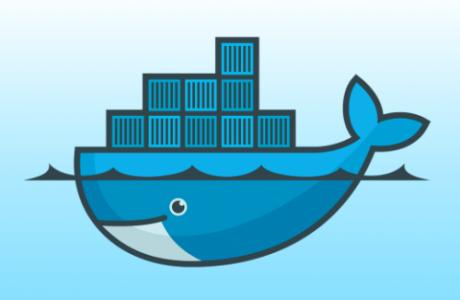

- 鲸鱼背上有集装箱

  ​	蓝色海洋 --- 宿主机系统

  ​	鲸鱼 ----- docker

  ​	集装箱 ----- 容器实例

#### 1.5总结
 - 解决了运行环境和配置问题软件容器,方便做持续集成并有助于整体发布的容器虚拟化技术.


### 2.docker能做什么?

- 之前的虚拟机技术:

  - 虚拟机(virtual machine)就是带环境安装的一种解决方案。 它可以在一种操作系统里面运行另一种操作系统，比如在Windows系统里面运行Linux系统。应用程序对此亳无感知，因为虚拟机看上去跟真实系统一模一样，而对于底层系统来说，虚拟机就是一个普通文件，不需要了就删掉，对其他部分毫无影响。这类虚拟机完美的运行了另一套系统，能够使应用程序，操作系统和硬件三者之间的逻辑不变。  

    ```mermaid
    graph TB
    classDef de fill:#f30,stroke:#333,stroke-width:4px;
    classDef de1 fill:#9f6,stroke:#333,stroke-width:4px;
    classDef de2 fill:#f90,stroke:#333,stroke-width:4px;
    
    subgraph docker 虚拟机
    	a[app]
    	b[app]
    	c[app ...]
    	d[Libraries]
    	e[Kernel]
    end
    
    class a,b,c de2
    class d de
    class e de1
    
    ```

    - 缺点:
      - 资源占用多
      - 冗余步骤多
      - 启动慢

- 容器虚拟化技术:

  - 由于前面虚拟机存在这些缺点，Linux发展出了另一种虚拟化技术: Linux容器(Linux Containers, 缩写为LXC)。

  - Linux容器不是模拟一个完整的操作系统，而是对进程进行隔离。有了容器，就可以将软件运行所需的所有资源打包到一个隔离的容器中。容器与虚拟机不同，不需要捆绑一整套操作系统，只需要软件工作所需的库资源和设置。系统因此而变得高效轻量并保证部署在任何环境中的软件都能始终如一地运行。

    ```mermaid
    graph TB
    classDef de fill:#f30,stroke:#333,stroke-width:4px;
    classDef de1 fill:#9f6,stroke:#333,stroke-width:4px;
    classDef de2 fill:#f90,stroke:#333,stroke-width:4px;
    
    subgraph docker 容器虚拟化技术
    	subgraph 
    	 A1[app]
    	 B1[libraries]
    	end
    	C[kernel]
    	subgraph 
    	A2[app]
    	B2[libriraes]
    	end
    end
    
    class A1,A2 de2
    class B1,B2 de
    class C de1
    
    ```

  - Docker 和传统虚拟化方式的不同之处: 
     - 传统虚拟机技术是虚拟出一套硬件后，在其上运行一个完整操作系统，在该系统上再运行所需应用进程.
     - 容器内的应用进程直接运行于宿主的内核，容器内没有自己的内核，而且也没有进行硬件虚拟。因此容器要比传统虚拟机更为轻便。
     - 每个容器之间互相隔离，每个容器有自己的文件系统，容器之间进程不会相互影响，能区分计算资源。

-------------

- 开发/运维(DevOps):一次构建,随处运行
   - 更具啊的应用交付和部署
    - 更便捷的升级和扩缩性
    - 更简单的系统运维
    - 更高效的技算资源利用

--------------
- 企业级运用:

  - 微博

    
    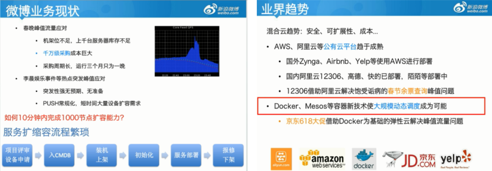


  - 美团

    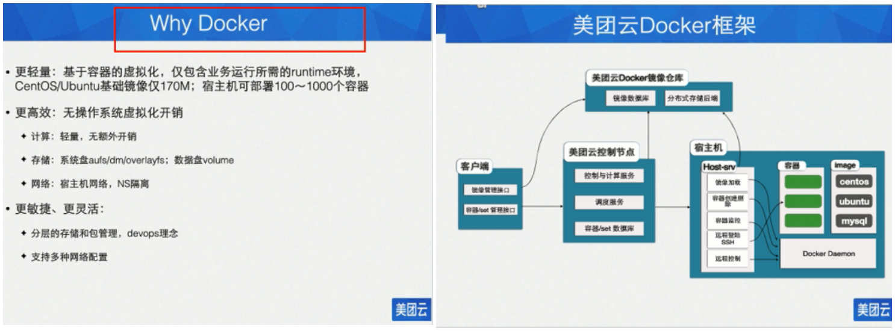


### 3.去哪儿下载

- 官网:
  - docker官网:https://www.docker.com/
  - docker中文网站:https://www.docker-cn.com/
- 仓库:
  - docker hub:https://hub.docker.com/


-----------------


## 二.Docker安装

### 1.前提条件

- Docker.支持以下的CentOS版本:CentOS 7 (64-bit)

- CentOS 6.5 (64-bit) 或更高的版本

- 前提条件

  - 目前，CentOS仅发行版本中的内核支持Docker。
  - Docker运行在CentOS 7上，要求系统为64位、系统内核版本为3.10以上。
  - Docker运行在CentOS-6.5或更高的版本的CentOS上，要求系统为64位、系统内核版本为2.6.32-431或者更高版本。

- 查看自己的内核

  - uname命令用于打印当前系统相关信息(内核版本号、硬件架构、主机名称和操作系统类型等)。

    ```shell
     uname -r
     cat /etc/redhat-release
    ```

    

### 2.docker的基本组成

- docker的架构图

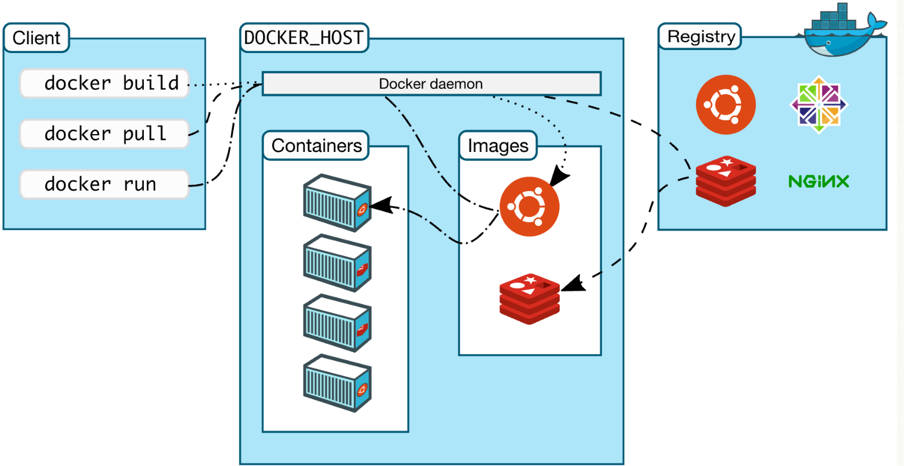


  - 镜像

    - Docker镜像(lmage) 就是一个只读的模板。镜像可以用来创建Docker容器,一个镜像可以创建很多容器

    - 镜像和容器的关系类似类与对象的关系:

        | Docker | 面向对象 |
        | ------ | -------- |
        | 容器   | 对象     |
        | 镜像   | 类       |

      

  - 容器

       - Docker利用容器(Container) 独立运行的一个或一组应用。容器是用镜像创建的运行实例。

       - 它可以被启动、开始、停止、删除。每个容器都是相互隔离的、保证安全的平台。 

       - 可以把容器看做是一个简易版的Linux环境(包括root用户权限、进程空间、用户空间和网络空间等)和运行在其中的应用程序。

       - 容器的定义和镜像几乎一模一样，也是一堆层的统一视角， 唯一区别在于容器的最上面那一层是可读可写的。


- 仓库

   - 仓库(Repository) 是集中存放镜像文件的场所。  
   - 仓库(Repository)和仓库注册服务器(Registry) 是有区别的。仓库注册服务器上往往存放着多个仓库，每个仓库中又包含了多个镜像，每个镜像有不同的标签(tag)。  
   - 仓库分为公开仓库(Public) 和私有仓库(Private) 两种形式。最大的公开仓库是Docker Hub(https://hub.docker.com),   存放了数量庞大的镜像供用户下载。国内的公开仓库包括阿里云、网易云等  


- 总结
    - 仓储/镜像/容器的概念:
        -  Docker本身是一个容器运行载体或称之为管理引擎。我们把应用程序和配置依赖打包好形成一个可交付的运行环境，这个打包好的运行环境就似乎image镜像文件。只有通过这个镜像文件才能生成Docker容器。image文件可以看作是容器的模板。Docker根据image文件生成容器的实例。同一个image文件，可以生成多个同时运行的容器实例。
        - image文件生成的容器实例，本身也是一个文件，称为镜像文件。
        - 一个容器运行一种服务，当我们需要的时候，就可以通过docker客户端创建一个对应的运行实例，也就是我们的容器
        - 至于仓储，就是放了一堆镜像的地方，我们可以把镜像发布到仓储中，需要的时候从仓储中拉下来就可以了。

### 3.安装步骤

- CentOS6

  - `yum install -y epel-release`   (Docker使用EPEL发布, RHEL系的OS首先要确保持有EPEL仓库,否則先检査〇S的版本,然后安装相应的EPEL包。)  
  - `yum install -y docker-io` (安装)
  - 安装后的配置文件: `/etc/sysconfig/docker`
  - 启动Docker后台服务: `service docker start`
  - `docker version` 验证

- CentOS7

  - 参考官方文档:https://docs.docker.com/install/linux/docker-ce/centos/

  - 1.安装所需的包。`yum-utils`提供了`yum-config-manager` 效用，并`device-mapper-persistent-data`和`lvm2`由需要`devicemapper`存储驱动程序。 

    ```shell
    sudo yum install -y yum-utils device-mapper-persistent-data lvm2
    ```

  - 2.使用以下命令设置**稳定**存储库。即使您还想从**边缘**或**测试**存储库安装构建，您始终需要**稳定的**存储 库。(<font color="red">大坑:改成阿里云或网易云</font>)

    ```shell
     sudo yum-config-manager --add-repo https://download.docker.com/linux/centos/docker-ce.repo 
    ```

  - 3.安装*最新版本*的Docker CE 

    ```shell
    sudo yum install docker-ce
    ```

  - 启动 docker

    ```shell
     systemctl start docker
    ```

  - `docker`通过运行`hello-world` 镜像验证是否已正确安装。 

    ```shell
    sudo docker run hello-world
    ```


### 4.使用和优化

- 使用
  - run:  docker run xxx
- 优化
  - 阿里云加速:
  - 网易云加速:

### 5.底层原理

- Docker如何运行 

  - Docker是一个Client-Server结构的系统，Docker守护 进程运行在主机上，然后通过Socket连接从客户端访问，守护进程从客户端接受命令并管理运行在主机上的容器。容器，是一个运行时环境，就是我们前面说到的集装箱。 

    ```mermaid
    graph TD
    classDef de fill:#f30,stroke:#333,stroke-width:4px;
    classDef de1 fill:#9f2,stroke:#333,stroke-width:4px;
    classDef de2 fill:#f92,stroke:#333,stroke-width:4px;
    a1[client]
    a2[clinet]
    a3[....]
    subgraph 运行主机
    	b[后台守护进程]
    	subgraph Docker容器
            c1[tomcat]
            c2[spark]
            c3[mysql]
    	end
    end
    
    a1 --> b
    a2 --> b
    a3 --> b
    
    b --> c1
    b --> c2
    b --> c3
    
    
    class a1,a2,a3 de2
    class b de1
    class c1,c2,c3 de
    
    ```

    

- Docker比VM块

  - (1)docker有着比虚拟机更少的抽象层。由亍docker不需要Hypervisor实现硬件资源虚拟化,运行在docker容器上的程序直接使用的都是实际物理机的硬件资源。因此在CPU、内存利用率上docker将会在效率上有明显优势。

  - (2)docker利用的是宿主机的内核,而不需要Guest OS。因此，当新建一个容器时,docker不需要和虚拟机一样重新加载一个操作系统内核。仍而避免引寻、加载操作系统内核返个比较费时费资源的过程，当新建一个虚拟机时,虚拟机软件需要加载GuestOS,返个新建过程是分钟级别的。而docker由于直接利用宿主机的操作系统，则省略了返个过程，因此新建一个docker容器只需要几秒钟。     

      | #          | Docker容器              | 虚拟机(VM)                  |
      | ---------- | ----------------------- | --------------------------- |
      | 操作系统   | 与宿主机共享0S          | 宿主机OS上运行虚拟机OS      |
      | 存储大小   | 镜像小，便于存储与传输  | 镜像庞大(vmdk、vdi等)       |
      | 运行性能   | 几乎无额外性能损失      | 操作系统额外的CPU、内存消耗 |
      | 移植性     | 轻便、灵活，适应于Linux | 笨重，与虚拟化技术耦合度高  |
      | 硬件亲和性 | 面向软件开发者          | 面向硬件运维者              |

- dokcer容器

    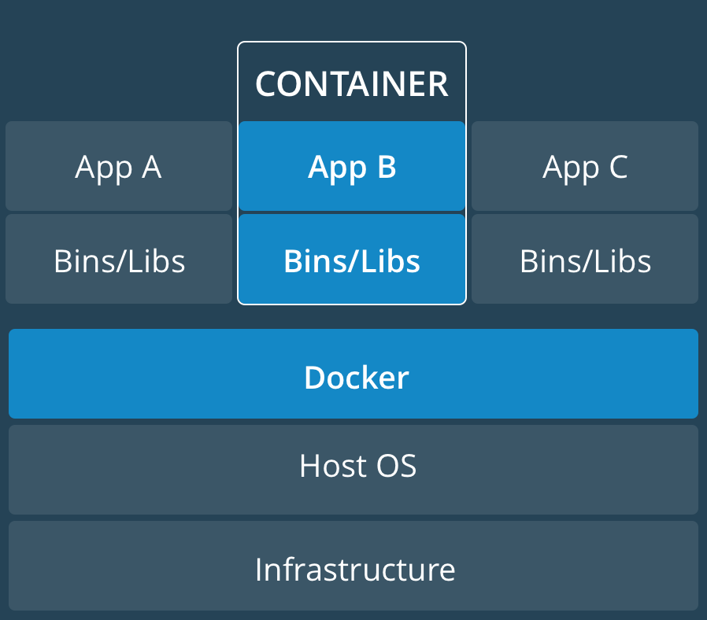

- 虚拟机

    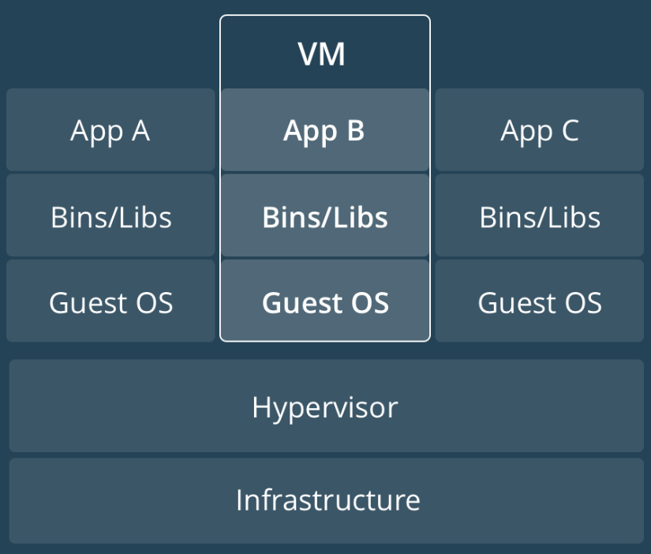


-----------------


## 三.Docker常用命令

### 1.帮助命令

- docker version [查看版本]
- docker info   [查看详情]
- docker --help [查看相关命令使用]

### 2.镜像命令

- 列出主机上的镜像:`docker images [options]` 
    - 各个选项说明:
        - REPOSITORY:   表示镜像的仓库源
        - TAG: 镜像的标签
        - IMAGE ID:镜像ID
        - CREATED:镜像创建时间
        - SIZE: 镜像大小
      - 同一仓库源可以有多个TAG，代表这个仓库源的不同个版本，我们使用REPOSITORY:TAG来定义不同的镜像。如果你不指定一个镜像的版本标签，例如你只使用ubuntu, docker将默认使用ubuntu:latest镜像

    - options说明:

      - -a :列出本地所有的镜像(含中间映像层) 
      - -q:只显示镜像ID
      - --digests:显示镜像的摘要船息
      - --no-trunc :显示完整的镜像信息

      

- 搜索镜像: `docker search xxx镜像的名字` 
    - 网站 https://hub.docker.com 

    - 命令:
      - docker search [OPTIONS] 镜像名字 
      - OPTIONS说明:
        - --no-trunc : 显示完整的镜像描述 命令   

        - -s:列出收藏数不小于指定值的镜像。 

        - -- automated:只列出automated build类型的镜像

- 下载镜像:`docker pull xxx` 
  - docker pull 镜像名字[:TAG]


- 删除镜像: `docker rmi  xxx镜像名字ID` 
  - 删除单个 docker rmi  -f 镜像ID 
  - 删除多个 docker rmi -f 镜像名1:TAG 镜像名2:TAG [例子: docker rmi -f hello-world nginx]
  - 删除全部 docker rmi -f $(docker images -qa)   


### 3.容器命令

- 新建并启动容器: `docker run [OPTIONS] IMAGE [COMMAND][ ARG...]`

  - 例如: docker run -it asdaswew

  - OPTIONS说明(常用) :有些是一个减号，有些是两个减号   
      - --name="容器新名字":为容器指定一一个名称;   
      - -d:后台运行容器，并返回容器ID，也即启动守护式容器;
      - -i: 以交互模式运行容器，通常与-t同时使用;   
      - -t:为容器重新分配一个伪输入终端，通常与-i同时使用;
      - -P:随机端口映射;  
      - -p:指定端口映射，有以下四种格式   
        - ip:hostPort:containerPort
        - ip::containerPort    
        - hostPort:containerPort
        - containerPort   

- 列出当前所有正在运行的容器:`docker ps [OPTIONS]`

  -  OPTIONS说明(常用) 
       - -a :列出当前所有正在运行的容器+历史上运行过的
       - -l:显示最近创建的容器。
       - -n:  显示最近n个创建的容器。
       - -q :静默模式，只显示容器编号。 
       - --no-trunc :不截断输出  

- 退出容器

  - exit:容器停止退出
  - ctrl+P+Q:容器不停止退出

- 启动

  - docker start 容器id 或 容器名

- 重启

  - docker restart 容器id 或 容器名

- 停止

  - docker stop  容器id 或 容器名

- 强制停止

  - docker kill 容器id 或 容器名

- 删除已停止的

  - docker rm 容器id
  - 一次性删除多个容器
      - docker rm -f $(docker ps -a -q) 
      - docker ps -a -q | xargs docker rm   


- **重点**

  - 启动守护式容器  docker run -d 容器名
       -  使用镜像centos:latest 以后台模式启动一个容器 docker run -d centos   问题:然后docker ps -a进行查看，会发现容器已经退出
       -  很重要的要说明的一点: Docker容器后台运行,就必须有一个前台进程.   容器运行的命令如果不是那些一直挂起的命令 (比如运行top, tail) ，就是会自动退出的。   
       -  这个是docker的机制问题,比如你的web容器，我们以nginx为例，正常情况下，我们配置启动服务只需要启动响应的service即可。例如service nginx start   但是,这样故,nginx为后台进程模式运行,就导致docker前台没有运行的应用，这样的容器后台启动后，会立即自杀因为他觉得他没事可做了.所以，最佳的解决方案是，将你要运行的程序以前台进程的形式运行    

  - 查看容器日志
     -  docker logs -f -t --tail 容器ID 或 容器名
     -  例子: docker logs -f -t --tail 3   e4
          -  -t:加入时间戳
          -  -f:更随最新的的日志打印
          -  --tail:数字 显示最后多少条

  - 查看容器内运行的进程
     -  docker top 容器id 或 容器名字

  - 查看容器内部细节
     -  docker inspect 容器id

  - 进入正在运行的容器并以命令行交互

       - ①docker exec -it 容器id bashshell

            - 例子: docker exec -it e49bfba4816f /bin/bash

                 ​	  docker exec -t e49bfba4816f ls -l /tmp      

       - ②重新进入docker attach 容器id

       - 两者区别:

            -  attach 直接进入容器启动命令的终端,不会启动新的进程
            -  exec 实在容器中打开新的终端,并且可以启动新的进程

  - 从容器内拷贝文件到主机上

       -  docker cp 容器id:容器内路径   目的主机路径
            -  例子: docker cp e49bfba4816f :/tmp/yum.log  /root

- 4.总结------常用命令

  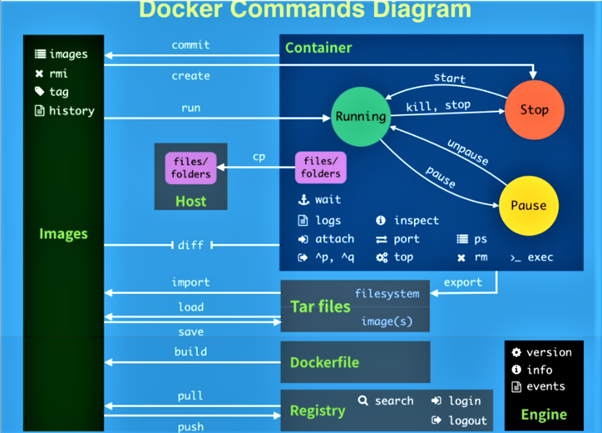


| 命令    | 描述                                                         | 中文描述                                                     |
| ------- | ------------------------------------------------------------ | ------------------------------------------------------------ |
| attach  | Attach to a running container                                | 当前shell下attach连接指定运行镜像                            |
| build   | Build an image from a Dockerfile                             | 通过Dockerfile定制镜像                                       |
| commit  | Create a new image from a container changes                  | 提交当前容器为新的镜像                                       |
| cp      | Copy files/folders from the containers filesystem to the host path | 从容器中拷贝指定文件或者目录到宿主机中                       |
| create  | Create a new container                                       | 创建一个新的容器，同run，但不启动容器                        |
| diff    | nspect changes on a container's filesystem                   | 查看docker容器变化                                           |
| events  | Get real time events from the server                         | 从docker服务获取容器实时事件                                 |
| exec    | Run a command in an existing container                       | 在已存在的容器上运行命令                                     |
| export  | Stream the contents of a container as a tar archive          | 导出容器的内容流作为一个 tar归档文件[对应import]             |
| history | Show the history of an image                                 | 展示一个镜像形成历史                                         |
| images  | List images                                                  | 列出系统当前镜像                                             |
| import  | Create a new filesystem image from the contents of a tarball | 从tar包中的内容创建一个新的文件系统映像[对应export]          |
| info    | Display system-wide information                              | 显示系统相关信息                                             |
| inspect | Return low-level information on a container                  | 查看容器详细信息                                             |
| kill    | Kill a running container                                     | kill指定docker容器                                           |
| load    | Load an image from a tar archive                             | 从一个tar包中加载一一个镜像[对应save]                        |
| login   | Register or Login to the docker registry server              | 注册或者登陆一个docker源服务器                               |
| logout  | Log out from a Docker registry server                        | 从当前Docker registry退出                                    |
| logs    | Fetch the logs of a container                                | 输出当前容器日志信息                                         |
| port    | Lookup the public-facing port which is NAT-ed to PRIVATE_ PORT | 查看映射端口对应的容器内部源端口                             |
| pause   | Pause all processes within a container                       | 暂停容器                                                     |
| ps      | List containers                                              | 列出容器列表                                                 |
| pull    | Pull an image or a repository from the docker registry server | 从docker镜像源服务器拉取指定镜像或者库镜像                   |
| push    | Push an image or a repository to the docker registry server  | 推送指定镜像或者库镜像至docker源服务器                       |
| restart | Restart a running container                                  | 重启运行的容器                                               |
| rm      | Remove one or more containers                                | 移除一个或者多个容器                                         |
| rmi     | Remove one or more images                                    | 移除一个或多个镜像[无容器使用该镜像才可删除，否则需删除相关容器才可继续或 -f 强制删除] |
| run     | Run a command in a new container                             | 创建一个新的容器并运行一个命令                               |
| save    | Save an image to a tar archive                               | 保存一个镜像为一个tar包[对应load]                            |
| search  | Search for an image on the Docker Hub                        | 在dockerhub中搜索镜像                                        |
| start   | Start a stopped containers                                   | 启动容器                                                     |
| stop    | Stop a running containers                                    | 停止容器                                                     |
| tag     | Tag an image into a repository                               | 给源中镜像打标签                                             |
| top     | Lookup the running processes of a container                  | 查看容器中运行的进程信息                                     |
| unpause | Unpause a paused container                                   | 取消暂停容器                                                 |
| version | Show the docker version information                          | 查看docker版本号                                             |
| wait    | Block until a container stops, then print its exit code      | 截取容器停止时的退出状态值                                   |


-------


## 四.Docker镜像

### 1.是什么?

<font color="#00ff">**镜像是一种轻量级、可执行的独立软件包，用来打包软件运行环境和基于运行环境开发的软件，它包含运行某个软件所需的所有内容,包括代码、运行时、库、环境变量和配置文件。**</font>

- UnionFS (联合文件系统) 
  - UnionFS (联合文件系统) : Union文件系统(UnionFS) 是一种分层、轻量级并且高性能的文件系统，它支持对文件系统的修改作为一次提交来一层层的叠加，同时可以将不同目录挂载到同一个虚拟文件系统下(unite several directories into a single virtualfilesystem)。Union 文件系统是Docker镜像的基础。镜像可以通过分层来进行继承，基于基础镜像(没有父镜像)，可以制作各种具体的应用镜像。
  - 特性:一次同时加载多个文件系统，但从外面看起来，只能看到一个文件系统，联合加载会把各层文件系统叠加起来，这样最终的文件系统会包含所有底层的文件和目录
- Docker镜像加载原理: 
  - docker的镜像实际上由一层一层的文件系统组成，这种层级的文件系统UnionFS。

  - bootfs(boot file system)主要包含bootloader和kernel, bootloader主要是引导加载kernel, Linux刚启动时会加载bofs文件系统，在Docker镜像的最底层是bootfs。 这一层与我们典型的Linux/Unix系统是一样的，包含boot加载器和内核。当boot加载完成之后整个内核就都在内存中了，此时内存的使用权已由bootfs转交给内核， 此时系统也会卸载bootfs。

  - rootfs (root file system)，在bootfs之上。包含的就是典型Linux系统中的/dev, /proc, /bin, /etc等标准目录和文件。rootfs就是各种不同的操作系统发行版，比如Ubuntu, Centos等等。

  - `平时我们安装进虚拟机的CentOS都是好几个G，为什么docker这 里才200M?`
    - 对于一个精简的OS，rootfs可以很小，只需要包括最基本的命令、工具和程序库就可以了，因为底层直接用Host的kernel,自己只需要提供rootfs就行了。由此可见对于不同的linux发行版，bootfs基本是一致的，rootfs会有差别,因此不同的发行版可以公用bootfs。   

  - `tomcat为什么那么大 ?`   一层又一层

    ```mermaid
    graph TB
    classDef de1 fill:#9f2,stroke:#333,stroke-width:4px;
    subgraph Docker
    	subgraph tomcat
    		subgraph jdk8
    			subgraph centos
    				a[kernel]
    			end
    		end
    	end	
    end
    class a de1
    ```


- 分层的镜像
  - 在下载的过程中我们可以看到一层层的在下载
- 为什么Docker镜像要采用这种分层结构
  - 最大的一个好处就是一共享资源 
    - 比如:有多个镜像都从相同的base镜像构建而来，那么宿主机只需在磁盘上保存一份base镜像， 同时内存中也只需加载一份base镜像，就可以为所有容器服务了。而且镜像的每一层都可以被共享。   

### 2.特点

<font color="#00ff">**Docker镜像都是只读的当容器启动时，一个新的可写层被加载到镜像的顶部。 这一层通常被称作“容器层”，“容器层”之下的都叫"镜像层”。**   </font>

### 3.docker镜像commit操作

- docker commit提交容器副本使之成为一个新的镜像   

- docker commit  -m=“提交的描述信息” -a=“作者” 容器ID 要创建的目标镜像名:[标签名]   

- 案例

  - 1.从Hub上下载tomcat镜像到本地并成功运行

  - 2.故意删除上一步镜像生产tomcat容器的文档

    - 命令: 
      -  进入到容器中: docker exec -it  容器id  /bin/bash 
      -  进入到目录中: cd webapps/
      -  删除docs : rm -rf docs

  - 3.即当前的tomcat运行实例是一个没有文档内容的容器,   以它为模板commit一 个没有doc的tomcat新镜像hanguixian/tomcat001 ----> 命名空间

    - 命令:  docker commit -a="mmhh" -m="tomcat without docs" 200e52fdf06d hanguixian/tomcat001:0.1

    - 效果:产生一个镜像: docker images 

        | REPOSITORY           | TAG  | IMAGE ID     | CREATED        | SIZE  |
        | -------------------- | ---- | ------------ | -------------- | ----- |
        | hanguixian/tomcat001 | 0.1  | d5738d710d02 | 14 seconds ago | 463MB |

    

  - 启动我们的新镜像并和原来的对比

    - 很明显我们修改后的没有docs,而原来的是存在的


-------


## 五.Docker容器数据卷

### 1.是什么

- Docker的理念: 
  - 将运用与运行的环境打包形成容器运行，运行可以伴随着容器，但是我们对数据的要求希望是持久化的
  - 容器之间希望有可能共享数据  
- Docker容器产生的数据，如果不通过docker commit生成成新的镜像，使得数据做为镜像的一部分保存下来，那么当容器删除后，数据自然也就没有了。 为了能保存数据在docker中我们使用卷。  

### 2.能做什么

- 卷就是目录或文件，存在于一一个或多个容器中，由docker挂载到容器，但不属于联合文件系统，因此能够绕过Union File System提供些用于持续存储或共享数据的特性
- 卷的设计目的就是数据的持久化，完全独立于容器的生存周期，因此Docker不会在容器删除时删除其挂载的数据卷
- 特点: 
  - 1.数据卷可在容器之间共享或重用数据
  - 2.卷中的更改可以直接生效 
  - 3.数据卷中的更改不会包含在镜像的更新中 
  - 4.数据卷的生命周期一直持续到没有容器使用它为止

- 容器的持久化
- 容器间继承+共享数据

### 3.数据卷

- 容器内添加

  - 直接命令添加

    - 命令: docker run -it  -v /宿主机绝对路径目录:/容器内目录  镜像名

      - 例子: docker run -it -v /myDataVolume:/dataVolumeContainer centos

    - 查看数据卷是否挂载成功

      - 使用 docker inspect 容器id  

          ```json
          
           "Mounts": [
                      {
                          "Type": "bind",
                          "Source": "/myDataVolume",
                          "Destination": "/dataVolumeContainer",
                          "Mode": "",
                          "RW": true,
                          "Propagation": "rprivate"
                      }
               	  ]
           "HostConfig": {
                      "Binds": [
                          "/myDataVolume:/dataVolumeContainer"
           			],
                      "省略":[
                          "....../省略"
                       ]
          		}
          ```

    - 容器和宿主机之间数据共享

      - 在宿主机中创建文件,在容器中修改该文件,可以看到文件同步
        - 命令: touch a.txt  vim a.txt

    - 容器停止退出后，主机修改后数据是否同步

      - 容器先停止-->主机修改文件-->容器重启进入-->查看主机修改过的文件-->内容同步

    - 命令(带权限) 

      -  docker run -it  -v /宿主机绝对路径目录:/容器内目录`:ro` 镜像名
      - 容器中,文件是只读状态,不能添加修改

  - DockerFile添加

    -  根目录下新建mydocker文件夹并进入

      - 命令 : mkdir /mydocker

    -  可在Dockerfile中使用VOLUME指令来给镜像添加一个或多个数据卷

      - VOLUME ["/dataVolumeContainer',"/dataVolumeContainer2","/dataVolumeContainer3"]
      - 说明:
        - 出于可移植和分享的考虑，用**-v 主机目录:容器目录**这种方法不能够直接在Dockerfile中实现。
        - 由于宿主机目录是依赖于特定宿主机的，并不能够保证在所有的宿主机上都存在这样的特定目录。

    - File构建

      - 在/mydocker下创建Dockerfile

      ```dockerfile
      #volume test
      FROM centos
      VOLUME ["/dataVolumeContainer1","/dataVolumeContainer2"]
      CMD echo "finished,------success"
      CMD /bin/bash
      ```

      - 相当于: 
        - docker run -it -v /host1:/dataVolumeContainer -v /host2:/dataVolumeContainer2 cnetos /bin/bash

    - build后生成镜像

      - 命令:  docker build -f /mydocker/DockerFile -t hanguixian/centos_u .

        ```shell
        [root@iZuf64yofkbhpt8m0ackshZ mydocker]# docker build -f /mydocker/DockerFile -t hanguixian/centos_u .
        Sending build context to Docker daemon  3.072kB
        Step 1/4 : FROM centos
         ---> 5182e96772bf
        Step 2/4 : VOLUME ["/dataVolumeContainer1","/dataVolumeContainer2"]
         ---> Using cache
         ---> be7f6ccf6f5e
        Step 3/4 : CMD echo "finished,------success"
         ---> Running in 92492c960ec4
        Removing intermediate container 92492c960ec4
         ---> 6c3c0ea2b54c
        Step 4/4 : CMD /bin/bash
         ---> Running in 053f5f238bf9
        Removing intermediate container 053f5f238bf9
         ---> ca21681a1ecb
        Successfully built ca21681a1ecb
        Successfully tagged hanguixian/centos_u:latest
        ```

      -  获得一个新镜像hanguixian/centos_u , run容器

        - docker images

          ```powershell
          [root@iZuf64yofkbhp8tm0ackshZ mydocker]# docker images 
          REPOSITORY           TAG       IMAGE ID            CREATED             SIZE
          hanguixian/centos_u  latest   ca21681a1ecb        2 minutes ago       200MB
          
          ```

        - `docker run -it hanguixian/centos_u`

          ```sh
          [root@iZuf64yofkbhp8tm0ackshZ mydocker]# docker run -it hanguixian/centos_u
          [root@26cf1a5a8757 /]# ll
          total 64
          -rw-r--r--   1 root root 12005 Aug  4 22:05 anaconda-post.log
          lrwxrwxrwx   1 root root     7 Aug  4 22:04 bin -> usr/bin
          drwxr-xr-x   2 root root  4096 Aug 27 07:44 dataVolumeContainer1
          drwxr-xr-x   2 root root  4096 Aug 27 07:44 dataVolumeContainer2
          drwxr-xr-x   5 root root   360 Aug 27 07:44 dev
          drwxr-xr-x   1 root root  4096 Aug 27 07:44 etc
          drwxr-xr-x   2 root root  4096 Apr 11 04:59 home
          lrwxrwxrwx   1 root root     7 Aug  4 22:04 lib -> usr/lib
          lrwxrwxrwx   1 root root     9 Aug  4 22:04 lib64 -> usr/lib64
          drwxr-xr-x   2 root root  4096 Apr 11 04:59 media
          drwxr-xr-x   2 root root  4096 Apr 11 04:59 mnt
          drwxr-xr-x   2 root root  4096 Apr 11 04:59 opt
          dr-xr-xr-x 148 root root     0 Aug 27 07:44 proc
          dr-xr-x---   2 root root  4096 Aug  4 22:05 root
          drwxr-xr-x  10 root root  4096 Aug  4 22:05 run
          lrwxrwxrwx   1 root root     8 Aug  4 22:04 sbin -> usr/sbin
          drwxr-xr-x   2 root root  4096 Apr 11 04:59 srv
          dr-xr-xr-x  13 root root     0 Aug 27 07:44 sys
          drwxrwxrwt   7 root root  4096 Aug  4 22:05 tmp
          drwxr-xr-x  13 root root  4096 Aug  4 22:04 usr
          drwxr-xr-x  18 root root  4096 Aug  4 22:04 var
          
          ```

          

    - 通过上述步骤，容器内的卷目录地址已经知道对应的主机目录地址哪?

      - docker inspect 26cf1a5a8757

        ```json
         },
                "Mounts": [
                    {
                        "Type": "volume",
                        "Name": "9a33a9f028e45e7410d0c908ccbcc496e1a321fa96d0781c3c61dac3c5c11f35",
                        "Source": "/var/lib/docker/volumes/9a33a9f028e45e7410d0c908ccbcc496e1a321fa96d0781c3c61dac3c5c11f35/_data",
                        "Destination": "/dataVolumeContainer1",
                        "Driver": "local",
                        "Mode": "",
                        "RW": true,
                        "Propagation": ""
                    },
                    {
                        "Type": "volume",
                        "Name": "0a98062cdb70ecfb32e040c668ed0e1528f0b409173275da4ad6f0c5e0322ac2",
                        "Source": "/var/lib/docker/volumes/0a98062cdb70ecfb32e040c668ed0e1528f0b409173275da4ad6f0c5e0322ac2/_data",
                        "Destination": "/dataVolumeContainer2",
                        "Driver": "local",
                        "Mode": "",
                        "RW": true,
                        "Propagation": ""
                    }
        
        ```

    - 主机对应默认地址

      - /var/lib/docker/volumes/9a33a9f028e45e7410d0c908ccbcc496e1a321fa96d0781c3c61dac3c5c11f35/_data

  - 备注
    -  Docker挂载主机目录Docker访问出现cannot open directory : Permission denied
    - 解决办法:在挂载目录后多加一个--privileged=true参数即可
    - 例如: docker run -it -v /myDataVolume:/dataVolumeContainer  --privileged=true centos

### 4.数据卷容器

- 是什么

  - 命名的容器挂载数据卷,其他容器通过挂载这个(父容器)实现数据共享,挂载数据卷的容器,称之为数据卷容器

- 简介

  -  以上一步新建的镜像hanguixian/centos_u为模板并运行容器dc01/dc02/dc03   
  - 它们已经具有容器卷
    - /dataVolumeContainer1   
    - /dataVolumeContainer2  

- 容器间传递共享(--volume-from)

  -  先启动一个父容器dc01

    - 命令: docker run -it --name doc1 hanguixian/centos_u
    - 在dataVolumeContainer2新增内容
      - cd dataVolumeContainer2
      - vi a.txt

  - dc02/dc03继承自dc01

    -  --volumes-from

    -   命令 

      - `docker run -it --name doc2 --volumes-from doc1 hanguixian/centos_u`

        ```shell
        [root@iZuf64yofkbhp8tm0ackshZ /]# docker run -it --name doc2 --volumes-from doc1 hanguixian/centos_u
        [root@ac3acc6567f3 /]# cd dataVolumeContainer2
        [root@ac3acc6567f3 dataVolumeContainer2]# ll
        total 4
        -rw-r--r-- 1 root root 7 Aug 27 08:19 a.txt
        ```

        - 可以看dataVolumeContainer2中有我们在doc1中创建的a.txt

      -  dc02/dc03分别在dataVolumeContainer2各自新增内容

  - 回到dc01可以看到02/03各自添加的都能共享

  - 删除dc01，dc02修改后dc03可否访问

    - 可以

  - 删除dc02后dc03可否访问

    - 可以

  - 新建dc04继承dc03后再删除dc03

    - 可以

  - **结论:容器之间配置信息的传递，数据卷的生命周期一直持续到没有容器使用它为止**

-------------


## 六.DockerFile解析

### 1.是什么

- Dockerfile是用来构建Docker镜像的构建文件， 是由一系列命令和参数构成的脚本。  

- 构建三步骤

  - 1.编写DokcerFile文件
  - 2.docker build
  - 3.docker run

- 文件什么样?

  ```dockerfile
  FROM scratch
  MAINTAINER https://github.com/CentOS/sig-cloud-instance-images
  ADD centos-7-docker.tar.xz /
  
  LABEL name="CentOS Base Image" \
      vendor="CentOS" \
      license="GPLv2" \
      build-date="20161214"
  
  CMD ["/bin/bash"]
  ```

  

### 2.DockerFile构建过程解析

- Dockerfile内容基础知识
  - 每条保留字指令都必须为大写字母且后面要跟随至少一个参数\
  - 指令按照从上到下，顺序执行
  - #表示注释
  - 每条指令都会创建一个新的镜像层，并对镜像进行提交

- docker执行Dockerfile的大致流程
  - (1) docker从基础镜像运行一个容器
  - (2)执行一条指令并对容器作出修改 
  - (3) 执行类似docker commit的操作提交一个新的镜像层
  - (4) docker再基于刚提交的镜像运行一个新容器
  - (5) 执行dockerfile中的下一条指令直到所有指令都执行完成   

- 总结

  - 从应用软件的角度来看，Dockerfile、 Docker镜像与Docker容器分别代表软件的三个不同阶段

    -  Dockerfile是软件的原材料Docker镜像是软件的交付品
    -  Docker容器则可以认为是软件的运行态。

  - Dockerfile面向开发，Docker镜像成为交付标准，Docker容器则涉及部署与运维，三者缺一不可，合力充当Docker体系的基石。

    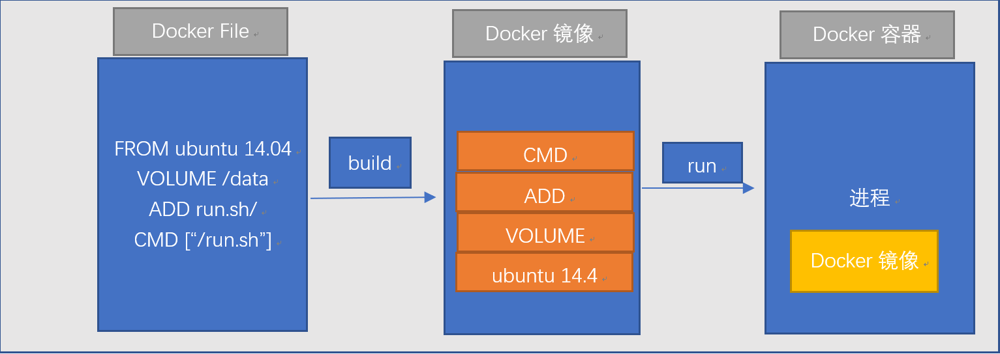

    -  1 Dockerfile, 需要定义一个Dockerfile, Dockerfile定义了进程需要的一切东西。Dockerfile涉及的内容包括执行代码或者是文件、环境变量、依赖包、运行时环境、动态链接库、操作系统的发行版、服务进程和内核进程(当应用进程需要和系统服务和内核进程打交道，这时需要考虑如何设计namespace的权限控制)等等;
    -  2 Docker镜像，在用Dockerfile定义一个文件之后，docker build时会产生一个Docker镜像， 当运行Docker镜像时，会真正开始提供服务;
    -  3 Docker容器，容器是直接提供服务的。

    

### 3.DockerFile体系结构(保留字指令)

- `FROM`  基础镜像，当前新镜像是基于哪个镜像的   

- `MAINTAINER` 镜像维护者的姓名和邮箱地址   

- `RUN`  容器构建时需要运行的命令

- `EXPOSE`  当前容器对外暴露出的端口   

- `WORKDIR`  指定在创建容器后，终端默认登陆的进来工作目录，一个落脚点   

- `ENV`  用来在构建镜像过程中设置环境变量口   

  - ENV MY_ PATH /usr/mytest 这个环境变量可以在后续的任何RUN指令中使用，这就如同在命令前面指定了环境变量前缀一样; 也可以在其它指令中直接使用这些环境变量， 比如: WORKDIR $MY_ PATH  

- `ADD`  将宿主机目录下的文件拷贝进镜像且ADD命令会自动处理URL和解压tar压缩包   

- `COPY`

    - 类似ADD，拷贝文件和目录到镜像中。  
    - 将从构建上下文目录中<源路径>的文件/目录复制到新的一层的镜像内的<目标路径>位置
      - COPY src dest   COPY     
      - COPY ["sre", "dest"]   

- `VOLUME`  容器数据卷，用于数据保存和持久化工作   

- `CMD `

  - 指定一个容器启动时要运行的命令  
    - CMD容器启动命令:CMD指令的格式和RUN相似,也是两种格式
      - shell 格式: CMD<命令>
      - exec 格式: CMD ["可执行文件","参数1","参数2",...]
      - 参数列表: CMD ["参数1","参数2",..] ,在指定了ENTRYPOINT指令后,用CMD指定具体的参数
  - Dockerfile中可以有多个CMD指令，但只有最后一个生效，CMD会被docker run之后的参数替换   

- `ENTRYPOINT`

  - 指定一个容器启动时要运行的命令   
  - ENTRYPOINT的目的和CMD一样，都是在指定容器启动程序及参数   

- `ONBUILD` 当构建一个被继承的Dockerfle时运行命令，父镜像在被子继承后父镜像的onbuild被触发

- 总结

  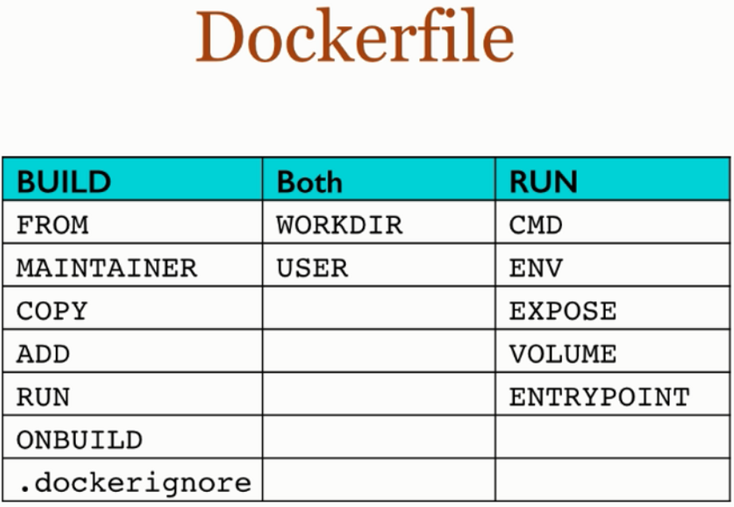

### 4.案例

#### 4.1Base镜像scratch

- Dokcer hub中99%的镜像都是在base镜像中安装和配置需要的软件构建出来的

#### 4.2自定义镜像mycentos

- 编写

  - Hub默认Centos镜像什么情况

    - 初始化centos运行该镜像进入是默认路径是/
    - 默认不支持vim
    - 默认不支持ifconfig

  - 准备编写DokcerFile文件

    - 自定义mycentos目的,使我们的自己的镜像具备如下:
      - 登陆后的默认路径
      - vim编辑器
      - ifconfig查询网络配置
    - 创建文件并编辑: `vim DockerFile2`

  - myCentOS内容DokcerFile

    ```dockerfile
    FROM centos
    MAINTAINER hanguixian<hn_hanguixain@163.com>
    ENV MYPATH /usr/local
    WORKDIR $MYPATH
    RUN yum -y install vim
    RUN yum -y install net-tools
    EXPOSE 80
    CMD echo $MYPATH
    CMD echo "success--------------ok"
    CMD /bin/bash
    
    ```

    

- 构建

  - 命令: `docker build -f /mydocker/DockerFile2  -t mycentos:1.3 .`

  - 查看: `docker images`

    ```shell
    [root@iZuf64yofkbhp8tm0ackshZ mydocker]# docker images
    REPOSITORY          TAG                 IMAGE ID            CREATED              SIZE
    mycentos            1.3                 d70dd7d1c9d0        About a minute ago   371MB
    centos              latest              5182e96772bf        3 weeks ago          200MB
    
    ```

    - 可以看到有了mycentos镜像,同时和原来的centos镜像大小有了明显的区别

- 运行

  - 命令: dcoker run -it mycnetos:1.3

    ```bash
    [root@iZuf64yofkbhp8tm0ackshZ mydocker]# docker run -it mycentos:1.3
    [root@9f936361751f local]# pwd
    /usr/local
    
    ```

  - 可以看到默认的路径是:/usr/local

  - 验证vim,ifconfig,可以看到我们修改的镜像

- 列出镜像的变更历史

  - 命令 : docker history 镜像名或镜像IMAGE ID

    - 例子:docker history d70dd7d1c9d0 或 docker history mycentos:1.3

```bash
[root@iZuf64yofkbhp8tm0ackshZ mydocker]# docker history mycentos:1.3
IMAGE               CREATED             CREATED BY                                      SIZE
d70dd7d1c9d0        25 minutes ago      /bin/sh -c #(nop)  CMD ["/bin/sh" "-c" "/bin…   0B         
fa82ffb7c68b        25 minutes ago      /bin/sh -c #(nop)  CMD ["/bin/sh" "-c" "echo…   0B         
353215faa466        25 minutes ago      /bin/sh -c #(nop)  CMD ["/bin/sh" "-c" "echo…   0B         
34a9a9b7c41d        25 minutes ago      /bin/sh -c #(nop)  EXPOSE 80                    0B         
8803a34e02ea        25 minutes ago      /bin/sh -c yum -y install net-tools             22.4MB     
0effdb62c656        25 minutes ago      /bin/sh -c yum -y install vim                   149MB       
5a83aca44197        25 minutes ago      /bin/sh -c #(nop) WORKDIR /usr/local            0B         
e8b15471d355        26 minutes ago      /bin/sh -c #(nop)  ENV MYPATH=/usr/local        0B         
d99ee0589704        26 minutes ago      /bin/sh -c #(nop)  MAINTAINER hanguixian<hn_…   0B         
5182e96772bf        3 weeks ago         /bin/sh -c #(nop)  CMD ["/bin/bash"]            0B         
<missing>           3 weeks ago         /bin/sh -c #(nop)  LABEL org.label-schema.sc…   0B         
<missing>           3 weeks ago         /bin/sh -c #(nop) ADD file:6340c690b08865d7e…   200MB
```


#### 4.3CMD/ENTRYPOINT 镜像案例

- 都是指定一个容器启动时要运行的命令

- CMD
  - Dockerfile中可以有多个CMD指令,但只有最后一个生效，CMD会被`docker run`之后的参数替换

  - 如tomcat:dockerfile最后有: `CMD ["catalina.sh", "run"]` 

    - 我们用: `docker run -it -p 7777:80 tomcat` 能启动tomcat,可以看到打印的日志

    - 如果使用: `docker run -it -p 7777:80 tomcat ls -l` tomcat没有启动起来

      ```bash
      [root@iZuf64yofkbhpt8m0ackshZ mydocker]# docker run -it -p 7777:80 tomcat ls -l
      total 152
      -rw-r----- 1 root root  19533 Aug 12 08:23 BUILDING.txt
      -rw-r----- 1 root root   6090 Aug 12 08:23 CONTRIBUTING.md
      -rw-r----- 1 root root  57092 Aug 12 08:23 LICENSE
      -rw-r----- 1 root root   1726 Aug 12 08:23 NOTICE
      -rw-r----- 1 root root   3255 Aug 12 08:23 README.md
      -rw-r----- 1 root root   7140 Aug 12 08:23 RELEASE-NOTES
      -rw-r----- 1 root root  16262 Aug 12 08:23 RUNNING.txt
      drwxr-x--- 2 root root   4096 Aug 23 00:47 bin
      drwx--S--- 2 root root   4096 Aug 12 08:23 conf
      drwxr-sr-x 3 root staff  4096 Aug 23 00:47 include
      drwxr-x--- 2 root root   4096 Aug 23 00:47 lib
      drwxr-x--- 2 root root   4096 Aug 12 08:20 logs
      drwxr-sr-x 3 root staff  4096 Aug 23 00:47 native-jni-lib
      drwxr-x--- 2 root root   4096 Aug 23 00:47 temp
      drwxr-x--- 7 root root   4096 Aug 12 08:21 webapps
      drwxr-x--- 2 root root   4096 Aug 12 08:20 work
      [root@iZuf64yofkbhpt8m0ackshZ mydocker]# docker ps
      CONTAINER ID  IMAGE  COMMAND  CREATED  STATUS  PORTS  NAMES
      
      ```

      - 相当于: `CMD ["catalina.sh", "run"]`被 `ls -l`替换掉了

        ```dockerfile
        CMD ["catalina.sh", "run"]
        CMD ls -l
        ```

        

- ENTRYPOINT

  - `docker run` 之后的参数会被稻作参数传递给ENTRYPOINT,之后形成新的命令组合
  - Case
    - crul命令解释:
      - curl命令可以用来执行下载、发送各种HTTP请求，指定HTTP头部等操作。
      - 如果系统没有curl可以使用yum install curl安装，也可以下载安装。
      - curl是将下载文件输出到stdout 
      - 使用命令: curl http://www.baidu.com 执行后，www.baidu.com的html就会显示在屏幕上了.这是最简单的使用方法。用这个命令获得了http://curl.haxx.se指向的页面.
      - 如果这里的URL指向的是一个文件或者一幅图都可以直接下载到本地。如果下载的是HTML文档，那么缺省的将只显示文件头部，即HTML文档的header。要全部显示，请加参数-i   

    - 制作CMD版可以查询ip信息的容器

      - vim DockerFile3

      ```dockerfile
      FROM centos
      RUN yum install -y curl
      CMD ["curl","-s","http://ip.cn"]
      ```

      - 构建 `docker build -f /mydocker/DockerFile3 -t myip .`

      ```bash
      root@iZuf64yofkbhp8tm0ackshZ mydocker]# docker build -f /mydocker/DockerFile3 -t myip .
      Sending build context to Docker daemon  4.096kB
      Step 1/3 : FROM centos
       ---> 5182e96772bf
      Step 2/3 : RUN yum install -y curl
       ---> Running in c50d2b39b009
      Loaded plugins: fastestmirror, ovl
      Determining fastest mirrors
       * base: ftp.sjtu.edu.cn
       * extras: ftp.sjtu.edu.cn
       * updates: ftp.sjtu.edu.cn
      Package curl-7.29.0-46.el7.x86_64 already installed and latest version
      Nothing to do
      Removing intermediate container c50d2b39b009
       ---> bcb77c235890
      Step 3/3 : CMD ["curl","-s","http://ip.cn"]
       ---> Running in 9a8447179feb
      Removing intermediate container 9a8447179feb
       ---> 4780e697e548
      Successfully built 4780e697e548
      Successfully tagged myip:latest
      ```

      - 运行: `docker run myip`
        - 输出: 当前 IP：xxxx 来自：xxxxx

    - 问题

      - 如果要显示Http头信息,就需要加上参数 -i 

    - WHY

      - 执行docker run myip -i ,相当于在 `CMD ["curl","-s","http://ip.cn"]`后面,加上 `CMD -i`
      - 我们可以看到可执行文件找不到的报错，executable file not found。跟在镜像名后面的是command,运行时会替换CMD的默认值。   
      - 因此这里的**-i**替换了原来的CMD，而不是添加在原来的`curl -s http://ip.cn`后面。而-i根本不是命令，所以自然找不到。   
      - 那么如果我们希望加入-i这参数，我们就必须重新完整的输入这个命令:    
        - `docker run myip curl -s http://ip.cn -i`

    - 制作ENTRYPOINT版可以查询ip信息的容器

      - vim DockerFile4

      ```dockerfile
      FROM centos
      RUN yum install -y curl
      ENTRYPOINT ["curl","-s","http://ip.cn"]
      ```

      - 构建 `docker  build -f /mydocker/DockerFile4 -t myip2`
      - 运行 `dokcer run myip2  -i`

      ```bash
      [root@izuf64yofkbhp8tm0ackshz mydocker]# docker run myip2 -i
      HTTP/1.1 200 OK
      Date: Tue, 28 Aug 2018 04:28:37 GMT
      Content-Type: text/html; charset=UTF-8
      Transfer-Encoding: chunked
      Connection: keep-alive
      Set-Cookie: __cfduid=d762232cds1acd1cd4328e662d6dbb13990ede35430517; expires=Wed, 28-Aug-19 04:28:37 GMT; path=/; domain=.ip.cn; HttpOnly
      Server: cloudflare
      CF-RAY: 4we9e87vv8b63c5426-LAX
      
      当前 IP：xxxxx 来自：xxxx
      
      ```

      

#### 4.4 ONBUILD

- 当构建一个被继承的Dockerfle时运行命令，父镜像在被子继承后父镜像的onbuild被触发了

- 例子:

  - vim Dockerfile_father

    ```dockerfile
    FROM centos
    RUN yum install -y curl
    ENTRYPOINT ["curl","-s","http://ip.cn"]
    ONBUILD RUN echo "father  onbuild ....."
    ```

  - docker build -f /mydocker/Dockerfile_father -t myip_father .

  - vim Dockerfile_son

      ```dockerfile
      FROM myip_father
      RUN yum install -y curl
      ENTRYPOINT ["curl","-s","http://ip.cn"]
      ```

  - docker build -f /mydocker/Dockerfile_son -t myip_son .

      - 会有下面这句话,可以看到ONBUILD被触发

      ```bash
      # Executing 1 build trigger
       ---> Running in f3e46b30c6fa
      father  onbuild .....
      
      ```

      

#### 4.5自定义镜像Tomcat9

- 准备
  - 在 /mydocker:  ` touch hgxDockerFile`
  - vim c.txt
  - 下载java8和tomcat8.5到/mydocker下:

```bash
[root@izuf64yofkbhp8tm0ackshz mydocker]# ll
total 190728
-rw-r--r-- 1 root root   9621331 Aug 28 17:28 apache-tomcat-8.5.33.tar.gz
-rw-r--r-- 1 root root        17 Aug 28 17:49 c.txt
-rw-r--r-- 1 root root      1048 Aug 28 18:01 hgxDockerFile
-rw-r--r-- 1 root root 185646832 Aug 28 17:30 jdk-8u181-linux-x64.tar.gz

```


- dockerfile编写:

```dockerfile
FROM centos
MAINTAINER  hanguixian<hn_hanguixian@163.com>
#把宿主机当前上下文的c.txt拷贝到容器/usr/local/路径下
COPY c.txt /usr/local/cincontainer.txt
#把java与tomcat添加到容器中
ADD jdk-8u181-linux-x64.tar.gz /usr/local/
ADD apache-tomcat-8.5.33.tar.gz /usr/local/
#安装vim编辑器
RUN yum -y install vim
#设置工作访问时候的WORKDIR路径，登录落脚点
ENV MYPATH /usr/local
WORKDIR $MYPATH
#配置java与tomcat环境境变量
ENV JAVA_HOME /usr/local/jdk1.8.0_181
ENV CLASSPATH $JAVA_HOME/lib/dt.jar:$JAVA_HOME/lib/tools.jar
ENV CATALINA_HOME /usr/local/apache-tomcat-8.5.33
ENV CATALINA_BASE /usr/local/apache-tomcat-8.5.33
ENV PATH $PATH:$JAVA_HOME/bin:$CATALINA_HOME/lib:$CATALINA_HOME/bin
#容器运行时监听的端口
EXPOSE 8080
#启动时运行tomcat
#ENTRYPOINT「"/usr/local/apache-tomcat-8.5.33/bin/startup.sh"]
#CMD["/usr/local/apache-tomcat-8.5.33/bin/catalina.sh","run"l
CMD /usr/local/apache-tomcat-8.5.33/bin/startup.sh && tail -F /usr/local/apache-tomcat-8.5.33/logs
catalina.out
```

- 构建 : `docker build -f  hgxDockerFile -t hgxtomcat8 .`
- 运行:

```bash
docker run -d -p 8888:8080 --name myt8 -v /hanguixian/mydockerfile/tomcat8/test:/usr/local/apache-tomcat-8.5.33/webapps/test -v /hanguixian/mydockerfile/tomcat8/tomcat8logs/:/usr/local/apache-tomcat-8.5.33/logs --privileged=true hgxtomcat8 

```

- 可以看到有tomcat启动:

  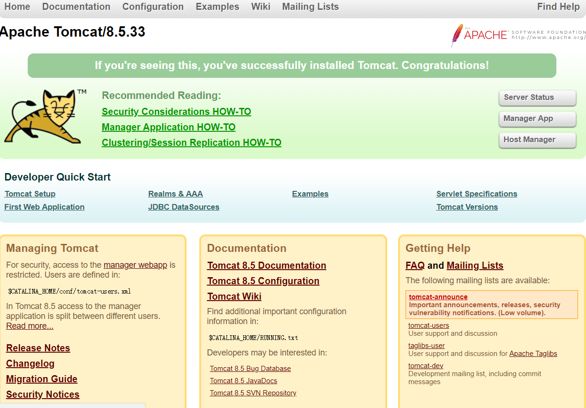

- 结合前面的容器卷将测试web服务test发布

  - 在 /hanguixian/mydockerfile/tomcat8/test下:

    - vim index.jsp

    ```jsp
    <%@ page contentType="text/html;charset=UTF-8" language="java" %>
    <html>
      <head>
        <title>docker test</title>
      </head>
      <body>
       <%= "I am docker tomcat self" %>
       <h2>发布一个docker jsp</h2>
       <% System.out.println("docker tomcat self"); %>
      </body>
    </html>
    
    ```

    - mkdir WEB-INF 

      - cd WEB-INF
      - vim web.xml

      ```xml
      <?xml version="1.0" encoding="UTF-8"?>
      <web-app xmlns="http://xmlns.jcp.org/xml/ns/javaee"
               xmlns:xsi="http://www.w3.org/2001/XMLSchema-instance"
               xsi:schemaLocation="http://xmlns.jcp.org/xml/ns/javaee http://xmlns.jcp.org/xml/ns/javaee/web-app_4_0.xsd"
               version="4.0">
      </web-app>
      
      ```

  - 访问 : xxxx:8888/test/index.jsp

### 5.总结

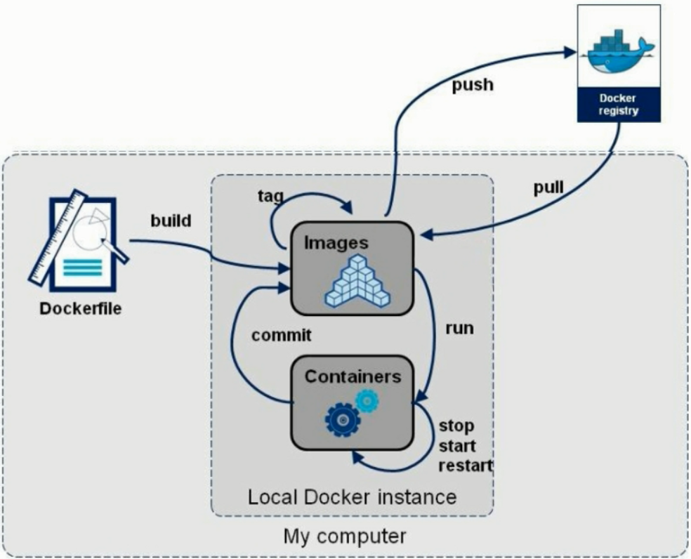


---------


## 七.Docker常用安装

### mysql

- 搜索: `docker search mysql`

- 拉取: `docker pull mysql:5.7`

- 运行

  - 命令

  ```shell
  docker run -p 3306:3306 --name mysql -v /hanguixian/mysql/conf:/etc/mysql/conf.d -v /hanguixian/mysql/logs:/logs -v /hanguixian/mysql/data:/var/lib/mysql -e MYSQL_ROOT_PASSWORD=123456 -d mysql:5.7
  
  ```

  - 命令解释
    -  `-p 3306:3306` : 将主机的3306端口映射到docker容器的3306端口。
    - `--name mysql` : 运行服务名字
    - `-v /hanguixian/mysql/conf:/etc/mysql/conf.d` :将主机/hanguixian/mysql目录下的conf/my.conf挂载到容器的/etc/mysql/conf.d
    - `-v /hanguixian/mysqlogs:/logs` : 将主机Izzyyuse/mysqI目录下的logs目录挂载到容器的/logs。
    - `-v /hanguixian/mysql/data:/var/lib/mysql`  :将主机/hanguixian/mysql目录下的data目录挂我到容器的/var/lib/mysql
    - `-e MYSQL_ROOT_PASSWORD=123456` :  初始化root用户的密码。
    - `-d mysql:5.7 `:后台程序运行mysql5.7

- 进入容器

  - 命令 : docker exec -it MySQL运行成功后的容器ID /bin/bash 
    - `docker exec -it  c71b4611c818  /bin/bash`

- 数据备份

  - 命令: `docker exec some-mysql sh -c 'exec mysqldump --all-databases -uroot -p"$MYSQL_ROOT_PASSWORD"' > /some/path/on/your/host/all-databases.sql`
    - 例子: `docker exec c71b4611c818  sh -c 'exec mysqldump --all-databases -uroot -p"123456"' > /a.sql`

- docker hub : https://hub.docker.com/r/library/mysql/

---------


## 八.本地镜像发布到阿里云

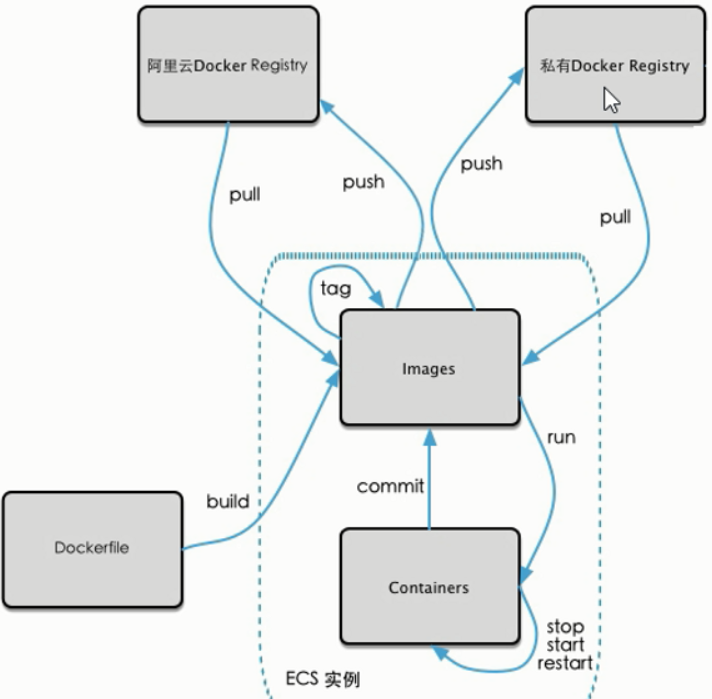

### 操作指南

#### 1. 登录阿里云Docker Registry

```bash
$ sudo docker login --username=xxxx registry.cn-qingdao.aliyuncs.com
```

用于登录的用户名为阿里云账号全名，密码为开通服务时设置的密码。

您可以在产品控制台首页修改登录密码。

#### 2. 从Registry中拉取镜像

```bash
$ sudo docker pull registry.cn-qingdao.aliyuncs.com/hanguixian/mycentos:[镜像版本号]
```

#### 3. 将镜像推送到Registry

```bash
$ sudo docker login --username=xxxxx registry.cn-qingdao.aliyuncs.com$ sudo docker tag [ImageId] registry.cn-qingdao.aliyuncs.com/hanguixian/mycentos:[镜像版本号]$ sudo docker push registry.cn-qingdao.aliyuncs.com/hanguixian/mycentos:[镜像版本号]
```

请根据实际镜像信息替换示例中的[ImageId]和[镜像版本号]参数。

#### 4. 选择合适的镜像仓库地址

从ECS推送镜像时，可以选择使用镜像仓库内网地址。推送速度将得到提升并且将不会损耗您的公网流量。

如果您使用的机器位于经典网络，请使用 registry-internal.cn-qingdao.aliyuncs.com 作为Registry的域名登录，并作为镜像命名空间前缀。

如果您使用的机器位于VPC网络，请使用 registry-vpc.cn-qingdao.aliyuncs.com 作为Registry的域名登录，并作为镜像命名空间前缀。

#### 5. 示例

使用"docker tag"命令重命名镜像，并将它通过专有网络地址推送至Registry。

```bash
$ sudo docker imagesREPOSITORY                                                         TAG                 IMAGE ID            CREATED             VIRTUAL SIZEregistry.aliyuncs.com/acs/agent                                    0.7-dfb6816         37bb9c63c8b2        7 days ago          37.89 MB$ sudo docker tag 37bb9c63c8b2 registry-vpc.cn-qingdao.aliyuncs.com/acs/agent:0.7-dfb6816
```

使用"docker images"命令找到镜像，将该镜像名称中的域名部分变更为Registry专有网络地址。

```bash
$ sudo docker push registry-vpc.cn-qingdao.aliyuncs.com/acs/agent:0.7-dfb6816
```


---------

