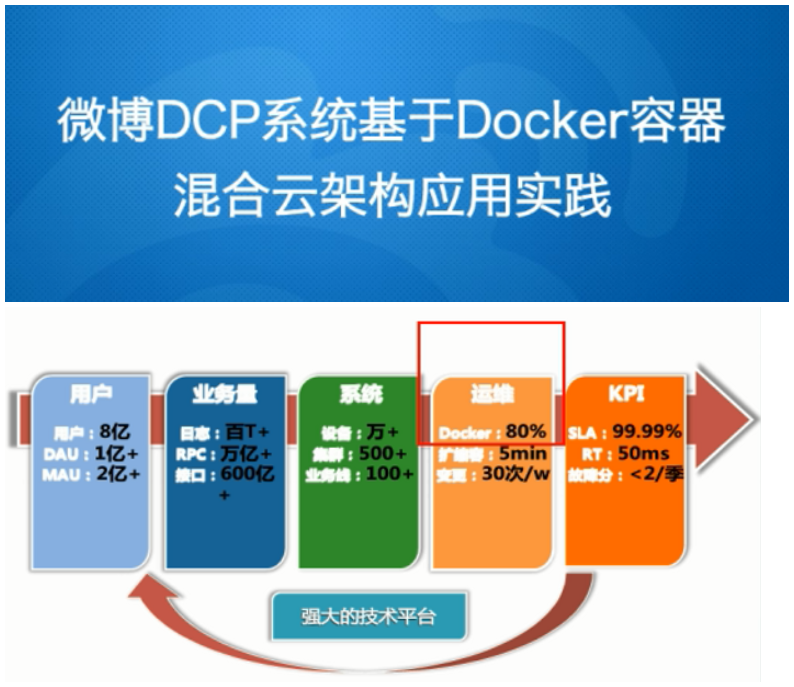

# Docker 基础(基于javaEE)


<font color="green">*@Author:hanguixian*</font> 

<font color="green">*@Email:hn_hanguixian@163.com*<font>   

**Docker文档:https://docs.docker.com/**

**Dcker中文文档:https://docs.docker-cn.com/**


# 一.docker简介

## 1.docker是什么?

### 1.1docker发展方向

| 方向   | 语言 | 框架等                                                 |
| ------ | ---- | ------------------------------------------------------ |
| JavaEE | java | SpringMVC/SpringBoot/Mybatis                           |
| Docker | Go   | Swarm/Compose/Machine/mesos/k8s/----CI/CD jenkinds整合 |

### 1.2docker出现的原因

- 开发和运维之间相爱相杀:开发(打包的代码) -> 运维(部署)
  - 从产品到上线,从操作系统到运行系统,再到应用配置,需要关注很多东西.
  - 在各个版本迭代之后,不同版本环境的兼容对运维都是考验
- 运维部署多台
- 解决方案:
  - 环境配置很麻烦,换台机器就需要重来一次,能否软件带环境安装

  - 将开发环境(ok的,包含代码,配置,系统,数据) ----->打包------> 运维(部署):将原始环境一模一样复制

    ```mermaid
    graph TD
    classDef de fill:#f30,stroke:#333,stroke-width:4px;
    classDef de2 fill:#9f6,stroke:#333,stroke-width:4px;
    a[程序hello 代码 == 应用 ?] --编译-->b[hello.exe 执行文档 == 应用?]
    b --> c[windows ok]
    b --> d[Linux erro]
    b --> e[Solaris erro]
    b --> f[平台... 耦合性]
    
    class d,e,f de
    class c de2
    
    
    ```

    

- 镜像技术:
  - 打破"程序即应用"的观念

  - 从系统环境开始,自底至上打包应用,达到应用程序无缝接轨运作.

    ```mermaid
    graph TB
    classDef de fill:#f30,stroke:#333,stroke-width:4px;
    classDef de2 fill:#f92,stroke:#333,stroke-width:4px;
    
    subgraph docker 镜像即文档
    	a[运行文档] 
    	b[环境变量]
    	c[运行环境]
    	d[运行依赖包]
    	e[操作系统发行版本]
    	f[内核]
    end
    
    class a,b,c,d,e,f de2
    
    ```

    

###  1.3docker理念

- Docker是基于Go语言实现的云开源项目。 
- Docker是一个开源的容器引擎，它可以帮助我们更快地交付应用。Docker可将应用程序和基础设施层隔离，并且能将基础设施当作程序一样进行管理。使用Docker，可更快地打包、测试以及部署应用程序，并可减少从编写到部署运行代码的周期。
- Docker的主要月标是“Build, Ship and Run Any App,Anywhere",也就是通过对应用组件的封装、分发、部署、运行等生命周期的管 理，使用户的APP (可以是一个WEB应用或数据库应用等等)及其运行环境能够做到“一次封装，到处运行”。  
- Linux容器技术的出现就解决了这样一个问题，而Docker就是在它的基础上发展过来的。将应用运行在Docker容器上面，而Docker容器在任何操作系统上都是一致的，这就实现了跨平台、跨服务器。只需要一次配置好环境，换到别的机子上就可以一键部署好，大大简化了操作.

### 1.4 logo解读


- 鲸鱼背上有集装箱

  ​	蓝色海洋 --- 宿主机系统

  ​	鲸鱼 ----- docker

  ​	集装箱 ----- 容器实例

### 1.5总结
 - 解决了运行环境和配置问题软件容器,方便做持续集成并有助于整体发布的容器虚拟化技术.


## 2.docker能做什么?

- 之前的虚拟机技术:

  - 虚拟机(virtual machine)就是带环境安装的一种解决方案。 它可以在一种操作系统里面运行另一种操作系统，比如在Windows系统里面运行Linux系统。应用程序对此亳无感知，因为虚拟机看上去跟真实系统一模一样，而对于底层系统来说，虚拟机就是一个普通文件，不需要了就删掉，对其他部分毫无影响。这类虚拟机完美的运行了另一套系统，能够使应用程序，操作系统和硬件三者之间的逻辑不变。  

    ```mermaid
    graph TB
    classDef de fill:#f30,stroke:#333,stroke-width:4px;
    classDef de1 fill:#9f6,stroke:#333,stroke-width:4px;
    classDef de2 fill:#f90,stroke:#333,stroke-width:4px;
    
    subgraph docker 虚拟机
    	a[app]
    	b[app]
    	c[app ...]
    	d[Libraries]
    	e[Kernel]
    end
    
    class a,b,c de2
    class d de
    class e de1
    
    ```

    - 缺点:
      - 资源占用多
      - 冗余步骤多
      - 启动慢

- 容器虚拟化技术:

  - 由于前面虚拟机存在这些缺点，Linux发展出了另一种虚拟化技术: Linux容器(Linux Containers, 缩写为LXC)。

  - Linux容器不是模拟一个完整的操作系统，而是对进程进行隔离。有了容器，就可以将软件运行所需的所有资源打包到一个隔离的容器中。容器与虚拟机不同，不需要捆绑一整套操作系统，只需要软件工作所需的库资源和设置。系统因此而变得高效轻量并保证部署在任何环境中的软件都能始终如一地运行。

    ```mermaid
    graph TB
    classDef de fill:#f30,stroke:#333,stroke-width:4px;
    classDef de1 fill:#9f6,stroke:#333,stroke-width:4px;
    classDef de2 fill:#f90,stroke:#333,stroke-width:4px;
    
    subgraph docker 容器虚拟化技术
    	subgraph 
    	 A1[app]
    	 B1[libraries]
    	end
    	C[kernel]
    	subgraph 
    	A2[app]
    	B2[libriraes]
    	end
    end
    
    class A1,A2 de2
    class B1,B2 de
    class C de1
    
    ```

  - Docker 和传统虚拟化方式的不同之处: 
     - 传统虚拟机技术是虚拟出一套硬件后，在其上运行一个完整操作系统，在该系统上再运行所需应用进程.
     - 容器内的应用进程直接运行于宿主的内核，容器内没有自己的内核，而且也没有进行硬件虚拟。因此容器要比传统虚拟机更为轻便。
     - 每个容器之间互相隔离，每个容器有自己的文件系统，容器之间进程不会相互影响，能区分计算资源。

-------------

- 开发/运维(DevOps):一次构建,随处运行
   - 更具啊的应用交付和部署
    - 更便捷的升级和扩缩性
    - 更简单的系统运维
    - 更高效的技算资源利用

--------------
- 企业级运用:

  - 微博

    
    

- 美团

  ​    


## 3.去哪儿下载

- 官网:
  - docker官网:https://www.docker.com/
  - docker中文网站:https://www.docker-cn.com/
- 仓库:
  - docker hub:https://hub.docker.com/


