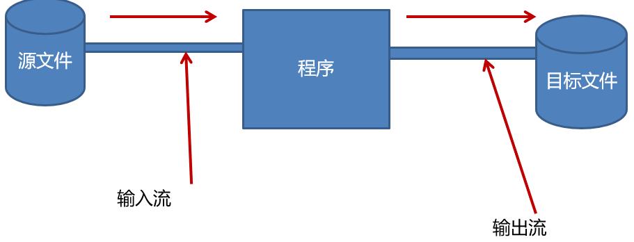
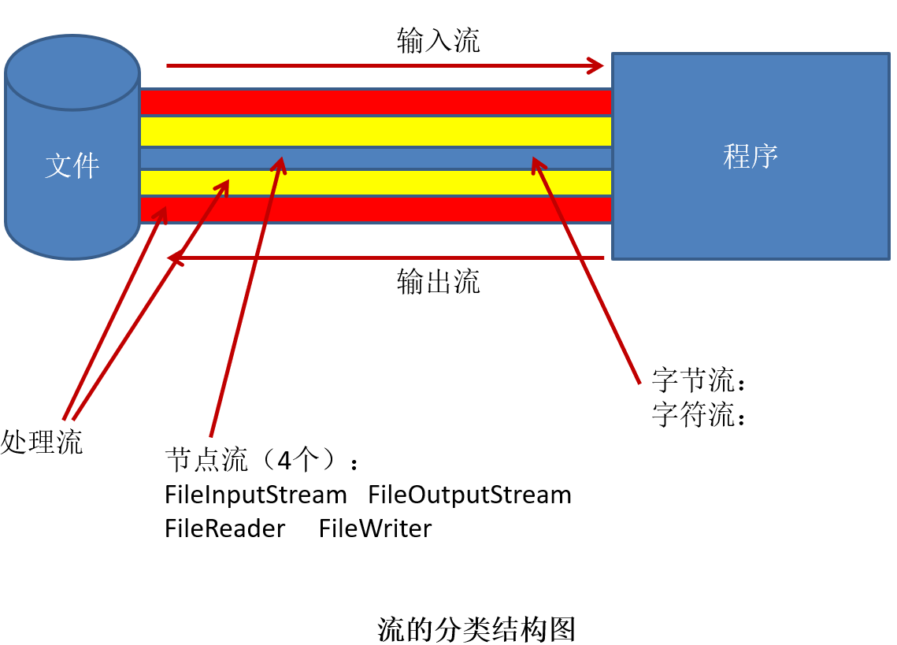
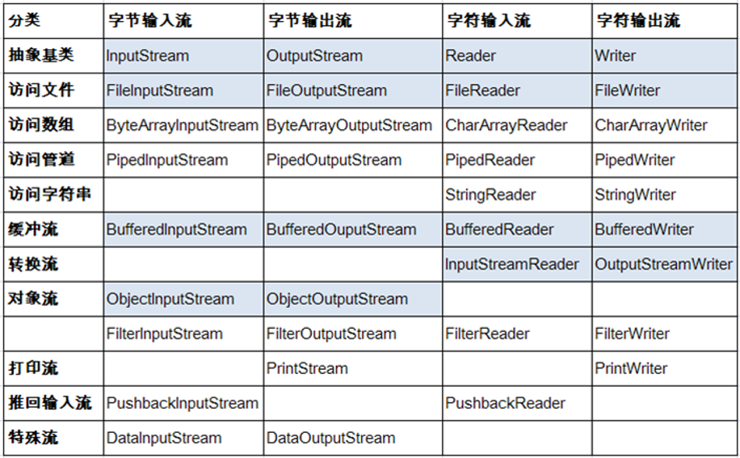

# Java基础


## 10 IO流

### 1 File类 

#### 1.1 介绍

- java.io.File类：文件和目录路径名的抽象表示形式，与平台无关
- File 能新建、删除、重命名文件和目录，但 File 不能访问文件内容本身。如果需要访问文件内容本身，则需要使用输入/输出流。
- File对象可以作为参数传递给流的构造函数
- File类的常见构造方法：
  - public File(String pathname)
    - 以pathname为路径创建File对象，可以是绝对路径或者相对路径，如果pathname是相对路径，则默认的当前路径在系统属性user.dir中存储。
  - public File(String parent,String child)
    - 以parent为父路径，child为子路径创建File对象。、
- File的静态属性String separator存储了当前系统的路径分隔符。
  - 在UNIX中，此字段为‘/’，在Windows中，为‘\\’

#### 1.2 API

- 访问文件名
  - getName()
  - getPath()
  - getAbsoluteFile()
  - getAbsolutePath()
  - getParent()
  - renameTo(File newName)
- 文件检测
  - exists()
  - canWrite()
  - canRead()
  - isFile()
  - isDirectory()
- 文件操作相关
  - createNewFile()
  - delete()
- 目录操作相关
  - mkDir()
  - mkDirs()
  - list()
  - listFiles()
- 获取常规文件信息
  - lastModified()
  - length()

#### 1.3 API 测试

```java
import org.junit.Test;

import java.io.File;
import java.io.IOException;
import java.util.Date;

/*
 * java.io.File类
 * 1.凡是与输入、输出相关的类、接口等都定义在java.io包下
 * 2.File是一个类，可以有构造器创建其对象。此对象对应着一个文件（.txt .avi .doc .ppt .mp3 .jpg）或文件目录
 * 3.File类对象是与平台无关的。
 * 4.File中的方法，仅涉及到如何创建、删除、重命名等等。只要涉及文件内容的，File是无能为力的，必须由io流来完成。
 * 5.File类的对象常作为io流的具体类的构造器的形参。
 */
public class TestFile {

    /*
     * 路径：
     * 绝对路径：包括盘符在内的完整的文件路径
     * 相对路径：在当前文件目录下的文件的路径
     *
     *  getName()
        getPath()
        getAbsoluteFile()
        getAbsolutePath()
        getParent()
        renameTo(File newName)
     */
    @Test
    public void test1() {
        File file2 = new File("D:\\workSapce\\ideaSpace2\\niolearn\\hello2.txt");
        File file1 = new File("hello3.txt");

        File file3 = new File("d:\\io\\io1");
        File file4 = new File("d:\\io2");

        //文件名
        System.out.println(file1.getName());
        //文件的路径
        System.out.println(file1.getPath());
        //文件的绝对路径
        System.out.println(file1.getAbsoluteFile());
        //文件父目录
        System.out.println(file1.getParent());
        //
        System.out.println(file1.getAbsolutePath());

        System.out.println();

        System.out.println(file3.getName());
        System.out.println(file3.getPath());
        System.out.println(file3.getAbsoluteFile());
        System.out.println(file3.getParent());
        System.out.println(file3.getAbsolutePath());

        //renameTo(File newName):重命名
        //file1.renameTo(file2):file1重命名为file2.要求：file1文件一定存在，file2一定不存在
        boolean b = file1.renameTo(file2);
        System.out.println(b);

        boolean b1 = file3.renameTo(file4);
        System.out.println(b1);
    }

    /*
   *  exists()
      canWrite()
      canRead()
      isFile()
      isDirectory()
      lastModified()
      length()

   */
    @Test
    public void test2() {
        File file1 = new File("D:\\workSapce\\ideaSpace2\\niolearn\\hello.txt");
        File file2 = new File("D:\\io\\in");

        System.out.println(file1.exists());
        System.out.println(file1.canWrite());
        System.out.println(file1.canRead());
        System.out.println(file1.isFile());
        System.out.println(file1.isDirectory());
        System.out.println(new Date(file1.lastModified()));
        System.out.println(file1.length());

        System.out.println();

        System.out.println(file2.exists());
        System.out.println(file2.canWrite());
        System.out.println(file2.canRead());
        System.out.println(file2.isFile());
        System.out.println(file2.isDirectory());
        System.out.println(new Date(file2.lastModified()));
        System.out.println(file2.length());

    }

    /*
     *  createNewFile()
        delete()
        mkDir():创建一个文件目录。只有在上层文件目录存在的情况下，才能返回true
        mkDirs():创建一个文件目录。若上层文件目录不存在，一并创建
        list()
        listFiles()
     */
    @Test
    public void test3() throws IOException {
        File file1 = new File("hello.txt");
        System.out.println(file1.delete());

        if (!file1.exists()) {
            boolean b = file1.createNewFile();
            System.out.println(b);
        }

        File file2 = new File("d:\\io\\io3");
        if (!file2.exists()) {
            boolean b = file2.mkdirs();
            System.out.println(b);
        }

        System.out.println("-----------------------------");

        File file3 = new File("d:\\");
        String[] strs = file3.list();
        for (int i = 0; i < strs.length; i++) {
            System.out.println(strs[i]);
        }

        System.out.println("----------------------------------");

        File[] files = file3.listFiles();
        for (int i = 0; i < files.length; i++) {
            System.out.println(files[i].getName());
        }
    }
} 
```


### 2  Java IO 原理

- IO流用来处理设备之间的数据传输。
- Java程序中，对于数据的输入/输出操作以”流(stream)” 的方式进行。
- java.io包下提供了各种“流”类和接口，用以获取不同种类的数据，并通过标准的方法输入或输出数据。
- 输入input：读取外部数据（磁盘、光盘等存储设备的数据）到程序（内存）中。 
- 输出output：将程序（内存）数据输出到磁盘、光盘等存储设备中 。



### 3 流的分类

- 按操作数据单位不同分为：字节流(8 bit)，字符流(16 bit)  
- 按数据流的流向不同分为：输入流，输出流
- 按流的角色的不同分为：节点流，处理流



- 总的来说
  - 1.Java的IO流共涉及40多个类，实际上非常规则，都是从如下4个抽象基类派生的。
  - 2.由这四个类派生出来的子类名称都是以其父类名作为子类名后缀。

| 抽象基类 | 字节流       | 字符流 |
| -------- | ------------ | ------ |
| 输入流   | InputStream  | Reader |
| 输出流   | OutputStream | Writer |



### 4 节点流和处理流

- 节点流可以从一个特定的数据源读写数据


- 处理流是“连接”在已存在的流（节点流或处理流）之上，通过对数据的处理为程序提供更为强大的读写功能。 


### 5 重点

| 抽象基类     | 节点流（文件流）                       | 缓冲流（处理流的一种,可以提升文件操作的效率）                |
| ------------ | -------------------------------------- | ------------------------------------------------------------ |
| InputStream  | FileInputStream （int read(byte[] b)） | BufferedInputStream  (int read(byte[] b))                    |
| OutputStream | FileOutputStream (void write(b,0,len)) | BufferedOutputStream  (flush())  (void write(b,0,len))       |
| Reader       | FileReader (int read(char[] c))        | BufferedReader  (readLine())  (int read(char[] c))或String readLine() |
| Writer       | FileWriter (void write(c,0,len))       | BufferedWriter  (flush()) (void write(c,0,len)或void write(String str)) |

注： 

- 1.从硬盘中读入一个文件，要求此文件一定得存在。若不存在，报FileNotFoundException的异常

- 2.从程序中输出一个文件到硬盘，此文件可以不存在。若不存在，就创建一个实现输出。若存在，则将已存在的文件覆盖

- 3.真正开发时，就使用缓冲流来代替节点流

- 4.主要最后要关闭相应的流。先关闭输出流，再关闭输入流。将此操作放入finally

  

### 6.其它的流

#### 6.1.转换流：实现字节流与字符流之间的转换
 - InputStreamReader:输入时，实现字节流到字符流的转换，提高操作的效率（前提是，数据是文本文件）   ===>解码：字节数组--->字符串
 - OutputStreamWriter：输出时，实现字符流到字节流的转换。 ===>编码：  字符串---->字节数组
   - 例子：从键盘输入字符串，要求将读取到的整行字符串转成大写输出。然后继续进行输入操作，直至当输入“e”或者“exit”时，退出程序。

#### 6.2.标准的输入输出流
 - System.in: The "standard" input stream:从键盘输入数据
 - System.out:The "standard" output stream：从显示器输出数据

#### 6.3.打印流 (都是输出流)  PrintStream(处理字节)  PrintWriter(处理字符) 
 - 可以使用System.setOut（PrintStream p）重新设置一下输出的位置。  

```java
PrintStream p = new PrintStream(new FileOutputStream("hello.txt"),true);
```

#### 6.4.数据流（处理基本数据类型、String类、字节数组）
 - DataInputStream  
 - DataOutputStream   

#### 6.5.对象流(用来处理对象的)

- 对象的序列化机制：允许把内存中的Java对象转换成平台无关的二进制流，从而允许把这种二进制流持久地保存在磁盘上，或通过网络将这种二进制流传输到另一个网络节点。当其它程序获取了这种二进制流，就可以恢复成原来的Java对象
  ObjectInputStream（Object readObject();）   ObjectOutputStream  (void writeObject(Object obj))

 - 如何创建流的对象：

```java
ObjectOutputStream oos = new ObjectOutputStream(new FileOutputStream(new File("person.txt")));
ObjectInputStream ois = new ObjectInputStream(new FileInputStream(new File("person.txt")));	
```

 - 实现序列化机制的对象对应的类的要求：
       - ①要求类要实现Serializable接口
       - ②同样要求类的所有属性也必须实现Serializable接口
       - ③ 要求给类提供一个序列版本号：private static final long serialVersionUID;
       - ④属性声明为static 或transient的，不可以实现序列化

#### 6.6.随机存取文件流:RandomAccessFile

 - 既可以充当一个输入流，又可以充当一个输出流：public RandomAccessFile(File file, String mode) 
 - 支持从文件的开头读取、写入。若输出的文件不存在，直接创建。若存在，则是对原有文件内容的覆盖。
 - 支持任意位置的“插入”。

