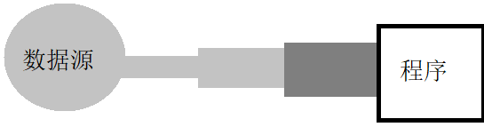

# Java基础


<font color="green">*@Author:hanguixian*</font> 

<font color="green">*@Email:hn_hanguixian@163.com*</font>


## 七  JAVA集合

### 1 概述

- 一方面， 面向对象语言对事物的体现都是以对象的形式，为了方便对多个对象的操作，就要对对象进行存储。另一方面，使用Array存储对象方面具有一些弊端，而Java 集合就像一种容器，可以动态地把多个对象的引用放入容器中。
- Java 集合类可以用于存储数量不等的多个对象，还可用于保存具有映射关系的关联数组。

#### 1.1 Java 集合可分为 Collection 和 Map 两种体系

- Collection接口：
  - Set：元素无序、不可重复的集合 ---类似高中的“集合”
  - List：元素有序，可重复的集合  ---”动态”数组
- Map接口：具有映射关系“key-value对”的集合 ---类似于“函数” y = f(x)   (x1,y1) (x2,y2)

#### 1.2 Collection接口继承树


#### 1.3  Map接口继承树


### 2  Collection 接口

- Collection 接口是 List、Set 和 Queue 接口的父接口，该接口里定义的方法既可用于操作 Set 集合，也可用于操作 List 和 Queue 集合。
- JDK不提供此接口的任何直接实现，而是提供更具体的子接口(如：Set和List)实现。
- 在 Java5 之前，Java 集合会丢失容器中所有对象的数据类型，把所有对象都当成 Object 类型处理；从 Java5 增加了泛型以后，Java 集合可以记住容器中对象的数据类型

#### 2.1  Collection.java

```java
package java.util;

import java.util.function.Predicate;
import java.util.stream.Stream;
import java.util.stream.StreamSupport;

public interface Collection<E> extends Iterable<E> {

    int size();

    boolean isEmpty();

    boolean contains(Object o);

    Iterator<E> iterator();

    Object[] toArray();

    <T> T[] toArray(T[] a);

    boolean add(E e);

    boolean remove(Object o);

    boolean containsAll(Collection<?> c);

    boolean addAll(Collection<? extends E> c);

    boolean removeAll(Collection<?> c);

    default boolean removeIf(Predicate<? super E> filter) {
        Objects.requireNonNull(filter);
        boolean removed = false;
        final Iterator<E> each = iterator();
        while (each.hasNext()) {
            if (filter.test(each.next())) {
                each.remove();
                removed = true;
            }
        }
        return removed;
    }

    boolean retainAll(Collection<?> c);

    void clear();

    boolean equals(Object o);

    int hashCode();

    @Override
    default Spliterator<E> spliterator() {
        return Spliterators.spliterator(this, 0);
    }

    default Stream<E> stream() {
        return StreamSupport.stream(spliterator(), false);
    }
    default Stream<E> parallelStream() {
        return StreamSupport.stream(spliterator(), true);
    }
}
```


#### 2.2 方法示例

```java
import java.util.ArrayList;
import java.util.Arrays;
import java.util.Collection;
import java.util.Date;
import java.util.Iterator;

import org.junit.Test;

/*
 * 1.存储对象可以考虑：①数组 ②集合
 * 2.数组存储对象的特点：Student[] stu = new Student[20]; stu[0] = new Student();....
 *    >弊端：①一旦创建，其长度不可变。②真实的数组存放的对象的个数是不可知。
 * 3.集合
 *     Collection接口
 *     		|------List接口：存储有序的，可以重复的元素
 *     				|------ArrayList（主要的实现类）、LinkedList（对于频繁的插入、删除操作）、Vector（古老的实现类、线程安全的）
 *     		|------Set接口：存储无序的，不可重复的元素
 *     				|------HashSet、LinkedHashSet、TreeSet
 *     Map接口：存储“键-值”对的数据
 *     		|-----HashMap、LinkedHashMap、TreeMap、Hashtable(子类：Properties)
 */
public class TestCollection {
    @Test
    public void testCollection1() {
        Collection coll = new ArrayList();
        // 1.size():返回集合中元素的个数
        System.out.println(coll.size());
        // 2.add(Object obj):向集合中添加一个元素
        coll.add(123);
        coll.add("AA");
        coll.add(new Date());
        coll.add("BB");
        System.out.println(coll.size());
        // 3.addAll(Collection coll):将形参coll中包含的所有元素添加到当前集合中
        Collection coll1 = Arrays.asList(1, 2, 3);
        coll.addAll(coll1);
        System.out.println(coll.size());
        // 查看集合元素
        System.out.println(coll);
        // 4.isEmpty():判断集合是否为空
        System.out.println(coll.isEmpty());
        // 5.clear():清空集合元素
        coll.clear();
        System.out.println(coll.isEmpty());
    }

        @Test
    public void testCollection2() {
        Collection coll = new ArrayList();
        coll.add(123);
        coll.add(new String("AA"));
        coll.add(new Date());
        coll.add("BB");
        // Person p = new Person("MM",23);
        coll.add(new Person("MM", 23));
        System.out.println(coll);
        // 6.contains(Object obj):判断集合中是否包含指定的obj元素。如果包含，返回true，反之返回false
        // 判断的依据：根据元素所在的类的equals()方法进行判断
        // 明确：如果存入集合中的元素是自定义类的对象。要求：自定义类要重写equals()方法！
        boolean b1 = coll.contains(123);
        b1 = coll.contains(new String("AA"));
        System.out.println(b1);
        boolean b2 = coll.contains(new Person("MM", 23));
        System.out.println(b2);
        // 7.containsAll(Collection coll):判断当前集合中是否包含coll中所有的元素
        Collection coll1 = new ArrayList();
        coll1.add(123);
        coll1.add(new String("AA"));

        boolean b3 = coll.containsAll(coll1);
        System.out.println("#" + b3);
        coll1.add(456);
        // 8.retainAll(Collection coll):求当前集合与coll的共有的元素，返回给当前集合
        coll.retainAll(coll1);
        System.out.println(coll);
        // 9.remove(Object obj):删除集合中的obj元素。若删除成功，返回true。否则，返回false
        boolean b4 = coll.remove("BB");
        System.out.println(b4);

    }
    
    @Test
    public void testCollection3() {
        Collection coll = new ArrayList();
        coll.add(123);
        coll.add(new String("AA"));
        coll.add(new Date());
        coll.add("BB");
        coll.add(new Person("MM", 23));

        Collection coll1 = new ArrayList();
        coll1.add(123);
        coll1.add(new String("AA"));
        // 10.removeAll(Collection coll):从当前集合中删除包含在coll中的元素。
        coll.removeAll(coll1);
        System.out.println(coll);
        //11.equals(Object obj):判断集合中的所有元素是否完全相同
        Collection coll2 = new ArrayList();
        coll2.add(123);
        coll2.add(new String("AA1"));
        System.out.println(coll1.equals(coll2));
        //12.hashCode():
        System.out.println(coll.hashCode());
        System.out.println();
        //13.toArray() :将集合转化为数组
        Object[] obj = coll.toArray();
        for(int i = 0;i < obj.length;i++){
            System.out.println(obj[i]);
        }
        System.out.println();
        //14.iterator():返回一个Iterator接口实现类的对象,进而实现集合的遍历！
        Iterator iterator = coll.iterator();
        //方式一：不用
        /*System.out.println(iterator.next());
		System.out.println(iterator.next());
		System.out.println(iterator.next());*/
        //方式二：不用
        //		for(int i = 0;i < coll.size();i++){
        //			System.out.println(iterator.next());
        //		}
        //方式三：使用
        while(iterator.hasNext()){
            System.out.println(iterator.next());
        }
    }
}
```

#### 2.4 使用 Iterator 接口遍历集合元素 

- Iterator对象称为迭代器(设计模式的一种)，主要用于遍历 Collection 集合中的元素。
- 所有实现了Collection接口的集合类都有一个iterator()方法，用以返回一个实现了Iterator接口的对象。
- Iterator 仅用于遍历集合，Iterator 本身并不提供承装对象的能力。如果需要创建 Iterator 对象，则必须有一个被迭代的集合。

```java
Iterator iterator = coll.iterator();
while(iterator.hasNext()){
    System.out.println(iterator.next());
}
```


#### 2.5 使用 foreach 循环遍历集合元素 

- Java 5 提供了 foreach 循环迭代访问 Collection 

```java
for(int a : intArr){
    System.out.println(a) ;
}
```


### 3 List 接口

- Java中数组用来存储数据的局限性
- List集合类中元素**有序**、且**可重复**，集合中的每个元素都有其对应的顺序索引。
- List容器中的元素都对应一个整数型的序号记载其在容器中的位置，可以根据序号存取容器中的元素。
- JDK API中List接口的实现类常用的有：ArrayList、LinkedList和Vector。


#### 3.1 接口新方法

List 集合里添加了一些根据索引来操作集合元素的方法

```java
void add(int index, Object ele)
boolean addAll(int index, Collection eles)
Object get(int index)
int indexOf(Object obj)
int lastIndexOf(Object obj)
Object remove(int index)
Object set(int index, Object ele)
List subList(int fromIndex, int toIndex)
```


#### 3.2 List实现类之一：ArrayList 

- ArrayList 是 List 接口的典型实现类
- 本质上，ArrayList是对象引用的一个变长数组
- ArrayList 是<font color="red">线程不安全</font>的，而 Vector 是线程安全的，即使为保证 List 集合线程安全，也不推荐使用Vector
- Arrays.asList(…) 方法返回的 List 集合既不是 ArrayList 实例，也不是 Vector 实例。 Arrays.asList(…)  返回值是一个固定长度的 List 集合


#### 3.3 List实现类之二：LinkedList 

- **对于频繁的插入或删除元素的操作，建议使用LinkedList类，效率较高**
- 新增方法：

```java
void addFirst(Object obj)
void addLast(Object obj)  
Object getFirst()
Object getLast()
Object removeFirst()
Object removeLast()
```


#### 3.4 List 实现类之三：Vector 

- Vector 是一个古老的集合，JDK1.0就有了。大多数操作与ArrayList相同，区别之处在于Vector是<font color="red">线程安全</font>的。
- 在各种list中，最好把ArrayList作为缺省选择。当插入、删除频繁时，使用LinkedList；Vector总是比ArrayList慢，所以**尽量避免使用**。
- 新增方法：

```java
void addElement(Object obj)
void insertElementAt(Object obj,int index)
void setElementAt(Object obj,int index)
void removeElement(Object obj)
void removeAllElements()
```


#### 3.5 ListIterator接口

- List 额外提供了一个 listIterator() 方法，该方法返回一个 ListIterator 对象， ListIterator 接口继承了 Iterator 接口，提供了专门操作 List 的方法：

```java
void add()
boolean hasPrevious()
Object previous()
Boolean hasNext()
Object next()
```

##### 3.5.1 Iterator和ListIterator主要区别

- ListIterator和Iterator都有hasNext()和next()方法，可以实现顺序向后遍历。但是ListIterator有hasPrevious()和previous()方法，可以实现逆向（顺序向前）遍历。Iterator就不可以。
- ListIterator可以定位当前的索引位置，nextIndex()和previousIndex()可以实现。Iterator 没有此功能。
- ListIterator有add()方法，可以向List中插入对象，而Iterator不能。
- 都可实现删除对象，但是ListIterator可以实现对象的修改，set()方法可以实现。Iterator仅能遍历，不能修改。因为ListIterator的这些功能，可以实现对LinkedList等List数据结构的操作。

#### 示例代码

```java
import org.junit.Test;
import java.util.ArrayList;
import java.util.List;

/**
 * ArrayList：List的主要实现类
 *
 * List中相对于Collection，新增加的方法
 *  void add(int index, Object ele):在指定的索引位置index添加元素ele
 *  boolean addAll(int index, Collection eles)
 *  Object get(int index):获取指定索引的元素
 *  Object remove(int index):删除指定索引位置的元素
 *  Object set(int index, Object ele):设置指定索引位置的元素为ele
 *  int indexOf(Object obj):返回obj在集合中首次出现的位置。没有的话，返回-1
 *  int lastIndexOf(Object obj)：返回obj在集合中最后一次出现的位置.没有的话，返回-1
 *  List subList(int fromIndex, int toIndex):返回从fromIndex到toIndex结束的左闭右开一个子list
 *
 * List常用的方法：
 * 增(add(Object obj)) 删(remove) 改(set(int index,Object obj))
 * 查(get(int index)) 插(add(int index, Object ele)) 长度(size())
 */
public class TestList {

    @Test
    public void testList1() {
        List list = new ArrayList();
        list.add(123);
        list.add(456);
        list.add(new String("AA"));
        list.add(new String("GG"));
        System.out.println(list);
        list.add(0, 555);
        System.out.println(list);
        Object obj = list.get(1);
        System.out.println(obj);
        list.remove(0);
        System.out.println(list.get(0));
        list.set(0, 111);
        System.out.println(list.get(0));
    }

    @Test
    public void testList2() {
        List list = new ArrayList();
        list.add(123);
        list.add(456);
        list.add(new String("AA"));
        list.add(new String("GG"));
        list.add(456);
        System.out.println(list.indexOf(456));
        System.out.println(list.lastIndexOf(456));
        System.out.println(list.indexOf(123) == list.lastIndexOf(123));
        System.out.println(list.indexOf(444));

        List list1 = list.subList(0, 3);
        System.out.println(list1);
    }
}
```


### 4 Set 接口 

- Set接口是Collection的子接口，set接口没有提供额外的方法
- Set 集合不允许包含相同的元素，如果试把两个相同的元素加入同一个 Set 集合中，则添加操作失败。
- Set 判断两个对象是否相同不是使用 == 运算符，而是根据 equals 方法

#### 4.1 Set实现类之一：HashSet 

- HashSet 是 Set 接口的典型实现，大多数时候使用 Set 集合时都使用这个实现类。
- HashSet 按 Hash 算法来存储集合中的元素，因此具有很好的存取和查找性能。
- HashSet 具有以下特点：
  - 不能保证元素的排列顺序
  - HashSet 不是线程安全的
  - 集合元素可以是 null
- 当向 HashSet 集合中存入一个元素时，HashSet 会调用该对象的 **hashCode()** 方法来得到该对象的 hashCode 值，然后根据 hashCode 值决定该对象在 HashSet 中的存储位置。
- HashSet 集合判断两个元素相等的标准：两个对象通过 hashCode() 方法比较相等，并且两个对象的 equals() 方法返回值也相等。

#### 4.2 hashCode() 方法

- 如果两个元素的 equals() 方法返回 true，但它们的 hashCode() 返回值不相等，hashSet 将会把它们存储在不同的位置，但依然可以添加成功。
- **对于存放在Set容器中的对象，对应的类一定要重写equals()和hashCode(Object obj)方法，以实现对象相等规则。**
- 重写 hashCode() 方法的基本原则
  - 在程序运行时，同一个对象多次调用 hashCode() 方法应该返回相同的值
  - 当两个对象的 equals() 方法比较返回 true 时，这两个对象的 hashCode() 方法的返回值也应相等
  - 对象中用作 equals() 方法比较的 Field，都应该用来计算 hashCode 值

#### 4.3 Set 实现类之二：LinkedHashSet 

- LinkedHashSet 是 HashSet 的子类
- LinkedHashSet 根据元素的 hashCode 值来决定元素的存储位置，但它同时使用链表维护元素的次序，这使得元素看起来是以插入顺序保存的。
- LinkedHashSet插入性能略低于 HashSet，但在迭代访问 Set 里的全部元素时有很好的性能。
- LinkedHashSet 不允许集合元素重复。

#### 4.4 Set实现类之三：TreeSet

-  TreeSet 是 SortedSet 接口的实现类，TreeSet 可以确保集合元素处于排序状态。
- TreeSet 两种排序方法：自然排序和定制排序。默认情况下，TreeSet 采用自然排序。
- 方法

```java
Comparator comparator()
Object first()
Object last()
Object lower(Object e)
Object higher(Object e)
SortedSet subSet(fromElement, toElement)
SortedSet headSet(toElement)
SortedSet tailSet(fromElement)
```

#### 4.5 排序——自然排序 

- 自然排序：TreeSet 会调用集合元素的 compareTo(Object obj) 方法来比较元素之间的大小关系，然后将集合元素按升序排列
- 如果试图把一个对象添加到 TreeSet 时，则该对象的类必须实现 Comparable 接口。
- 实现 Comparable 的类必须实现 compareTo(Object obj) 方法，两个对象即通过 compareTo(Object obj) 方法的返回值来比较大小。
- Comparable 的典型实现：
  - BigDecimal、BigInteger 以及所有的数值型对应的包装类：按它们对应的数值大小进行比较
  - Character：按字符的 unicode值来进行比较
  - Boolean：true 对应的包装类实例大于 false 对应的包装类实例
  - String：按字符串中字符的 unicode 值进行比较
  - Date、Time：后边的时间、日期比前面的时间、日期大
- 向 TreeSet 中添加元素时，只有第一个元素无须比较compareTo()方法，后面添加的所有元素都会调用compareTo()方法进行比较。
- 因为只有相同类的两个实例才会比较大小，所以向 TreeSet 中添加的应该是同一个类的对象
- 对于 TreeSet 集合而言，它判断两个对象是否相等的唯一标准是：两个对象通过 compareTo(Object obj) 方法比较返回值
- 当需要把一个对象放入 TreeSet 中，重写该对象对应的 equals() 方法时，应保证该方法与 compareTo(Object obj) 方法有一致的结果：如果两个对象通过 equals() 方法比较返回 true，则通过 compareTo(Object obj) 方法比较应返回 0

#### 4.6 排序——定制排序 

- TreeSet的自然排序是根据集合元素的大小，进行元素升序排列。如果需要定制排序，比如降序排列，可通过Comparator接口的帮助。需要重写`compare(T o1,T o2)`方法。
- 利用`int compare(T o1,T o2)`方法，比较o1和o2的大小：如果方法返回正整数，则表示o1大于o2；如果返回0，表示相等；返回负整数，表示o1小于o2。
- 要实现定制排序，需要将实现Comparator接口的实例作为形参传递给TreeSet的构造器。
- 此时，仍然只能向TreeSet中添加类型相同的对象。否则发生ClassCastException异常。
- 使用定制排序判断两个元素相等的标准是：通过Comparator比较两个元素返回了0。

#### 4.7 代码示例

- Customer.java

```java
public class Customer {
    private String name;
    private Integer id;

    public String getName() {
        return name;
    }

    public void setName(String name) {
        this.name = name;
    }

    public Integer getId() {
        return id;
    }

    public void setId(Integer id) {
        this.id = id;
    }

    public Customer(String name, Integer id) {
        super();
        this.name = name;
        this.id = id;
    }

    public Customer() {
        super();
    }

    @Override
    public String toString() {
        return "Customer [name=" + name + ", id=" + id + "]";
    }

    @Override
    public int hashCode() {
        final int prime = 31;
        int result = 1;
        result = prime * result + ((id == null) ? 0 : id.hashCode());
        result = prime * result + ((name == null) ? 0 : name.hashCode());
        return result;
    }

    @Override
    public boolean equals(Object obj) {
        if (this == obj)
            return true;
        if (obj == null)
            return false;
        if (getClass() != obj.getClass())
            return false;
        Customer other = (Customer) obj;
        if (id == null) {
            if (other.id != null)
                return false;
        } else if (!id.equals(other.id))
            return false;
        if (name == null) {
            if (other.name != null)
                return false;
        } else if (!name.equals(other.name))
            return false;
        return true;
    }

}
```

- Person.java

```java
public class Person implements Comparable {
    private String name;
    private Integer age;

    public String getName() {
        return name;
    }

    public void setName(String name) {
        this.name = name;
    }

    public Integer getAge() {
        return age;
    }

    public void setAge(Integer age) {
        this.age = age;
    }

    public Person() {
        super();
    }

    public Person(String name, Integer age) {
        super();
        this.name = name;
        this.age = age;
    }

    @Override
    public String toString() {
        return "Person [name=" + name + ", age=" + age + "]";
    }

    //static int init = 1000;
    @Override
    public int hashCode() {//return age.hashCode() + name.hashCode();没下述的健壮性好。
        final int prime = 31;
        int result = 1;
        result = prime * result + ((age == null) ? 0 : age.hashCode());
        result = prime * result + ((name == null) ? 0 : name.hashCode());
        return result;
        //return init++;//不能这样用
    }

    @Override
    public boolean equals(Object obj) {
        if (this == obj)
            return true;
        if (obj == null)
            return false;
        if (getClass() != obj.getClass())
            return false;
        Person other = (Person) obj;
        if (age == null) {
            if (other.age != null)
                return false;
        } else if (!age.equals(other.age))
            return false;
        if (name == null) {
            if (other.name != null)
                return false;
        } else if (!name.equals(other.name))
            return false;
        return true;
    }

    //当向TreeSet中添加Person类的对象时，依据此方法，确定按照哪个属性排列。
    @Override
    public int compareTo(Object o) {
        if (o instanceof Person) {
            Person p = (Person) o;
            //return this.name.compareTo(p.name);
            //return -this.age.compareTo(p.age);
            int i = this.age.compareTo(p.age);
            if (i == 0) {
                return this.name.compareTo(p.name);
            } else {
                return i;
            }
        }
        return 0;
    }
}
```

- TestSet

```java
import java.util.Comparator;
import java.util.HashSet;
import java.util.Iterator;
import java.util.LinkedHashSet;
import java.util.Set;
import java.util.TreeSet;

import org.junit.Test;

/**
 * Collection接口 ：
 * 		|------List接口：
 * 			|------ArrayList（主要的实现类）、
 * 			|------LinkedList（对于频繁的插入、删除操作）、
 * 			|------Vector（古老的实现类、线程安全的，但效率要低于ArrayList）
 * 		|------Set接口：存储无序的，不可重复的元素.Set中常用的方法都是Collection下定义的。
 *     				|------HashSet(主要实现类)
 *                 |------LinkedHashSet
 *                |------TreeSet
 */
@SuppressWarnings("all")
public class TestSet {

	/**
	 * Set:存储的元素是无序的，不可重复的！
	 *  1.无序性：无序性！= 随机性。真正的无序性，指的是元素在底层存储的位置是无序的。
	 * 2.不可重复性：当向Set中添加进相同的元素的时候，后面的这个不能添加进去。
	 *
	 * 说明：要求添加进Set中的元素所在的类，一定要重写equals()和hashCode()方法。 进而保证Set中元素的不可重复性！
	 *
	 * Set中的元素时如何存储的呢？使用了哈希算法。
	 * 当向Set中添加对象时，首先调用此对象所在类的hashCode()方法，计算此对象的哈希值，此哈希值
	 * 决定了此对象在Set中的存储位置。若此位置之前没有对象存储，则这个对象直接存储到此位置。若此位置
	 * 已有对象存储，再通过equals()比较这两个对象是否相同。如果相同，后一个对象就不能再添加进来。 万一返回false呢，都存储。（不建议如此）
	 * >要求：hashCode()方法要与equals()方法一致。
	 */
	@Test
	public void testHashSet() {
		Set set = new HashSet();
		set.add(123);
		set.add(456);
		set.add(new String("AA"));
		set.add(new String("AA"));
		set.add("BB");
		set.add(null);
		Person p1 = new Person("GG", 23);
		Person p2 = new Person("GG", 23);
		System.out.println(p1.equals(p2));
		System.out.println(p1.hashCode());
		System.out.println(p2.hashCode());
		set.add(p1);
		set.add(p2);
		System.out.println(set.size());
		System.out.println(set);
	}


	/*
	 * LinkedHashSet:使用链表维护了一个添加进集合中的顺序。导致当我们遍历LinkedHashSet集合
	 * 元素时，是按照添加进去的顺序遍历的！
	 *
	 * LinkedHashSet插入性能略低于 HashSet，但在迭代访问 Set 里的全部元素时有很好的性能。
	 */
	@Test
	public void testLinkedHashSet() {
		Set set = new LinkedHashSet();
		set.add(123);
		set.add(456);
		set.add(new String("AA"));
		set.add(new String("AA"));
		set.add("BB");
		set.add(null);

		Iterator iterator = set.iterator();
		while (iterator.hasNext()) {
			System.out.println(iterator.next());
		}

	}

	/**
	 * TreeSet: 1.向TreeSet中添加的元素必须是同一个类的。
	 * 2.可以按照添加进集合中的元素的指定的顺序遍历。像String，包装类等默认按照从小到大的顺序遍历。
	 * 3.当向TreeSet中添加自定义类的对象时，有两种排序方法：①自然排序②定制排序
	 * 4.自然排序：要求自定义类实现java.lang.Comparable接口并重写其compareTo(Object obj)的抽象方法
	 * 在此方法中，指明按照自定义类的哪个属性进行排序。
	 *
	 * 5.向TreeSet中添加元素时，首先按照compareTo()进行比较，一旦返回0，虽然仅是两个对象的此
	 * 属性值相同，但是程序会认为这两个对象是相同的，进而后一个对象就不能添加进来。
	 *
	 * >compareTo()与hashCode()以及equals()三者保持一致！
	 */
	@Test
	public void testTreeSet1() {
		Set set = new TreeSet();
		// set.add(new String("AA"));
		// set.add(new String("AA"));
		// set.add("JJ");
		// set.add("GG");
		// set.add("MM");
		// 当Person类没有实现Comparable接口时，当向TreeSet中添加Person对象时，报ClassCastException
		set.add(new Person("CC", 23));
		set.add(new Person("MM", 21));
		set.add(new Person("GG", 25));
		set.add(new Person("JJ", 24));
		set.add(new Person("KK", 20));
		set.add(new Person("DD", 20));
		// set.add("AA");

		for (Object str : set) {
			System.out.println(str);
		}

	}

	/**
	 * TreeSet的定制排序： 见下面的步骤 compare()与hashCode()以及equals()三者保持一致！
	 */
	@Test
	public void testTreeSet2() {
		// 1.创建一个实现了Comparator接口的类对象
		Comparator com = new Comparator() {
			// 向TreeSet中添加Customer类的对象，在此compare()方法中，指明是按照Customer
			// 的哪个属性排序的。
			@Override
			public int compare(Object o1, Object o2) {
				if (o1 instanceof Customer && o2 instanceof Customer) {
					Customer c1 = (Customer) o1;
					Customer c2 = (Customer) o2;
					int i = c1.getId().compareTo(c2.getId());
					if (i == 0) {
						return c1.getName().compareTo(c2.getName());
					}
					return i;
				}
				return 0;
			}
		};
		// 2.将此对象作为形参传递给TreeSet的构造器中
		TreeSet set = new TreeSet(com);
		// 3.向TreeSet中添加Comparator接口中的compare方法中涉及的类的对象。
		set.add(new Customer("AA", 1003));
		set.add(new Customer("BB", 1002));
		set.add(new Customer("GG", 1004));
		set.add(new Customer("CC", 1001));
		set.add(new Customer("DD", 1001));

		for (Object str : set) {
			System.out.println(str);
		}
	}

	@Test
	public void testTreeSet3() {

		TreeSet set = new TreeSet(new Comparator() {
			public int compare(Object o1, Object o2) {
				if (o1 instanceof Customer && o2 instanceof Customer) {
					Customer c1 = (Customer) o1;
					Customer c2 = (Customer) o2;
					int i = c1.getId().compareTo(c2.getId());
					if (i == 0) {
						return c1.getName().compareTo(c2.getName());
					}
					return i;
				}
				return 0;
			}
		});
		set.add(new Customer("AA", 1003));
		set.add(new Customer("BB", 1002));
		set.add(new Customer("GG", 1004));
		set.add(new Customer("CC", 1001));
		set.add(new Customer("DD", 1001));

		for (Object str : set) {
			System.out.println(str);
		}
	}

}

```


## 十 IO流

### 1 File类 

#### 1.1 介绍

- java.io.File类：文件和目录路径名的抽象表示形式，与平台无关
- File 能新建、删除、重命名文件和目录，但 File 不能访问文件内容本身。如果需要访问文件内容本身，则需要使用输入/输出流。
- File对象可以作为参数传递给流的构造函数
- File类的常见构造方法：
  - public File(String pathname)
    - 以pathname为路径创建File对象，可以是绝对路径或者相对路径，如果pathname是相对路径，则默认的当前路径在系统属性user.dir中存储。
  - public File(String parent,String child)
    - 以parent为父路径，child为子路径创建File对象。、
- File的静态属性String separator存储了当前系统的路径分隔符。
  - 在UNIX中，此字段为‘/’，在Windows中，为‘\\’

#### 1.2 API

- 访问文件名
  - getName()
  - getPath()
  - getAbsoluteFile()
  - getAbsolutePath()
  - getParent()
  - renameTo(File newName)
- 文件检测
  - exists()
  - canWrite()
  - canRead()
  - isFile()
  - isDirectory()
- 文件操作相关
  - createNewFile()
  - delete()
- 目录操作相关
  - mkDir()
  - mkDirs()
  - list()
  - listFiles()
- 获取常规文件信息
  - lastModified()
  - length()

#### 1.3 API 测试

```java
import org.junit.Test;

import java.io.File;
import java.io.IOException;
import java.util.Date;

/*
 * java.io.File类
 * 1.凡是与输入、输出相关的类、接口等都定义在java.io包下
 * 2.File是一个类，可以有构造器创建其对象。此对象对应着一个文件（.txt .avi .doc .ppt .mp3 .jpg）或文件目录
 * 3.File类对象是与平台无关的。
 * 4.File中的方法，仅涉及到如何创建、删除、重命名等等。只要涉及文件内容的，File是无能为力的，必须由io流来完成。
 * 5.File类的对象常作为io流的具体类的构造器的形参。
 */
public class TestFile {

    /*
     * 路径：
     * 绝对路径：包括盘符在内的完整的文件路径
     * 相对路径：在当前文件目录下的文件的路径
     *
     *  getName()
        getPath()
        getAbsoluteFile()
        getAbsolutePath()
        getParent()
        renameTo(File newName)
     */
    @Test
    public void test1() {
        File file2 = new File("D:\\workSapce\\ideaSpace2\\niolearn\\hello2.txt");
        File file1 = new File("hello3.txt");

        File file3 = new File("d:\\io\\io1");
        File file4 = new File("d:\\io2");

        //文件名
        System.out.println(file1.getName());
        //文件的路径
        System.out.println(file1.getPath());
        //文件的绝对路径
        System.out.println(file1.getAbsoluteFile());
        //文件父目录
        System.out.println(file1.getParent());
        //
        System.out.println(file1.getAbsolutePath());

        System.out.println();

        System.out.println(file3.getName());
        System.out.println(file3.getPath());
        System.out.println(file3.getAbsoluteFile());
        System.out.println(file3.getParent());
        System.out.println(file3.getAbsolutePath());

        //renameTo(File newName):重命名
        //file1.renameTo(file2):file1重命名为file2.要求：file1文件一定存在，file2一定不存在
        boolean b = file1.renameTo(file2);
        System.out.println(b);

        boolean b1 = file3.renameTo(file4);
        System.out.println(b1);
    }

    /*
   *  exists()
      canWrite()
      canRead()
      isFile()
      isDirectory()
      lastModified()
      length()

   */
    @Test
    public void test2() {
        File file1 = new File("D:\\workSapce\\ideaSpace2\\niolearn\\hello.txt");
        File file2 = new File("D:\\io\\in");

        System.out.println(file1.exists());
        System.out.println(file1.canWrite());
        System.out.println(file1.canRead());
        System.out.println(file1.isFile());
        System.out.println(file1.isDirectory());
        System.out.println(new Date(file1.lastModified()));
        System.out.println(file1.length());

        System.out.println();

        System.out.println(file2.exists());
        System.out.println(file2.canWrite());
        System.out.println(file2.canRead());
        System.out.println(file2.isFile());
        System.out.println(file2.isDirectory());
        System.out.println(new Date(file2.lastModified()));
        System.out.println(file2.length());

    }

    /*
     *  createNewFile()
        delete()
        mkDir():创建一个文件目录。只有在上层文件目录存在的情况下，才能返回true
        mkDirs():创建一个文件目录。若上层文件目录不存在，一并创建
        list()
        listFiles()
     */
    @Test
    public void test3() throws IOException {
        File file1 = new File("hello.txt");
        System.out.println(file1.delete());

        if (!file1.exists()) {
            boolean b = file1.createNewFile();
            System.out.println(b);
        }

        File file2 = new File("d:\\io\\io3");
        if (!file2.exists()) {
            boolean b = file2.mkdirs();
            System.out.println(b);
        }

        System.out.println("-----------------------------");

        File file3 = new File("d:\\");
        String[] strs = file3.list();
        for (int i = 0; i < strs.length; i++) {
            System.out.println(strs[i]);
        }

        System.out.println("----------------------------------");

        File[] files = file3.listFiles();
        for (int i = 0; i < files.length; i++) {
            System.out.println(files[i].getName());
        }
    }
} 
```


### 2  Java IO 原理

- IO流用来处理设备之间的数据传输。
- Java程序中，对于数据的输入/输出操作以”流(stream)” 的方式进行。
- java.io包下提供了各种“流”类和接口，用以获取不同种类的数据，并通过标准的方法输入或输出数据。
- 输入input：读取外部数据（磁盘、光盘等存储设备的数据）到程序（内存）中。 
- 输出output：将程序（内存）数据输出到磁盘、光盘等存储设备中 。


### 3 流的分类

- 按操作数据单位不同分为：字节流(8 bit)，字符流(16 bit)  
- 按数据流的流向不同分为：输入流，输出流
- 按流的角色的不同分为：节点流，处理流


- 总的来说
  - 1.Java的IO流共涉及40多个类，实际上非常规则，都是从如下4个抽象基类派生的。
  - 2.由这四个类派生出来的子类名称都是以其父类名作为子类名后缀。

| 抽象基类 | 字节流       | 字符流 |
| -------- | ------------ | ------ |
| 输入流   | InputStream  | Reader |
| 输出流   | OutputStream | Writer |


### 4 节点流和处理流

- 节点流可以从一个特定的数据源读写数据


- 处理流是“连接”在已存在的流（节点流或处理流）之上，通过对数据的处理为程序提供更为强大的读写功能。 



### 5 重点

| 抽象基类     | 节点流（文件流）                       | 缓冲流（处理流的一种,可以提升文件操作的效率）                |
| ------------ | -------------------------------------- | ------------------------------------------------------------ |
| InputStream  | FileInputStream （int read(byte[] b)） | BufferedInputStream  (int read(byte[] b))                    |
| OutputStream | FileOutputStream (void write(b,0,len)) | BufferedOutputStream  (flush())  (void write(b,0,len))       |
| Reader       | FileReader (int read(char[] c))        | BufferedReader  (readLine())  (int read(char[] c))或String readLine() |
| Writer       | FileWriter (void write(c,0,len))       | BufferedWriter  (flush()) (void write(c,0,len)或void write(String str)) |

注： 

- 1.从硬盘中读入一个文件，要求此文件一定得存在。若不存在，报FileNotFoundException的异常

- 2.从程序中输出一个文件到硬盘，此文件可以不存在。若不存在，就创建一个实现输出。若存在，则将已存在的文件覆盖

- 3.真正开发时，就使用缓冲流来代替节点流

- 4.主要最后要关闭相应的流。先关闭输出流，再关闭输入流。将此操作放入finally

  

### 6.其它的流

#### 6.1.转换流：实现字节流与字符流之间的转换
 - InputStreamReader:输入时，实现字节流到字符流的转换，提高操作的效率（前提是，数据是文本文件）   ===>解码：字节数组--->字符串
 - OutputStreamWriter：输出时，实现字符流到字节流的转换。 ===>编码：  字符串---->字节数组
   - 例子：从键盘输入字符串，要求将读取到的整行字符串转成大写输出。然后继续进行输入操作，直至当输入“e”或者“exit”时，退出程序。

#### 6.2.标准的输入输出流
 - System.in: The "standard" input stream:从键盘输入数据
 - System.out:The "standard" output stream：从显示器输出数据

#### 6.3.打印流 (都是输出流)  PrintStream(处理字节)  PrintWriter(处理字符) 
 - 可以使用System.setOut（PrintStream p）重新设置一下输出的位置。  

```java
PrintStream p = new PrintStream(new FileOutputStream("hello.txt"),true);
```

#### 6.4.数据流（处理基本数据类型、String类、字节数组）
 - DataInputStream  
 - DataOutputStream   

#### 6.5.对象流(用来处理对象的)

- 对象的序列化机制：允许把内存中的Java对象转换成平台无关的二进制流，从而允许把这种二进制流持久地保存在磁盘上，或通过网络将这种二进制流传输到另一个网络节点。当其它程序获取了这种二进制流，就可以恢复成原来的Java对象
  ObjectInputStream（Object readObject();）   ObjectOutputStream  (void writeObject(Object obj))

 - 如何创建流的对象：

```java
ObjectOutputStream oos = new ObjectOutputStream(new FileOutputStream(new File("person.txt")));
ObjectInputStream ois = new ObjectInputStream(new FileInputStream(new File("person.txt")));	
```

 - 实现序列化机制的对象对应的类的要求：
       - ①要求类要实现Serializable接口
       - ②同样要求类的所有属性也必须实现Serializable接口
       - ③ 要求给类提供一个序列版本号：private static final long serialVersionUID;
       - ④属性声明为static 或transient的，不可以实现序列化

#### 6.6.随机存取文件流:RandomAccessFile

 - 既可以充当一个输入流，又可以充当一个输出流：public RandomAccessFile(File file, String mode) 
 - 支持从文件的开头读取、写入。若输出的文件不存在，直接创建。若存在，则是对原有文件内容的覆盖。
 - 支持任意位置的“插入”。

