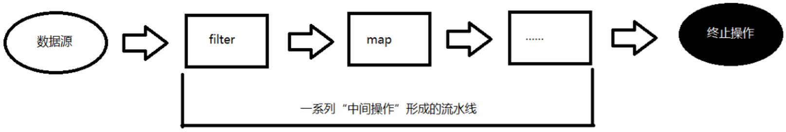
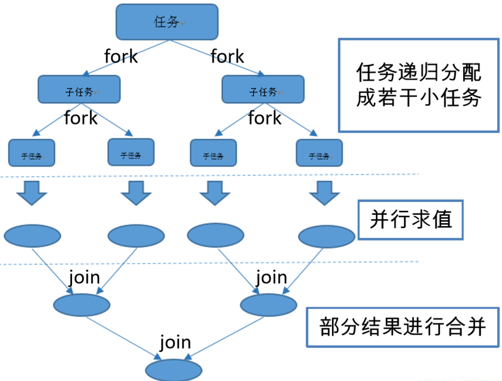
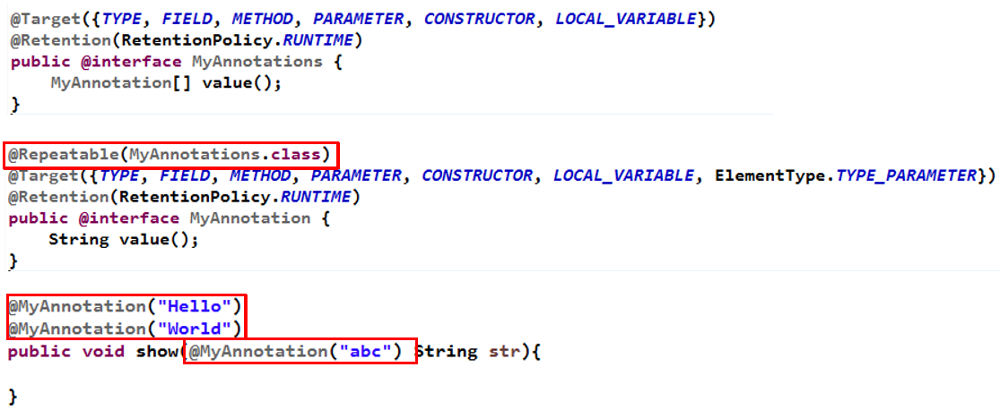

# Java8新特性 :happy:

*@Author:hanguixian*

*@Email:hn_hanguixian@163.com*


## 一.Lambda表达式

### 1.为什么使用 Lambda 表达式

- Lambda 是一个匿名函数，我们可以把 Lambda 表达式理解为是一段可以传递的代码（将代码像数据一样进行传递）。可以写出更简洁、更灵活的代码。作为一种更紧凑的代码风格，使Java的语言表达能力得到了提升。

- 从匿名类到 Lambda 的转换

  

  ```java
  //匿名
  Runnable runnable = new Runnable() {
              @Override
              public void run() {
                  System.out.println("HelloWorld");
              }
          } ;
  //Lamabda表达式
  Runnable runnable1 = () -> System.out.println("HelloWorld") ;
  ```

  

### 2.  Lambda 表达式语法

- Lambda 表达式在Java 语言中引入了一个新的语法元 素和操作符。这个操作符为 “->” ， 该操作符被称 为 Lambda 操作符或剪头操作符。它将 Lambda 分为 两个部分：

  - 左侧:指定了 Lambda 表达式需要的所有参数 右侧：指定了 Lambda 体，即 Lambda 表达式要执行 的功能。
  - 右侧:指定了 Lambda 体，即 Lambda 表达式要执行 的功能。

- 语法格式一：无参，无返回值，Lambda 体只需一条语句

  ```java
  Runnable runnable1 = () -> System.out.println("HelloWorld") ;
  ```

- 语法格式二：Lambda 需要一个参数

  ```java
  Consumer<Employee> consumer = (x) -> System.out.println(x) ;
  ```

- 语法格式三：Lambda 只需要一个参数时，参数的小括号可以省略

  ```java
  Consumer<Employee> consumer = x -> System.out.println(x) ;
  ```

- 语法格式四：Lambda 需要两个参数，并且有返回值

  ```java
  BinaryOperator<Long>   binaryOperator = (x,y) -> {
              System.out.println("函数实现");
              return x + y ;
          } ;
  System.out.println(binaryOperator.apply(2L,3L));
  ```

- 语法格式五：当Lambda 体只有一条语句时，return 与大括号可以省略

  ```java
  BinaryOperator<Long>   binaryOperator = (x,y) -> return x + y ;
  ```

- 语法格式六：数据类型可以省 略，因为可由编 译器推断得出， 称为“类型推断”

  ```java
  BinaryOperator<Long>   binaryOperator = (Long x,Long y) -> {
              System.out.println("函数实现");
              return x + y ;
          } ;
  ```

- 类型推断

  - 上述 Lambda 表达式中的参数类型都是由编译器推断 得出的。Lambda 表达式中无需指定类型，程序依然可以编译，这是因为 javac 根据程序的上下文，在后台推断出了参数的类型。Lambda 表达式的类型依赖于上 下文环境，是由编译器推断出来的。这就是所谓的 “类型推断”

### 3.函数式接口

- 什么是函数式接口

  - 只包含一个抽象方法的接口，称为函数式接口。 
  - 你可以通过 Lambda 表达式来创建该接口的对象。（若 Lambda 表达式抛出一个受检异常，那么该异常需要在目标接口的抽象方法上进行声明）。
  - 我们可以在任意函数式接口上使用 `@FunctionalInterface` 注解，这样做可以检查它是否是一个函数式接口，同时 javadoc 也会包含一条声明，说明这个接口是一个函数式接口。(加上该注解,接口不是一个接口方法会报编译错误)

- 自定义函数式接口

  ```java
  @FunctionalInterface
  public interface MyFun {
      Double getValue() ;
  }
  
  //函数式接口中使用泛型：
  @FunctionalInterface
  public interface MyFunC<T> {
      T getValue(T t) ;
  }
  ```

- 作为参数传递 Lambda 表达式

  ```java
   public String testUpperString(MyFun<String> myFun ,String str){
          return myFun.getValue(str)  ;
      }
  ```

  - 注意:作为参数传递 Lambda 表达式：为了将 Lambda 表达式作为参数传递，接收Lambda 表达式的参数类型必须是与该 Lambda 表达式兼容的函数式接口的类型。

### 4.Java 内置四大核心函数式接口

| 函数式接口  | 参数类型 | 返回类型 | 用途 |
| ----------- | -------- | -------- | ---- |
| Consumer<T>消费型接口 | T | void   | 对类型为T的对象应用操 作，包含方法： void accept(T t) |
| Supplier<T> 供给型接口 | 无 | T | 返回类型为T的对象，包 含方法：T get(); |
| Function<T, R> 函数型接口 | T | R | 对类型为T的对象应用操作，并返回结果。结果是R类型的对象。包含方法：R apply(T t); |
| Predicate<T> 断定型接口 | T | boolean | 确定类型为T的对象是否 满足某约束，并返回 boolean 值。包含方法 boolean test(T t); |

   

### 5.其他接口

| 函数式接口                                               | 参数类型          | 返回类型          | 用途                                                         |
| -------------------------------------------------------- | ----------------- | ----------------- | ------------------------------------------------------------ |
| BiFunction<T, U, R>                                      | T, U              | R                 | 对类型为 T, U 参数应用 操作，返回 R 类型的结 果。包含方法为 R apply(T t, U u); |
| UnaryOperator<T> (Function子接口)                        | T                 | T                 | 对类型为T的对象进行一 元运算，并返回T类型的 结果。包含方法为 T apply(T t); |
| BinaryOperator<T> (BiFunction 子接口)                    | T, T              | T                 | 对类型为T的对象进行二 元运算，并返回T类型的 结果。包含方法为 T apply(T t1, T t2); |
| BiConsumer<T, U>                                         | T, U              | void              | 对类型为T, U 参数应用 操作。包含方法为 void accept(T t, U u) |
| ToIntFunction<T> ,ToLongFunction<T> ,ToDoubleFunction<T> | T                 | int ,long ,double | 分 别 计 算 int 、 long 、 double、值的函数                  |
| IntFunction<R> ,LongFunction<R> ,DoubleFunction<R>       | int ,long ,double | R                 | 参数分别为int、long、 double 类型的函数                      |


## 二.方法引用与构造器引用

### 1.方法引用

- 当要传递给Lambda体的操作，已经有实现的方法了，可以使用方法引用！（实现抽象方法的参数列表，必须与方法引用方法的参数列表保持一致！）方法引用：使用操作符 “::” 将方法名和对象或类的名字分隔开来。 如下三种主要使用情况：

  - 类 :: 实例方法
  - 类::静态方法

  - 对象::实例方法

    

- 类 :: 实例方法

  ```java
  //类名 :: 实例方法名
  	@Test
  	public void test5(){
  		BiPredicate<String, String> bp = (x, y) -> x.equals(y);
  		System.out.println(bp.test("abcde", "abcde"));
  		
  		System.out.println("-----------------------------------------");
  		
  		BiPredicate<String, String> bp2 = String::equals;
  		System.out.println(bp2.test("abc", "abc"));
  		
  		System.out.println("-----------------------------------------");
  		
  		
  		Function<Employee, String> fun = (e) -> e.show();
  		System.out.println(fun.apply(new Employee()));
  		
  		System.out.println("-----------------------------------------");
  		
  		Function<Employee, String> fun2 = Employee::show;
  		System.out.println(fun2.apply(new Employee()));
  		
  	}
  ```

- 类::静态方法

  ```java
  //类名 :: 静态方法名
  	@Test
  	public void test4(){
  		Comparator<Integer> com = (x, y) -> Integer.compare(x, y);
  		
  		System.out.println("-------------------------------------");
  		
  		Comparator<Integer> com2 = Integer::compare;
  	}
  
  	@Test
  	public void test3(){
  		BiFunction<Double, Double, Double> fun = (x, y) -> Math.max(x, y);
  		System.out.println(fun.apply(1.5, 22.2));
  		
  		System.out.println("--------------------------------------------------");
  		
  		BiFunction<Double, Double, Double> fun2 = Math::max;
  		System.out.println(fun2.apply(1.2, 1.5));
  	}
  ```

  

- 对象::实例方法

  ```java
  //对象的引用 :: 实例方法名
  	@Test
  	public void test2(){
  		Employee emp = new Employee(101, "张三", 18, 9999.99);
  		
  		Supplier<String> sup = () -> emp.getName();
  		System.out.println(sup.get());
  		
  		System.out.println("----------------------------------");
  		
  		Supplier<String> sup2 = emp::getName;
  		System.out.println(sup2.get());
  	}
  ```


- 注意：

		  ①方法引用所引用的方法的参数列表与返回值类型，需要与函数式接口中抽象方法的参数列表和返回值类型保持一致！
		 ②若Lambda 的参数列表的第一个参数，是实例方法的调用者，第二个参数(或无参)是实例方法的参数时，格式：ClassName::MethodName

### 2.构造器引用

- 格式： **ClassName::new** 

  - 与函数式接口相结合，自动与函数式接口中方法兼容。可以把构造器引用赋值给定义的方法，与构造器参数列表要与接口中抽象方法的参数列表一致！

    ```java
    
    	//构造器引用
    	@Test
    	public void test7(){
    		Function<String, Employee> fun = Employee::new;
    		
    		BiFunction<String, Integer, Employee> fun2 = Employee::new;
    	}
    	
    	@Test
    	public void test6(){
    		Supplier<Employee> sup = () -> new Employee();
    		System.out.println(sup.get());
    		
    		System.out.println("------------------------------------");
    		
    		Supplier<Employee> sup2 = Employee::new;
    		System.out.println(sup2.get());
    	}
    ```


### 3.数组引用

- 格式： **type[] :: new**

  ```java
  //数组引用
  	@Test
  	public void test8(){
  		Function<Integer, String[]> fun = (args) -> new String[args];
  		String[] strs = fun.apply(10);
  		System.out.println(strs.length);
  		
  		System.out.println("--------------------------");
  		
  		Function<Integer, Employee[]> fun2 = Employee[] :: new;
  		Employee[] emps = fun2.apply(20);
  		System.out.println(emps.length);
  	}
  ```


## 三.强大的 Stream API

### 1.了解Stream

- Java8中有两大最为重要的改变。第一个是 Lambda 表达式；另外一 个则是 Stream API(java.util.stream.*)。Stream 是 Java8 中处理集合的关键抽象概念，它可以指定你希望对集合进行的操作，可以执行非常复杂的查找、过滤和映射数据等操作。使用Stream API 对集合数据进行操作，就类似于使用 SQL 执行的数据库查询。也可以使用 Stream API 来并行执行操作。简而言之，Stream API 提供了一种高效且易于使用的处理数据的方式.

### 2.什么是 Stream

- 流(Stream) 到底是什么呢？
  - 是数据渠道，用于操作数据源（集合、数组等）所生成的元素序列。
  - **“集合讲的是数据，流讲的是计算！”**
  - 注意:
    - ①Stream 自己不会存储元素。
    - ②Stream 不会改变源对象。相反，他们会返回一个持有结果的新Stream。
    - ③Stream 操作是延迟执行的。这意味着他们会等到需要结果的时候才执行

### 3.Stream 的操作三个步骤

-  创建 Stream
   - 一个数据源（如：集合、数组），获取一个流  中间操作
-  中间操作
  - 一个中间操作链，对数据源的数据进行处理  终止操作(终端操作)
-  终止操作(终端操作)
  - 一个终止操作，执行中间操作链，并产生结果



#### 3.1.创建Stream

- Java8 中的 Collection 接口被扩展，提供了 两个获取流的方法：

  - `deault Stream<E> stream() `: 返回一个顺序流 
  - `default Stream<E> parallelStream()` : 返回一个并行流

- Java8 中的 Arrays 的静态方法 stream() 可 以获取数组流：

  - `由数组创建流`:Java8 中的 Arrays 的静态方法 stream() 可 以获取数组流：

     `static <T> Stream<T> stream(T[] array)` : 返回一个流

  - 重载形式，能够处理对应基本类型的数组： 

    - `public static IntStream stream(int[] array) `
    - `public static LongStream stream(long[] array)` 
    - `public static DoubleStream stream(double[] array)`

  - 由值创建流:可以使用静态方法 Stream.of(), 通过显示值 创建一个流。它可以接收任意数量的参数。

    -  `public static<T> Stream<T> of(T... values) ` : 返回一个流

  - 由函数创建流,创建无限流:可以使用静态方法 Stream.iterate() 和 Stream.generate(), 创建无限流。

    - 迭代  `public static<T> Stream<T> iterate(final T seed, final UnaryOperator<T> f) `

    - 生成  `public static<T> Stream<T> generate(Supplier<T> s) : `

      

```java
//1. 创建 Stream
@Test
public void test1(){
	//1. Collection 提供了两个方法  stream() 与 parallelStream()
	List<String> list = new ArrayList<>();
	Stream<String> stream = list.stream(); //获取一个顺序流
	Stream<String> parallelStream = list.parallelStream(); //获取一个并行流
	
	//2. 通过 Arrays 中的 stream() 获取一个数组流
	Integer[] nums = new Integer[10];
	Stream<Integer> stream1 = Arrays.stream(nums);
	
	//3. 通过 Stream 类中静态方法 of()
	Stream<Integer> stream2 = Stream.of(1,2,3,4,5,6);
	
	//4. 创建无限流
	//迭代
	Stream<Integer> stream3 = Stream.iterate(0, (x) -> x + 2).limit(10);
	stream3.forEach(System.out::println);
	
	//生成
	Stream<Double> stream4 = Stream.generate(Math::random).limit(2);
	stream4.forEach(System.out::println);
	
}
```


#### 3.2 Stream 的中间操作

- **多个中间操作可以连接起来形成一个流水线，除非流水 线上触发终止操作，否则中间操作不会执行任何的处理！ 而在终止操作时一次性全部处理，称为“惰性求值”。**

- 筛选与切片

  | 方法                | 描述                                                         |
  | ------------------- | ------------------------------------------------------------ |
  | filter(Predicate p) | 接收 Lambda ， 从流中排除某些元素。                          |
  | distinct()          | 筛选，通过流所生成元素的 hashCode() 和 equals() 去 除重复元素 limit(long maxSize) 截断流，使其元素不超过给定数量。 |
  | skip(long n)        | 跳过元素，返回一个扔掉了前 n 个元素的流。若流中元素 不足 n 个，则返回一个空流。与 limit(n) 互补 |
  | limit(long maxSize) | 截断流，使其元素不超过给定数量。                             |

  ```java
  //2. 中间操作
  List<Employee> emps = Arrays.asList(
  		new Employee(102, "李四", 59, 6666.66),
  		new Employee(101, "张三", 18, 9999.99),
  		new Employee(103, "王五", 28, 3333.33),
  		new Employee(104, "赵六", 8, 7777.77),
  		new Employee(104, "赵六", 8, 7777.77),
  		new Employee(104, "赵六", 8, 7777.77),
  		new Employee(105, "田七", 38, 5555.55)
  );
  
  /*
    筛选与切片
  	filter——接收 Lambda ， 从流中排除某些元素。
  	limit——截断流，使其元素不超过给定数量。
  	skip(n) —— 跳过元素，返回一个扔掉了前 n 个元素的流。若流中元素不足 n 个，则返回一个空流。与 limit(n) 互补
  	distinct——筛选，通过流所生成元素的 hashCode() 和 equals() 去除重复元素
   */
  
  //内部迭代：迭代操作 Stream API 内部完成
  @Test
  public void test2(){
  	//所有的中间操作不会做任何的处理
  	Stream<Employee> stream = emps.stream()
  		.filter((e) -> {
  			System.out.println("测试中间操作");
  			return e.getAge() <= 35;
  		});
  	
  	//只有当做终止操作时，所有的中间操作会一次性的全部执行，称为“惰性求值”
  	stream.forEach(System.out::println);
  }
  
  //外部迭代
  @Test
  public void test3(){
  	Iterator<Employee> it = emps.iterator();
  	
  	while(it.hasNext()){
  		System.out.println(it.next());
  	}
  }
  
  @Test
  public void test4(){
  	emps.stream()
  		.filter((e) -> {
  			System.out.println("短路！"); // &&  ||
  			return e.getSalary() >= 5000;
  		}).limit(3)
  		.forEach(System.out::println);
  }
  
  @Test
  public void test5(){
  	emps.parallelStream()
  		.filter((e) -> e.getSalary() >= 5000)
  		.skip(2)
  		.forEach(System.out::println);
  }
  //需要重写hashCode() 和 equals()
  @Test
  public void test6(){
  	emps.stream()
  		.distinct()
  		.forEach(System.out::println);
  }
  ```

 - 映射

    | 方 法                             | 描 述                                                        |
    | --------------------------------- | ------------------------------------------------------------ |
    | `map(Function f)`                 | 接收一个函数作为参数，该函数会被应用到每个元 素上，并将其映射成一个新的元素。 |
    | `mapToDouble(ToDoubleFunction f)` | 接收一个函数作为参数，该函数会被应用到每个元 素上，产生一个新的 DoubleStream。 |
    | `mapToInt(ToIntFunction f)`       | 接收一个函数作为参数，该函数会被应用到每个元 素上，产生一个新的 IntStream。 |
    | `mapToLong(ToLongFunction f)`     | 接收一个函数作为参数，该函数会被应用到每个元 素上，产生一个新的 LongStream。 |
    | `flatMap(Function f)`             | 接收一个函数作为参数，将流中的每个值都换成另 一个流，然后把所有流连接成一个流 |

    

    ```java
    /*
    映射
    	map——接收 Lambda ， 将元素转换成其他形式或提取信息。接收一个函数作为参数，该函数会被应用到每个元素上，并将其映射成一个新的元素。
    	flatMap——接收一个函数作为参数，将流中的每个值都换成另一个流，然后把所有流连接成一个流
     */
    @Test
    public void test1(){
    	Stream<String> str = emps.stream()
    		.map((e) -> e.getName());
    	
    	System.out.println("-------------------------------------------");
    	
    	List<String> strList = Arrays.asList("aaa", "bbb", "ccc", "ddd", "eee");
    	
    	Stream<String> stream = strList.stream()
    		   .map(String::toUpperCase);
    	
    	stream.forEach(System.out::println);
    	
    	Stream<Stream<Character>> stream2 = strList.stream()
    		   .map(TestStreamAPI1::filterCharacter);
    	
    	stream2.forEach((sm) -> {
    		sm.forEach(System.out::println);
    	});
    	
    	System.out.println("---------------------------------------------");
    	
    	Stream<Character> stream3 = strList.stream()
    		   .flatMap(TestStreamAPI1::filterCharacter);
    	
    	stream3.forEach(System.out::println);
    }
    
    public static Stream<Character> filterCharacter(String str){
    	List<Character> list = new ArrayList<>();
    	
    	for (Character ch : str.toCharArray()) {
    		list.add(ch);
    	}
    	
    	return list.stream();
    }
    ```

    

- 排序

    | 方 法                   | 描 述                              |
    | ----------------------- | ---------------------------------- |
    | sorted()                | 产生一个新流，其中按自然顺序排序   |
    | sorted(Comparator comp) | 产生一个新流，其中按比较器顺序排序 |

    

    ```java
    /*
    	sorted()——自然排序
    	sorted(Comparator com)——定制排序
     */
    @Test
    public void test2(){
    	emps.stream()
    		.map(Employee::getName)
    		.sorted()
    		.forEach(System.out::println);
    	
    	System.out.println("------------------------------------");
    	
    	emps.stream()
    		.sorted((x, y) -> {
    			if(x.getAge() == y.getAge()){
    				return x.getName().compareTo(y.getName());
    			}else{
    				return Integer.compare(x.getAge(), y.getAge());
    			}
    		}).forEach(System.out::println);
    }
    ```
    

#### 3.3 Stream 的终止操作

- 收集

  | 方 法                  | 描 述                                                        |
  | ---------------------- | ------------------------------------------------------------ |
  | `collect(Collector c)` | 将流转换为其他形式。接收一个 Collector接口的 实现，用于给Stream中元素做汇总的方法 |

- Collector 接口中方法的实现决定了如何对流执行收集操作(如收集到 List、Set、Map)。但是 Collectors 实用类提供了很多静态方法，可以方便地创建常见收集器实例，具体方法与实例如下表：

  | 方法              | 返回类型                | 作用                                                         | 示例                                                         |
  | ----------------- | ----------------------- | ------------------------------------------------------------ | ------------------------------------------------------------ |
  | toList            | `List<T>`               | 把流中元素收集到List                                         | `List<Employee> emps= list.stream().collect(Collectors.toList());` |
  | toSet             | `Set<T>`                | 把流中元素收集到Set                                          | `Set<Employee> emps= list.stream().collect(Collectors.toSet());` |
  | toCollection      | `Collection<T>`         | 把流中元素收集到创建的集合                                   | `Collection<Employee> emps=list.stream().collect(Collectors.toCollection(ArrayList::new));` |
  | counting          | Long                    | 计算流中元素的个数                                           | `long count = list.stream().collect(Collectors.counting());` |
  | summingInt        | Integer                 | 对流中元素的整数属性求和                                     | `int total=list.stream().collect(Collectors.summingInt(Employee::getSalary));` |
  | averagingInt      | Double                  | 计算流中元素Integer属性的平均值                              | `double avg= list.stream().collect(Collectors.averagingInt(Employee::getSalary));` |
  | summarizingInt    | IntSummaryStatistics    | 收集流中Integer属性的统计值。                                | 如：平均值   `IntSummaryStatistics iss= list.stream().collect(Collectors.summarizingInt(Employee::getSalary));` |
  | joining           | String                  | 连接流中每个字符串                                           | `String str= list.stream().map(Employee::getName).collect(Collectors.joining());` |
  | maxBy             | `Optional<T>`           | 根据比较器选择最大值                                         | `Optional<Emp> max= list.stream().collect(Collectors.maxBy(comparingInt(Employee::getSalary)));` |
  | minBy             | `Optional<T>`           | 根据比较器选择最小值                                         | `Optional<Emp> min = list.stream().collect(Collectors.minBy(comparingInt(Employee::getSalary)));` |
  | reducing          | 归约产生的类型          | 从一个作为累加器的初始值 开始，利用BinaryOperator与 流中元素逐个结合，从而归 约成单个值 | `int total=list.stream().collect(Collectors.reducing(0, Employee::getSalar, Integer::sum));` |
  | collectingAndThen | 转换函数返回的类型      | 包裹另一个收集器，对其结 果转换函数                          | `int how= list.stream().collect(Collectors.collectingAndThen(Collectors.toList(), List::size));` |
  | groupingBy        | `Map<K, List<T>>`       | 根据某属性值对流分组，属 性为K，结果为V                      | `Map<Emp.Status, List<Emp>> map= list.stream() .collect(Collectors.groupingBy(Employee::getStatus));` |
  | partitioningBy    | `Map<Boolean, List<T>>` | 根据true或false进行分区                                      | `Map<Boolean,List<Emp>> vd= list.stream().collect(Collectors.partitioningBy(Employee::getManage));` |

  

​       

```java
public class TestStreamAPI2 {	
    List<Employee> emps = Arrays.asList(
            new Employee(102, "李四", 59, 6666.66, Status.BUSY),
            new Employee(101, "张三", 18, 9999.99, Status.FREE),
            new Employee(103, "王五", 28, 3333.33, Status.VOCATION),
            new Employee(104, "赵六", 8, 7777.77, Status.BUSY),
            new Employee(104, "赵六", 8, 7777.77, Status.FREE),
            new Employee(104, "赵六", 8, 7777.77, Status.FREE),
            new Employee(105, "田七", 38, 5555.55, Status.BUSY)
    );

    //终止操作
    /*
        allMatch——检查是否匹配所有元素
        anyMatch——检查是否至少匹配一个元素
        noneMatch——检查是否没有匹配的元素
        findFirst——返回第一个元素
        findAny——返回当前流中的任意元素
        count——返回流中元素的总个数
        max——返回流中最大值
        min——返回流中最小值
     */
    @Test
    public void test1(){
            boolean bl = emps.stream().allMatch((e) -> e.getStatus().equals(Status.BUSY));

            System.out.println(bl);

            boolean bl1 = emps.stream().anyMatch((e) -> e.getStatus().equals(Status.BUSY));

            System.out.println(bl1);

            boolean bl2 = emps.stream().noneMatch((e) -> e.getStatus().equals(Status.BUSY));

            System.out.println(bl2);
    }

    @Test
    public void test2(){
        Optional<Employee> op = emps.stream().sorted((e1, e2) -> Double.compare(e1.getSalary(), e2.getSalary())).findFirst();

        System.out.println(op.get());

        System.out.println("--------------------------------");

        Optional<Employee> op2 = emps.parallelStream().filter((e) -> e.getStatus().equals(Status.FREE)).findAny();

        System.out.println(op2.get());
    }

    @Test
    public void test3(){
        long count = emps.stream().filter((e) -> e.getStatus().equals(Status.FREE)).count();

        System.out.println(count);

        Optional<Double> op = emps.stream().map(Employee::getSalary).max(Double::compare);

        System.out.println(op.get());

        Optional<Employee> op2 = emps.stream().min((e1, e2) -> Double.compare(e1.getSalary(),e2.getSalary()));

        System.out.println(op2.get());
    }

    //注意：流进行了终止操作后，不能再次使用
    @Test
    public void test4(){
        Stream<Employee> stream = emps.stream().filter((e) -> e.getStatus().equals(Status.FREE));

        long count = stream.count();

        stream.map(Employee::getSalary).max(Double::compare);
    }
}
```


```java
public class TestStreamAPI3 {
	
	List<Employee> emps = Arrays.asList(
			new Employee(102, "李四", 79, 6666.66, Status.BUSY),
			new Employee(101, "张三", 18, 9999.99, Status.FREE),
			new Employee(103, "王五", 28, 3333.33, Status.VOCATION),
			new Employee(104, "赵六", 8, 7777.77, Status.BUSY),
			new Employee(104, "赵六", 8, 7777.77, Status.FREE),
			new Employee(104, "赵六", 8, 7777.77, Status.FREE),
			new Employee(105, "田七", 38, 5555.55, Status.BUSY)
	);
	
	//终止操作
	/*
		归约
		reduce(T identity, BinaryOperator) / reduce(BinaryOperator) ——可以将流中元素反复结合起来，得到一个值。
	 */
	@Test
	public void test1(){
		List<Integer> list = Arrays.asList(1,2,3,4,5,6,7,8,9,10);
		
		Integer sum = list.stream().reduce(0, (x, y) -> x + y);
		
		System.out.println(sum);
		
		System.out.println("----------------------------------------");
		
		Optional<Double> op = emps.stream().map(Employee::getSalary).reduce(Double::sum);
		
		System.out.println(op.get());
	}
	
	//需求：搜索名字中 “六” 出现的次数
	@Test
	public void test2(){
		Optional<Integer> sum = emps.stream()
			.map(Employee::getName)
			.flatMap(TestStreamAPI1::filterCharacter)
			.map((ch) -> {
				if(ch.equals('六'))
					return 1;
				else 
					return 0;
			}).reduce(Integer::sum);
		
		System.out.println(sum.get());
	}
	
	//collect——将流转换为其他形式。接收一个 Collector接口的实现，用于给Stream中元素做汇总的方法
	@Test
	public void test3(){
		List<String> list = emps.stream().map(Employee::getName).collect(Collectors.toList());
		
		list.forEach(System.out::println);
		
		System.out.println("----------------------------------");
		
		Set<String> set = emps.stream().map(Employee::getName).collect(Collectors.toSet());
		
		set.forEach(System.out::println);

		System.out.println("----------------------------------");
		
		HashSet<String> hs = emps.stream()
			.map(Employee::getName)
			.collect(Collectors.toCollection(HashSet::new));
		
		hs.forEach(System.out::println);
	}
	
	@Test
	public void test4(){
		Optional<Double> max = emps.stream()
			.map(Employee::getSalary)
			.collect(Collectors.maxBy(Double::compare));
		
		System.out.println(max.get());
		
		Optional<Employee> op = emps.stream()
			.collect(Collectors.minBy((e1, e2) -> Double.compare(e1.getSalary(), e2.getSalary())));
		
		System.out.println(op.get());
		
		Double sum = emps.stream().collect(Collectors.summingDouble(Employee::getSalary));
		
		System.out.println(sum);
		
		Double avg = emps.stream().collect(Collectors.averagingDouble(Employee::getSalary));
		
		System.out.println(avg);
		
		Long count = emps.stream().collect(Collectors.counting());
		
		System.out.println(count);
		
		System.out.println("--------------------------------------------");
		
		DoubleSummaryStatistics dss = emps.stream()
			.collect(Collectors.summarizingDouble(Employee::getSalary));
		
		System.out.println(dss.getMax());
	}
	
	//分组
	@Test
	public void test5(){
		Map<Status, List<Employee>> map = emps.stream()
			.collect(Collectors.groupingBy(Employee::getStatus));
		
		System.out.println(map);
	}
	
	//多级分组
	@Test
	public void test6(){
		Map<Status, Map<String, List<Employee>>> map = emps.stream()
			.collect(Collectors.groupingBy(Employee::getStatus, Collectors.groupingBy((e) -> {
				if(e.getAge() >= 60)
					return "老年";
				else if(e.getAge() >= 35)
					return "中年";
				else
					return "成年";
			})));
		
		System.out.println(map);
	}
	
	//分区
	@Test
	public void test7(){
		Map<Boolean, List<Employee>> map = emps.stream()
			.collect(Collectors.partitioningBy((e) -> e.getSalary() >= 5000));
		
		System.out.println(map);
	}
	
	//
	@Test
	public void test8(){
		String str = emps.stream()
			.map(Employee::getName)
			.collect(Collectors.joining("," , "----", "----"));
		
		System.out.println(str);
	}
	
	@Test
	public void test9(){
		Optional<Double> sum = emps.stream()
			.map(Employee::getSalary)
			.collect(Collectors.reducing(Double::sum));
		
		System.out.println(sum.get());
	}
}

```


## 四.并行流与串行流

- 并行流就是把一个内容分成多个数据块，并用不同的线程分 别处理每个数据块的流。Java 8 中将并行进行了优化，我们可以很容易的对数据进行并 行操作。Stream API 可以声明性地通过 `parallel() `与 `sequential()`在并行流与顺序流之间进行切换。

-  Fork/Join 框架

  - Fork/Join 框架：就是在必要的情况下，将一个大任务，进行拆分(fork)成若干个小任务（拆到不可再拆时），再将一个个的小任务运算的结果进行 join 汇总.

    

    

  

- Fork/Join 框架与传统线程池的区别

  - 采用 “工作窃取”模式（work-stealing）：

    - 当执行新的任务时它可以将其拆分分成更小的任务执行，并将小任务加到线程队列中，然后再从一个随机线程的队列中偷一个并把它放在自己的队列中。

    - 相对于一般的线程池实现,fork/join框架的优势体现在对其中包含的任务的处理方式上.在一般的线程池中,如果一个线程正在执行的任务由于某些原因无法继续运行,那么该线程会处于等待状态.而在fork/join框架实现中,如果某个子问题由于等待另外一个子问题的完成而无法继续运行.那么处理该子问题的线程会主动寻找其他尚未运行的子问题来执行.这种方式减少了线程的等待时间,提高了性能.

    - ForkJoinCalculate.java(拆分和并的法则)

      

      ```java
      import java.util.concurrent.RecursiveTask;
      
      public class ForkJoinCalculate extends RecursiveTask<Long>{
      
          /**
           * 
           */
          private static final long serialVersionUID = 13475679780L;
      
          private long start;
          private long end;
      
          private static final long THRESHOLD = 10000L; //临界值
      
          public ForkJoinCalculate(long start, long end) {
              this.start = start;
              this.end = end;
          }
      
          @Override
          protected Long compute() {
              long length = end - start;
      
              if(length <= THRESHOLD){
                  long sum = 0;
      
                  for (long i = start; i <= end; i++) {
                      sum += i;
                  }
      
                  return sum;
              }else{
                  long middle = (start + end) / 2;
      
                  ForkJoinCalculate left = new ForkJoinCalculate(start, middle);
                  left.fork(); //拆分，并将该子任务压入线程队列
      
                  ForkJoinCalculate right = new ForkJoinCalculate(middle+1, end);
                  right.fork();
      
                  return left.join() + right.join();
              }
      
          }
      }
      ```

    - 并行流以及Java8的并行流

      ```java
      import java.util.concurrent.ForkJoinPool;
      import java.util.concurrent.ForkJoinTask;
      import java.util.stream.LongStream;
      
      import org.junit.Test;
      
      public class TestForkJoin {
      	
      	@Test
      	public void test1(){
      		long start = System.currentTimeMillis();
      		
      		ForkJoinPool pool = new ForkJoinPool();
      		ForkJoinTask<Long> task = new ForkJoinCalculate(0L, 100000000000L);
      		
      		long sum = pool.invoke(task);
      		System.out.println(sum);
      		
      		long end = System.currentTimeMillis();
      		
      		System.out.println("耗费的时间为: " + (end - start)); //65571
      	}
      	
      	@Test
      	public void test2(){
      		long start = System.currentTimeMillis();
      		
      		long sum = 0L;
      		
      		for (long i = 0L; i <= 100000000000L; i++) {
      			sum += i;
      		}
      		
      		System.out.println(sum);
      		
      		long end = System.currentTimeMillis();
      		
      		System.out.println("耗费的时间为: " + (end - start)); //439214
      	}
      	
          //java8 cpu能跑满甚至超频
      	@Test
      	public void test3(){
      		long start = System.currentTimeMillis();
      		
      		Long sum = LongStream.rangeClosed(0L, 100000000000L)
      							 .parallel()
      							 .sum();
      		
      		System.out.println(sum);
      		
      		long end = System.currentTimeMillis();
      		
      		System.out.println("耗费的时间为: " + (end - start)); //46234
      	}
      
      }
      ```


## 五.接口中的默认方法与静态方法

- Java 8中允许接口中包含具有具体实现的方法，该方法称为 “默认方法”，默认方法使用 default 关键字修饰。

- 接口默认方法的”类优先”原则 

  - 若一个接口中定义了一个默认方法,而另外一个父类或接口中,又定义了一个同名的方法时

    - 选择父类中的方法。如果一个父类提供了具体的实现，那么 接口中具有相同名称和参数的默认方法会被忽略。 
    - 接口冲突。如果一个父接口提供一个默认方法，而另一个接 口也提供了一个具有相同名称和参数列表的方法（不管方法 是否是默认方法），那么必须覆盖该方法来解决冲突


- Java8 中，接口中允许添加静态方法

  ​    

    ```java
    public interface MyFun {
    	
    	default String getName(){
    		return "Fun---getName";
    	}
    
    }
    
    ```

    ```java
    public interface MyInterface {
    	
    	
    	//必须覆写
    //	int getAge() ;
    	
    	
    	default String getName(){
    		return "interface--->getName";
    	}
    	//静态方法
    	public static void show(){
    		System.out.println("静态show");
    	}
    
    }
    ```

    ```java
    public class MyClass {
    	
    	public String getName(){
    		return "类方法---->getName";
    	}
    
    }
    
    ```

    ```java
    //没有继承类时,同时接口冲突时,必须覆写一个
    public class SubClass /*extends MyClass*/ implements MyFun, MyInterface{
    
    	@Override
    	public String getName() {
    		return MyInterface.super.getName();
    	}
    
    }
    
    ```

    

## 六.新时间日期 API

### 1.使用 LocalDate、LocalTime、LocalDateTime

-  LocalDate、LocalTime、LocalDateTime 类的实 例是`不可变的对象`，分别表示使用 ISO-8601日 历系统的日期、时间、日期和时间。它们提供了简单的日期或时间，并不包含当前的时间信息。也不包含与时区相关的信息。
- 注：ISO-8601日历系统是国际标准化组织制定的现代公民的日期和时间的表示法


| 方法                                               | 描述                                                         |
| -------------------------------------------------- | ------------------------------------------------------------ |
| now()                                              | 静态方法，根据当前时间创建对象                               |
| of()                                               | 静态方法，根据指定日期/时间创建 对象                         |
| plusDays, plusWeeks, plusMonths, plusYears         | 向当前 LocalDate 对象添加几天、 几周、几个月、几年           |
| minusDays, minusWeeks, minusMonths, minusYears     | 从当前 LocalDate 对象减去几天、 几周、几个月、几年           |
| plus, minus                                        | 添加或减少一个 Duration或 Period                             |
| withDayOfMonth, withDayOfYear, withMonth, withYear | 将月份天数、年份天数、月份、年 份修改为指定的值并返回新的 LocalDate对象 |
| getDayOfMonth                                      | 获得月份天数(1-31)                                           |
| getDayOfYear                                       | 获得年份天数(1-366)                                          |
| getDayOfWeek                                       | 获得星期几(返回一个 DayOfWeek 枚举值)                        |
| getMonth                                           | 获得月份, 返回一个 Month枚举值                               |
| getMonthValue                                      | 获得月份(1-12)                                               |
| getYear                                            | 获得年份                                                     |
| until                                              | 获得两个日期之间的 Period 对象， 或者指定 ChronoUnits的数字  |
| isBefore, isAfter                                  | 比较两个 LocalDate isLeapYear 判断是否是闰年                 |


```java
//LocalDate、LocalTime、LocalDateTime 的API一样 以LocalDateTime为例:
@Test
public void test1(){
    LocalDateTime ldt = LocalDateTime.now();
    System.out.println(ldt);

    LocalDateTime ld2 = LocalDateTime.of(2018, 11, 21, 10, 10, 10);
    System.out.println(ld2);

    LocalDateTime ldt3 = ld2.plusYears(20);
    System.out.println(ldt3);

    LocalDateTime ldt4 = ld2.minusMonths(2);
    System.out.println(ldt4);

    System.out.println(ldt.getYear());
    System.out.println(ldt.getMonthValue());
    System.out.println(ldt.getDayOfMonth());
    System.out.println(ldt.getHour());
    System.out.println(ldt.getMinute());
    System.out.println(ldt.getSecond());
}

```


###  2.Instant 时间戳

- 用于“时间戳”的运算。它是以Unix元年(传统 的设定为UTC时区1970年1月1日午夜时分)开始 所经历的描述进行运算

  

  ```java
  //Instant : 时间戳。 （使用 Unix 元年  1970年1月1日 00:00:00 所经历的毫秒值）
  @Test
  public void test2(){
      Instant ins = Instant.now();  //默认使用 UTC 时区
      System.out.println(ins);
  
      OffsetDateTime odt = ins.atOffset(ZoneOffset.ofHours(8));
      System.out.println(odt);
  
      System.out.println(ins.getNano());
  
      Instant ins2 = Instant.ofEpochSecond(5);
      System.out.println(ins2);
  }
  ```

  

### 3.Duration 和 Period

- Duration:用于计算两个“时间”间隔

- Period:用于计算两个“日期”间隔

  

  ```java
  
  //Duration : 用于计算两个“时间”间隔
  //Period : 用于计算两个“日期”间隔
  @Test
  public void test3(){
      Instant ins1 = Instant.now();
  
      System.out.println("--------------------");
      try {
          Thread.sleep(1000);
      } catch (InterruptedException e) {
      }
  
      Instant ins2 = Instant.now();
  
      System.out.println("所耗费时间为：" + Duration.between(ins1, ins2));
  
      System.out.println("----------------------------------");
  
      LocalDate ld1 = LocalDate.now();
      LocalDate ld2 = LocalDate.of(2011, 1, 1);
  
      Period pe = Period.between(ld2, ld1);
      System.out.println(pe.getYears());
      System.out.println(pe.getMonths());
      System.out.println(pe.getDays());
  }
  ```

  

### 4.日期的操纵

- TemporalAdjuster : 时间校正器。有时我们可能需要获 取例如：将日期调整到“下个周日”等操作。

- TemporalAdjusters : 该类通过静态方法提供了大量的常 用 TemporalAdjuster 的实现。

  

  ```java
  //TemporalAdjuster : 时间校正器
  @Test
  public void test4(){
      LocalDateTime ldt = LocalDateTime.now();
      System.out.println(ldt);
  
      LocalDateTime ldt2 = ldt.withDayOfMonth(10);
      System.out.println(ldt2);
  
      LocalDateTime ldt3 = ldt.with(TemporalAdjusters.next(DayOfWeek.SUNDAY));
      System.out.println(ldt3);
  
      //自定义：下一个工作日
      LocalDateTime ldt5 = ldt.with((l) -> {
          LocalDateTime ldt4 = (LocalDateTime) l;
  
          DayOfWeek dow = ldt4.getDayOfWeek();
  
          if(dow.equals(DayOfWeek.FRIDAY)){
              return ldt4.plusDays(3);
          }else if(dow.equals(DayOfWeek.SATURDAY)){
              return ldt4.plusDays(2);
          }else{
              return ldt4.plusDays(1);
          }
      });
  
      System.out.println(ldt5);
  
  }
  ```

  

### 5.解析与格式化

- java.time.format.DateTimeFormatter 类：该类提供了三种 格式化方法：
  - 预定义的标准格式

  - 语言环境相关的格式

  - 自定义的格式

    

    ```java
    //5. DateTimeFormatter : 解析和格式化日期或时间
    @Test
    public void test5(){
        //DateTimeFormatter dtf = DateTimeFormatter.ISO_LOCAL_DATE;
        DateTimeFormatter dtf = DateTimeFormatter.ofPattern("yyyy年MM月dd日 HH:mm:ss E");
        LocalDateTime ldt = LocalDateTime.now();
        String strDate = ldt.format(dtf);
    
        System.out.println(strDate);
    
        LocalDateTime newLdt = ldt.parse(strDate, dtf);
        System.out.println(newLdt);
    }
    ```

    

### 6.时区的处理

- Java8 中加入了对时区的支持，带时区的时间为分别为：

  - ZonedDate、ZonedTime、ZonedDateTime

    其中每个时区都对应着 ID，地区ID都为 “{区域}/{城市}”的格式

    例如 ：Asia/Shanghai 等

    - ZoneId：该类中包含了所有的时区信息
    - getAvailableZoneIds() : 可以获取所有时区时区信息
    - of(id) : 用指定的时区信息获取 ZoneId 对象

    

```java
//ZonedDate、ZonedTime、ZonedDateTime ： 带时区的时间或日期
@Test
public void test7(){
    LocalDateTime ldt = LocalDateTime.now(ZoneId.of("Asia/Shanghai"));
    System.out.println(ldt);

    ZonedDateTime zdt = ZonedDateTime.now(ZoneId.of("US/Pacific"));
    System.out.println(zdt);
}

@Test
public void test6(){
    Set<String> set = ZoneId.getAvailableZoneIds();
    set.forEach(System.out::println);
}
```


### 7.与传统日期处理的转换


| 类                                                       | To 遗留类                              | From 遗留类                 |
| -------------------------------------------------------- | -------------------------------------- | --------------------------- |
| java.time.Instant, java.util.Date                        | Date.from(instant)                     | date.toInstant()            |
| java.time.Instant, java.sql.Timestamp                    | Timestamp.from(instant)                | timestamp.toInstant()       |
| java.time.ZonedDateTime, java.util.GregorianCalendar     | GregorianCalendar.from(zonedDateTim e) | cal.toZonedDateTime()       |
| java.time.LocalDate, java.sql.Time                       | Date.valueOf(localDate)                | date.toLocalDate()          |
| java.time.LocalTime, java.sql.Time                       | Date.valueOf(localDate)                | date.toLocalTime()          |
| java.time.LocalDateTime, java.sql.Timestamp              | Timestamp.valueOf(localDateTime)       | timestamp.toLocalDateTime() |
| java.time.ZoneId, java.util.TimeZone                     | Timezone.getTimeZone(id)               | timeZone.toZoneId()         |
| java.time.format.DateTimeFormatter, java.text.DateFormat | formatter.toFormat()                   | 无                          |


 ```java
// java.time.LocalDate, java.sql.Time
@Test
    public void test8(){
       LocalTime localTime = LocalTime.now() ;
        System.out.println(localTime) ;
       Time date1 = Time.valueOf(localTime) ;
        System.out.println(date1);
    }
 ```


## 七.Optional 类

- `Optional<T> `类(java.util.Optional) 是一个容器类，代表一个值存在或不存在，原来用 null 表示一个值不存在，现在 Optional 可以更好的表达这个概念。并且可以避免空指针异常。

- 常用方法：

  - Optional.of(T t) : 创建一个 Optional 实例
  - Optional.empty() : 创建一个空的 Optional 实例
  - Optional.ofNullable(T t):若 t 不为 null,创建 Optional 实例,否则创建空实例
  - isPresent() : 判断是否包含值
  - orElse(T t) :  如果调用对象包含值，返回该值，否则返回t
  - orElseGet(Supplier s) :如果调用对象包含值，返回该值，否则返回 s 获取的值
  - map(Function f): 如果有值对其处理，并返回处理后的Optional，否则返回 Optional.empty()
  - flatMap(Function mapper):与 map 类似，要求返回值必须是Optional

- 1

  ```java
  public class TestOptional {
  	
      
  	@Test
  	public void test1(){
  		Optional<Employee> op = Optional.of(new Employee());
  		Employee emp = op.get();
  		System.out.println(emp);
  	}
      
  	@Test
  	public void test3(){
  		Optional<Employee> op = Optional.ofNullable(new Employee());
  		
  		if(op.isPresent()){
  			System.out.println(op.get());
  		}
  		
  		Employee emp = op.orElse(new Employee("KKK"));
  		System.out.println(emp);
  		
  		Employee emp2 = op.orElseGet(() -> new Employee());
  		System.out.println(emp2);
  	}
      
      	@Test
  	public void test4(){
  		Optional<Employee> op = Optional.of(new Employee(101, "KKK", 18, 9999.99));
  		
  		Optional<String> op2 = op.map(Employee::getName);
  		System.out.println(op2.get());
  		
  		Optional<String> op3 = op.flatMap((e) -> Optional.of(e.getName()));
  		System.out.println(op3.get());
  	}
  	
  	@Test
  	public void test5(){
  		Man man = new Man();
  		
  		String name = getIdentity(man);
  		System.out.println(name);
  	}
  	
  	//需求：获取一个人的身份
  	public String getIdentity(Man man){
  		if(man != null){
  			Identity g = man.getIdentity();
  			
  			if(g != null){
  				return g.getName();
  			}
  		}
  		
  		return "BOSS";
  	}
  	
  	//运用 Optional 的实体类
  	@Test
  	public void test6(){
  		Optional<getIdentity> godness = Optional.ofNullable(new Identity("王三"));
  		
  		Optional<NewMan> op = Optional.ofNullable(new NewMan(godness));
  		String name = getIdentity2(op);
  		System.out.println(name);
  	}
  	
  	public String getIdentity2(Optional<NewMan> man){
  		return man.orElse(new NewMan())
  				  .getIdentity()
  				  .orElse(new Identity("教师"))
  				  .getName();
  	}
  }
  //...........................................................................................
  
  //...........NewMan................
  //注意：Optional 不能被序列化
  public class NewMan {
  
  	private Optional<Identity> identity = Optional.empty();
  	
  	private Identity identiting;
  //......省略....
  }
  
  //.............Man.....................
  public class Man {
  
  	private Identity identity;
      //..........省略...............
  }
  
  //.............Identity..................
  public class Identity {
  
  	private String name;
      //.........省略........
  }
  
  //.................Employee............................
  public class Employee {
  
  	private int id;
  	private String name;
  	private int age;
  	private double salary;
  	private Status status;
  //..............省略............................
  }
  ```

  

## 八.重复注解与类型注解

- Java 8对注解处理提供了两点改进：可重复的注解及可用于类 型的注解

  ​         