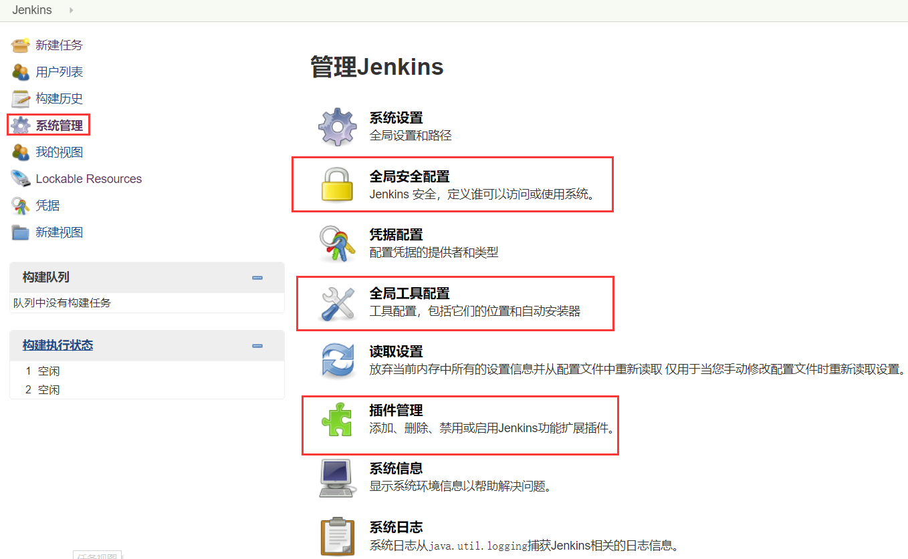
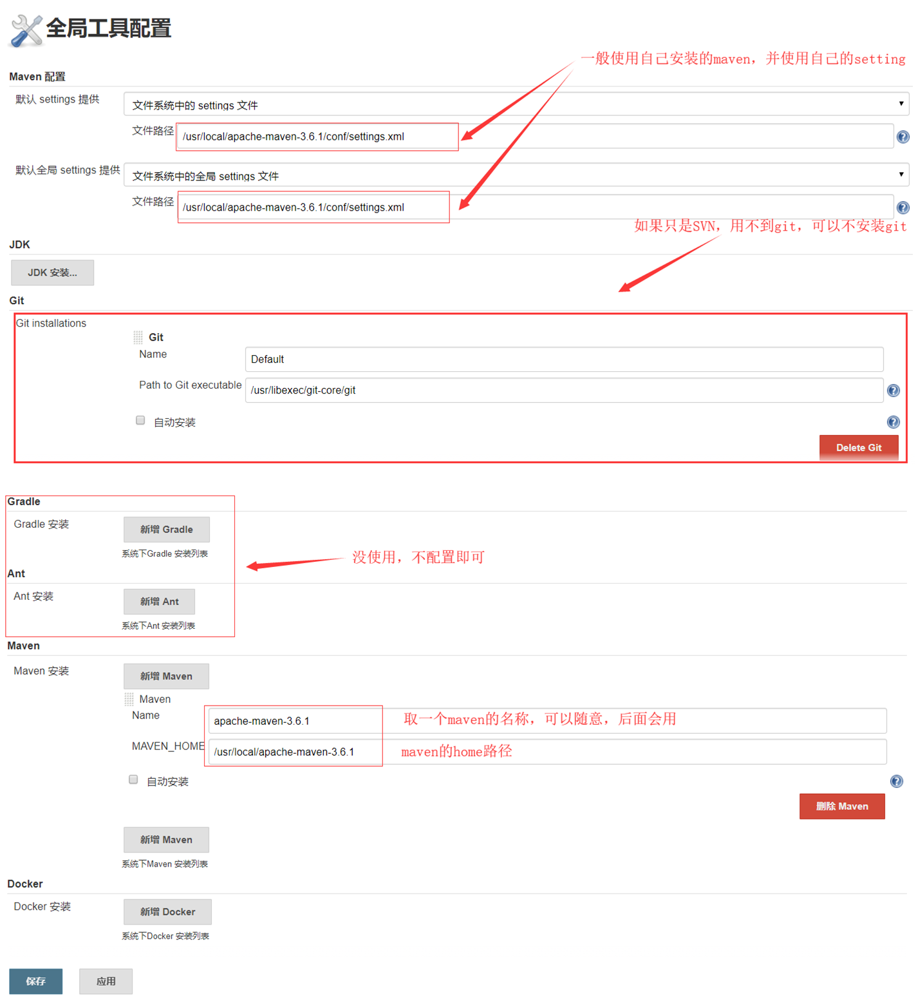

# 持续集成工具Jenkins


<font color="green">*@Author:hanguixian*</font> 

<font color="green">*@Email:hn_hanguixian@163.com*<font>    


jenkins官网：https://jenkins.io/zh/

Jenkins文档：https://jenkins.io/zh/doc/


## 一  Jenkins介绍

- Jenkins是一款开源 CI&CD 软件，用于自动化各种任务，包括构建、测试和部署软件。
- Jenkins 支持各种运行方式，可通过系统包、Docker 或者通过一个独立的 Java 程序。

### 1 Jenkins 和 Hudson 

- 目前最流行的一款持续集成及自动化部署工具。 

- Jenkins 和 Hundson 之间的关系：2009 年，甲骨文收购了 Sun 并继承了 Hudson 代 码库。在 2011 年年初，甲骨文和开源社区之间的关系破裂，该项目被分成两个独立的 项目： 

  - Jenkins：由大部分原始开发人员组成 
  - Hudson：由甲骨文公司继续管理 所以 Jenkins 和 Hudson 是两款非常相似的产品。

### 2 技术组合 

  - Jenkins 可以整合 GitHub 或 Subversion 
  - Husband 也可以整合 GitHub 或 Subversion 
  - 二者既然是同源的工具软件，操作和指导思想是接近的

### 3 JavaEE 项目部署方式对比

#### 3.1  手动部署


#### 3.2 自动化部署  

 “自动化”的具体体现：向版本库提交新的代码后，应用服务器上自动部署，用户或测试人员使用的马上就是最新的应用程序。


- 持续集成环境可以把整个构建、部署过程自动化，很大程度上减轻工作量。 对于程序员的日常开发来说不会造成任何额外负担——自己把代码提交上去之后，服务器上运行的马上就是最新版本——一切都发生在无形中。 
- 持续集成环境需要具备以下知识
  - Linux 基本操作命令和 VIM 编辑器使用
  - Maven 的项目构建管理 
  - GitHub 或 SVN 使用

##  二 Jenkins安装与配置

### 1 Jenkins 主体程序安装配置

#### 1.1 war+tomcat

##### 1.1.1 安装JDK和Tomcat

- JDK：<https://blog.csdn.net/hgx_suiyuesusu/article/details/78368666> 
- Tomcat：<https://blog.csdn.net/hgx_suiyuesusu/article/details/78368997> 

##### 1.1.2 安装Jenkins

- 下载jenkins.war，下载地址：https://mirrors.tuna.tsinghua.edu.cn/jenkins/war-stable/2.176.1/jenkins.war
- 将war包放到Tomcat 的webapps下，例如：/opt/apache-tomcat-8.5.42/webapps下
- 启动tomcat，tomcat的bin目录下使用：`./startup.sh`
- 访问host:8080/jenkins,会进入解锁界面。如:<http://192.168.118.155:8080/jenkins> 


- 依照提示，获取并输入管理密码，这里填入的密文同时也是 admin 账号的密码。 

```shell
[root@localhost webapps]# more /root/.jenkins/secrets/initialAdminPassword
1d4fdbe149b24413946b1ae21f932acd
```


- 选择哪种方式都不会对后续操作有太大影响。因为有需要的插件我们可以在后续有针对性的安装。在这里选择“安装推荐的插件”。 安装过程如下：


- 打×的插件是由于网络传输导致的安装失败，后面再重新安装即可。注意：这个步骤中如果选择了安装插件则 Linux 必须能够联网。 


- 新建账号或以管理员身份继续


- 使用admin账户继续，实例配置


- 开始使用jenkins


- Jenkins界面


### 2 系统初始化配置   

- 系统管理界面



- 全局安全配置：可以自己修改jenkins安全策略，一般情况下保持默认设置即可


- 全局工具配置：MavenConfiguration



**现在jenkins就基本配置好了。。。。**

## 三 Jenkins+SVN 持续集成环境搭建

### 1 系统结构总述 

- 基于Linux 系统
- 版本控制子系统 
  - Subversion 服务器 
  - 项目对应版本库 
  - 版本库中钩子程序 
- 持续集成子系统 
  - JDK
  - Tomcat
  - Maven
  - Jenkins
    - 主体程序
    - SVN插件
    - Maven插件
    - Deploy to Web Container插件
- 应用发布子系统
  - JDK
  - Tomcat

### 2 版本控制子系统 

- 在linux系统中安装好SVN版本库，详细过程网络上很多，我的版本库的访问账号密码如下。

```shell
[users]
subman=123123
```

- 特别提示：svnserve.conf 文件中anon-access一定要打开注释并设置为 none

```sh
[general]
anon-access=none
auth-access=write
```

### 3 应用发布子系统 

- 安装好JDK和Tomcat的运行环境。安装详细可以参考如下：
  - JDK：<https://blog.csdn.net/hgx_suiyuesusu/article/details/78368666> 
  - Tomcat：<https://blog.csdn.net/hgx_suiyuesusu/article/details/78368997> 
- Tomcat 服务器的账号密码 如下，配置文件位置：/opt/tomcat/conf/tomcat-users.xml 

```xml
<rolerolename="manager-gui"/> 
<rolerolename="manager-script"/> 
<rolerolename="manager-jmx"/> 
<rolerolename="manager-status"/>
<user username="tomcat_user" password="123456" roles="manager-gui,manager-script,manager-jmx,manager-status"/>
```
### 4  持续集成子系统  

在配置好的基础上继续。。。


## 四 Jenkins+git+docker+阿里云 持续集成

### 1 系统结构总述

- 基于Linux 系统
- git仓库（gitee、github ...）
  - 项目对应版本库 
  - 钩子程序 /插件
- 持续集成子系统 
  - 方式（1）tomcat+jenkins
    - JDK
    - Tomcat
    - Maven
    - Jenkins
      - 主体程序
      - Maven插件
  - 方式（2）docker容器
- 应用发布子系统
  - docker容器

### 2 git仓库--gitee为例

- 注册gitee，gitee地址：<https://gitee.com/> 
- 建立仓库

### 3  应用发布子系统 

- docker相关，可参考：
  - Docker简介:<https://blog.csdn.net/hgx_suiyuesusu/article/details/81748971>
  - Docker安装:<https://blog.csdn.net/hgx_suiyuesusu/article/details/81775444> 
  - Docker常用命令:<https://blog.csdn.net/hgx_suiyuesusu/article/details/81946313> 
  - Docker镜像:<https://blog.csdn.net/hgx_suiyuesusu/article/details/82020188> 
  - Docker容器数据卷:<https://blog.csdn.net/hgx_suiyuesusu/article/details/82115166> 
  - DockerFile:<https://blog.csdn.net/hgx_suiyuesusu/article/details/82184871> 
  - Docker常用安装:<https://blog.csdn.net/hgx_suiyuesusu/article/details/82491183> 
  - 本地镜像发布到阿里云:<https://blog.csdn.net/hgx_suiyuesusu/article/details/82529270> 

### 4  持续集成子系统 

在配置好的基础上继续。。。

#### 4.1 操作步骤及细节


#### 4.2 shell脚本

```shell
#### 镜像名称
IMAGE_NAME='registry.cn-shanghai.aliyuncs.com/hanguixian/common-service:3.0.0'
echo IMAGE_NAME=$IMAGE_NAME
echo '================当前docker版本=============='
echo `docker -v`
##### 登录到阿里云
docker login --username=xxxx --password=xxxx  registry.cn-shanghai.aliyuncs.com

#### dockerFile 文本信息 编写docker容器
echo "FROM registry.cn-shanghai.aliyuncs.com/hanguixian/java8:192" > Dockerfile 
echo "MAINTAINER Author<hanguixianhn@163.com>" >> Dockerfile
echo "COPY common-service-0.0.1-SNAPSHOT.jar /opt/work/common-service-0.0.1-SNAPSHOT.jar" >> Dockerfile
echo "EXPOSE 8091" >> Dockerfile
echo "ENTRYPOINT nohup java -Dfile.encoding=utf-8 -jar  /opt/work/common-service-0.0.1-SNAPSHOT.jar > /opt/work/common-nohup.out " >> Dockerfile

echo '================开始创建镜像================'
docker build --rm -t $IMAGE_NAME .
echo '================开始推送镜像================'
####账户及密码 登录阿里云
docker login --username=xxxx --password=xxxx  registry.cn-shanghai.aliyuncs.com
docker push $IMAGE_NAME
echo '====================OK!================'

### jenkins所在服务器ssh公钥，也可以直接在发布子系统，及docker所在主机配置好
echo "ssh-rsa AAAAB3NzaC1yc2EAAAADAQABAAABAQDx6K7o5chjnPWVphCfy3Db4UiykPB7VfwAf7jCML/bO/y68FLMVm9Om1WGCyRL7lU2V02Q+bEnPSrIXbWlVzPjeBY+TlQx4GHhFWqm2f0uQ+t3yfV/qim0+FCd0Qk8i/gw9w8ZmYJs35/DCm6WeZlik8oPxB9sxUSj8Ni+pTYjHgK0yuyG+xKIj/3AqHgBzWK+Gn1zniAeQnA6aOp0JRcfFXS1oBZ8wsiCk8fX4xfKxB7+QbJToMkd+huKielIyoEn0a5gfPKuz/X6QPThLjkyx+n2kRvWJ4E3qiVJ+0dhwGyuc3MbFTch9+GGoXbP2DyB+uKbtGSm9r3ur9sh9+xR root@a49563332eec" >> remotessh

#### 登录docker所在主机
ssh root@106.14.217.80 -tt << remotessh 

####  执行jenkins.sh 脚本,停止带有common-service3的dokcer容器
cd /home/han
./jenkins.sh common-service3

#### 删除 带有common-service3的dokcer容器
docker rm -f $(docker ps |grep common-service|awk '{print $1}') 

### 登录到阿里云
docker login --username=xxx --password=xxx  registry.cn-shanghai.aliyuncs.com
### 推送镜像到阿里云
docker pull $IMAGE_NAME

#### 运行容器
docker run -d -p 8901:8091 --name=common-service3-`date +%Y-%m-%d` --restart=always $IMAGE_NAME
echo "finished!"

#####执行完毕

exit  ###退出远程机器
remotessh  ###结尾哦
echo '================结束远程启动================'
```

- jenkins.sh 内容如下，注意 需要授予权限：chmod  777 jenkins.sh

```sh
sudo docker stop $(sudo docker ps | grep $1|awk '{print  $1}'|sed 's/%//g')
```

#### 4.3 提交代码自动触发构建

