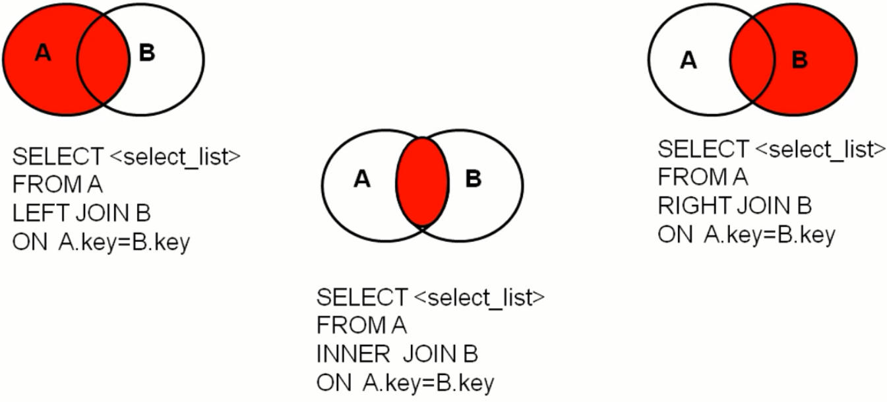
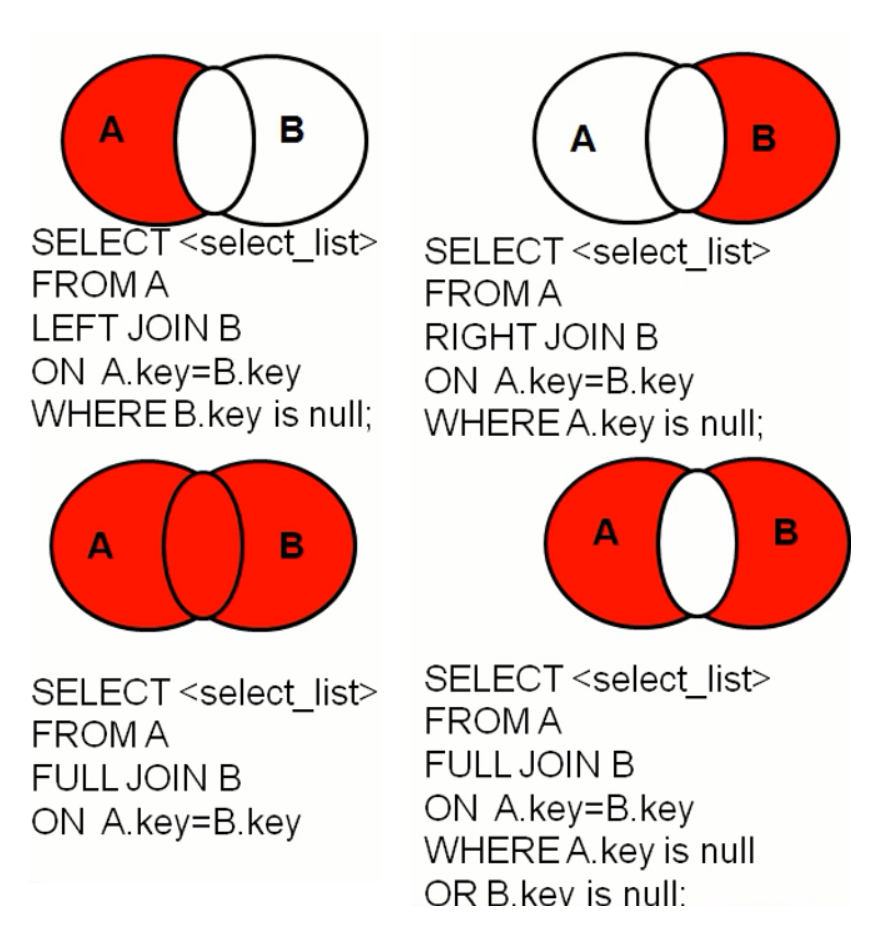
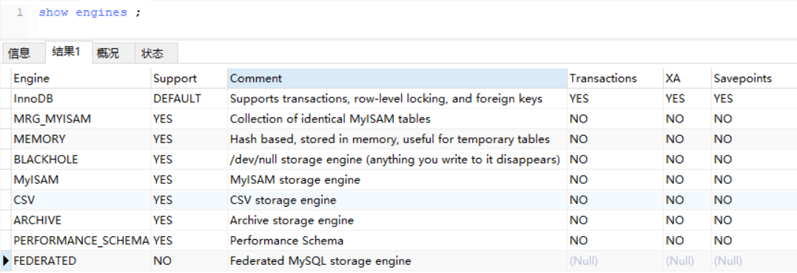

# MySQL基础

*@Author:hanguixian*

*@Email:hn_hanguixian@163.com*


## 一 数据库和Sql概述

### 1 数据库的好处

- 1.持久化数据到本地
- 2.可以实现结构化查询，方便管理

### 2 数据库相关概念

- 1、DB：数据库，保存一组有组织的数据的容器
- 2、DBMS：数据库管理系统，又称为数据库软件（产品），用于管理DB中的数据
- 3、SQL:结构化查询语言，用于和DBMS通信的语言

### 3 数据库存储数据的特点

-  1、将数据放到表中，表再放到库中
- 2、一个数据库中可以有多个表，每个表都有一个的名字，用来标识自己。表名具有唯一性。
- 3、表具有一些特性，这些特性定义了数据在表中如何存储，类似java中 “类”的设计。
- 4、表由列组成，我们也称为字段。所有表都是由一个或多个列组成的，每一列类似java 中的”属性”
- 5、表中的数据是按行存储的，每一行类似于java中的“对象”。

### 4 Sql语言概述

 #### 4.1 SQL的优点 

- 1、不是某个特定数据库供应商专有的语言，几乎所有 DBMS都支持SQL
-  2、简单易学 
- 3、虽然简单，但实际上是一种强有力的语言，灵活使用其语言元素，可以进行非常复杂和高级的数据库操作。

#### 4.2 SQL语言分类

- 1、DML(Data Manipulation Language):数据操纵语句，用于添加、删除、修改、查询数据库记录，并检查数据完整性 
- 2、DDL(Data Definition Language):数据定义语句，用于库和表的创建、修改、删除。 
- 3、DCL(Data Control Language):数据控制语句，用于定义用 户的访问权限和安全级别。
- 注意:有其他的分类说法:
  - DQL（Data Query Language）：数据查询语言[select] （在DML里面）
  - DML(Data Manipulate Language):数据操作语言[insert 、update、delete]
  - DDL（Data Define Languge）：数据定义语言[create、drop、alter]
  - TCL（Transaction Control Language）：事务控制语言[commit、rollback]   (在DCL里面)

##### 4.2.1 DML

- DML用于查询与修改数据记录，包括如下SQL语句：
  - INSERT：添加数据到数据库中 
  - UPDATE：修改数据库中的数据 
  - DELETE：删除数据库中的数据 
  - SELECT：选择（查询）数据 
    - SELECT是SQL语言的基础，最为重要。

##### 4.2.2 DDL

- DDL用于定义数据库的结构，比如创建、修改或删除 数据库对象，包括如下SQL语句：
  - CREATE TABLE：创建数据库表 
  - ALTER TABLE：更改表结构、添加、删除、修改列长度 
  - DROP TABLE：删除表 
  - CREATE INDEX：在表上建立索引 
  - DROP INDEX：删除索引

 ##### 4.2.3 DCL 

- DCL用来控制数据库的访问，包括如下SQL语句：
  - GRANT：授予访问权限 
  - REVOKE：撤销访问权限 
  - COMMIT：提交事务处理 
  - ROLLBACK：事务处理回退 
  - SAVEPOINT：设置保存点 
  - LOCK：对数据库的特定部分进行锁定


## 二 MySQL安装与使用


###  1 Mysql产品特点

- MySQL数据库隶属于MySQL AB公司，总 部位于瑞典，后被oracle收购。
- 优点
  - 成本低：开放源代码，一般可以免费试用
  - 性能高：执行很快
  - 简单：很容易安装和使用

### 2 MySql数据库的安装 

#### 2.1DBMS分为两类

- 基于共享文件系统的DBMS （Access ） 
- 基于客户机
  - 服务器的DBMS （MySQL、Oracle、SqlServer）

#### 2.2下载与安装

- 参见:    [csdn博客]: https://blog.csdn.net/hgx_suiyuesusu/article/details/78368997


#### 2.3启动和停止MySQL服务

- 方式一：通过计算机管理方式 
  - 右击计算机—管理—服务—启动或停止MySQL服务
- 方式二：通过命令行方式
  - 启动: net start mysql服务名 
  - 停止: net stop mysql服务名

#### 2.4 MySQL服务端的登录和退出

- 登录 

  - `mysql 【-h主机名 -P端口号 】-u用户名 -p密码`

- 退出 

  - `exit或ctrl+C`

  

### 3 MySql数据库的使用

#### 3.1 MySQL语法规范

 - 1.不区分大小写,但建议关键字大写，表名、列名小写
 - 2.每条命令最好用分号结尾
 - 3.每条命令根据需要，可以进行缩进 或换行
 - 4.注释
   - 单行注释：#注释文字
   - 单行注释：-- 注释文字
   - 多行注释：/* 注释文字  */

#### 3.2 MySQL的常见命令 

```sql
#1.查看当前所有的数据库
show databases;

#2.打开指定的库
use 库名

#3.查看当前库的所有表
show tables;

#4.查看其它库的所有表
show tables from 库名;

#5.创建表
create table 表名(

	列名 列类型,
	列名 列类型，
	。。。
);

#6.删除表
drop table 表名 ;

#7.查看表结构
desc 表名;

#8.查看服务器的版本
#方式一：登录到mysql服务端
select version();
#方式二：没有登录到mysql服务端
mysql --version
mysql --V

#9.显示表中的所有数据
select * from 表名;

#10.查询特定的列 
select 列名1,列名2, ... from 表名


#11.向表中插入记录, 注意：插入 varchar 或 date 型的数据要用 单引号 引起来
insert into 表名(列名列表) values(列对应的值的列表);

#12.修改记录
update 表名 set 列1 = 列1的值, 列2 = 列2的值 where ...

#13.删除记录
delete from 表名 where ...
```


## 三 DQL语言学习(数据处理之查询)

### 1.数据准备

```sql
CREATE DATABASE `myemployees` ;

USE `myemployees`;

DROP TABLE IF EXISTS `departments`;

CREATE TABLE `departments` (
  `department_id` int(4) NOT NULL AUTO_INCREMENT,
  `department_name` varchar(3) DEFAULT NULL,
  `manager_id` int(6) DEFAULT NULL,
  `location_id` int(4) DEFAULT NULL,
  PRIMARY KEY (`department_id`),
  KEY `loc_id_fk` (`location_id`),
  CONSTRAINT `loc_id_fk` FOREIGN KEY (`location_id`) REFERENCES `locations` (`location_id`)
) ENGINE=InnoDB AUTO_INCREMENT=271 DEFAULT CHARSET=gb2312;

/*Data for the table `departments` */
insert  into `departments`(`department_id`,`department_name`,`manager_id`,`location_id`) values (10,'Adm',200,1700),(20,'Mar',201,1800),(30,'Pur',114,1700),(40,'Hum',203,2400),(50,'Shi',121,1500),(60,'IT',103,1400),(70,'Pub',204,2700),(80,'Sal',145,2500),(90,'Exe',100,1700),(100,'Fin',108,1700),(110,'Acc',205,1700),(120,'Tre',NULL,1700),(130,'Cor',NULL,1700),(140,'Con',NULL,1700),(150,'Sha',NULL,1700),(160,'Ben',NULL,1700),(170,'Man',NULL,1700),(180,'Con',NULL,1700),(190,'Con',NULL,1700),(200,'Ope',NULL,1700),(210,'IT ',NULL,1700),(220,'NOC',NULL,1700),(230,'IT ',NULL,1700),(240,'Gov',NULL,1700),(250,'Ret',NULL,1700),(260,'Rec',NULL,1700),(270,'Pay',NULL,1700);

/*Table structure for table `employees` */
DROP TABLE IF EXISTS `employees`;

CREATE TABLE `employees` (
  `employee_id` int(6) NOT NULL AUTO_INCREMENT,
  `first_name` varchar(20) DEFAULT NULL,
  `last_name` varchar(25) DEFAULT NULL,
  `email` varchar(25) DEFAULT NULL,
  `phone_number` varchar(20) DEFAULT NULL,
  `job_id` varchar(10) DEFAULT NULL,
  `salary` double(10,2) DEFAULT NULL,
  `commission_pct` double(4,2) DEFAULT NULL,
  `manager_id` int(6) DEFAULT NULL,
  `department_id` int(4) DEFAULT NULL,
  `hiredate` datetime DEFAULT NULL,
  PRIMARY KEY (`employee_id`),
  KEY `dept_id_fk` (`department_id`),
  KEY `job_id_fk` (`job_id`),
  CONSTRAINT `dept_id_fk` FOREIGN KEY (`department_id`) REFERENCES `departments` (`department_id`),
  CONSTRAINT `job_id_fk` FOREIGN KEY (`job_id`) REFERENCES `jobs` (`job_id`)
) ENGINE=InnoDB AUTO_INCREMENT=207 DEFAULT CHARSET=gb2312;

/*Data for the table `employees` */

insert  into `employees`(`employee_id`,`first_name`,`last_name`,`email`,`phone_number`,`job_id`,`salary`,`commission_pct`,`manager_id`,`department_id`,`hiredate`) values (100,'Steven','K_ing','SKING','515.123.4567','AD_PRES',24000.00,NULL,NULL,90,'1992-04-03 00:00:00'),(101,'Neena','Kochhar','NKOCHHAR','515.123.4568','AD_VP',17000.00,NULL,100,90,'1992-04-03 00:00:00'),(102,'Lex','De Haan','LDEHAAN','515.123.4569','AD_VP',17000.00,NULL,100,90,'1992-04-03 00:00:00'),(103,'Alexander','Hunold','AHUNOLD','590.423.4567','IT_PROG',9000.00,NULL,102,60,'1992-04-03 00:00:00'),(104,'Bruce','Ernst','BERNST','590.423.4568','IT_PROG',6000.00,NULL,103,60,'1992-04-03 00:00:00'),(105,'David','Austin','DAUSTIN','590.423.4569','IT_PROG',4800.00,NULL,103,60,'1998-03-03 00:00:00'),(106,'Valli','Pataballa','VPATABAL','590.423.4560','IT_PROG',4800.00,NULL,103,60,'1998-03-03 00:00:00'),(107,'Diana','Lorentz','DLORENTZ','590.423.5567','IT_PROG',4200.00,NULL,103,60,'1998-03-03 00:00:00'),(108,'Nancy','Greenberg','NGREENBE','515.124.4569','FI_MGR',12000.00,NULL,101,100,'1998-03-03 00:00:00'),(109,'Daniel','Faviet','DFAVIET','515.124.4169','FI_ACCOUNT',9000.00,NULL,108,100,'1998-03-03 00:00:00'),(110,'John','Chen','JCHEN','515.124.4269','FI_ACCOUNT',8200.00,NULL,108,100,'2000-09-09 00:00:00'),(111,'Ismael','Sciarra','ISCIARRA','515.124.4369','FI_ACCOUNT',7700.00,NULL,108,100,'2000-09-09 00:00:00'),(112,'Jose Manuel','Urman','JMURMAN','515.124.4469','FI_ACCOUNT',7800.00,NULL,108,100,'2000-09-09 00:00:00'),(113,'Luis','Popp','LPOPP','515.124.4567','FI_ACCOUNT',6900.00,NULL,108,100,'2000-09-09 00:00:00'),(114,'Den','Raphaely','DRAPHEAL','515.127.4561','PU_MAN',11000.00,NULL,100,30,'2000-09-09 00:00:00'),(115,'Alexander','Khoo','AKHOO','515.127.4562','PU_CLERK',3100.00,NULL,114,30,'2000-09-09 00:00:00'),(116,'Shelli','Baida','SBAIDA','515.127.4563','PU_CLERK',2900.00,NULL,114,30,'2000-09-09 00:00:00'),(117,'Sigal','Tobias','STOBIAS','515.127.4564','PU_CLERK',2800.00,NULL,114,30,'2000-09-09 00:00:00'),(118,'Guy','Himuro','GHIMURO','515.127.4565','PU_CLERK',2600.00,NULL,114,30,'2000-09-09 00:00:00'),(119,'Karen','Colmenares','KCOLMENA','515.127.4566','PU_CLERK',2500.00,NULL,114,30,'2000-09-09 00:00:00'),(120,'Matthew','Weiss','MWEISS','650.123.1234','ST_MAN',8000.00,NULL,100,50,'2004-02-06 00:00:00'),(121,'Adam','Fripp','AFRIPP','650.123.2234','ST_MAN',8200.00,NULL,100,50,'2004-02-06 00:00:00'),(122,'Payam','Kaufling','PKAUFLIN','650.123.3234','ST_MAN',7900.00,NULL,100,50,'2004-02-06 00:00:00'),(123,'Shanta','Vollman','SVOLLMAN','650.123.4234','ST_MAN',6500.00,NULL,100,50,'2004-02-06 00:00:00'),(124,'Kevin','Mourgos','KMOURGOS','650.123.5234','ST_MAN',5800.00,NULL,100,50,'2004-02-06 00:00:00'),(125,'Julia','Nayer','JNAYER','650.124.1214','ST_CLERK',3200.00,NULL,120,50,'2004-02-06 00:00:00'),(126,'Irene','Mikkilineni','IMIKKILI','650.124.1224','ST_CLERK',2700.00,NULL,120,50,'2004-02-06 00:00:00'),(127,'James','Landry','JLANDRY','650.124.1334','ST_CLERK',2400.00,NULL,120,50,'2004-02-06 00:00:00'),(128,'Steven','Markle','SMARKLE','650.124.1434','ST_CLERK',2200.00,NULL,120,50,'2004-02-06 00:00:00'),(129,'Laura','Bissot','LBISSOT','650.124.5234','ST_CLERK',3300.00,NULL,121,50,'2004-02-06 00:00:00'),(130,'Mozhe','Atkinson','MATKINSO','650.124.6234','ST_CLERK',2800.00,NULL,121,50,'2004-02-06 00:00:00'),(131,'James','Marlow','JAMRLOW','650.124.7234','ST_CLERK',2500.00,NULL,121,50,'2004-02-06 00:00:00'),(132,'TJ','Olson','TJOLSON','650.124.8234','ST_CLERK',2100.00,NULL,121,50,'2004-02-06 00:00:00'),(133,'Jason','Mallin','JMALLIN','650.127.1934','ST_CLERK',3300.00,NULL,122,50,'2004-02-06 00:00:00'),(134,'Michael','Rogers','MROGERS','650.127.1834','ST_CLERK',2900.00,NULL,122,50,'2002-12-23 00:00:00'),(135,'Ki','Gee','KGEE','650.127.1734','ST_CLERK',2400.00,NULL,122,50,'2002-12-23 00:00:00'),(136,'Hazel','Philtanker','HPHILTAN','650.127.1634','ST_CLERK',2200.00,NULL,122,50,'2002-12-23 00:00:00'),(137,'Renske','Ladwig','RLADWIG','650.121.1234','ST_CLERK',3600.00,NULL,123,50,'2002-12-23 00:00:00'),(138,'Stephen','Stiles','SSTILES','650.121.2034','ST_CLERK',3200.00,NULL,123,50,'2002-12-23 00:00:00'),(139,'John','Seo','JSEO','650.121.2019','ST_CLERK',2700.00,NULL,123,50,'2002-12-23 00:00:00'),(140,'Joshua','Patel','JPATEL','650.121.1834','ST_CLERK',2500.00,NULL,123,50,'2002-12-23 00:00:00'),(141,'Trenna','Rajs','TRAJS','650.121.8009','ST_CLERK',3500.00,NULL,124,50,'2002-12-23 00:00:00'),(142,'Curtis','Davies','CDAVIES','650.121.2994','ST_CLERK',3100.00,NULL,124,50,'2002-12-23 00:00:00'),(143,'Randall','Matos','RMATOS','650.121.2874','ST_CLERK',2600.00,NULL,124,50,'2002-12-23 00:00:00'),(144,'Peter','Vargas','PVARGAS','650.121.2004','ST_CLERK',2500.00,NULL,124,50,'2002-12-23 00:00:00'),(145,'John','Russell','JRUSSEL','011.44.1344.429268','SA_MAN',14000.00,0.40,100,80,'2002-12-23 00:00:00'),(146,'Karen','Partners','KPARTNER','011.44.1344.467268','SA_MAN',13500.00,0.30,100,80,'2002-12-23 00:00:00'),(147,'Alberto','Errazuriz','AERRAZUR','011.44.1344.429278','SA_MAN',12000.00,0.30,100,80,'2002-12-23 00:00:00'),(148,'Gerald','Cambrault','GCAMBRAU','011.44.1344.619268','SA_MAN',11000.00,0.30,100,80,'2002-12-23 00:00:00'),(149,'Eleni','Zlotkey','EZLOTKEY','011.44.1344.429018','SA_MAN',10500.00,0.20,100,80,'2002-12-23 00:00:00'),(150,'Peter','Tucker','PTUCKER','011.44.1344.129268','SA_REP',10000.00,0.30,145,80,'2014-03-05 00:00:00'),(151,'David','Bernstein','DBERNSTE','011.44.1344.345268','SA_REP',9500.00,0.25,145,80,'2014-03-05 00:00:00'),(152,'Peter','Hall','PHALL','011.44.1344.478968','SA_REP',9000.00,0.25,145,80,'2014-03-05 00:00:00'),(153,'Christopher','Olsen','COLSEN','011.44.1344.498718','SA_REP',8000.00,0.20,145,80,'2014-03-05 00:00:00'),(154,'Nanette','Cambrault','NCAMBRAU','011.44.1344.987668','SA_REP',7500.00,0.20,145,80,'2014-03-05 00:00:00'),(155,'Oliver','Tuvault','OTUVAULT','011.44.1344.486508','SA_REP',7000.00,0.15,145,80,'2014-03-05 00:00:00'),(156,'Janette','K_ing','JKING','011.44.1345.429268','SA_REP',10000.00,0.35,146,80,'2014-03-05 00:00:00'),(157,'Patrick','Sully','PSULLY','011.44.1345.929268','SA_REP',9500.00,0.35,146,80,'2014-03-05 00:00:00'),(158,'Allan','McEwen','AMCEWEN','011.44.1345.829268','SA_REP',9000.00,0.35,146,80,'2014-03-05 00:00:00'),(159,'Lindsey','Smith','LSMITH','011.44.1345.729268','SA_REP',8000.00,0.30,146,80,'2014-03-05 00:00:00'),(160,'Louise','Doran','LDORAN','011.44.1345.629268','SA_REP',7500.00,0.30,146,80,'2014-03-05 00:00:00'),(161,'Sarath','Sewall','SSEWALL','011.44.1345.529268','SA_REP',7000.00,0.25,146,80,'2014-03-05 00:00:00'),(162,'Clara','Vishney','CVISHNEY','011.44.1346.129268','SA_REP',10500.00,0.25,147,80,'2014-03-05 00:00:00'),(163,'Danielle','Greene','DGREENE','011.44.1346.229268','SA_REP',9500.00,0.15,147,80,'2014-03-05 00:00:00'),(164,'Mattea','Marvins','MMARVINS','011.44.1346.329268','SA_REP',7200.00,0.10,147,80,'2014-03-05 00:00:00'),(165,'David','Lee','DLEE','011.44.1346.529268','SA_REP',6800.00,0.10,147,80,'2014-03-05 00:00:00'),(166,'Sundar','Ande','SANDE','011.44.1346.629268','SA_REP',6400.00,0.10,147,80,'2014-03-05 00:00:00'),(167,'Amit','Banda','ABANDA','011.44.1346.729268','SA_REP',6200.00,0.10,147,80,'2014-03-05 00:00:00'),(168,'Lisa','Ozer','LOZER','011.44.1343.929268','SA_REP',11500.00,0.25,148,80,'2014-03-05 00:00:00'),(169,'Harrison','Bloom','HBLOOM','011.44.1343.829268','SA_REP',10000.00,0.20,148,80,'2014-03-05 00:00:00'),(170,'Tayler','Fox','TFOX','011.44.1343.729268','SA_REP',9600.00,0.20,148,80,'2014-03-05 00:00:00'),(171,'William','Smith','WSMITH','011.44.1343.629268','SA_REP',7400.00,0.15,148,80,'2014-03-05 00:00:00'),(172,'Elizabeth','Bates','EBATES','011.44.1343.529268','SA_REP',7300.00,0.15,148,80,'2014-03-05 00:00:00'),(173,'Sundita','Kumar','SKUMAR','011.44.1343.329268','SA_REP',6100.00,0.10,148,80,'2014-03-05 00:00:00'),(174,'Ellen','Abel','EABEL','011.44.1644.429267','SA_REP',11000.00,0.30,149,80,'2014-03-05 00:00:00'),(175,'Alyssa','Hutton','AHUTTON','011.44.1644.429266','SA_REP',8800.00,0.25,149,80,'2014-03-05 00:00:00'),(176,'Jonathon','Taylor','JTAYLOR','011.44.1644.429265','SA_REP',8600.00,0.20,149,80,'2014-03-05 00:00:00'),(177,'Jack','Livingston','JLIVINGS','011.44.1644.429264','SA_REP',8400.00,0.20,149,80,'2014-03-05 00:00:00'),(178,'Kimberely','Grant','KGRANT','011.44.1644.429263','SA_REP',7000.00,0.15,149,NULL,'2014-03-05 00:00:00'),(179,'Charles','Johnson','CJOHNSON','011.44.1644.429262','SA_REP',6200.00,0.10,149,80,'2014-03-05 00:00:00'),(180,'Winston','Taylor','WTAYLOR','650.507.9876','SH_CLERK',3200.00,NULL,120,50,'2014-03-05 00:00:00'),(181,'Jean','Fleaur','JFLEAUR','650.507.9877','SH_CLERK',3100.00,NULL,120,50,'2014-03-05 00:00:00'),(182,'Martha','Sullivan','MSULLIVA','650.507.9878','SH_CLERK',2500.00,NULL,120,50,'2014-03-05 00:00:00'),(183,'Girard','Geoni','GGEONI','650.507.9879','SH_CLERK',2800.00,NULL,120,50,'2014-03-05 00:00:00'),(184,'Nandita','Sarchand','NSARCHAN','650.509.1876','SH_CLERK',4200.00,NULL,121,50,'2014-03-05 00:00:00'),(185,'Alexis','Bull','ABULL','650.509.2876','SH_CLERK',4100.00,NULL,121,50,'2014-03-05 00:00:00'),(186,'Julia','Dellinger','JDELLING','650.509.3876','SH_CLERK',3400.00,NULL,121,50,'2014-03-05 00:00:00'),(187,'Anthony','Cabrio','ACABRIO','650.509.4876','SH_CLERK',3000.00,NULL,121,50,'2014-03-05 00:00:00'),(188,'Kelly','Chung','KCHUNG','650.505.1876','SH_CLERK',3800.00,NULL,122,50,'2014-03-05 00:00:00'),(189,'Jennifer','Dilly','JDILLY','650.505.2876','SH_CLERK',3600.00,NULL,122,50,'2014-03-05 00:00:00'),(190,'Timothy','Gates','TGATES','650.505.3876','SH_CLERK',2900.00,NULL,122,50,'2014-03-05 00:00:00'),(191,'Randall','Perkins','RPERKINS','650.505.4876','SH_CLERK',2500.00,NULL,122,50,'2014-03-05 00:00:00'),(192,'Sarah','Bell','SBELL','650.501.1876','SH_CLERK',4000.00,NULL,123,50,'2014-03-05 00:00:00'),(193,'Britney','Everett','BEVERETT','650.501.2876','SH_CLERK',3900.00,NULL,123,50,'2014-03-05 00:00:00'),(194,'Samuel','McCain','SMCCAIN','650.501.3876','SH_CLERK',3200.00,NULL,123,50,'2014-03-05 00:00:00'),(195,'Vance','Jones','VJONES','650.501.4876','SH_CLERK',2800.00,NULL,123,50,'2014-03-05 00:00:00'),(196,'Alana','Walsh','AWALSH','650.507.9811','SH_CLERK',3100.00,NULL,124,50,'2014-03-05 00:00:00'),(197,'Kevin','Feeney','KFEENEY','650.507.9822','SH_CLERK',3000.00,NULL,124,50,'2014-03-05 00:00:00'),(198,'Donald','OConnell','DOCONNEL','650.507.9833','SH_CLERK',2600.00,NULL,124,50,'2014-03-05 00:00:00'),(199,'Douglas','Grant','DGRANT','650.507.9844','SH_CLERK',2600.00,NULL,124,50,'2014-03-05 00:00:00'),(200,'Jennifer','Whalen','JWHALEN','515.123.4444','AD_ASST',4400.00,NULL,101,10,'2016-03-03 00:00:00'),(201,'Michael','Hartstein','MHARTSTE','515.123.5555','MK_MAN',13000.00,NULL,100,20,'2016-03-03 00:00:00'),(202,'Pat','Fay','PFAY','603.123.6666','MK_REP',6000.00,NULL,201,20,'2016-03-03 00:00:00'),(203,'Susan','Mavris','SMAVRIS','515.123.7777','HR_REP',6500.00,NULL,101,40,'2016-03-03 00:00:00'),(204,'Hermann','Baer','HBAER','515.123.8888','PR_REP',10000.00,NULL,101,70,'2016-03-03 00:00:00'),(205,'Shelley','Higgins','SHIGGINS','515.123.8080','AC_MGR',12000.00,NULL,101,110,'2016-03-03 00:00:00'),(206,'William','Gietz','WGIETZ','515.123.8181','AC_ACCOUNT',8300.00,NULL,205,110,'2016-03-03 00:00:00');

/*Table structure for table `jobs` */
DROP TABLE IF EXISTS `jobs`;

CREATE TABLE `jobs` (
  `job_id` varchar(10) NOT NULL,
  `job_title` varchar(35) DEFAULT NULL,
  `min_salary` int(6) DEFAULT NULL,
  `max_salary` int(6) DEFAULT NULL,
  PRIMARY KEY (`job_id`)
) ENGINE=InnoDB DEFAULT CHARSET=gb2312;

/*Data for the table `jobs` */
insert  into `jobs`(`job_id`,`job_title`,`min_salary`,`max_salary`) values ('AC_ACCOUNT','Public Accountant',4200,9000),('AC_MGR','Accounting Manager',8200,16000),('AD_ASST','Administration Assistant',3000,6000),('AD_PRES','President',20000,40000),('AD_VP','Administration Vice President',15000,30000),('FI_ACCOUNT','Accountant',4200,9000),('FI_MGR','Finance Manager',8200,16000),('HR_REP','Human Resources Representative',4000,9000),('IT_PROG','Programmer',4000,10000),('MK_MAN','Marketing Manager',9000,15000),('MK_REP','Marketing Representative',4000,9000),('PR_REP','Public Relations Representative',4500,10500),('PU_CLERK','Purchasing Clerk',2500,5500),('PU_MAN','Purchasing Manager',8000,15000),('SA_MAN','Sales Manager',10000,20000),('SA_REP','Sales Representative',6000,12000),('SH_CLERK','Shipping Clerk',2500,5500),('ST_CLERK','Stock Clerk',2000,5000),('ST_MAN','Stock Manager',5500,8500);

/*Table structure for table `locations` */
DROP TABLE IF EXISTS `locations`;

CREATE TABLE `locations` (
  `location_id` int(11) NOT NULL AUTO_INCREMENT,
  `street_address` varchar(40) DEFAULT NULL,
  `postal_code` varchar(12) DEFAULT NULL,
  `city` varchar(30) DEFAULT NULL,
  `state_province` varchar(25) DEFAULT NULL,
  `country_id` varchar(2) DEFAULT NULL,
  PRIMARY KEY (`location_id`)
) ENGINE=InnoDB AUTO_INCREMENT=3201 DEFAULT CHARSET=gb2312;

/*Data for the table `locations` */
insert  into `locations`(`location_id`,`street_address`,`postal_code`,`city`,`state_province`,`country_id`) values (1000,'1297 Via Cola di Rie','00989','Roma',NULL,'IT'),(1100,'93091 Calle della Testa','10934','Venice',NULL,'IT'),(1200,'2017 Shinjuku-ku','1689','Tokyo','Tokyo Prefecture','JP'),(1300,'9450 Kamiya-cho','6823','Hiroshima',NULL,'JP'),(1400,'2014 Jabberwocky Rd','26192','Southlake','Texas','US'),(1500,'2011 Interiors Blvd','99236','South San Francisco','California','US'),(1600,'2007 Zagora St','50090','South Brunswick','New Jersey','US'),(1700,'2004 Charade Rd','98199','Seattle','Washington','US'),(1800,'147 Spadina Ave','M5V 2L7','Toronto','Ontario','CA'),(1900,'6092 Boxwood St','YSW 9T2','Whitehorse','Yukon','CA'),(2000,'40-5-12 Laogianggen','190518','Beijing',NULL,'CN'),(2100,'1298 Vileparle (E)','490231','Bombay','Maharashtra','IN'),(2200,'12-98 Victoria Street','2901','Sydney','New South Wales','AU'),(2300,'198 Clementi North','540198','Singapore',NULL,'SG'),(2400,'8204 Arthur St',NULL,'London',NULL,'UK'),(2500,'Magdalen Centre, The Oxford Science Park','OX9 9ZB','Oxford','Oxford','UK'),(2600,'9702 Chester Road','09629850293','Stretford','Manchester','UK'),(2700,'Schwanthalerstr. 7031','80925','Munich','Bavaria','DE'),(2800,'Rua Frei Caneca 1360 ','01307-002','Sao Paulo','Sao Paulo','BR'),(2900,'20 Rue des Corps-Saints','1730','Geneva','Geneve','CH'),(3000,'Murtenstrasse 921','3095','Bern','BE','CH'),(3100,'Pieter Breughelstraat 837','3029SK','Utrecht','Utrecht','NL'),(3200,'Mariano Escobedo 9991','11932','Mexico City','Distrito Federal,','MX');
```


 ### 2. 基本select查询

```mysql
SELECT *|{[DISTINCT] column|expression [alias],...} FROM table;
```

- SELECT 标识选择哪些列。
- FROM 标识从哪个表中选择。
- 特点：
  - ①通过select查询完的结果 ，是一个虚拟的表格，不是真实存在
  - ② 要查询的东西 可以是常量值、可以是表达式、可以是字段、可以是函数

#### 2.1 选择全部列

```sql
SELECT * FROM   departments;
```

#### 2.2 选择特定的列

```sql
SELECT department_id, location_id FROM   departments;
```

#### 2.3  查询常量值,表达式,函数

```mysql
#查询常量值
SELECT 1000 ;
SELECT 'join' ;
#查询表达式
SELECT 100*80 ;
#查询函数
SELECT VERSION() ;
```


### 3.列的别名

 #### 3.1 列的别名: 
 - 重命名一个列。

 - 便于计算。

 - 紧跟列名，也可以在列名和别名之间加入关键字 ‘AS’，别名使用**双引号**，以便在别名中包含空格或特殊的字符并区分大小写。

#### 3.2 使用别名

```sql
SELECT last_name AS name, commission_pct comm FROM   employees;
SELECT last_name "Name", salary*12 "Annual Salary" FROM   employees;
```


### 4.去重(DISTINCT)

```sql
SELECT  DISTINCT department_id FROM employees ;
```


### 5.+号和concat

- +号: 仅仅只有一个功能 ---- 运算符

  ```mysql
  # 两个操作数都为数值型，则做加法运算
  select 100+90;
  # 只要其中一方为字符型，试图将字符型数值转换成数值型
  # 如果转换成功，则继续做加法运算
  # 如果转换失败，则将字符型数值转换成0
  select '123'+90;
  # 只要其中一方为null，则结果肯定为null 
  select nul1+10;
  ```

- concat: 连接字符

  ```sql
  SELECT CONCAT(employees.first_name,employees.last_name) AS 姓名 FROM employees  ;
  ```

  

### 6.条件查询

- 根据条件过滤原始表的数据，查询到想要的数据

- 语法：

  ```sql
  select  要查询的字段|表达式|常量值|函数 from 表 where 条件 ;
  ```

- 条件分类

  - 条件表达式
    - 示例：salary>10000
    - 条件运算符：

      `> < >= <= = != <>`

  - 逻辑表达式
    - 示例：salary>10000 && salary<20000

    - 例子: 查询部门编号不是在90到110之间，或者工资高于15000的员工信息

      ```sql
      SELECT * FROM employees WHERE NOT(department_id>=90 AND  department_id<=110) OR salary>15000;
      ```

      

    - 逻辑运算符

      - and（&&）:两个条件如果同时成立，结果为true，否则为false
      - or(||)：两个条件只要有一个成立，结果为true，否则为false
      - not(!)：如果条件成立，则not后为false，否则为true

- 模糊查询

  - 示例：last_name like 'a%'

  - 关键字

    - like , between , and , in is null

  - 关键字详细

    - 一般和通配符搭配使用

    - 通配符：

       % 任意多个字符,包含0个字符
       _  任意单个字符

    - **like**
      - 案例1：查询员工名中包含字符a的员工信息

      ```sql
      select 	* fromemployees where last_name like '%a%';
      ```

      - 案例2：查询员工名中第三个字符为n，第五个字符为l的员工名和工资

      ```sql
      select last_name,salary FROM employees WHERE last_name LIKE '__n_l%';
      ```

      - 案例3：查询员工名中第二个字符为_的员工名

      ```sql
      SELECT last_name FROM employees WHERE last_name LIKE '_$_%' ESCAPE '$';
      ```

    - **between and**

      - 含义:判断某字段的值在条件范围内

      - 特点

        - ①使用between and 可以提高语句的简洁度
        - ②包含临界值
        - ③两个临界值不要调换顺序

      - 案例: 查询员工编号在100到120之间的员工信息

        ```sql
        SELECT * FROM employees WHERE employee_id >= 120 AND employee_id<=100;
        #----------等价------------
        SELECT * FROM employees WHERE employee_id BETWEEN 120 AND 100;
        
        ```

    - **in**

      - 含义：判断某字段的值是否属于in列表中的某一项
      - 特点：
        - ①使用in提高语句简洁度
        - ②in列表的值类型必须一致或兼容
        - ③in列表中不支持通配符
      - 案例：查询员工的工种编号是 IT_PROG、AD_VP、AD_PRES中的一个员工名和工种编号

      ```sql
      SELECT last_name,job_id FROM employees WHERE job_id = 'IT_PROT' OR job_id = 'AD_VP' OR JOB_ID ='AD_PRES';
      #-----等价-------------
      SELECT last_name,job_id FROM employees WHERE job_id IN( 'IT_PROT' ,'AD_VP','AD_PRES');
      ```

    - **is null**

      - 特点

        - =或<>不能用于判断null值
        - is null或is not null 可以判断null值

      - 案例1：查询没有奖金的员工名和奖金率

        ```sql
        SELECT last_name,commission_pct FROM employees WHERE commission_pct IS NULL;
        ```

      - 案例2：查询有奖金的员工名和奖金率

        ```sql
        SELECT last_name,commission_pct FROM employees WHERE commission_pct IS NOT NULL;
        ```

    - 安全等于 <=>

      - 案例1：查询没有奖金的员工名和奖金率

        ```sql
        SELECT last_name,commission_pct FROM employees WHERE commission_pct <=> NULL;
        ```

      - 案例2：查询工资为12000的员工信息

        ```sql
        SELECT last_name,salary FROM employees WHERE salary <=> 12000;
        ```

    - 比较 `is null`  和 `<=>`

      `IS NULL`:仅仅可以判断NULL值，可读性较高，建议使用
      `<=> ` :既可以判断NULL值，又可以判断普通的数值，可读性较低

### 7.排序查询(order by)

- 语法 

  ```sql
  语法：
  select 要查询的东西 from 表 where 条件 order by 排序的字段|表达式|函数|别名 【asc|desc】
  ```

- 使用 ORDER BY 子句排序 

  - ASC（ascend）: 升序 
  - DESC（descend）: 降序 

- **ORDER BY 子句在SELECT语句的结尾,limit除外。**

- 例子

  ```sql
  SELECT * FROM employees WHERE employee_id >= 90 ORDER BY hiredate ASC  ;
  
  SELECT *, employees.salary*12*(1 + IFNULL(commission_pct,0)) 年薪 FROM employees ORDER BY 年薪 ASC ;
  
  SELECT LENGTH(last_name) 字节长度, last_name ,salary FROM employees ORDER BY 字节长度 DESC ;
  
  SELECT * FROM employees ORDER BY salary ASC , employee_id DESC ;
  ```


### 8.常见函数

- 概念：类似于java的方法，将一组逻辑语句封装在方法体中，对外暴露方法名
- 好处：1、隐藏了实现细节  2、提高代码的重用性

#### 8.1单行函数

##### 8.1.1 字符函数

- 大小写控制函数 : 改变字符的大小写

  | 函数名 | 函数         | 结果 |
  | ------ | ------------ | ---- |
  | LOWER  | LOWER('Sql') | sql  |
  | UPPER  | UPPER('Sql') | SQL  |


  - 字符控制函数

    | 函数名  | 作用                                   | 函数示例                    | 结果         |
    | ------- | -------------------------------------- | --------------------------- | ------------ |
    | concat  | 拼接                                   | CONCAT('Hello', 'World')    | HelloWorld   |
    | substr  | 截取子串                               | SUBSTR('HelloWorld',1,5)    | Hello        |
    | trim    | 去前后指定的空格和字符                 | TRIM('H' FROM 'HelloWorld') | elloWorld    |
    | ltrim   | 去左边空格                             | ....                        | ...          |
    | rtrim   | 去右边空格                             | ....                        | ...          |
    | replace | 替换                                   | REPLACE('abcd','b','m')     | amcd         |
    | lpad    | 左填充                                 | LPAD(salary,10,'*')         | `*****24000` |
    | rpad    | 右填充                                 | RPAD(salary, 10, '*')       | `24000*****` |
    | instr   | 返回子串第一次出现的索引(找不到,返回0) | INSTR('HelloWorld', 'W')    | 6            |
    | length  | 获取字节个数                           | LENGTH('HelloWorld')        | 10           |

- 注意:

  ```sql
  # sql中,索引从1开始
  
  # 截取从指定索引处后面的所有字符
  
  SELECT SUBSTR('AAAHHH',2) ;
  SELECT SUBSTR('AAAHHH' FROM 2) ;
  
  # 截取从指定索引开始,指定的字符长度
  
  SELECT SUBSTR('AAAHHH',2,3) ;
  
  SELECT SUBSTR('AAAHHH' FROM 2 FOR 3) AS out_put  ;
  
  ```


##### 8.1.2 数学函数

- round 四舍五入
- ceil 向上取整,返回>=该参数的最小整数
- floor 向下取整，返回<=该参数的最大整数
- truncate 截断
- mod取余
- rand 随机数

```sql
#round 四舍五入
SELECT ROUND(-1.55);
SELECT ROUND(1.567,2);


#ceil 向上取整,返回>=该参数的最小整数

SELECT CEIL(-1.02);

#floor 向下取整，返回<=该参数的最大整数
SELECT FLOOR(-9.99);

#truncate 截断

SELECT TRUNCATE(1.69999,1);

#mod取余
/*
mod(a,b) ：  a-a/b*b

mod(-10,-3):-10- (-10)/(-3)*（-3）=-1
*/
SELECT MOD(10,-3);
SELECT 10%3;

# 随机数 RAND
SELECT RAND() * 10 ;
```


##### 8.1.3 日期函数

- `now`:当前系统日期+时间
	 `curdate`:当前系统日期	
- `curtime`:当前系统时间
- `str_to_date`:将字符转换成日期
- `date_format`:将日期转换成字符

```sql
#now 返回当前系统日期+时间
SELECT NOW();

#curdate 返回当前系统日期，不包含时间
SELECT CURDATE();

#curtime 返回当前时间，不包含日期
SELECT CURTIME();

#可以获取指定的部分，年、月、日、小时、分钟、秒
SELECT YEAR(NOW()) 年;
SELECT YEAR('1998-1-1') 年;
SELECT  YEAR(hiredate) 年 FROM employees;
SELECT MONTH(NOW()) 月;
SELECT MONTHNAME(NOW()) 月;

#str_to_date 将字符通过指定的格式转换成日期
SELECT STR_TO_DATE('1998-3-2','%Y-%c-%d') AS out_put;

#查询入职日期为1992--4-3的员工信息
SELECT * FROM employees WHERE hiredate = '1992-4-3';
SELECT * FROM employees WHERE hiredate = STR_TO_DATE('4-3 1992','%c-%d %Y');

#date_format 将日期转换成字符
SELECT DATE_FORMAT(NOW(),'%y年%m月%d日') AS out_put;

#查询有奖金的员工名和入职日期(xx月/xx日 xx年)
SELECT last_name,DATE_FORMAT(hiredate,'%m月/%d日 %y年') 入职日期
FROM employees
WHERE commission_pct IS NOT NULL;
```

- 格式符

| 序号 | 格式符 | 功能                |
| ---- | ------ | ------------------- |
| 1    | %Y     | 四位的年份          |
| 2    | %y     | 2位的年份           |
| 3    | %m     | 月份 (01,02…11,12） |
| 4    | %c     | 月（1,2,…11,12）    |
| 5    | %d     | 日（01,02,…）       |
| 6    | %H     | 小时(24小时制）     |
| 7    | %h     | 小时（12小时制）    |
| 8    | %i     | 分钟（00,01…59）    |
| 9    | %s     | 秒（00,01,…59）     |


##### 8.1.4 其他函数

- SELECT VERSION();//查询mysql版本
- SELECT DATABASE();//查询当前数据库
- SELECT USER();//查询用户

##### 8.1.5 流程控制函数

- **if函数： if else 的效果**

  ```sql
  SELECT IF(10<5,'大','小');
  
  SELECT last_name,commission_pct,IF(commission_pct IS NULL,'没奖金，呵呵','有奖金，嘻嘻') 备注
  FROM employees;
  ```

- **case函数的使用一： switch case 的效果**

  ```mysql
  case 要判断的字段或表达式
    when 常量1 then 要显示的值1或语句1;
    when 常量2 then 要显示的值2或语句2;
    ...
    else 要显示的值n或语句n;
  end
  -----------------
  case 
  when 条件1 then 要显示的值1或语句1
  when 条件2 then 要显示的值2或语句2
  。。。
  else 要显示的值n或语句n
  end
  ```


  ```mysql
  /*案例：查询员工的工资，要求
  
  部门号=30，显示的工资为1.1倍
  部门号=40，显示的工资为1.2倍
  部门号=50，显示的工资为1.3倍
  其他部门，显示的工资为原工资
  */
  
  SELECT salary 原始工资,department_id,
  CASE department_id
  WHEN 30 THEN salary*1.1
  WHEN 40 THEN salary*1.2
  WHEN 50 THEN salary*1.3
  ELSE salary
  END AS 新工资
  FROM employees;
  
  /*案例：查询员工的工资的情况
  如果工资>20000,显示A级别
  如果工资>15000,显示B级别
  如果工资>10000，显示C级别
  否则，显示D级别
  */
  
  SELECT salary,
  CASE 
  WHEN salary>20000 THEN 'A'
  WHEN salary>15000 THEN 'B'
  WHEN salary>10000 THEN 'C'
  ELSE 'D'
  END AS 工资级别
  FROM employees;
  ```

  

#### 8.2 分组函数(统计函数,聚合函数,组函数)

- 功能：用作统计使用，又称为聚合函数或统计函数或组函数
- 分类：
  - `sum` 求和、`avg` 平均值、`max` 最大值 、`min` 最小值 、`count` 计算个数
- 特点：
- 1、`sum`、`avg`一般用于处理数值型,`max`、`min`、`count`可以处理任何类型

- 2、以上分组函数都忽略null值
- 3、可以和`distinct`搭配实现去重的运算
- 4、`count`函数的单独介绍
  - 一般使用count(*)用作统计行数

- 5、和分组函数一同查询的字段要求是group by后的字段


```sql
#1、简单 的使用
SELECT SUM(salary) FROM employees;
SELECT AVG(salary) FROM employees;
SELECT MIN(salary) FROM employees;
SELECT MAX(salary) FROM employees;
SELECT COUNT(salary) FROM employees;


SELECT SUM(salary) 和,AVG(salary) 平均,MAX(salary) 最高,MIN(salary) 最低,COUNT(salary) 个数
FROM employees;

SELECT SUM(salary) 和,ROUND(AVG(salary),2) 平均,MAX(salary) 最高,MIN(salary) 最低,COUNT(salary) 个数
FROM employees;

#2、参数支持哪些类型

SELECT SUM(last_name) ,AVG(last_name) FROM employees;
SELECT SUM(hiredate) ,AVG(hiredate) FROM employees;
SELECT MAX(last_name),MIN(last_name) FROM employees;
SELECT MAX(hiredate),MIN(hiredate) FROM employees;
SELECT COUNT(commission_pct) FROM employees;
SELECT COUNT(last_name) FROM employees;

#3、是否忽略null

SELECT SUM(commission_pct) ,AVG(commission_pct),SUM(commission_pct)/35,SUM(commission_pct)/107 FROM employees;
SELECT MAX(commission_pct) ,MIN(commission_pct) FROM employees;
SELECT COUNT(commission_pct) FROM employees;
SELECT commission_pct FROM employees;

#4、和distinct搭配

SELECT SUM(DISTINCT salary),SUM(salary) FROM employees;
SELECT COUNT(DISTINCT salary),COUNT(salary) FROM employees;

#5、count函数的详细介绍

SELECT COUNT(salary) FROM employees;
SELECT COUNT(*) FROM employees;
SELECT COUNT(1) FROM employees;

/*
效率：
MYISAM存储引擎下  ，COUNT(*)的效率高
INNODB存储引擎下，COUNT(*)和COUNT(1)的效率差不多，比COUNT(字段)要高一些
*/

#6、和分组函数一同查询的字段有限制

SELECT AVG(salary),employee_id  FROM employees;
```


### 9 分组查询

#### 9.1 语法

```sql
select 查询列表 from 表 【where 筛选条件】 group by 分组的字段【order by 排序的字段】;
```


#### 9.2 特点

- 1、和分组函数一同查询的字段必须是group by后出现的字段
- 2、筛选分为两类：分组前筛选和分组后筛选

| #          | 针对的表            | 位置       | 连接的关键字 |
| ---------- | ------------------- | ---------- | ------------ |
| 分组前筛选 | 原始表              | group by前 | where        |
| 分组后筛选 | group by 后的结果集 | group by后 | having       |

- 问题
  - 问题1：分组函数做筛选能不能放在where后面

    答：不能

  - 问题2：where——group by——having

    一般来讲，能用分组前筛选的，尽量使用分组前筛选，提高效率

- 3、分组可以按单个字段也可以按多个字段
- 4、可以搭配着排序使用

#### 9.3 案例

```sql
#1.简单的分组

#案例1：查询每个工种的员工平均工资
SELECT AVG(salary),job_id FROM employees GROUP BY job_id;
#案例2：查询每个位置的部门个数
SELECT COUNT(*),location_id FROM departments GROUP BY location_id;

#2、可以实现分组前的筛选

#案例1：查询邮箱中包含a字符的 每个部门的最高工资
SELECT MAX(salary),department_id FROM employees WHERE email LIKE '%a%' GROUP BY department_id;
#案例2：查询有奖金的每个领导手下员工的平均工资
SELECT AVG(salary),manager_id FROM employees WHERE commission_pct IS NOT NULL GROUP BY manager_id;

#3、分组后筛选

#案例1：查询哪个部门的员工个数>5
#①查询每个部门的员工个数
SELECT COUNT(*),department_id FROM employees GROUP BY department_id;
#② 筛选刚才①结果
SELECT COUNT(*),department_id FROM employees GROUP BY department_id HAVING COUNT(*)>5;

#案例2：每个工种有奖金的员工的最高工资>12000的工种编号和最高工资
SELECT job_id,MAX(salary) FROM employees WHERE commission_pct IS NOT NULL GROUP BY job_id HAVING MAX(salary)>12000;

#案例3：领导编号>102的每个领导手下的最低工资大于5000的领导编号和最低工资
SELECT manager_id,MIN(salary) FROM employees WHERE manager_id>102 GROUP BY manager_id HAVING MIN(salary)>5000;

#4.添加排序

#案例：每个工种有奖金的员工的最高工资>6000的工种编号和最高工资,按最高工资升序
SELECT job_id,MAX(salary) m FROM employees WHERE commission_pct IS NOT NULL GROUP BY job_id HAVING m>6000 ORDER BY m ;

#5.按多个字段分组

#案例：查询每个工种每个部门的最低工资,并按最低工资降序
SELECT MIN(salary),job_id,department_id FROM employees GROUP BY department_id,job_id ORDER BY MIN(salary) DESC;
```


### 10 连接查询

- 含义：又称多表查询，当查询的字段来自于多个表时，就会用到连接查询
- 笛卡尔乘积现象：表1 有m行，表2有n行，结果=m*n行
  - 发生原因：没有有效的连接条件
  - 如何避免：添加有效的连接条件
- 分类: 
  - 按年代分类：
    - sql92标准:仅仅支持内连接
    - sql99标准【推荐】：支持内连接+外连接（左外和右外）+交叉连接

  - 按功能分类：

     - 内连接：
       - 等值连接
       - 非等值连接
       - 自连接

     - 外连接：
       - 左外连接
       - 右外连接
       - 全外连接

     		交叉连接	

####  10.1 sql92标准

#####  10.1.1 等值连接

- ① 多表等值连接的结果为多表的交集部分
- ②n表连接，至少需要n-1个连接条件
- ③ 多表的顺序没有要求
- ④一般需要为表起别名
- ⑤可以搭配前面介绍的所有子句使用，比如排序、分组、筛选

```sql
#1.简单例子
#案例1：查询女神名和对应的男神名
SELECT NAME,boyName 
FROM boys,beauty
WHERE beauty.boyfriend_id= boys.id;

#案例2：查询员工名和对应的部门名
SELECT last_name,department_name
FROM employees,departments

WHERE employees.department_id=departments.department_id;

#2、为表起别名
/*
①提高语句的简洁度
②区分多个重名的字段
注意：如果为表起了别名，则查询的字段就不能使用原来的表名去限定
*/
#查询员工名、工种号、工种名
SELECT e.last_name,e.job_id,j.job_title FROM employees  e,jobs j WHERE e.job_id=j.job_id;

#3、两个表的顺序是否可以调换
#查询员工名、工种号、工种名
SELECT e.last_name,e.job_id,j.job_title FROM jobs j,employees e WHERE e.job_id=j.job_id;

#4、可以加筛选
#案例：查询有奖金的员工名、部门名
SELECT last_name,department_name,commission_pct FROM employees e,departments d WHERE e.department_id=d.department_id AND e.commission_pct IS NOT NULL;

#案例2：查询城市名中第二个字符为o的部门名和城市名
SELECT department_name,city FROM departments d,locations l WHERE d.location_id = l.location_id AND city LIKE '_o%';

#5、可以加分组
#案例1：查询每个城市的部门个数
SELECT COUNT(*) 个数,city FROM departments d,locations l WHERE d.location_id=l.location_id GROUP BY city;

#案例2：查询有奖金的每个部门的部门名和部门的领导编号和该部门的最低工资
SELECT department_name,d.manager_id,MIN(salary) FROM departments d,employees e WHERE d.department_id=e.department_id AND commission_pct IS NOT NULL GROUP BY department_name,d.manager_id;

#6、可以加排序
#案例：查询每个工种的工种名和员工的个数，并且按员工个数降序
SELECT job_title,COUNT(*) FROM employees e,jobs j WHERE e.job_id=j.job_id GROUP BY job_title ORDER BY COUNT(*) DESC;

#7、可以实现三表连接
#案例：查询员工名、部门名和所在的城市
SELECT last_name,department_name,city FROM employees e,departments d,locations l WHERE e.department_id=d.department_id AND d.location_id=l.location_id AND city LIKE 's%' ORDER BY department_name DESC;
```


##### 10.1.2 非等值连接

```sql
#案例1：查询员工的工资和工资级别

SELECT salary,grade_level FROM employees e,job_grades g WHERE salary BETWEEN g.lowest_sal AND g.highest_sal AND g.grade_level='A';

/*
select salary,employee_id from employees;
select * from job_grades;
CREATE TABLE job_grades
(grade_level VARCHAR(3),
 lowest_sal  int,
 highest_sal int);
 
INSERT INTO job_grades VALUES ('A', 1000, 2999);
INSERT INTO job_grades VALUES ('B', 3000, 5999);
INSERT INTO job_grades VALUES('C', 6000, 9999);
INSERT INTO job_grades VALUES('D', 10000, 14999);
INSERT INTO job_grades VALUES('E', 15000, 24999);
INSERT INTO job_grades VALUES('F', 25000, 40000);
*/
```

##### 10.1.3自连接

```sql
#案例：查询 员工名和上级的名称
SELECT e.employee_id,e.last_name,m.employee_id,m.last_name FROM employees e,employees m WHERE e.manager_id=m.employee_id;
```


#### 10.2 sql99标准

- 语法：

```sql
select 查询列表 from 表1 别名 【连接类型】join 表2 别名 on 连接条件【where 筛选条件】【group by 分组】【having 筛选条件】【order by 排序列表】
```

- 分类：
  - 内连接（★）：inner
  - 外连接
    - 左外(★):left 【outer】
    - 右外(★)：right 【outer】
    - 全外：full【outer】
  - 交叉连接：cross 

##### 10.2.1内连接

- 语法：

```sql
select 查询列表 from 表1 别名 inner join 表2 别名 on 连接条件;
```

- 分类：
  - 等值 
  - 非等值 
  - 自连接
- 特点：
  - ①添加排序、分组、筛选
  - ②inner可以省略
  - ③ 筛选条件放在where后面，连接条件放在on后面，提高分离性，便于阅读
  - ④inner join连接和sql92语法中的等值连接效果是一样的，都是查询多表的交集

```sql
#1、等值连接
#案例1.查询员工名、部门名
SELECT last_name,department_name FROM departments d JOIN  employees e ON e.department_id = d.department_id;
#案例2.查询名字中包含e的员工名和工种名（添加筛选）
SELECT last_name,job_title FROM employees e INNER JOIN jobs j ON e.job_id=  j.job_id WHERE e.last_name LIKE '%e%';
#3. 查询部门个数>3的城市名和部门个数，（添加分组+筛选）
#①查询每个城市的部门个数
#②在①结果上筛选满足条件的
SELECT city,COUNT(*) 部门个数 FROM departments d INNER JOIN locations l ON d.location_id=l.location_id GROUP BY city HAVING COUNT(*)>3;
#案例4.查询哪个部门的员工个数>3的部门名和员工个数，并按个数降序（添加排序）
#①查询每个部门的员工个数
SELECT COUNT(*),department_name FROM employees e INNER JOIN departments d ON e.department_id=d.department_id GROUP BY department_name
#② 在①结果上筛选员工个数>3的记录，并排序
SELECT COUNT(*) 个数,department_name FROM employees e INNER JOIN departments d ON e.department_id=d.department_id GROUP BY department_name HAVING COUNT(*)>3 ORDER BY COUNT(*) DESC;
#5.查询员工名、部门名、工种名，并按部门名降序（添加三表连接）
SELECT last_name,department_name,job_title FROM employees e INNER JOIN departments d ON e.department_id=d.department_id INNER JOIN jobs j ON e.job_id = j.job_id ORDER BY department_name DESC;

#二）非等值连接
#查询员工的工资级别
SELECT salary,grade_level FROM employees e JOIN job_grades g ON e.salary BETWEEN g.lowest_sal AND g.highest_sal;
#查询工资级别的个数>20的个数，并且按工资级别降序
SELECT COUNT(*),grade_level FROM employees e JOIN job_grades g ON e.salary BETWEEN g.lowest_sal AND g.highest_sal GROUP BY grade_level HAVING COUNT(*)>20 ORDER BY grade_level DESC;

#三）自连接
#查询员工的名字、上级的名字
SELECT e.last_name,m.last_name FROM employees e JOIN employees m ON e.manager_id= m.employee_id;
#查询姓名中包含字符k的员工的名字、上级的名字
SELECT e.last_name,m.last_name FROM employees e JOIN employees m ON e.manager_id= m.employee_id WHERE e.last_name LIKE '%k%';
```


 ##### 10.2.2 外连接

-  应用场景：用于查询一个表中有，另一个表没有的记录
- 特点：
  - 1、外连接的查询结果为主表中的所有记录
    - 如果从表中有和它匹配的，则显示匹配的值
    - 如果从表中没有和它匹配的，则显示null
    - 外连接查询结果=内连接结果+主表中有而从表没有的记录
  - 2、左外连接，left join左边的是主表[右外连接，right join右边的是主表]
  - 3、左外和右外交换两个表的顺序，可以实现同样的效果 
  - 4、全外连接=内连接的结果+表1中有但表2没有的+表2中有但表1没有的

```sql
#引入：查询男朋友 不在男神表的的女神名
SELECT * FROM beauty;
SELECT * FROM boys;
#左外连接
SELECT b.*,bo.* FROM boys bo LEFT OUTER JOIN beauty b ON b.boyfriend_id = bo.id WHERE b.id IS NULL;
#案例1：查询哪个部门没有员工
#左外
SELECT d.*,e.employee_id FROM departments d LEFT OUTER JOIN employees e ON d.department_id = e.department_id WHERE e.employee_id IS NULL;
#右外
SELECT d.*,e.employee_id FROM employees e RIGHT OUTER JOIN departments d ON d.department_id = e.department_id WHERE e.employee_id IS NULL;
#全外
USE girls;
SELECT b.* ,bo.* FROM beauty b FULL OUTER JOIN boys bo ON b.boyfriend_id = bo.id;
#交叉连接
SELECT b.,bo. FROM beauty b CROSS JOIN boys bo;
```

 

 ####  10.3 sql92和 sql99pk

- 功能：sql99支持的较多
- 可读性：sql99实现连接条件和筛选条件的分离，可读性较高

#### 10.4 连接查询总结






### 11 子查询

- 概念:出现在其他语句内部的select语句,称为子查询或内查询内部嵌套其他select语句的查询,称为外查询或主查询.

- 示例： 

  ```sql
  select first_name from employees where department_id in( select department_id from departments where  location_id=1700 )
  ```

- 注意事项

  - 子查询要包含在括号内。
  -  将子查询放在比较条件的右侧。
  - 单行操作符对应单行子查询，多行操作符对应 多行子查询。

- 分类：

  - 按子查询出现的位置：
    - select后面：
      - 仅仅支持标量子查询
    - from后面：
      - 支持表子查询
    - where或having后面：★
      - 标量子查询（单行） √
      - 列子查询  （多行） √
      - 行子查询
    - exists后面（相关子查询）
      - 表子查询
  -  按结果集的行列数不同：
    - 标量子查询（结果集只有一行一列）
    - 列子查询（结果集只有一列多行）
    - 行子查询（结果集有一行多列）
    - 表子查询（结果集一般为多行多列）

####  11.1 where或having后面

- 类型
  - 1、标量子查询（单行子查询）
  - 2、列子查询（多行子查询）
  - 3、行子查询（多列多行）
- 特点：
  - ①子查询放在小括号内
  - ②子查询一般放在条件的右侧
  - ③标量子查询，一般搭配着单行操作符使用: `< >= <= = <>` ,列子查询，一般搭配着多行操作符使用 `in、any/some、all`
  - ④子查询的执行优先于主查询执行，主查询的条件用到了子查询的结果

##### 11.1.1 标量子查询★

- 只返回一行。
- 使用单行比较操作符。[`= > >=  < <= <>`]

```sql
#案例1：谁的工资比 Abel 高?
#①查询Abel的工资
SELECT salary FROM employees WHERE last_name = 'Abel'
#②查询员工的信息，满足 salary>①结果
SELECT * FROM employees WHERE salary>(SELECT salary FROM employees WHERE last_name = 'Abel');

#案例2：返回job_id与141号员工相同，salary比143号员工多的员工 姓名，job_id 和工资
#①查询141号员工的job_id
SELECT job_id FROM employees WHERE employee_id = 141
#②查询143号员工的salary
SELECT salary FROM employees WHERE employee_id = 143
#③查询员工的姓名，job_id 和工资，要求job_id=①并且salary>②
SELECT last_name,job_id,salary FROM employees WHERE job_id = 
	(SELECT job_id FROM employees WHERE employee_id = 141) 
AND salary>
	(SELECT salary FROM employees WHERE employee_id = 143);

#案例3：返回公司工资最少的员工的last_name,job_id和salary
#①查询公司的 最低工资
SELECT MIN(salary) FROM employees
#②查询last_name,job_id和salary，要求salary=①
SELECT last_name,job_id,salary FROM employees WHERE salary=( SELECT MIN(salary) FROM employees);

#案例4：查询最低工资大于50号部门最低工资的部门id和其最低工资
#①查询50号部门的最低工资
SELECT  MIN(salary) FROM employees WHERE department_id = 50
#②查询每个部门的最低工资
SELECT MIN(salary),department_id FROM employees GROUP BY department_id
#③ 在②基础上筛选，满足min(salary)>①
SELECT MIN(salary),department_id FROM employees GROUP BY department_id HAVING MIN(salary)>
(SELECT  MIN(salary) FROM employees WHERE department_id = 50);

#非法使用标量子查询
SELECT MIN(salary),department_id FROM employees GROUP BY department_id HAVING MIN(salary)>
(SELECT  salary FROM employees WHERE department_id = 250);
```


##### 11.1.2 列子查询（多行子查询）★

- 返回多行。
- 使用多行比较操作符。

| 操作符    | 含义                       |
| --------- | -------------------------- |
| IN/NOT IN | 等于列表中的任意一个       |
| ANY\|SOME | 和子查询返回的某一个值比较 |
| ALL       | 和子查询返回的所有值比较   |


```sql
#案例1：返回location_id是1400或1700的部门中的所有员工姓名
#①查询location_id是1400或1700的部门编号
SELECT DISTINCT department_id FROM departments WHERE location_id IN(1400,1700)
#②查询员工姓名，要求部门号是①列表中的某一个
SELECT last_name FROM employees WHERE department_id IN(SELECT DISTINCT department_id FROM departments WHERE location_id IN(1400,1700));

#案例2：返回其它工种中比job_id为‘IT_PROG’工种任一工资低的员工的员工号、姓名、job_id 以及salary
#①查询job_id为‘IT_PROG’部门任一工资
SELECT DISTINCT salary FROM employees WHERE job_id = 'IT_PROG'
#②查询员工号、姓名、job_id 以及salary，salary<(①)的任意一个
SELECT last_name,employee_id,job_id,salary FROM employees WHERE salary<
ANY(SELECT DISTINCT salary FROM employees WHERE job_id = 'IT_PROG') AND job_id<>'IT_PROG';
#或
SELECT last_name,employee_id,job_id,salary FROM employees WHERE salary <
( SELECT MAX(salary) FROM employees WHERE job_id = 'IT_PROG') AND job_id<>'IT_PROG';

#案例3：返回其它部门中比job_id为‘IT_PROG’部门所有工资都低的员工   的员工号、姓名、job_id 以及salary
SELECT last_name,employee_id,job_id,salary FROM employees WHERE salary<
ALL(SELECT DISTINCT salary FROM employees WHERE job_id = 'IT_PROG') AND job_id<>'IT_PROG';
#或
SELECT last_name,employee_id,job_id,salary FROM employees WHERE salary<
(SELECT MIN( salary) FROM employees WHERE job_id = 'IT_PROG') AND job_id<>'IT_PROG';
```


##### 11.1.3 行子查询（结果集一行多列或多行多列）

```sql
#案例：查询员工编号最小并且工资最高的员工信息
SELECT * FROM employees WHERE (employee_id,salary)=
(SELECT MIN(employee_id),MAX(salary) FROM employees);
#①查询最小的员工编号
SELECT MIN(employee_id) FROM employees
#②查询最高工资
SELECT MAX(salary) FROM employees
#③查询员工信息
SELECT * FROM employees WHERE employee_id=(SELECT MIN(employee_id) FROM employees)AND salary=
(SELECT MAX(salary) FROM employees);
```


#### 11.2 select后面

- 仅仅支持标量子查询

```sql
#案例1：查询每个部门的员工个数
SELECT d.*,(SELECT COUNT(*) FROM employees e WHERE e.department_id = d.department_id) 个数 FROM departments d;

#案例2：查询员工号=102的部门名
SELECT (SELECT department_name,e.department_id FROM departments d INNER JOIN employees e ON d.department_id=e.department_id WHERE e.employee_id=102) 部门名;
```


#### 11.3 from后面

- 将子查询结果充当一张表，要求必须起别名

```sql
#案例：查询每个部门的平均工资的工资等级

#①查询每个部门的平均工资
SELECT AVG(salary),department_id FROM employees GROUP BY department_id ;
#②连接①的结果集和job_grades表，筛选条件平均工资 between lowest_sal and highest_sal 
SELECT  ag_dep.*,g.grade_level FROM (SELECT AVG(salary) ag,department_id FROM employees GROUP BY department_id) ag_dep INNER JOIN job_grades g ON ag_dep.ag BETWEEN lowest_sal AND highest_sal;
```


#### 11.4 exists后面（相关子查询）

- 语法：exists(完整的查询语句)

- 结果：1或0

- 例子:

  ```sql
  SELECT EXISTS(SELECT employee_id FROM employees WHERE salary=300000);
  ```


```sql
#案例1：查询有员工的部门名
#in
SELECT department_name FROM departments d  WHERE d.department_id IN( SELECT department_id FROM employees)
#exists
SELECT department_name FROM departments d WHERE EXISTS( SELECT * FROM employees e WHERE d.department_id=e.department_id);

#案例2：查询没有女朋友的男神信息
#in
SELECT bo.* FROM boys bo WHERE bo.id NOT IN( SELECT boyfriend_id FROM beauty)
#exists
SELECT bo.* FROM boys bo WHERE NOT EXISTS( SELECT boyfriend_id FROM beauty b WHERE bo.id=b.boyfriend_id);
```


### 12 分页查询

- 应用场景：当要显示的数据，一页显示不全，需要分页提交sql请求
- 语法：

```sql
select 查询列表 from 表 [join type] join 表2 on 连接条件 where 筛选条件 group by 分组字段 having 分组后的筛选 order by 排序的字段】 limit 【offset,】size;

#注意--> offset:要显示条目的起始索引（起始索引从0开始）size:要显示的条目个数
```

- 特点：
  - ①limit语句放在查询语句的最后
  - ②公式: 要显示的页数 page，每页的条目数size.[**（当前页数-1）*每页条数，每页条数** ]

  ```sql
  select 查询列表 from 表 limit (page-1)*size,size;
  ```


```sql
#案例1：查询前五条员工信息
SELECT * FROM  employees LIMIT 0,5;
SELECT * FROM  employees LIMIT 5;
#案例2：查询第11条——第25条
SELECT * FROM  employees LIMIT 10,15;
#案例3：有奖金的员工信息，并且工资较高的前10名显示出来
SELECT *  FROM employees WHERE commission_pct IS NOT NULL ORDER BY salary DESC LIMIT 10 ;
```


### 13 联合查询

- union 联合 合并：将多条查询语句的结果合并成一个结果
- 语法：`查询语句1 union 查询语句2 union ...`
- 应用场景：要查询的结果来自于多个表，且多个表没有直接的连接关系，但查询的信息一致时
- 特点：★
  - 1、要求多条查询语句的查询列数是一致的！
  - 2、要求多条查询语句的查询的每一列的类型和顺序最好一致
  - 3、union关键字默认去重，如果使用union all 可以包含重复项

```sql
#引入的案例：查询部门编号>90或邮箱包含a的员工信息
SELECT * FROM employees WHERE email LIKE '%a%' OR department_id>90;
SELECT * FROM employees  WHERE email LIKE '%a%' UNION SELECT * FROM employees  WHERE department_id>90;

#案例：查询中国用户中男性的信息以及外国用户中年男性的用户信息
SELECT id,cname FROM t_ca WHERE csex='男' UNION ALL SELECT t_id,tname FROM t_ua WHERE tGender='male';
```


## 四 DML(数据处理之增删改)

- DML(Data Manipulation Language – 数据操纵语言) 可以在下列条件下执行: 
  - 向表中插入数据 insert
  - 修改现存数据 update
  - 删除现存数据 delete
- 事务是由完成若干项工作的DML语句组成的

### 1 插入语句

#### 1.1方式一：经典的插入

- 语法：

```sql
insert into 表名(列名,...) values(值1,...);
```

```sql
#1.插入的值的类型要与列的类型一致或兼容
INSERT INTO beauty(id,NAME,sex,borndate,phone,photo,boyfriend_id) VALUES(13,'唐艺昕','女','1990-4-23','1898888888',NULL,2);

#2.不可以为null的列必须插入值。可以为null的列如何插入值？
#方式一：
INSERT INTO beauty(id,NAME,sex,borndate,phone,photo,boyfriend_id) VALUES(13,'唐艺昕','女','1990-4-23','1898888888',NULL,2);
#方式二：
INSERT INTO beauty(id,NAME,sex,phone) VALUES(15,'娜扎','女','1388888888');

#3.列的顺序是否可以调换
INSERT INTO beauty(NAME,sex,id,phone) VALUES('蒋欣','女',16,'110');

#4.列数和值的个数必须一致
INSERT INTO beauty(NAME,sex,id,phone) VALUES('关晓彤','女',17,'110');

#5.可以省略列名，默认所有列，而且列的顺序和表中列的顺序一致
INSERT INTO beauty VALUES(18,'张飞','男',NULL,'119',NULL,NULL);
```


#### 1.2方式二：= 赋值

语法：

```sql
insert into 表名 set 列名=值,列名=值,...
```

```sql
INSERT INTO beauty SET id=19,NAME='刘涛',phone='999';
```


#### 1.3两种方式大pk ★

- 1、方式一支持插入多行,方式二不支持

```sql
INSERT INTO beauty VALUES(23,'唐艺昕1','女','1990-4-23','1898888888',NULL,2) ,(24,'唐艺昕2','女','1990-4-23','1898888888',NULL,2) ,(25,'唐艺昕3','女','1990-4-23','1898888888',NULL,2);
```

- 2、方式一支持子查询，方式二不支持

```sql
INSERT INTO beauty(id,NAME,phone) SELECT 26,'宋茜','11809866';
INSERT INTO beauty(id,NAME,phone) SELECT id,boyname,'1234567' FROM boys WHERE id<3;
```


### 2  修改语句

#### 2.1 修改单表的记录★

- 语法：

```sql
update 表名 set 列=新值,列=新值,... where 筛选条件;
```

#### 2.2 修改多表的记录【补充】

- 语法：

  - sql92语法：

  ```sql
  update 表1 别名,表2 别名 set 列=值,... where 连接条件 and 筛选条件;
  ```

  - sql99语法：

  ```sql
  update 表1 别名 inner|left|right join 表2 别名 on 连接条件 set 列=值,... where 筛选条件;
  ```

```sql
#1.修改单表的记录
#案例1：修改beauty表中姓唐的女神的电话为13899888899
UPDATE beauty SET phone = '13899888899' WHERE NAME LIKE '唐%';
#案例2：修改boys表中id好为2的名称为张飞，魅力值 10
UPDATE boys SET boyname='张飞',usercp=10 WHERE id=2;

#2.修改多表的记录
#案例 1：修改张无忌的女朋友的手机号为114
UPDATE boys bo INNER JOIN beauty b ON bo.id=b.boyfriend_id SET b.phone='119',bo.userCP=1000 WHERE bo.boyName='张无忌';

#案例2：修改没有男朋友的女神的男朋友编号都为2号
UPDATE boys bo RIGHT JOIN beauty b ON bo.id=b.boyfriend_id SET b.boyfriend_id=2 WHERE bo.id IS NULL;
```


### 3 删除语句

#### 3.1方式一：delete

- 语法：
  - 1、单表的删除【★】

    ```sql
    delete from 表名 where 筛选条件
    ```

  - 多表的删除【补充】

    - sql92语法：

    ```sql
    delete 表1的别名,表2的别名 from 表1 别名,表2 别名 where 连接条件 and 筛选条件;
    ```

    - sql99语法：

    ```sql
    delete 表1的别名,表2的别名 from 表1 别名 inner|left|right join 表2 别名 on 连接条件 where 筛选条件;
    ```

#### 3.2 方式二 truncate

- 语法：truncate table 表名;

```sql
#方式一：delete
#1.单表的删除
#案例：删除手机号以9结尾的女神信息
DELETE FROM beauty WHERE phone LIKE '%9';
SELECT * FROM beauty;
#2.多表的删除
#案例：删除张无忌的女朋友的信息
DELETE b FROM beauty b INNER JOIN boys bo ON b.boyfriend_id = bo.id WHERE bo.boyName='张无忌';
#案例：删除黄晓明的信息以及他女朋友的信息
DELETE b,bo FROM beauty b INNER JOIN boys bo ON b.boyfriend_id=bo.id WHERE bo.boyName='黄晓明';

#方式二：truncate语句
#案例：将魅力值>100的男神信息删除 (全删了,不支持where筛选)
TRUNCATE TABLE boys ;
```


#### 3.3 delete pk truncate【面试题★】

- 1.delete 可以加where 条件，truncate不能加
- 2.truncate删除，效率高一丢丢
- 3.假如要删除的表中有自增长列，
  - 如果用delete删除后，再插入数据，自增长列的值从断点开始，而truncate删除后，再插入数据，自增长列的值从1开始。
- 4.truncate删除没有返回值，delete删除有返回值
- 5.truncate删除不能回滚，delete删除可以回滚.

```sql
SELECT * FROM boys;
DELETE FROM boys;
TRUNCATE TABLE boys;
INSERT INTO boys (boyname,usercp) VALUES('张飞',100),('刘备',100),('关云长',100);
```


## 五 DDL(数据定义语言)


### 1 库的管理

**创建、修改、删除**

```sql
#库的管理
#1、库的创建
/*
语法：
create database  [if not exists]库名;
*/
#案例：创建库Books
CREATE DATABASE IF NOT EXISTS books ;

#2、库的修改
RENAME DATABASE books TO 新库名;

#更改库的字符集
ALTER DATABASE books CHARACTER SET gbk;

#3、库的删除
DROP DATABASE IF EXISTS books;
```


### 2 表的管理

**创建、修改、删除**

- 创建： create
- 修改： alter
- 删除： drop

**命名规则**

- 数据库名不得超过30个字符，变量名限制为29个 
- 必须只能包含 A–Z, a–z, 0–9, _共63个字符
- 不能在对象名的字符间留空格 
- 必须不能和用户定义的其他对象重名 
- 必须保证你的字段没有和保留字、数据库系统或常用 方法冲突 
- 保持字段名和类型的一致性,在命名字段并为其指定数 据类型的时候一定要保证一致性。假如数据类型在一 个表里是整数,那在另一个表里可就别变成字符型了

#### 2.1 表的创建 ★

```sql
语法：
create table 表名(
    列名 列的类型【(长度) 约束】,
	列名 列的类型【(长度) 约束】,
    列名 列的类型【(长度) 约束】,
    ...
    列名 列的类型【(长度) 约束】
)
```

- 常用数据类型

| 类型          | 描述                                                         |
| ------------- | ------------------------------------------------------------ |
| INT           | 使用4个字节保存整数数据                                      |
| CHAR(size)    | 定长字符数据。若未指定，默认为1个字符，最大长度255           |
| VARCHAR(size) | 可变长字符数据，根据字符串实际长度保存，必须指定长度         |
| FLOAT(M,D)    | 单精度，M=整数位+小数位，D=小数位。 D<=M<=255,0<=D<=30， 默认M+D<=6 |
| DOUBLE(M,D)   | 双精度。D<=M<=255,0<=D<=30，默认M+D<=15                      |
| DATE          | 日期型数据，格式’YYYY-MM-DD’                                 |
| BLOB          | 二进制形式的长文本数据，最大可达4G                           |
| TEXT          | 长文本数据，最大可达4G                                       |


```sql
#案例：创建表Book
CREATE TABLE book(
    id INT,#编号
    bName VARCHAR(20),#图书名
    price DOUBLE,#价格
    authorId  INT,#作者编号
    publishDate DATETIME#出版日期
);
DESC book;

#案例：创建表author
CREATE TABLE IF NOT EXISTS author(
    id INT,
    au_name VARCHAR(20),
    nation VARCHAR(10)
)
DESC author;
```


#### 2.2 表的修改

- 语法

```sql
alter table 表名 add|drop|modify|change column 列名 【列类型 约束】;
```

```sql
#①修改列名
ALTER TABLE book CHANGE COLUMN publishdate pubDate DATETIME;
#②修改列的类型或约束
ALTER TABLE book MODIFY COLUMN pubdate TIMESTAMP;
#③添加新列
ALTER TABLE author ADD COLUMN annual DOUBLE; 
#④删除列
ALTER TABLE book_author DROP COLUMN  annual;
#⑤修改表名
ALTER TABLE author RENAME TO book_author;

DESC book;
```


#### 2.3 表的删除

- 语法

```sql
DROP TABLE IF EXISTS book_author;
SHOW TABLES;

#通用的写法：
DROP DATABASE IF EXISTS 旧库名;
CREATE DATABASE 新库名;

DROP TABLE IF EXISTS 旧表名;
CREATE TABLE  表名();

```


#### 2.4 表的复制

```sql
INSERT INTO author VALUES
(1,'村上春树','日本'),
(2,'莫言','中国'),
(3,'冯唐','中国'),
(4,'金庸','中国');

SELECT * FROM Author;

#1.仅仅复制表的结构
CREATE TABLE copy LIKE author;

#2.复制表的结构+数据
CREATE TABLE copy2 SELECT * FROM author;
#只复制部分数据
CREATE TABLE copy3 SELECT id,au_name FROM author WHERE nation='中国';
#仅仅复制某些字段
CREATE TABLE copy4 SELECT id,au_name FROM author WHERE 0;
```

### 3 常见数据类型介绍

#### 3.1 数值类型

- **整型** 

  - 特点：

    - ① 如果不设置无符号还是有符号，默认是有符号，如果想设置无符号，需要添加unsigned关键字
    - ② 如果插入的数值超出了整型的范围,会报out of range异常，并且插入临界值
    - ③ 如果不设置长度，会有默认的长度

    **长度代表了显示的最大宽度，如果不够会用0在左边填充，但必须搭配zerofill使用！**

| 整数类型     | 字节 | 范围                                                         |
| ------------ | ---- | ------------------------------------------------------------ |
| Tinyint      | 1    | 有符号：`-128~127` 无符号：`0~255`                           |
| Smallint     | 2    | 有符号：`-32768~32767` 无符号：`0~65535`                     |
| Mediumint    | 3    | 有符号：`-8388608~8388607` 无符号：`0~1677215`               |
| Int、integer | 4    | 有符号：`- 2147483648~2147483647` 无符号：`0~4294967295`     |
| Bigint       | 8    | 有符号： `-9223372036854775808 ~9223372036854775807` 无符号：`0~ 9223372036854775807*2+1` |

```sql
#1.如何设置无符号和有符号
DROP TABLE IF EXISTS tab_int;
CREATE TABLE tab_int(
	t1 INT(7) ZEROFILL,
	t2 INT(7) ZEROFILL 
   # t3 INT(7) unsigned
);

DESC tab_int;
INSERT INTO tab_int VALUES(-123456);
INSERT INTO tab_int VALUES(-123456,-123456);
INSERT INTO tab_int VALUES(2147483648,4294967296);
INSERT INTO tab_int VALUES(123,123);
SELECT * FROM tab_int;
```

- **小数**
  - 特点：
    - ①M：整数部位+小数部位 , D：小数部位,如果超过范围，则插入临界值
    - ②M和D都可以省略 如果是decimal，则M默认为10，D默认为0 ,如果是float和double，则会根据插入的数值的精度来决定精度
    - ③定点型的精确度较高，如果要求插入数值的精度较高如货币运算等则考虑使用
  - 原则: 所选择的类型越简单越好，能保存数值的类型越小越好

| 浮点数类型            | 字节 | 范围                                                         |
| --------------------- | ---- | ------------------------------------------------------------ |
| float                 | 4    | `±1.75494351E-38~±3.402823466E+38`                           |
| double                | 8    | `±2.2250738585072014E-308~ ±1.7976931348623157E+308`         |
| 定点数类型            | 字节 | 范围                                                         |
| DEC(M,D) DECIMAL(M,D) | M+2  | 最大取值范围与double相同，给定decimal的有效取值范围由M和D 决定 |

```sql
#测试M和D
DROP TABLE tab_float;
CREATE TABLE tab_float(
	f1 FLOAT,
	f2 DOUBLE,
	f3 DECIMAL
);
SELECT * FROM tab_float;
DESC tab_float;
INSERT INTO tab_float VALUES(123.4523,123.4523,123.4523);
INSERT INTO tab_float VALUES(123.456,123.456,123.456);
INSERT INTO tab_float VALUES(123.4,123.4,123.4);
INSERT INTO tab_float VALUES(1523.4,1523.4,1523.4);
```


- **位类型**

| 位类型 | 字节 | 范围          |
| ------ | ---- | ------------- |
| Bit(M) | 1~8  | Bit(1)~bit(8) |

 

 #### 3.2 字符类型

- **char和varchar类型** 

  - 说明：用来保存MySQL中较短的文本。
  - **较长的文本：text  ， blob(较大的二进制)**
  - 特点:

  | #       | 写法       | M的意思                         | 特点           | 空间的耗费 | 效率 |
  | ------- | ---------- | ------------------------------- | -------------- | ---------- | ---- |
  | char    | char(M)    | 最大的字符数，可以省略，默认为1 | 固定长度的字符 | 比较耗费   | 高   |
  | varchar | varchar(M) | 最大的字符数，不可以省略        | 可变长度的字符 | 比较节省   | 低   |


| 字符串类型 | 最多字符数 | 描述及存储需求       |
| ---------- | ---------- | -------------------- |
| char(M)    | M          | M为0~255之间的整数   |
| varchar(M) | M          | M为0~65535之间的整数 |

```sql
CREATE TABLE tab_char(
	c1 ENUM('a','b','c')
);
INSERT INTO tab_char VALUES('a');
INSERT INTO tab_char VALUES('b');
INSERT INTO tab_char VALUES('c');
INSERT INTO tab_char VALUES('m');
INSERT INTO tab_char VALUES('A');

SELECT * FROM tab_set;

CREATE TABLE tab_set(
	s1 SET('a','b','c','d')
);
INSERT INTO tab_set VALUES('a');
INSERT INTO tab_set VALUES('A,B');
INSERT INTO tab_set VALUES('a,c,d');
```

- **binary和varbinary类型**

  - 说明：类似于char和varchar，不同的是它们包含二进制字符串而不包含非二 进制字符串。

- **Enum类型**

  - 说明:又称为枚举类型哦，要求插入的值必须属于列表中指定的值之一。 如果列表成员为`1~255`，则需要1个字节存储 如果列表成员为`255~65535`，则需要2个字节存储 最多需要65535个成员！

- **Set类型**

  - 说明：和Enum类型类似，里面可以保存0~64个成员。和Enum类型最大的区 别是：SET类型一次可以选取多个成员，而Enum只能选一个 根据成员个数不同，存储所占的字节也不同

    | 成员数 | 字节数 |
    | ------ | ------ |
    | 1~8    | 1      |
    | 9~16   | 2      |
    | 17~24  | 3      |
    | 25~32  | 4      |
    | 33~64  | 8      |

 #### 3.3 日期类型

- 分类：
  - date只保存日期
  - time 只保存时间
  - year只保存年
  - datetime保存日期+时间
  - timestamp保存日期+时间

| 日期和时间类型 | 字节 | 最小值              | 最大值              |
| -------------- | ---- | ------------------- | ------------------- |
| date           | 4    | 1000-01-01          | 9999-12-31          |
| datetime       | 8    | 1000-01-01 00:00:00 | 9999-12-31 23:59:59 |
| timestamp      | 4    | 19700101080001      | 2038年的某个时刻    |
| time           | 3    | -838:59:59          | 838:59:59           |
| year           | 1    | 1901                | 2155                |

- **datetime和timestamp的区别**
  - 1、Timestamp支持的时间范围较小，取值范围：19700101080001——2038年的某个时间,Datetime的取值范围大：1000-1-1 ——9999—12-31
  - 2、timestamp和实际时区有关，更能反映实际的日期，而datetime则只能反映出插入时的当地时区 
  - 3、timestamp的属性受Mysql版本和SQLMode的影响很大


```sql
CREATE TABLE tab_date(
	t1 DATETIME,
	t2 TIMESTAMP
);

INSERT INTO tab_date VALUES(NOW(),NOW());
SELECT * FROM tab_date;
SHOW VARIABLES LIKE 'time_zone';
SET time_zone='+9:00';
```


### 4 常见约束 

- 含义：一种限制，用于限制表中的数据，为了保证表中的数据的准确和可靠性
- 分类：六大约束

| 约束        | 概述                                                         |
| ----------- | ------------------------------------------------------------ |
| NOT NULL    | 非空，用于保证该字段的值不能为空：比如姓名、学号等           |
| DEFAULT     | 默认，用于保证该字段有默认值：比如性别                       |
| PRIMARY KEY | 主键，用于保证该字段的值具有唯一性，并且非空：比如学号、员工编号等 |
| UNIQUE      | 唯一，用于保证该字段的值具有唯一性，可以为空：比如座位号     |
| CHECK       | 检查约束【mysql中不支持】：比如年龄、性别                    |
| FOREIGN KEY | 外键，用于限制两个表的关系，用于保证该字段的值必须来自于主表的关联列的值，在从表添加外键约束，用于引用主表中某列的值：比如学生表的专业编号，员工表的部门编号，员工表的工种编号 |

- 详细

  - **NOT NULL 约束**
    - 非空约束用于确保当前列的值不为空值，非空约束只能出现在表对象的列上。
    - Null类型特征： 
      - 所有的类型的值都可以是null，包括int、 float等数据类型 
      - 空字符串””不等于null，0也不等于null
  - **UNIQUE 约束**
    - 同一个表可以有多个唯一约束，多个列组合的约束。 在创建唯一约束的时候，如果不给唯一约束名称，就默认和列名相同。 
    - MySQL会给唯一约束的列上默认创建一个唯一索引
  - **PRIMARY KEY 约束**
    - 主键约束相当于唯一约束+非空约束的组合，主 键约束列不允许重复，也不允许出现空值 
    -  如果是多列组合的主键约束，那么这些列都不允 许为空值，并且组合的值不允许重复。 
    - 每个表最多只允许一个主键，建立主键约束可以 在列级别创建，也可以在表级别上创建。 
    - MySQL的主键名总是PRIMARY，当创建主键约束 时，系统默认会在所在的列和列组合上建立对应的 唯一索引。
  - **FOREIGN KEY 约束** 
    - 外键约束是保证一个或两个表之间的参照完整性， 外键是构建于一个表的两个字段或是两个表的两个字 段之间的参照关系。 
    - 从表的外键值必须在主表中能找到或者为空。当主 表的记录被从表参照时，主表的记录将不允许删除， 如果要删除数据，需要先删除从表中依赖该记录的数据，然后才可以删除主表的数据。 
    -  还有一种就是级联删除子表数据。 
    - 注意：外键约束的参照列，在主表中引用的**只能是主键或唯一键约束的列** 
    -  同一个表可以有多个外键约束
    - FOREIGN KEY 约束的关键字
      - FOREIGN KEY: 在表级指定子表中的列 
      - REFERENCES: 标示在父表中的列 
      - ON DELETE CASCADE(级联删除): 当父表中的列被删除 时，子表中相对应的列也被删除 
      - ON DELETE SET NULL(级联置空): 子表中相应的列置空
  - **CHECK 约束** 
    -  MySQL可以使用check约束，但check约束对数据 验证没有任何作用,添加数据时，没有任何错误或 警告

  

- 添加约束的时机：

  - 1.创建表时
  - 2.修改表时

- 约束的添加分类：
  - 列级约束：六大约束语法上都支持，但**外键约束没有效果**
  - 表级约束：除了**非空、默认**，其他的都支持

- 主键和唯一的大对比：

| #    | 保证唯一性 | 是否允许为空 | 一个表中可以有多少个  | 是否允许组合 |
| ---- | ---------- | ------------ | --------------------- | ------------ |
| 主键 | √          | ×            | 至多有1个             | √，但不推荐  |
| 唯一 | √          | √            | 可以有多个√，但不推荐 |              |

- 外键：
  - 1、要求在从表设置外键关系
  - 2、从表的外键列的类型和主表的关联列的类型要求一致或兼容，名称无要求
  - 3、主表的关联列必须是一个key（一般是主键或唯一）
  - 4、插入数据时，先插入主表，再插入从表，删除数据时，先删除从表，再删除主表

```sql
CREATE TABLE 表名(
	字段名 字段类型 列级约束,
	字段名 字段类型,
	表级约束
)
```


####  4.1 创建表时添加约束

##### 4.1.1 添加列级约束

- 语法：直接在字段名和类型后面追加 约束类型即可。
- 只支持：默认、非空、主键、唯一

```sql
DROP TABLE stuinfo;
CREATE TABLE stuinfo(
	id INT PRIMARY KEY,#主键
    stuName VARCHAR(20) NOT NULL UNIQUE,#非空
    gender CHAR(1) CHECK(gender='男' OR gender ='女'),#检查
    seat INT UNIQUE,#唯一
    age INT DEFAULT  18,#默认约束
    majorId INT REFERENCES major(id)#外键
);

CREATE TABLE major(
	id INT PRIMARY KEY,
	majorName VARCHAR(20)
);

#查看stuinfo中的所有索引，包括主键、外键、唯一
SHOW INDEX FROM stuinfo;
```


##### 4.1.2 添加表级约束

- 语法：在各个字段的最下面【constraint 约束名】 约束类型(字段名) 

```sql
DROP TABLE IF EXISTS stuinfo;
CREATE TABLE stuinfo(
	id INT,
	stuname VARCHAR(20),
	gender CHAR(1),
	seat INT,
	age INT,
	majorid INT,
	CONSTRAINT pk PRIMARY KEY(id),#主键
	CONSTRAINT uq UNIQUE(seat),#唯一键
	CONSTRAINT ck CHECK(gender ='男' OR gender  = '女'),#检查
	CONSTRAINT fk_stuinfo_major FOREIGN KEY(majorid) REFERENCES major(id)#外键
);
SHOW INDEX FROM stuinfo;

#通用的写法：★
CREATE TABLE IF NOT EXISTS stuinfo(
	id INT PRIMARY KEY,
	stuname VARCHAR(20),
	sex CHAR(1),
	age INT DEFAULT 18,
	seat INT UNIQUE,
	majorid INT,
	CONSTRAINT fk_stuinfo_major FOREIGN KEY(majorid) REFERENCES major(id)
);
```


#### 4.2 修改表时添加约束

- 1、添加列级约束

```sql
alter table 表名 modify column 字段名 字段类型 新约束;
```

- 2、添加表级约束

```sql
alter table 表名 add 【constraint 约束名】 约束类型(字段名) 【外键的引用】;
```

```sql
DROP TABLE IF EXISTS stuinfo;
CREATE TABLE stuinfo(
	id INT,
	stuname VARCHAR(20),
	gender CHAR(1),
	seat INT,
	age INT,
	majorid INT
)
DESC stuinfo;

#1.添加非空约束
ALTER TABLE stuinfo MODIFY COLUMN stuname VARCHAR(20)  NOT NULL;

#2.添加默认约束
ALTER TABLE stuinfo MODIFY COLUMN age INT DEFAULT 18;

#3.添加主键
#①列级约束
ALTER TABLE stuinfo MODIFY COLUMN id INT PRIMARY KEY;
#②表级约束
ALTER TABLE stuinfo ADD PRIMARY KEY(id);

#4.添加唯一
#①列级约束
ALTER TABLE stuinfo MODIFY COLUMN seat INT UNIQUE;
#②表级约束
ALTER TABLE stuinfo ADD UNIQUE(seat);

#5.添加外键
ALTER TABLE stuinfo ADD CONSTRAINT fk_stuinfo_major FOREIGN KEY(majorid) REFERENCES major(id); 

```


#### 4.3 修改表时删除约束

```sql
#1.删除非空约束
ALTER TABLE stuinfo MODIFY COLUMN stuname VARCHAR(20) NULL;

#2.删除默认约束
ALTER TABLE stuinfo MODIFY COLUMN age INT ;

#3.删除主键
ALTER TABLE stuinfo DROP PRIMARY KEY;

#4.删除唯一
ALTER TABLE stuinfo DROP INDEX seat;

#5.删除外键
ALTER TABLE stuinfo DROP FOREIGN KEY fk_stuinfo_major;

SHOW INDEX FROM stuinfo;
```


#### 4.4 标识列

- 又称为自增长列
- 含义：可以不用手动的插入值，系统提供默认的序列值
- 特点：
  - 1、标识列必须和主键搭配吗？不一定，但要求是一个key
  - 2、一个表可以有几个标识列？至多一个！
  - 3、标识列的类型只能是数值型
  - 4、标识列可以通过 `SET auto_increment_increment=value`;设置步长 可以通过手动插入值，设置起始值


```sql
#创建表时设置标识列
DROP TABLE IF EXISTS tab_identity;
CREATE TABLE tab_identity(
	id INT  ,
	NAME FLOAT UNIQUE AUTO_INCREMENT,
	seat INT 
);
TRUNCATE TABLE tab_identity;

INSERT INTO tab_identity(id,NAME) VALUES(NULL,'john');
INSERT INTO tab_identity(NAME) VALUES('lucy');
SELECT * FROM tab_identity;

SHOW VARIABLES LIKE '%auto_increment%';

SET auto_increment_increment=3;
```


## 六 TCL(Transaction Control Language)事务控制语言

###  1 事务

#### 1.1 事务的概念：

 - 事务由单独单元的一个或多个SQL语句组成，在这 个单元中，每个MySQL语句是相互依赖的。而整个单独单 元作为一个不可分割的整体，如果单元中某条SQL语句一 旦执行失败或产生错误，整个单元将会回滚。所有受到影 响的数据将返回到事物开始以前的状态；如果单元中的**所有SQL语句均执行成功，则事物被顺利执行**。

#### 1.2 MySQL 中的存储引擎（基本）

- 1、概念：在mysql中的数据用各种不同的技术存储 在文件（或内存）中。
- 2、通过show engines；来查看mysql支持的存储引 擎。 
- 3、 在mysql中用的最多的存储引擎有：innodb， myisam ,memory 等。其中innodb支持事务，而 myisam、memory等不支持事务。



#### 1.3 事务的特点 

- 事务的ACID(acid)属性 
  - 原子性（Atomicity)
    - 原子性是指事务是一个不可分割的工作单位，事务中的操作要么 都发生，要么都不发生。  
  - 一致性（Consistency） 
    - 事务必须使数据库从一个一致性状态变换到另外一个一致性状态 。 
  - 隔离性（Isolation） 
    - 事务的隔离性是指一个事务的执行不能被其他事务干扰，即一个事务内部的操作及使用的数据对并发的其他事务是隔离的，并发执行的各个事务之间不能互相干扰。 
  - 持久性（Durability） 
    - 持久性是指一个事务一旦被提交，它对数据库中数据的改变就是 永久性的，接下来的其他操作和数据库故障不应该对其有任何影响
- 通俗解释acid：
  - 原子性：一个事务不可再分割，要么都执行要么都不执行
  - 一致性：一个事务执行会使数据从一个一致状态切换到另外一个一致状态（比如:总的金额不变，无论怎么修改保持一致）
  - 隔离性：一个事务的执行不受其他事务的干扰
  - 持久性：一个事务一旦提交，则会永久的改变数据库的数据.

### 2. 事务的创建

- 隐式事务：事务没有明显的开启和结束的标记
  - 比如insert、update、delete语句

- 显式事务：事务具有明显的开启和结束的标记
  - 前提：必须先设置自动提交功能为禁用 : **set autocommit=0;**

```sql
# 显示事务
步骤1：开启事务
set autocommit=0;
start transaction;可选的

步骤2：编写事务中的sql语句(select insert update delete)
语句1;
语句2;
...

步骤3：结束事务
commit;提交事务
rollback;回滚事务

savepoint 节点名;设置保存点
```


```sql
#1.演示事务的使用步骤

#开启事务
SET autocommit=0;
START TRANSACTION;
#编写一组事务的语句
UPDATE account SET balance = 1000 WHERE username='张无忌';
UPDATE account SET balance = 1000 WHERE username='赵敏';

#结束事务
ROLLBACK;
#commit;

SELECT * FROM account;


#2.演示事务对于delete和truncate的处理的区别

SET autocommit=0;
START TRANSACTION;

DELETE FROM account;
ROLLBACK;


#3.演示savepoint 的使用
SET autocommit=0;
START TRANSACTION;
DELETE FROM account WHERE id=25;
SAVEPOINT a;#设置保存点
DELETE FROM account WHERE id=28;
ROLLBACK TO a;#回滚到保存点


SELECT * FROM account;
```


### 3  事务隔离级别

 #### 3. 1 并发问题

- 对于同时运行的多个事务, 当这些事务访问数据库中相同的数据时, 如果没 有采取必要的隔离机制, 就会导致各种并发问题: 
  - **脏读**: 对于两个事务 T1, T2, T1 读取了已经被 T2 更新但还没有被提交的字段. 之后, 若 T2 回滚, T1读取的内容就是临时且无效的. 
  - **不可重复读**: 对于两个事务T1, T2, T1 读取了一个字段, 然后 T2 更新了该字段. 之后, T1再次读取同一个字段, 值就不同了. 
  - **幻读**: 对于两个事务T1, T2, T1 从一个表中读取了一个字段, 然后 T2 在该表中插 入了一些新的行. 之后, 如果 T1 再次读取同一个表, 就会多出几行. 
- 数据库事务的隔离性: 数据库系统必须具有隔离并发运行各个事务的能力, 使它们不会相互影响, 避免各种并发问题.  
- 一个事务与其他事务隔离的程度称为隔离级别. 数据库规定了多种事务隔 离级别, 不同隔离级别对应不同的干扰程度, 隔离级别越高, 数据一致性就 越好, 但并发性越弱.

#### 3.2 数据库的隔离级别

- 数据库提供的4种事务隔离级别和并发问题

| 隔离级别                   | 脏读 | 不可重复读 | 幻读 |
| -------------------------- | ---- | ---------- | ---- |
| read uncommitted(读未提交) | √    | √          | √    |
| read committed(读已提交)   | ×    | √          | √    |
| repeatable read(可重复读)  | ×    | ×          | √    |
| serializable（串行化）     | ×    | ×          | ×    |

- Oracle 支持的 2 种事务隔离级别：
  - READ COMMITED, SERIALIZABLE。 
  - Oracle 默认的事务隔离级别为: READ COMMITED（第二个）
- Mysql 支持 4 种事务隔离级别. 
  - Mysql 默认的事务隔离级别 为: REPEATABLE READ（第三个）

####  3.3 在 MySql 中设置隔离级

- 每启动一个 mysql 程序, 就会获得一个单独的数据库连接. 每 个数据库连接都有一个全局变量 @@tx_isolation, 表示当前的事务隔离级别. 

- 查看当前的隔离级别: SELECT @@tx_isolation; 

- 设置当前 mySQL 连接的隔离级别: 

  ```sql
  set  session transaction isolation level read committed; 
  ```

- 设置数据库系统的全局的隔离级别: 

   ```sql
    set global transaction isolation level read committed;
   ```

  


