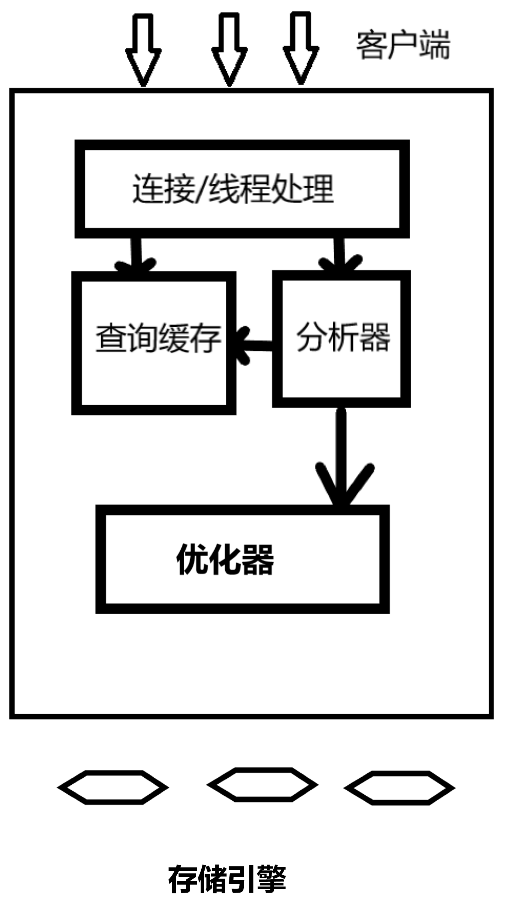
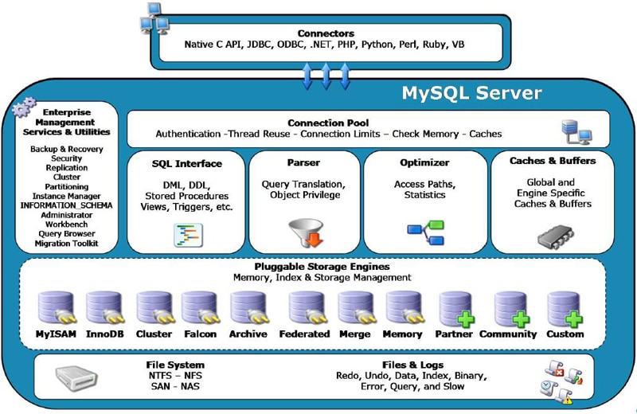
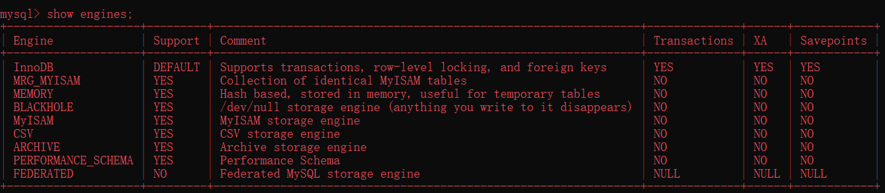

# Mysql高级


## 一 Mysql高级简介

### 1. 1 MySQL简介

-  MySQL是一个关系型数据库管理系统，由瑞典MySQL AB公司开发，目前属于Oracle公司。
- MySQL是一种关联数据库管理系统，将数据保存在不同的表中，而不是将所有数据放在一个大仓库内，这样就增加了速度并提高了灵活性。
- Mysql是开源的，所以你不需要支付额外的费用。
- Mysql是可以定制的，采用了GPL协议，你可以修改源码来开发自己的Mysql系统。
- Mysql支持大型的数据库。可以处理拥有上千万条记录的大型数据库。
- MySQL使用标准的SQL数据语言形式。
- Mysql可以允许于多个系统上，并且支持多种语言。这些编程语言包括C、C++、Python、Java、Perl、PHP、Eiffel、Ruby和Tcl等。
- MySQL支持大型数据库，支持5000万条记录的数据仓库，32位系统表文件最大可支持4GB，64位系统支持最大的表文件为8TB。

### 1.2 Mysql高级方向

- mysql内核
- sql优化工程师
- mysql服务器的优化
- 查询语句优化
- 主从复制
- 软硬件升级
- 容灾备份
- sql编程

注意：完整的mysql优化需要很深的功底,大公司甚至有专门的DBA写上述

### 1.3 Mysql逻辑架构

#### 1.3.1 MySQL整体逻辑架构



第一层，即最上一层，所包含的服务并不是MySQL所独有的技术。它们都是服务于C/S程序或者是这些程序所需要的 ：连接处理，身份验证，安全性等等。
第二层值得关注。这是MySQL的核心部分。通常叫做 SQL Layer。在 MySQL数据库系统处理底层数据之前的所有工作都是在这一层完成的，包括权限判断， sql解析，行计划优化， query cache 的处理以及所有内置的函数(如日期,时间,数学运算,加密)等等。
各个存储引擎提供的功能都集中在这一层，如存储过程，触发器，视图等
第三层包括了存储引擎。通常叫做StorEngine Layer ，也就是底层数据存取操作实现部分，由多种存储引擎共同组成。它们负责存储和获取所有存储在MySQL中的数据。就像Linux众多的文件系统 一样。
每个存储引擎都有自己的优点和缺陷。服务器是通过存储引擎API来与它们交互的。这个接口隐藏了各个存储引擎不同的地方。对于查询层尽可能的透明。这个API包含了很多底层的操作。如开始一个事务，或者取出有特定主键的行。
存储引擎不能解析SQL，互相之间也不能通信。仅仅是简单的响应服务器的请求。

#### 1.3.2 连接管理和安全

在服务器内部，每个client连接都有自己的线程。这个连接的查询都在一个单独的线程中执行。这些线程轮流运行在某一个CPU内核(多核CPU)或者CPU中。服务器缓存了线程，因此不需要为每个client连接单独创建和销毁线程 。

当clients（也就是应用程序）连接到了MySQL服务器。服务器需要对它进行认证(Authenticate)。认证是基于用户名，主机，以及密码。
对于使用了SSL（安全套接字层）的连接，还使用了X.509证书。clients一连接上，服务器就验证它的权限 （如是否允许客户端可以查询world数据库下的Country表的数据）。

#### 1.3.3 优化和执行

MySQL会解析查询，并创建了一个内部数据结构（解析树）。然后对其进行各种优化。这些优化包括了，查询语句的重写，读表的顺序，索引的选择等等。用户可以通过查询语句的关键词传递给优化器以便提示使用哪种优化方式，这样即影响了优化器的优化方式。
另外，用户也可以请求服务器给出优化过程的各种说明，以获知服务器的优化策略，为用户提供了参数基准，以便用户可以重写查询，架构和修改相关服务器配置，便于mysql更高效的运行。

优化器并是不关心表使用了哪种存储引擎，但是存储引擎对服务器优化查询的方式是有影响的。优化器需要知道存储引擎的一些特性：具体操作的性能和开销方面的信息，以及表内数据的统计信息。例如，存储引擎支持哪些索引类型，这对于查询是非常有用的。

在解析查询之前，要查询缓存，这个缓存只能保存查询信息以及结果数据。如果请求一个查询在缓存 中存在，就不需要解析，优化和执行查询了。直接返回缓存中所存放的这个查询的结果。

#### 1.3.4 MySQL逻辑模块组成

虽然从上图1看起来 MySQL 架构非常的简单，就是简单的两部分而已，但实际上每一层 中都含有各自的很多小模块，尤其是第二层 SQL Layer ，结构相当复杂的。下面我们就分别针对 SQL Layer 和 Storage Engine Layer 做一个简单的分析。我们看下图体系结构：



1.Connectors

- 指的是不同语言中与SQL的交互。

2.Management Serveices & Utilities：

- 系统管理和控制工具

3.Connection Pool: 连接池

- 管理缓冲用户连接，线程处理等需要缓存的需求。 
- 负责监听对 MySQL Server 的各种请求，接收连接请求，转发所有连接请求到线程管理模块。每一个连接上 MySQL Server 的客户端请求都会被分配（或创建）一个连接线程为其单独服务。而连接线程的主要工作就是负责 MySQL Server 与客户端的通信，
- 接受客户端的命令请求，传递 Server 端的结果信息等。线程管理模块则负责管理维护这些连接线程。包括线程的创建，线程的 cache 等。

4.SQL Interface: SQL接口。

- 接受用户的SQL命令，并且返回用户需要查询的结果。比如select from就是调用SQL Interface。

5 Parser: 解析器。

- SQL命令传递到解析器的时候会被解析器验证和解析。解析器是由Lex和YACC实现的，是一个很长的脚本。
- 在 MySQL中我们习惯将所有 Client 端发送给 Server 端的命令都称为 query ，在 MySQL Server 里面，连接线程接收到客户端的一个 Query 后，会直接将该 query 传递给专门负责将各种 Query 进行分类然后转发给各个对应的处理模块。
- 主要功能：
  - a . 将SQL语句进行语义和语法的分析，分解成数据结构，然后按照不同的操作类型进行分类，然后做出针对性的转发到后续步骤，以后SQL语句的传递和处理就是基于这个结构的。
  - b.  如果在分解构成中遇到错误，那么就说明这个sql语句是不合理的

6 Optimizer: 查询优化器。

- SQL语句在查询之前会使用查询优化器对查询进行优化。就是优化客户端请求的 query（sql语句） ，根据客户端请求的 query 语句，和数据库中的一些统计信息，在一系列算法的基础上进行分析，得出一个最优的策略，告诉后面的程序如何取得这个 query 语句的结果
- 他使用的是“选取-投影-联接”策略进行查询。

​       用一个例子就可以理解： select uid,name from user where gender = 1;
       这个select 查询先根据where 语句进行选取，而不是先将表全部查询出来以后再进行gender过滤
       这个select查询先根据uid和name进行属性投影，而不是将属性全部取出以后再进行过滤
       将这两个查询条件联接起来生成最终查询结果

7 Cache和Buffer： 查询缓存。

- 他的主要功能是将客户端提交 给MySQL 的 Select 类 query 请求的返回结果集 cache 到内存中，与该 query 的一个 hash 值 做一个对应。该 Query 所取数据的基表发生任何数据的变化之后， MySQL 会自动使该 query 的Cache 失效。在读写比例非常高的应用系统中， Query Cache 对性能的提高是非常显著的。当然它对内存的消耗也是非常大的。如果查询缓存有命中的查询结果，查询语句就可以直接去查询缓存中取数据。这个缓存机制是由一系列小缓存组成的。比如表缓存，记录缓存，key缓存，权限缓存等

8 、存储引擎接口

- 存储引擎接口模块可以说是 MySQL 数据库中最有特色的一点了。目前各种数据库产品中，基本上只有 MySQL 可以实现其底层数据存储引擎的插件式管理。这个模块实际上只是 一个抽象类，但正是因为它成功地将各种数据处理高度抽象化，才成就了今天 MySQL 可插拔存储引擎的特色。还可以看出，MySQL区别于其他数据库的最重要的特点就是其插件式的表存储引擎。MySQL插件式的存储引擎架构提供了一系列标准的管理和服务支持，这些标准与存储引擎本身无关，可能是每个数据库系统本身都必需的，如SQL分析器和优化器等，而存储引擎是底层物理结构的实现，每个存储引擎开发者都可以按照自己的意愿来进行开发。

注意：存储引擎是基于表的，而不是数据库。


#### 1.3.5 总结(重点)

**和其它数据库相比，MySQL有点与众不同，它的架构可以在多种不同场景中应用并发挥良好作用。主要体现在存储引擎的架构上， 插件式的存储引擎架构将查询处理和其它的系统任务以及数据的存储提取相分离。这种架构可以根据业务的需求和实际需要选择合适的存储引擎** 

1.连接层

最上层是一些客户端和连接服务，包含本地sock通信和大多数基于客户端/服务端工具实现的类似于tcp/ip的通信。主要完成一些类似于连接处理、授权认证、及相关的安全方案。在该层上引入了线程池的概念，为通过认证安全接入的客户端提供线程。同样在该层上可以实现基于SSL的安全链接。服务器也会为安全接入的每个客户端验证它所具有的操作权限.

2.服务层
第二层架构主要完成大多少的核心服务功能，如SQL接口，并完成缓存的查询，SQL的分析和优化及部分内置函数的执行。所有跨存储引擎的功能也在这一层实现，如过程、函数等。在该层，服务器会解析查询并创建相应的内部解析树，并对其完成相应的优化如确定查询表的顺序，是否利用索引等，最后生成相应的执行操作。如果是select语句，服务器还会查询内部的缓存。如果缓存空间足够大，这样在解决大量读操作的环境中能够很好的提升系统的性能。

3.引擎层
存储引擎层，存储引擎真正的负责了MySQL中数据的存储和提取，服务器通过API与存储引擎进行通信。不同的存储引擎具有的功能不同，这样我们可以根据自己的实际需要进行选取。后面介绍MyISAM和InnoDB

4.存储层
数据存储层，主要是将数据存储在运行于裸设备的文件系统之上，并完成与存储引擎的交互。


## 二 Linux安装mysql

### 2.1 安装

- 下载地址:https://dev.mysql.com/downloads/mysql/
- 检测工作
  - 检查当前系统是否安装过mysql：可以用 `rpm -qa|grep mysql` 看当前的系统进程，如果有mysql服务的就会显示的。请先执行卸载命令：rpm -e --nodeps  mysql-libs
  - 权限问题注意（非必需）：由于mysql安装过程中，会通过mysql用户在/tmp目录下新建tmp_db文件，所以请给/tmp较大的权限。执行 ：`chmod -R 777 /tmp`
- 安装：在mysql的安装文件目录下执行
  - `rpm -ivh MySQL-server-5.5.54-1.linux2.6.x86_64.rpm`
  - `rpm -ivh MySQL-client-5.5.54-1.linux2.6.x86_64.rpm`
- 查看MySQL安装版本
  - 执行 mysqladmin --version命令，类似java -version如果打出消息，即为成功。

```shell
[root@localhost opt]# mysqladmin --version
mysqladmin  Ver 8.42 Distrib 5.5.48, for Linux on i686
```

- 通过 查看mysql组
- 启动mysql
  - service mysqld start
- 关闭
  - service mysqld stop
- 设置密码
  - 安装完成后会提示出如下的提示：在mysql首次登录前要给 root 账号设置密码
  - 启动服务后，执行命令 
  - /usr/bin/mysqladmin -u root  password '123123'
  - 然后通过 mysql -uroot -p123123进行登录
- MySQL的安装位置
  - 在linux下查看安装目录  ps -ef|grep mysql
- 参数路径解释备注
  - --basedir /usr/bin 相关命令目录mysqladmin mysqldump等命令
  - --datadir/var/lib/mysql/ mysql数据库文件的存放路径 
  - --plugin-dir/usr/lib64/mysql/pluginmysql 插件存放路径
  - --log-error/var/lib/mysql/jack.atguigu.errmysql 错误日志路径
  - --pid-file/var/lib/mysql/jack.atguigu.pid 进程pid文件
  - --socket/var/lib/mysql/mysql.sock 本地连接时用的unix套接字文件   
  - /usr/share/mysql 配置文件目录mysql脚本及配置文件
  - /etc/init.d/mysql 服务启停相关脚本
- 自启动mysql服务
  - chkconfig mysql on 


### 2.2 修改字符集问题

查看字符集

```mysql
show variables like 'character%'; 
show variables like '%char%';
```

在/usr/share/mysql/ 中找到my.cnf的配置文件，拷贝其中的my-huge.cnf 到 /etc/  并命名为my.cnf 。mysql 优先选中 /etc/ 下的配置文件然后修改my.cnf:

```properties
[client]

default-character-set=utf8

[mysqld]

character_set_server=utf8

character_set_client=utf8

collation-server=utf8_general_ci

[mysql]

default-character-set=utf8
```


重新启动mysql

- 但是原库的设定不会发生变化，参数修改之对新建的数据库生效

已生成的库表字符集如何变更

- 修改数据库的字符集

```mysql
mysql> alter database mytest character set 'utf8';
```

- 修改数据表的字符集

```mysql
mysql> alter table user convert to  character set 'utf8';
```

但是原有的数据如果是用非'utf8'编码的话，数据本身不会发生改变。

 ## 三 Mysql配置文件

- 二进制日志log-bin：主重复制
- 错误日志log-error：默认是关闭的,记录严重的警告和错误信息,每次启动和关闭的详细信息等.
- 查询日志log：默认关闭,记录查询的sql语句，如果开启会减低mysql的整体性能，因为记录日志也是需要消耗系统资源的
- 数据文件：windows在安装目录的data下查找；linux看看当前系统中的全部库后再进去，默认路径：/var/lib/mysql
  - frm文件：存放表结构
  - myd文件：存放表数据
  - myi文件：存放表索引

## 四 Mysql存储引擎

### 4.1 mysql支持的存储引擎

```mysql
# 如何用命令查看
#看你的mysql现在已提供什么存储引擎:
mysql> show engines;

#看你的mysql当前默认的存储引擎:
mysql> show variables like '%storage_engine%';
```



### 4.2  各个引擎简介

 **1、InnoDB存储引擎**
InnoDB是MySQL的默认事务型引擎，它被设计用来处理大量的短期(short-lived)事务。除非有非常特别的原因需要使用其他的存储引擎，否则应该优先考虑InnoDB引擎。行级锁，适合高并发情况

**2、MyISAM存储引擎**
MyISAM提供了大量的特性，包括全文索引、压缩、空间函数(GIS)等，但MyISAM不支持事务和行级锁(myisam改表时会将整个表全锁住)，有一个毫无疑问的缺陷就是崩溃后无法安全恢复。

**3、Archive引擎**
Archive存储引擎只支持INSERT和SELECT操作，在MySQL5.1之前不支持索引。
Archive表适合日志和数据采集类应用。适合低访问量大数据等情况。
根据英文的测试结论来看，Archive表比MyISAM表要小大约75%，比支持事务处理的InnoDB表小大约83%。

**4、Blackhole引擎**
Blackhole引擎没有实现任何存储机制，它会丢弃所有插入的数据，不做任何保存。但服务器会记录Blackhole表的日志，所以可以用于复制数据到备库，或者简单地记录到日志。但这种应用方式会碰到很多问题，因此并不推荐。

**5、CSV引擎**
CSV引擎可以将普通的CSV文件作为MySQL的表来处理，但不支持索引。
CSV引擎可以作为一种数据交换的机制，非常有用。
CSV存储的数据直接可以在操作系统里，用文本编辑器，或者excel读取。

**6、Memory引擎**
如果需要快速地访问数据，并且这些数据不会被修改，重启以后丢失也没有关系，那么使用Memory表是非常有用。Memory表至少比MyISAM表要快一个数量级。(使用专业的内存数据库更快，如redis)

**7、Federated引擎**
Federated引擎是访问其他MySQL服务器的一个代理，尽管该引擎看起来提供了一种很好的跨服务器的灵活性，但也经常带来问题，因此默认是禁用的。

 ### 4.3 MyISAM和InnoDB

innodb 索引 使用 B+TREE myisam 索引使用 b-tree
innodb 主键为聚簇索引，基于聚簇索引的增删改查效率非常高。

| 对比项         | MyISAM                                                   | InnoDB                                                       |
| -------------- | -------------------------------------------------------- | ------------------------------------------------------------ |
| 主外键         | 不支持                                                   | 支持                                                         |
| 事务           | 不支持                                                   | 支持                                                         |
| 行表锁         | 表锁，即使操作一条记录也会锁住整个表，不适合高并发的操作 | 行锁,操作时只锁某一行，不对其它行有影响，适合高并发的操作    |
| 缓存           | 只缓存索引，不缓存真实数据                               | 不仅缓存索引还要缓存真实数据，对内存要求较高，而且内存大小对性能有决定性的影响 |
| 表空间         | 小                                                       | 大                                                           |
| 关注点         | 性能                                                     | 事务                                                         |
| 默认安装       | Y                                                        | Y                                                            |
| 用户表默认使用 | N                                                        | Y                                                            |
| 自带系统表使用 | Y                                                        | N                                                            |

### 4.4 阿里巴巴、淘宝用哪个

- Percona 为 MySQL 数据库服务器进行了改进，在功能和性能上较 MySQL 有着很显著的提升。该版本提升了在高负载情况下的 InnoDB 的性能、为 DBA 提供一些非常有用的性能诊断工具；另外有更多的参数和命令来控制服务器行为。
- 该公司新建了一款存储引擎叫xtradb完全可以替代innodb,并且在性能和并发上做得更好,
- 阿里巴巴大部分mysql数据库其实使用的percona的原型加以修改。
- AliSql+AliRedis


