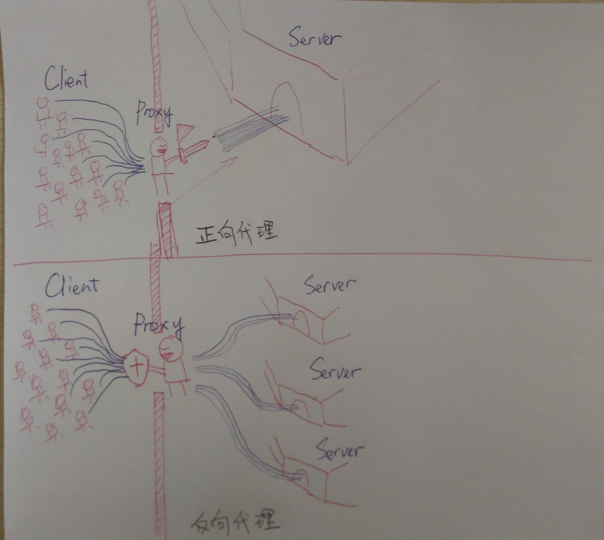
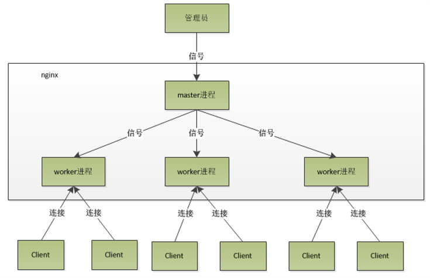
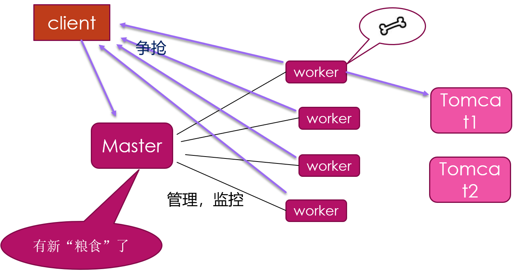

# Nginx

*@Author:hanguixian*

*@Email:hn_hanguixian@163.com*


## 一 Nginx 概述

Nginx ("engine x") 是一个高性能的HTTP和反向代理服务器,特点是占有内存少，并发能力强，事实上nginx的并发能力确实在同类型的网页服务器中表现较好，中国大陆使用nginx网站用户有：百度、京东、新浪、网易、腾讯、淘宝等 n

Nginx 是一个高性能的 Web 和反向代理服务器, 它具有有很多非常优越的特性:

- **作为 Web 服务器**：相比 Apache，Nginx 使用更少的资源，支持更多的并发连接，体现更高的效率，这点使 Nginx 尤其受到虚拟主机提供商的欢迎。能够支持高达 50,000 个并发连接数的响应，感谢 Nginx 为我们选择了 epoll and kqueue 作为开发模型.
- **作为负载均衡服务器**：Nginx 既可以在内部直接支持 Rails 和 PHP，也可以支持作为 HTTP代理服务器 对外进行服务。Nginx 用 C 编写, 不论是系统资源开销还是 CPU 使用效率都比 Perlbal 要好的多。
- **作为邮件代理服务器**: Nginx 同时也是一个非常优秀的邮件代理服务器（最早开发这个产品的目的之一也是作为邮件代理服务器），Last.fm 描述了成功并且美妙的使用经验。
- **Nginx 安装非常的简单，配置文件 非常简洁（还能够支持perl语法），Bugs非常少的服务器**: Nginx 启动特别容易，并且几乎可以做到7*24不间断运行，即使运行数个月也不需要重新启动。你还能够在 不间断服务的情况下进行软件版本的升级。

## 二 什么是反向代理

### 2.1 正向代理

- 什么是正向代理？
  - 是一个位于客户端和原始服务器(origin server)之间的服务器，为了从原始服务器取得内容，客户端向代理发送一个请求并指定目标(原始服务器)，然后代理向原始服务器转交请求并将获得的内容返回给客户端。客户端必须要进行一些特别的设置才能使用正向代理。 
  - 通俗的说：就是你要访问一个网站，但是你可能无法直接访问或者是你不想要这个网站知道是谁访问的，这个时候就可以通过代理服务器的方式，你将请求发到代理服务器，代理服务器去访问真正的网站，前提是这个代理服务器能够访问到该网站。


### 2.2 反向代理

- 反向代理（Reverse Proxy）实际运行方式是指以代理服务器来接受internet上的连接请求，然后将请求转发给内部网络上的服务器，并将从服务器上得到的结果返回给internet上请求连接的客户端，此时代理服务器对外就表现为一个服务器。
- 反向代理的作用：
  - （1）保证内网的安全，可以使用反向代理提供WAF功能，阻止web攻击大型网站，通常将反向代理作为公网访问地址，Web服务器是内网。
  - （2）负载均衡，通过反向代理服务器来优化网站的负载


### 2.3 两者区别(来自知乎)



## 三 安装Nginx

- 安装Nginx的方式有很多种，可以参考官网：http://nginx.org/ 。
- 只展示其中常见的一种方式，参考菜鸟教程：http://www.runoob.com/linux/nginx-install-setup.html。

### 3.1 安装编译工具及库文件

```shell
yum -y install make zlib zlib-devel gcc-c++ libtool  openssl openssl-devel
```

### 3.2 首先要安装 PCRE

PCRE 作用是让 Nginx 支持 Rewrite 功能。

1、下载 PCRE 安装包，下载地址： <http://downloads.sourceforge.net/project/pcre/pcre/8.35/pcre-8.35.tar.gz>

```shell
[root@bogon src]# wget http://downloads.sourceforge.net/project/pcre/pcre/8.35/pcre-8.35.tar.gz
```

2、解压安装包:

```shell
[root@bogon src]# tar zxvf pcre-8.35.tar.gz
```

3、进入安装包目录

```shell
[root@bogon src]# cd pcre-8.35
```

4、编译安装 

```shell
[root@bogon pcre-8.35]# ./configure
[root@bogon pcre-8.35]# make && make install
```

5、查看pcre版本

```shell
[root@bogon pcre-8.35]# pcre-config --version
```

### 3.3 安装 Nginx

1、下载 Nginx，下载地址：<http://nginx.org/download/nginx-1.6.2.tar.gz>

```shell
[root@bogon src]# wget http://nginx.org/download/nginx-1.6.2.tar.gz
```


2、解压安装包

```shell
[root@bogon src]# tar zxvf nginx-1.6.2.tar.gz
```

3、进入安装包目录

```shell
[root@bogon src]# cd nginx-1.6.2
```

4、编译安装

```shell
[root@bogon nginx-1.6.2]# ./configure --prefix=/usr/local/webserver/nginx --with-http_stub_status_module --with-http_ssl_module --with-pcre=/usr/local/src/pcre-8.35
[root@bogon nginx-1.6.2]# make
[root@bogon nginx-1.6.2]# make install
```

5、查看nginx版本

```shell
[root@bogon nginx-1.6.2]# /usr/local/webserver/nginx/sbin/nginx -v
```

到此，nginx安装完成。


## 四 启动nginx 

- 启动命令 

  - 在/usr/local/nginx/sbin目录下执行 

```shell
 ./nginx
```

- 关闭命令 
  - 在/usr/local/nginx/sbin目录下执行  

```shell
./nginx  -s stop 
```

- 重新加载命令 
  - 在/usr/local/nginx/sbin目录下执行  

```shell
./nginx   -s reload 
```


## 五 结合redis配置负载均衡 

### 5.1 springboot项目

- build.gradle

```gradle
buildscript {
    ext {
        springBootVersion = '2.1.1.RELEASE'
    }
    repositories {
        mavenCentral()
    }
    dependencies {
        classpath("org.springframework.boot:spring-boot-gradle-plugin:${springBootVersion}")
    }
}

apply plugin: 'java'
apply plugin: 'eclipse'
apply plugin: 'org.springframework.boot'
apply plugin: 'io.spring.dependency-management'

group = 'com.hgx.nginx'
version = '0.0.1-SNAPSHOT'
sourceCompatibility = 1.8

repositories {
    mavenCentral()
}


dependencies {
    implementation('org.springframework.boot:spring-boot-starter-data-redis')
    implementation('org.springframework.boot:spring-boot-starter-web')
    // https://mvnrepository.com/artifact/org.springframework.session/spring-session-data-redis
    compile group: 'org.springframework.session', name: 'spring-session-data-redis', version: '2.1.2.RELEASE'
    testImplementation('org.springframework.boot:spring-boot-starter-test')
}
```

- application.properties

```properties
server.port= 10091
spring.redis.host=192.168.118.155
spring.redis.port=6379
spring.redis.password=123456
```

- 启动类：SwarmredisApplication

```java
import org.springframework.boot.SpringApplication;
import org.springframework.boot.autoconfigure.SpringBootApplication;
import org.springframework.boot.web.servlet.ServletComponentScan;

@SpringBootApplication
@ServletComponentScan
public class SwarmredisApplication {
    public static void main(String[] args) {
        SpringApplication.run(SwarmredisApplication.class, args);
    }
}
```

- controller: HelloWorldServlet

```java
package com.hgx.nginx.swarmredis.controller;

import javax.servlet.ServletException;
import javax.servlet.annotation.WebServlet;
import javax.servlet.http.HttpServlet;
import javax.servlet.http.HttpServletRequest;
import javax.servlet.http.HttpServletResponse;
import javax.servlet.http.HttpSession;
import java.io.IOException;
import java.util.Random;

@WebServlet(name = "/hello", urlPatterns = "/hello")
public class HelloWorldServlet extends HttpServlet {
    protected void doGet(HttpServletRequest request, HttpServletResponse response) throws ServletException, IOException {
        HttpSession session = request.getSession();
        int port2 = request.getLocalPort();
        if (session.getAttribute("userid") == null) {
            String userid = String.valueOf(new Random().nextInt(100));
            session.setAttribute("userid", userid);
            System.out.println("userId:" + userid + " port:" + port2);
            response.getWriter().append("Hello, " + userid + ",this is " + port2 + " port");
        } else {
            String userid = (String) session.getAttribute("userid");
            System.out.println("userId:" + userid + " port:" + port2);
            response.getWriter().append("Welcome back, " + userid + ", this is " + port2 + " port");
        }

    }
}
```

- HttpSessionConfig

```java
@Configuration
@EnableRedisHttpSession
public class HttpSessionConfig {
}
```

- 编译打包后，部署运行

### 5.2 nginx配置

- nginx.conf

```json
worker_processes  1;
events {
    worker_connections  1024;
}
http {
    include       mime.types;
    default_type  application/octet-stream;
    sendfile        on;
    keepalive_timeout  65;

    upstream myserver {
      #ip_hash ;
      server 127.0.0.1:10090 ;
      server 127.0.0.1:10091 ;


    }
    
    server {
        listen       80;
        server_name  localhost;

        location / {
            root   html;
            index  index.html index.htm;
        }

        location /myserver/ {

            proxy_pass http://myserver/ ;

            proxy_connect_timeout 10;

            proxy_redirect default;  
}
        error_page   500 502 503 504  /50x.html;
        location = /50x.html {
            root   html;
        }
}
```


## 六  nginx的原理与配置

### 6.1 master&worker  





- master-workers的机制的好处 

  - 首先，对于每个worker进程来说，独立的进程，不需要加锁，所以省掉了锁带来的开销，同时在编程以及问题查找时，也会方便很多。
  - 其次，采用独立的进程，可以让互相之间不会影响，一个进程退出后，其它进程还在工作，服务不会中断，master进程则很快启动新的worker进程。当然，worker进程的异常退出，肯定是程序有bug了，异常退出，会导致当前worker上的所有请求失败，不过不会影响到所有请求，所以降低了风险 。

- 需要设置多少个worker 

  - Nginx 同redis类似都采用了io多路复用机制，每个worker都是一个独立的进程，但每个进程里只有一个主线程，通过异步非阻塞的方式来处理请求，  即使是千上万个请求也不在话下。每个worker的线程可以把一个cpu的性能发挥到极致。
  - 所以worker数和服务器的cpu数相等是最为适宜的。设少了会浪费cpu，设多了会造成cpu频繁切换上下文带来的损耗。

  ```shell
  #设置worker数量。
  worker_processes   4
  #work绑定cpu(4 work绑定4cpu)。
  worker_cpu_affinity 0001 0010 0100 1000
  #work绑定cpu (4 work绑定8cpu中的4个) 。
  worker_cpu_affinity 0000001 00000010 00000100 00001000
  ```

- 连接数worker_connection 

  - 这个值是表示每个worker进程所能建立连接的最大值，所以，一个nginx能建立的最大连接数，应该是`worker_connections * worker_processes`。当然，这里说的是最大连接数，对于HTTP请求本地资源来说，能够支持的最大并发数量是`worker_connections * worker_processes`，如果是支持http1.1的浏览器每次访问要占两个连接，所以普通的静态访问最大并发数是： `worker_connections * worker_processes /2`，而如果是HTTP作为反向代理来说，最大并发数量应该是`worker_connections * worker_processes/4`。因为作为反向代理服务器，每个并发会建立与客户端的连接和与后端服务的连接，会占用两个连接。 

### 6.2 nginx.conf 结构 


### 6.3 详情见配置文件 nginx.conf

