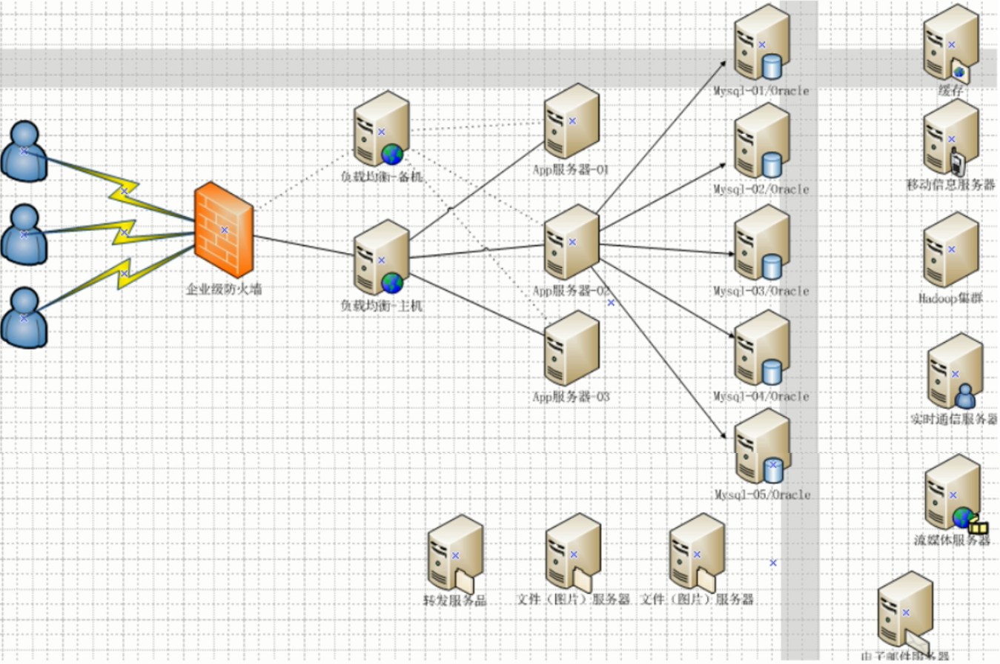
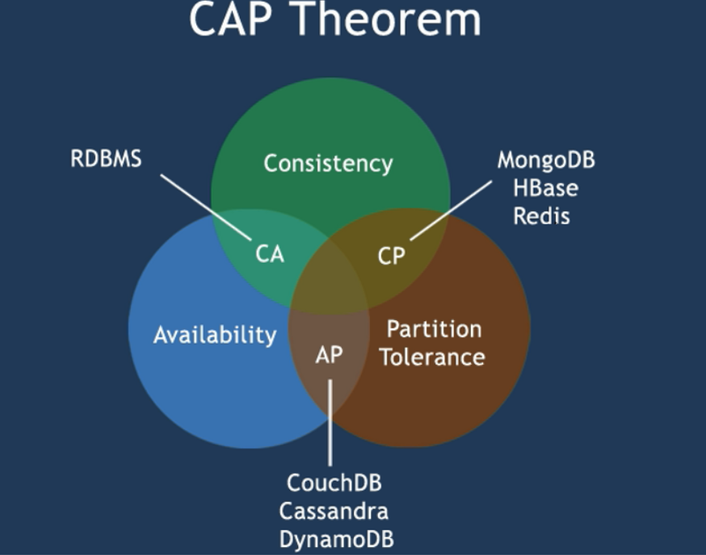

# Redis

<font color="green">*@Author:hanguixian*</font>

<font color="green">*@Email:hn_hanguixian@163.com*</font>


## 一 NoSql入门和概述

### 1 .  入门概述

#### 1.1 互联网时代背景下大机遇，为什么用nosql 

##### 1.1.1  单机mysql

- 在90年代，一个网站的访问量一般都不大，用单个数据库完全可以轻松应付。在那个时候，更多的都是静态网页，动态交互类型的网站不多。

- 上述架构下，我们来看看数据存储的瓶颈是什么？
  - 1.数据量的总大小 一个机器放不下时
  - 2.数据的索引（B+ Tree）一个机器的内存放不下时
  - 3.访问量(读写混合)一个实例不能承受

- 如果满足了上述1 or 3个，进化......

  

##### 1.1.2 Memcached(缓存)+MySQL+垂直拆分

- 后来，随着访问量的上升，几乎大部分使用MySQL架构的网站在数据库上都开始出现了性能问题，web程序不再仅仅专注在功能上，同时也在追求性能。程序员们开始大量的使用缓存技术来缓解数据库的压力，优化数据库的结构和索引。开始比较流行的是通过文件缓存来缓解数据库压力，但是当访问量继续增大的时候，多台web机器通过文件缓存不能共享，大量的小文件缓存也带了了比较高的IO压力。在这个时候，Memcached就自然的成为一个非常时尚的技术产品。
- Memcached作为一个独立的分布式的缓存服务器，为多个web服务器提供了一个共享的高性能缓存服务，在Memcached服务器上，又发展了根据hash算法来进行多台Memcached缓存服务的扩展，然后又出现了一致性hash来解决增加或减少缓存服务器导致重新hash带来的大量缓存失效的弊端


##### 1.1.3 Mysql主从读写分离

- 由于数据库的写入压力增加，Memcached只能缓解数据库的读取压力。读写集中在一个数据库上让数据库不堪重负，大部分网站开始使用主从复制技术来达到读写分离，以提高读写性能和读库的可扩展性。Mysql的master-slave模式成为这个时候的网站标配了。


##### 1.1.4 分表分库+水平拆分+mysql集群 

-  在Memcached的高速缓存，MySQL的主从复制，读写分离的基础之上，这时MySQL主库的写压力开始出现瓶颈，而数据量的持续猛增，由于MyISAM使用表锁，在高并发下会出现严重的锁问题，大量的高并发MySQL应用开始使用InnoDB引擎代替MyISAM。
-  同时，开始流行使用分表分库来缓解写压力和数据增长的扩展问题。这个时候，分表分库成了一个热门技术，是面试的热门问题也是业界讨论的热门技术问题。也就在这个时候，MySQL推出了还不太稳定的表分区，这也给技术实力一般的公司带来了希望。虽然MySQL推出了MySQL Cluster集群，但性能也不能很好满足互联网的要求，只是在高可靠性上提供了非常大的保证。


##### 1.1.5 MySQL的扩展性瓶颈

- MySQL数据库也经常存储一些大文本字段，导致数据库表非常的大，在做数据库恢复的时候就导致非常的慢，不容易快速恢复数据库。比如1000万4KB大小的文本就接近40GB的大小，如果能把这些数据从MySQL省去，MySQL将变得非常的小。关系数据库很强大，但是它并不能很好的应付所有的应用场景。MySQL的扩展性差（需要复杂的技术来实现），大数据下IO压力大，表结构更改困难，正是当前使用MySQL的开发人员面临的问题。

##### 1.1.6 今天是什么样子？？



##### 1.1.7 为什么使用NoSQL ? 

- 今天我们可以通过第三方平台（如：Google,Facebook等）可以很容易的访问和抓取数据。用户的个人信息，社交网络，地理位置，用户生成的数据和用户操作日志已经成倍的增加。我们如果要对这些用户数据进行挖掘，那SQL数据库已经不适合这些应用了, NoSQL数据库的发展也却能很好的处理这些大的数据。

#### 1.2 是什么 ？

- NoSQL(NoSQL = Not Only SQL )，意即“不仅仅是SQL”，
- 泛指非关系型的数据库。随着互联网web2.0网站的兴起，传统的关系数据库在应付web2.0网站，特别是超大规模和高并发的SNS类型的web2.0纯动态网站已经显得力不从心，暴露了很多难以克服的问题，而非关系型的数据库则由于其本身的特点得到了非常迅速的发展。NoSQL数据库的产生就是为了解决大规模数据集合多重数据种类带来的挑战，尤其是大数据应用难题，包括超大规模数据的存储。
- （例如谷歌或Facebook每天为他们的用户收集万亿比特的数据）。这些类型的数据存储不需要固定的模式，无需多余操作就可以横向扩展。

#### 1.3 能做什么？

##### 1.3.1 易扩展 

- NoSQL数据库种类繁多，但是一个共同的特点都是去掉关系数据库的关系型特性。
- 数据之间无关系，这样就非常容易扩展。也无形之间，在架构的层面上带来了可扩展的能力。

##### 1.3.2 大数据量高性能

- NoSQL数据库都具有非常高的读写性能，尤其在大数据量下，同样表现优秀。
- 这得益于它的无关系性，数据库的结构简单。
- 一般MySQL使用Query Cache，每次表的更新Cache就失效，是一种大粒度的Cache，在针对web2.0的交互频繁的应用，Cache性能不高。而NoSQL的Cache是记录级的，是一种细粒度的Cache，所以NoSQL在这个层面上来说就要性能高很多了

##### 1.3.3 多样灵活的数据模型

- NoSQL无需事先为要存储的数据建立字段，随时可以存储自定义的数据格式。而在关系数据库里，增删字段是一件非常麻烦的事情。如果是非常大数据量的表，增加字段简直就是一个噩梦

##### 1.3.4 传统RDBMS VS NOSQL

-  RDBMS
     - 高度组织化结构化数据
     -  结构化查询语言（SQL）
     -  数据和关系都存储在单独的表中。
     -  数据操纵语言，数据定义语言
     -  严格的一致性
     -  基础事务
-  NoSQL
    - 代表着不仅仅是SQL
    - 没有声明性查询语言
    - 没有预定义的模式
    - 键 - 值对存储，列存储，文档存储，图形数据库
    - 最终致性，而非ACID属性
    - 非结构化和不可预知的数据
    - CAP定理
    - 高性能，高可用性和可伸缩性

#### 1.4 种类

- Redis
- memcache
- Mongdb

#### 1.5 掌握基础

- KV
- Cache
- Persistence
- .......

### 2 . 3V+3高

- 大数据时代的3V
  - 海量Volume
  - 多样Variety
  - 实时Velocity
- 互联网需求的3高
  - 高并发
  - 高可扩
  - 高性能

### 3 NoSQL数据库的四大分类

- KV键值
  - 新浪：BerkeleyDB+redis
  - 美团：redis+tair
  - 阿里、百度：memcache+redis

- 文档型数据库(bson格式比较多)
  - CouchDB
  - MongoDB
    - MongoDB 是一个基于分布式文件存储的数据库。由 C++ 语言编写。旨在为 WEB 应用提供可扩展的高性能数据存储解决方案。
    - MongoDB 是一个介于关系数据库和非关系数据库之间的产品，是非关系数据库当中功能最丰富，最像关系数据库的。
  - 列存储数据库
    - Cassandra, HBase
    - 分布式文件系统
  - 图关系数据库
    - 它不是放图形的，放的是关系比如:朋友圈社交网络、广告推荐系统
    - 社交网络，推荐系统等。专注于构建关系图谱
    - Neo4J, InfoGrid
  - 四种对比

  | **分类**          | **典型代表**                                           | **典型应用场景**                                             | **数据类型**                                    | **优点**                                                     | **缺点**                                                     |
  | ----------------- | ------------------------------------------------------ | ------------------------------------------------------------ | ----------------------------------------------- | ------------------------------------------------------------ | ------------------------------------------------------------ |
  | 键值（key-value） | Tokyo Cabinet/Tyrant, **Redis**, Voldemort, Oracle BDB | 内容缓存，主要用于处理大量数据的高访问负载，也用于一些日志系统等等。 | Key 指向 Value 的键值对，通常用hash table来实现 | 查找速度快                                                   | 数据无结构化，通常只被当作字符串或者二进制数据               |
  | 列存储数据库      | Cassandra, HBase, Riak                                 | 分布式的文件系统                                             | 以列簇式存储，将同一列数据存在一起              | 查找速度快，可扩展性强，更容易进行分布式扩展                 | 功能相对局限                                                 |
  | 文档型数据库      | CouchDB, MongoDB                                       | Web应用（与Key-Value类似，Value是结构化的，不同的是数据库能够了解Value的内容） | Key-Value对应的键值对，Value为结构化数据        | 数据结构要求不严格，表结构可变，不需要像关系型数据库一样需要预先定义表结构 | 查询性能不高，而且缺乏统一的查询语法。                       |
  | 图形(Graph)数据库 | Neo4J, InfoGrid, Infinite Graph                        | 社交网络，推荐系统等。专注于构建关系图谱                     | 图结构                                          | 利用图结构相关算法。比如最短路径寻址，N度关系查找等          | 很多时候需要对整个图做计算才能得出需要的信息，而且这种结构不太好做分布式的集群方案。 |

### 4 在分布式数据库中CAP原理CAP+BASE

#### 4.1 传统的ACID

- A (Atomicity) 原子性
- C (Consistency) 一致性
- I (Isolation) 独立性
- D (Durability) 持久性

#### 4.2 CAP

- C:Consistency（强一致性）
- A:Availability（可用性）
- P:Partition tolerance（分区容错性）

#### 4.3 CAP的3进2

- CAP理论就是说在分布式存储系统中，最多只能实现上面的两点。而由于当前的网络硬件肯定会出现延迟丢包等问题，所以分区容忍性是我们必须需要实现的。所以我们只能在一致性和可用性之间进行权衡，没有NoSQL系统能同时保证这三点。
-  C:强一致性 A：高可用性 P：分布式容忍性
  -  CA 传统Oracle数据库
  - AP 大多数网站架构的选择
  - CP Redis、Mongodb
- 注意：分布式架构的时候必须做出取舍。一致性和可用性之间取一个平衡。多余大多数web应用，其实并不需要强一致性。因此牺牲C换取P，这是目前分布式数据库产品的方向
- 一致性与可用性的决择
  - 对于web2.0网站来说，关系数据库的很多主要特性却往往无用武之地
- 数据库事务一致性需求 
  - 很多web实时系统并不要求严格的数据库事务，对读一致性的要求很低， 有些场合对写一致性要求并不高。允许实现最终一致性。
- 数据库的写实时性和读实时性需求
  - 对关系数据库来说，插入一条数据之后立刻查询，是肯定可以读出来这条数据的，但是对于很多web应用来说，并不要求这么高的实时性，比方说发一条消息之 后，过几秒乃至十几秒之后，我的订阅者才看到这条动态是完全可以接受的。
- 对复杂的SQL查询，特别是多表关联查询的需求 
  - 任何大数据量的web系统，都非常忌讳多个大表的关联查询，以及复杂的数据分析类型的报表查询，特别是SNS类型的网站，从需求以及产品设计角 度，就避免了这种情况的产生。往往更多的只是单表的主键查询，以及单表的简单条件分页查询，SQL的功能被极大的弱化了。

#### 4.4 经典CAP图



- CAP理论的核心是：一个分布式系统不可能同时很好的满足一致性，可用性和分区容错性这三个需求，最多只能同时较好的满足两个。

- 因此，根据 CAP 原理将 NoSQL 数据库分成了满足 CA 原则、满足 CP 原则和满足 AP 原则三 大类：

  - CA - 单点集群，满足一致性，可用性的系统，通常在可扩展性上不太强大。

  - CP - 满足一致性，分区容忍必的系统，通常性能不是特别高。

  - AP - 满足可用性，分区容忍性的系统，通常可能对一致性要求低一些。

    

#### 4.5 BASE

  - BASE就是为了解决关系数据库强一致性引起的问题而引起的可用性降低而提出的解决方案。

  - BASE其实是下面三个术语的缩写：
    - 基本可用（Basically Available）
    - 软状态（Soft state）
    - 最终一致（Eventually consistent）

  - 它的思想是通过让系统放松对某一时刻数据一致性的要求来换取系统整体伸缩性和性能上改观。为什么这么说呢，缘由就在于大型系统往往由于地域分布和极高性能的要求，不可能采用分布式事务来完成这些指标，要想获得这些指标，我们必须采用另外一种方式来完成，这里BASE就是解决这个问题的办法

#### 4.6 分布式系统+集群

  - 分布式系统（distributed system）
    - 由多台计算机和通信的软件组件通过计算机网络连接（本地网络或广域网）组成。分布式系统是建立在网络之上的软件系统。正是因为软件的特性，所以分布式系统具有高度的内聚性和透明性。因此，网络和分布式系统之间的区别更多的在于高层软件（特别是操作系统），而不是硬件。分布式系统可以应用在在不同的平台上如：Pc、工作站、局域网和广域网上等。

  - 简单来讲：
    - 分布式：不同的多台服务器上面部署不同的服务模块（工程），他们之间通过Rpc/Rmi之间通信和调用，对外提供服务和组内协作。
    - 集群：不同的多台服务器上面部署相同的服务模块，通过分布式调度软件进行统一的调度，对外提供服务和访问。

## 二 Redis入门介绍

### 1 入门概述

#### 1.1 是什么 

- Redis:REmote DIctionary Server(远程字典服务器)
- 是完全开源免费的，用C语言编写的，遵守BSD协议，是一个高性能的(key/value)分布式内存数据库，基于内存运行并支持持久化的NoSQL数据库，是当前最热门的NoSql数据库之一,也被人们称为数据结构服务器
- Redis 与其他 key - value 缓存产品有以下三个特点
  - Redis支持数据的持久化，可以将内存中的数据保持在磁盘中，重启的时候可以再次加载进行使用
  - Redis不仅仅支持简单的key-value类型的数据，同时还提供list，set，zset，hash等数据结构的存储
  - Redis支持数据的备份，即master-slave模式的数据备份

#### 1.2 能干嘛

- 内存存储和持久化：redis支持异步将内存中的数据写到硬盘上，同时不影响继续服务
- 取最新N个数据的操作，如：可以将最新的10条评论的ID放在Redis的List集合里面
- 模拟类似于HttpSession这种需要设定过期时间的功能
- 发布、订阅消息系统
- 定时器、计数器

#### 1.3 官网

- http://redis.io/
- http://www.redis.cn/（中文）

#### 1.4 怎么玩

- 数据类型、基本操作和配置
- 持久化和复制，RDB/AOF
- 事务的控制
- 复制
- .....

### 2 Redis的安装

#### 2.1 windows版安装

- 下载地址：https://github.com/dmajkic/redis/downloads
- 下载到的Redis支持32bit和64bit。根据自己实际情况选择，将64bit的内容cp到自定义盘符安装目录取名redis。 如 C:\reids
- 打开一个cmd窗口 使用cd命令切换目录到 C:\redis 运行 redis-server.exe redis.conf 。
- 如果想方便的话，可以把redis的路径加到系统的环境变量里，这样就省得再输路径了，后面的那个redis.conf可以省略，如果省略，会启用默认的。输入之后，会显示如下界面：
- 这时候另启一个cmd窗口，原来的不要关闭，不然就无法访问服务端了。
- 切换到redis目录下运行 redis-cli.exe -h 127.0.0.1 -p 6379 。
- 测试
  - 设置键值对 set myKey abc
  - 取出键值对 get myKey

#### 2.2 Linux版安装

**由于企业里面做Redis开发，99%都是Linux版的运用和安装，几乎不会涉及到Windows版**

##### 2.2.1 安装

- 下载获得redis-x.x.x.tar.gz后将它放入我们的Linux目录/opt
- /opt目录下，解压命令:tar -zxvf redis-x.x.x.tar.gz
- 解压完成后出现文件夹：redis-x.x.x
- 进入目录:cd redis-x.x.x
- 在redis-x.x.x目录下执行make命令(需要gcc:yum install gcc-c++)
- 如果make完成后继续执行make install

```shell
#安装
# https://redis.io/download
#下载，解压缩和编译Redis：
wget http://download.redis.io/releases/redis-5.0.2.tar.gz
tar xzf redis-5.0.2.tar.gz
cd redis-5.0.2
make
make install(可选)
#现在编译的二进制文件在src 目录中可用 。运行Redis：
src/redis-server
#您可以使用内置客户端与Redis进行交互：
src/redis-cli
redis> set foo bar
OK
redis> get foo
"bar"
```

##### 2.2.2 查看默认安装目录：usr/local/bin

```shell
[root@xxxmmm ~]# cd /usr/local/bin/
[root@xxxmmm bin]# ll
total 32636
-rwxr-xr-x 1 root root 4365264 Nov 26 21:52 redis-benchmark
-rwxr-xr-x 1 root root 8086264 Nov 26 21:52 redis-check-aof
-rwxr-xr-x 1 root root 8086264 Nov 26 21:52 redis-check-rdb
-rwxr-xr-x 1 root root 4782296 Nov 26 21:52 redis-cli
lrwxrwxrwx 1 root root      12 Nov 26 21:52 redis-sentinel -> redis-server
-rwxr-xr-x 1 root root 8086264 Nov 26 21:52 redis-server
```

- redis-benchmark:性能测试工具，可以在自己本子运行，看看自己本子性能如何
- redis-check-aof：修复有问题的AOF文件，rdb和aof后面讲
- redis-check-dump(redis-check-rdb**?**)：修复有问题的dump.rdb文件
- redis-cli：客户端，操作入口
- redis-sentinel：redis集群使用
- redis-server：Redis服务器启动命令

##### 2.2.3 启动

- 修改redis.conf文件将里面的daemonize no 改成 yes，让服务在后台启动
- 将默认的redis.conf拷贝到自己定义好的一个路径下，比如/myconf
- /usr/local/bin目录下运行redis-server，运行拷贝出存放了自定义conf文件目录下的redis.conf文件

```shell
redis-server /hanguixian/myredis/redis.conf 
```

- 单实例关闭：redis-cli shutdown
- 多实例关闭，指定端口关闭:redis-cli -p 6379 shutdown

```shell
[root@xxxmmm bin]# redis-server /hanguixian/myredis/redis.conf 
14788:C 27 Nov 2018 15:59:21.466 # oO0OoO0OoO0Oo Redis is starting oO0OoO0OoO0Oo
14788:C 27 Nov 2018 15:59:21.466 # Redis version=5.0.0, bits=64, commit=00000000, modified=0, pid=14788, just started
14788:C 27 Nov 2018 15:59:21.466 # Configuration loaded
[root@xxxmmm bin]# redis-cli -p 6379
127.0.0.1:6379> 
[root@xxxmmm bin]# ps -ef|grep redis
root     12151     1  0 Nov25 ?        00:02:37 ./redis-server 127.0.0.1:6379
root     14797 14738  0 16:00 pts/0    00:00:00 grep --color=auto redis
[root@xxxmmm bin]# redis-cli 
127.0.0.1:6379> SHUTDOWN
not connected> exit
[root@xxxmmm bin]# redis-cli -p 6379
Could not connect to Redis at 127.0.0.1:6379: Connection refused
not connected> exit
[root@xxxmmm bin]# ps -ef|grep redis
root     14819 14738  0 16:02 pts/0    00:00:00 grep --color=auto redis
[root@xxxmmm bin]# redis-server /hanguixian/myredis/redis.conf 
14820:C 27 Nov 2018 16:02:44.066 # oO0OoO0OoO0Oo Redis is starting oO0OoO0OoO0Oo
14820:C 27 Nov 2018 16:02:44.066 # Redis version=5.0.0, bits=64, commit=00000000, modified=0, pid=14820, just started
14820:C 27 Nov 2018 16:02:44.066 # Configuration loaded
[root@xxxmmm bin]# ps -ef|grep redis
root     14821     1  0 16:02 ?        00:00:00 redis-server 127.0.0.1:6379
root     14826 14738  0 16:02 pts/0    00:00:00 grep --color=auto redis
[root@xxxmmm bin]# redis-cli shutdown
[root@xxxmmm bin]# ps -ef|grep redis
root     14829 14738  0 16:03 pts/0    00:00:00 grep --color=auto redis
```


#### 2.3 Redis启动后杂项基础知识

##### 2.3.1 单进程

- 单进程模型来处理客户端的请求。对读写等事件的响应是通过对epoll函数的包装来做到的。Redis的实际处理速度完全依靠主进程的执行效率
- epoll是Linux内核为处理大批量文件描述符而作了改进的epoll，是Linux下多路复用IO接口select/poll的增强版本，
  它能显著提高程序在大量并发连接中只有少量活跃的情况下的系统CPU利用率。

##### 2.3.2 基本了解

- 默认16个数据库，类似数组下表从零开始，初始默认使用零号库
- select命令切换数据库
- dbsize查看当前数据库的key的数量
- flushdb：清空当前库
- Flushall；通杀全部库
- 统一密码管理，16个库都是同样密码，要么都OK要么一个也连接不上
  - 设置数据库的数量，默认数据库为0，可以使用SELECT `<dbid>`命令在连接上指定数据库iddatabases 16
- Redis索引都是从零开始
- 为什么默认端口是6379
  - 6379在是手机按键上MERZ对应的号码，而MERZ取自意大利歌女[Alessia Merz](http://it.wikipedia.org/wiki/Alessia_Merz)的名字。MERZ长期以来被antirez及其朋友当作愚蠢的代名词。 

## 三 Redis数据类型

### 1 Redis的五大数据类型

#### 1.1 string（字符串）

- string是redis最基本的类型，你可以理解成与Memcached一模一样的类型，一个key对应一个value。
- string类型是二进制安全的。意思是redis的string可以包含任何数据。比如jpg图片或者序列化的对象 。
- string类型是Redis最基本的数据类型，一个redis中字符串value最多可以是512M

#### 1.2 hash（哈希，类似java里的Map）

- Redis hash 是一个键值对集合。
- Redis hash是一个string类型的field和value的映射表，hash特别适合用于存储对象。
- 类似Java里面的Map<String,Object>

#### 1.3 List（列表）

- Redis 列表是简单的字符串列表，按照插入顺序排序。你可以添加一个元素导列表的头部（左边）或者尾部（右边）。
- 它的底层实际是个链表

#### 1.4 Set（集合）

- Redis的Set是string类型的无序集合。它是通过HashTable实现实现的

#### 1.5 zset(sorted set：有序集合)

- Redis的zset 和 set 一样也是string类型元素的集合,且不允许重复的成员。
- 不同的是每个元素都会关联一个double类型的分数。
- redis正是通过分数来为集合中的成员进行从小到大的排序。zset的成员是唯一的,但分数(score)却可以重复。

### 2 常见数据类型操作命令

官网：http://redisdoc.com/


### 3 Redis 键(key)

#### 3.1 常用命令

- keys *
-  exists key的名字，判断某个key是否存在
-  move key db   --->当前库就没有了，被移除了
-  expire key 秒钟：为给定的key设置过期时间
-  ttl key 查看还有多少秒过期，-1表示永不过期，-2表示已过期
-  type key 查看你的key是什么类型
- 详情参考：http://redisdoc.com/key/index.html

#### 3.2 示例

```shell
[root@izuf64yofkbhpt8m0ackshz bin]# redis-server /hanguixian/myredis/redis.conf 
14897:C 27 Nov 2018 17:32:46.353 # oO0OoO0OoO0Oo Redis is starting oO0OoO0OoO0Oo
14897:C 27 Nov 2018 17:32:46.353 # Redis version=5.0.0, bits=64, commit=00000000, modified=0, pid=14897, just started
14897:C 27 Nov 2018 17:32:46.353 # Configuration loaded
[root@izuf64yofkbhpt8m0ackshz bin]# redis-cli 
127.0.0.1:6379> FLUSHDB 
OK
127.0.0.1:6379> keys *
(empty list or set)
127.0.0.1:6379> set k1 v1
OK
127.0.0.1:6379> KEYS *
1) "k1"
127.0.0.1:6379> EXISTS k1
(integer) 1
127.0.0.1:6379> EXISTS k2
(integer) 0
127.0.0.1:6379> move k1 2
(integer) 1
127.0.0.1:6379> KEYS *
(empty list or set)
127.0.0.1:6379> SELECT 2
OK
127.0.0.1:6379[2]> KEYS *
1) "k1"
127.0.0.1:6379[2]> SELECT 0
OK
127.0.0.1:6379> KEYS *
(empty list or set)
127.0.0.1:6379> set k02 v02
OK
127.0.0.1:6379> KEYS *
1) "k02"
127.0.0.1:6379> EXPIRE k02 10
(integer) 1
127.0.0.1:6379> ttl k02
(integer) 2
127.0.0.1:6379> ttl k02
(integer) 0
127.0.0.1:6379> EXPIRE k02 10
(integer) 0
127.0.0.1:6379> keys *
(empty list or set)
127.0.0.1:6379> set k03 v03 
OK
127.0.0.1:6379> type k03
string
127.0.0.1:6379> type v03
none
127.0.0.1:6379> type set01
set
127.0.0.1:6379> ttl set01
(integer) -1
```

### 4 Redis字符串(String)

- 单值单value

#### 4.1 常用命令

-  set/get/del/append/strlen
   -  set：将字符串值 `value` 关联到 `key` 。 
   -  get：返回 `key` 所关联的字符串值。 
   -  del：删除给定的一个或多个 `key` 。不存在的 `key` 会被忽略。
   -  append：如果 `key` 已经存在并且是一个字符串， [APPEND](http://redisdoc.com/string/append.html#append) 命令将 `value` 追加到 `key` 原来的值的末尾。 如果 `key` 不存在， [APPEND](http://redisdoc.com/string/append.html#append) 就简单地将给定 `key` 设为 `value` ，就像执行 `SET key value` 一样。 
   -  strlen：返回 `key` 所储存的字符串值的长度。 
-  Incr/decr/incrby/decrby,一定要是数字才能进行加减
   -  Incr：将 `key` 中储存的数字值增一。 
   -  decr：将 `key` 中储存的数字值减一。 
   -  incrby：将 `key` 所储存的值加上增量 `increment` 。 
   -  decrby：将 `key` 所储存的值减去减量 `decrement` 。 
-  getrange/setrange
   -  getrange：返回 `key` 中字符串值的子字符串，字符串的截取范围由 `start` 和 `end` 两个偏移量决定(包括 `start` 和 `end` 在内)。 
   -  setrange：用 `value` 参数覆写(overwrite)给定 `key` 所储存的字符串值，从偏移量 `offset` 开始。 
-  setex(set with expire)键秒值/setnx(set if not exist)
   -  setex：将值 `value` 关联到 `key` ，并将 `key` 的生存时间设为 `seconds` (以秒为单位)。 
   -  setnx：将 `key` 的值设为 `value` ，当且仅当 `key` 不存在。 
-  mset/mget/msetnx
   -  mset：同时设置一个或多个 `key-value` 对。 
   -  mget：返回所有(一个或多个)给定 `key` 的值。 
   -  msetnx：同时设置一个或多个 `key-value` 对，当且仅当所有给定 `key` 都不存在。 
-  getset(先get再set)
   -  将给定 `key` 的值设为 `value` ，并返回 `key` 的旧值(old value)。 
-  详情参考：http://redisdoc.com/string/index.html

#### 4.2 示例

```shell
[root@izuf64yofkbhpt8m0ackshz bin]# redis-server /hanguixian/myredis/redis.conf 
15038:C 27 Nov 2018 19:49:09.640 # oO0OoO0OoO0Oo Redis is starting oO0OoO0OoO0Oo
15038:C 27 Nov 2018 19:49:09.640 # Redis version=5.0.0, bits=64, commit=00000000, modified=0, pid=15038, just started
15038:C 27 Nov 2018 19:49:09.640 # Configuration loaded
[root@izuf64yofkbhpt8m0ackshz bin]# redis-cli 
127.0.0.1:6379> FLUSHDB
OK
127.0.0.1:6379> keys *
(empty list or set)
127.0.0.1:6379> set k1 v1
OK
127.0.0.1:6379> get k1
"v1"
127.0.0.1:6379> append k1 aaaaaa
(integer) 8
127.0.0.1:6379> get k1
"v1aaaaaa"
127.0.0.1:6379> STRLEN k1
(integer) 8
127.0.0.1:6379> INCR k1
(error) ERR value is not an integer or out of range
127.0.0.1:6379> set int01 1
OK
127.0.0.1:6379> INCR int01
(integer) 2
127.0.0.1:6379> INCR int01
(integer) 3
127.0.0.1:6379> INCRBY int01 20
(integer) 23
127.0.0.1:6379> getrange k1 1 5 
"1aaaa"
127.0.0.1:6379> SETRANGE k1 1 bbb
(integer) 8
127.0.0.1:6379> get k1
"vbbbaaaa"
127.0.0.1:6379> setex k1 10 555555
OK
127.0.0.1:6379> get k1
"555555"
127.0.0.1:6379> get k1
(nil)
127.0.0.1:6379> mset k2 v2 k3 v3
OK
127.0.0.1:6379> mget k1 k2 k3
1) (nil)
2) "v2"
3) "v3"
127.0.0.1:6379> getset k2 mmmm
"v2"
127.0.0.1:6379> getset k2 uuuu
"mmmm"
127.0.0.1:6379> get k2
"uuuu"
```


### 5 Redis列表(List)

- 单值多value

#### 5.1 常用命令

-  lpush/rpush/lrange
     - lpush：将一个或多个值 `value` 插入到列表 `key` 的表头 
     -  rpush：将一个或多个值 `value` 插入到列表 `key` 的表尾(最右边)。 
     -  lrange：返回列表 `key` 中指定区间内的元素，区间以偏移量 `start` 和 `stop` 指定。 
-  lpop/rpop
     -  lpop：移除并返回列表 `key` 的头元素。 
     -  rpop：移除并返回列表 `key` 的尾元素。 
-  lindex，按照索引下标获得元素(从上到下)
     -  返回列表 `key` 中，下标为 `index` 的元素。 
-  llen
     -  返回列表 `key` 的长度。 
-  lrem key 删N个value
     -  根据参数 `count` 的值，移除列表中与参数 `value` 相等的元素。 
-  ltrim key 开始index 结束index，截取指定范围的值后再赋值给key
     -  ltrim：截取指定索引区间的元素，格式是ltrim list的key 起始索引 结束索引
-  rpoplpush 源列表 目的列表
     -  移除列表的最后一个元素，并将该元素添加到另一个列表并返回
-  lset key index value
     -  将列表 `key` 下标为 `index` 的元素的值设置为 `value` 。 
-  linsert key  before/after 值1 值2
     -  在list某个已有值的前后再添加具体值
-  详情参考：http://redisdoc.com/list/index.html

#### 5.2 示例

```shell
127.0.0.1:6379> FLUSHDB
OK
127.0.0.1:6379> keys *
(empty list or set)
127.0.0.1:6379> lpush scope a b 1 2
(integer) 4
127.0.0.1:6379> LRANGE scope  0 -1
1) "2"
2) "1"
3) "b"
4) "a"
127.0.0.1:6379> RPOP scope
"a"
127.0.0.1:6379> LRANGE scope  0 -1
1) "2"
2) "1"
3) "b"
127.0.0.1:6379> lindex scope 2
"b"
```

#### 5.3 性能总结

- 它是一个字符串链表，left、right都可以插入添加；
- 如果键不存在，创建新的链表；
- 如果键已存在，新增内容；
- 如果值全移除，对应的键也就消失了。
- 链表的操作无论是头和尾效率都极高，但假如是对中间元素进行操作，效率就很惨淡了。

### 6 Redis集合(Set)

- 单值多value

#### 6.1 常用命令

-  sadd/smembers/sismember
    -  sadd：将一个或多个 `member` 元素加入到集合 `key` 当中，已经存在于集合的 `member` 元素将被忽略。 
    -  smembers：返回集合 `key` 中的所有成员。 
    -  sismember：判断 `member` 元素是否集合 `key` 的成员。 
-  scard，获取集合里面的元素个数
-  srem key value 删除集合中元素
    -  移除集合 `key` 中的一个或多个 `member` 元素，不存在的 `member` 元素会被忽略。 
-  srandmember key 某个整数(随机出几个数)
    - 从set集合里面随机取出2个
    - 如果超过最大数量就全部取出
    - 如果写的值是负数，比如-3 ，表示需要取出3个，但是可能会有重复值。
-   spop key 随机出栈
-   smove key1 key2 在key1里某个值：作用是将key1里的某个值赋给key2
    -  SMOVE source destination member:将 `member` 元素从 `source` 集合移动到 `destination` 集合。
-   数学集合类
    -  差集：sdiff
        -  返回一个集合的全部成员，该集合是所有给定集合之间的差集。 
    -  交集：sinter
        -  返回一个集合的全部成员，该集合是所有给定集合的交集。 
    -  并集：sunion
        -  返回一个集合的全部成员，该集合是所有给定集合的并集。 
-  详情参考：http://redisdoc.com/set/index.html

#### 6.2 示例

```shell
127.0.0.1:6379> FLUSHDB
OK
127.0.0.1:6379> keys *
(empty list or set)
127.0.0.1:6379> sadd cc 1 2 3 n n d 1
(integer) 5
127.0.0.1:6379> SMEMBERS cc
1) "2"
2) "n"
3) "3"
4) "d"
5) "1"
127.0.0.1:6379> scard cc
(integer) 5
```

###  7 Redis哈希(Hash)

- KV模式不变，但V是一个键值对

#### 7.1 常用命令

-   hset/hget/hmset/hmget/hgetall/hdel
    -   hset：**HSET key field value** 
        -   将哈希表 `key` 中的域 `field` 的值设为 `value` 。 
    -   hget：**HGET key field**
        -   返回哈希表 `key` 中给定域 `field` 的值。
    -   hmset：**HMSET key field value [field value ...]** 
        -   同时将多个 `field-value` (域-值)对设置到哈希表 `key` 中。 
    -   hmget：**HMGET key field [field ...]**
        -   返回哈希表 `key` 中，一个或多个给定域的值。
    -   hgetall：**HGETALL key**
        -   返回哈希表 `key` 中，所有的域和值。
    -   hdel：**HDEL key field [field ...]**
        -   删除哈希表 `key` 中的一个或多个指定域，不存在的域将被忽略。
-   hlen
    -   **HLEN key**
    -   返回哈希表 `key` 中域的数量。
-   hexists key 在key里面的某个值的key
    -   **HEXISTS key field** 
    -   查看哈希表 `key` 中，给定域 `field` 是否存在。 
-   hkeys/hvals
    -   hkeys：**HKEYS key**
        -   返回哈希表 `key` 中的所有域
    -   hvals：**HVALS key**
        -   返回哈希表 `key` 中所有域的值。
-   hincrby/hincrbyfloat
    -   hincrby：**HINCRBY key field increment**
        -   为哈希表 `key` 中的域 `field` 的值加上增量 `increment` 。
    -   hincrbyfloat：**HINCRBY key field increment**
        -   为哈希表 `key` 中的域 `field` 的值加上增量 `increment` 。
-   hsetnx
    -   **HSETNX key field value**
    -   将哈希表 `key` 中的域 `field` 的值设置为 `value` ，当且仅当域 `field` 不存在。
-   详情参考：http://redisdoc.com/hash/index.html

#### 7.2 示例

```shell
[root@izuf64yofkbhpt8m0ackshz bin]# redis-cli 
127.0.0.1:6379> KEYS *
(empty list or set)
127.0.0.1:6379> hset englishBook price 100
(integer) 1
127.0.0.1:6379> hget englishBook price
"100"
127.0.0.1:6379> hmset englishBook name youtube1 master 89
OK
127.0.0.1:6379> hmget englishBook name master
1) "youtube1"
2) "89"
127.0.0.1:6379> HGETALL englishBook
1) "price"
2) "100"
3) "name"
4) "youtube1"
5) "master"
6) "89"
127.0.0.1:6379> HEXISTS englishBook name
(integer) 1
127.0.0.1:6379> HEXISTS englishBook name1
(integer) 0
127.0.0.1:6379> HKEYS englishBook
1) "price"
2) "name"
3) "master"
127.0.0.1:6379> HVALS englishBook
1) "100"
2) "youtube1"
3) "89"
```


### 8 Redis有序集合Zset(sorted set)

 #### 8.1 常用命令

-  zadd/zrange
   -  zadd：**ZADD key score member [[score member][score member] ...]**
      -  将一个或多个 `member` 元素及其 `score` 值加入到有序集 `key` 当中。
   -  zrange：**ZRANGE key start stop [WITHSCORES]**
      -  返回有序集 `key` 中，指定区间内的成员。
-  zrangebyscore key 开始score 结束score
   -  **ZRANGEBYSCORE key min max [WITHSCORES][LIMIT offset count]**
   -  返回有序集 `key` 中，所有 `score` 值介于 `min` 和 `max` 之间(包括等于 `min` 或 `max` )的成员。有序集成员按 `score` 值递增(从小到大)次序排列。
-  详情参考：http://redisdoc.com/sorted_set/index.html

#### 8.2 示例

```shell
127.0.0.1:6379> zadd student 100 lili 90 limei 70 lili
(integer) 2
127.0.0.1:6379> ZRANGE student 0 -1
1) "lili"
2) "limei"
127.0.0.1:6379> ZRANGE student 0 -1 WITHSCORES
1) "lili"
2) "70"
3) "limei"
4) "90"
```


## 四 redis配置文件：redis.conf

### 1 在哪儿？

- 位置：解压目录下：

```shell
[root@izuf64yofkbhpt8m0ackshz redis-5.0.0]# ll
total 232
-rw-rw-r--  1 root root 75104 Oct 17 23:31 00-RELEASENOTES
-rw-rw-r--  1 root root    53 Oct 17 23:31 BUGS
-rw-rw-r--  1 root root  1894 Oct 17 23:31 CONTRIBUTING
-rw-rw-r--  1 root root  1487 Oct 17 23:31 COPYING
drwxrwxr-x  6 root root  4096 Nov 21 22:58 deps
-rw-rw-r--  1 root root    11 Oct 17 23:31 INSTALL
-rw-rw-r--  1 root root   151 Oct 17 23:31 Makefile
-rw-rw-r--  1 root root  4223 Oct 17 23:31 MANIFESTO
-rw-rw-r--  1 root root 20555 Oct 17 23:31 README.md
-rw-rw-r--  1 root root 62155 Oct 17 23:31 redis.conf
-rwxrwxr-x  1 root root   275 Oct 17 23:31 runtest
-rwxrwxr-x  1 root root   280 Oct 17 23:31 runtest-cluster
-rwxrwxr-x  1 root root   281 Oct 17 23:31 runtest-sentinel
-rw-rw-r--  1 root root  9710 Oct 17 23:31 sentinel.conf
drwxrwxr-x  3 root root  4096 Nov 27 16:02 src
drwxrwxr-x 10 root root  4096 Oct 17 23:31 tests
drwxrwxr-x  8 root root  4096 Oct 17 23:31 utils
```

- 建议拷贝一份出来单独操作，不动用原来的配置文件
- 内容

```properties
# Redis configuration file example.
#
# Note that in order to read the configuration file, Redis must be
# started with the file path as first argument:
#
# ./redis-server /path/to/redis.conf

# Note on units: when memory size is needed, it is possible to specify
# it in the usual form of 1k 5GB 4M and so forth:
#
# 1k => 1000 bytes
# 1kb => 1024 bytes
# 1m => 1000000 bytes
# 1mb => 1024*1024 bytes
# 1g => 1000000000 bytes
# 1gb => 1024*1024*1024 bytes
#
# units are case insensitive so 1GB 1Gb 1gB are all the same.

################################## INCLUDES ###################################

# Include one or more other config files here.  This is useful if you
# have a standard template that goes to all Redis servers but also need
# to customize a few per-server settings.  Include files can include
# other files, so use this wisely.
#
# Notice option "include" won't be rewritten by command "CONFIG REWRITE"
# from admin or Redis Sentinel. Since Redis always uses the last processed
# line as value of a configuration directive, you'd better put includes
# at the beginning of this file to avoid overwriting config change at runtime.
#
# If instead you are interested in using includes to override configuration
# options, it is better to use include as the last line.
#
# include /path/to/local.conf
# include /path/to/other.conf

################################## MODULES #####################################

# Load modules at startup. If the server is not able to load modules
# it will abort. It is possible to use multiple loadmodule directives.
#
# loadmodule /path/to/my_module.so
# loadmodule /path/to/other_module.so

################################## NETWORK #####################################

# By default, if no "bind" configuration directive is specified, Redis listens
# for connections from all the network interfaces available on the server.
# It is possible to listen to just one or multiple selected interfaces using
# the "bind" configuration directive, followed by one or more IP addresses.
#
# Examples:
#
# bind 192.168.1.100 10.0.0.1
# bind 127.0.0.1 ::1
#
# ~~~ WARNING ~~~ If the computer running Redis is directly exposed to the
# internet, binding to all the interfaces is dangerous and will expose the
# instance to everybody on the internet. So by default we uncomment the
# following bind directive, that will force Redis to listen only into
# the IPv4 loopback interface address (this means Redis will be able to
# accept connections only from clients running into the same computer it
# is running).
#
# IF YOU ARE SURE YOU WANT YOUR INSTANCE TO LISTEN TO ALL THE INTERFACES
# JUST COMMENT THE FOLLOWING LINE.
# ~~~~~~~~~~~~~~~~~~~~~~~~~~~~~~~~~~~~~~~~~~~~~~~~~~~~~~~~~~~~~~~~~~~~~~~~
bind 127.0.0.1

# Protected mode is a layer of security protection, in order to avoid that
# Redis instances left open on the internet are accessed and exploited.
#
# When protected mode is on and if:
#
# 1) The server is not binding explicitly to a set of addresses using the
#    "bind" directive.
# 2) No password is configured.
#
# The server only accepts connections from clients connecting from the
# IPv4 and IPv6 loopback addresses 127.0.0.1 and ::1, and from Unix domain
# sockets.
#
# By default protected mode is enabled. You should disable it only if
# you are sure you want clients from other hosts to connect to Redis
# even if no authentication is configured, nor a specific set of interfaces
# are explicitly listed using the "bind" directive.
protected-mode yes

# Accept connections on the specified port, default is 6379 (IANA #815344).
# If port 0 is specified Redis will not listen on a TCP socket.
port 6379

# TCP listen() backlog.
#
# In high requests-per-second environments you need an high backlog in order
# to avoid slow clients connections issues. Note that the Linux kernel
# will silently truncate it to the value of /proc/sys/net/core/somaxconn so
# make sure to raise both the value of somaxconn and tcp_max_syn_backlog
# in order to get the desired effect.
tcp-backlog 511

# Unix socket.
#
# Specify the path for the Unix socket that will be used to listen for
# incoming connections. There is no default, so Redis will not listen
# on a unix socket when not specified.
#
# unixsocket /tmp/redis.sock
# unixsocketperm 700

# Close the connection after a client is idle for N seconds (0 to disable)
timeout 0

# TCP keepalive.
#
# If non-zero, use SO_KEEPALIVE to send TCP ACKs to clients in absence
# of communication. This is useful for two reasons:
#
# 1) Detect dead peers.
# 2) Take the connection alive from the point of view of network
#    equipment in the middle.
#
# On Linux, the specified value (in seconds) is the period used to send ACKs.
# Note that to close the connection the double of the time is needed.
# On other kernels the period depends on the kernel configuration.
#
# A reasonable value for this option is 300 seconds, which is the new
# Redis default starting with Redis 3.2.1.
tcp-keepalive 300

################################# GENERAL #####################################

# By default Redis does not run as a daemon. Use 'yes' if you need it.
# Note that Redis will write a pid file in /var/run/redis.pid when daemonized.
daemonize yes

# If you run Redis from upstart or systemd, Redis can interact with your
# supervision tree. Options:
#   supervised no      - no supervision interaction
#   supervised upstart - signal upstart by putting Redis into SIGSTOP mode
#   supervised systemd - signal systemd by writing READY=1 to $NOTIFY_SOCKET
#   supervised auto    - detect upstart or systemd method based on
#                        UPSTART_JOB or NOTIFY_SOCKET environment variables
# Note: these supervision methods only signal "process is ready."
#       They do not enable continuous liveness pings back to your supervisor.
supervised no

# If a pid file is specified, Redis writes it where specified at startup
# and removes it at exit.
#
# When the server runs non daemonized, no pid file is created if none is
# specified in the configuration. When the server is daemonized, the pid file
# is used even if not specified, defaulting to "/var/run/redis.pid".
#
# Creating a pid file is best effort: if Redis is not able to create it
# nothing bad happens, the server will start and run normally.
pidfile /var/run/redis_6379.pid

# Specify the server verbosity level.
# This can be one of:
# debug (a lot of information, useful for development/testing)
# verbose (many rarely useful info, but not a mess like the debug level)
# notice (moderately verbose, what you want in production probably)
# warning (only very important / critical messages are logged)
loglevel notice

# Specify the log file name. Also the empty string can be used to force
# Redis to log on the standard output. Note that if you use standard
# output for logging but daemonize, logs will be sent to /dev/null
logfile ""

# To enable logging to the system logger, just set 'syslog-enabled' to yes,
# and optionally update the other syslog parameters to suit your needs.
# syslog-enabled no

# Specify the syslog identity.
# syslog-ident redis

# Specify the syslog facility. Must be USER or between LOCAL0-LOCAL7.
# syslog-facility local0

# Set the number of databases. The default database is DB 0, you can select
# a different one on a per-connection basis using SELECT <dbid> where
# dbid is a number between 0 and 'databases'-1
databases 16

# By default Redis shows an ASCII art logo only when started to log to the
# standard output and if the standard output is a TTY. Basically this means
# that normally a logo is displayed only in interactive sessions.
#
# However it is possible to force the pre-4.0 behavior and always show a
# ASCII art logo in startup logs by setting the following option to yes.
always-show-logo yes

################################ SNAPSHOTTING  ################################
#
# Save the DB on disk:
#
#   save <seconds> <changes>
#
#   Will save the DB if both the given number of seconds and the given
#   number of write operations against the DB occurred.
#
#   In the example below the behaviour will be to save:
#   after 900 sec (15 min) if at least 1 key changed
#   after 300 sec (5 min) if at least 10 keys changed
#   after 60 sec if at least 10000 keys changed
#
#   Note: you can disable saving completely by commenting out all "save" lines.
#
#   It is also possible to remove all the previously configured save
#   points by adding a save directive with a single empty string argument
#   like in the following example:
#
#   save ""

save 900 1
save 300 10
save 60 10000

# By default Redis will stop accepting writes if RDB snapshots are enabled
# (at least one save point) and the latest background save failed.
# This will make the user aware (in a hard way) that data is not persisting
# on disk properly, otherwise chances are that no one will notice and some
# disaster will happen.
#
# If the background saving process will start working again Redis will
# automatically allow writes again.
#
# However if you have setup your proper monitoring of the Redis server
# and persistence, you may want to disable this feature so that Redis will
# continue to work as usual even if there are problems with disk,
# permissions, and so forth.
stop-writes-on-bgsave-error yes

# Compress string objects using LZF when dump .rdb databases?
# For default that's set to 'yes' as it's almost always a win.
# If you want to save some CPU in the saving child set it to 'no' but
# the dataset will likely be bigger if you have compressible values or keys.
rdbcompression yes

# Since version 5 of RDB a CRC64 checksum is placed at the end of the file.
# This makes the format more resistant to corruption but there is a performance
# hit to pay (around 10%) when saving and loading RDB files, so you can disable it
# for maximum performances.
#
# RDB files created with checksum disabled have a checksum of zero that will
# tell the loading code to skip the check.
rdbchecksum yes

# The filename where to dump the DB
dbfilename dump.rdb

# The working directory.
#
# The DB will be written inside this directory, with the filename specified
# above using the 'dbfilename' configuration directive.
#
# The Append Only File will also be created inside this directory.
#
# Note that you must specify a directory here, not a file name.
dir ./

################################# REPLICATION #################################

# Master-Replica replication. Use replicaof to make a Redis instance a copy of
# another Redis server. A few things to understand ASAP about Redis replication.
#
#   +------------------+      +---------------+
#   |      Master      | ---> |    Replica    |
#   | (receive writes) |      |  (exact copy) |
#   +------------------+      +---------------+
#
# 1) Redis replication is asynchronous, but you can configure a master to
#    stop accepting writes if it appears to be not connected with at least
#    a given number of replicas.
# 2) Redis replicas are able to perform a partial resynchronization with the
#    master if the replication link is lost for a relatively small amount of
#    time. You may want to configure the replication backlog size (see the next
#    sections of this file) with a sensible value depending on your needs.
# 3) Replication is automatic and does not need user intervention. After a
#    network partition replicas automatically try to reconnect to masters
#    and resynchronize with them.
#
# replicaof <masterip> <masterport>

# If the master is password protected (using the "requirepass" configuration
# directive below) it is possible to tell the replica to authenticate before
# starting the replication synchronization process, otherwise the master will
# refuse the replica request.
#
# masterauth <master-password>

# When a replica loses its connection with the master, or when the replication
# is still in progress, the replica can act in two different ways:
#
# 1) if replica-serve-stale-data is set to 'yes' (the default) the replica will
#    still reply to client requests, possibly with out of date data, or the
#    data set may just be empty if this is the first synchronization.
#
# 2) if replica-serve-stale-data is set to 'no' the replica will reply with
#    an error "SYNC with master in progress" to all the kind of commands
#    but to INFO, replicaOF, AUTH, PING, SHUTDOWN, REPLCONF, ROLE, CONFIG,
#    SUBSCRIBE, UNSUBSCRIBE, PSUBSCRIBE, PUNSUBSCRIBE, PUBLISH, PUBSUB,
#    COMMAND, POST, HOST: and LATENCY.
#
replica-serve-stale-data yes

# You can configure a replica instance to accept writes or not. Writing against
# a replica instance may be useful to store some ephemeral data (because data
# written on a replica will be easily deleted after resync with the master) but
# may also cause problems if clients are writing to it because of a
# misconfiguration.
#
# Since Redis 2.6 by default replicas are read-only.
#
# Note: read only replicas are not designed to be exposed to untrusted clients
# on the internet. It's just a protection layer against misuse of the instance.
# Still a read only replica exports by default all the administrative commands
# such as CONFIG, DEBUG, and so forth. To a limited extent you can improve
# security of read only replicas using 'rename-command' to shadow all the
# administrative / dangerous commands.
replica-read-only yes

# Replication SYNC strategy: disk or socket.
#
# -------------------------------------------------------
# WARNING: DISKLESS REPLICATION IS EXPERIMENTAL CURRENTLY
# -------------------------------------------------------
#
# New replicas and reconnecting replicas that are not able to continue the replication
# process just receiving differences, need to do what is called a "full
# synchronization". An RDB file is transmitted from the master to the replicas.
# The transmission can happen in two different ways:
#
# 1) Disk-backed: The Redis master creates a new process that writes the RDB
#                 file on disk. Later the file is transferred by the parent
#                 process to the replicas incrementally.
# 2) Diskless: The Redis master creates a new process that directly writes the
#              RDB file to replica sockets, without touching the disk at all.
#
# With disk-backed replication, while the RDB file is generated, more replicas
# can be queued and served with the RDB file as soon as the current child producing
# the RDB file finishes its work. With diskless replication instead once
# the transfer starts, new replicas arriving will be queued and a new transfer
# will start when the current one terminates.
#
# When diskless replication is used, the master waits a configurable amount of
# time (in seconds) before starting the transfer in the hope that multiple replicas
# will arrive and the transfer can be parallelized.
#
# With slow disks and fast (large bandwidth) networks, diskless replication
# works better.
repl-diskless-sync no

# When diskless replication is enabled, it is possible to configure the delay
# the server waits in order to spawn the child that transfers the RDB via socket
# to the replicas.
#
# This is important since once the transfer starts, it is not possible to serve
# new replicas arriving, that will be queued for the next RDB transfer, so the server
# waits a delay in order to let more replicas arrive.
#
# The delay is specified in seconds, and by default is 5 seconds. To disable
# it entirely just set it to 0 seconds and the transfer will start ASAP.
repl-diskless-sync-delay 5

# Replicas send PINGs to server in a predefined interval. It's possible to change
# this interval with the repl_ping_replica_period option. The default value is 10
# seconds.
#
# repl-ping-replica-period 10

# The following option sets the replication timeout for:
#
# 1) Bulk transfer I/O during SYNC, from the point of view of replica.
# 2) Master timeout from the point of view of replicas (data, pings).
# 3) Replica timeout from the point of view of masters (REPLCONF ACK pings).
#
# It is important to make sure that this value is greater than the value
# specified for repl-ping-replica-period otherwise a timeout will be detected
# every time there is low traffic between the master and the replica.
#
# repl-timeout 60

# Disable TCP_NODELAY on the replica socket after SYNC?
#
# If you select "yes" Redis will use a smaller number of TCP packets and
# less bandwidth to send data to replicas. But this can add a delay for
# the data to appear on the replica side, up to 40 milliseconds with
# Linux kernels using a default configuration.
#
# If you select "no" the delay for data to appear on the replica side will
# be reduced but more bandwidth will be used for replication.
#
# By default we optimize for low latency, but in very high traffic conditions
# or when the master and replicas are many hops away, turning this to "yes" may
# be a good idea.
repl-disable-tcp-nodelay no

# Set the replication backlog size. The backlog is a buffer that accumulates
# replica data when replicas are disconnected for some time, so that when a replica
# wants to reconnect again, often a full resync is not needed, but a partial
# resync is enough, just passing the portion of data the replica missed while
# disconnected.
#
# The bigger the replication backlog, the longer the time the replica can be
# disconnected and later be able to perform a partial resynchronization.
#
# The backlog is only allocated once there is at least a replica connected.
#
# repl-backlog-size 1mb

# After a master has no longer connected replicas for some time, the backlog
# will be freed. The following option configures the amount of seconds that
# need to elapse, starting from the time the last replica disconnected, for
# the backlog buffer to be freed.
#
# Note that replicas never free the backlog for timeout, since they may be
# promoted to masters later, and should be able to correctly "partially
# resynchronize" with the replicas: hence they should always accumulate backlog.
#
# A value of 0 means to never release the backlog.
#
# repl-backlog-ttl 3600

# The replica priority is an integer number published by Redis in the INFO output.
# It is used by Redis Sentinel in order to select a replica to promote into a
# master if the master is no longer working correctly.
#
# A replica with a low priority number is considered better for promotion, so
# for instance if there are three replicas with priority 10, 100, 25 Sentinel will
# pick the one with priority 10, that is the lowest.
#
# However a special priority of 0 marks the replica as not able to perform the
# role of master, so a replica with priority of 0 will never be selected by
# Redis Sentinel for promotion.
#
# By default the priority is 100.
replica-priority 100

# It is possible for a master to stop accepting writes if there are less than
# N replicas connected, having a lag less or equal than M seconds.
#
# The N replicas need to be in "online" state.
#
# The lag in seconds, that must be <= the specified value, is calculated from
# the last ping received from the replica, that is usually sent every second.
#
# This option does not GUARANTEE that N replicas will accept the write, but
# will limit the window of exposure for lost writes in case not enough replicas
# are available, to the specified number of seconds.
#
# For example to require at least 3 replicas with a lag <= 10 seconds use:
#
# min-replicas-to-write 3
# min-replicas-max-lag 10
#
# Setting one or the other to 0 disables the feature.
#
# By default min-replicas-to-write is set to 0 (feature disabled) and
# min-replicas-max-lag is set to 10.

# A Redis master is able to list the address and port of the attached
# replicas in different ways. For example the "INFO replication" section
# offers this information, which is used, among other tools, by
# Redis Sentinel in order to discover replica instances.
# Another place where this info is available is in the output of the
# "ROLE" command of a master.
#
# The listed IP and address normally reported by a replica is obtained
# in the following way:
#
#   IP: The address is auto detected by checking the peer address
#   of the socket used by the replica to connect with the master.
#
#   Port: The port is communicated by the replica during the replication
#   handshake, and is normally the port that the replica is using to
#   listen for connections.
#
# However when port forwarding or Network Address Translation (NAT) is
# used, the replica may be actually reachable via different IP and port
# pairs. The following two options can be used by a replica in order to
# report to its master a specific set of IP and port, so that both INFO
# and ROLE will report those values.
#
# There is no need to use both the options if you need to override just
# the port or the IP address.
#
# replica-announce-ip 5.5.5.5
# replica-announce-port 1234

################################## SECURITY ###################################

# Require clients to issue AUTH <PASSWORD> before processing any other
# commands.  This might be useful in environments in which you do not trust
# others with access to the host running redis-server.
#
# This should stay commented out for backward compatibility and because most
# people do not need auth (e.g. they run their own servers).
#
# Warning: since Redis is pretty fast an outside user can try up to
# 150k passwords per second against a good box. This means that you should
# use a very strong password otherwise it will be very easy to break.
#
# requirepass foobared

# Command renaming.
#
# It is possible to change the name of dangerous commands in a shared
# environment. For instance the CONFIG command may be renamed into something
# hard to guess so that it will still be available for internal-use tools
# but not available for general clients.
#
# Example:
#
# rename-command CONFIG b840fc02d524045429941cc15f59e41cb7be6c52
#
# It is also possible to completely kill a command by renaming it into
# an empty string:
#
# rename-command CONFIG ""
#
# Please note that changing the name of commands that are logged into the
# AOF file or transmitted to replicas may cause problems.

################################### CLIENTS ####################################

# Set the max number of connected clients at the same time. By default
# this limit is set to 10000 clients, however if the Redis server is not
# able to configure the process file limit to allow for the specified limit
# the max number of allowed clients is set to the current file limit
# minus 32 (as Redis reserves a few file descriptors for internal uses).
#
# Once the limit is reached Redis will close all the new connections sending
# an error 'max number of clients reached'.
#
# maxclients 10000

############################## MEMORY MANAGEMENT ################################

# Set a memory usage limit to the specified amount of bytes.
# When the memory limit is reached Redis will try to remove keys
# according to the eviction policy selected (see maxmemory-policy).
#
# If Redis can't remove keys according to the policy, or if the policy is
# set to 'noeviction', Redis will start to reply with errors to commands
# that would use more memory, like SET, LPUSH, and so on, and will continue
# to reply to read-only commands like GET.
#
# This option is usually useful when using Redis as an LRU or LFU cache, or to
# set a hard memory limit for an instance (using the 'noeviction' policy).
#
# WARNING: If you have replicas attached to an instance with maxmemory on,
# the size of the output buffers needed to feed the replicas are subtracted
# from the used memory count, so that network problems / resyncs will
# not trigger a loop where keys are evicted, and in turn the output
# buffer of replicas is full with DELs of keys evicted triggering the deletion
# of more keys, and so forth until the database is completely emptied.
#
# In short... if you have replicas attached it is suggested that you set a lower
# limit for maxmemory so that there is some free RAM on the system for replica
# output buffers (but this is not needed if the policy is 'noeviction').
#
# maxmemory <bytes>

# MAXMEMORY POLICY: how Redis will select what to remove when maxmemory
# is reached. You can select among five behaviors:
#
# volatile-lru -> Evict using approximated LRU among the keys with an expire set.
# allkeys-lru -> Evict any key using approximated LRU.
# volatile-lfu -> Evict using approximated LFU among the keys with an expire set.
# allkeys-lfu -> Evict any key using approximated LFU.
# volatile-random -> Remove a random key among the ones with an expire set.
# allkeys-random -> Remove a random key, any key.
# volatile-ttl -> Remove the key with the nearest expire time (minor TTL)
# noeviction -> Don't evict anything, just return an error on write operations.
#
# LRU means Least Recently Used
# LFU means Least Frequently Used
#
# Both LRU, LFU and volatile-ttl are implemented using approximated
# randomized algorithms.
#
# Note: with any of the above policies, Redis will return an error on write
#       operations, when there are no suitable keys for eviction.
#
#       At the date of writing these commands are: set setnx setex append
#       incr decr rpush lpush rpushx lpushx linsert lset rpoplpush sadd
#       sinter sinterstore sunion sunionstore sdiff sdiffstore zadd zincrby
#       zunionstore zinterstore hset hsetnx hmset hincrby incrby decrby
#       getset mset msetnx exec sort
#
# The default is:
#
# maxmemory-policy noeviction

# LRU, LFU and minimal TTL algorithms are not precise algorithms but approximated
# algorithms (in order to save memory), so you can tune it for speed or
# accuracy. For default Redis will check five keys and pick the one that was
# used less recently, you can change the sample size using the following
# configuration directive.
#
# The default of 5 produces good enough results. 10 Approximates very closely
# true LRU but costs more CPU. 3 is faster but not very accurate.
#
# maxmemory-samples 5

# Starting from Redis 5, by default a replica will ignore its maxmemory setting
# (unless it is promoted to master after a failover or manually). It means
# that the eviction of keys will be just handled by the master, sending the
# DEL commands to the replica as keys evict in the master side.
#
# This behavior ensures that masters and replicas stay consistent, and is usually
# what you want, however if your replica is writable, or you want the replica to have
# a different memory setting, and you are sure all the writes performed to the
# replica are idempotent, then you may change this default (but be sure to understand
# what you are doing).
#
# Note that since the replica by default does not evict, it may end using more
# memory than the one set via maxmemory (there are certain buffers that may
# be larger on the replica, or data structures may sometimes take more memory and so
# forth). So make sure you monitor your replicas and make sure they have enough
# memory to never hit a real out-of-memory condition before the master hits
# the configured maxmemory setting.
#
# replica-ignore-maxmemory yes

############################# LAZY FREEING ####################################

# Redis has two primitives to delete keys. One is called DEL and is a blocking
# deletion of the object. It means that the server stops processing new commands
# in order to reclaim all the memory associated with an object in a synchronous
# way. If the key deleted is associated with a small object, the time needed
# in order to execute the DEL command is very small and comparable to most other
# O(1) or O(log_N) commands in Redis. However if the key is associated with an
# aggregated value containing millions of elements, the server can block for
# a long time (even seconds) in order to complete the operation.
#
# For the above reasons Redis also offers non blocking deletion primitives
# such as UNLINK (non blocking DEL) and the ASYNC option of FLUSHALL and
# FLUSHDB commands, in order to reclaim memory in background. Those commands
# are executed in constant time. Another thread will incrementally free the
# object in the background as fast as possible.
#
# DEL, UNLINK and ASYNC option of FLUSHALL and FLUSHDB are user-controlled.
# It's up to the design of the application to understand when it is a good
# idea to use one or the other. However the Redis server sometimes has to
# delete keys or flush the whole database as a side effect of other operations.
# Specifically Redis deletes objects independently of a user call in the
# following scenarios:
#
# 1) On eviction, because of the maxmemory and maxmemory policy configurations,
#    in order to make room for new data, without going over the specified
#    memory limit.
# 2) Because of expire: when a key with an associated time to live (see the
#    EXPIRE command) must be deleted from memory.
# 3) Because of a side effect of a command that stores data on a key that may
#    already exist. For example the RENAME command may delete the old key
#    content when it is replaced with another one. Similarly SUNIONSTORE
#    or SORT with STORE option may delete existing keys. The SET command
#    itself removes any old content of the specified key in order to replace
#    it with the specified string.
# 4) During replication, when a replica performs a full resynchronization with
#    its master, the content of the whole database is removed in order to
#    load the RDB file just transferred.
#
# In all the above cases the default is to delete objects in a blocking way,
# like if DEL was called. However you can configure each case specifically
# in order to instead release memory in a non-blocking way like if UNLINK
# was called, using the following configuration directives:

lazyfree-lazy-eviction no
lazyfree-lazy-expire no
lazyfree-lazy-server-del no
replica-lazy-flush no

############################## APPEND ONLY MODE ###############################

# By default Redis asynchronously dumps the dataset on disk. This mode is
# good enough in many applications, but an issue with the Redis process or
# a power outage may result into a few minutes of writes lost (depending on
# the configured save points).
#
# The Append Only File is an alternative persistence mode that provides
# much better durability. For instance using the default data fsync policy
# (see later in the config file) Redis can lose just one second of writes in a
# dramatic event like a server power outage, or a single write if something
# wrong with the Redis process itself happens, but the operating system is
# still running correctly.
#
# AOF and RDB persistence can be enabled at the same time without problems.
# If the AOF is enabled on startup Redis will load the AOF, that is the file
# with the better durability guarantees.
#
# Please check http://redis.io/topics/persistence for more information.

appendonly no

# The name of the append only file (default: "appendonly.aof")

appendfilename "appendonly.aof"

# The fsync() call tells the Operating System to actually write data on disk
# instead of waiting for more data in the output buffer. Some OS will really flush
# data on disk, some other OS will just try to do it ASAP.
#
# Redis supports three different modes:
#
# no: don't fsync, just let the OS flush the data when it wants. Faster.
# always: fsync after every write to the append only log. Slow, Safest.
# everysec: fsync only one time every second. Compromise.
#
# The default is "everysec", as that's usually the right compromise between
# speed and data safety. It's up to you to understand if you can relax this to
# "no" that will let the operating system flush the output buffer when
# it wants, for better performances (but if you can live with the idea of
# some data loss consider the default persistence mode that's snapshotting),
# or on the contrary, use "always" that's very slow but a bit safer than
# everysec.
#
# More details please check the following article:
# http://antirez.com/post/redis-persistence-demystified.html
#
# If unsure, use "everysec".

# appendfsync always
appendfsync everysec
# appendfsync no

# When the AOF fsync policy is set to always or everysec, and a background
# saving process (a background save or AOF log background rewriting) is
# performing a lot of I/O against the disk, in some Linux configurations
# Redis may block too long on the fsync() call. Note that there is no fix for
# this currently, as even performing fsync in a different thread will block
# our synchronous write(2) call.
#
# In order to mitigate this problem it's possible to use the following option
# that will prevent fsync() from being called in the main process while a
# BGSAVE or BGREWRITEAOF is in progress.
#
# This means that while another child is saving, the durability of Redis is
# the same as "appendfsync none". In practical terms, this means that it is
# possible to lose up to 30 seconds of log in the worst scenario (with the
# default Linux settings).
#
# If you have latency problems turn this to "yes". Otherwise leave it as
# "no" that is the safest pick from the point of view of durability.

no-appendfsync-on-rewrite no

# Automatic rewrite of the append only file.
# Redis is able to automatically rewrite the log file implicitly calling
# BGREWRITEAOF when the AOF log size grows by the specified percentage.
#
# This is how it works: Redis remembers the size of the AOF file after the
# latest rewrite (if no rewrite has happened since the restart, the size of
# the AOF at startup is used).
#
# This base size is compared to the current size. If the current size is
# bigger than the specified percentage, the rewrite is triggered. Also
# you need to specify a minimal size for the AOF file to be rewritten, this
# is useful to avoid rewriting the AOF file even if the percentage increase
# is reached but it is still pretty small.
#
# Specify a percentage of zero in order to disable the automatic AOF
# rewrite feature.

auto-aof-rewrite-percentage 100
auto-aof-rewrite-min-size 64mb

# An AOF file may be found to be truncated at the end during the Redis
# startup process, when the AOF data gets loaded back into memory.
# This may happen when the system where Redis is running
# crashes, especially when an ext4 filesystem is mounted without the
# data=ordered option (however this can't happen when Redis itself
# crashes or aborts but the operating system still works correctly).
#
# Redis can either exit with an error when this happens, or load as much
# data as possible (the default now) and start if the AOF file is found
# to be truncated at the end. The following option controls this behavior.
#
# If aof-load-truncated is set to yes, a truncated AOF file is loaded and
# the Redis server starts emitting a log to inform the user of the event.
# Otherwise if the option is set to no, the server aborts with an error
# and refuses to start. When the option is set to no, the user requires
# to fix the AOF file using the "redis-check-aof" utility before to restart
# the server.
#
# Note that if the AOF file will be found to be corrupted in the middle
# the server will still exit with an error. This option only applies when
# Redis will try to read more data from the AOF file but not enough bytes
# will be found.
aof-load-truncated yes

# When rewriting the AOF file, Redis is able to use an RDB preamble in the
# AOF file for faster rewrites and recoveries. When this option is turned
# on the rewritten AOF file is composed of two different stanzas:
#
#   [RDB file][AOF tail]
#
# When loading Redis recognizes that the AOF file starts with the "REDIS"
# string and loads the prefixed RDB file, and continues loading the AOF
# tail.
aof-use-rdb-preamble yes

################################ LUA SCRIPTING  ###############################

# Max execution time of a Lua script in milliseconds.
#
# If the maximum execution time is reached Redis will log that a script is
# still in execution after the maximum allowed time and will start to
# reply to queries with an error.
#
# When a long running script exceeds the maximum execution time only the
# SCRIPT KILL and SHUTDOWN NOSAVE commands are available. The first can be
# used to stop a script that did not yet called write commands. The second
# is the only way to shut down the server in the case a write command was
# already issued by the script but the user doesn't want to wait for the natural
# termination of the script.
#
# Set it to 0 or a negative value for unlimited execution without warnings.
lua-time-limit 5000

################################ REDIS CLUSTER  ###############################
#
# ++++++++++++++++++++++++++++++++++++++++++++++++++++++++++++++++++++++++++++
# WARNING EXPERIMENTAL: Redis Cluster is considered to be stable code, however
# in order to mark it as "mature" we need to wait for a non trivial percentage
# of users to deploy it in production.
# ++++++++++++++++++++++++++++++++++++++++++++++++++++++++++++++++++++++++++++
#
# Normal Redis instances can't be part of a Redis Cluster; only nodes that are
# started as cluster nodes can. In order to start a Redis instance as a
# cluster node enable the cluster support uncommenting the following:
#
# cluster-enabled yes

# Every cluster node has a cluster configuration file. This file is not
# intended to be edited by hand. It is created and updated by Redis nodes.
# Every Redis Cluster node requires a different cluster configuration file.
# Make sure that instances running in the same system do not have
# overlapping cluster configuration file names.
#
# cluster-config-file nodes-6379.conf

# Cluster node timeout is the amount of milliseconds a node must be unreachable
# for it to be considered in failure state.
# Most other internal time limits are multiple of the node timeout.
#
# cluster-node-timeout 15000

# A replica of a failing master will avoid to start a failover if its data
# looks too old.
#
# There is no simple way for a replica to actually have an exact measure of
# its "data age", so the following two checks are performed:
#
# 1) If there are multiple replicas able to failover, they exchange messages
#    in order to try to give an advantage to the replica with the best
#    replication offset (more data from the master processed).
#    Replicas will try to get their rank by offset, and apply to the start
#    of the failover a delay proportional to their rank.
#
# 2) Every single replica computes the time of the last interaction with
#    its master. This can be the last ping or command received (if the master
#    is still in the "connected" state), or the time that elapsed since the
#    disconnection with the master (if the replication link is currently down).
#    If the last interaction is too old, the replica will not try to failover
#    at all.
#
# The point "2" can be tuned by user. Specifically a replica will not perform
# the failover if, since the last interaction with the master, the time
# elapsed is greater than:
#
#   (node-timeout * replica-validity-factor) + repl-ping-replica-period
#
# So for example if node-timeout is 30 seconds, and the replica-validity-factor
# is 10, and assuming a default repl-ping-replica-period of 10 seconds, the
# replica will not try to failover if it was not able to talk with the master
# for longer than 310 seconds.
#
# A large replica-validity-factor may allow replicas with too old data to failover
# a master, while a too small value may prevent the cluster from being able to
# elect a replica at all.
#
# For maximum availability, it is possible to set the replica-validity-factor
# to a value of 0, which means, that replicas will always try to failover the
# master regardless of the last time they interacted with the master.
# (However they'll always try to apply a delay proportional to their
# offset rank).
#
# Zero is the only value able to guarantee that when all the partitions heal
# the cluster will always be able to continue.
#
# cluster-replica-validity-factor 10

# Cluster replicas are able to migrate to orphaned masters, that are masters
# that are left without working replicas. This improves the cluster ability
# to resist to failures as otherwise an orphaned master can't be failed over
# in case of failure if it has no working replicas.
#
# Replicas migrate to orphaned masters only if there are still at least a
# given number of other working replicas for their old master. This number
# is the "migration barrier". A migration barrier of 1 means that a replica
# will migrate only if there is at least 1 other working replica for its master
# and so forth. It usually reflects the number of replicas you want for every
# master in your cluster.
#
# Default is 1 (replicas migrate only if their masters remain with at least
# one replica). To disable migration just set it to a very large value.
# A value of 0 can be set but is useful only for debugging and dangerous
# in production.
#
# cluster-migration-barrier 1

# By default Redis Cluster nodes stop accepting queries if they detect there
# is at least an hash slot uncovered (no available node is serving it).
# This way if the cluster is partially down (for example a range of hash slots
# are no longer covered) all the cluster becomes, eventually, unavailable.
# It automatically returns available as soon as all the slots are covered again.
#
# However sometimes you want the subset of the cluster which is working,
# to continue to accept queries for the part of the key space that is still
# covered. In order to do so, just set the cluster-require-full-coverage
# option to no.
#
# cluster-require-full-coverage yes

# This option, when set to yes, prevents replicas from trying to failover its
# master during master failures. However the master can still perform a
# manual failover, if forced to do so.
#
# This is useful in different scenarios, especially in the case of multiple
# data center operations, where we want one side to never be promoted if not
# in the case of a total DC failure.
#
# cluster-replica-no-failover no

# In order to setup your cluster make sure to read the documentation
# available at http://redis.io web site.

########################## CLUSTER DOCKER/NAT support  ########################

# In certain deployments, Redis Cluster nodes address discovery fails, because
# addresses are NAT-ted or because ports are forwarded (the typical case is
# Docker and other containers).
#
# In order to make Redis Cluster working in such environments, a static
# configuration where each node knows its public address is needed. The
# following two options are used for this scope, and are:
#
# * cluster-announce-ip
# * cluster-announce-port
# * cluster-announce-bus-port
#
# Each instruct the node about its address, client port, and cluster message
# bus port. The information is then published in the header of the bus packets
# so that other nodes will be able to correctly map the address of the node
# publishing the information.
#
# If the above options are not used, the normal Redis Cluster auto-detection
# will be used instead.
#
# Note that when remapped, the bus port may not be at the fixed offset of
# clients port + 10000, so you can specify any port and bus-port depending
# on how they get remapped. If the bus-port is not set, a fixed offset of
# 10000 will be used as usually.
#
# Example:
#
# cluster-announce-ip 10.1.1.5
# cluster-announce-port 6379
# cluster-announce-bus-port 6380

################################## SLOW LOG ###################################

# The Redis Slow Log is a system to log queries that exceeded a specified
# execution time. The execution time does not include the I/O operations
# like talking with the client, sending the reply and so forth,
# but just the time needed to actually execute the command (this is the only
# stage of command execution where the thread is blocked and can not serve
# other requests in the meantime).
#
# You can configure the slow log with two parameters: one tells Redis
# what is the execution time, in microseconds, to exceed in order for the
# command to get logged, and the other parameter is the length of the
# slow log. When a new command is logged the oldest one is removed from the
# queue of logged commands.

# The following time is expressed in microseconds, so 1000000 is equivalent
# to one second. Note that a negative number disables the slow log, while
# a value of zero forces the logging of every command.
slowlog-log-slower-than 10000

# There is no limit to this length. Just be aware that it will consume memory.
# You can reclaim memory used by the slow log with SLOWLOG RESET.
slowlog-max-len 128

################################ LATENCY MONITOR ##############################

# The Redis latency monitoring subsystem samples different operations
# at runtime in order to collect data related to possible sources of
# latency of a Redis instance.
#
# Via the LATENCY command this information is available to the user that can
# print graphs and obtain reports.
#
# The system only logs operations that were performed in a time equal or
# greater than the amount of milliseconds specified via the
# latency-monitor-threshold configuration directive. When its value is set
# to zero, the latency monitor is turned off.
#
# By default latency monitoring is disabled since it is mostly not needed
# if you don't have latency issues, and collecting data has a performance
# impact, that while very small, can be measured under big load. Latency
# monitoring can easily be enabled at runtime using the command
# "CONFIG SET latency-monitor-threshold <milliseconds>" if needed.
latency-monitor-threshold 0

############################# EVENT NOTIFICATION ##############################

# Redis can notify Pub/Sub clients about events happening in the key space.
# This feature is documented at http://redis.io/topics/notifications
#
# For instance if keyspace events notification is enabled, and a client
# performs a DEL operation on key "foo" stored in the Database 0, two
# messages will be published via Pub/Sub:
#
# PUBLISH __keyspace@0__:foo del
# PUBLISH __keyevent@0__:del foo
#
# It is possible to select the events that Redis will notify among a set
# of classes. Every class is identified by a single character:
#
#  K     Keyspace events, published with __keyspace@<db>__ prefix.
#  E     Keyevent events, published with __keyevent@<db>__ prefix.
#  g     Generic commands (non-type specific) like DEL, EXPIRE, RENAME, ...
#  $     String commands
#  l     List commands
#  s     Set commands
#  h     Hash commands
#  z     Sorted set commands
#  x     Expired events (events generated every time a key expires)
#  e     Evicted events (events generated when a key is evicted for maxmemory)
#  A     Alias for g$lshzxe, so that the "AKE" string means all the events.
#
#  The "notify-keyspace-events" takes as argument a string that is composed
#  of zero or multiple characters. The empty string means that notifications
#  are disabled.
#
#  Example: to enable list and generic events, from the point of view of the
#           event name, use:
#
#  notify-keyspace-events Elg
#
#  Example 2: to get the stream of the expired keys subscribing to channel
#             name __keyevent@0__:expired use:
#
#  notify-keyspace-events Ex
#
#  By default all notifications are disabled because most users don't need
#  this feature and the feature has some overhead. Note that if you don't
#  specify at least one of K or E, no events will be delivered.
notify-keyspace-events ""

############################### ADVANCED CONFIG ###############################

# Hashes are encoded using a memory efficient data structure when they have a
# small number of entries, and the biggest entry does not exceed a given
# threshold. These thresholds can be configured using the following directives.
hash-max-ziplist-entries 512
hash-max-ziplist-value 64

# Lists are also encoded in a special way to save a lot of space.
# The number of entries allowed per internal list node can be specified
# as a fixed maximum size or a maximum number of elements.
# For a fixed maximum size, use -5 through -1, meaning:
# -5: max size: 64 Kb  <-- not recommended for normal workloads
# -4: max size: 32 Kb  <-- not recommended
# -3: max size: 16 Kb  <-- probably not recommended
# -2: max size: 8 Kb   <-- good
# -1: max size: 4 Kb   <-- good
# Positive numbers mean store up to _exactly_ that number of elements
# per list node.
# The highest performing option is usually -2 (8 Kb size) or -1 (4 Kb size),
# but if your use case is unique, adjust the settings as necessary.
list-max-ziplist-size -2

# Lists may also be compressed.
# Compress depth is the number of quicklist ziplist nodes from *each* side of
# the list to *exclude* from compression.  The head and tail of the list
# are always uncompressed for fast push/pop operations.  Settings are:
# 0: disable all list compression
# 1: depth 1 means "don't start compressing until after 1 node into the list,
#    going from either the head or tail"
#    So: [head]->node->node->...->node->[tail]
#    [head], [tail] will always be uncompressed; inner nodes will compress.
# 2: [head]->[next]->node->node->...->node->[prev]->[tail]
#    2 here means: don't compress head or head->next or tail->prev or tail,
#    but compress all nodes between them.
# 3: [head]->[next]->[next]->node->node->...->node->[prev]->[prev]->[tail]
# etc.
list-compress-depth 0

# Sets have a special encoding in just one case: when a set is composed
# of just strings that happen to be integers in radix 10 in the range
# of 64 bit signed integers.
# The following configuration setting sets the limit in the size of the
# set in order to use this special memory saving encoding.
set-max-intset-entries 512

# Similarly to hashes and lists, sorted sets are also specially encoded in
# order to save a lot of space. This encoding is only used when the length and
# elements of a sorted set are below the following limits:
zset-max-ziplist-entries 128
zset-max-ziplist-value 64

# HyperLogLog sparse representation bytes limit. The limit includes the
# 16 bytes header. When an HyperLogLog using the sparse representation crosses
# this limit, it is converted into the dense representation.
#
# A value greater than 16000 is totally useless, since at that point the
# dense representation is more memory efficient.
#
# The suggested value is ~ 3000 in order to have the benefits of
# the space efficient encoding without slowing down too much PFADD,
# which is O(N) with the sparse encoding. The value can be raised to
# ~ 10000 when CPU is not a concern, but space is, and the data set is
# composed of many HyperLogLogs with cardinality in the 0 - 15000 range.
hll-sparse-max-bytes 3000

# Streams macro node max size / items. The stream data structure is a radix
# tree of big nodes that encode multiple items inside. Using this configuration
# it is possible to configure how big a single node can be in bytes, and the
# maximum number of items it may contain before switching to a new node when
# appending new stream entries. If any of the following settings are set to
# zero, the limit is ignored, so for instance it is possible to set just a
# max entires limit by setting max-bytes to 0 and max-entries to the desired
# value.
stream-node-max-bytes 4096
stream-node-max-entries 100

# Active rehashing uses 1 millisecond every 100 milliseconds of CPU time in
# order to help rehashing the main Redis hash table (the one mapping top-level
# keys to values). The hash table implementation Redis uses (see dict.c)
# performs a lazy rehashing: the more operation you run into a hash table
# that is rehashing, the more rehashing "steps" are performed, so if the
# server is idle the rehashing is never complete and some more memory is used
# by the hash table.
#
# The default is to use this millisecond 10 times every second in order to
# actively rehash the main dictionaries, freeing memory when possible.
#
# If unsure:
# use "activerehashing no" if you have hard latency requirements and it is
# not a good thing in your environment that Redis can reply from time to time
# to queries with 2 milliseconds delay.
#
# use "activerehashing yes" if you don't have such hard requirements but
# want to free memory asap when possible.
activerehashing yes

# The client output buffer limits can be used to force disconnection of clients
# that are not reading data from the server fast enough for some reason (a
# common reason is that a Pub/Sub client can't consume messages as fast as the
# publisher can produce them).
#
# The limit can be set differently for the three different classes of clients:
#
# normal -> normal clients including MONITOR clients
# replica  -> replica clients
# pubsub -> clients subscribed to at least one pubsub channel or pattern
#
# The syntax of every client-output-buffer-limit directive is the following:
#
# client-output-buffer-limit <class> <hard limit> <soft limit> <soft seconds>
#
# A client is immediately disconnected once the hard limit is reached, or if
# the soft limit is reached and remains reached for the specified number of
# seconds (continuously).
# So for instance if the hard limit is 32 megabytes and the soft limit is
# 16 megabytes / 10 seconds, the client will get disconnected immediately
# if the size of the output buffers reach 32 megabytes, but will also get
# disconnected if the client reaches 16 megabytes and continuously overcomes
# the limit for 10 seconds.
#
# By default normal clients are not limited because they don't receive data
# without asking (in a push way), but just after a request, so only
# asynchronous clients may create a scenario where data is requested faster
# than it can read.
#
# Instead there is a default limit for pubsub and replica clients, since
# subscribers and replicas receive data in a push fashion.
#
# Both the hard or the soft limit can be disabled by setting them to zero.
client-output-buffer-limit normal 0 0 0
client-output-buffer-limit replica 256mb 64mb 60
client-output-buffer-limit pubsub 32mb 8mb 60

# Client query buffers accumulate new commands. They are limited to a fixed
# amount by default in order to avoid that a protocol desynchronization (for
# instance due to a bug in the client) will lead to unbound memory usage in
# the query buffer. However you can configure it here if you have very special
# needs, such us huge multi/exec requests or alike.
#
# client-query-buffer-limit 1gb

# In the Redis protocol, bulk requests, that are, elements representing single
# strings, are normally limited ot 512 mb. However you can change this limit
# here.
#
# proto-max-bulk-len 512mb

# Redis calls an internal function to perform many background tasks, like
# closing connections of clients in timeout, purging expired keys that are
# never requested, and so forth.
#
# Not all tasks are performed with the same frequency, but Redis checks for
# tasks to perform according to the specified "hz" value.
#
# By default "hz" is set to 10. Raising the value will use more CPU when
# Redis is idle, but at the same time will make Redis more responsive when
# there are many keys expiring at the same time, and timeouts may be
# handled with more precision.
#
# The range is between 1 and 500, however a value over 100 is usually not
# a good idea. Most users should use the default of 10 and raise this up to
# 100 only in environments where very low latency is required.
hz 10

# Normally it is useful to have an HZ value which is proportional to the
# number of clients connected. This is useful in order, for instance, to
# avoid too many clients are processed for each background task invocation
# in order to avoid latency spikes.
#
# Since the default HZ value by default is conservatively set to 10, Redis
# offers, and enables by default, the ability to use an adaptive HZ value
# which will temporary raise when there are many connected clients.
#
# When dynamic HZ is enabled, the actual configured HZ will be used as
# as a baseline, but multiples of the configured HZ value will be actually
# used as needed once more clients are connected. In this way an idle
# instance will use very little CPU time while a busy instance will be
# more responsive.
dynamic-hz yes

# When a child rewrites the AOF file, if the following option is enabled
# the file will be fsync-ed every 32 MB of data generated. This is useful
# in order to commit the file to the disk more incrementally and avoid
# big latency spikes.
aof-rewrite-incremental-fsync yes

# When redis saves RDB file, if the following option is enabled
# the file will be fsync-ed every 32 MB of data generated. This is useful
# in order to commit the file to the disk more incrementally and avoid
# big latency spikes.
rdb-save-incremental-fsync yes

# Redis LFU eviction (see maxmemory setting) can be tuned. However it is a good
# idea to start with the default settings and only change them after investigating
# how to improve the performances and how the keys LFU change over time, which
# is possible to inspect via the OBJECT FREQ command.
#
# There are two tunable parameters in the Redis LFU implementation: the
# counter logarithm factor and the counter decay time. It is important to
# understand what the two parameters mean before changing them.
#
# The LFU counter is just 8 bits per key, it's maximum value is 255, so Redis
# uses a probabilistic increment with logarithmic behavior. Given the value
# of the old counter, when a key is accessed, the counter is incremented in
# this way:
#
# 1. A random number R between 0 and 1 is extracted.
# 2. A probability P is calculated as 1/(old_value*lfu_log_factor+1).
# 3. The counter is incremented only if R < P.
#
# The default lfu-log-factor is 10. This is a table of how the frequency
# counter changes with a different number of accesses with different
# logarithmic factors:
#
# +--------+------------+------------+------------+------------+------------+
# | factor | 100 hits   | 1000 hits  | 100K hits  | 1M hits    | 10M hits   |
# +--------+------------+------------+------------+------------+------------+
# | 0      | 104        | 255        | 255        | 255        | 255        |
# +--------+------------+------------+------------+------------+------------+
# | 1      | 18         | 49         | 255        | 255        | 255        |
# +--------+------------+------------+------------+------------+------------+
# | 10     | 10         | 18         | 142        | 255        | 255        |
# +--------+------------+------------+------------+------------+------------+
# | 100    | 8          | 11         | 49         | 143        | 255        |
# +--------+------------+------------+------------+------------+------------+
#
# NOTE: The above table was obtained by running the following commands:
#
#   redis-benchmark -n 1000000 incr foo
#   redis-cli object freq foo
#
# NOTE 2: The counter initial value is 5 in order to give new objects a chance
# to accumulate hits.
#
# The counter decay time is the time, in minutes, that must elapse in order
# for the key counter to be divided by two (or decremented if it has a value
# less <= 10).
#
# The default value for the lfu-decay-time is 1. A Special value of 0 means to
# decay the counter every time it happens to be scanned.
#
# lfu-log-factor 10
# lfu-decay-time 1

########################### ACTIVE DEFRAGMENTATION #######################
#
# WARNING THIS FEATURE IS EXPERIMENTAL. However it was stress tested
# even in production and manually tested by multiple engineers for some
# time.
#
# What is active defragmentation?
# -------------------------------
#
# Active (online) defragmentation allows a Redis server to compact the
# spaces left between small allocations and deallocations of data in memory,
# thus allowing to reclaim back memory.
#
# Fragmentation is a natural process that happens with every allocator (but
# less so with Jemalloc, fortunately) and certain workloads. Normally a server
# restart is needed in order to lower the fragmentation, or at least to flush
# away all the data and create it again. However thanks to this feature
# implemented by Oran Agra for Redis 4.0 this process can happen at runtime
# in an "hot" way, while the server is running.
#
# Basically when the fragmentation is over a certain level (see the
# configuration options below) Redis will start to create new copies of the
# values in contiguous memory regions by exploiting certain specific Jemalloc
# features (in order to understand if an allocation is causing fragmentation
# and to allocate it in a better place), and at the same time, will release the
# old copies of the data. This process, repeated incrementally for all the keys
# will cause the fragmentation to drop back to normal values.
#
# Important things to understand:
#
# 1. This feature is disabled by default, and only works if you compiled Redis
#    to use the copy of Jemalloc we ship with the source code of Redis.
#    This is the default with Linux builds.
#
# 2. You never need to enable this feature if you don't have fragmentation
#    issues.
#
# 3. Once you experience fragmentation, you can enable this feature when
#    needed with the command "CONFIG SET activedefrag yes".
#
# The configuration parameters are able to fine tune the behavior of the
# defragmentation process. If you are not sure about what they mean it is
# a good idea to leave the defaults untouched.

# Enabled active defragmentation
# activedefrag yes

# Minimum amount of fragmentation waste to start active defrag
# active-defrag-ignore-bytes 100mb

# Minimum percentage of fragmentation to start active defrag
# active-defrag-threshold-lower 10

# Maximum percentage of fragmentation at which we use maximum effort
# active-defrag-threshold-upper 100

# Minimal effort for defrag in CPU percentage
# active-defrag-cycle-min 5

# Maximal effort for defrag in CPU percentage
# active-defrag-cycle-max 75

# Maximum number of set/hash/zset/list fields that will be processed from
# the main dictionary scan
# active-defrag-max-scan-fields 1000
```


### 2 units单位

- 配置大小单位,开头定义了一些基本的度量单位，只支持bytes，不支持bit
- 对大小写不敏感

```properties
# Note on units: when memory size is needed, it is possible to specify
# it in the usual form of 1k 5GB 4M and so forth:
#
# 1k => 1000 bytes
# 1kb => 1024 bytes
# 1m => 1000000 bytes
# 1mb => 1024*1024 bytes
# 1g => 1000000000 bytes
# 1gb => 1024*1024*1024 bytes
#
# units are case insensitive so 1GB 1Gb 1gB are all the same.
```


### 3 INCLUDES包含

-  可以通过includes包含，redis.conf可以作为总闸，包含其他

```properties
################################## INCLUDES ###################################

# Include one or more other config files here.  This is useful if you
# have a standard template that goes to all Redis servers but also need
# to customize a few per-server settings.  Include files can include
# other files, so use this wisely.
#
# Notice option "include" won't be rewritten by command "CONFIG REWRITE"
# from admin or Redis Sentinel. Since Redis always uses the last processed
# line as value of a configuration directive, you'd better put includes
# at the beginning of this file to avoid overwriting config change at runtime.
#
# If instead you are interested in using includes to override configuration
# options, it is better to use include as the last line.
#
# include /path/to/local.conf
# include /path/to/other.conf
```


### 4 GENERAL通用

- daemonize

- pidfile

- port

- tcp-backlog

  - 设置tcp的backlog，backlog其实是一个连接队列，backlog队列总和=未完成三次握手队列 + 已经完成三次握手队列。
  - 在高并发环境下你需要一个高backlog值来避免慢客户端连接问题。注意Linux内核会将这个值减小到/proc/sys/net/core/somaxconn的值，所以需要确认增大somaxconn和tcp_max_syn_backlog两个值

  来达到想要的效果

- timeout

- bind 

- tcp-keepalive

  - 单位为秒，如果设置为0，则不会进行Keepalive检测，建议设置成60 

- loglevel

- logfile

- syslog-enabled

  - 是否把日志输出到syslog中

- syslog-ident

  - 指定syslog里的日志标志

- syslog-facility

  - 指定syslog设备，值可以是USER或LOCAL0-LOCAL7

- databases

```properties
################################# GENERAL #####################################

# By default Redis does not run as a daemon. Use 'yes' if you need it.
# Note that Redis will write a pid file in /var/run/redis.pid when daemonized.
daemonize yes

# If you run Redis from upstart or systemd, Redis can interact with your
# supervision tree. Options:
#   supervised no      - no supervision interaction
#   supervised upstart - signal upstart by putting Redis into SIGSTOP mode
#   supervised systemd - signal systemd by writing READY=1 to $NOTIFY_SOCKET
#   supervised auto    - detect upstart or systemd method based on
#                        UPSTART_JOB or NOTIFY_SOCKET environment variables
# Note: these supervision methods only signal "process is ready."
#       They do not enable continuous liveness pings back to your supervisor.
supervised no

# If a pid file is specified, Redis writes it where specified at startup
# and removes it at exit.
#
# When the server runs non daemonized, no pid file is created if none is
# specified in the configuration. When the server is daemonized, the pid file
# is used even if not specified, defaulting to "/var/run/redis.pid".
#
# Creating a pid file is best effort: if Redis is not able to create it
# nothing bad happens, the server will start and run normally.
pidfile /var/run/redis_6379.pid

# Specify the server verbosity level.
# This can be one of:
# debug (a lot of information, useful for development/testing)
# verbose (many rarely useful info, but not a mess like the debug level)
# notice (moderately verbose, what you want in production probably)
# warning (only very important / critical messages are logged)
loglevel notice

# Specify the log file name. Also the empty string can be used to force
# Redis to log on the standard output. Note that if you use standard
# output for logging but daemonize, logs will be sent to /dev/null
logfile ""

# To enable logging to the system logger, just set 'syslog-enabled' to yes,
# and optionally update the other syslog parameters to suit your needs.
# syslog-enabled no

# Specify the syslog identity.
# syslog-ident redis

# Specify the syslog facility. Must be USER or between LOCAL0-LOCAL7.
# syslog-facility local0

# Set the number of databases. The default database is DB 0, you can select
# a different one on a per-connection basis using SELECT <dbid> where
# dbid is a number between 0 and 'databases'-1
databases 16

# By default Redis shows an ASCII art logo only when started to log to the
# standard output and if the standard output is a TTY. Basically this means
# that normally a logo is displayed only in interactive sessions.
#
# However it is possible to force the pre-4.0 behavior and always show a
# ASCII art logo in startup logs by setting the following option to yes.
always-show-logo yes
```


### 5 SNAPSHOTTING快照

- Save
  -  save 秒钟 写操作次数
    -  RDB是整个内存的压缩过的Snapshot，RDB的数据结构，可以配置复合的快照触发条件，
    -  默认：是1分钟内改了1万次，或5分钟内改了10次，或15分钟内改了1次。
    -  禁用：如果想禁用RDB持久化的策略，只要不设置任何save指令，或者给save传入一个空字符串参数也可以
  - stop-writes-on-bgsave-error：如果配置成no，表示你不在乎数据不一致或者有其他的手段发现和控制
  - rdbcompression：对于存储到磁盘中的快照，可以设置是否进行压缩存储。如果是的话，redis会采用LZF算法进行压缩。如果你不想消耗CPU来进行压缩的话，可以设置为关闭此功能
  - rdbchecksum：在存储快照后，还可以让redis使用CRC64算法来进行数据校验，但是这样做会增加大约10%的性能消耗，如果希望获取到最大的性能提升，可以关闭此功能
  -  dbfilename
  -  dir

```properties
#
# Save the DB on disk:
#
#   save <seconds> <changes>
#
#   Will save the DB if both the given number of seconds and the given
#   number of write operations against the DB occurred.
#
#   In the example below the behaviour will be to save:
#   after 900 sec (15 min) if at least 1 key changed
#   after 300 sec (5 min) if at least 10 keys changed
#   after 60 sec if at least 10000 keys changed
#
#   Note: you can disable saving completely by commenting out all "save" lines.
#
#   It is also possible to remove all the previously configured save
#   points by adding a save directive with a single empty string argument
#   like in the following example:
#
#   save ""

save 900 1
save 300 10
save 60 10000

# By default Redis will stop accepting writes if RDB snapshots are enabled
# (at least one save point) and the latest background save failed.
# This will make the user aware (in a hard way) that data is not persisting
# on disk properly, otherwise chances are that no one will notice and some
# disaster will happen.
#
# If the background saving process will start working again Redis will
# automatically allow writes again.
#
# However if you have setup your proper monitoring of the Redis server
# and persistence, you may want to disable this feature so that Redis will
# continue to work as usual even if there are problems with disk,
# permissions, and so forth.
stop-writes-on-bgsave-error yes

# Compress string objects using LZF when dump .rdb databases?
# For default that's set to 'yes' as it's almost always a win.
# If you want to save some CPU in the saving child set it to 'no' but
# the dataset will likely be bigger if you have compressible values or keys.
rdbcompression yes

# Since version 5 of RDB a CRC64 checksum is placed at the end of the file.
# This makes the format more resistant to corruption but there is a performance
# hit to pay (around 10%) when saving and loading RDB files, so you can disable it
# for maximum performances.
#
# RDB files created with checksum disabled have a checksum of zero that will
# tell the loading code to skip the check.
rdbchecksum yes

# The filename where to dump the DB
dbfilename dump.rdb

# The working directory.
#
# The DB will be written inside this directory, with the filename specified
# above using the 'dbfilename' configuration directive.
#
# The Append Only File will also be created inside this directory.
#
# Note that you must specify a directory here, not a file name.
dir ./
```


### 6 SECURITY 安全

```properties
################################## SECURITY ###################################

# Require clients to issue AUTH <PASSWORD> before processing any other
# commands.  This might be useful in environments in which you do not trust
# others with access to the host running redis-server.
#
# This should stay commented out for backward compatibility and because most
# people do not need auth (e.g. they run their own servers).
#
# Warning: since Redis is pretty fast an outside user can try up to
# 150k passwords per second against a good box. This means that you should
# use a very strong password otherwise it will be very easy to break.
#
# requirepass foobared

# Command renaming.
#
# It is possible to change the name of dangerous commands in a shared
# environment. For instance the CONFIG command may be renamed into something
# hard to guess so that it will still be available for internal-use tools
# but not available for general clients.
#
# Example:
#
# rename-command CONFIG b840fc02d524045429941cc15f59e41cb7be6c52
#
# It is also possible to completely kill a command by renaming it into
# an empty string:
#
# rename-command CONFIG ""
#
# Please note that changing the name of commands that are logged into the
# AOF file or transmitted to replicas may cause problems.
```


###  7 LIMITS限制

- maxclients
  - 设置redis同时可以与多少个客户端进行连接。默认情况下为10000个客户端。当你
    无法设置进程文件句柄限制时，redis会设置为当前的文件句柄限制值减去32，因为redis会为自
    身内部处理逻辑留一些句柄出来。如果达到了此限制，redis则会拒绝新的连接请求，并且向这
    些连接请求方发出“max number of clients reached”以作回应。
- maxmemory
  - 设置redis可以使用的内存量。一旦到达内存使用上限，redis将会试图移除内部数据，移除规则可以通过maxmemory-policy来指定。如果redis无法根据移除规则来移除内存中的数据，或者设置了“不允许移除”，
    那么redis则会针对那些需要申请内存的指令返回错误信息，比如SET、LPUSH等。
  - 但是对于无内存申请的指令，仍然会正常响应，比如GET等。如果你的redis是主redis（说明你的redis有从redis），那么在设置内存使用上限时，需要在系统中留出一些内存空间给同步队列缓存，只有在你设置的是“不移除”的情况下，才不用考虑这个因素
- maxmemory-policy
  - （1）volatile-lru：使用LRU算法移除key，只对设置了过期时间的键
  - （2）allkeys-lru：使用LRU算法移除key
  - （3）volatile-random：在过期集合中移除随机的key，只对设置了过期时间的键
  - （4）allkeys-random：移除随机的key
  - （5）volatile-ttl：移除那些TTL值最小的key，即那些最近要过期的key
  - （6）noeviction：不进行移除。针对写操作，只是返回错误信息

```properties
################################### CLIENTS ####################################

# Set the max number of connected clients at the same time. By default
# this limit is set to 10000 clients, however if the Redis server is not
# able to configure the process file limit to allow for the specified limit
# the max number of allowed clients is set to the current file limit
# minus 32 (as Redis reserves a few file descriptors for internal uses).
#
# Once the limit is reached Redis will close all the new connections sending
# an error 'max number of clients reached'.
#
# maxclients 10000
################################### CLIENTS ####################################

# Set the max number of connected clients at the same time. By default
# this limit is set to 10000 clients, however if the Redis server is not
# able to configure the process file limit to allow for the specified limit
# the max number of allowed clients is set to the current file limit
# minus 32 (as Redis reserves a few file descriptors for internal uses).
#
# Once the limit is reached Redis will close all the new connections sending
# an error 'max number of clients reached'.
#
# maxclients 10000

############################## MEMORY MANAGEMENT ################################

# Set a memory usage limit to the specified amount of bytes.
# When the memory limit is reached Redis will try to remove keys
# according to the eviction policy selected (see maxmemory-policy).
#
# If Redis can't remove keys according to the policy, or if the policy is
# set to 'noeviction', Redis will start to reply with errors to commands
# that would use more memory, like SET, LPUSH, and so on, and will continue
# to reply to read-only commands like GET.
#
# This option is usually useful when using Redis as an LRU or LFU cache, or to
# set a hard memory limit for an instance (using the 'noeviction' policy).
#
# WARNING: If you have replicas attached to an instance with maxmemory on,
# the size of the output buffers needed to feed the replicas are subtracted
# from the used memory count, so that network problems / resyncs will
# not trigger a loop where keys are evicted, and in turn the output
# buffer of replicas is full with DELs of keys evicted triggering the deletion
# of more keys, and so forth until the database is completely emptied.
#
# In short... if you have replicas attached it is suggested that you set a lower
# limit for maxmemory so that there is some free RAM on the system for replica
# output buffers (but this is not needed if the policy is 'noeviction').
#
# maxmemory <bytes>

# MAXMEMORY POLICY: how Redis will select what to remove when maxmemory
# is reached. You can select among five behaviors:
#
# volatile-lru -> Evict using approximated LRU among the keys with an expire set.
# allkeys-lru -> Evict any key using approximated LRU.
# volatile-lfu -> Evict using approximated LFU among the keys with an expire set.
# allkeys-lfu -> Evict any key using approximated LFU.
# volatile-random -> Remove a random key among the ones with an expire set.
# allkeys-random -> Remove a random key, any key.
# volatile-ttl -> Remove the key with the nearest expire time (minor TTL)
# noeviction -> Don't evict anything, just return an error on write operations.
#
# LRU means Least Recently Used
# LFU means Least Frequently Used
#
# Both LRU, LFU and volatile-ttl are implemented using approximated
# randomized algorithms.
#
# Note: with any of the above policies, Redis will return an error on write
#       operations, when there are no suitable keys for eviction.
#
#       At the date of writing these commands are: set setnx setex append
#       incr decr rpush lpush rpushx lpushx linsert lset rpoplpush sadd
#       sinter sinterstore sunion sunionstore sdiff sdiffstore zadd zincrby
#       zunionstore zinterstore hset hsetnx hmset hincrby incrby decrby
#       getset mset msetnx exec sort
#
# The default is:
#
# maxmemory-policy noeviction
```


### 8 APPEND ONLY MODE追加

-  appendonly
-  appendfilename
- appendfsync
  - always：同步持久化 每次发生数据变更会被立即记录到磁盘  性能较差但数据完整性比较好
  - everysec：出厂默认推荐，异步操作，每秒记录   如果一秒内宕机，有数据丢失
  - no
- no-appendfsync-on-rewrite：重写时是否可以运用Appendfsync，用默认no即可，保证数据安全性。
- auto-aof-rewrite-min-size：设置重写的基准值
- auto-aof-rewrite-percentage：设置重写的基准值

```properties
############################## APPEND ONLY MODE ###############################

# By default Redis asynchronously dumps the dataset on disk. This mode is
# good enough in many applications, but an issue with the Redis process or
# a power outage may result into a few minutes of writes lost (depending on
# the configured save points).
#
# The Append Only File is an alternative persistence mode that provides
# much better durability. For instance using the default data fsync policy
# (see later in the config file) Redis can lose just one second of writes in a
# dramatic event like a server power outage, or a single write if something
# wrong with the Redis process itself happens, but the operating system is
# still running correctly.
#
# AOF and RDB persistence can be enabled at the same time without problems.
# If the AOF is enabled on startup Redis will load the AOF, that is the file
# with the better durability guarantees.
#
# Please check http://redis.io/topics/persistence for more information.

appendonly no

# The name of the append only file (default: "appendonly.aof")

appendfilename "appendonly.aof"

# The fsync() call tells the Operating System to actually write data on disk
# instead of waiting for more data in the output buffer. Some OS will really flush
# data on disk, some other OS will just try to do it ASAP.
#
# Redis supports three different modes:
#
# no: don't fsync, just let the OS flush the data when it wants. Faster.
# always: fsync after every write to the append only log. Slow, Safest.
# everysec: fsync only one time every second. Compromise.
#
# The default is "everysec", as that's usually the right compromise between
# speed and data safety. It's up to you to understand if you can relax this to
# "no" that will let the operating system flush the output buffer when
# it wants, for better performances (but if you can live with the idea of
# some data loss consider the default persistence mode that's snapshotting),
# or on the contrary, use "always" that's very slow but a bit safer than
# everysec.
#
# More details please check the following article:
# http://antirez.com/post/redis-persistence-demystified.html
#
# If unsure, use "everysec".

# appendfsync always
appendfsync everysec
# appendfsync no

# When the AOF fsync policy is set to always or everysec, and a background
# saving process (a background save or AOF log background rewriting) is
# performing a lot of I/O against the disk, in some Linux configurations
# Redis may block too long on the fsync() call. Note that there is no fix for
# this currently, as even performing fsync in a different thread will block
# our synchronous write(2) call.
#
# In order to mitigate this problem it's possible to use the following option
# that will prevent fsync() from being called in the main process while a
# BGSAVE or BGREWRITEAOF is in progress.
#
# This means that while another child is saving, the durability of Redis is
# the same as "appendfsync none". In practical terms, this means that it is
# possible to lose up to 30 seconds of log in the worst scenario (with the
# default Linux settings).
#
# If you have latency problems turn this to "yes". Otherwise leave it as
# "no" that is the safest pick from the point of view of durability.

no-appendfsync-on-rewrite no

# Automatic rewrite of the append only file.
# Redis is able to automatically rewrite the log file implicitly calling
# BGREWRITEAOF when the AOF log size grows by the specified percentage.
#
# This is how it works: Redis remembers the size of the AOF file after the
# latest rewrite (if no rewrite has happened since the restart, the size of
# the AOF at startup is used).
#
# This base size is compared to the current size. If the current size is
# bigger than the specified percentage, the rewrite is triggered. Also
# you need to specify a minimal size for the AOF file to be rewritten, this
# is useful to avoid rewriting the AOF file even if the percentage increase
# is reached but it is still pretty small.
#
# Specify a percentage of zero in order to disable the automatic AOF
# rewrite feature.

auto-aof-rewrite-percentage 100
auto-aof-rewrite-min-size 64mb

# An AOF file may be found to be truncated at the end during the Redis
# startup process, when the AOF data gets loaded back into memory.
# This may happen when the system where Redis is running
# crashes, especially when an ext4 filesystem is mounted without the
# data=ordered option (however this can't happen when Redis itself
# crashes or aborts but the operating system still works correctly).
#
# Redis can either exit with an error when this happens, or load as much
# data as possible (the default now) and start if the AOF file is found
# to be truncated at the end. The following option controls this behavior.
#
# If aof-load-truncated is set to yes, a truncated AOF file is loaded and
# the Redis server starts emitting a log to inform the user of the event.
# Otherwise if the option is set to no, the server aborts with an error
# and refuses to start. When the option is set to no, the user requires
# to fix the AOF file using the "redis-check-aof" utility before to restart
# the server.
#
# Note that if the AOF file will be found to be corrupted in the middle
# the server will still exit with an error. This option only applies when
# Redis will try to read more data from the AOF file but not enough bytes
# will be found.
aof-load-truncated yes

# When rewriting the AOF file, Redis is able to use an RDB preamble in the
# AOF file for faster rewrites and recoveries. When this option is turned
# on the rewritten AOF file is composed of two different stanzas:
#
#   [RDB file][AOF tail]
#
# When loading Redis recognizes that the AOF file starts with the "REDIS"
# string and loads the prefixed RDB file, and continues loading the AOF
# tail.
aof-use-rdb-preamble yes

################################ LUA SCRIPTING  ###############################

# Max execution time of a Lua script in milliseconds.
#
# If the maximum execution time is reached Redis will log that a script is
# still in execution after the maximum allowed time and will start to
# reply to queries with an error.
#
# When a long running script exceeds the maximum execution time only the
# SCRIPT KILL and SHUTDOWN NOSAVE commands are available. The first can be
# used to stop a script that did not yet called write commands. The second
# is the only way to shut down the server in the case a write command was
# already issued by the script but the user doesn't want to wait for the natural
# termination of the script.
#
# Set it to 0 or a negative value for unlimited execution without warnings.
lua-time-limit 5000
```


### 9 REPLICATION复制

```properties
################################# REPLICATION #################################

# Master-Replica replication. Use replicaof to make a Redis instance a copy of
# another Redis server. A few things to understand ASAP about Redis replication.
#
#   +------------------+      +---------------+
#   |      Master      | ---> |    Replica    |
#   | (receive writes) |      |  (exact copy) |
#   +------------------+      +---------------+
#
# 1) Redis replication is asynchronous, but you can configure a master to
#    stop accepting writes if it appears to be not connected with at least
#    a given number of replicas.
# 2) Redis replicas are able to perform a partial resynchronization with the
#    master if the replication link is lost for a relatively small amount of
#    time. You may want to configure the replication backlog size (see the next
#    sections of this file) with a sensible value depending on your needs.
# 3) Replication is automatic and does not need user intervention. After a
#    network partition replicas automatically try to reconnect to masters
#    and resynchronize with them.
#
# replicaof <masterip> <masterport>

# If the master is password protected (using the "requirepass" configuration
# directive below) it is possible to tell the replica to authenticate before
# starting the replication synchronization process, otherwise the master will
# refuse the replica request.
#
# masterauth <master-password>

# When a replica loses its connection with the master, or when the replication
# is still in progress, the replica can act in two different ways:
#
# 1) if replica-serve-stale-data is set to 'yes' (the default) the replica will
#    still reply to client requests, possibly with out of date data, or the
#    data set may just be empty if this is the first synchronization.
#
# 2) if replica-serve-stale-data is set to 'no' the replica will reply with
#    an error "SYNC with master in progress" to all the kind of commands
#    but to INFO, replicaOF, AUTH, PING, SHUTDOWN, REPLCONF, ROLE, CONFIG,
#    SUBSCRIBE, UNSUBSCRIBE, PSUBSCRIBE, PUNSUBSCRIBE, PUBLISH, PUBSUB,
#    COMMAND, POST, HOST: and LATENCY.
#
replica-serve-stale-data yes

# You can configure a replica instance to accept writes or not. Writing against
# a replica instance may be useful to store some ephemeral data (because data
# written on a replica will be easily deleted after resync with the master) but
# may also cause problems if clients are writing to it because of a
# misconfiguration.
#
# Since Redis 2.6 by default replicas are read-only.
#
# Note: read only replicas are not designed to be exposed to untrusted clients
# on the internet. It's just a protection layer against misuse of the instance.
# Still a read only replica exports by default all the administrative commands
# such as CONFIG, DEBUG, and so forth. To a limited extent you can improve
# security of read only replicas using 'rename-command' to shadow all the
# administrative / dangerous commands.
replica-read-only yes

# Replication SYNC strategy: disk or socket.
#
# -------------------------------------------------------
# WARNING: DISKLESS REPLICATION IS EXPERIMENTAL CURRENTLY
# -------------------------------------------------------
#
# New replicas and reconnecting replicas that are not able to continue the replication
# process just receiving differences, need to do what is called a "full
# synchronization". An RDB file is transmitted from the master to the replicas.
# The transmission can happen in two different ways:
#
# 1) Disk-backed: The Redis master creates a new process that writes the RDB
#                 file on disk. Later the file is transferred by the parent
#                 process to the replicas incrementally.
# 2) Diskless: The Redis master creates a new process that directly writes the
#              RDB file to replica sockets, without touching the disk at all.
#
# With disk-backed replication, while the RDB file is generated, more replicas
# can be queued and served with the RDB file as soon as the current child producing
# the RDB file finishes its work. With diskless replication instead once
# the transfer starts, new replicas arriving will be queued and a new transfer
# will start when the current one terminates.
#
# When diskless replication is used, the master waits a configurable amount of
# time (in seconds) before starting the transfer in the hope that multiple replicas
# will arrive and the transfer can be parallelized.
#
# With slow disks and fast (large bandwidth) networks, diskless replication
# works better.
repl-diskless-sync no

# When diskless replication is enabled, it is possible to configure the delay
# the server waits in order to spawn the child that transfers the RDB via socket
# to the replicas.
#
# This is important since once the transfer starts, it is not possible to serve
# new replicas arriving, that will be queued for the next RDB transfer, so the server
# waits a delay in order to let more replicas arrive.
#
# The delay is specified in seconds, and by default is 5 seconds. To disable
# it entirely just set it to 0 seconds and the transfer will start ASAP.
repl-diskless-sync-delay 5

# Replicas send PINGs to server in a predefined interval. It's possible to change
# this interval with the repl_ping_replica_period option. The default value is 10
# seconds.
#
# repl-ping-replica-period 10

# The following option sets the replication timeout for:
#
# 1) Bulk transfer I/O during SYNC, from the point of view of replica.
# 2) Master timeout from the point of view of replicas (data, pings).
# 3) Replica timeout from the point of view of masters (REPLCONF ACK pings).
#
# It is important to make sure that this value is greater than the value
# specified for repl-ping-replica-period otherwise a timeout will be detected
# every time there is low traffic between the master and the replica.
#
# repl-timeout 60

# Disable TCP_NODELAY on the replica socket after SYNC?
#
# If you select "yes" Redis will use a smaller number of TCP packets and
# less bandwidth to send data to replicas. But this can add a delay for
# the data to appear on the replica side, up to 40 milliseconds with
# Linux kernels using a default configuration.
#
# If you select "no" the delay for data to appear on the replica side will
# be reduced but more bandwidth will be used for replication.
#
# By default we optimize for low latency, but in very high traffic conditions
# or when the master and replicas are many hops away, turning this to "yes" may
# be a good idea.
repl-disable-tcp-nodelay no

# Set the replication backlog size. The backlog is a buffer that accumulates
# replica data when replicas are disconnected for some time, so that when a replica
# wants to reconnect again, often a full resync is not needed, but a partial
# resync is enough, just passing the portion of data the replica missed while
# disconnected.
#
# The bigger the replication backlog, the longer the time the replica can be
# disconnected and later be able to perform a partial resynchronization.
#
# The backlog is only allocated once there is at least a replica connected.
#
# repl-backlog-size 1mb

# After a master has no longer connected replicas for some time, the backlog
# will be freed. The following option configures the amount of seconds that
# need to elapse, starting from the time the last replica disconnected, for
# the backlog buffer to be freed.
#
# Note that replicas never free the backlog for timeout, since they may be
# promoted to masters later, and should be able to correctly "partially
# resynchronize" with the replicas: hence they should always accumulate backlog.
#
# A value of 0 means to never release the backlog.
#
# repl-backlog-ttl 3600

# The replica priority is an integer number published by Redis in the INFO output.
# It is used by Redis Sentinel in order to select a replica to promote into a
# master if the master is no longer working correctly.
#
# A replica with a low priority number is considered better for promotion, so
# for instance if there are three replicas with priority 10, 100, 25 Sentinel will
# pick the one with priority 10, that is the lowest.
#
# However a special priority of 0 marks the replica as not able to perform the
# role of master, so a replica with priority of 0 will never be selected by
# Redis Sentinel for promotion.
#
# By default the priority is 100.
replica-priority 100

# It is possible for a master to stop accepting writes if there are less than
# N replicas connected, having a lag less or equal than M seconds.
#
# The N replicas need to be in "online" state.
#
# The lag in seconds, that must be <= the specified value, is calculated from
# the last ping received from the replica, that is usually sent every second.
#
# This option does not GUARANTEE that N replicas will accept the write, but
# will limit the window of exposure for lost writes in case not enough replicas
# are available, to the specified number of seconds.
#
# For example to require at least 3 replicas with a lag <= 10 seconds use:
#
# min-replicas-to-write 3
# min-replicas-max-lag 10
#
# Setting one or the other to 0 disables the feature.
#
# By default min-replicas-to-write is set to 0 (feature disabled) and
# min-replicas-max-lag is set to 10.

# A Redis master is able to list the address and port of the attached
# replicas in different ways. For example the "INFO replication" section
# offers this information, which is used, among other tools, by
# Redis Sentinel in order to discover replica instances.
# Another place where this info is available is in the output of the
# "ROLE" command of a master.
#
# The listed IP and address normally reported by a replica is obtained
# in the following way:
#
#   IP: The address is auto detected by checking the peer address
#   of the socket used by the replica to connect with the master.
#
#   Port: The port is communicated by the replica during the replication
#   handshake, and is normally the port that the replica is using to
#   listen for connections.
#
# However when port forwarding or Network Address Translation (NAT) is
# used, the replica may be actually reachable via different IP and port
# pairs. The following two options can be used by a replica in order to
# report to its master a specific set of IP and port, so that both INFO
# and ROLE will report those values.
#
# There is no need to use both the options if you need to override just
# the port or the IP address.
#
# replica-announce-ip 5.5.5.5
# replica-announce-port 1234
```


### 10 常见配置redis.conf介绍

**redis.conf 配置项说明如下**：

1. Redis默认不是以守护进程的方式运行，可以通过该配置项修改，使用yes启用守护进程

    - **daemonize no**

2. 当Redis以守护进程方式运行时，Redis默认会把pid写入/var/run/redis.pid文件，可以通过pidfile指定

     - **pidfile /var/run/redis.pid**

3. 指定Redis监听端口，默认端口为6379，作者在自己的一篇博文中解释了为什么选用6379作为默认端口，因为6379在手机按键上MERZ对应的号码，而MERZ取自意大利歌女Alessia Merz的名字

     - **port 6379**

4. 绑定的主机地址

     - **bind 127.0.0.1**

5. 指定日志记录级别，Redis总共支持四个级别：debug、verbose、notice、warning，默认为verbose

     - **loglevel verbose**

6. 日志记录方式，默认为标准输出，如果配置Redis为守护进程方式运行，而这里又配置为日志记录方式为标准输出，则日志将会发送给/dev/null

     - **logfile stdout**

7. 设置数据库的数量，默认数据库为0，可以使用SELECT `<dbid>`命令在连接上指定数据库id

     - **databases 16**

8. 指定在多长时间内，有多少次更新操作，就将数据同步到数据文件，可以多个条件配合

     - `save <seconds> <changes>`

     -  Redis默认配置文件中提供了三个条件：

         **save 900 1**
         **save 300 10**
         **save 60 10000**
         分别表示900秒（15分钟）内有1个更改，300秒（5分钟）内有10个更改以及60秒内有10000个更改。

9. 指定存储至本地数据库时是否压缩数据，默认为yes，Redis采用LZF压缩，如果为了节省CPU时间，可以关闭该选项，但会导致数据库文件变的巨大

    -  **rdbcompression yes**

10. 指定本地数据库文件名，默认值为dump.rdb

    -  **dbfilename dump.rdb**

11. 指定本地数据库存放目录

    -  **dir ./**

12. 设置当本机为slav服务时，设置master服务的IP地址及端口，在Redis启动时，它会自动从master进行数据同步

    -  `slaveof <masterip> <masterport>`

13. 当master服务设置了密码保护时，slav服务连接master的密码

    -  `masterauth <master-password>`

14. 设置Redis连接密码，如果配置了连接密码，客户端在连接Redis时需要通过AUTH `<password>`命令提供密码，默认关闭

    -  **requirepass foobared**

15. 设置同一时间最大客户端连接数，默认无限制，Redis可以同时打开的客户端连接数为Redis进程可以打开的最大文件描述符数，如果设置 maxclients 0，表示不作限制。当客户端连接数到达限制时，Redis会关闭新的连接并向客户端返回max number of clients reached错误信息

    - **maxclients 128**

16. 指定Redis最大内存限制，Redis在启动时会把数据加载到内存中，达到最大内存后，Redis会先尝试清除已到期或即将到期的Key，当此方法处理 后，仍然到达最大内存设置，将无法再进行写入操作，但仍然可以进行读取操作。Redis新的vm机制，会把Key存放内存，Value会存放在swap区

    - `maxmemory <bytes>`

17. 指定是否在每次更新操作后进行日志记录，Redis在默认情况下是异步的把数据写入磁盘，如果不开启，可能会在断电时导致一段时间内的数据丢失。因为 redis本身同步数据文件是按上面save条件来同步的，所以有的数据会在一段时间内只存在于内存中。默认为no

    - **appendonly no**

18. 指定更新日志文件名，默认为appendonly.aof

    - **appendfilename appendonly.aof**

19. 指定更新日志条件，共有3个可选值： 
         no：表示等操作系统进行数据缓存同步到磁盘（快） 
        always：表示每次更新操作后手动调用fsync()将数据写到磁盘（慢，安全） 
        everysec：表示每秒同步一次（折衷，默认值）

    -  **appendfsync everysec**

20. 指定是否启用虚拟内存机制，默认值为no，简单的介绍一下，VM机制将数据分页存放，由Redis将访问量较少的页即冷数据swap到磁盘上，访问多的页面由磁盘自动换出到内存中（在后面的文章我会仔细分析Redis的VM机制）

    - **vm-enabled no**

21. 虚拟内存文件路径，默认值为/tmp/redis.swap，不可多个Redis实例共享

    -  **vm-swap-file /tmp/redis.swap**

22. 将所有大于vm-max-memory的数据存入虚拟内存,无论vm-max-memory设置多小,所有索引数据都是内存存储的(Redis的索引数据 就是keys),也就是说,当vm-max-memory设置为0的时候,其实是所有value都存在于磁盘。默认值为0

    - **vm-max-memory 0**

23. Redis swap文件分成了很多的page，一个对象可以保存在多个page上面，但一个page上不能被多个对象共享，vm-page-size是要根据存储的 数据大小来设定的，作者建议如果存储很多小对象，page大小最好设置为32或者64bytes；如果存储很大大对象，则可以使用更大的page，如果不 确定，就使用默认值

    - **vm-page-size 32**

24. 设置swap文件中的page数量，由于页表（一种表示页面空闲或使用的bitmap）是在放在内存中的，，在磁盘上每8个pages将消耗1byte的内存。

    - **vm-pages 134217728**

25. 设置访问swap文件的线程数,最好不要超过机器的核数,如果设置为0,那么所有对swap文件的操作都是串行的，可能会造成比较长时间的延迟。默认值为4

    - **vm-max-threads 4**

26. 设置在向客户端应答时，是否把较小的包合并为一个包发送，默认为开启

    - **glueoutputbuf yes**

27. 指定在超过一定的数量或者最大的元素超过某一临界值时，采用一种特殊的哈希算法

    - **hash-max-zipmap-entries 64**
    - **hash-max-zipmap-value 512**

28. 指定是否激活重置哈希，默认为开启（后面在介绍Redis的哈希算法时具体介绍）

    - **activerehashing yes**

29. 指定包含其它的配置文件，可以在同一主机上多个Redis实例之间使用同一份配置文件，而同时各个实例又拥有自己的特定配置文件

    - **include /path/to/local.conf**

30. 当 客户端闲置多长时间后关闭连接，如果指定为0，表示关闭该功能

    - **timeout 300**

## 五 redis的持久化

- 官网介绍：https://redis.io/topics/persistence

  -  RDB的优势（google翻译）

       - RDB是Redis数据的一个非常紧凑的单文件时间点表示。RDB文件非常适合备份。例如，您可能希望在最近24小时内每小时归档您的RDB文件，并且每天保存RDB快照30天。这使您可以在发生灾难时轻松恢复不同版本的数据集。
       -  RDB非常适合灾难恢复，可以将单个压缩文件传输到远端数据中心，也可以传输到Amazon S3（可能是加密的）。
       -  RDB最大限度地提高了Redis的性能，因为Redis父进程为了坚持而需要做的唯一工作是分配一个将完成所有其余工作的孩子。父实例永远不会执行磁盘I / O或类似操作。
       -  与AOF相比，RDB允许使用大数据集更快地重启。

    -  RDB的缺点（google翻译）

       -  如果您需要在Redis停止工作时（例如断电后）将数据丢失的可能性降至最低，则RDB并不好。您可以配置生成RDB的不同*保存点*（例如，在对数据集进行至少五分钟和100次写入之后，您可以拥有多个保存点）。但是，您通常每五分钟或更长时间创建一个RDB快照，因此如果Redis因任何原因停止工作而没有正确关闭，您应该准备丢失最新的数据分钟。
       -  RDB经常需要fork（）才能使用子进程持久存储在磁盘上。如果数据集很大，Fork（）可能会很耗时，如果数据集非常大且CPU性能不佳，可能会导致Redis停止服务客户端几毫秒甚至一秒钟。AOF也需要fork（），但你可以调整你想要重写日志的频率，而不需要对耐久性进行任何权衡。

### 1 RDB（Redis DataBase）

#### 1.1 是什么

- 在指定的时间间隔内将内存中的数据集快照写入磁盘，也就是行话讲的Snapshot快照，它恢复时是将快照文件直接读到内存里
- Redis会单独创建（fork）一个子进程来进行持久化，会先将数据写入到一个临时文件中，待持久化过程都结束了，再用这个临时文件替换上次持久化好的文件。整个过程中，主进程是不进行任何IO操作的，这就确保了极高的性能。如果需要进行大规模数据的恢复，且对于数据恢复的完整性不是非常敏感，那RDB方式要比AOF方式更加的高效。RDB的缺点是最后一次持久化后的数据可能丢失。

#### 1.2 Fork

- fork的作用是复制一个与当前进程一样的进程。新进程的所有数据（变量、环境变量、程序计数器等）数值都和原进程一致，但是是一个全新的进程，并作为原进程的子进程

#### 1.3 rdb的保存

- rdb 保存的是dump.rdb文件
- 配置位置：redis.conf的SNAPSHOTTING中

#### 1.4 如何触发RDB快照

- 冷拷贝后重新使用：可以cp dump.rdb dump_new.rdb
- 命令save或者是bgsave
  - Save：save时只管保存，其它不管，全部阻塞
  - BGSAVE：Redis会在后台异步进行快照操作，快照同时还可以响应客户端请求。可以通过lastsave命令获取最后一次成功执行快照的时间
- 执行flushall命令，也会产生dump.rdb文件，但里面是空的，无意义

#### 1.5 如何恢复

- 将备份文件 (dump.rdb) 移动到 redis 安装目录并启动服务即可
- CONFIG GET dir获取目录

#### 1.6 优势

- 适合大规模的数据恢复
- 对数据完整性和一致性要求不高

#### 1.7 劣势

- 在一定间隔时间做一次备份，所以如果redis意外down掉的话，就会丢失最后一次快照后的所有修改
- fork的时候，内存中的数据被克隆了一份，大致2倍的膨胀性需要考虑

#### 1.8 如何停止

- 动态所有停止RDB保存规则的方法：redis-cli config set save ""

#### 1.9 示例

```shell
[root@izuf64yofkbhpt8m0ackshz bin]# ll
total 32636
-rwxr-xr-x 1 root root 4365264 Nov 26 21:52 redis-benchmark
-rwxr-xr-x 1 root root 8086264 Nov 26 21:52 redis-check-aof
-rwxr-xr-x 1 root root 8086264 Nov 26 21:52 redis-check-rdb
-rwxr-xr-x 1 root root 4782296 Nov 26 21:52 redis-cli
lrwxrwxrwx 1 root root      12 Nov 26 21:52 redis-sentinel -> redis-server
-rwxr-xr-x 1 root root 8086264 Nov 26 21:52 redis-server
[root@izuf64yofkbhpt8m0ackshz bin]# redis-server /hanguixian/myredis/redis.conf 
7621:C 03 Dec 2018 17:56:23.248 # oO0OoO0OoO0Oo Redis is starting oO0OoO0OoO0Oo
7621:C 03 Dec 2018 17:56:23.248 # Redis version=5.0.0, bits=64, commit=00000000, modified=0, pid=7621, just started
7621:C 03 Dec 2018 17:56:23.248 # Configuration loaded
[root@izuf64yofkbhpt8m0ackshz bin]# redis-cli 
127.0.0.1:6379> set k1 v1
OK
127.0.0.1:6379> set k2 v2
OK
127.0.0.1:6379> set k3 v3
OK
127.0.0.1:6379> set k4 v4
OK
127.0.0.1:6379> set k5 v5 
OK
127.0.0.1:6379> set k6 v6
OK
127.0.0.1:6379> set k7 v7
OK
127.0.0.1:6379> set k8 v8
OK
127.0.0.1:6379> set k9 v9
OK
127.0.0.1:6379> set k10 v10 
OK
127.0.0.1:6379> set k11 v11
OK
127.0.0.1:6379> save
OK
127.0.0.1:6379> SHUTDOWN
not connected> exit
[root@izuf64yofkbhpt8m0ackshz bin]# redis-server /hanguixian/myredis/redis.conf 
7627:C 03 Dec 2018 17:58:22.816 # oO0OoO0OoO0Oo Redis is starting oO0OoO0OoO0Oo
7627:C 03 Dec 2018 17:58:22.816 # Redis version=5.0.0, bits=64, commit=00000000, modified=0, pid=7627, just started
7627:C 03 Dec 2018 17:58:22.816 # Configuration loaded
[root@izuf64yofkbhpt8m0ackshz bin]# redis-cli 
127.0.0.1:6379> KEYS *
 1) "k7"
 2) "k4"
 3) "k10"
 4) "k8"
 5) "k2"
 6) "k6"
 7) "k5"
 8) "k11"
 9) "k3"
10) "k9"
11) "k1"
127.0.0.1:6379> SHUTDOWN
not connected> exit
[root@izuf64yofkbhpt8m0ackshz bin]# ll
total 32640
-rw-r--r-- 1 root root     178 Dec  3 17:58 dump.rdb
-rwxr-xr-x 1 root root 4365264 Nov 26 21:52 redis-benchmark
-rwxr-xr-x 1 root root 8086264 Nov 26 21:52 redis-check-aof
-rwxr-xr-x 1 root root 8086264 Nov 26 21:52 redis-check-rdb
-rwxr-xr-x 1 root root 4782296 Nov 26 21:52 redis-cli
lrwxrwxrwx 1 root root      12 Nov 26 21:52 redis-sentinel -> redis-server
-rwxr-xr-x 1 root root 8086264 Nov 26 21:52 redis-server
[root@izuf64yofkbhpt8m0ackshz bin]# cp dump.rdb dump_new.rdb 
[root@izuf64yofkbhpt8m0ackshz bin]# rm dump.rdb 
rm: remove regular file ‘dump.rdb’? y
[root@izuf64yofkbhpt8m0ackshz bin]# redis-server /hanguixian/myredis/redis.conf 
7636:C 03 Dec 2018 17:59:15.810 # oO0OoO0OoO0Oo Redis is starting oO0OoO0OoO0Oo
7636:C 03 Dec 2018 17:59:15.810 # Redis version=5.0.0, bits=64, commit=00000000, modified=0, pid=7636, just started
7636:C 03 Dec 2018 17:59:15.810 # Configuration loaded
[root@izuf64yofkbhpt8m0ackshz bin]# redis-cli 
127.0.0.1:6379> keys *
(empty list or set)
127.0.0.1:6379> SHUTDOWN
not connected> exit
[root@izuf64yofkbhpt8m0ackshz bin]# cp dump_new.rdb dump 
dump_new.rdb  dump.rdb      
[root@izuf64yofkbhpt8m0ackshz bin]# ll 
total 32644
-rw-r--r-- 1 root root     178 Dec  3 17:58 dump_new.rdb
-rw-r--r-- 1 root root      92 Dec  3 17:59 dump.rdb
-rwxr-xr-x 1 root root 4365264 Nov 26 21:52 redis-benchmark
-rwxr-xr-x 1 root root 8086264 Nov 26 21:52 redis-check-aof
-rwxr-xr-x 1 root root 8086264 Nov 26 21:52 redis-check-rdb
-rwxr-xr-x 1 root root 4782296 Nov 26 21:52 redis-cli
lrwxrwxrwx 1 root root      12 Nov 26 21:52 redis-sentinel -> redis-server
-rwxr-xr-x 1 root root 8086264 Nov 26 21:52 redis-server
[root@izuf64yofkbhpt8m0ackshz bin]# rm -f dump.rdb 
[root@izuf64yofkbhpt8m0ackshz bin]# cp dump_new.rdb dump.rdb 
[root@izuf64yofkbhpt8m0ackshz bin]# redis-server /hanguixian/myredis/redis.conf 
7650:C 03 Dec 2018 18:00:29.051 # oO0OoO0OoO0Oo Redis is starting oO0OoO0OoO0Oo
7650:C 03 Dec 2018 18:00:29.051 # Redis version=5.0.0, bits=64, commit=00000000, modified=0, pid=7650, just started
7650:C 03 Dec 2018 18:00:29.051 # Configuration loaded
[root@izuf64yofkbhpt8m0ackshz bin]# redis-cli 
127.0.0.1:6379> KEYS *
 1) "k2"
 2) "k6"
 3) "k4"
 4) "k5"
 5) "k10"
 6) "k8"
 7) "k11"
 8) "k7"
 9) "k1"
10) "k9"
11) "k3"
127.0.0.1:6379> CONFIG GET dir
1) "dir"
2) "/usr/local/bin"
```


### 2 AOF（Append Only File）

- 官网介绍：https://redis.io/topics/persistence

 - AOF优势

   - 使用AOF Redis更持久：您可以使用不同的fsync策略：根本没有fsync，每秒fsync，每次查询都有fsync。使用fsync的默认策略，每秒写入性能仍然很好（fsync使用后台线程执行，主线程将在没有fsync正在进行时努力执行写入。）但是您只能丢失一秒的写入。
   - AOF日志是仅附加日志，因此如果停电则没有搜索，也没有腐败问题。即使日志由于某种原因（磁盘已满或其他原因）以半写命令结束，redis-check-aof工具也能够轻松修复它。
   - 当Redis太大时，Redis能够在后台自动重写AOF。重写是完全安全的，因为当Redis继续附加到旧文件时，使用创建当前数据集所需的最小操作集生成一个全新的文件，并且一旦第二个文件准备就绪，Redis将切换两个并开始附加到新的那一个。
   - AOF以易于理解和解析的格式一个接一个地包含所有操作的日志。您甚至可以轻松导出AOF文件。例如，即使您使用FLUSHALL命令刷新了所有错误，如果在此期间未执行日志重写，您仍然可以保存数据集，只需停止服务器，删除最新命令，然后再次重新启动Redis。

 - AOF的缺点

   - AOF文件通常比同一数据集的等效RDB文件大。
   - 根据确切的fsync策略，AOF可能比RDB慢。通常将fsync设置为*每秒*性能仍然非常高，并且在禁用fsync的情况下，即使在高负载下，它也应该与RDB一样快。即使在大量写入负载的情况下，RDB仍能够提供有关最大延迟的更多保证。
   - 在过去，我们遇到了特定命令中的罕见错误（例如，有一个涉及阻塞命令，如BRPOPLPUSH）导致生成的AOF在重新加载时不会重现完全相同的数据集。这个错误很少见，我们在测试套件中进行测试，自动创建随机复杂数据集并重新加载它们以检查一切是否正常，但RDB持久性几乎不可能出现这种错误。为了更清楚地说明这一点：Redis AOF逐步更新现有状态，如MySQL或MongoDB，而RDB快照一次又一次地创建所有内容，这在概念上更加健壮。
     - 1）应该注意的是，每次通过Redis重写AOF时，都会从数据集中包含的实际数据开始重新创建，与总是附加的AOF文件（或者重写旧的AOF而不是读取内存中的数据）相比，对bug的抵抗力更强。
     - 2）我们从未向用户提供过关于在现实世界中检测到的AOF损坏的单一报告。

#### 2.1  是什么

- 以日志的形式来记录每个写操作，将Redis执行过的所有写指令记录下来(读操作不记录)，只许追加文件但不可以改写文件，redis启动之初会读取该文件重新构建数据，换言之，redis重启的话就根据日志文件的内容将写指令从前到后执行一次以完成数据的恢复工作

#### 2.2 AOF的保存

- Aof保存的是appendonly.aof文件
- 配置位置：redis.conf的APPEND ONLY MODE模块

#### 2.3 AOF启动/修复/恢复

##### 2.3.1 正常恢复

- 启动：设置Yes
  - 修改默认的appendonly no，改为yes
- 将有数据的aof文件复制一份保存到对应目录(config get dir)
- 恢复：重启redis然后重新加载

```shell
#前置：设置redis.conf的appendonly yes
#操作
[root@izuf64yofkbhpt8m0ackshz bin]# ps -ef|grep redis
root      8869  8563  0 15:34 pts/2    00:00:00 grep --color=auto redis
[root@izuf64yofkbhpt8m0ackshz bin]# rm -f dump.rdb 
[root@izuf64yofkbhpt8m0ackshz bin]# rm -f dump_new.rdb 
[root@izuf64yofkbhpt8m0ackshz bin]# ll
total 32636
-rwxr-xr-x 1 root root 4365264 Nov 26 21:52 redis-benchmark
-rwxr-xr-x 1 root root 8086264 Nov 26 21:52 redis-check-aof
-rwxr-xr-x 1 root root 8086264 Nov 26 21:52 redis-check-rdb
-rwxr-xr-x 1 root root 4782296 Nov 26 21:52 redis-cli
lrwxrwxrwx 1 root root      12 Nov 26 21:52 redis-sentinel -> redis-server
-rwxr-xr-x 1 root root 8086264 Nov 26 21:52 redis-server
[root@izuf64yofkbhpt8m0ackshz bin]# redis-server /hanguixian/myredis/redis_aof.conf 
8874:C 04 Dec 2018 15:35:28.588 # oO0OoO0OoO0Oo Redis is starting oO0OoO0OoO0Oo
8874:C 04 Dec 2018 15:35:28.588 # Redis version=5.0.0, bits=64, commit=00000000, modified=0, pid=8874, just started
8874:C 04 Dec 2018 15:35:28.588 # Configuration loaded
[root@izuf64yofkbhpt8m0ackshz bin]# ll
total 32636
-rw-r--r-- 1 root root       0 Dec  4 15:35 appendonly.aof
-rwxr-xr-x 1 root root 4365264 Nov 26 21:52 redis-benchmark
-rwxr-xr-x 1 root root 8086264 Nov 26 21:52 redis-check-aof
-rwxr-xr-x 1 root root 8086264 Nov 26 21:52 redis-check-rdb
-rwxr-xr-x 1 root root 4782296 Nov 26 21:52 redis-cli
lrwxrwxrwx 1 root root      12 Nov 26 21:52 redis-sentinel -> redis-server
-rwxr-xr-x 1 root root 8086264 Nov 26 21:52 redis-server
[root@izuf64yofkbhpt8m0ackshz bin]# vim appendonly.aof 
[root@izuf64yofkbhpt8m0ackshz bin]# redis-cli 
127.0.0.1:6379> keys *
(empty list or set)
127.0.0.1:6379> set k1 v2
OK
127.0.0.1:6379> set k2 22
OK
127.0.0.1:6379> set k3 v3
OK
127.0.0.1:6379> set k4 v4
OK
127.0.0.1:6379> SHUTDOWN
not connected> exit
[root@izuf64yofkbhpt8m0ackshz bin]# cp appendonly.aof appendonly_bk.aof 
[root@izuf64yofkbhpt8m0ackshz bin]# ll
total 32648
-rw-r--r-- 1 root root     139 Dec  4 15:36 appendonly.aof
-rw-r--r-- 1 root root     139 Dec  4 15:39 appendonly_bk.aof
-rw-r--r-- 1 root root     124 Dec  4 15:36 dump.rdb
-rwxr-xr-x 1 root root 4365264 Nov 26 21:52 redis-benchmark
-rwxr-xr-x 1 root root 8086264 Nov 26 21:52 redis-check-aof
-rwxr-xr-x 1 root root 8086264 Nov 26 21:52 redis-check-rdb
-rwxr-xr-x 1 root root 4782296 Nov 26 21:52 redis-cli
lrwxrwxrwx 1 root root      12 Nov 26 21:52 redis-sentinel -> redis-server
-rwxr-xr-x 1 root root 8086264 Nov 26 21:52 redis-server
[root@izuf64yofkbhpt8m0ackshz bin]# rm -f appendonly.aof 
[root@izuf64yofkbhpt8m0ackshz bin]# rm -f dump.rdb 
[root@izuf64yofkbhpt8m0ackshz bin]# ps -ef|grep redis
root      8895  8563  0 15:40 pts/2    00:00:00 grep --color=auto redis
[root@izuf64yofkbhpt8m0ackshz bin]# redis-server /hanguixian/myredis/redis_aof.conf 
8896:C 04 Dec 2018 15:40:40.025 # oO0OoO0OoO0Oo Redis is starting oO0OoO0OoO0Oo
8896:C 04 Dec 2018 15:40:40.025 # Redis version=5.0.0, bits=64, commit=00000000, modified=0, pid=8896, just started
8896:C 04 Dec 2018 15:40:40.025 # Configuration loaded
[root@izuf64yofkbhpt8m0ackshz bin]# redis-cli 
127.0.0.1:6379> keys *
(empty list or set)
127.0.0.1:6379> SHUTDOWN
not connected> EXIT
[root@izuf64yofkbhpt8m0ackshz bin]# cp appendonly_bk.aof appendonly.aof 
cp: overwrite ‘appendonly.aof’? y
[root@izuf64yofkbhpt8m0ackshz bin]# redis-server /hanguixian/myredis/redis_aof.conf 
8903:C 04 Dec 2018 15:41:50.717 # oO0OoO0OoO0Oo Redis is starting oO0OoO0OoO0Oo
8903:C 04 Dec 2018 15:41:50.717 # Redis version=5.0.0, bits=64, commit=00000000, modified=0, pid=8903, just started
8903:C 04 Dec 2018 15:41:50.717 # Configuration loaded
[root@izuf64yofkbhpt8m0ackshz bin]# redis-cli 
127.0.0.1:6379> keys *
1) "k1"
2) "k3"
3) "k2"
4) "k4"
```

##### 2.3.2 异常恢复

- 启动：设置Yes
  - 修改默认的appendonly no，改为yes
- 备份被写坏的AOF文件
- 修复：redis-check-aof --fix进行修复
- 恢复：重启redis然后重新加载

```shell
#当发生异常，appendonly.aof 损坏，模拟：人为的在后面添加乱七八糟的东西
*2
$6
SELECT
$1
0
*3
$3
set
$2
k1
$2
v2
*3
$3
set
$2
k2
$2
22
*3
$3
set
$2
k3
$2
v3
*3
$3
set
$2
k4
$2
v4
sdjkfkhsfsd oipj er3r4r asod /psdcfg s
odwe s ogy70d rhesdb dfg es; hp g7es lhse rghe rkh irjhs eriokg
```

- appendonly.aof 损坏，redis启动失败，同时可以看出dump.rdb，appendonly.aof同时存在的情况下，appendonly.aof优先

```shell
[root@izuf64yofkbhpt8m0ackshz bin]# ps -ef|grep redis
root      8916  8563  0 15:54 pts/2    00:00:00 grep --color=auto redis
[root@izuf64yofkbhpt8m0ackshz bin]# ll
total 32648
-rw-r--r-- 1 root root     139 Dec  4 15:41 appendonly.aof
-rw-r--r-- 1 root root     139 Dec  4 15:39 appendonly_bk.aof
-rw-r--r-- 1 root root     124 Dec  4 15:54 dump.rdb
-rwxr-xr-x 1 root root 4365264 Nov 26 21:52 redis-benchmark
-rwxr-xr-x 1 root root 8086264 Nov 26 21:52 redis-check-aof
-rwxr-xr-x 1 root root 8086264 Nov 26 21:52 redis-check-rdb
-rwxr-xr-x 1 root root 4782296 Nov 26 21:52 redis-cli
lrwxrwxrwx 1 root root      12 Nov 26 21:52 redis-sentinel -> redis-server
-rwxr-xr-x 1 root root 8086264 Nov 26 21:52 redis-server
[root@izuf64yofkbhpt8m0ackshz bin]# vim appendonly.aof
[root@izuf64yofkbhpt8m0ackshz bin]# redis-server /hanguixian/myredis/redis_aof.conf 
8919:C 04 Dec 2018 15:55:52.439 # oO0OoO0OoO0Oo Redis is starting oO0OoO0OoO0Oo
8919:C 04 Dec 2018 15:55:52.439 # Redis version=5.0.0, bits=64, commit=00000000, modified=0, pid=8919, just started
8919:C 04 Dec 2018 15:55:52.439 # Configuration loaded
[root@izuf64yofkbhpt8m0ackshz bin]# redis-cli 
Could not connect to Redis at 127.0.0.1:6379: Connection refused
not connected> exit
```

- appendonly.aof修复

```shell
[root@izuf64yofkbhpt8m0ackshz bin]# ps -ef|grep redis
root      8916  8563  0 15:54 pts/2    00:00:00 grep --color=auto redis
[root@izuf64yofkbhpt8m0ackshz bin]# ll
total 32648
-rw-r--r-- 1 root root     139 Dec  4 15:41 appendonly.aof
-rw-r--r-- 1 root root     139 Dec  4 15:39 appendonly_bk.aof
-rw-r--r-- 1 root root     124 Dec  4 15:54 dump.rdb
-rwxr-xr-x 1 root root 4365264 Nov 26 21:52 redis-benchmark
-rwxr-xr-x 1 root root 8086264 Nov 26 21:52 redis-check-aof
-rwxr-xr-x 1 root root 8086264 Nov 26 21:52 redis-check-rdb
-rwxr-xr-x 1 root root 4782296 Nov 26 21:52 redis-cli
lrwxrwxrwx 1 root root      12 Nov 26 21:52 redis-sentinel -> redis-server
-rwxr-xr-x 1 root root 8086264 Nov 26 21:52 redis-server
[root@izuf64yofkbhpt8m0ackshz bin]# redis-server /hanguixian/myredis/redis_aof.conf 
8919:C 04 Dec 2018 15:55:52.439 # oO0OoO0OoO0Oo Redis is starting oO0OoO0OoO0Oo
8919:C 04 Dec 2018 15:55:52.439 # Redis version=5.0.0, bits=64, commit=00000000, modified=0, pid=8919, just started
8919:C 04 Dec 2018 15:55:52.439 # Configuration loaded
[root@izuf64yofkbhpt8m0ackshz bin]# redis-cli 
Could not connect to Redis at 127.0.0.1:6379: Connection refused
not connected> exit
[root@izuf64yofkbhpt8m0ackshz bin]# vim appendonly.aof 
[root@izuf64yofkbhpt8m0ackshz bin]# redis-check-aof --fix appendonly.aof 
0x              8b: Expected prefix '*', got: 's'
AOF analyzed: size=244, ok_up_to=139, diff=105
This will shrink the AOF from 244 bytes, with 105 bytes, to 139 bytes
Continue? [y/N]: y
Successfully truncated AOF
[root@izuf64yofkbhpt8m0ackshz bin]# vim appendonly.aof 
```

- 修复后的appendonly.aof

```shell
*2
$6
SELECT
$1
0
*3
$3
set
$2
k1
$2
v2
*3
$3
set
$2
k2
$2
22
*3
$3
set
$2
k3
$2
v3
*3
$3
set
$2
k4
$2
v4 
```

#### 2.4 rewite 重写

##### 2.4.1 是什么

- AOF采用文件追加方式，文件会越来越大为避免出现此种情况，新增了重写机制,当AOF文件的大小超过所设定的阈值时，Redis就会启动AOF文件的内容压缩，只保留可以恢复数据的最小指令集.可以使用命令bgrewriteaof

##### 2.4.2 重写原理

- AOF文件持续增长而过大时，会fork出一条新进程来将文件重写(也是先写临时文件最后再rename)，遍历新进程的内存中数据，每条记录有一条的Set语句。重写aof文件的操作，并没有读取旧的aof文件，而是将整个内存中的数据库内容用命令的方式重写了一个新的aof文件，这点和快照有点类似

##### 2.4.3 触发机制

- Redis会记录上次重写时的AOF大小，默认配置是当AOF文件大小是上次rewrite后大小的一倍且文件大于64M时触发

#### 2.5 优势和劣势

- 优势
  - 每修改同步：appendfsync always   同步持久化 每次发生数据变更会被立即记录到磁盘  性能较差但数据完整性比较好
  - 每秒同步：appendfsync everysec    异步操作，每秒记录   如果一秒内宕机，有数据丢失
  - 不同步：appendfsync no   从不同步
- 劣势
  - 相同数据集的数据而言aof文件要远大于rdb文件，恢复速度慢于rdb
  - aof运行效率要慢于rdb,每秒同步策略效率较好，不同步效率和rdb相同

### 3 小总结

- RDB持久化方式能够在指定的时间间隔能对你的数据进行快照存储
- AOF持久化方式记录每次对服务器写的操作,当服务器重启的时候会重新执行这些命令来恢复原始的数据,AOF命令以redis协议追加保存每次写的操作到文件末尾.Redis还能对AOF文件进行后台重写,使得AOF文件的体积不至于过大
- 只做缓存：如果你只希望你的数据在服务器运行的时候存在,你也可以不使用任何持久化方式.
- 同时开启两种持久化方式
  - 在这种情况下,当redis重启的时候会优先载入AOF文件来恢复原始的数据,因为在通常情况下AOF文件保存的数据集要比RDB文件保存的数据集要完整.
  - RDB的数据不实时，同时使用两者时服务器重启也只会找AOF文件。那要不要只使用AOF呢？作者建议不要，因为RDB更适合用于备份数据库(AOF在不断变化不好备份)，快速重启，而且不会有AOF可能潜在的bug，留着作为一个万一的手段。
- 性能建议
  - 因为RDB文件只用作后备用途，建议只在Slave上持久化RDB文件，而且只要15分钟备份一次就够了，只留save 900 1这条规则。
  - 如果Enalbe AOF，好处是在最恶劣情况下也只会丢失不超过两秒数据，启动脚本较简单只load自己AOF文件就可以了。代价一是带来了持续的IO，二是AOF rewrite的最后将rewrite过程中产生的新数据写到新文件造成的阻塞几乎是不可避免的。只要硬盘许可，应该尽量减少AOF rewrite的频率，AOF重写的基础大小默认值64M太小了，可以设到5G以上。默认超过原大小100%大小时重写可以改到适当的数值。
  - 如果不Enable AOF ，仅靠Master-Slave Replication 实现高可用性也可以。能省掉一大笔IO也减少了rewrite时带来的系统波动。代价是如果Master/Slave同时倒掉，会丢失十几分钟的数据，启动脚本也要比较两个Master/Slave中的RDB文件，载入较新的那个。新浪微博就选用了这种架构


## 六 事务 

### 1 是什么

- 中文官网: http://www.redis.cn/topics/transactions.html
- 官网: https://redis.io/topics/transactions
- 可以一次执行多个命令，本质是一组命令的集合。一个事务中的所有命令都会序列化，按顺序地串行化执行而不会被其它命令插入，不许加塞

### 2 能干嘛

- 一个队列中，一次性、顺序性、排他性的执行一系列命令

### 3 使用

#### 3.1 常用命令
- [DISCARD](https://redis.io/commands/discard):取消事务,放弃执行事务块内的所有命令
- [EXEC](https://redis.io/commands/exec):执行所有事务块内的命令
- [MULTI](https://redis.io/commands/multi):标记一个事务块的开始
- [UNWATCH](https://redis.io/commands/unwatch):取消WATCH命令对所有key的监视
- [WATCH](https://redis.io/commands/watch):监视一个(多个)key,如果事务执行之前这个(或这些)key被其他命令索改动,那么事务将被打断

#### 3.2 执行的五种情况

##### 3.2.1 正常执行

```shell
127.0.0.1:6379> FLUSHALL
OK
127.0.0.1:6379> KEYS *
(empty list or set)
127.0.0.1:6379> MULTI
OK
127.0.0.1:6379> set k1 v1
QUEUED
127.0.0.1:6379> set k2 v2
QUEUED
127.0.0.1:6379> get k1
QUEUED
127.0.0.1:6379> exec
1) OK
2) OK
3) "v1"
127.0.0.1:6379> mget k1 k2
1) "v1"
2) "v2"
```

##### 3.2.2 放弃执行

```shell
127.0.0.1:6379> MULTI
OK
127.0.0.1:6379> set k1 v11
QUEUED
127.0.0.1:6379> set k2 v22
QUEUED
127.0.0.1:6379> set k3 v3
QUEUED
127.0.0.1:6379> get k2
QUEUED
127.0.0.1:6379> DISCARD
OK
127.0.0.1:6379> get k2
"v2"
127.0.0.1:6379> exec
(error) ERR EXEC without MULTI
```

##### 3.2.3 全部失败

```shell
127.0.0.1:6379> keys *
1) "k1"
2) "k2"
127.0.0.1:6379> MULTI
OK
127.0.0.1:6379> set k3 v3
QUEUED
127.0.0.1:6379> getset k3
(error) ERR wrong number of arguments for 'getset' command
127.0.0.1:6379> set k4 v4
QUEUED
127.0.0.1:6379> exec
(error) EXECABORT Transaction discarded because of previous errors.
127.0.0.1:6379> KEYS *
1) "k1"
2) "k2"
```

##### 3.2.4 部分失败

```shell
127.0.0.1:6379> KEYS *
1) "k1"
2) "k2"
127.0.0.1:6379> MULTI
OK
127.0.0.1:6379> set k3 v33
QUEUED
127.0.0.1:6379> INCR k3
QUEUED
127.0.0.1:6379> get k2
QUEUED
127.0.0.1:6379> get k3
QUEUED
127.0.0.1:6379> set k4 v4
QUEUED
127.0.0.1:6379> EXEC
1) OK
2) (error) ERR value is not an integer or out of range
3) "v2"
4) "v33"
5) OK
127.0.0.1:6379> KEYS *
1) "k4"
2) "k1"
3) "k3"
4) "k2"
```

##### 3.2.5 watch监控

- 悲观锁/乐观锁/CAS(Check And Set)
  - 悲观锁(Pessimistic Lock), 顾名思义，就是很悲观，每次去拿数据的时候都认为别人会修改，所以每次在拿数据的时候都会上锁，这样别人想拿这个数据就会block直到它拿到锁。传统的关系型数据库里边就用到了很多这种锁机制，比如行锁，表锁等，读锁，写锁等，都是在做操作之前先上锁
  - 乐观锁(Optimistic Lock), 顾名思义，就是很乐观，每次去拿数据的时候都认为别人不会修改，所以不会上锁，但是在更新的时候会判断一下在此期间别人有没有去更新这个数据，可以使用版本号等机制。乐观锁适用于多读的应用类型，这样可以提高吞吐量，
    - 乐观锁策略:提交版本必须大于记录当前版本才能执行更新
- 操作
  - 初始化信用卡可用余额和欠额
  - 无加塞篡改，先监控再开启multi，保证两笔金额变动在同一个事务内
  - 有加塞篡改
    - 监控了key，如果key被修改了，后面一个事务的执行失效
  -  unwatch
  - 一旦执行了exec之前加的监控锁都会被取消掉了
- 小结
  - Watch指令，类似乐观锁，事务提交时，如果Key的值已被别的客户端改变，比如某个list已被别的客户端push/pop过了，整个事务队列都不会被执行
  - 通过WATCH命令在事务执行之前监控了多个Keys，倘若在WATCH之后有任何Key的值发生了变化，EXEC命令执行的事务都将被放弃，同时返回Nullmulti-bulk应答以通知调用者事务执行失败

```shell
127.0.0.1:6379> FLUSHALL
OK
127.0.0.1:6379> KEYS *
(empty list or set)
127.0.0.1:6379> set balance 100
OK
127.0.0.1:6379> set dept 0
OK
127.0.0.1:6379> mget balance dept
1) "100"
2) "0"
127.0.0.1:6379> WATCH balance
OK
127.0.0.1:6379> MULTI
OK
127.0.0.1:6379> DECRBY balance 20
QUEUED
127.0.0.1:6379> INCRBY dept 20
QUEUED
127.0.0.1:6379> exec
1) (integer) 80
2) (integer) 20
127.0.0.1:6379> mget balance dept
1) "80"
2) "20"
127.0.0.1:6379> WATCH balance
OK
######################在另外一个终端执行########################
[root@izuf64yofkbhpt8m0ackshz bin]# redis-cli -p 6379
127.0.0.1:6379> get balance
"80"
127.0.0.1:6379> set balance 800
OK
#######################结束,切回原来的终端执行#################
127.0.0.1:6379> MULTI
OK
127.0.0.1:6379> DECRBY balance 20
QUEUED
127.0.0.1:6379> INCRBY dept 20
QUEUED
127.0.0.1:6379> exec
(nil)
127.0.0.1:6379> mget balance dept
1) "800"
2) "20"
```

```shell
127.0.0.1:6379> WATCH balance 
OK
127.0.0.1:6379> set balance 500
OK
#####在另一个终端修改balance####
127.0.0.1:6379> MULTI
OK
127.0.0.1:6379> set balance 100
QUEUED
127.0.0.1:6379> get balance
QUEUED
127.0.0.1:6379> exec
(nil)
127.0.0.1:6379> UNWATCH
OK
127.0.0.1:6379> WATCH balance 
OK
127.0.0.1:6379> set balance 100
OK
127.0.0.1:6379> get balance
"100"
127.0.0.1:6379> WATCH balance 
OK
#####在另一个终端修改balance####
127.0.0.1:6379> MULTI
OK
127.0.0.1:6379> set balance 100
QUEUED
127.0.0.1:6379> exec
(nil)
##一旦执行了exec之前加的监控锁都会被取消掉了##
127.0.0.1:6379> MULTI
OK
127.0.0.1:6379> set balance 100
QUEUED
127.0.0.1:6379> exec
1) OK
127.0.0.1:6379> get balance
"100"
```

#### 3.3 总结

##### 3.3.1 三阶段

- 开启：以MULTI开始一个事务
- 入队：将多个命令入队到事务中，接到这些命令并不会立即执行，而是放到等待执行的事务队列里面
- 执行：由EXEC命令触发事务

##### 3.3.2 三特性

- 执行：由EXEC命令触发事务
- 单独的隔离操作：事务中的所有命令都会序列化、按顺序地执行。事务在执行的过程中，不会被其他客户端发送来的命令请求所打断。
- 没有隔离级别的概念：队列中的命令没有提交之前都不会实际的被执行，因为事务提交前任何指令都不会被实际执行，也就不存在”事务内的查询要看到事务里的更新，在事务外查询不能看到”这个让人万分头痛的问题
- 不保证原子性：redis同一个事务中如果有一条命令执行失败，其后的命令仍然会被执行，没有回滚


