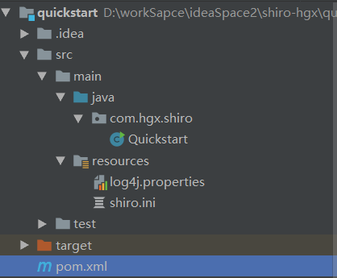
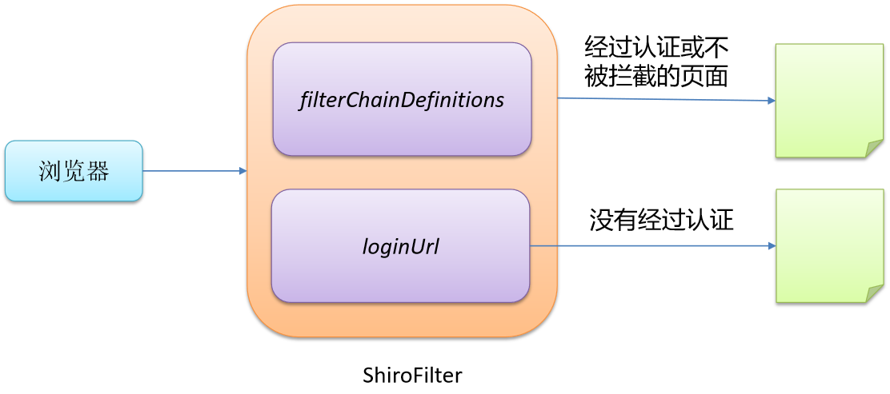
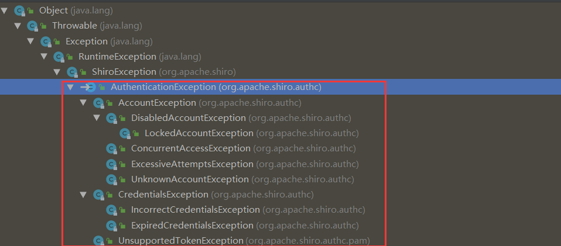
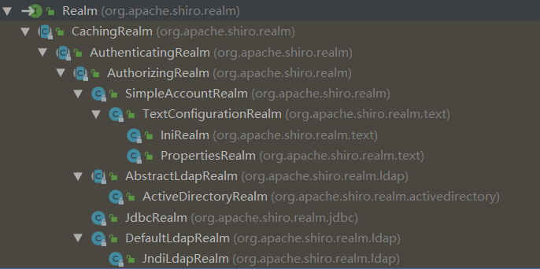
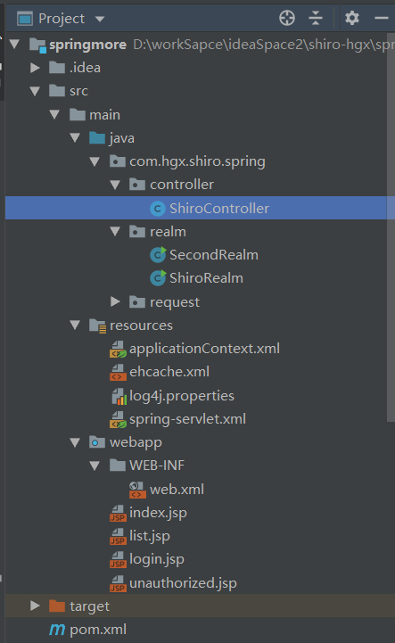
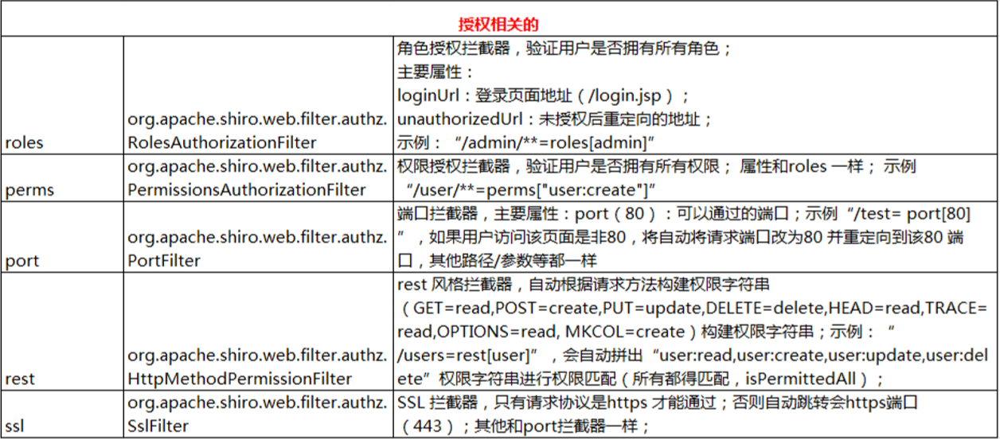
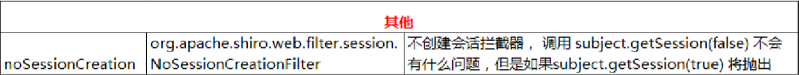
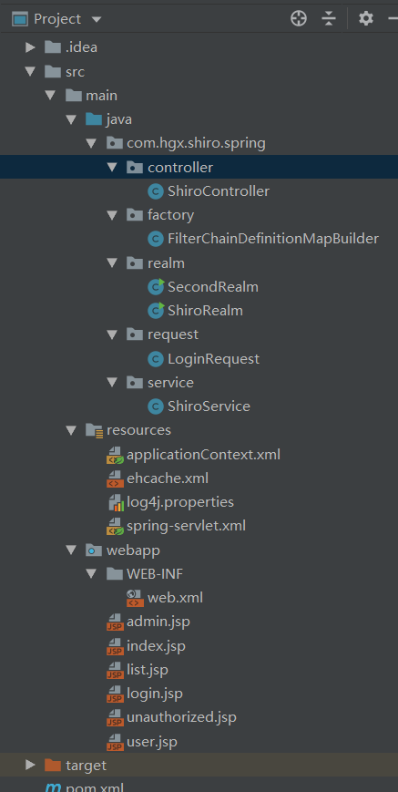
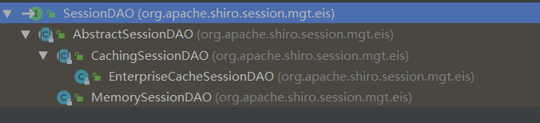

# Shiro

官方文档：http://shiro.apache.org/reference.html

## 一 Shiro 简介

-  Apache Shiro 是 Java  的一个安全（权限）框架。 •
- Shiro 可以非常容易的开发出足够好的应用，其不仅可以用在 JavaSE 环境，也可以用在 JavaEE 环境。 
- Shiro 可以完成：认证、授权、加密、会话管理、与Web 集成、缓存 等。 •
- 下载：http://shiro.apache.org/

### 1.1  [什么是Apache Shiro？](http://shiro.apache.org/introduction.html#what-is-apache-shiro-)

Apache Shiro是一个功能强大且灵活的开源安全框架，可以清晰地处理身份验证，授权，企业会话管理和加密。

Apache Shiro的首要目标是易于使用和理解。安全有时可能非常复杂，甚至是痛苦的，但并非必须如此。框架应尽可能掩盖复杂性，并提供简洁直观的API，以简化开发人员确保其应用程序安全的工作。

以下是Apache Shiro可以做的一些事情：

- 验证用户以验证其身份
- 为用户执行访问控制，例如：
  - 确定是否为用户分配了某个安全角色
  - 确定是否允许用户执行某些操作
- 在任何环境中使用Session API，即使没有Web容器或EJB容器也是如此。
- 在身份验证，访问控制或会话生命周期内对事件做出反应。
- 聚合用户安全数据的1个或多个数据源，并将其全部显示为单个复合用户“视图”。
- 启用单点登录（SSO）功能
- 无需登录即可为用户关联启用“记住我”服务
  ...... 
  以及更多 - 全部集成到一个易于使用的内聚API中。

Shiro尝试为所有应用程序环境实现这些目标 - 从最简单的命令行应用程序到最大的企业应用程序，而不强制依赖其他第三方框架，容器或应用程序服务器。当然，该项目旨在尽可能地融入这些环境，但它可以在任何环境中开箱即用。

### 1.2  [Apache Shiro功能](http://shiro.apache.org/introduction.html#apache-shiro-features)

Apache Shiro是一个具有许多功能的综合应用程序安全框架。


-  Authentication：身份认证/登录，验证用户是不是拥有相应的身份； •
- Authorization：授权，即权限验证，验证某个已认证的用户是否拥有某个权限；即判断用 户是否能进行什么操作，如：验证某个用户是否拥有某个角色。或者细粒度的验证某个用户 对某个资源是否具有某个权限； •
- Session Manager：会话管理，即用户登录后就是一次会话，在没有退出之前，它的所有 信息都在会话中；会话可以是普通 JavaSE 环境，也可以是 Web 环境的； 
- Cryptography：加密，保护数据的安全性，如密码加密存储到数据库，而不是明文存储； 
- Web Support：Web 支持，可以非常容易的集成到Web 环境； 
- Caching：缓存，比如用户登录后，其用户信息、拥有的角色/权限不必每次去查，这样可 以提高效率
- Concurrency：Shiro 支持多线程应用的并发验证，即如在一个线程中开启另一个线程，能把权限自动传播过去； 
- Testing：提供测试支持； • Run As：允许一个用户假装为另一个用户（如果他们允许）的身份进行访问
- Remember Me：记住我，这个是非常常见的功能，即一次登录后，下次再来的话不用登 录了

## 二 Shiro 架构

### 2.1 简单概述

**从外部来看Shiro ，即从应用程序角度的来观察如何使用 Shiro完成工作，Shiro的架构有3个主要概念：`Subject`，`SecurityManager`和`Realms`。**


-  Subject：应用代码直接交互的对象是 Subject，也就是说 Shiro 的对外 API 核心就是 Subject。Subject 代表了当前“用户”， 这个用户不一定 是一个具体的人，与当前应用交互的任何东西都是 Subject，如网络爬虫， 机器人等；与 Subject  的所有交互都会委托给 SecurityManager； Subject 其实是一个门面，SecurityManager 才是实际的执行者；
- SecurityManager：安全管理器；即所有与安全有关的操作都会与 SecurityManager 交互；且其管理着所有 Subject；可以看出它是 Shiro 的核心，它负责与 Shiro 的其他组件进行交互，它相当于 SpringMVC 中 DispatcherServlet 的角色
- Realm：Shiro 从 Realm 获取安全数据（如用户、角色、权限），就是说 SecurityManager 要验证用户身份，那么它需要从 Realm 获取相应的用户 进行比较以确定用户身份是否合法；也需要从 Realm 得到用户相应的角色/ 权限进行验证用户是否能进行操作；可以把 Realm 看成 DataSource

### 2.2 [详细的架构](http://shiro.apache.org/architecture.html#detailed-architecture)


- Subject：任何可以与应用交互的“用户”； 
- SecurityManager ：相当于SpringMVC 中的 DispatcherServlet；是 Shiro 的心脏； 所有具体的交互都通过 SecurityManager 进行控制；它管理着所有 Subject、且负责进 行认证、授权、会话及缓存的管理。 
- Authenticator：认证器，负责 Subject 认证，是一个扩展点，可以自定义实现；可以使用认证 策略（Authentication Strategy），即什么情况下算用户认证通过了； 
- Authorizer：授权器、即访问控制器，用来决定主体是否有权限进行相应的操作；即控 制着用户能访问应用中的哪些功能； 
- Realm：可以有 1 个或多个 Realm，可以认为是安全实体数据源，即用于获取安全实体 的；可以是JDBC 实现，也可以是内存实现等等；由用户提供；所以一般在应用中都需要 实现自己的 Realm； 
- SessionManager：管理 Session 生命周期的组件；而且Shiro 并不仅仅可以用在 Web 环境，也可以用在如普通的 JavaSE 环境 
- CacheManager：缓存控制器，来管理如用户、角色、权限等的缓存的；因为这些数据 基本上很少改变，放到缓存中后可以提高访问的性能 
- Cryptography：密码模块，Shiro 提高了一些常见的加密组件用于如密码加密/解密。

## 三 开始Shiro:Hello World

- 该代码来自官网下载的压缩zip

- 项目结构图



- maven：pom.xml

```xml
<dependencies>
    <!-- https://mvnrepository.com/artifact/org.apache.shiro/shiro-core -->
    <dependency>
        <groupId>org.apache.shiro</groupId>
        <artifactId>shiro-core</artifactId>
        <version>1.4.0</version>
    </dependency>

    <!-- configure logging -->
    <!-- https://mvnrepository.com/artifact/org.slf4j/jcl-over-slf4j -->
    <dependency>
        <groupId>org.slf4j</groupId>
        <artifactId>jcl-over-slf4j</artifactId>
        <version>1.7.25</version>
    </dependency>

    <!-- https://mvnrepository.com/artifact/org.slf4j/slf4j-log4j12 -->
    <dependency>
        <groupId>org.slf4j</groupId>
        <artifactId>slf4j-log4j12</artifactId>
        <version>1.7.25</version>
        <!--<scope>test</scope>-->
    </dependency>

    <!-- https://mvnrepository.com/artifact/log4j/log4j -->
    <dependency>
        <groupId>log4j</groupId>
        <artifactId>log4j</artifactId>
        <version>1.2.17</version>
    </dependency>

    <dependency>
        <groupId>junit</groupId>
        <artifactId>junit</artifactId>
        <version>4.11</version>
        <scope>test</scope>
    </dependency>
</dependencies>
```

- Quickstart.java

```java
import org.apache.shiro.SecurityUtils;
import org.apache.shiro.authc.*;
import org.apache.shiro.config.IniSecurityManagerFactory;
import org.apache.shiro.mgt.SecurityManager;
import org.apache.shiro.session.Session;
import org.apache.shiro.subject.Subject;
import org.apache.shiro.util.Factory;
import org.slf4j.Logger;
import org.slf4j.LoggerFactory;


/**
 * Simple Quickstart application showing how to use Shiro's API.
 *
 * @since 0.9 RC2
 */
public class Quickstart {

    private static final transient Logger log = LoggerFactory.getLogger(Quickstart.class);

    public static void main(String[] args) {

        // The easiest way to create a Shiro SecurityManager with configured
        // realms, users, roles and permissions is to use the simple INI config.
        // We'll do that by using a factory that can ingest a .ini file and
        // return a SecurityManager instance:

        // Use the shiro.ini file at the root of the classpath
        // (file: and url: prefixes load from files and urls respectively):
        Factory<SecurityManager> factory = new IniSecurityManagerFactory("classpath:shiro.ini");
        SecurityManager securityManager = factory.getInstance();

        // for this simple example quickstart, make the SecurityManager
        // accessible as a JVM singleton.  Most applications wouldn't do this
        // and instead rely on their container configuration or web.xml for
        // webapps.  That is outside the scope of this simple quickstart, so
        // we'll just do the bare minimum so you can continue to get a feel
        // for things.
        SecurityUtils.setSecurityManager(securityManager);

        // Now that a simple Shiro environment is set up, let's see what you can do:

        // get the currently executing user:
        // 获取当前的 Subject. 调用 SecurityUtils.getSubject();
        Subject currentUser = SecurityUtils.getSubject();

        // Do some stuff with a Session (no need for a web or EJB container!!!)
        // 测试使用 Session
        // 获取 Session: Subject#getSession()
        Session session = currentUser.getSession();
        session.setAttribute("someKey", "aValue");
        String value = (String) session.getAttribute("someKey");
        if (value.equals("aValue")) {
            log.info("---> Retrieved the correct value! [" + value + "]");
        }

        // let's login the current user so we can check against roles and permissions:
        // 测试当前的用户是否已经被认证. 即是否已经登录.
        // 调动 Subject 的 isAuthenticated()
        if (!currentUser.isAuthenticated()) {
            // 把用户名和密码封装为 UsernamePasswordToken 对象
            UsernamePasswordToken token = new UsernamePasswordToken("lonestarr", "vespa");
            // rememberme
            token.setRememberMe(true);
            try {
                // 执行登录.
                currentUser.login(token);
            }
            // 若没有指定的账户, 则 shiro 将会抛出 UnknownAccountException 异常.
            catch (UnknownAccountException uae) {
                log.info("----> There is no user with username of " + token.getPrincipal());
                return;
            }
            // 若账户存在, 但密码不匹配, 则 shiro 会抛出 IncorrectCredentialsException 异常。
            catch (IncorrectCredentialsException ice) {
                log.info("----> Password for account " + token.getPrincipal() + " was incorrect!");
                return;
            }
            // 用户被锁定的异常 LockedAccountException
            catch (LockedAccountException lae) {
                log.info("The account for username " + token.getPrincipal() + " is locked.  " +
                        "Please contact your administrator to unlock it.");
            }
            // ... catch more exceptions here (maybe custom ones specific to your application?
            // 所有认证时异常的父类.
            catch (AuthenticationException ae) {
                //unexpected condition?  error?
            }
        }

        //say who they are:
        //print their identifying principal (in this case, a username):
        log.info("----> User [" + currentUser.getPrincipal() + "] logged in successfully.");

        //test a role:
        // 测试是否有某一个角色. 调用 Subject 的 hasRole 方法.
        if (currentUser.hasRole("schwartz")) {
            log.info("----> May the Schwartz be with you!");
        } else {
            log.info("----> Hello, mere mortal.");
            return;
        }

        //test a typed permission (not instance-level)
        // 测试用户是否具备某一个行为. 调用 Subject 的 isPermitted() 方法。
        if (currentUser.isPermitted("lightsaber:weild")) {
            log.info("----> You may use a lightsaber ring.  Use it wisely.");
        } else {
            log.info("Sorry, lightsaber rings are for schwartz masters only.");
        }

        //a (very powerful) Instance Level permission:
        // 测试用户是否具备某一个行为.
        if (currentUser.isPermitted("user:delete:zhangsan")) {
            log.info("----> You are permitted to 'drive' the winnebago with license plate (id) 'eagle5'.  " +
                    "Here are the keys - have fun!");
        } else {
            log.info("Sorry, you aren't allowed to drive the 'eagle5' winnebago!");
        }

        //all done - log out!
        // 执行登出. 调用 Subject 的 Logout() 方法.
        System.out.println("---->" + currentUser.isAuthenticated());

        currentUser.logout();

        System.out.println("---->" + currentUser.isAuthenticated());

        System.exit(0);
    }
}
```

- log4j.properties

```properties
#
# Licensed to the Apache Software Foundation (ASF) under one
# or more contributor license agreements.  See the NOTICE file
# distributed with this work for additional information
# regarding copyright ownership.  The ASF licenses this file
# to you under the Apache License, Version 2.0 (the
# "License"); you may not use this file except in compliance
# with the License.  You may obtain a copy of the License at
#
#     http://www.apache.org/licenses/LICENSE-2.0
#
# Unless required by applicable law or agreed to in writing,
# software distributed under the License is distributed on an
# "AS IS" BASIS, WITHOUT WARRANTIES OR CONDITIONS OF ANY
# KIND, either express or implied.  See the License for the
# specific language governing permissions and limitations
# under the License.
#
log4j.rootLogger=INFO, stdout

log4j.appender.stdout=org.apache.log4j.ConsoleAppender
log4j.appender.stdout.layout=org.apache.log4j.PatternLayout
log4j.appender.stdout.layout.ConversionPattern=%d %p [%c] - %m %n

# General Apache libraries
log4j.logger.org.apache=WARN

# Spring
log4j.logger.org.springframework=WARN

# Default Shiro logging
log4j.logger.org.apache.shiro=TRACE

# Disable verbose logging
log4j.logger.org.apache.shiro.util.ThreadContext=WARN
log4j.logger.org.apache.shiro.cache.ehcache.EhCache=WARN
```

- shiro.ini

```ini
#
# Licensed to the Apache Software Foundation (ASF) under one
# or more contributor license agreements.  See the NOTICE file
# distributed with this work for additional information
# regarding copyright ownership.  The ASF licenses this file
# to you under the Apache License, Version 2.0 (the
# "License"); you may not use this file except in compliance
# with the License.  You may obtain a copy of the License at
#
#     http://www.apache.org/licenses/LICENSE-2.0
#
# Unless required by applicable law or agreed to in writing,
# software distributed under the License is distributed on an
# "AS IS" BASIS, WITHOUT WARRANTIES OR CONDITIONS OF ANY
# KIND, either express or implied.  See the License for the
# specific language governing permissions and limitations
# under the License.
#
# =============================================================================
# Quickstart INI Realm configuration
#
# For those that might not understand the references in this file, the
# definitions are all based on the classic Mel Brooks' film "Spaceballs". ;)
# =============================================================================

# -----------------------------------------------------------------------------
# Users and their assigned roles
#
# Each line conforms to the format defined in the
# org.apache.shiro.realm.text.TextConfigurationRealm#setUserDefinitions JavaDoc
# -----------------------------------------------------------------------------
[users]
# user 'root' with password 'secret' and the 'admin' role
root = secret, admin
# user 'guest' with the password 'guest' and the 'guest' role
guest = guest, guest
# user 'presidentskroob' with password '12345' ("That's the same combination on
# my luggage!!!" ;)), and role 'president'
presidentskroob = 12345, president
# user 'darkhelmet' with password 'ludicrousspeed' and roles 'darklord' and 'schwartz'
darkhelmet = ludicrousspeed, darklord, schwartz
# user 'lonestarr' with password 'vespa' and roles 'goodguy' and 'schwartz'
lonestarr = vespa, goodguy, schwartz

# -----------------------------------------------------------------------------
# Roles with assigned permissions
# 
# Each line conforms to the format defined in the
# org.apache.shiro.realm.text.TextConfigurationRealm#setRoleDefinitions JavaDoc
# -----------------------------------------------------------------------------
[roles]
# 'admin' role has all permissions, indicated by the wildcard '*'
admin = *
# The 'schwartz' role can do anything (*) with any lightsaber:
schwartz = lightsaber:*
# The 'goodguy' role is allowed to 'drive' (action) the winnebago (type) with
# license plate 'eagle5' (instance specific id)
goodguy = winnebago:drive:eagle5
```


## 四 集成 Spring

### 4.1 框架基本整合

- maven依赖：pom.xml

```xml
<!-- 依赖的jar包 -->
<dependencies>
    <!-- https://mvnrepository.com/artifact/org.apache.shiro/shiro-spring -->
    <dependency>
        <groupId>org.apache.shiro</groupId>
        <artifactId>shiro-spring</artifactId>
        <version>1.4.0</version>
    </dependency>
    <!-- https://mvnrepository.com/artifact/org.apache.shiro/shiro-ehcache -->
    <dependency>
        <groupId>org.apache.shiro</groupId>
        <artifactId>shiro-ehcache</artifactId>
        <version>1.4.0</version>
    </dependency>

    <!-- https://mvnrepository.com/artifact/net.sf.ehcache/ehcache-core -->
    <dependency>
        <groupId>net.sf.ehcache</groupId>
        <artifactId>ehcache-core</artifactId>
        <version>2.6.11</version>
    </dependency>

    <!-- configure logging -->
    <!-- https://mvnrepository.com/artifact/org.slf4j/jcl-over-slf4j -->
    <dependency>
        <groupId>org.slf4j</groupId>
        <artifactId>jcl-over-slf4j</artifactId>
        <version>1.7.25</version>
    </dependency>

    <!-- https://mvnrepository.com/artifact/org.slf4j/slf4j-log4j12 -->
    <dependency>
        <groupId>org.slf4j</groupId>
        <artifactId>slf4j-log4j12</artifactId>
        <version>1.7.25</version>
        <!--<scope>test</scope>-->
    </dependency>

    <!-- https://mvnrepository.com/artifact/log4j/log4j -->
    <dependency>
        <groupId>log4j</groupId>
        <artifactId>log4j</artifactId>
        <version>1.2.17</version>
    </dependency>

    <!-- https://mvnrepository.com/artifact/org.springframework/spring-context -->
    <dependency>
        <groupId>org.springframework</groupId>
        <artifactId>spring-context</artifactId>
        <version>5.1.4.RELEASE</version>
    </dependency>
    <!-- https://mvnrepository.com/artifact/org.springframework/spring-web -->
    <dependency>
        <groupId>org.springframework</groupId>
        <artifactId>spring-web</artifactId>
        <version>5.1.4.RELEASE</version>
    </dependency>
    <!-- https://mvnrepository.com/artifact/org.springframework/spring-webmvc -->
    <dependency>
        <groupId>org.springframework</groupId>
        <artifactId>spring-webmvc</artifactId>
        <version>5.1.4.RELEASE</version>
    </dependency>

    <dependency>
        <groupId>junit</groupId>
        <artifactId>junit</artifactId>
        <version>4.11</version>
        <scope>test</scope>
    </dependency>
</dependencies>
```

- web.xml

```xml
<?xml version="1.0" encoding="UTF-8"?>
<web-app xmlns="http://xmlns.jcp.org/xml/ns/javaee"
         xmlns:xsi="http://www.w3.org/2001/XMLSchema-instance"
         xsi:schemaLocation="http://xmlns.jcp.org/xml/ns/javaee http://xmlns.jcp.org/xml/ns/javaee/web-app_3_1.xsd"
         version="3.1">

    <!-- 配置 Spring 配置文件的名称和位置 -->
    <context-param>
        <param-name>contextConfigLocation</param-name>
        <param-value>classpath:applicationContext.xml</param-value>
    </context-param>

    <!-- Bootstraps the root web application context before servlet initialization -->
    <listener>
        <listener-class>org.springframework.web.context.ContextLoaderListener</listener-class>
    </listener>


    <!-- 启动 IOC 容器的 ServletContextListener -->
    <servlet>
        <servlet-name>springMVC</servlet-name>
        <servlet-class>org.springframework.web.servlet.DispatcherServlet</servlet-class>
        <init-param>
            <param-name>contextConfigLocation</param-name>
            <param-value>classpath:spring-servlet.xml</param-value>
        </init-param>
        <load-on-startup>1</load-on-startup>
    </servlet>

    <!-- Map all requests to the DispatcherServlet for handling -->
    <servlet-mapping>
        <servlet-name>springMVC</servlet-name>
        <url-pattern>/</url-pattern>
    </servlet-mapping>


    <!-- ==================================================================
         Filters
         ================================================================== -->
    <!-- Shiro Filter is defined in the spring application context: -->

    <!-- Shiro Filter is defined in the spring application context: -->
    <!--
    1. 配置  Shiro 的 shiroFilter.
    2. DelegatingFilterProxy 实际上是 Filter 的一个代理对象. 默认情况下, Spring 会到 IOC 容器中查找和
    <filter-name> 对应的 filter bean. 也可以通过 targetBeanName 的初始化参数来配置 filter bean 的 id.
    -->
    <filter>
        <filter-name>shiroFilter</filter-name>
        <filter-class>org.springframework.web.filter.DelegatingFilterProxy</filter-class>
        <init-param>
            <param-name>targetFilterLifecycle</param-name>
            <param-value>true</param-value>
        </init-param>
    </filter>

    <filter-mapping>
        <filter-name>shiroFilter</filter-name>
        <url-pattern>/*</url-pattern>
    </filter-mapping>

</web-app>
```

- spring配置文件：applicationContext.xml

```xml
<?xml version="1.0" encoding="UTF-8"?>
<beans xmlns="http://www.springframework.org/schema/beans"
       xmlns:xsi="http://www.w3.org/2001/XMLSchema-instance"
       xsi:schemaLocation="http://www.springframework.org/schema/beans http://www.springframework.org/schema/beans/spring-beans.xsd">

    <!-- =========================================================
         Shiro Core Components - Not Spring Specific
         ========================================================= -->
    <!-- Shiro's main business-tier object for web-enabled applications
         (use DefaultSecurityManager instead when there is no web environment)-->
    <!--
    1. 配置 SecurityManager!
    -->
    <bean id="securityManager" class="org.apache.shiro.web.mgt.DefaultWebSecurityManager">
        <property name="cacheManager" ref="cacheManager"/>
        <property name="realm" ref="jdbcRealm"></property>
    </bean>

    <!-- Let's use some enterprise caching support for better performance.  You can replace this with any enterprise
         caching framework implementation that you like (Terracotta+Ehcache, Coherence, GigaSpaces, etc -->
    <!--
    2. 配置 CacheManager.
    2.1 需要加入 ehcache 的 jar 包及配置文件.
    -->
    <bean id="cacheManager" class="org.apache.shiro.cache.ehcache.EhCacheManager">
        <!-- Set a net.sf.ehcache.CacheManager instance here if you already have one.  If not, a new one
             will be creaed with a default config:
             <property name="cacheManager" ref="ehCacheManager"/> -->
        <!-- If you don't have a pre-built net.sf.ehcache.CacheManager instance to inject, but you want
             a specific Ehcache configuration to be used, specify that here.  If you don't, a default
             will be used.: -->
        <property name="cacheManagerConfigFile" value="classpath:ehcache.xml"/>
    </bean>

    <bean id="authenticator"
          class="org.apache.shiro.authc.pam.ModularRealmAuthenticator">
        <property name="authenticationStrategy">
            <bean class="org.apache.shiro.authc.pam.AtLeastOneSuccessfulStrategy"></bean>
        </property>
    </bean>

    <!-- Used by the SecurityManager to access security data (users, roles, etc).
         Many other realm implementations can be used too (PropertiesRealm,
         LdapRealm, etc. -->
    <!--
    	3. 配置 Realm
    	3.1 直接配置实现了 org.apache.shiro.realm.Realm 接口的 bean
    -->
    <bean id="jdbcRealm" class="com.hgx.shiro.spring.ShiroRealm"></bean>

    <!-- =========================================================
         Shiro Spring-specific integration
         ========================================================= -->
    <!-- Post processor that automatically invokes init() and destroy() methods
         for Spring-configured Shiro objects so you don't have to
         1) specify an init-method and destroy-method attributes for every bean
            definition and
         2) even know which Shiro objects require these methods to be
            called. -->
    <!--
    4. 配置 LifecycleBeanPostProcessor. 可以自定的来调用配置在 Spring IOC 容器中 shiro bean 的生命周期方法.
    -->
    <bean id="lifecycleBeanPostProcessor" class="org.apache.shiro.spring.LifecycleBeanPostProcessor"/>

    <!-- Enable Shiro Annotations for Spring-configured beans.  Only run after
         the lifecycleBeanProcessor has run: -->
    <!--
    5. 启用 IOC 容器中使用 shiro 的注解. 但必须在配置了 LifecycleBeanPostProcessor 之后才可以使用.
    -->
    <bean class="org.springframework.aop.framework.autoproxy.DefaultAdvisorAutoProxyCreator"
          depends-on="lifecycleBeanPostProcessor"/>
    <bean class="org.apache.shiro.spring.security.interceptor.AuthorizationAttributeSourceAdvisor">
        <property name="securityManager" ref="securityManager"/>
    </bean>

    <!-- Define the Shiro Filter here (as a FactoryBean) instead of directly in web.xml -
         web.xml uses the DelegatingFilterProxy to access this bean.  This allows us
         to wire things with more control as well utilize nice Spring things such as
         PropertiesPlaceholderConfigurer and abstract beans or anything else we might need: -->
    <!--
    6. 配置 ShiroFilter.
    6.1 id 必须和 web.xml 文件中配置的 DelegatingFilterProxy 的 <filter-name> 一致.若不一致, 则会抛出: NoSuchBeanDefinitionException. 因为 Shiro 会来 IOC 容器中查找和 <filter-name> 名字对应的 filter bean.
    -->
    <bean id="shiroFilter" class="org.apache.shiro.spring.web.ShiroFilterFactoryBean">
        <property name="securityManager" ref="securityManager"/>
        <property name="loginUrl" value="/login.jsp"/>
        <property name="successUrl" value="/list.jsp"/>
        <property name="unauthorizedUrl" value="/unauthorized.jsp"/>
        <!--
        	配置哪些页面需要受保护.
        	以及访问这些页面需要的权限.
        	1). anon 可以被匿名访问
        	2). authc 必须认证(即登录)后才可能访问的页面.
        	3). logout 登出.
        	4). roles 角色过滤器
        -->
        <property name="filterChainDefinitions">
            <value>
                /login.jsp = anon
                # everything else requires authentication:
                /** = authc
            </value>
        </property>
    </bean>
</beans>
```

- 缓存配置：ehcache.xml

```xml
<!--
  ~ Licensed to the Apache Software Foundation (ASF) under one
  ~ or more contributor license agreements.  See the NOTICE file
  ~ distributed with this work for additional information
  ~ regarding copyright ownership.  The ASF licenses this file
  ~ to you under the Apache License, Version 2.0 (the
  ~ "License"); you may not use this file except in compliance
  ~ with the License.  You may obtain a copy of the License at
  ~
  ~     http://www.apache.org/licenses/LICENSE-2.0
  ~
  ~ Unless required by applicable law or agreed to in writing,
  ~ software distributed under the License is distributed on an
  ~ "AS IS" BASIS, WITHOUT WARRANTIES OR CONDITIONS OF ANY
  ~ KIND, either express or implied.  See the License for the
  ~ specific language governing permissions and limitations
  ~ under the License.
  -->

<!-- EhCache XML configuration file used for Shiro spring sample application -->
<ehcache>

    <!-- Sets the path to the directory where cache .data files are created.

If the path is a Java System Property it is replaced by
its value in the running VM.

The following properties are translated:
user.home - User's home directory
user.dir - User's current working directory
java.io.tmpdir - Default temp file path -->
    <diskStore path="java.io.tmpdir/shiro-spring-sample"/>


    <!--Default Cache configuration. These will applied to caches programmatically created through
    the CacheManager.

    The following attributes are required:

    maxElementsInMemory            - Sets the maximum number of objects that will be created in memory
    eternal                        - Sets whether elements are eternal. If eternal,  timeouts are ignored and the
                                     element is never expired.
    overflowToDisk                 - Sets whether elements can overflow to disk when the in-memory cache
                                     has reached the maxInMemory limit.

    The following attributes are optional:
    timeToIdleSeconds              - Sets the time to idle for an element before it expires.
                                     i.e. The maximum amount of time between accesses before an element expires
                                     Is only used if the element is not eternal.
                                     Optional attribute. A value of 0 means that an Element can idle for infinity.
                                     The default value is 0.
    timeToLiveSeconds              - Sets the time to live for an element before it expires.
                                     i.e. The maximum time between creation time and when an element expires.
                                     Is only used if the element is not eternal.
                                     Optional attribute. A value of 0 means that and Element can live for infinity.
                                     The default value is 0.
    diskPersistent                 - Whether the disk store persists between restarts of the Virtual Machine.
                                     The default value is false.
    diskExpiryThreadIntervalSeconds- The number of seconds between runs of the disk expiry thread. The default value
                                     is 120 seconds.
    memoryStoreEvictionPolicy      - Policy would be enforced upon reaching the maxElementsInMemory limit. Default
                                     policy is Least Recently Used (specified as LRU). Other policies available -
                                     First In First Out (specified as FIFO) and Less Frequently Used
                                     (specified as LFU)
    -->

    <defaultCache
            maxElementsInMemory="10000"
            eternal="false"
            timeToIdleSeconds="120"
            timeToLiveSeconds="120"
            overflowToDisk="false"
            diskPersistent="false"
            diskExpiryThreadIntervalSeconds="120"
            />

    <!-- We want eternal="true" (with no timeToIdle or timeToLive settings) because Shiro manages session
expirations explicitly.  If we set it to false and then set corresponding timeToIdle and timeToLive properties,
ehcache would evict sessions without Shiro's knowledge, which would cause many problems
(e.g. "My Shiro session timeout is 30 minutes - why isn't a session available after 2 minutes?"
Answer - ehcache expired it due to the timeToIdle property set to 120 seconds.)

diskPersistent=true since we want an enterprise session management feature - ability to use sessions after
even after a JVM restart.  -->
    <cache name="shiro-activeSessionCache"
           maxElementsInMemory="10000"
           eternal="true"
           overflowToDisk="true"
           diskPersistent="true"
           diskExpiryThreadIntervalSeconds="600"/>

    <cache name="org.apache.shiro.realm.SimpleAccountRealm.authorization"
           maxElementsInMemory="100"
           eternal="false"
           timeToLiveSeconds="600"
           overflowToDisk="false"/>

</ehcache>
```

- 日志log4j配置：log4j.properties

```properties
#
# Licensed to the Apache Software Foundation (ASF) under one
# or more contributor license agreements.  See the NOTICE file
# distributed with this work for additional information
# regarding copyright ownership.  The ASF licenses this file
# to you under the Apache License, Version 2.0 (the
# "License"); you may not use this file except in compliance
# with the License.  You may obtain a copy of the License at
#
#     http://www.apache.org/licenses/LICENSE-2.0
#
# Unless required by applicable law or agreed to in writing,
# software distributed under the License is distributed on an
# "AS IS" BASIS, WITHOUT WARRANTIES OR CONDITIONS OF ANY
# KIND, either express or implied.  See the License for the
# specific language governing permissions and limitations
# under the License.
#
log4j.rootLogger=INFO, stdout

log4j.appender.stdout=org.apache.log4j.ConsoleAppender
log4j.appender.stdout.layout=org.apache.log4j.PatternLayout
log4j.appender.stdout.layout.ConversionPattern=%d %p [%c] - %m %n

# General Apache libraries
log4j.logger.org.apache=WARN

# Spring
log4j.logger.org.springframework=WARN

# Default Shiro logging
log4j.logger.org.apache.shiro=TRACE

# Disable verbose logging
log4j.logger.org.apache.shiro.util.ThreadContext=WARN
log4j.logger.org.apache.shiro.cache.ehcache.EhCache=WARN
```

- spring-servlet.xml

```xml
<?xml version="1.0" encoding="UTF-8"?>
<beans xmlns="http://www.springframework.org/schema/beans"
       xmlns:xsi="http://www.w3.org/2001/XMLSchema-instance"
       xmlns:context="http://www.springframework.org/schema/context"
       xmlns:mvc="http://www.springframework.org/schema/mvc"
       xsi:schemaLocation="http://www.springframework.org/schema/beans http://www.springframework.org/schema/beans/spring-beans.xsd http://www.springframework.org/schema/context http://www.springframework.org/schema/context/spring-context.xsd http://www.springframework.org/schema/mvc http://www.springframework.org/schema/mvc/spring-mvc.xsd">

    <context:component-scan base-package="com.hgx.shiro.spring"></context:component-scan>

    <bean class="org.springframework.web.servlet.view.InternalResourceViewResolver">
        <property name="prefix" value="/"></property>
        <property name="suffix" value=".jsp"></property>
    </bean>
    
    <mvc:annotation-driven></mvc:annotation-driven>
    <mvc:default-servlet-handler/>
    
</beans>
```

- ShiroRealm.java

```java
import org.apache.shiro.authc.AuthenticationException;
import org.apache.shiro.authc.AuthenticationInfo;
import org.apache.shiro.authc.AuthenticationToken;
import org.apache.shiro.realm.Realm;

public class ShiroRealm implements Realm {
    @Override
    public String getName() {
        return null;
    }

    @Override
    public boolean supports(AuthenticationToken authenticationToken) {
        return false;
    }

    @Override
    public AuthenticationInfo getAuthenticationInfo(AuthenticationToken authenticationToken) throws AuthenticationException {
        return null;
    }
}

```

- xxx.jsp 页面: 对应上面的配置需要写三个jsp页面(list.jsp,login.jsp,unauthorized.jsp)

```jsp
<html>
<body>
<h2>Unauthorized page</h2>
</body>
</html>
```


**到此项目已经跑起来了，哒哒哒**


### 4.2  ShiroFilter

#### 4.2.1 与Web 集成 

- Shiro 提供了与 Web 集成的支持，其通过一个 ShiroFilter 入口来拦截需要安全控制的URL，然后 进行相应的控制
- ShiroFilter 类似于如 Strut2/SpringMVC 这种 web 框架的前端控制器，是安全控制的入口点，其 负责读取配置（如ini 配置文件），然后判断URL 是否需要登录/权限等工作。

#### 4.2.2 ShiroFilter 的工作原理



#### 4.2.3 web.xml 中shiroFilter的DelegatingFilterProxy  

- DelegatingFilterProxy 作用是自动到 Spring 容器查找名 字为 shiroFilter（filter-name）的 bean 并把所有 Filter 的操作委托给它。

```xml
<!--
    1. 配置  Shiro 的 shiroFilter.
    2. DelegatingFilterProxy 实际上是 Filter 的一个代理对象. 默认情况下, Spring 会到 IOC 容器中查找和
    <filter-name> 对应的 filter bean. 也可以通过 targetBeanName 的初始化参数来配置 filter bean 的 id.
-->
<filter>
    <filter-name>shiroFilter</filter-name>
    <filter-class>org.springframework.web.filter.DelegatingFilterProxy</filter-class>
    <init-param>
        <param-name>targetFilterLifecycle</param-name>
        <param-value>true</param-value>
    </init-param>
</filter>

<filter-mapping>
    <filter-name>shiroFilter</filter-name>
    <url-pattern>/*</url-pattern>
</filter-mapping>
```

#### 4.2.4 spring配置中shiroFilter的filterChainDefinitions

```xml
<property name="filterChainDefinitions">
    <value>
        /login.jsp = anon
        # everything else requires authentication:
        /** = authc
    </value>
</property>
```

##### 4.2.4.1 细节 

-  [urls] 部分的配置，其格式是： “url=拦截器[参数]，拦截 器[参数]”
- 如果当前请求的 url 匹配 [urls] 部分的某个 url 模式，将会 执行其配置的拦截器。 
- anon（anonymous） 拦截器表示匿名访问（即不需要登 录即可访问） 
- authc （authentication）拦截器表示需要身份认证通过后 才能访问

### 4.3 shiro中默认的过滤器

|    过滤器名称     |                           过滤器类                           | 描述                                                         | 例子                                                         |
| :---------------: | :----------------------------------------------------------: | :----------------------------------------------------------- | :----------------------------------------------------------- |
|       anon        |      org.apache.shiro.web.filter.authc.AnonymousFilter       | 没有参数，表示可以匿名访问                                   | /admins/**=anon                                              |
|       authc       |  org.apache.shiro.web.filter.authc.FormAuthenticationFilter  | 没有参数，表示需要认证(登录)才能使用                         | /user/**=authc                                               |
|    authcBasic     | org.apache.shiro.web.filter.authc.BasicHttpAuthenticationFilter | 没有参数，表示需要通过httpBasic验证，如果不通过，跳转到登陆页面 | /user/**=authcBasic                                          |
|      logout       |        org.apache.shiro.web.filter.authc.LogoutFilter        | 注销登陆的时候，完成一定的功能：任何现有的Session都将失效，而且任何身份都将回失去关联（在web应用程序中，RememberMe cookie 也将被删除） |                                                              |
| noSessionCreation | org.apache.shiro.web.filter.session.NoSessionCreationFilter  | 阻止在请求期间创建新的会话。以保证无状态的体验               |                                                              |
|       perms       | org.apache.shiro.web.filter.authz.PermissionsAuthorizationFilter | 参数可以写多个，多个时必须加上引号，并且在参数之间用逗号分隔。当有多个参数时必须每个参数都通过才能通过，相当于isPermitedAll() | `/admins/**=perms[user:*]`,`/admins/**=perms["user:add:*,user:modify:*"]` |
|       port        |         org.apache.shiro.web.filter.authz.PortFilter         | 指定请求访问端口。如果不匹配则跳转到登录页面                 | /admins/**=port[8081]                                        |
|       rest        | org.apache.shiro.web.filter.authz.HttpMethodPermissionFilter | 根据请求的方法                                               | admins/user/**=perms[user.method]，其中method为post，get，delete等 |
|       roles       |  org.apache.shiro.web.filter.authz.RolesAuthorizationFilter  | 角色过滤器,判断当前用户是否指定角色。参数可以写多个，多个时必须加上引号，并且参数之间用逗号分隔，当有多个参数,每个参数通过才算通过，相当于hasAllRoles() | admins/**=roles["admin,guest"]                               |
|        ssl        |         org.apache.shiro.web.filter.authz.SslFilter          | 没有参数，表示安全的url请求，协议为https                     |                                                              |
|       user        |         org.apache.shiro.web.filter.authc.UserFilter         | 没有参数表示必须存在用户                                     |                                                              |

### 4.4 URL 匹配

#### 4.4.1 URL 匹配模式

- url 模式使用 Ant 风格模式 
- Ant 路径通配符支持 ?、*、**，注意通配符匹配不 包括目录分隔符“/” 
  - `?`：匹配一个字符，如 /admin? 将匹配 /admin1，但不 匹配 /admin 或 /admin/； 
  - `*`：匹配零个或多个字符串，如 /admin 将匹配 /admin、 /admin123，但不匹配 /admin/1； 
  - `**`：匹配路径中的零个或多个路径，如 /admin/** 将匹 配 /admin/a 或 /admin/a/b

#### 4.4.2 URL 匹配顺序

**URL 权限采取第一次匹配优先的方式，即从头开始 使用第一个匹配的 url 模式对应的拦截器链。** 

- 如：

```json
/bb/**=filter1 
/bb/aa=filter2 
/**=filter3
```

- 如果请求的url是“/bb/aa”，因为按照声明顺序进行匹 配，那么将使用 filter1 进行拦截。

## 五 shiro认证

**官方文档**：http://shiro.apache.org/authentication.html

### 5.1 身份认证

- 身份验证：一般需要提供如身份 ID 等一些标识信息来表明登录者的身 份，如提供 email，用户名/密码来证明。 
- 在 shiro 中，用户需要提供 principals （身份）和 credentials（证 明）给 shiro，从而应用能验证用户身份： 
- principals：身份，即主体的标识属性，可以是任何属性，如用户名、 邮箱等，唯一即可。一个主体可以有多个 principals，但只有一个 Primary principals，一般是用户名/邮箱/手机号。 
- credentials：证明/凭证，即只有主体知道的安全值，如密码/数字证 书等。 
- 最常见的 principals 和 credentials 组合就是用户名/密码了

### 5.2 身份验证基本流程

- 1、收集用户身份/凭证，即如用户名/密码
- 2、调用Subject.login进行登录，如果失败将得到相应 的 AuthenticationException 异常，根据异常提示用户错误信息；否则登录成功 
- 3、创建自定义的Realm类，继承org.apache.shiro.realm.AuthorizingRealm类，实现doGetAuthenticationInfo()方法

### 5.3 身份验证示例

#### 5.3.1 代码片段

```java
// 调动 Subject 的 isAuthenticated()，检测当前用户是否被认证
if (!currentUser.isAuthenticated()) {
    // 把用户名和密码封装为 UsernamePasswordToken 对象
    UsernamePasswordToken token = new UsernamePasswordToken("lonestarr", "vespa");
    // rememberme
    token.setRememberMe(true);
    try {
        // 执行登录.
        currentUser.login(token);
    }
    // 若没有指定的账户, 则 shiro 将会抛出 UnknownAccountException 异常.
    catch (UnknownAccountException uae) {
        log.info("----> There is no user with username of " + token.getPrincipal());
        return;
    }
    // 若账户存在, 但密码不匹配, 则 shiro 会抛出 IncorrectCredentialsException 异常。
    catch (IncorrectCredentialsException ice) {
        log.info("----> Password for account " + token.getPrincipal() + " was incorrect!");
        return;
    }
    // 用户被锁定的异常 LockedAccountException
    catch (LockedAccountException lae) {
        log.info("The account for username " + token.getPrincipal() + " is locked.  " +
                 "Please contact your administrator to unlock it.");
    }
    // ... catch more exceptions here (maybe custom ones specific to your application?
    // 所有认证时异常的父类.
    catch (AuthenticationException ae) {
        //unexpected condition?  error?
    }
}
```

#### 5.3.1 AuthenticationException

- 如果身份验证失败请捕获 AuthenticationException 或其子类 
- 最好使用如“用户名/密码错误”而不是“用户名错误”/“密码错误”， 防止一些恶意用户非法扫描帐号库



### 5.4 认证流程


**身份认证流程** 

-  1、首先调用 Subject.login(token) 进行登录，其会自动委托给 SecurityManager 
- 2、SecurityManager 负责真正的身份验证逻辑；它会委托给 Authenticator 进行身份验证； 
- 3、Authenticator 才是真正的身份验证者，Shiro API 中核心的身份 认证入口点，此处可以自定义插入自己的实现； 
- 4、Authenticator 可能会委托给相应的 AuthenticationStrategy 进 行多 Realm 身份验证，默认 ModularRealmAuthenticator 会调用 AuthenticationStrategy 进行多 Realm 身份验证； 
- 5、Authenticator 会把相应的 token 传入 Realm，从 Realm 获取 身份验证信息，如果没有返回/抛出异常表示身份验证失败了。此处 可以配置多个Realm，将按照相应的顺序及策略进行访问。

### 5.5 Realm

- Realm：Shiro 从 Realm 获取安全数据（如用户、角色、 权限），即 SecurityManager 要验证用户身份，那么它需 要从 Realm 获取相应的用户进行比较以确定用户身份是否 合法；也需要从Realm得到用户相应的角色/权限进行验证 用户是否能进行操作 
- Realm接口如下：

```java
//返回一个唯一的Realm名字
String getName();
//判断次此Realm是否支持此token
boolean supports(AuthenticationToken token);
//根据token获取获取认证信息
AuthenticationInfo getAuthenticationInfo(AuthenticationToken token) throws AuthenticationException;
```

-  一般继承 AuthorizingRealm（授权）即可；其继承了 AuthenticatingRealm（即身份验证），而且也间接继承了 CachingRealm（带有缓存实现）。 
-  Realm 的继承关系：



### 5.6 Authenticator

-  Authenticator 的职责是验证用户帐号，是 Shiro API 中身份验证核心的入口点：如果验证成功，将返回AuthenticationInfo验证信息；此信息中包含了身份及凭证；如果验证失败将抛出相应的AuthenticationException异常 
- SecurityManager接口继承了Authenticator，另外还有一个ModularRealmAuthenticator实现，其委托给多个Realm 进行 验证，验证规则通过 AuthenticationStrategy 接口指定

### 5.7 AuthenticationStrategy

**AuthenticationStrategy 接口的默认实现**： 

- FirstSuccessfulStrategy：只要有一个 Realm 验证成功即可，只返回第 一个 Realm 身份验证成功的认证信息，其他的忽略； 
- AtLeastOneSuccessfulStrategy：只要有一个Realm验证成功即可，和 FirstSuccessfulStrategy 不同，将返回所有Realm身份验证成功的认证信 息； 
- AllSuccessfulStrategy：所有Realm验证成功才算成功，且返回所有 Realm身份验证成功的认证信息，如果有一个失败就失败了。 
- ModularRealmAuthenticator 默认是 AtLeastOneSuccessfulStrategy 策略

### 5.8 代码示例

- 项目结构



- maven依赖pom.xml

```xml
<!-- https://mvnrepository.com/artifact/org.apache.shiro/shiro-spring -->
<dependency>
    <groupId>org.apache.shiro</groupId>
    <artifactId>shiro-spring</artifactId>
    <version>1.4.0</version>
</dependency>
<!-- https://mvnrepository.com/artifact/org.apache.shiro/shiro-ehcache -->
<dependency>
    <groupId>org.apache.shiro</groupId>
    <artifactId>shiro-ehcache</artifactId>
    <version>1.4.0</version>
</dependency>

<!-- https://mvnrepository.com/artifact/net.sf.ehcache/ehcache-core -->
<dependency>
    <groupId>net.sf.ehcache</groupId>
    <artifactId>ehcache-core</artifactId>
    <version>2.6.11</version>
</dependency>

<!-- configure logging -->
<!-- https://mvnrepository.com/artifact/org.slf4j/jcl-over-slf4j -->
<dependency>
    <groupId>org.slf4j</groupId>
    <artifactId>jcl-over-slf4j</artifactId>
    <version>1.7.25</version>
</dependency>

<!-- https://mvnrepository.com/artifact/org.slf4j/slf4j-log4j12 -->
<dependency>
    <groupId>org.slf4j</groupId>
    <artifactId>slf4j-log4j12</artifactId>
    <version>1.7.25</version>
    <!--<scope>test</scope>-->
</dependency>

<!-- https://mvnrepository.com/artifact/log4j/log4j -->
<dependency>
    <groupId>log4j</groupId>
    <artifactId>log4j</artifactId>
    <version>1.2.17</version>
</dependency>

<!-- https://mvnrepository.com/artifact/org.springframework/spring-context -->
<dependency>
    <groupId>org.springframework</groupId>
    <artifactId>spring-context</artifactId>
    <version>5.1.4.RELEASE</version>
</dependency>
<!-- https://mvnrepository.com/artifact/org.springframework/spring-web -->
<dependency>
    <groupId>org.springframework</groupId>
    <artifactId>spring-web</artifactId>
    <version>5.1.4.RELEASE</version>
</dependency>
<!-- https://mvnrepository.com/artifact/org.springframework/spring-webmvc -->
<dependency>
    <groupId>org.springframework</groupId>
    <artifactId>spring-webmvc</artifactId>
    <version>5.1.4.RELEASE</version>
</dependency>
<!-- https://mvnrepository.com/artifact/com.fasterxml.jackson.core/jackson-databind -->
<dependency>
    <groupId>com.fasterxml.jackson.core</groupId>
    <artifactId>jackson-databind</artifactId>
    <version>2.9.8</version>
</dependency>
```

- spring配置：applicationContext.xml

```xml
<?xml version="1.0" encoding="UTF-8"?>
<beans xmlns="http://www.springframework.org/schema/beans"
       xmlns:xsi="http://www.w3.org/2001/XMLSchema-instance"
       xsi:schemaLocation="http://www.springframework.org/schema/beans http://www.springframework.org/schema/beans/spring-beans.xsd">

    <!--
    1. 配置 SecurityManager!
    -->
    <bean id="securityManager" class="org.apache.shiro.web.mgt.DefaultWebSecurityManager">
        <property name="cacheManager" ref="cacheManager"/>
        <!--<property name="realm" ref="jdbcRealm"></property>-->
        <property name="authenticator" ref="authenticator"></property>
    </bean>
    
    <!--
    2. 配置 CacheManager.
    2.1 需要加入 ehcache 的 jar 包及配置文件.
    -->
    <bean id="cacheManager" class="org.apache.shiro.cache.ehcache.EhCacheManager">
        <property name="cacheManagerConfigFile" value="classpath:ehcache.xml"/>
    </bean>

    <bean id="authenticator"
          class="org.apache.shiro.authc.pam.ModularRealmAuthenticator">
        <!--认证策略-->
        <property name="authenticationStrategy">
            <bean class="org.apache.shiro.authc.pam.AtLeastOneSuccessfulStrategy"></bean>
        </property>
        <property name="realms">
            <list>
                <ref bean="jdbcRealm"></ref>
                <ref bean="secondRealm"></ref>
            </list>
        </property>
    </bean>

    <!--
    	3. 配置 Realm
    	3.1 直接配置实现了 org.apache.shiro.realm.Realm 接口的 bean
    -->
    <bean id="jdbcRealm" class="com.hgx.shiro.spring.realm.ShiroRealm">
        <property name="credentialsMatcher">
            <bean class="org.apache.shiro.authc.credential.HashedCredentialsMatcher">
                <property name="hashAlgorithmName" value="MD5"></property>
                <property name="hashIterations" value="1024"></property>
            </bean>
        </property>
    </bean>

    <bean id="secondRealm" class="com.hgx.shiro.spring.realm.SecondRealm">
        <property name="credentialsMatcher">
            <bean class="org.apache.shiro.authc.credential.HashedCredentialsMatcher">
                <property name="hashAlgorithmName" value="SHA1"></property>
                <property name="hashIterations" value="1024"></property>
            </bean>
        </property>
    </bean>
    
    <!--
    4. 配置 LifecycleBeanPostProcessor. 可以自定的来调用配置在 Spring IOC 容器中 shiro bean 的生命周期方法.
    -->
    <bean id="lifecycleBeanPostProcessor" class="org.apache.shiro.spring.LifecycleBeanPostProcessor"/>

    <!--5. 启用 IOC 容器中使用 shiro 的注解. 但必须在配置了 LifecycleBeanPostProcessor 之后才可以使用.
    -->
    <bean class="org.springframework.aop.framework.autoproxy.DefaultAdvisorAutoProxyCreator"
          depends-on="lifecycleBeanPostProcessor"/>
    <bean class="org.apache.shiro.spring.security.interceptor.AuthorizationAttributeSourceAdvisor">
        <property name="securityManager" ref="securityManager"/>
    </bean>


    <!--
    6. 配置 ShiroFilter.
    6.1 id 必须和 web.xml 文件中配置的 DelegatingFilterProxy 的 <filter-name> 一致.
                      若不一致, 则会抛出: NoSuchBeanDefinitionException. 因为 Shiro 会来 IOC 容器中查找和 <filter-name> 名字对应的 filter bean.
    -->
    <bean id="shiroFilter" class="org.apache.shiro.spring.web.ShiroFilterFactoryBean">
        <property name="securityManager" ref="securityManager"/>
        <property name="loginUrl" value="/login.jsp"/>
        <property name="successUrl" value="/list.jsp"/>
        <property name="unauthorizedUrl" value="/unauthorized.jsp"/>
        <!--
        	配置哪些页面需要受保护.
        	以及访问这些页面需要的权限.
        	1). anon 可以被匿名访问
        	2). authc 必须认证(即登录)后才可能访问的页面.
        	3). logout 登出.
        	4). roles 角色过滤器
        -->
        <property name="filterChainDefinitions">
            <value>
                /login.jsp = anon
                /shiro/login = anon
                /shiro/logout = logout
                # everything else requires authentication:
                /** = authc
            </value>
        </property>
    </bean>
</beans>
```

- 缓存配置：ehcache.xml

```xml

<ehcache>
    
    <diskStore path="java.io.tmpdir/shiro-spring-sample"/>
    
    <defaultCache
            maxElementsInMemory="10000"
            eternal="false"
            timeToIdleSeconds="120"
            timeToLiveSeconds="120"
            overflowToDisk="false"
            diskPersistent="false"
            diskExpiryThreadIntervalSeconds="120"
            />
    
    <cache name="shiro-activeSessionCache"
           maxElementsInMemory="10000"
           eternal="true"
           overflowToDisk="true"
           diskPersistent="true"
           diskExpiryThreadIntervalSeconds="600"/>

    <cache name="org.apache.shiro.realm.SimpleAccountRealm.authorization"
           maxElementsInMemory="100"
           eternal="false"
           timeToLiveSeconds="600"
           overflowToDisk="false"/>
    
</ehcache>
```

- 日志log4j配置：log4j.properties

```properties
log4j.rootLogger=INFO, stdout

log4j.appender.stdout=org.apache.log4j.ConsoleAppender
log4j.appender.stdout.layout=org.apache.log4j.PatternLayout
log4j.appender.stdout.layout.ConversionPattern=%d %p [%c] - %m %n

# General Apache libraries
log4j.logger.org.apache=WARN

# Spring
log4j.logger.org.springframework=WARN

# Default Shiro logging
log4j.logger.org.apache.shiro=TRACE

# Disable verbose logging
log4j.logger.org.apache.shiro.util.ThreadContext=WARN
log4j.logger.org.apache.shiro.cache.ehcache.EhCache=WARN
```

- spring-servlet.xml

```xml
<?xml version="1.0" encoding="UTF-8"?>
<beans xmlns="http://www.springframework.org/schema/beans"
       xmlns:xsi="http://www.w3.org/2001/XMLSchema-instance"
       xmlns:context="http://www.springframework.org/schema/context"
       xmlns:mvc="http://www.springframework.org/schema/mvc"
       xsi:schemaLocation="http://www.springframework.org/schema/beans http://www.springframework.org/schema/beans/spring-beans.xsd http://www.springframework.org/schema/context http://www.springframework.org/schema/context/spring-context.xsd http://www.springframework.org/schema/mvc http://www.springframework.org/schema/mvc/spring-mvc.xsd">

    <context:component-scan base-package="com.hgx.shiro.spring"></context:component-scan>

    <bean class="org.springframework.web.servlet.view.InternalResourceViewResolver">
        <property name="prefix" value="/"></property>
        <property name="suffix" value=".jsp"></property>
    </bean>

    <mvc:annotation-driven></mvc:annotation-driven>
    <mvc:default-servlet-handler/>
    
</beans>
```

- web.xml

```xml
<?xml version="1.0" encoding="UTF-8"?>
<web-app xmlns="http://xmlns.jcp.org/xml/ns/javaee"
         xmlns:xsi="http://www.w3.org/2001/XMLSchema-instance"
         xsi:schemaLocation="http://xmlns.jcp.org/xml/ns/javaee http://xmlns.jcp.org/xml/ns/javaee/web-app_3_1.xsd"
         version="3.1">

    <context-param>
        <param-name>contextConfigLocation</param-name>
        <param-value>classpath:applicationContext.xml</param-value>
    </context-param>

    <listener>
        <listener-class>org.springframework.web.context.ContextLoaderListener</listener-class>
    </listener>


    <!-- 启动 IOC 容器的 ServletContextListener -->
    <servlet>
        <servlet-name>springMVC</servlet-name>
        <servlet-class>org.springframework.web.servlet.DispatcherServlet</servlet-class>
        <init-param>
            <param-name>contextConfigLocation</param-name>
            <param-value>classpath:spring-servlet.xml</param-value>
        </init-param>
        <load-on-startup>1</load-on-startup>
    </servlet>

    <servlet-mapping>
        <servlet-name>springMVC</servlet-name>
        <url-pattern>/</url-pattern>
    </servlet-mapping>
    
    <!--
    1. 配置  Shiro 的 shiroFilter.
    2. DelegatingFilterProxy 实际上是 Filter 的一个代理对象. 默认情况下, Spring 会到 IOC 容器中查找和
    <filter-name> 对应的 filter bean. 也可以通过 targetBeanName 的初始化参数来配置 filter bean 的 id.
    -->
    <filter>
        <filter-name>shiroFilter</filter-name>
        <filter-class>org.springframework.web.filter.DelegatingFilterProxy</filter-class>
        <init-param>
            <param-name>targetFilterLifecycle</param-name>
            <param-value>true</param-value>
        </init-param>
        <!--<init-param>-->
            <!--<param-name>targetBeanName</param-name>-->
            <!--<param-value>shiroFilter</param-value>-->
        <!--</init-param>-->
    </filter>

    <filter-mapping>
        <filter-name>shiroFilter</filter-name>
        <url-pattern>/*</url-pattern>
    </filter-mapping>


</web-app>
```

- ShiroController.java

```java
package com.hgx.shiro.spring.controller;

import com.hgx.shiro.spring.request.LoginRequest;
import org.apache.shiro.SecurityUtils;
import org.apache.shiro.authc.AuthenticationException;
import org.apache.shiro.authc.UsernamePasswordToken;
import org.apache.shiro.subject.Subject;
import org.slf4j.Logger;
import org.slf4j.LoggerFactory;
import org.springframework.stereotype.Controller;
import org.springframework.web.bind.annotation.PostMapping;
import org.springframework.web.bind.annotation.RequestMapping;

@Controller
@RequestMapping("/shiro")
public class ShiroController {

    private Logger logger = LoggerFactory.getLogger(getClass());

    @PostMapping("login")
    public String login(LoginRequest loginRequest) {

        logger.info("-------->loginRequest:{}", loginRequest);

        Subject currentUser = SecurityUtils.getSubject();

        if (!currentUser.isAuthenticated()) {
            // 把用户名和密码封装为 UsernamePasswordToken 对象
            UsernamePasswordToken token = new UsernamePasswordToken(loginRequest.getUserName(), loginRequest.getPassWord());

            try {
                System.out.println("1. " + token.hashCode());
                // 执行登录.
                currentUser.login(token);
            }
            // ... catch more exceptions here (maybe custom ones specific to your application?
            // 所有认证时异常的父类.
            catch (AuthenticationException ae) {
                //unexpected condition?  error?
                System.out.println("登录失败: " + ae.getMessage());
            }
        }
        
        return "redirect:/list.jsp";
    }
}
```

- ShiroRealm.java

```java
package com.hgx.shiro.spring.realm;

import org.apache.shiro.authc.*;
import org.apache.shiro.authz.AuthorizationInfo;
import org.apache.shiro.crypto.hash.SimpleHash;
import org.apache.shiro.realm.AuthorizingRealm;
import org.apache.shiro.subject.PrincipalCollection;
import org.apache.shiro.util.ByteSource;

public class ShiroRealm extends AuthorizingRealm {

    @Override
    protected AuthorizationInfo doGetAuthorizationInfo(PrincipalCollection principalCollection) {
        return null;
    }

    /**
     * 认证
     *
     * @param authenticationToken token
     * @return 认证信息
     * @throws AuthenticationException 认证异常
     */
    @Override
    protected AuthenticationInfo doGetAuthenticationInfo(AuthenticationToken authenticationToken) throws AuthenticationException {

        System.out.println("[FirstRealm] doGetAuthenticationInfo:authenticationToken hashCode:" + authenticationToken.hashCode());

        //1. 把 AuthenticationToken 转换为 UsernamePasswordToken
        UsernamePasswordToken upToken = (UsernamePasswordToken) authenticationToken;

        //2. 从 UsernamePasswordToken 中来获取 username
        String username = upToken.getUsername();

        //3. 调用数据库的方法, 从数据库中查询 username 对应的用户记录
        System.out.println("从数据库中获取 username: " + username + " 所对应的用户信息.");

        //4. 若用户不存在, 则可以抛出 UnknownAccountException 异常
        if ("unknown".equals(username)) {
            throw new UnknownAccountException("用户不存在!");
        }

        //5. 根据用户信息的情况, 决定是否需要抛出其他的 AuthenticationException 异常.
        if ("monster".equals(username)) {
            throw new LockedAccountException("用户被锁定");
        }

        //6. 根据用户的情况, 来构建 AuthenticationInfo 对象并返回. 通常使用的实现类为: SimpleAuthenticationInfo
        //以下信息是从数据库中获取的.
        //1). principal: 认证的实体信息. 可以是 username, 也可以是数据表对应的用户的实体类对象.
        Object principal = username;
        //2). credentials: 密码.
//        Object credentials = "123456";
        //加密算法  密码   盐  加密次数
        ByteSource salt = ByteSource.Util.bytes(username) ;
        Object credentials = new SimpleHash("MD5", "123456", salt, 1024) ;
        System.out.println(credentials);
        //3). realmName: 当前 realm 对象的 name. 调用父类的 getName() 方法即可
        String realmName = getName();

//        SimpleAuthenticationInfo info = new SimpleAuthenticationInfo(principal, credentials, realmName);
        SimpleAuthenticationInfo info = new SimpleAuthenticationInfo(principal,credentials,salt,realmName) ;
        return info;

    }

    public static void main(String[] args) {

        String hashAlgorithmName = "MD5";
        Object credentials = "123456";
        Object salt = null;
        int hashIterations = 1024;
        Object result = new SimpleHash(hashAlgorithmName, credentials, salt, hashIterations);
        System.out.println(result);
    }
}
```

- SecondRealm.java

```java
package com.hgx.shiro.spring.realm;

import org.apache.shiro.authc.*;
import org.apache.shiro.authz.AuthorizationInfo;
import org.apache.shiro.crypto.hash.SimpleHash;
import org.apache.shiro.realm.AuthorizingRealm;
import org.apache.shiro.subject.PrincipalCollection;
import org.apache.shiro.util.ByteSource;

public class SecondRealm extends AuthorizingRealm {

    @Override
    protected AuthorizationInfo doGetAuthorizationInfo(PrincipalCollection principalCollection) {
        return null;
    }

    /**
     * 认证
     *
     * @param authenticationToken token
     * @return 认证信息
     * @throws AuthenticationException 认证异常
     */
    @Override
    protected AuthenticationInfo doGetAuthenticationInfo(AuthenticationToken authenticationToken) throws AuthenticationException {

        System.out.println("[SecondRealm] doGetAuthenticationInfo:authenticationToken hashCode:" + authenticationToken.hashCode());

        //1. 把 AuthenticationToken 转换为 UsernamePasswordToken
        UsernamePasswordToken upToken = (UsernamePasswordToken) authenticationToken;

        //2. 从 UsernamePasswordToken 中来获取 username
        String username = upToken.getUsername();

        //3. 调用数据库的方法, 从数据库中查询 username 对应的用户记录
        System.out.println("从数据库中获取 username: " + username + " 所对应的用户信息.");

        //4. 若用户不存在, 则可以抛出 UnknownAccountException 异常
        if ("unknown".equals(username)) {
            throw new UnknownAccountException("用户不存在!");
        }

        //5. 根据用户信息的情况, 决定是否需要抛出其他的 AuthenticationException 异常.
        if ("monster".equals(username)) {
            throw new LockedAccountException("用户被锁定");
        }

        //6. 根据用户的情况, 来构建 AuthenticationInfo 对象并返回. 通常使用的实现类为: SimpleAuthenticationInfo
        //以下信息是从数据库中获取的.
        //1). principal: 认证的实体信息. 可以是 username, 也可以是数据表对应的用户的实体类对象.
        Object principal = username;
        //2). credentials: 密码.
//        Object credentials = "123456";
        //加密算法  密码   盐  加密次数
        ByteSource salt = ByteSource.Util.bytes(username) ;
        Object credentials = new SimpleHash("SHA1", "123456", salt, 1024) ;
        System.out.println(credentials);
        //3). realmName: 当前 realm 对象的 name. 调用父类的 getName() 方法即可
        String realmName = getName();

//        SimpleAuthenticationInfo info = new SimpleAuthenticationInfo(principal, credentials, realmName);
        SimpleAuthenticationInfo info = new SimpleAuthenticationInfo(principal,credentials,salt,realmName) ;
        return info;

    }

    public static void main(String[] args) {

        String hashAlgorithmName = "SHA1";
        Object credentials = "123456";
        Object salt = null;
        int hashIterations = 1024;
        Object result = new SimpleHash(hashAlgorithmName, credentials, salt, hashIterations);
        System.out.println(result);
    }
}
```

- login.jsp

```jsp
<html>
<body>
<h2>login page</h2>
    
<form action="/shiro/login" method="post">
    userName: <input type="text" name="userName"/>
    <br><br>
    passWord: <input type="password" name="passWord"/>
    <br><br>
    <input type="submit" value="Submit">
</form>
</body>
</html>
```

- list.jsp

```jsp
<%@ page contentType="text/html; charset=UTF-8" pageEncoding="UTF-8" %>
<html>
<body>
<h2>list page</h2>

<a href="/shiro/logout">登出</a>
</body>
</html>
```

- unauthorized.jsp

```jsp
<html>
<body>
<h2>Unauthorized page</h2>
</body>
</html>
```

- LoginRequest.java

```java
package com.hgx.shiro.spring.request;

/**
 * 登录请求信息
 */
public class LoginRequest {

    /**
     * 登录名
     */
    private String userName;

    /**
     * 登录密码
     */
    private String passWord;

    public String getUserName() {
        return userName;
    }

    public void setUserName(String userName) {
        this.userName = userName;
    }

    public String getPassWord() {
        return passWord;
    }

    public void setPassWord(String passWord) {
        this.passWord = passWord;
    }

    @Override
    public String toString() {
        return "LoginRequest{" +
                "userName='" + userName + '\'' +
                ", passWord='" + passWord + '\'' +
                '}';
    }
}
```

 

## 六 授权

  ### 6.1 授权概要

-  授权，也叫访问控制，即在应用中控制谁访问哪些资源（如访问页面/编辑数据/页面操作 等）。在授权中需了解的几个关键对象：主体（Subject）、资源（Resource）、权限 （Permission）、角色（Role）。 
- 主体(Subject)：访问应用的用户，在 Shiro 中使用 Subject 代表该用户。用户只有授权 后才允许访问相应的资源。 
- 资源(Resource)：在应用中用户可以访问的 URL，比如访问 JSP 页面、查看/编辑某些 数据、访问某个业务方法、打印文本等等都是资源。用户只要授权后才能访问。 
- 权限(Permission)：安全策略中的原子授权单位，通过权限我们可以表示在应用中用户 有没有操作某个资源的权力。即权限表示在应用中用户能不能访问某个资源，如：访问用 户列表页面查看/新增/修改/删除用户数据（即很多时候都是CRUD（增查改删）式权限控 制）等。权限代表了用户有没有操作某个资源的权利，即反映在某个资源上的操作允不允 许。 
- Shiro 支持粗粒度权限（如用户模块的所有权限）和细粒度权限（操作某个用户的权限， 即实例级别的） 
- 角色(Role)：权限的集合，一般情况下会赋予用户角色而不是权限，即这样用户可以拥有 一组权限，赋予权限时比较方便。典型的如：项目经理、技术总监、CTO、开发工程师等 都是角色，不同的角色拥有一组不同的权限。

### 6.2 授权方式

**Shiro 支持三种方式的授权**： 

- 编程式：通过写if/else 授权代码块完成 

```java
if(subject.hasRole("admin")){
    //有权限
} else{
    //没有权限
}
```

- 注解式：通过在执行的Java方法上放置相应的注解完成，没有权限将抛出相 应的异常 

```java
@RequiresRoles(value = {"admin"})
public void hello(){
    //有权限
}
```

- JSP/GSP 标签：在JSP/GSP 页面通过相应的标签完成

```jsp
<shiro:hasRole name="admin">
</shiro:hasRole>
```

### 6.3 默认拦截器

Shiro 内置了很多默认的拦截器，比如身份验证、授权等 相关的。默认拦截器可以参考`org.apache.shiro.web.filter.mgt.DefaultFilter`中的枚举 拦截器：

```java
package org.apache.shiro.web.filter.mgt;

import java.util.LinkedHashMap;
import java.util.Map;
import javax.servlet.Filter;
import javax.servlet.FilterConfig;
import javax.servlet.ServletException;
import org.apache.shiro.util.ClassUtils;
import org.apache.shiro.web.filter.authc.AnonymousFilter;
import org.apache.shiro.web.filter.authc.BasicHttpAuthenticationFilter;
import org.apache.shiro.web.filter.authc.FormAuthenticationFilter;
import org.apache.shiro.web.filter.authc.LogoutFilter;
import org.apache.shiro.web.filter.authc.UserFilter;
import org.apache.shiro.web.filter.authz.HttpMethodPermissionFilter;
import org.apache.shiro.web.filter.authz.PermissionsAuthorizationFilter;
import org.apache.shiro.web.filter.authz.PortFilter;
import org.apache.shiro.web.filter.authz.RolesAuthorizationFilter;
import org.apache.shiro.web.filter.authz.SslFilter;
import org.apache.shiro.web.filter.session.NoSessionCreationFilter;

public enum DefaultFilter {
    anon(AnonymousFilter.class),
    authc(FormAuthenticationFilter.class),
    authcBasic(BasicHttpAuthenticationFilter.class),
    logout(LogoutFilter.class),
    noSessionCreation(NoSessionCreationFilter.class),
    perms(PermissionsAuthorizationFilter.class),
    port(PortFilter.class),
    rest(HttpMethodPermissionFilter.class),
    roles(RolesAuthorizationFilter.class),
    ssl(SslFilter.class),
    user(UserFilter.class);

    private final Class<? extends Filter> filterClass;

    private DefaultFilter(Class<? extends Filter> filterClass) {
        this.filterClass = filterClass;
    }

    public Filter newInstance() {
        return (Filter)ClassUtils.newInstance(this.filterClass);
    }

    public Class<? extends Filter> getFilterClass() {
        return this.filterClass;
    }

    public static Map<String, Filter> createInstanceMap(FilterConfig config) {
        Map<String, Filter> filters = new LinkedHashMap(values().length);
        DefaultFilter[] var2 = values();
        int var3 = var2.length;

        for(int var4 = 0; var4 < var3; ++var4) {
            DefaultFilter defaultFilter = var2[var4];
            Filter filter = defaultFilter.newInstance();
            if (config != null) {
                try {
                    filter.init(config);
                } catch (ServletException var9) {
                    String msg = "Unable to correctly init default filter instance of type " + filter.getClass().getName();
                    throw new IllegalStateException(msg, var9);
                }
            }

            filters.put(defaultFilter.name(), filter);
        }

        return filters;
    }
}
```

### 6.4 身份验证、授权等拦截器






### 6.5 Permissions(权限)

- 规则：资源标识符：操作：对象实例 ID 
  - 即对哪个资源的哪个 实例可以进行什么操作. 其默认支持通配符权限字符串，`:` 表 示资源/操作/实例的分割；`,` 表示操作的分割，`*` 表示任意资 源/操作/实例。 
- 多层次管理：
  - 例如：`user:query`、`user:edit ` 	
  - 冒号是一个特殊字符，它用来分隔权限字符串的下一部件：第一部分 是权限被操作的领域（打印机），第二部分是被执行的操作。 
  - 多个值：每个部件能够保护多个值。因此，除了授予用户 `user:query` 和 `user:edit` 权限外，也可以简单地授予他们一个：`user:query, edit `
  - 还可以用 `*` 号代替所有的值，如：`user:*` ， 也可以写：`*:query`，表示 某个用户在所有的领域都有 query 的权限
-  实例级访问控制 
  - 这种情况通常会使用三个部件：域、操作、被付诸实 施的实例。如：`user:edit:manager `
  - 也可以使用通配符来定义，如：`user:edit:*`、`user:*:*`、 `user:*:manager `
  - 部分省略通配符：缺少的部件意味着用户可以访问所 有与之匹配的值，比如：`user:edit `等价于 `user:edit :*`、 `user `等价于 `user:*:* `
  - 注意：通配符只能从字符串的结尾处省略部件，也就 是说 `user:edit `并不等价于 `user:*:edit`

### 6.6 授权流程


**流程如下**： 

- 1、首先调用 `Subject.isPermitted*/hasRole* `接口，其会委托给 SecurityManager，而 SecurityManager 接着会委托给 Authorizer； 
- 2、Authorizer是真正的授权者，如果调用如 `isPermitted(“user:view”)`，其首先会通过 PermissionResolver 把字符串转换成相应的 Permission 实例； 
- 3、在进行授权之前，其会调用相应的 Realm 获取 Subject 相应的角 色/权限用于匹配传入的角色/权限； 
- 4、Authorizer 会判断 Realm 的角色/权限是否和传入的匹配，如果 有多个`Realm`，会委托给 ModularRealmAuthorizer 进行循环判断， 如果匹配如` isPermitted*/hasRole* `会返回true，否则返回false表示 授权失败。

### 6.7 ModularRealmAuthorizer

**ModularRealmAuthorizer 进行多 Realm 匹配流程**： 

- 1、首先检查相应的 `Realm` 是否实现了实现了`Authorizer`； 
- 2、如果实现了 `Authorizer`，那么接着调用其相应的` isPermitted*/hasRole* `接口进行匹配； 
- 3、如果有一个`Realm`匹配那么将返回 `true`，否则返回 `false`。

### 6.8 Shiro 标签

- Shiro 提供了 JSTL 标签用于在 JSP 页面进行权限控制，如 根据登录用户显示相应的页面按钮。 
- guest 标签：用户没有身份验证时显示相应信息，即游客 访问信息：

```jsp
<shiro:guest>
欢迎游客访问，<a href="login.jsp">登录</a>
</shiro:guest>
```

- user 标签：用户已经经过认证/记住我登录后显示相应的信息。

```jsp
<shiro:user>
Welcome:<shiro:principal></shiro:principal>
</shiro:user>
```

-  authenticated 标签：用户已经身份验证通过，即 Subject.login登录成功，不是记住我登录的

```jsp
<shiro:authenticated>
    用户<shiro:principal></shiro:principal>已身份验证通过
</shiro:authenticated>
```

- notAuthenticated 标签：用户未进行身份验证，即没有调 用Subject.login进行登录，包括记住我自动登录的也属于 未进行身份验证。

```jsp
<shiro:notAuthenticated>
    未身份认证验证（包括记住我）
</shiro:notAuthenticated>
```

- pincipal 标签：显示用户身份信息，默认调用 Subject.getPrincipal() 获取，即 Primary Principal。

```jsp
Welcome:<shiro:principal property="username"></shiro:principal>
```

- hasRole 标签：如果当前 Subject 有角色将显示 body 体内容：

```jsp
<shiro:hasRole name="admin">
    <br><br>
    <a href="admin.jsp">Admin page</a>
</shiro:hasRole>
```

- hasAnyRoles 标签：如果当前Subject有任意一个 角色（或的关系）将显示body体内容。

```jsp
<shiro:hasAnyRoles name="admin.user">
    用户<shiro:principal></shiro:principal> 拥有角色admin或user
</shiro:hasAnyRoles>
```

-  lacksRole：如果当前Subject没有角色将显示 body 体内容

```jsp
<shiro:lacksRole name="admin">
    用户<shiro:principal></shiro:principal>没有角色admin
</shiro:lacksRole>
```

- hasPermission：如果当前 Subject 有权限 将显示 body 体内容

```jsp
<shiro:hasPermission name="user:create">
    用户<shiro:principal></shiro:principal> 拥有权限user:create
</shiro:hasPermission>
```

- lacksPermission：如果当前Subject没有权 限将显示body体内容。

```jsp
<shiro:lacksPermission name="user:create">
    用户<shiro:principal></shiro:principal> 没有权限user:create
</shiro:lacksPermission>
```

### 6.9 权限注解

- `@RequiresAuthentication`：表示当前Subject已经通过login 进行了身份验证；即 `Subject. isAuthenticated() `返回 true 
- `@RequiresUser`：表示当前 Subject 已经身份验证或者通过记 住我登录的。 
- `@RequiresGuest`：表示当前Subject没有身份验证或通过记住 我登录过，即是游客身份。 
- `@RequiresRoles(value={"admin", "user"}, logical= Logical.AND)`：表示当前 Subject 需要角色 admin 和user 
- `@RequiresPermissions(value={"user:a", "user:b"}, logical= Logical.OR)`：表示当前 Subject 需要权限` user:a` 或 `user:b`。

### 6.10 自定义拦截器

-  通过自定义拦截器可以扩展功能，例如：动态url-角色/权 限访问控制的实现、根据 Subject 身份信息获取用户信息 绑定到 Request（即设置通用数据）、验证码验证、在线 用户信息的保存等

### 6.11 代码示例

- 项目结构



- maven依赖：pom.xml

```xml
<!-- https://mvnrepository.com/artifact/org.apache.shiro/shiro-spring -->
    <dependency>
      <groupId>org.apache.shiro</groupId>
      <artifactId>shiro-spring</artifactId>
      <version>1.4.0</version>
    </dependency>
    <!-- https://mvnrepository.com/artifact/org.apache.shiro/shiro-ehcache -->
    <dependency>
      <groupId>org.apache.shiro</groupId>
      <artifactId>shiro-ehcache</artifactId>
      <version>1.4.0</version>
    </dependency>

    <!-- https://mvnrepository.com/artifact/net.sf.ehcache/ehcache-core -->
    <dependency>
      <groupId>net.sf.ehcache</groupId>
      <artifactId>ehcache-core</artifactId>
      <version>2.6.11</version>
    </dependency>

    <!-- configure logging -->
    <!-- https://mvnrepository.com/artifact/org.slf4j/jcl-over-slf4j -->
    <dependency>
      <groupId>org.slf4j</groupId>
      <artifactId>jcl-over-slf4j</artifactId>
      <version>1.7.25</version>
    </dependency>

    <!-- https://mvnrepository.com/artifact/org.slf4j/slf4j-log4j12 -->
    <dependency>
      <groupId>org.slf4j</groupId>
      <artifactId>slf4j-log4j12</artifactId>
      <version>1.7.25</version>
      <!--<scope>test</scope>-->
    </dependency>

    <!-- https://mvnrepository.com/artifact/log4j/log4j -->
    <dependency>
      <groupId>log4j</groupId>
      <artifactId>log4j</artifactId>
      <version>1.2.17</version>
    </dependency>

    <!-- https://mvnrepository.com/artifact/org.springframework/spring-context -->
    <dependency>
      <groupId>org.springframework</groupId>
      <artifactId>spring-context</artifactId>
      <version>5.1.4.RELEASE</version>
    </dependency>
    <!-- https://mvnrepository.com/artifact/org.springframework/spring-web -->
    <dependency>
      <groupId>org.springframework</groupId>
      <artifactId>spring-web</artifactId>
      <version>5.1.4.RELEASE</version>
    </dependency>
    <!-- https://mvnrepository.com/artifact/org.springframework/spring-webmvc -->
    <dependency>
      <groupId>org.springframework</groupId>
      <artifactId>spring-webmvc</artifactId>
      <version>5.1.4.RELEASE</version>
    </dependency>
    <!-- https://mvnrepository.com/artifact/com.fasterxml.jackson.core/jackson-databind -->
    <dependency>
      <groupId>com.fasterxml.jackson.core</groupId>
      <artifactId>jackson-databind</artifactId>
      <version>2.9.8</version>
    </dependency>
```

- spring配置：applicationContext.xml

```xml
<?xml version="1.0" encoding="UTF-8"?>
<beans xmlns="http://www.springframework.org/schema/beans"
       xmlns:xsi="http://www.w3.org/2001/XMLSchema-instance"
       xsi:schemaLocation="http://www.springframework.org/schema/beans http://www.springframework.org/schema/beans/spring-beans.xsd">

    <!-- =========================================================
         Shiro Core Components - Not Spring Specific
         ========================================================= -->
    <!-- Shiro's main business-tier object for web-enabled applications
         (use DefaultSecurityManager instead when there is no web environment)-->
    <!--
    1. 配置 SecurityManager!
    -->
    <bean id="securityManager" class="org.apache.shiro.web.mgt.DefaultWebSecurityManager">
        <property name="cacheManager" ref="cacheManager"/>
        <!--<property name="realm" ref="jdbcRealm"></property>-->
        <property name="authenticator" ref="authenticator"></property>

        <property name="realms">
            <list>
                <ref bean="jdbcRealm"></ref>
                <ref bean="secondRealm"></ref>
            </list>
        </property>
    </bean>

    <!-- Let's use some enterprise caching support for better performance.  You can replace this with any enterprise
         caching framework implementation that you like (Terracotta+Ehcache, Coherence, GigaSpaces, etc -->
    <!--
    2. 配置 CacheManager.
    2.1 需要加入 ehcache 的 jar 包及配置文件.
    -->
    <bean id="cacheManager" class="org.apache.shiro.cache.ehcache.EhCacheManager">
        <!-- Set a net.sf.ehcache.CacheManager instance here if you already have one.  If not, a new one
             will be creaed with a default config:
             <property name="cacheManager" ref="ehCacheManager"/> -->
        <!-- If you don't have a pre-built net.sf.ehcache.CacheManager instance to inject, but you want
             a specific Ehcache configuration to be used, specify that here.  If you don't, a default
             will be used.: -->
        <property name="cacheManagerConfigFile" value="classpath:ehcache.xml"/>
    </bean>

    <bean id="authenticator"
          class="org.apache.shiro.authc.pam.ModularRealmAuthenticator">
        <!--认证策略-->
        <property name="authenticationStrategy">
            <bean class="org.apache.shiro.authc.pam.AtLeastOneSuccessfulStrategy"></bean>
        </property>

    </bean>

    <!-- Used by the SecurityManager to access security data (users, roles, etc).
         Many other realm implementations can be used too (PropertiesRealm,
         LdapRealm, etc. -->
    <!--
    	3. 配置 Realm
    	3.1 直接配置实现了 org.apache.shiro.realm.Realm 接口的 bean
    -->
    <bean id="jdbcRealm" class="com.hgx.shiro.spring.realm.ShiroRealm">
        <property name="credentialsMatcher">
            <bean class="org.apache.shiro.authc.credential.HashedCredentialsMatcher">
                <property name="hashAlgorithmName" value="MD5"></property>
                <property name="hashIterations" value="1024"></property>
            </bean>
        </property>
    </bean>

    <bean id="secondRealm" class="com.hgx.shiro.spring.realm.SecondRealm">
        <property name="credentialsMatcher">
            <bean class="org.apache.shiro.authc.credential.HashedCredentialsMatcher">
                <property name="hashAlgorithmName" value="SHA1"></property>
                <property name="hashIterations" value="1024"></property>
            </bean>
        </property>
    </bean>


    <!-- =========================================================
         Shiro Spring-specific integration
         ========================================================= -->
    <!-- Post processor that automatically invokes init() and destroy() methods
         for Spring-configured Shiro objects so you don't have to
         1) specify an init-method and destroy-method attributes for every bean
            definition and
         2) even know which Shiro objects require these methods to be
            called. -->
    <!--
    4. 配置 LifecycleBeanPostProcessor. 可以自定的来调用配置在 Spring IOC 容器中 shiro bean 的生命周期方法.
    -->
    <bean id="lifecycleBeanPostProcessor" class="org.apache.shiro.spring.LifecycleBeanPostProcessor"/>

    <!-- Enable Shiro Annotations for Spring-configured beans.  Only run after
         the lifecycleBeanProcessor has run: -->
    <!--
    5. 启用 IOC 容器中使用 shiro 的注解. 但必须在配置了 LifecycleBeanPostProcessor 之后才可以使用.
    -->
    <bean class="org.springframework.aop.framework.autoproxy.DefaultAdvisorAutoProxyCreator"
          depends-on="lifecycleBeanPostProcessor"/>
    <bean class="org.apache.shiro.spring.security.interceptor.AuthorizationAttributeSourceAdvisor">
        <property name="securityManager" ref="securityManager"/>
    </bean>

    <!-- Define the Shiro Filter here (as a FactoryBean) instead of directly in web.xml -
         web.xml uses the DelegatingFilterProxy to access this bean.  This allows us
         to wire things with more control as well utilize nice Spring things such as
         PropertiesPlaceholderConfigurer and abstract beans or anything else we might need: -->
    <!--
    6. 配置 ShiroFilter.
    6.1 id 必须和 web.xml 文件中配置的 DelegatingFilterProxy 的 <filter-name> 一致.
                      若不一致, 则会抛出: NoSuchBeanDefinitionException. 因为 Shiro 会来 IOC 容器中查找和 <filter-name> 名字对应的 filter bean.
    -->
    <bean id="shiroFilter" class="org.apache.shiro.spring.web.ShiroFilterFactoryBean">
        <property name="securityManager" ref="securityManager"/>
        <property name="loginUrl" value="/login.jsp"/>
        <property name="successUrl" value="/list.jsp"/>
        <property name="unauthorizedUrl" value="/unauthorized.jsp"/>
        <property name="filterChainDefinitionMap" ref="filterChainDefinitionMap"></property>


        <!--
        	配置哪些页面需要受保护.
        	以及访问这些页面需要的权限.
        	1). anon 可以被匿名访问
        	2). authc 必须认证(即登录)后才可能访问的页面.
        	3). logout 登出.
        	4). roles 角色过滤器
        -->

        <!--<property name="filterChainDefinitions">-->
            <!--<value>-->
                <!--/login.jsp = anon-->
                <!--/shiro/login = anon-->
                <!--/user.jsp= roles[user]-->
                <!--/admin.jsp = roles[admin]-->
                <!--/shiro/logout = logout-->
                <!--# everything else requires authentication:-->
                <!--/** = authc-->
            <!--</value>-->
        <!--</property>-->

    </bean>

    <bean id="shiroService" class="com.hgx.shiro.spring.service.ShiroService"></bean>

    <bean id="filterChainDefinitionMap" factory-bean="filterChainDefinitionMapBuilder" factory-method="buildFilterChainDefinitionMap"></bean>

    <bean id="filterChainDefinitionMapBuilder" class="com.hgx.shiro.spring.factory.FilterChainDefinitionMapBuilder"></bean>
</beans>
```

- ehcache.xml

```xml
<!--
  ~ Licensed to the Apache Software Foundation (ASF) under one
  ~ or more contributor license agreements.  See the NOTICE file
  ~ distributed with this work for additional information
  ~ regarding copyright ownership.  The ASF licenses this file
  ~ to you under the Apache License, Version 2.0 (the
  ~ "License"); you may not use this file except in compliance
  ~ with the License.  You may obtain a copy of the License at
  ~
  ~     http://www.apache.org/licenses/LICENSE-2.0
  ~
  ~ Unless required by applicable law or agreed to in writing,
  ~ software distributed under the License is distributed on an
  ~ "AS IS" BASIS, WITHOUT WARRANTIES OR CONDITIONS OF ANY
  ~ KIND, either express or implied.  See the License for the
  ~ specific language governing permissions and limitations
  ~ under the License.
  -->

<!-- EhCache XML configuration file used for Shiro spring sample application -->
<ehcache>

    <!-- Sets the path to the directory where cache .data files are created.

If the path is a Java System Property it is replaced by
its value in the running VM.

The following properties are translated:
user.home - User's home directory
user.dir - User's current working directory
java.io.tmpdir - Default temp file path -->
    <diskStore path="java.io.tmpdir/shiro-spring-sample"/>


    <!--Default Cache configuration. These will applied to caches programmatically created through
    the CacheManager.

    The following attributes are required:

    maxElementsInMemory            - Sets the maximum number of objects that will be created in memory
    eternal                        - Sets whether elements are eternal. If eternal,  timeouts are ignored and the
                                     element is never expired.
    overflowToDisk                 - Sets whether elements can overflow to disk when the in-memory cache
                                     has reached the maxInMemory limit.

    The following attributes are optional:
    timeToIdleSeconds              - Sets the time to idle for an element before it expires.
                                     i.e. The maximum amount of time between accesses before an element expires
                                     Is only used if the element is not eternal.
                                     Optional attribute. A value of 0 means that an Element can idle for infinity.
                                     The default value is 0.
    timeToLiveSeconds              - Sets the time to live for an element before it expires.
                                     i.e. The maximum time between creation time and when an element expires.
                                     Is only used if the element is not eternal.
                                     Optional attribute. A value of 0 means that and Element can live for infinity.
                                     The default value is 0.
    diskPersistent                 - Whether the disk store persists between restarts of the Virtual Machine.
                                     The default value is false.
    diskExpiryThreadIntervalSeconds- The number of seconds between runs of the disk expiry thread. The default value
                                     is 120 seconds.
    memoryStoreEvictionPolicy      - Policy would be enforced upon reaching the maxElementsInMemory limit. Default
                                     policy is Least Recently Used (specified as LRU). Other policies available -
                                     First In First Out (specified as FIFO) and Less Frequently Used
                                     (specified as LFU)
    -->

    <defaultCache
            maxElementsInMemory="10000"
            eternal="false"
            timeToIdleSeconds="120"
            timeToLiveSeconds="120"
            overflowToDisk="false"
            diskPersistent="false"
            diskExpiryThreadIntervalSeconds="120"
            />

    <!-- We want eternal="true" (with no timeToIdle or timeToLive settings) because Shiro manages session
expirations explicitly.  If we set it to false and then set corresponding timeToIdle and timeToLive properties,
ehcache would evict sessions without Shiro's knowledge, which would cause many problems
(e.g. "My Shiro session timeout is 30 minutes - why isn't a session available after 2 minutes?"
Answer - ehcache expired it due to the timeToIdle property set to 120 seconds.)

diskPersistent=true since we want an enterprise session management feature - ability to use sessions after
even after a JVM restart.  -->
    <cache name="shiro-activeSessionCache"
           maxElementsInMemory="10000"
           eternal="true"
           overflowToDisk="true"
           diskPersistent="true"
           diskExpiryThreadIntervalSeconds="600"/>

    <cache name="org.apache.shiro.realm.SimpleAccountRealm.authorization"
           maxElementsInMemory="100"
           eternal="false"
           timeToLiveSeconds="600"
           overflowToDisk="false"/>

</ehcache>
```

- log4j.properties

```properties
log4j.rootLogger=INFO, stdout

log4j.appender.stdout=org.apache.log4j.ConsoleAppender
log4j.appender.stdout.layout=org.apache.log4j.PatternLayout
log4j.appender.stdout.layout.ConversionPattern=%d %p [%c] - %m %n

# General Apache libraries
log4j.logger.org.apache=WARN

# Spring
log4j.logger.org.springframework=WARN

# Default Shiro logging
log4j.logger.org.apache.shiro=TRACE

# Disable verbose logging
log4j.logger.org.apache.shiro.util.ThreadContext=WARN
log4j.logger.org.apache.shiro.cache.ehcache.EhCache=WARN
```

- spring-servlet.xml

```xml
<?xml version="1.0" encoding="UTF-8"?>
<beans xmlns="http://www.springframework.org/schema/beans"
       xmlns:xsi="http://www.w3.org/2001/XMLSchema-instance"
       xmlns:context="http://www.springframework.org/schema/context"
       xmlns:mvc="http://www.springframework.org/schema/mvc"
       xsi:schemaLocation="http://www.springframework.org/schema/beans http://www.springframework.org/schema/beans/spring-beans.xsd http://www.springframework.org/schema/context http://www.springframework.org/schema/context/spring-context.xsd http://www.springframework.org/schema/mvc http://www.springframework.org/schema/mvc/spring-mvc.xsd">

    <context:component-scan base-package="com.hgx.shiro.spring"></context:component-scan>

    <bean class="org.springframework.web.servlet.view.InternalResourceViewResolver">
        <property name="prefix" value="/"></property>
        <property name="suffix" value=".jsp"></property>
    </bean>


    <mvc:annotation-driven></mvc:annotation-driven>
    <mvc:default-servlet-handler/>
    
</beans>
```

- web.xml

```xml
<?xml version="1.0" encoding="UTF-8"?>
<web-app xmlns="http://xmlns.jcp.org/xml/ns/javaee"
         xmlns:xsi="http://www.w3.org/2001/XMLSchema-instance"
         xsi:schemaLocation="http://xmlns.jcp.org/xml/ns/javaee http://xmlns.jcp.org/xml/ns/javaee/web-app_3_1.xsd"
         version="3.1">

    <context-param>
        <param-name>contextConfigLocation</param-name>
        <param-value>classpath:applicationContext.xml</param-value>
    </context-param>

    <listener>
        <listener-class>org.springframework.web.context.ContextLoaderListener</listener-class>
    </listener>


    <!-- 启动 IOC 容器的 ServletContextListener -->
    <servlet>
        <servlet-name>springMVC</servlet-name>
        <servlet-class>org.springframework.web.servlet.DispatcherServlet</servlet-class>
        <init-param>
            <param-name>contextConfigLocation</param-name>
            <param-value>classpath:spring-servlet.xml</param-value>
        </init-param>
        <load-on-startup>1</load-on-startup>
    </servlet>

    <!-- Map all requests to the DispatcherServlet for handling -->
    <servlet-mapping>
        <servlet-name>springMVC</servlet-name>
        <url-pattern>/</url-pattern>
    </servlet-mapping>

    <!-- Shiro Filter is defined in the spring application context: -->
    <!--
    1. 配置  Shiro 的 shiroFilter.
    2. DelegatingFilterProxy 实际上是 Filter 的一个代理对象. 默认情况下, Spring 会到 IOC 容器中查找和
    <filter-name> 对应的 filter bean. 也可以通过 targetBeanName 的初始化参数来配置 filter bean 的 id.
    -->
    <filter>
        <filter-name>shiroFilter</filter-name>
        <filter-class>org.springframework.web.filter.DelegatingFilterProxy</filter-class>
        <init-param>
            <param-name>targetFilterLifecycle</param-name>
            <param-value>true</param-value>
        </init-param>
        <!--<init-param>-->
            <!--<param-name>targetBeanName</param-name>-->
            <!--<param-value>shiroFilter</param-value>-->
        <!--</init-param>-->
    </filter>

    <filter-mapping>
        <filter-name>shiroFilter</filter-name>
        <url-pattern>/*</url-pattern>
    </filter-mapping>


</web-app>
```

- ShiroController.java

```java
package com.hgx.shiro.spring.controller;

import com.hgx.shiro.spring.request.LoginRequest;
import com.hgx.shiro.spring.service.ShiroService;
import org.apache.shiro.SecurityUtils;
import org.apache.shiro.authc.AuthenticationException;
import org.apache.shiro.authc.UsernamePasswordToken;
import org.apache.shiro.subject.Subject;
import org.slf4j.Logger;
import org.slf4j.LoggerFactory;
import org.springframework.beans.factory.annotation.Autowired;
import org.springframework.stereotype.Controller;
import org.springframework.web.bind.annotation.GetMapping;
import org.springframework.web.bind.annotation.PostMapping;
import org.springframework.web.bind.annotation.RequestMapping;

@Controller
@RequestMapping("/shiro")
public class ShiroController {

    @Autowired
    private ShiroService shiroService ;

    private Logger logger = LoggerFactory.getLogger(getClass());

    @GetMapping("/testAnnotation")
    public String testShiroAnnotation(){
        System.out.println(shiroService.getDate());
        return "redirect:/list.jsp";
    }


    @PostMapping("login")
    public String login(LoginRequest loginRequest) {

        logger.info("-------->loginRequest:{}", loginRequest);

        Subject currentUser = SecurityUtils.getSubject();

        if (!currentUser.isAuthenticated()) {
            // 把用户名和密码封装为 UsernamePasswordToken 对象
            UsernamePasswordToken token = new UsernamePasswordToken(loginRequest.getUserName(), loginRequest.getPassWord());

            try {
                System.out.println("1. " + token.hashCode());
                // 执行登录.
                currentUser.login(token);
            }
            // ... catch more exceptions here (maybe custom ones specific to your application?
            // 所有认证时异常的父类.
            catch (AuthenticationException ae) {
                //unexpected condition?  error?
                System.out.println("登录失败: " + ae.getMessage());
            }
        }

        return "redirect:/list.jsp";
    }

}
```

- FilterChainDefinitionMapBuilder.java

```java
package com.hgx.shiro.spring.factory;

import java.util.LinkedHashMap;

public class FilterChainDefinitionMapBuilder {

    public LinkedHashMap<String, String> buildFilterChainDefinitionMap() {
        LinkedHashMap<String, String> map = new LinkedHashMap<>();
        map.put("/login.jsp", "anon");
        map.put("/shiro/login", "anon");
        map.put("/user.jsp", "roles[user]");
        map.put("/admin.jsp", "roles[admin]");
        map.put("/shiro/logout", "logout");
        map.put("/**", "authc");

        return map;
    }
}
```

- ShiroRealm.java

```java
package com.hgx.shiro.spring.realm;

import org.apache.shiro.authc.*;
import org.apache.shiro.authz.AuthorizationInfo;
import org.apache.shiro.crypto.hash.SimpleHash;
import org.apache.shiro.realm.AuthorizingRealm;
import org.apache.shiro.subject.PrincipalCollection;
import org.apache.shiro.util.ByteSource;

public class ShiroRealm extends AuthorizingRealm {

    @Override
    protected AuthorizationInfo doGetAuthorizationInfo(PrincipalCollection principalCollection) {
        return null;
    }

    /**
     * 认证
     *
     * @param authenticationToken token
     * @return 认证信息
     * @throws AuthenticationException 认证异常
     */
    @Override
    protected AuthenticationInfo doGetAuthenticationInfo(AuthenticationToken authenticationToken) throws AuthenticationException {

        System.out.println("[FirstRealm] doGetAuthenticationInfo:authenticationToken hashCode:" + authenticationToken.hashCode());

        //1. 把 AuthenticationToken 转换为 UsernamePasswordToken
        UsernamePasswordToken upToken = (UsernamePasswordToken) authenticationToken;

        //2. 从 UsernamePasswordToken 中来获取 username
        String username = upToken.getUsername();

        //3. 调用数据库的方法, 从数据库中查询 username 对应的用户记录
        System.out.println("从数据库中获取 username: " + username + " 所对应的用户信息.");

        //4. 若用户不存在, 则可以抛出 UnknownAccountException 异常
        if ("unknown".equals(username)) {
            throw new UnknownAccountException("用户不存在!");
        }

        //5. 根据用户信息的情况, 决定是否需要抛出其他的 AuthenticationException 异常.
        if ("monster".equals(username)) {
            throw new LockedAccountException("用户被锁定");
        }

        //6. 根据用户的情况, 来构建 AuthenticationInfo 对象并返回. 通常使用的实现类为: SimpleAuthenticationInfo
        //以下信息是从数据库中获取的.
        //1). principal: 认证的实体信息. 可以是 username, 也可以是数据表对应的用户的实体类对象.
        Object principal = username;
        //2). credentials: 密码.
//        Object credentials = "123456";
        //加密算法  密码   盐  加密次数
        ByteSource salt = ByteSource.Util.bytes(username) ;
        Object credentials = new SimpleHash("MD5", "123456", salt, 1024) ;
        System.out.println(credentials);
        //3). realmName: 当前 realm 对象的 name. 调用父类的 getName() 方法即可
        String realmName = getName();

//        SimpleAuthenticationInfo info = new SimpleAuthenticationInfo(principal, credentials, realmName);
        SimpleAuthenticationInfo info = new SimpleAuthenticationInfo(principal,credentials,salt,realmName) ;
        return info;

    }

    public static void main(String[] args) {

        String hashAlgorithmName = "MD5";
        Object credentials = "123456";
        Object salt = null;
        int hashIterations = 1024;
        Object result = new SimpleHash(hashAlgorithmName, credentials, salt, hashIterations);
        System.out.println(result);
    }
}
```

- SecondRealm.java

```java
package com.hgx.shiro.spring.realm;

import org.apache.shiro.authc.*;
import org.apache.shiro.authz.AuthorizationInfo;
import org.apache.shiro.authz.SimpleAuthorizationInfo;
import org.apache.shiro.crypto.hash.SimpleHash;
import org.apache.shiro.realm.AuthorizingRealm;
import org.apache.shiro.subject.PrincipalCollection;
import org.apache.shiro.util.ByteSource;

import java.util.HashSet;
import java.util.Set;

public class SecondRealm extends AuthorizingRealm {

    //多realm授权 只要一个授权通过就可以
    //授权会被shiro回调的方法
    @Override
    protected AuthorizationInfo doGetAuthorizationInfo(PrincipalCollection principalCollection) {
        //1. 从PrincipalCollection中来获取登录用户的信息
        Object principal = principalCollection.getPrimaryPrincipal();

        //2. 利用登录的用户的信息来获取当前用户的角色或权限
        Set<String> roles = new HashSet<>();
        roles.add("user");
        if ("admin".equals(principal)) {
            roles.add("admin");
        }

        //3. 创建SimpleAuthorizationInfo 并设置其roles属性
        SimpleAuthorizationInfo authenticationInfo = new SimpleAuthorizationInfo(roles);
        //4.返回
        return authenticationInfo;
    }

    /**
     * 认证
     *
     * @param authenticationToken token
     * @return 认证信息
     * @throws AuthenticationException 认证异常
     */
    @Override
    protected AuthenticationInfo doGetAuthenticationInfo(AuthenticationToken authenticationToken) throws AuthenticationException {

        System.out.println("[SecondRealm] doGetAuthenticationInfo:authenticationToken hashCode:" + authenticationToken.hashCode());

        //1. 把 AuthenticationToken 转换为 UsernamePasswordToken
        UsernamePasswordToken upToken = (UsernamePasswordToken) authenticationToken;

        //2. 从 UsernamePasswordToken 中来获取 username
        String username = upToken.getUsername();

        //3. 调用数据库的方法, 从数据库中查询 username 对应的用户记录
        System.out.println("从数据库中获取 username: " + username + " 所对应的用户信息.");

        //4. 若用户不存在, 则可以抛出 UnknownAccountException 异常
        if ("unknown".equals(username)) {
            throw new UnknownAccountException("用户不存在!");
        }

        //5. 根据用户信息的情况, 决定是否需要抛出其他的 AuthenticationException 异常.
        if ("monster".equals(username)) {
            throw new LockedAccountException("用户被锁定");
        }

        //6. 根据用户的情况, 来构建 AuthenticationInfo 对象并返回. 通常使用的实现类为: SimpleAuthenticationInfo
        //以下信息是从数据库中获取的.
        //1). principal: 认证的实体信息. 可以是 username, 也可以是数据表对应的用户的实体类对象.
        Object principal = username;
        //2). credentials: 密码.
//        Object credentials = "123456";
        //加密算法  密码   盐  加密次数
        ByteSource salt = ByteSource.Util.bytes(username);
        Object credentials = new SimpleHash("SHA1", "123456", salt, 1024);
        System.out.println(credentials);
        //3). realmName: 当前 realm 对象的 name. 调用父类的 getName() 方法即可
        String realmName = getName();

//        SimpleAuthenticationInfo info = new SimpleAuthenticationInfo(principal, credentials, realmName);
        SimpleAuthenticationInfo info = new SimpleAuthenticationInfo(principal, credentials, salt, realmName);
        return info;

    }

    public static void main(String[] args) {

        String hashAlgorithmName = "SHA1";
        Object credentials = "123456";
        Object salt = null;
        int hashIterations = 1024;
        Object result = new SimpleHash(hashAlgorithmName, credentials, salt, hashIterations);
        System.out.println(result);
    }
}
```

- LoginRequest.java

```java
package com.hgx.shiro.spring.request;

/**
 * 登录请求信息
 */
public class LoginRequest {

    /**
     * 登录名
     */
    private String userName;

    /**
     * 登录密码
     */
    private String passWord;

    public String getUserName() {
        return userName;
    }

    public void setUserName(String userName) {
        this.userName = userName;
    }

    public String getPassWord() {
        return passWord;
    }

    public void setPassWord(String passWord) {
        this.passWord = passWord;
    }

    @Override
    public String toString() {
        return "LoginRequest{" +
                "userName='" + userName + '\'' +
                ", passWord='" + passWord + '\'' +
                '}';
    }
}
```

- ShiroService.java

```java
package com.hgx.shiro.spring.service;

import org.apache.shiro.authz.annotation.RequiresRoles;

import java.time.Instant;
import java.util.Date;

public class ShiroService {

    @RequiresRoles(value = {"admin"})
    public Date getDate() {
        return Date.from(Instant.now());
    }
}
```

- admin.jsp

```jsp
<%@ page contentType="text/html;charset=UTF-8" language="java" %>
<html>
    <head>
        <title>admin page</title>
    </head>
    <body>
        <h2>admin page</h2>
    </body>
</html>
```

- list.jsp

```jsp
<%@ page contentType="text/html; charset=UTF-8" pageEncoding="UTF-8" %>
<%@ taglib prefix="shiro" uri="http://shiro.apache.org/tags" %>
<html>
    <body>
        <h2>list page</h2>

        Welcome:<shiro:principal></shiro:principal>
        <br><br>
        <a href="/shiro/logout">登出</a>

        <shiro:hasRole name="user">
            <br><br>
            <a href="user.jsp">User page</a>
        </shiro:hasRole>
        <shiro:hasRole name="admin">
            <br><br>
            <a href="admin.jsp">Admin page</a>
        </shiro:hasRole>
        <br><br>
        <a href="/shiro/testAnnotation">Test ShiroAnnotation</a>

    </body>
</html>
```

- login.jsp

```jsp
<html>
    <body>
        <h2>login page</h2>

        <form action="/shiro/login" method="post">
            userName: <input type="text" name="userName"/>
            <br><br>
            passWord: <input type="password" name="passWord"/>
            <br><br>
            <input type="submit" value="Submit">
        </form>
    </body>
</html>
```

- unauthorized.jsp

```jsp
<html>
    <body>
        <h2>Unauthorized page</h2>
    </body>
</html>
```

- user.jsp

```jsp
<%@ page contentType="text/html;charset=UTF-8" language="java" %>
<html>
    <head>
        <title>User page</title>
    </head>
    <body>
        <h2>user page</h2>
    </body>
</html>
```


## 七 会话管理

Shiro 提供了完整的企业级会话管理功能，不依赖于底层容 器（如web容器tomcat），不管 JavaSE 还是 JavaEE 环境 都可以使用，提供了会话管理、会话事件监听、会话存储/ 持久化、容器无关的集群、失效/过期支持、对Web 的透明 支持、SSO 单点登录的支持等特性。

### 7.1 会话相关的 API

-  `Subject.getSession()`：即可获取会话；其等价于 Subject.getSession(true)，即如果当前没有创建 Session 对象会创建 一个；Subject.getSession(false)，如果当前没有创建 Session 则返回 null 
-  `session.getId()`：获取当前会话的唯一标识 
- `session.getHost()`：获取当前Subject的主机地址 
- `session.getTimeout()` & `session.setTimeout(毫秒)`：获取/设置当 前Session的过期时间 
- `session.getStartTimestamp()` & `session.getLastAccessTime()`： 获取会话的启动时间及最后访问时间；如果是 JavaSE 应用需要自己定 期调用 session.touch() 去更新最后访问时间；如果是 Web 应用，每 次进入 ShiroFilter 都会自动调用 session.touch() 来更新最后访问时间。
- `session.touch()` & `session.stop()`：更新会话最后访问时 间及销毁会话；当Subject.logout()时会自动调用 stop 方法 来销毁会话。如果在web中，调用 HttpSession. invalidate() 也会自动调用Shiro Session.stop 方法进行销毁Shiro 的会 话 
- `session.setAttribute(key, val)` & `session.getAttribute(key)` & `session.removeAttribute(key)`：设置/获取/删除会话属 性；在整个会话范围内都可以对这些属性进行操作

### 7.2 会话监听器 

- 会话监听器用于监听会话创建、过期及停止事件

```java
package org.apache.shiro.session;

public interface SessionListener {
    void onStart(Session var1);

    void onStop(Session var1);

    void onExpiration(Session var1);
}
```

### 7.3 代码示例

```java
//controller层中设置session属性
@GetMapping("/testAnnotation")
public String testShiroAnnotation(HttpSession httpSession ){
    httpSession.setAttribute("key","value_1");
    System.out.println(shiroService.getDate());
    return "redirect:/list.jsp";
}
//service层中可以直接拿到
@RequiresRoles(value = {"admin"})
public Date getDate() {
    Session session = SecurityUtils.getSubject().getSession();

    System.out.println("session:" + session.getAttribute("key"));

    return Date.from(Instant.now());
}
```

## 八 SessionDao



- AbstractSessionDAO 提供了 SessionDAO 的基础实现， 如生成会话ID等 
- CachingSessionDAO 提供了对开发者透明的会话缓存的 功能，需要设置相应的 CacheManager 
- MemorySessionDAO 直接在内存中进行会话维护 
- EnterpriseCacheSessionDAO 提供了缓存功能的会话维 护，默认情况下使用 MapCache 实现，内部使用 ConcurrentHashMap 保存缓存的会话。

## 九 会话验证 

- Shiro 提供了会话验证调度器，用于定期的验证会话是否 已过期，如果过期将停止会话。
- 出于性能考虑，一般情况下都是获取会话时来验证会话是 否过期并停止会话的；但是如在 web 环境中，如果用户不 主动退出是不知道会话是否过期的，因此需要定期的检测 会话是否过期，Shiro 提供了会话验证调度SessionValidationScheduler
- Shiro 也提供了使用Quartz会话验证调度器： QuartzSessionValidationScheduler

## 十 缓存

### 10.1 CacheManagerAware 接口

Shiro 内部相应的组件（DefaultSecurityManager）会自动检测相应的对象（如Realm）是否实现了 CacheManagerAware 并自动注入相应的 CacheManager。

### 10.2 Realm 缓存

-  Shiro 提供了 CachingRealm，其实现了 CacheManagerAware 接口，提供了缓存的一些基础实现
- AuthenticatingRealm 及 AuthorizingRealm 也分别提 供了对AuthenticationInfo 和 AuthorizationInfo 信息的缓 存。

### 10.3 Session 缓存

- 如 SecurityManager 实现了 SessionSecurityManager， 其会判断 SessionManager 是否实现了 CacheManagerAware 接口，如果实现了会把 CacheManager 设置给它。 
- SessionManager 也会判断相应的 SessionDAO（如继承 自CachingSessionDAO）是否实现了 CacheManagerAware，如果实现了会把 CacheManager 设置给它 
-  设置了缓存的 SessionManager，查询时会先查缓存，如 果找不到才查数据库。

## 十一 RememberMe

### 10.1 概述

Shiro 提供了记住我（RememberMe）的功能，比如访问如淘宝 等一些网站时，关闭了浏览器，下次再打开时还是能记住你是谁， 下次访问时无需再登录即可访问，基本流程如下： 

- 1、首先在登录页面选中 RememberMe 然后登录成功；如果是 浏览器登录，一般会把 RememberMe 的Cookie 写到客户端并 保存下来； 
- 2、关闭浏览器再重新打开；会发现浏览器还是记住你的； 
- 3、访问一般的网页服务器端还是知道你是谁，且能正常访问； 
- 4、但是比如我们访问淘宝时，如果要查看我的订单或进行支付 时，此时还是需要再进行身份认证的，以确保当前用户还是你。

### 10.2 认证和记住我

- subject.isAuthenticated() 表示用户进行了身份验证登录的， 即使有 Subject.login 进行了登录； 
- subject.isRemembered()：表示用户是通过记住我登录的， 此时可能并不是真正的你（如你的朋友使用你的电脑，或者 你的cookie 被窃取）在访问的 
- 两者二选一，即 subject.isAuthenticated()==true，则 subject.isRemembered()==false；反之一样

### 10.3 建议

-  访问一般网页：如个人在主页之类的，我们使用user 拦截 器即可，user 拦截器只要用户登录 (isRemembered() || isAuthenticated())过即可访问成功； 
- 访问特殊网页：如我的订单，提交订单页面，我们使用 authc 拦截器即可，authc 拦截器会判断用户是否是通过 Subject.login（isAuthenticated()==true）登录的，如 果是才放行，否则会跳转到登录页面叫你重新登录。

### 10.4 实现

-  如果要自己做RememeberMe，需要在登录之前这样创建Token： UsernamePasswordToken(用户名，密码，是否记住我)，且调用 UsernamePasswordToken 的：token.setRememberMe(true); 方法

### 10.5 代码

- 权限配置

```java
public class FilterChainDefinitionMapBuilder {

    public LinkedHashMap<String, String> buildFilterChainDefinitionMap() {
        LinkedHashMap<String, String> map = new LinkedHashMap<>();
        map.put("/login.jsp", "anon");
        map.put("/shiro/login", "anon");
        map.put("/user.jsp", "authc,roles[user]");
        map.put("/admin.jsp", "authc,roles[admin]");
        map.put("/shiro/logout", "logout");
        map.put("/list.jsp","user") ;
        map.put("/**", "authc");

        return map;
    }
}

```

- controller记住我代码块

```java
// 把用户名和密码封装为 UsernamePasswordToken 对象
UsernamePasswordToken token = new UsernamePasswordToken(loginRequest.getUserName(), loginRequest.getPassWord());
//记住我
token.setRememberMe(true);
```

- securityManager下，配置过期时间

```xml
<--1. 配置 SecurityManager!-->
<bean id="securityManager" class="org.apache.shiro.web.mgt.DefaultWebSecurityManager">
    <property name="cacheManager" ref="cacheManager"/>
    <!--<property name="realm" ref="jdbcRealm"></property>-->
    <property name="authenticator" ref="authenticator"></property>

    <property name="realms">
        <list>
            <ref bean="jdbcRealm"></ref>
            <ref bean="secondRealm"></ref>
        </list>
    </property>

    <!--设置记住我的时间-->
    <property name="rememberMeManager.cookie.maxAge" value="10"></property>
</bean>
```

