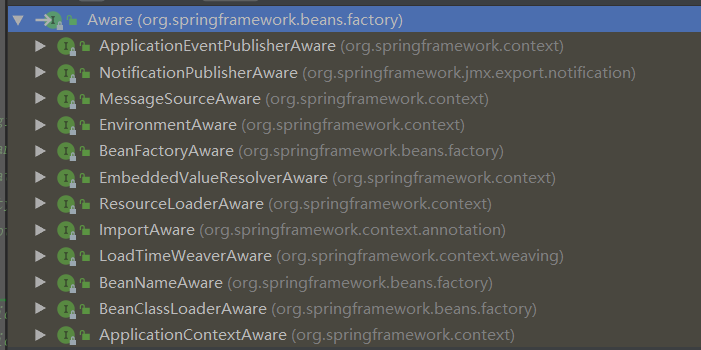

# Spring注解驱动开发


<font color="green">*@Author:hanguixian*</font> 

<font color="green">*@Email:hn_hanguixian@163.com*</font>

官方文档：<https://docs.spring.io/spring/docs/5.1.6.RELEASE/spring-framework-reference/> 

## 一 组件注册

### 1.1 @Configuration、@Bean给容器中注册组件

- @Configuration:告诉Sring这是一个配置类，标注该注解的类就相当于spring的配置文件
- @Bean:给容器中注册一个Bean;类型为返回值的类型，id默认是用方法名作为id


- Person.java

```java
import java.util.Date;

public class Person {
    private Integer id;
    private String name;
    private String phoneNumber;
    private Date birth;


    public Person() {
    }

    public Person(String name, String phoneNumber) {
        this.name = name;
        this.phoneNumber = phoneNumber;
    }

    public Person(Integer id, String name, String phoneNumber, Date birth) {
        this.id = id;
        this.name = name;
        this.phoneNumber = phoneNumber;
        this.birth = birth;
    }

    //省略 getter、setter、toString
}

```

- MainConfig.java

```java
import com.ifox.hgx.spring.annotation.bean.Person;
import org.springframework.context.annotation.Bean;
import org.springframework.context.annotation.Configuration;

@Configuration
public class MainConfig {

    @Bean(value = "personValue")
    public Person person(){
        return new Person("张三","12111234545") ;
    }
}
```

- MainPerson.java

```java
import com.ifox.hgx.spring.annotation.bean.Person;
import com.ifox.hgx.spring.annotation.config.MainConfig;
import org.springframework.context.ApplicationContext;
import org.springframework.context.annotation.AnnotationConfigApplicationContext;

public class MainPerson {

    public static void main(String[] args) {
        ApplicationContext context = new AnnotationConfigApplicationContext(MainConfig.class);
        String[] beanNames = context.getBeanNamesForType(Person.class);
        for (String beanName : beanNames) {
            System.out.println(beanName);
        }
        Person person = context.getBean(Person.class);
        System.out.println(person);
    }
}
//控制台打印
//        personValue
//        Person{id=null, name='张三', phoneNumber='12111234545', birth=null}
```

### 1.2 @ComponentScan-自动扫描组件&指定扫描规则

- @ComponentScan：自动扫描组件

```properties
value:指定要扫描的包
excludeFilters = Filter[] ：指定扫描的时候按照什么规则排除那些组件
includeFilters = Filter[] ：指定扫描的时候只需要包含哪些组件
FilterType.ANNOTATION:按照注解
FilterType.ASSIGNABLE_TYPE:按照给定的类型；
FilterType.ASPECTJ:使用ASPECTJ表达式
FilterType.REGEX:使用正则指定
FilterType.CUSTOM:使用自定义规则
```

- @ComponentScans：里面可以配置多个@ComponentScan


#### 1.2.1 代码示例

- 配置类：MainConfig.java

```java
package com.ifox.hgx.spring.annotation.config;


import com.ifox.hgx.spring.annotation.bean.Person;
import com.ifox.hgx.spring.annotation.service.PersonService;
import org.springframework.context.annotation.Bean;
import org.springframework.context.annotation.ComponentScan;
import org.springframework.context.annotation.Configuration;
import org.springframework.context.annotation.FilterType;
import org.springframework.stereotype.Controller;


//配置类==配置文件
//@Configuration  告诉Spring这是一个配置类
@Configuration

/**
 * @ComponentScan value:指定要扫描的包
 * excludeFilters = Filter[] ：指定扫描的时候按照什么规则排除那些组件
 * includeFilters = Filter[] ：指定扫描的时候只需要包含哪些组件
 * FilterType.ANNOTATION：按照注解
 * FilterType.ASSIGNABLE_TYPE：按照给定的类型；
 * FilterType.ASPECTJ：使用ASPECTJ表达式
 * FilterType.REGEX：使用正则指定
 * FilterType.CUSTOM：使用自定义规则
 */

//@ComponentScan(value = "com.ifox.hgx.spring.annotation", excludeFilters = {
//        @ComponentScan.Filter(type = FilterType.ANNOTATION, classes = {Controller.class, Service.class})
//})
@ComponentScan(value = "com.ifox.hgx.spring.annotation", useDefaultFilters = false, includeFilters = {
        @ComponentScan.Filter(type = FilterType.ANNOTATION, classes = {Controller.class}),
        @ComponentScan.Filter(type = FilterType.ASSIGNABLE_TYPE, classes = {PersonService.class})
})
//@ComponentScans(value = {
//        @ComponentScan(value = "com.ifox.hgx.spring.annotation", useDefaultFilters = false, includeFilters = {
//                @ComponentScan.Filter(type = FilterType.ANNOTATION, classes = {Controller.class})
//        }), @ComponentScan(value = "com.ifox.hgx.spring.annotation", useDefaultFilters = false, includeFilters = {
//        @ComponentScan.Filter(type = FilterType.ANNOTATION, classes = {Service.class})
//})
//})
public class MainConfig {

    //给容器中注册一个Bean;类型为返回值的类型，id默认是用方法名作为id
    @Bean(value = "personValue")
    public Person person() {
        return new Person("张三", "12111234545");
    }
}
```

- 其他注解类

```java
//PersonController
package com.ifox.hgx.spring.annotation.controller;

import org.springframework.stereotype.Controller;

@Controller
public class PersonController {
}

//PersonService
package com.ifox.hgx.spring.annotation.service;

import org.springframework.stereotype.Service;

@Service
public class PersonService {
}

//PersonRepository
package com.ifox.hgx.spring.annotation.dao;

import org.springframework.stereotype.Repository;

@Repository
public class PersonRepository {
}
```

- 测试：IOCTest.java

```java
package com.ifox.hgx.spring.annotation.test;


import com.ifox.hgx.spring.annotation.config.MainConfig;
import org.junit.Test;
import org.springframework.context.annotation.AnnotationConfigApplicationContext;

public class IOCTest {

    @Test
    public void test01() {
        AnnotationConfigApplicationContext applicationContext = new AnnotationConfigApplicationContext(MainConfig.class);
        String[] definitionNames = applicationContext.getBeanDefinitionNames();
        for (String definitionName : definitionNames) {
            System.out.println(definitionName);
        }
    }
}
```

### 1.3 自定义TypeFilter指定过滤规则

```java
//将MainConfig.java 的ComponentScan修改为该配置
@ComponentScan(value = "com.ifox.hgx.spring.annotation", useDefaultFilters = false, includeFilters = {
        @ComponentScan.Filter(type = FilterType.CUSTOM, classes = {MyTypeFilter.class})
})
```

- 添加自定义扫描规则:MyTypeFilter.java

```java
package com.ifox.hgx.spring.annotation.config;

import org.springframework.core.io.Resource;
import org.springframework.core.type.AnnotationMetadata;
import org.springframework.core.type.ClassMetadata;
import org.springframework.core.type.classreading.MetadataReader;
import org.springframework.core.type.classreading.MetadataReaderFactory;
import org.springframework.core.type.filter.TypeFilter;

import java.io.IOException;

public class MyTypeFilter implements TypeFilter {

    /**
     * metadataReader：读取到的当前正在扫描的类的信息
     * metadataReaderFactory:可以获取到其他任何类信息的
     */
    @Override
    public boolean match(MetadataReader metadataReader, MetadataReaderFactory metadataReaderFactory)
            throws IOException {

        //获取当前类注解的信息
        AnnotationMetadata annotationMetadata = metadataReader.getAnnotationMetadata();
        //获取当前正在扫描的类的类信息
        ClassMetadata classMetadata = metadataReader.getClassMetadata();
        //获取当前类资源（类的路径）
        Resource resource = metadataReader.getResource();

        String className = classMetadata.getClassName();
        System.out.println("--->" + className);
        if (className.contains("er")) {
            return true;
        }
        return false;
    }
}
```
### 1.4 @Scope-设置组件作用域

- 配置类

```java
package com.ifox.hgx.spring.annotation.config;


import com.ifox.hgx.spring.annotation.bean.Person;
import org.springframework.context.annotation.Bean;
import org.springframework.context.annotation.Configuration;
import org.springframework.context.annotation.Lazy;
import org.springframework.context.annotation.Scope;


@Configuration

public class MainConfig2 {

    //默认是单实例的
    /**
     * @Scope:调整作用域
     * prototype：多实例的：ioc容器启动并不会去调用方法创建对象放在容器中。每次获取的时候才会调用方法创建对象；
     * singleton：单实例的（默认值）：ioc容器启动会调用方法创建对象放到ioc容器中。以后每次获取就是直接从容器（map.get()）中拿
     * request：同一次请求创建一个实例
     * session：同一个session创建一个实例
     *
     * 懒加载：
     * 单实例bean：默认在容器启动的时候创建对象；
     * 懒加载：容器启动不创建对象。第一次使用(获取)Bean创建对象，并初始化；
     * ConfigurableBeanFactory#SCOPE_SINGLETON singleton
     * ConfigurableBeanFactory#SCOPE_PROTOTYPE prototype
     * org.springframework.web.context.WebApplicationContext#SCOPE_REQUEST  request
     * org.springframework.web.context.WebApplicationContext#SCOPE_SESSION  session
     */
//	@Scope("prototype")
    @Lazy
    @Bean("person")
    public Person person() {
        System.out.println("给容器中添加Person....");
        return new Person("张三", "123312312321");
    }

}
```

- 测试代码

```java
@Test
public void test02(){
    AnnotationConfigApplicationContext applicationContext = new AnnotationConfigApplicationContext(MainConfig2.class);
    //		String[] definitionNames = applicationContext.getBeanDefinitionNames();
    //		for (String name : definitionNames) {
    //			System.out.println(name);
    //		}
    //
    System.out.println("ioc容器创建完成....");
    Object bean = applicationContext.getBean("person");
    Object bean2 = applicationContext.getBean("person");
    System.out.println(bean == bean2);
}
```

### 1.5 @Conditional-按照条件注册bean

- @Conditional 满足设定的条件才会注册相应的bean，可以标注在类和方法上。

```java
package org.springframework.context.annotation;

import java.lang.annotation.Documented;
import java.lang.annotation.ElementType;
import java.lang.annotation.Retention;
import java.lang.annotation.RetentionPolicy;
import java.lang.annotation.Target;


@Target({ElementType.TYPE, ElementType.METHOD})
@Retention(RetentionPolicy.RUNTIME)
@Documented
public @interface Conditional {
    Class<? extends Condition>[] value();

}
```


**代码示例**

- 配置类

```java
package com.ifox.hgx.spring.annotation.config;


import com.ifox.hgx.spring.annotation.bean.Person;
import com.ifox.hgx.spring.annotation.condition.LinuxCondition;
import com.ifox.hgx.spring.annotation.condition.WindowsCondition;
import org.springframework.context.annotation.*;


//类中组件统一设置。满足当前条件，这个类中配置的所有bean注册才能生效；
//@Conditional({WindowsCondition.class})
@Configuration
public class MainConfig2 {

    /**
     * @Conditional({Condition}) ： 按照一定的条件进行判断，满足条件给容器中注册bean
     *
     * 如果系统是windows，给容器中注册("bill")
     * 如果是linux系统，给容器中注册("linus")
     */
    @Conditional(WindowsCondition.class)
    @Bean("bill")
    public Person person01(){
        return new Person("Bill Gates","12313");
    }

    @Conditional(LinuxCondition.class)
    @Bean("linus")
    public Person person02(){
        return new Person("linus", "232342");
    }


}
```

- LinuxCondition.java

```java
package com.ifox.hgx.spring.annotation.condition;


import org.springframework.beans.factory.config.ConfigurableListableBeanFactory;
import org.springframework.beans.factory.support.BeanDefinitionRegistry;
import org.springframework.context.annotation.Condition;
import org.springframework.context.annotation.ConditionContext;
import org.springframework.core.env.Environment;
import org.springframework.core.type.AnnotatedTypeMetadata;

//判断是否linux系统
public class LinuxCondition implements Condition {

    /**
     * ConditionContext：判断条件能使用的上下文（环境）
     * AnnotatedTypeMetadata：注释信息
     */
    @Override
    public boolean matches(ConditionContext context, AnnotatedTypeMetadata metadata) {
        // TODO 是否linux系统
        //1、能获取到ioc使用的beanfactory
        ConfigurableListableBeanFactory beanFactory = context.getBeanFactory();
        //2、获取类加载器
        ClassLoader classLoader = context.getClassLoader();
        //3、获取当前环境信息
        Environment environment = context.getEnvironment();
        //4、获取到bean定义的注册类
        BeanDefinitionRegistry registry = context.getRegistry();

        String property = environment.getProperty("os.name");

        //可以判断容器中的bean注册情况，也可以给容器中注册bean
        boolean definition = registry.containsBeanDefinition("person");

        if(property.contains("linux")){
            return true;
        }

        return false;
    }
}
```

- WindowsCondition.java

```java
package com.ifox.hgx.spring.annotation.condition;


import org.springframework.context.annotation.Condition;
import org.springframework.context.annotation.ConditionContext;
import org.springframework.core.type.AnnotatedTypeMetadata;

public class WindowsCondition implements Condition {

    @Override
    public boolean matches(ConditionContext context, AnnotatedTypeMetadata metadata) {

        String osName = context.getEnvironment().getProperty("os.name");

        System.out.println("OS Name:" + osName);

        if (osName.contains("Windows")) {
            return true;
        }

        return false;
    }
}

```

- 测试代码

```java
@Test
public void test03() {
    AnnotationConfigApplicationContext applicationContext = new AnnotationConfigApplicationContext(MainConfig2.class);
    String[] namesForType = applicationContext.getBeanNamesForType(Person.class);
    ConfigurableEnvironment environment = applicationContext.getEnvironment();
    //动态获取环境变量的值；Windows 10
    String property = environment.getProperty("os.name");
    System.out.println(property);
    for (String name : namesForType) {
        System.out.println(name);
    }

    Map<String, Person> persons = applicationContext.getBeansOfType(Person.class);
    System.out.println(persons);
}
```


### 1.6 @Import

- @Import-给容器中快速导入一个组件：id默认是组件的全类名

```java
//Bean：Color.java
package com.ifox.hgx.spring.annotation.bean;
public class Color {
}
//Bean：Red.java
package com.ifox.hgx.spring.annotation.bean;
public class Red {
}
//配置类：MainConfig2.java
@Import(value = {Color.class, Red.class})
@Configuration
public class MainConfig2 {
	//...
}
```

- @Import：使用ImportSelector接口实现注册bean

```java
package com.ifox.hgx.spring.annotation.condition;

import org.springframework.context.annotation.ImportSelector;
import org.springframework.core.type.AnnotationMetadata;

//自定义逻辑返回需要导入的组件
public class MyImportSelector implements ImportSelector {

    //返回值，就是到导入到容器中的组件全类名
    //AnnotationMetadata:当前标注@Import注解的类的所有注解信息
    @Override
    public String[] selectImports(AnnotationMetadata importingClassMetadata) {
        //importingClassMetadata
        //方法不要返回null值
        return new String[]{"com.ifox.hgx.spring.annotation.bean.Blue","com.ifox.hgx.spring.annotation.bean.Yellow"};
    }

}

```

```java
//@Import导入组件，id默认是组件的全类名
@Import(value = {Color.class, Red.class, MyImportSelector.class})
@Configuration
public class MainConfig2 {
    //....
}
```

- @Import：使用ImportBeanDefinitionRegistrar接口实现注册bean

```java
package com.ifox.hgx.spring.annotation.condition;

import com.ifox.hgx.spring.annotation.bean.RainBow;
import org.springframework.beans.factory.support.BeanDefinitionRegistry;
import org.springframework.beans.factory.support.RootBeanDefinition;
import org.springframework.context.annotation.ImportBeanDefinitionRegistrar;
import org.springframework.core.type.AnnotationMetadata;


public class MyImportBeanDefinitionRegistrar implements ImportBeanDefinitionRegistrar {

    /**
     * AnnotationMetadata：当前类的注解信息
     * BeanDefinitionRegistry:BeanDefinition注册类；
     * 把所有需要添加到容器中的bean；调用
     * BeanDefinitionRegistry.registerBeanDefinition手工注册进来
     */
    @Override
    public void registerBeanDefinitions(AnnotationMetadata importingClassMetadata, BeanDefinitionRegistry registry) {

        boolean definition = registry.containsBeanDefinition("com.ifox.hgx.spring.annotation.bean.Red");
        boolean definition2 = registry.containsBeanDefinition("com.ifox.hgx.spring.annotation.bean.Blue");
        if (definition && definition2) {
            //指定Bean定义信息；（Bean的类型，Bean。。。）
            RootBeanDefinition beanDefinition = new RootBeanDefinition(RainBow.class);
            //注册一个Bean，指定bean名
            registry.registerBeanDefinition("rainBow", beanDefinition);
        }
    }
}
```

```java
//@Import导入组件，id默认是组件的全类名
@Import(value = {Color.class, Red.class, MyImportSelector.class, MyImportBeanDefinitionRegistrar.class})
@Configuration
public class MainConfig2 {
    //...
}
```

### 1.7 使用FactoryBean注册组件 

- FactoryBean：ColorFactoryBean.java

```java
package com.ifox.hgx.spring.annotation.factory;

import com.ifox.hgx.spring.annotation.bean.Color;
import org.springframework.beans.factory.FactoryBean;

//创建一个Spring定义的FactoryBean
public class ColorFactoryBean implements FactoryBean {

    //返回一个Color对象，这个对象会添加到容器中
    @Override
    public Color getObject() throws Exception {
        // TODO Auto-generated method stub
        System.out.println("ColorFactoryBean...getObject...");
        return new Color();
    }

    @Override
    public Class<?> getObjectType() {
        // TODO Auto-generated method stub
        return Color.class;
    }

    //是单例？
    //true：这个bean是单实例，在容器中保存一份
    //false：多实例，每次获取都会创建一个新的bean；
    @Override
    public boolean isSingleton() {
        return true;
    }
}
```

- 配置类

```java
@Configuration
public class MainConfig2 {
    @Bean
    public ColorFactoryBean colorFactoryBean(){
        return new ColorFactoryBean();
    }
}
```

- 测试代码

```java
private void printBeans(AnnotationConfigApplicationContext applicationContext){
    String[] definitionNames = applicationContext.getBeanDefinitionNames();
    for (String name : definitionNames) {
        System.out.println(name);
    }
}

@Test
public void testFactoryBean(){
    AnnotationConfigApplicationContext applicationContext = new AnnotationConfigApplicationContext(MainConfig2.class);
    printBeans(applicationContext);
    //工厂Bean获取的是调用getObject创建的对象
    Object bean2 = applicationContext.getBean("colorFactoryBean");
    Object bean3 = applicationContext.getBean("colorFactoryBean");
    Object object = applicationContext.getBean(Color.class) ;
    System.out.println("color:"+object);
    System.out.println("bean的类型："+bean2.getClass());
    System.out.println(bean2 == bean3);

    Object bean4 = applicationContext.getBean("&colorFactoryBean");
    System.out.println(bean4.getClass());
}
```

### 1.8 小总结

 **给容器中注册组件:**

- 包扫描+组件标注注解（@Controller/@Service/@Repository/@Component）[自己写的类]
- @Bean[导入的第三方包里面的组件]
- @Import[快速给容器中导入一个组件]
  - @Import(要导入到容器中的组件)；容器中就会自动注册这个组件，id默认是全类名
  - ImportSelector:返回需要导入的组件的全类名数组；
  - ImportBeanDefinitionRegistrar:手动注册bean到容器中
- 使用Spring提供的 FactoryBean（工厂Bean）
  - 默认获取到的是工厂bean调用getObject创建的对象
  - 要获取工厂Bean本身，我们需要给id前面加一个&
    - 例如：&colorFactoryBean


## 二 生命周期

### 2.1 @Bean指定初始化和销毁方法 

- bean:Car.java

```java
package com.ifox.hgx.spring.annotation.bean;

import org.springframework.stereotype.Component;

@Component
public class Car {
	
	public Car(){
		System.out.println("car constructor...");
	}
	
	public void init(){
		System.out.println("car ... init...");
	}

	private void destroy() {
			System.out.println("car ... destroy...");
	}
}
```

- 配置类:MainConfigOfLifeCycle.java

```java
package com.ifox.hgx.spring.annotation.config;

import com.ifox.hgx.spring.annotation.bean.Car;
import org.springframework.context.annotation.Bean;
import org.springframework.context.annotation.ComponentScan;
import org.springframework.context.annotation.Configuration;
import org.springframework.context.annotation.Scope;


@ComponentScan("com.ifox.hgx.spring.annotation.bean")
@Configuration
public class MainConfigOfLifeCycle {

    //    @Scope("prototype")
    @Bean(initMethod = "init", destroyMethod = "destroy")
    public Car car() {
        return new Car();
    }

}
```


### 2.2 InitializingBean和DisposableBean

```java
package com.ifox.hgx.spring.annotation.bean;

import org.springframework.beans.factory.DisposableBean;
import org.springframework.beans.factory.InitializingBean;
import org.springframework.stereotype.Component;

@Component
public class Cat implements InitializingBean, DisposableBean {

    public Cat() {
        System.out.println("Cat constructor...");
    }

    /**
     * bean销毁前调用
     *
     * @throws Exception 异常
     */
    @Override
    public void destroy() throws Exception {
        System.out.println("Cat...destroy...");
    }

    /**
     * bean创建后并属性赋值后调用,相当于init
     *
     * @throws Exception 异常
     */
    @Override
    public void afterPropertiesSet() throws Exception {
        System.out.println("Cat...afterPropertiesSet...");
    }

}
```

### 2.3 @PostConstruct和@PreDestroy

```java
package com.ifox.hgx.spring.annotation.bean;

import org.springframework.stereotype.Component;

import javax.annotation.PostConstruct;
import javax.annotation.PreDestroy;

@Component
public class Dog {

    public Dog() {
        System.out.println("dog constructor...");
    }

    //对象创建并赋值之后调用
    @PostConstruct
    public void init() {
        System.out.println("Dog....@PostConstruct...");
    }

    //容器移除对象之前
    @PreDestroy
    public void destroy() {
        System.out.println("Dog....@PreDestroy...");
    }
}
```

### 2.4 BeanPostProcessor后置处理器

```java
package com.ifox.hgx.spring.annotation.bean;

import org.springframework.beans.BeansException;
import org.springframework.beans.factory.config.BeanPostProcessor;
import org.springframework.stereotype.Component;

/**
 * 后置处理器：初始化前后进行处理工作
 * 将后置处理器加入到容器中
 */
@Component
public class MyBeanPostProcessor implements BeanPostProcessor {

    @Override
    public Object postProcessBeforeInitialization(Object bean, String beanName) throws BeansException {
        System.out.println("postProcessBeforeInitialization..." + beanName + "=>" + bean);
        return bean;
    }

    @Override
    public Object postProcessAfterInitialization(Object bean, String beanName) throws BeansException {
        System.out.println("postProcessAfterInitialization..." + beanName + "=>" + bean);
        return bean;
    }

}
```

- 获取IOC容器；实现ApplicationContextAware接口，它的setApplicationContext传入了ApplicationContext

```java
package com.ifox.hgx.spring.annotation.bean;

import org.springframework.beans.BeansException;
import org.springframework.context.ApplicationContext;
import org.springframework.context.ApplicationContextAware;
import org.springframework.stereotype.Component;

import javax.annotation.PostConstruct;
import javax.annotation.PreDestroy;

@Component
public class Dog implements ApplicationContextAware {

    //@Autowired
    private ApplicationContext applicationContext;

    public Dog() {
        System.out.println("dog constructor...");
    }

    //对象创建并赋值之后调用
    @PostConstruct
    public void init() {
        System.out.println("Dog....@PostConstruct...");
    }

    //容器移除对象之前
    @PreDestroy
    public void destroy() {
        System.out.println("Dog....@PreDestroy...");
    }

    @Override
    public void setApplicationContext(ApplicationContext applicationContext) throws BeansException {
        this.applicationContext = applicationContext;
    }
}
```

### 2.5 小总结

**bean的生命周期:**

- bean创建---初始化----销毁的过程

 **容器管理bean的生命周期**

- 我们可以自定义初始化和销毁方法；容器在bean进行到当前生命周期的时候来调用我们自定义的初始化和销毁方法

 **构造（对象创建）**

- 单实例：在容器启动的时候创建对象
- 多实例：在每次获取的时候创建对象

 **BeanPostProcessor.postProcessBeforeInitialization初始化：**

- 对象创建完成，并赋值好，调用初始化方法。。。

 **BeanPostProcessor.postProcessAfterInitialization销毁：**

- 单实例：容器关闭的时候
- 多实例：容器不会管理这个bean；容器不会调用销毁方法；


  **遍历得到容器中所有的BeanPostProcessor；挨个执行beforeInitialization，一但返回null，跳出for循环，不会执行后面的BeanPostProcessor.postProcessorsBeforeInitialization**

 **BeanPostProcessor原理**

 ```java
populateBean(beanName, mbd, instanceWrapper);//给bean进行属性赋值
initializeBean
{
    applyBeanPostProcessorsBeforeInitialization(wrappedBean, beanName);
    invokeInitMethods(beanName, wrappedBean, mbd);执行自定义初始化
    applyBeanPostProcessorsAfterInitialization(wrappedBean, beanName);
}
 ```

**生命周期管理方式：**

1）、指定初始化和销毁方法；通过@Bean指定init-method和destroy-method；

2）、通过让Bean实现InitializingBean（定义初始化逻辑），DisposableBean（定义销毁逻辑）;

3）、可以使用JSR250；

- @PostConstruct：在bean创建完成并且属性赋值完成；来执行初始化方法
- @PreDestroy：在容器销毁bean之前通知我们进行清理工作 

4）、BeanPostProcessor【interface】：bean的后置处理器,在bean初始化前后进行一些处理工作；

- postProcessBeforeInitialization:在初始化之前工作
- postProcessAfterInitialization:在初始化之后工作

**Spring底层对 BeanPostProcessor 的使用:**

- bean赋值，注入其他组件，@Autowired，生命周期注解功能，@Async,xxx BeanPostProcessor

## 三 属性赋值@Value和@PropertySource

**@Value赋值**

**@PropertySource加载外部配置文件**

- javaBean:Person.java

```java
package com.ifox.hgx.spring.annotation.bean;


import org.springframework.beans.factory.annotation.Value;

import java.util.Date;

public class Person {

    /**
     * 使用@Value赋值；
     * 1、基本数值
     * 2、可以写SpEL； #{}
     * 3、可以写${}；取出配置文件【properties】中的值（在运行环境变量里面的值）
     */

    @Value("#{T(Math).random()*1000 -1 }")
    private Integer id;
    @Value("张三")
    private String name;
    @Value("${person.phoneNumber}")
    private String phoneNumber;
    @Value("#{nowDate}")
    private Date birth;


    public Person() {
    }

    public Person(String name, String phoneNumber) {
        this.name = name;
        this.phoneNumber = phoneNumber;
    }

    public Person(Integer id, String name, String phoneNumber, Date birth) {
        this.id = id;
        this.name = name;
        this.phoneNumber = phoneNumber;
        this.birth = birth;
    }

    public Integer getId() {
        return id;
    }

    public void setId(Integer id) {
        this.id = id;
    }

    public String getName() {
        return name;
    }

    public void setName(String name) {
        this.name = name;
    }

    public String getPhoneNumber() {
        return phoneNumber;
    }

    public void setPhoneNumber(String phoneNumber) {
        this.phoneNumber = phoneNumber;
    }

    public Date getBirth() {
        return birth;
    }

    public void setBirth(Date birth) {
        this.birth = birth;
    }

    @Override
    public String toString() {
        return "Person{" +
                "id=" + id +
                ", name='" + name + '\'' +
                ", phoneNumber='" + phoneNumber + '\'' +
                ", birth=" + birth +
                '}';
    }
}
```

- 配置类

```java
package com.ifox.hgx.spring.annotation.config;

import com.ifox.hgx.spring.annotation.bean.Person;
import org.springframework.context.annotation.Bean;
import org.springframework.context.annotation.Configuration;
import org.springframework.context.annotation.PropertySource;

import java.time.Instant;
import java.util.Date;

/**
 * 使用@PropertySource读取外部配置文件中的k/v保存到运行的环境变量中;加载完外部的配置文件以后使用${}取出配置文件的值
 */
@PropertySource(value = {"classpath:person.properties"})
@Configuration
public class MainConfigOfPropertyValues {

    @Bean
    public Person person() {
        return new Person();
    }

    @Bean(value = "nowDate")
    public Date date(){
        return Date.from(Instant.now()) ;
    }
}
```

- person.properties

 ```properties
person.phoneNumber=129992929
 ```

- 测试

```java
package com.ifox.hgx.spring.annotation.test;

import com.ifox.hgx.spring.annotation.bean.Person;
import com.ifox.hgx.spring.annotation.config.MainConfigOfPropertyValues;
import org.junit.Test;
import org.springframework.context.annotation.AnnotationConfigApplicationContext;
import org.springframework.core.env.ConfigurableEnvironment;

public class IOCTest_PropertyValue {
    AnnotationConfigApplicationContext applicationContext = new AnnotationConfigApplicationContext(MainConfigOfPropertyValues.class);
    @Test
    public void test01(){
        printBeans(applicationContext);
        System.out.println("=============");

        Person person = (Person) applicationContext.getBean("person");
        System.out.println(person);


        ConfigurableEnvironment environment = applicationContext.getEnvironment();
        String property = environment.getProperty("person.phoneNumber");
        System.out.println(property);
        applicationContext.close();
    }

    private void printBeans(AnnotationConfigApplicationContext applicationContext){
        String[] definitionNames = applicationContext.getBeanDefinitionNames();
        for (String name : definitionNames) {
            System.out.println(name);
        }
    }

}
```

## 四 自动装配

**Spring利用依赖注入（DI），完成对IOC容器中中各个组件的依赖关系赋值**

**AutowiredAnnotationBeanPostProcessor:解析完成自动装配功能**


### 4.1 @Autowired:自动注入

- 默认优先按照类型去容器中找对应的组件:applicationContext.getBean(BookDao.class);找到就赋值
- 如果找到多个相同类型的组件，再将属性的名称作为组件的id去容器中查找`applicationContext.getBean("bookDao")`
- @Qualifier("bookDao")：使用@Qualifier指定需要装配的组件的id，而不是使用属性名
- 自动装配默认一定要将属性赋值好，没有就会报错；可以使用@Autowired(required=false),使所需的组件没有的时不装配。
- @Primary：让Spring进行自动装配的时候，默认使用首选的bean；也可以继续使用@Qualifier指定需要装配的bean的名字

```java
public class BookService {
    @Autowired
    private BookDao bookDao;
}
```


**代码示例**

- 配置类

```java
package com.ifox.hgx.spring.annotation.config;


import com.ifox.hgx.spring.annotation.bean.Car;
import com.ifox.hgx.spring.annotation.bean.Color;
import com.ifox.hgx.spring.annotation.bean.Person;
import com.ifox.hgx.spring.annotation.dao.PersonRepository;
import org.springframework.beans.factory.annotation.Autowired;
import org.springframework.beans.factory.annotation.Qualifier;
import org.springframework.context.annotation.Bean;
import org.springframework.context.annotation.ComponentScan;
import org.springframework.context.annotation.Configuration;
import org.springframework.context.annotation.Primary;

@Configuration
@ComponentScan({"com.ifox.hgx.spring.annotation.service","com.ifox.hgx.spring.annotation.dao",
		"com.ifox.hgx.spring.annotation.controller","com.ifox.hgx.spring.annotation.bean"})
public class MainConfigOfAutowired {

	@Primary
	@Bean(value = "personRepository2")
	public PersonRepository personRepository(){
		PersonRepository personRepository = new PersonRepository();
		personRepository.setIndex(2);
		return personRepository;
	}
}

```

- controller

```java
package com.ifox.hgx.spring.annotation.controller;

import com.ifox.hgx.spring.annotation.service.PersonService;
import org.springframework.beans.factory.annotation.Autowired;
import org.springframework.stereotype.Controller;

@Controller
public class PersonController {

    @Autowired
    private PersonService personService ;

    public void prin(){
        System.out.println(personService.getPersonById(12312321));
    }

    @Override
    public String toString() {
        return "PersonController{" +
                "personService=" + personService +
                '}';
    }
}
```

- service

```java
package com.ifox.hgx.spring.annotation.service;

import com.ifox.hgx.spring.annotation.bean.Person;
import com.ifox.hgx.spring.annotation.dao.PersonRepository;
import org.springframework.beans.factory.annotation.Autowired;
import org.springframework.beans.factory.annotation.Qualifier;
import org.springframework.stereotype.Service;

@Service
public class PersonService {

//    @Qualifier(value = "personRepository")
    @Autowired(required = false)
    private PersonRepository personRepository;

    public Person getPersonById(Integer id) {

        return personRepository.getById(id);
    }

    @Override
    public String toString() {
        return "PersonService{" +
                "personRepository=" + personRepository +
                '}';
    }
}
```

- repository

```java
package com.ifox.hgx.spring.annotation.dao;

import com.ifox.hgx.spring.annotation.bean.Person;
import org.springframework.stereotype.Repository;

import java.time.Instant;
import java.util.Date;

@Repository
public class PersonRepository {

    private Integer index = 0 ;

    public Person getById(Integer id) {
        return new Person(id, "哈哈哈", "1231232132", Date.from(Instant.now()));
    }

    public Integer getIndex() {
        return index;
    }

    public void setIndex(Integer index) {
        this.index = index;
    }

    @Override
    public String toString() {
        return "PersonRepository{" +
                "index=" + index +
                '}';
    }
}
```

- 测试

```java
package com.ifox.hgx.spring.annotation.test;

import com.ifox.hgx.spring.annotation.bean.Color;
import com.ifox.hgx.spring.annotation.config.MainConfigOfAutowired;
import com.ifox.hgx.spring.annotation.controller.PersonController;
import com.ifox.hgx.spring.annotation.dao.PersonRepository;
import org.junit.Test;
import org.springframework.context.annotation.AnnotationConfigApplicationContext;

public class IOCTest_Autowired {

    @Test
    public void test01() {
        AnnotationConfigApplicationContext applicationContext = new AnnotationConfigApplicationContext(MainConfigOfAutowired.class);

        PersonController personController = applicationContext.getBean(PersonController.class);
        System.out.println(personController);

//        PersonRepository personRepository = applicationContext.getBean(PersonRepository.class);
//        System.out.println(personRepository);
       
        System.out.println(applicationContext);
        applicationContext.close();
    }
}
```


### 4.2 @Resource(JSR250)和@Inject(JSR330)[java规范的注解]

- @Resource
    - 可以和@Autowired一样实现自动装配功能；默认是按照组件名称进行装配的
    - 没有能支持@Primary功能，没有支持@Autowired(reqiured=false)
- @Inject
    - 需要导入javax.inject的包，和Autowired的功能一样。没有required=false的功能；
- 区别
    - @Autowired:Spring定义的
    - @Resource、@Inject 是java规范的

**代码**

```java
@Service
public class PersonService {

//    @Qualifier(value = "personRepository")
//    @Autowired(required = false)
//    @Resource
    @Inject
    private PersonRepository personRepository;

//省略。。。。
}
```


### 4.3 标注位置

@Autowired:构造器，参数，方法，属性；都是从容器中获取参数组件的值

- [标注在方法位置]：@Bean+方法参数；参数从容器中获取;默认不写@Autowired效果是一样的；都能自动装配
- [标在构造器上]：如果组件只有一个有参构造器，这个有参构造器的@Autowired可以省略，参数位置的组件还是可以自动从容器中获取
- 放在参数位置

**代码**

- bean

```java
package com.ifox.hgx.spring.annotation.bean;

import org.springframework.beans.factory.annotation.Autowired;
import org.springframework.stereotype.Component;

//默认加在ioc容器中的组件，容器启动会调用无参构造器创建对象，再进行初始化赋值等操作
@Component
public class Boss {


    private Car car;

    //构造器要用的组件，都是从容器中获取
    public Boss(Car car) {
        this.car = car;
        System.out.println("Boss...有参构造器");
    }


    public Car getCar() {
        return car;
    }


    //@Autowired
    //标注在方法，Spring容器创建当前对象，就会调用方法，完成赋值；
    //方法使用的参数，自定义类型的值从ioc容器中获取
    public void setCar(Car car) {
        System.out.println("setCar。。。调用");
        this.car = car;
    }


    @Override
    public String toString() {
        return "Boss [car=" + car + "]";
    }
}
```

- 配置类中相关代码

```java
/**
 * @Bean 标注的方法创建对象的时候，方法参数的值从容器中获取
 */
@Bean
public Color color(Car car){
    Color color = new Color();
    color.setCar(car);
    return color;
}
```

- bean

```java
package com.ifox.hgx.spring.annotation.bean;


public class Color {

    private Car car ;

    public Car getCar() {
        return car;
    }

    public void setCar(Car car) {
        this.car = car;
    }

    @Override
    public String toString() {
        return "Color{" +
                "car=" + car +
                '}';
    }
}
```

### 4.4 使用Spring容器底层的组件

**自定义组件想要使用Spring容器底层的一些组件（ApplicationContext，BeanFactory，xxx）**

- 自定义组件实现xxxAware：在创建对象的时候，会调用接口规定的方法注入相关组件
- Aware把Spring底层一些组件注入到自定义的Bean中
- xxxAware功能使用xxxProcessor：ApplicationContextAware==》ApplicationContextAwareProcessor



**代码**

- bean

```java
package com.ifox.hgx.spring.annotation.bean;


import org.springframework.beans.BeansException;
import org.springframework.beans.factory.BeanNameAware;
import org.springframework.context.ApplicationContext;
import org.springframework.context.ApplicationContextAware;
import org.springframework.context.EmbeddedValueResolverAware;
import org.springframework.stereotype.Component;
import org.springframework.util.StringValueResolver;

@Component
public class Red implements ApplicationContextAware, BeanNameAware, EmbeddedValueResolverAware {

    private ApplicationContext applicationContext;

    @Override
    public void setApplicationContext(ApplicationContext applicationContext) throws BeansException {
        // TODO Auto-generated method stub
        System.out.println("传入的ioc："+applicationContext);
        this.applicationContext = applicationContext;
    }

    @Override
    public void setBeanName(String name) {
        // TODO Auto-generated method stub
        System.out.println("当前bean的名字："+name);
    }

    @Override
    public void setEmbeddedValueResolver(StringValueResolver resolver) {
        // TODO Auto-generated method stub
        String resolveStringValue = resolver.resolveStringValue("你好 ${os.name} 我是 #{20*18}");
        System.out.println("解析的字符串："+resolveStringValue);
    }
    
}

```

- 测试

```java
package com.ifox.hgx.spring.annotation.test;

import com.ifox.hgx.spring.annotation.bean.Boss;
import com.ifox.hgx.spring.annotation.bean.Car;
import com.ifox.hgx.spring.annotation.bean.Color;
import com.ifox.hgx.spring.annotation.config.MainConfigOfAutowired;
import com.ifox.hgx.spring.annotation.controller.PersonController;
import com.ifox.hgx.spring.annotation.dao.PersonRepository;
import org.junit.Test;
import org.springframework.context.annotation.AnnotationConfigApplicationContext;

public class IOCTest_Autowired {

    @Test
    public void test01() {
        AnnotationConfigApplicationContext applicationContext = new AnnotationConfigApplicationContext(MainConfigOfAutowired.class);

        PersonController personController = applicationContext.getBean(PersonController.class);
        System.out.println(personController);

//        PersonRepository personRepository = applicationContext.getBean(PersonRepository.class);
//        System.out.println(personRepository);

		Boss boss = applicationContext.getBean(Boss.class);
		System.out.println(boss);
		Car car = applicationContext.getBean(Car.class);
		System.out.println(car);

        Color color = applicationContext.getBean(Color.class);
        System.out.println(color);
        System.out.println(applicationContext);
        applicationContext.close();
    }

}
```

### 4.5 @Profile环境搭建与根据环境注册bean

**Spring为我们提供的可以根据当前环境，动态的激活和切换一系列组件的功能**

- 如：开发环境、测试环境、生产环境

**代码**

```java
package com.ifox.hgx.spring.annotation.config;

import javax.sql.DataSource;

import org.springframework.beans.factory.annotation.Value;
import org.springframework.context.EmbeddedValueResolverAware;
import org.springframework.context.annotation.Bean;
import org.springframework.context.annotation.Configuration;
import org.springframework.context.annotation.Profile;
import org.springframework.context.annotation.PropertySource;
import org.springframework.util.StringValueResolver;

import com.mchange.v2.c3p0.ComboPooledDataSource;

/**
 * Profile：
 * 		Spring为我们提供的可以根据当前环境，动态的激活和切换一系列组件的功能；
 *
 * 开发环境、测试环境、生产环境；
 * 数据源：(/A)(/B)(/C)；
 *
 *
 * @Profile：指定组件在哪个环境的情况下才能被注册到容器中，不指定，任何环境下都能注册这个组件
 *
 * 1）、加了环境标识的bean，只有这个环境被激活的时候才能注册到容器中。默认是default环境
 * 2）、写在配置类上，只有是指定的环境的时候，整个配置类里面的所有配置才能开始生效
 * 3）、没有标注环境标识的bean在，任何环境下都是加载的；
 */

@PropertySource("classpath:/db.properties")
@Configuration
public class MainConfigOfProfile implements EmbeddedValueResolverAware{

	@Value("${db.user}")
	private String user;

	private StringValueResolver valueResolver;

	private String  driverClass;


	@Profile("test")
	@Bean("testDataSource")
	public DataSource dataSourceTest(@Value("${db.password}")String pwd) throws Exception{
		ComboPooledDataSource dataSource = new ComboPooledDataSource();
		dataSource.setUser(user);
		dataSource.setPassword(pwd);
		dataSource.setJdbcUrl("jdbc:mysql://localhost:3306/test");
		dataSource.setDriverClass(driverClass);
		return dataSource;
	}


	@Profile("dev")
	@Bean("devDataSource")
	public DataSource dataSourceDev(@Value("${db.password}")String pwd) throws Exception{
		ComboPooledDataSource dataSource = new ComboPooledDataSource();
		dataSource.setUser(user);
		dataSource.setPassword(pwd);
		dataSource.setJdbcUrl("jdbc:mysql://localhost:3306/dev");
		dataSource.setDriverClass(driverClass);
		return dataSource;
	}

	@Profile("prod")
	@Bean("prodDataSource")
	public DataSource dataSourceProd(@Value("${db.password}")String pwd) throws Exception{
		ComboPooledDataSource dataSource = new ComboPooledDataSource();
		dataSource.setUser(user);
		dataSource.setPassword(pwd);
		dataSource.setJdbcUrl("jdbc:mysql://localhost:3306/prod");

		dataSource.setDriverClass(driverClass);
		return dataSource;
	}

	@Override
	public void setEmbeddedValueResolver(StringValueResolver resolver) {

		this.valueResolver = resolver;
		driverClass = valueResolver.resolveStringValue("${db.driverClass}");
	}

}
```

- db.properties

```properties
db.user=root
db.password=123456
db.driverClass=com.mysql.jdbc.Driver
```

- 测试

```java
package com.ifox.hgx.spring.annotation.test;

import javax.sql.DataSource;

import com.ifox.hgx.spring.annotation.config.MainConfigOfProfile;
import org.junit.Test;
import org.springframework.context.annotation.AnnotationConfigApplicationContext;


public class IOCTest_Profile {

	//1、使用命令行动态参数: 在虚拟机参数位置加载 -Dspring.profiles.active=test
	//2、代码的方式激活某种环境；
	@Test
	public void test01(){
		AnnotationConfigApplicationContext applicationContext =
//				new AnnotationConfigApplicationContext(MainConfigOfProfile.class) ;
				new AnnotationConfigApplicationContext();
		//1、创建一个applicationContext
		//2、设置需要激活的环境
		applicationContext.getEnvironment().setActiveProfiles("dev");
		//3、注册主配置类
		applicationContext.register(MainConfigOfProfile.class);
		//4、启动刷新容器
		applicationContext.refresh();


		String[] namesForType = applicationContext.getBeanNamesForType(DataSource.class);
		for (String string : namesForType) {
			System.out.println(string);
		}

		applicationContext.close();
	}

}
```


## 五 AOP

### 5.1 AOP：【动态代理】

**指在程序运行期间动态的将某段代码切入到指定方法指定位置进行运行的编程方式**

1、导入aop模块；Spring AOP：(spring-aspects)
2、定义一个业务逻辑类（MathCalculator）；在业务逻辑运行的时候将日志进行打印（方法之前、方法运行结束、方法出现异常，xxx）
3、定义一个日志切面类（LogAspects）：切面类里面的方法需要动态感知MathCalculator.div运行到哪里然后执行；通知方法：

- 前置通知(@Before)：在目标方法(div)运行之前运行
- 后置通知(@After)：在目标方法(div)运行结束之后运行（无论方法正常结束还是异常结束）
- 返回通知(@AfterReturning)：在目标方法(div)正常返回之后运行
- 异常通知(@AfterThrowing)：在目标方法(div)出现异常以后运行
- 环绕通知(@Around)：动态代理，手动推进目标方法运行（joinPoint.procced()）

4、给切面类的目标方法标注何时何地运行（通知注解）；
5、将切面类和业务逻辑类（目标方法所在类）都加入到容器中;
6、必须告诉Spring哪个类是切面类(给切面类上加一个注解：@Aspect)
7、给配置类中加 @EnableAspectJAutoProxy 【开启基于注解的aop模式】，在Spring中很多的 @EnableXXX;

三步：
 1）、将业务逻辑组件和切面类都加入到容器中；告诉Spring哪个是切面类（@Aspect）
 2）、在切面类上的每一个通知方法上标注通知注解，告诉Spring何时何地运行（切入点表达式）
 3）、开启基于注解的aop模式；@EnableAspectJAutoProxy


### 5.2 AOP原理：

**【看给容器中注册了什么组件，这个组件什么时候工作，这个组件的功能是什么？】**：`@EnableAspectJAutoProxy`

1、@EnableAspectJAutoProxy是什么？

- @Import(AspectJAutoProxyRegistrar.class)：给容器中导入AspectJAutoProxyRegistrar利用AspectJAutoProxyRegistrar自定义给容器中注册bean；BeanDefinetion
- internalAutoProxyCreator=AnnotationAwareAspectJAutoProxyCreator
- 给容器中注册一个AnnotationAwareAspectJAutoProxyCreator；

2、 AnnotationAwareAspectJAutoProxyCreator：

- AnnotationAwareAspectJAutoProxyCreator->AspectJAwareAdvisorAutoProxyCreator->AbstractAdvisorAutoProxyCreator ->AbstractAutoProxyCreator:implements SmartInstantiationAwareBeanPostProcessor, BeanFactoryAware

- 关注后置处理器（在bean初始化完成前后做事情）、自动装配BeanFactory
- AbstractAutoProxyCreator.setBeanFactory()
- AbstractAutoProxyCreator.有后置处理器的逻辑；
- AbstractAdvisorAutoProxyCreator.setBeanFactory()-》initBeanFactory()
- AnnotationAwareAspectJAutoProxyCreator.initBeanFactory()

### 5.3 流程

1、传入配置类，创建ioc容器
2、注册配置类，调用refresh（）刷新容器；
3、registerBeanPostProcessors(beanFactory);注册bean的后置处理器来方便拦截bean的创建；
         1）、先获取ioc容器已经定义了的需要创建对象的所有BeanPostProcessor
         2）、给容器中加别的BeanPostProcessor
         3）、优先注册实现了PriorityOrdered接口的BeanPostProcessor；
         4）、再给容器中注册实现了Ordered接口的BeanPostProcessor；
         5）、注册没实现优先级接口的BeanPostProcessor；
         6）、注册BeanPostProcessor，实际上就是创建BeanPostProcessor对象，保存在容器中；
            创建internalAutoProxyCreator的BeanPostProcessor【AnnotationAwareAspectJAutoProxyCreator】
            1）、创建Bean的实例
            2）、populateBean；给bean的各种属性赋值
            3）、initializeBean：初始化bean；
                  1）、invokeAwareMethods()：处理Aware接口的方法回调
                  2）、applyBeanPostProcessorsBeforeInitialization()：应用后置处理器的postProcessBeforeInitialization（）
                  3）、invokeInitMethods()；执行自定义的初始化方法
                  4）、applyBeanPostProcessorsAfterInitialization()；执行后置处理器的postProcessAfterInitialization（）；
            4）、BeanPostProcessor(AnnotationAwareAspectJAutoProxyCreator)创建成功；--》aspectJAdvisorsBuilder
         7）、把BeanPostProcessor注册到BeanFactory中；
            beanFactory.addBeanPostProcessor(postProcessor);

=======以上是创建和注册AnnotationAwareAspectJAutoProxyCreator的过程========

AnnotationAwareAspectJAutoProxyCreator => InstantiationAwareBeanPostProcessor

4、finishBeanFactoryInitialization(beanFactory);完成BeanFactory初始化工作；创建剩下的单实例bean
         1）、遍历获取容器中所有的Bean，依次创建对象getBean(beanName);
            getBean->doGetBean()->getSingleton()->
         2）、创建bean
            【AnnotationAwareAspectJAutoProxyCreator在所有bean创建之前会有一个拦截，InstantiationAwareBeanPostProcessor，会调用postProcessBeforeInstantiation()】
            1）、先从缓存中获取当前bean，如果能获取到，说明bean是之前被创建过的，直接使用，否则再创建；
               只要创建好的Bean都会被缓存起来
            2）、createBean（）;创建bean；
               AnnotationAwareAspectJAutoProxyCreator 会在任何bean创建之前先尝试返回bean的实例
               【BeanPostProcessor是在Bean对象创建完成初始化前后调用的】
               【InstantiationAwareBeanPostProcessor是在创建Bean实例之前先尝试用后置处理器返回对象的】
               1）、resolveBeforeInstantiation(beanName, mbdToUse);解析BeforeInstantiation
                  希望后置处理器在此能返回一个代理对象；如果能返回代理对象就使用，如果不能就继续
                   后置处理器先尝试返回对象；
                     bean = applyBeanPostProcessorsBeforeInstantiation（）：
                        拿到所有后置处理器，如果是InstantiationAwareBeanPostProcessor;
                        就执行postProcessBeforeInstantiation
                     if (bean != null) {bean = applyBeanPostProcessorsAfterInitialization(bean, beanName);

​		2）、doCreateBean(beanName, mbdToUse, args);真正的去创建一个bean实例；和3.6流程一样；
		3）、

### 5.4 AnnotationAwareAspectJAutoProxyCreator【InstantiationAwareBeanPostProcessor】    的作用：


1、每一个bean创建之前，调用postProcessBeforeInstantiation()；
      关心MathCalculator和LogAspect的创建
      1）、判断当前bean是否在advisedBeans中（保存了所有需要增强bean）
      2）、判断当前bean是否是基础类型的Advice、Pointcut、Advisor、AopInfrastructureBean，
         或者是否是切面（@Aspect）
      3）、是否需要跳过
          1）、获取候选的增强器（切面里面的通知方法）【List<Advisor> candidateAdvisors】
            每一个封装的通知方法的增强器是 InstantiationModelAwarePointcutAdvisor；
            判断每一个增强器是否是 AspectJPointcutAdvisor 类型的；返回true
          2）、永远返回false

2、创建对象
postProcessAfterInitialization；
      return wrapIfNecessary(bean, beanName, cacheKey);//包装如果需要的情况下
      1）、获取当前bean的所有增强器（通知方法）  Object[]  specificInterceptors
         1、找到候选的所有的增强器（找哪些通知方法是需要切入当前bean方法的）
         2、获取到能在bean使用的增强器。
         3、给增强器排序
      2）、保存当前bean在advisedBeans中；
      3）、如果当前bean需要增强，创建当前bean的代理对象；
         1）、获取所有增强器（通知方法）
         2）、保存到proxyFactory
         3）、创建代理对象：Spring自动决定
            JdkDynamicAopProxy(config);jdk动态代理；
            ObjenesisCglibAopProxy(config);cglib的动态代理；
      4）、给容器中返回当前组件使用cglib增强了的代理对象；
      5）、以后容器中获取到的就是这个组件的代理对象，执行目标方法的时候，代理对象就会执行通知方法的流程；


3、目标方法执行  ；
      容器中保存了组件的代理对象（cglib增强后的对象），这个对象里面保存了详细信息（比如增强器，目标对象，xxx）；
      1）、CglibAopProxy.intercept();拦截目标方法的执行
      2）、根据ProxyFactory对象获取将要执行的目标方法拦截器链；
         `List<Object> chain = this.advised.getInterceptorsAndDynamicInterceptionAdvice(method, targetClass);`
         1）、List<Object> interceptorList保存所有拦截器 5
            一个默认的ExposeInvocationInterceptor 和 4个增强器；
         2）、遍历所有的增强器，将其转为Interceptor；
            registry.getInterceptors(advisor);
         3）、将增强器转为`List<MethodInterceptor>`；
            如果是MethodInterceptor，直接加入到集合中
            如果不是，使用AdvisorAdapter将增强器转为MethodInterceptor；
            转换完成返回MethodInterceptor数组；


​    3）、如果没有拦截器链，直接执行目标方法;
         拦截器链（每一个通知方法又被包装为方法拦截器，利用MethodInterceptor机制）
    4）、如果有拦截器链，把需要执行的目标对象，目标方法，
         拦截器链等信息传入创建一个 CglibMethodInvocation 对象，
         并调用 Object retVal =  mi.proceed();
    5）、拦截器链的触发过程;
         1)、如果没有拦截器执行执行目标方法，或者拦截器的索引和拦截器数组-1大小一样（指定到了最后一个拦截器）执行目标方法；
         2)、链式获取每一个拦截器，拦截器执行invoke方法，每一个拦截器等待下一个拦截器执行完成返回以后再来执行；
    		拦截器链的机制，保证通知方法与目标方法的执行顺序；

### 5.5 总结

1）、  @EnableAspectJAutoProxy 开启AOP功能
2）、 @EnableAspectJAutoProxy 会给容器中注册一个组件 AnnotationAwareAspectJAutoProxyCreator
3）、AnnotationAwareAspectJAutoProxyCreator是一个后置处理器；
4）、容器的创建流程：
 	1）、registerBeanPostProcessors（）注册后置处理器；创建AnnotationAwareAspectJAutoProxyCreator对象
	2）、finishBeanFactoryInitialization（）初始化剩下的单实例bean
            1）、创建业务逻辑组件和切面组件
            2）、AnnotationAwareAspectJAutoProxyCreator拦截组件的创建过程
            3）、组件创建完之后，判断组件是否需要增强
               是：切面的通知方法，包装成增强器（Advisor）;给业务逻辑组件创建一个代理对象（cglib）；
5）、执行目标方法：
         1）、代理对象执行目标方法
         2）、CglibAopProxy.intercept()；
            1）、得到目标方法的拦截器链（增强器包装成拦截器MethodInterceptor）
            2）、利用拦截器的链式机制，依次进入每一个拦截器进行执行；
            3）、效果：
               正常执行：前置通知-》目标方法-》后置通知-》返回通知
               出现异常：前置通知-》目标方法-》后置通知-》异常通知

### 5.6 代码

- config配置

```java
package com.ifox.hgx.spring.annotation.config;


import com.ifox.hgx.spring.annotation.aop.LogAspects;
import com.ifox.hgx.spring.annotation.aop.MathCalculator;
import org.aopalliance.aop.Advice;
import org.aopalliance.intercept.MethodInterceptor;
import org.springframework.aop.Advisor;
import org.springframework.aop.Pointcut;
import org.springframework.aop.framework.AopInfrastructureBean;
import org.springframework.beans.factory.config.InstantiationAwareBeanPostProcessor;
import org.springframework.context.annotation.Bean;
import org.springframework.context.annotation.Configuration;
import org.springframework.context.annotation.EnableAspectJAutoProxy;


/**
 * AOP：【动态代理】
 * 		指在程序运行期间动态的将某段代码切入到指定方法指定位置进行运行的编程方式；
 *
 * 1、导入aop模块；Spring AOP：(spring-aspects)
 * 2、定义一个业务逻辑类（MathCalculator）；在业务逻辑运行的时候将日志进行打印（方法之前、方法运行结束、方法出现异常，xxx）
 * 3、定义一个日志切面类（LogAspects）：切面类里面的方法需要动态感知MathCalculator.div运行到哪里然后执行；
 * 		通知方法：
 * 			前置通知(@Before)：logStart：在目标方法(div)运行之前运行
 * 			后置通知(@After)：logEnd：在目标方法(div)运行结束之后运行（无论方法正常结束还是异常结束）
 * 			返回通知(@AfterReturning)：logReturn：在目标方法(div)正常返回之后运行
 * 			异常通知(@AfterThrowing)：logException：在目标方法(div)出现异常以后运行
 * 			环绕通知(@Around)：动态代理，手动推进目标方法运行（joinPoint.procced()）
 * 4、给切面类的目标方法标注何时何地运行（通知注解）；
 * 5、将切面类和业务逻辑类（目标方法所在类）都加入到容器中;
 * 6、必须告诉Spring哪个类是切面类(给切面类上加一个注解：@Aspect)
 * [7]、给配置类中加 @EnableAspectJAutoProxy 【开启基于注解的aop模式】
 * 		在Spring中很多的 @EnableXXX;
 *
 * 三步：
 * 	1）、将业务逻辑组件和切面类都加入到容器中；告诉Spring哪个是切面类（@Aspect）
 * 	2）、在切面类上的每一个通知方法上标注通知注解，告诉Spring何时何地运行（切入点表达式）
 *  3）、开启基于注解的aop模式；@EnableAspectJAutoProxy
 *
 * AOP原理：【看给容器中注册了什么组件，这个组件什么时候工作，这个组件的功能是什么？】
 * 		@EnableAspectJAutoProxy；
 * 1、@EnableAspectJAutoProxy是什么？
 * 		@Import(AspectJAutoProxyRegistrar.class)：给容器中导入AspectJAutoProxyRegistrar
 * 			利用AspectJAutoProxyRegistrar自定义给容器中注册bean；BeanDefinetion
 * 			internalAutoProxyCreator=AnnotationAwareAspectJAutoProxyCreator
 *
 * 		给容器中注册一个AnnotationAwareAspectJAutoProxyCreator；
 *
 * 2、 AnnotationAwareAspectJAutoProxyCreator：
 * 		AnnotationAwareAspectJAutoProxyCreator
 * 			->AspectJAwareAdvisorAutoProxyCreator
 * 				->AbstractAdvisorAutoProxyCreator
 * 					->AbstractAutoProxyCreator
 * 							implements SmartInstantiationAwareBeanPostProcessor, BeanFactoryAware
 * 						关注后置处理器（在bean初始化完成前后做事情）、自动装配BeanFactory
 *
 * AbstractAutoProxyCreator.setBeanFactory()
 * AbstractAutoProxyCreator.有后置处理器的逻辑；
 *
 * AbstractAdvisorAutoProxyCreator.setBeanFactory()-》initBeanFactory()
 *
 * AnnotationAwareAspectJAutoProxyCreator.initBeanFactory()
 *
 *
 * 流程：
 * 		1）、传入配置类，创建ioc容器
 * 		2）、注册配置类，调用refresh（）刷新容器；
 * 		3）、registerBeanPostProcessors(beanFactory);注册bean的后置处理器来方便拦截bean的创建；
 * 			1）、先获取ioc容器已经定义了的需要创建对象的所有BeanPostProcessor
 * 			2）、给容器中加别的BeanPostProcessor
 * 			3）、优先注册实现了PriorityOrdered接口的BeanPostProcessor；
 * 			4）、再给容器中注册实现了Ordered接口的BeanPostProcessor；
 * 			5）、注册没实现优先级接口的BeanPostProcessor；
 * 			6）、注册BeanPostProcessor，实际上就是创建BeanPostProcessor对象，保存在容器中；
 * 				创建internalAutoProxyCreator的BeanPostProcessor【AnnotationAwareAspectJAutoProxyCreator】
 * 				1）、创建Bean的实例
 * 				2）、populateBean；给bean的各种属性赋值
 * 				3）、initializeBean：初始化bean；
 * 						1）、invokeAwareMethods()：处理Aware接口的方法回调
 * 						2）、applyBeanPostProcessorsBeforeInitialization()：应用后置处理器的postProcessBeforeInitialization（）
 * 						3）、invokeInitMethods()；执行自定义的初始化方法
 * 						4）、applyBeanPostProcessorsAfterInitialization()；执行后置处理器的postProcessAfterInitialization（）；
 * 				4）、BeanPostProcessor(AnnotationAwareAspectJAutoProxyCreator)创建成功；--》aspectJAdvisorsBuilder
 * 			7）、把BeanPostProcessor注册到BeanFactory中；
 * 				beanFactory.addBeanPostProcessor(postProcessor);
 * =======以上是创建和注册AnnotationAwareAspectJAutoProxyCreator的过程========
 *
 * 			AnnotationAwareAspectJAutoProxyCreator => InstantiationAwareBeanPostProcessor
 * 		4）、finishBeanFactoryInitialization(beanFactory);完成BeanFactory初始化工作；创建剩下的单实例bean
 * 			1）、遍历获取容器中所有的Bean，依次创建对象getBean(beanName);
 * 				getBean->doGetBean()->getSingleton()->
 * 			2）、创建bean
 * 				【AnnotationAwareAspectJAutoProxyCreator在所有bean创建之前会有一个拦截，InstantiationAwareBeanPostProcessor，会调用postProcessBeforeInstantiation()】
 * 				1）、先从缓存中获取当前bean，如果能获取到，说明bean是之前被创建过的，直接使用，否则再创建；
 * 					只要创建好的Bean都会被缓存起来
 * 				2）、createBean（）;创建bean；
 * 					AnnotationAwareAspectJAutoProxyCreator 会在任何bean创建之前先尝试返回bean的实例
 * 					【BeanPostProcessor是在Bean对象创建完成初始化前后调用的】
 * 					【InstantiationAwareBeanPostProcessor是在创建Bean实例之前先尝试用后置处理器返回对象的】
 * 					1）、resolveBeforeInstantiation(beanName, mbdToUse);解析BeforeInstantiation
 * 						希望后置处理器在此能返回一个代理对象；如果能返回代理对象就使用，如果不能就继续
 * 						1）、后置处理器先尝试返回对象；
 * 							bean = applyBeanPostProcessorsBeforeInstantiation（）：
 * 								拿到所有后置处理器，如果是InstantiationAwareBeanPostProcessor;
 * 								就执行postProcessBeforeInstantiation
 * 							if (bean != null) {
bean = applyBeanPostProcessorsAfterInitialization(bean, beanName);
}
 *
 * 					2）、doCreateBean(beanName, mbdToUse, args);真正的去创建一个bean实例；和3.6流程一样；
 * 					3）、
 *
 *
 * AnnotationAwareAspectJAutoProxyCreator【InstantiationAwareBeanPostProcessor】	的作用：
 * 1）、每一个bean创建之前，调用postProcessBeforeInstantiation()；
 * 		关心MathCalculator和LogAspect的创建
 * 		1）、判断当前bean是否在advisedBeans中（保存了所有需要增强bean）
 * 		2）、判断当前bean是否是基础类型的Advice、Pointcut、Advisor、AopInfrastructureBean，
 * 			或者是否是切面（@Aspect）
 * 		3）、是否需要跳过
 * 			1）、获取候选的增强器（切面里面的通知方法）【List<Advisor> candidateAdvisors】
 * 				每一个封装的通知方法的增强器是 InstantiationModelAwarePointcutAdvisor；
 * 				判断每一个增强器是否是 AspectJPointcutAdvisor 类型的；返回true
 * 			2）、永远返回false
 *
 * 2）、创建对象
 * postProcessAfterInitialization；
 * 		return wrapIfNecessary(bean, beanName, cacheKey);//包装如果需要的情况下
 * 		1）、获取当前bean的所有增强器（通知方法）  Object[]  specificInterceptors
 * 			1、找到候选的所有的增强器（找哪些通知方法是需要切入当前bean方法的）
 * 			2、获取到能在bean使用的增强器。
 * 			3、给增强器排序
 * 		2）、保存当前bean在advisedBeans中；
 * 		3）、如果当前bean需要增强，创建当前bean的代理对象；
 * 			1）、获取所有增强器（通知方法）
 * 			2）、保存到proxyFactory
 * 			3）、创建代理对象：Spring自动决定
 * 				JdkDynamicAopProxy(config);jdk动态代理；
 * 				ObjenesisCglibAopProxy(config);cglib的动态代理；
 * 		4）、给容器中返回当前组件使用cglib增强了的代理对象；
 * 		5）、以后容器中获取到的就是这个组件的代理对象，执行目标方法的时候，代理对象就会执行通知方法的流程；
 *
 *
 * 	3）、目标方法执行	；
 * 		容器中保存了组件的代理对象（cglib增强后的对象），这个对象里面保存了详细信息（比如增强器，目标对象，xxx）；
 * 		1）、CglibAopProxy.intercept();拦截目标方法的执行
 * 		2）、根据ProxyFactory对象获取将要执行的目标方法拦截器链；
 * 			List<Object> chain = this.advised.getInterceptorsAndDynamicInterceptionAdvice(method, targetClass);
 * 			1）、List<Object> interceptorList保存所有拦截器 5
 * 				一个默认的ExposeInvocationInterceptor 和 4个增强器；
 * 			2）、遍历所有的增强器，将其转为Interceptor；
 * 				registry.getInterceptors(advisor);
 * 			3）、将增强器转为List<MethodInterceptor>；
 * 				如果是MethodInterceptor，直接加入到集合中
 * 				如果不是，使用AdvisorAdapter将增强器转为MethodInterceptor；
 * 				转换完成返回MethodInterceptor数组；
 *
 * 		3）、如果没有拦截器链，直接执行目标方法;
 * 			拦截器链（每一个通知方法又被包装为方法拦截器，利用MethodInterceptor机制）
 * 		4）、如果有拦截器链，把需要执行的目标对象，目标方法，
 * 			拦截器链等信息传入创建一个 CglibMethodInvocation 对象，
 * 			并调用 Object retVal =  mi.proceed();
 * 		5）、拦截器链的触发过程;
 * 			1)、如果没有拦截器执行执行目标方法，或者拦截器的索引和拦截器数组-1大小一样（指定到了最后一个拦截器）执行目标方法；
 * 			2)、链式获取每一个拦截器，拦截器执行invoke方法，每一个拦截器等待下一个拦截器执行完成返回以后再来执行；
 * 				拦截器链的机制，保证通知方法与目标方法的执行顺序；
 *
 * 	总结：
 * 		1）、  @EnableAspectJAutoProxy 开启AOP功能
 * 		2）、 @EnableAspectJAutoProxy 会给容器中注册一个组件 AnnotationAwareAspectJAutoProxyCreator
 * 		3）、AnnotationAwareAspectJAutoProxyCreator是一个后置处理器；
 * 		4）、容器的创建流程：
 * 			1）、registerBeanPostProcessors（）注册后置处理器；创建AnnotationAwareAspectJAutoProxyCreator对象
 * 			2）、finishBeanFactoryInitialization（）初始化剩下的单实例bean
 * 				1）、创建业务逻辑组件和切面组件
 * 				2）、AnnotationAwareAspectJAutoProxyCreator拦截组件的创建过程
 * 				3）、组件创建完之后，判断组件是否需要增强
 * 					是：切面的通知方法，包装成增强器（Advisor）;给业务逻辑组件创建一个代理对象（cglib）；
 * 		5）、执行目标方法：
 * 			1）、代理对象执行目标方法
 * 			2）、CglibAopProxy.intercept()；
 * 				1）、得到目标方法的拦截器链（增强器包装成拦截器MethodInterceptor）
 * 				2）、利用拦截器的链式机制，依次进入每一个拦截器进行执行；
 * 				3）、效果：
 * 					正常执行：前置通知-》目标方法-》后置通知-》返回通知
 * 					出现异常：前置通知-》目标方法-》后置通知-》异常通知
 *
 *
 *
 */
@EnableAspectJAutoProxy
@Configuration
public class MainConfigOfAOP {

	//业务逻辑类加入容器中
	@Bean
	public MathCalculator calculator(){
		return new MathCalculator();
	}

	//切面类加入到容器中
	@Bean
	public LogAspects logAspects(){
		return new LogAspects();
	}
}
```

- 执行方法类

```java
package com.ifox.hgx.spring.annotation.aop;

public class MathCalculator {
	
	public int div(int i,int j){
		System.out.println("MathCalculator...div...");
		return i/j;	
	}

}
```

- 日志切面类

```java
package com.ifox.hgx.spring.annotation.aop;

import java.util.Arrays;

import org.aspectj.lang.JoinPoint;
import org.aspectj.lang.annotation.After;
import org.aspectj.lang.annotation.AfterReturning;
import org.aspectj.lang.annotation.AfterThrowing;
import org.aspectj.lang.annotation.Aspect;
import org.aspectj.lang.annotation.Before;
import org.aspectj.lang.annotation.Pointcut;

/**
 * 切面类
 *
 * @Aspect： 告诉Spring当前类是一个切面类
 *
 */
@Aspect
public class LogAspects {

	//抽取公共的切入点表达式
	//1、本类引用
	//2、其他的切面引用
	@Pointcut("execution(public int com.ifox.hgx.spring.annotation.aop.MathCalculator.*(..))")
	public void pointCut(){}

	//@Before在目标方法之前切入；切入点表达式（指定在哪个方法切入）
	@Before("pointCut()")
	public void logStart(JoinPoint joinPoint){
		Object[] args = joinPoint.getArgs();
		System.out.println(""+joinPoint.getSignature().getName()+"运行。。。@Before:参数列表是：{"+Arrays.asList(args)+"}");
	}

	@After("com.ifox.hgx.spring.annotation.aop.LogAspects.pointCut()")
	public void logEnd(JoinPoint joinPoint){
		System.out.println(""+joinPoint.getSignature().getName()+"结束。。。@After");
	}

	//JoinPoint一定要出现在参数表的第一位
	@AfterReturning(value="pointCut()",returning="result")
	public void logReturn(JoinPoint joinPoint,Object result){
		System.out.println(""+joinPoint.getSignature().getName()+"正常返回。。。@AfterReturning:运行结果：{"+result+"}");
	}

	@AfterThrowing(value="pointCut()",throwing="exception")
	public void logException(JoinPoint joinPoint,Exception exception){
		System.out.println(""+joinPoint.getSignature().getName()+"异常。。。异常信息：{"+exception+"}");
	}

}
```

- 测试方法

```java
package com.ifox.hgx.spring.annotation.test;

import com.ifox.hgx.spring.annotation.aop.MathCalculator;
import com.ifox.hgx.spring.annotation.config.MainConfigOfAOP;
import org.junit.Test;
import org.springframework.context.annotation.AnnotationConfigApplicationContext;

public class IOCTest_AOP {

    @Test
    public void test01() {
        AnnotationConfigApplicationContext applicationContext = new AnnotationConfigApplicationContext(MainConfigOfAOP.class);

        //1、不要自己创建对象
//		MathCalculator mathCalculator = new MathCalculator();
//		mathCalculator.div(1, 1);
        MathCalculator mathCalculator = applicationContext.getBean(MathCalculator.class);

//        mathCalculator.div(1, 0);
        mathCalculator.div(4, 2);
        applicationContext.close();
    }

}
/**
 * div运行。。。@Before:参数列表是：{[4, 2]}
 * MathCalculator...div...
 * div结束。。。@After
 * div正常返回。。。@AfterReturning:运行结果：{2}
 */
```

- gardle 加入

```gardle
// https://mvnrepository.com/artifact/org.springframework/spring-aspects
compile group: 'org.springframework', name: 'spring-aspects', version: '5.0.8.RELEASE'
```


## 六 声明式事务


### 代码

- config

```java
package com.ifox.hgx.spring.annotation.tx;

import java.beans.PropertyVetoException;

import javax.sql.DataSource;

import org.springframework.aop.aspectj.annotation.AnnotationAwareAspectJAutoProxyCreator;
import org.springframework.aop.framework.autoproxy.InfrastructureAdvisorAutoProxyCreator;
import org.springframework.context.annotation.Bean;
import org.springframework.context.annotation.ComponentScan;
import org.springframework.context.annotation.Configuration;
import org.springframework.jdbc.core.JdbcTemplate;
import org.springframework.jdbc.datasource.DataSourceTransactionManager;
import org.springframework.transaction.PlatformTransactionManager;
import org.springframework.transaction.annotation.AnnotationTransactionAttributeSource;
import org.springframework.transaction.annotation.EnableTransactionManagement;
import org.springframework.transaction.annotation.ProxyTransactionManagementConfiguration;
import org.springframework.transaction.annotation.TransactionManagementConfigurationSelector;
import org.springframework.transaction.annotation.Transactional;

import com.mchange.v2.c3p0.ComboPooledDataSource;

/**
 * 声明式事务：
 *
 * 环境搭建：
 * 1、导入相关依赖
 * 		数据源、数据库驱动、Spring-jdbc模块
 * 2、配置数据源、JdbcTemplate（Spring提供的简化数据库操作的工具）操作数据
 * 3、给方法上标注 @Transactional 表示当前方法是一个事务方法；
 * 4、 @EnableTransactionManagement 开启基于注解的事务管理功能；
 * 		@EnableXXX
 * 5、配置事务管理器来控制事务;
 * 		@Bean
 * 		public PlatformTransactionManager transactionManager()
 *
 *
 * 原理：
 * 1）、@EnableTransactionManagement
 * 			利用TransactionManagementConfigurationSelector给容器中会导入组件
 * 			导入两个组件
 * 			AutoProxyRegistrar
 * 			ProxyTransactionManagementConfiguration
 * 2）、AutoProxyRegistrar：
 * 			给容器中注册一个 InfrastructureAdvisorAutoProxyCreator 组件；
 * 			InfrastructureAdvisorAutoProxyCreator：？
 * 			利用后置处理器机制在对象创建以后，包装对象，返回一个代理对象（增强器），代理对象执行方法利用拦截器链进行调用；
 *
 * 3）、ProxyTransactionManagementConfiguration 做了什么？
 * 			1、给容器中注册事务增强器；
 * 				1）、事务增强器要用事务注解的信息，AnnotationTransactionAttributeSource解析事务注解
 * 				2）、事务拦截器：
 * 					TransactionInterceptor；保存了事务属性信息，事务管理器；
 * 					他是一个 MethodInterceptor；
 * 					在目标方法执行的时候；
 * 						执行拦截器链；
 * 						事务拦截器：
 * 							1）、先获取事务相关的属性
 * 							2）、再获取PlatformTransactionManager，如果事先没有添加指定任何transactionmanger
 * 								最终会从容器中按照类型获取一个PlatformTransactionManager；
 * 							3）、执行目标方法
 * 								如果异常，获取到事务管理器，利用事务管理回滚操作；
 * 								如果正常，利用事务管理器，提交事务
 *
 */
@EnableTransactionManagement
@ComponentScan("com.ifox.hgx.spring.annotation.tx")
@Configuration
public class TxConfig {

	//数据源
	@Bean
	public DataSource dataSource() throws Exception{
		ComboPooledDataSource dataSource = new ComboPooledDataSource();
		dataSource.setUser("root");
		dataSource.setPassword("123456");
		dataSource.setDriverClass("com.mysql.jdbc.Driver");
		dataSource.setJdbcUrl("jdbc:mysql://localhost:3306/test");
		return dataSource;
	}

	//
	@Bean
	public JdbcTemplate jdbcTemplate() throws Exception{
		//Spring对@Configuration类会特殊处理；给容器中加组件的方法，多次调用都只是从容器中找组件
		JdbcTemplate jdbcTemplate = new JdbcTemplate(dataSource());
		return jdbcTemplate;
	}

	//注册事务管理器在容器中
	@Bean
	public PlatformTransactionManager transactionManager() throws Exception{
		return new DataSourceTransactionManager(dataSource());
	}


}
```

- dao

```java
package com.ifox.hgx.spring.annotation.tx;

import org.springframework.beans.factory.annotation.Autowired;
import org.springframework.jdbc.core.JdbcTemplate;
import org.springframework.stereotype.Repository;

import java.util.UUID;

@Repository
public class UserDao {

    @Autowired
    private JdbcTemplate jdbcTemplate;

    public void insert() {
        String sql = "INSERT INTO `tbl_user`(username,age) VALUES(?,?)";
        String username = UUID.randomUUID().toString().substring(0, 5);
        jdbcTemplate.update(sql, username, 19);

    }

}
```

- service

```java
package com.ifox.hgx.spring.annotation.tx;

import org.springframework.beans.factory.annotation.Autowired;
import org.springframework.stereotype.Service;
import org.springframework.transaction.annotation.Transactional;


@Service
public class UserService {

    @Autowired
    private UserDao userDao;

    @Transactional
    public void insertUser() {
        userDao.insert();
        //otherDao.other();xxx
        System.out.println("插入完成...");
        int i = 10 / 0;
    }

}
```

- test

```java
package com.ifox.hgx.spring.annotation.test;

import com.ifox.hgx.spring.annotation.tx.TxConfig;
import com.ifox.hgx.spring.annotation.tx.UserService;
import org.junit.Test;
import org.springframework.context.annotation.AnnotationConfigApplicationContext;


public class IOCTest_Tx {

    @Test
    public void test01() {
        AnnotationConfigApplicationContext applicationContext =
                new AnnotationConfigApplicationContext(TxConfig.class);

        UserService userService = applicationContext.getBean(UserService.class);

        userService.insertUser();
        applicationContext.close();
    }

}
```

- gardle

```gardle
dependencies {
    // https://mvnrepository.com/artifact/org.springframework/spring-context
    compile group: 'org.springframework', name: 'spring-context', version: '5.0.8.RELEASE'
    // https://mvnrepository.com/artifact/javax.inject/javax.inject
    compile group: 'javax.inject', name: 'javax.inject', version: '1'
    // https://mvnrepository.com/artifact/com.mchange/c3p0
    compile group: 'com.mchange', name: 'c3p0', version: '0.9.5.3'
    // https://mvnrepository.com/artifact/org.springframework/spring-aspects
    compile group: 'org.springframework', name: 'spring-aspects', version: '5.0.8.RELEASE'
    compile group: 'org.springframework', name: 'spring-jdbc', version: '5.0.8.RELEASE'
    
    // https://mvnrepository.com/artifact/mysql/mysql-connector-java 
    compile group: 'mysql', name: 'mysql-connector-java', version: '5.1.47'
    
    testCompile group: 'junit', name: 'junit', version: '4.12'
}
```


##  七 扩展原理 


### 代码

- config

```java
package com.ifox.hgx.spring.annotation.ext;

import java.util.concurrent.Executor;

import com.ifox.hgx.spring.annotation.bean.Blue;
import org.springframework.context.ApplicationEvent;
import org.springframework.context.ApplicationListener;
import org.springframework.context.annotation.Bean;
import org.springframework.context.annotation.ComponentScan;
import org.springframework.context.annotation.Configuration;
import org.springframework.context.event.ContextClosedEvent;
import org.springframework.context.event.ContextRefreshedEvent;
import org.springframework.context.event.SimpleApplicationEventMulticaster;


/**
 * 扩展原理：
 * BeanPostProcessor：bean后置处理器，bean创建对象初始化前后进行拦截工作的
 *
 * 1、BeanFactoryPostProcessor：beanFactory的后置处理器；
 * 		在BeanFactory标准初始化之后调用，来定制和修改BeanFactory的内容；
 * 		所有的bean定义已经保存加载到beanFactory，但是bean的实例还未创建
 *
 *
 * BeanFactoryPostProcessor原理:
 * 1)、ioc容器创建对象
 * 2)、invokeBeanFactoryPostProcessors(beanFactory);
 * 		如何找到所有的BeanFactoryPostProcessor并执行他们的方法；
 * 			1）、直接在BeanFactory中找到所有类型是BeanFactoryPostProcessor的组件，并执行他们的方法
 * 			2）、在初始化创建其他组件前面执行
 *
 * 2、BeanDefinitionRegistryPostProcessor extends BeanFactoryPostProcessor
 * 		postProcessBeanDefinitionRegistry();
 * 		在所有bean定义信息将要被加载，bean实例还未创建的；
 *
 * 		优先于BeanFactoryPostProcessor执行；
 * 		利用BeanDefinitionRegistryPostProcessor给容器中再额外添加一些组件；
 *
 * 	原理：
 * 		1）、ioc创建对象
 * 		2）、refresh()-》invokeBeanFactoryPostProcessors(beanFactory);
 * 		3）、从容器中获取到所有的BeanDefinitionRegistryPostProcessor组件。
 * 			1、依次触发所有的postProcessBeanDefinitionRegistry()方法
 * 			2、再来触发postProcessBeanFactory()方法BeanFactoryPostProcessor；
 *
 * 		4）、再来从容器中找到BeanFactoryPostProcessor组件；然后依次触发postProcessBeanFactory()方法
 *
 * 3、ApplicationListener：监听容器中发布的事件。事件驱动模型开发；
 * 	  public interface ApplicationListener<E extends ApplicationEvent>
 * 		监听 ApplicationEvent 及其下面的子事件；
 *
 * 	 步骤：
 * 		1）、写一个监听器（ApplicationListener实现类）来监听某个事件（ApplicationEvent及其子类）
 * 			@EventListener;
 * 			原理：使用EventListenerMethodProcessor处理器来解析方法上的@EventListener；
 *
 * 		2）、把监听器加入到容器；
 * 		3）、只要容器中有相关事件的发布，我们就能监听到这个事件；
 * 				ContextRefreshedEvent：容器刷新完成（所有bean都完全创建）会发布这个事件；
 * 				ContextClosedEvent：关闭容器会发布这个事件；
 * 		4）、发布一个事件：
 * 				applicationContext.publishEvent()；
 *
 *  原理：
 *  	ContextRefreshedEvent、IOCTest_Ext$1[source=我发布的时间]、ContextClosedEvent；
 *  1）、ContextRefreshedEvent事件：
 *  	1）、容器创建对象：refresh()；
 *  	2）、finishRefresh();容器刷新完成会发布ContextRefreshedEvent事件
 *  2）、自己发布事件；
 *  3）、容器关闭会发布ContextClosedEvent；
 *
 *  【事件发布流程】：
 *  	3）、publishEvent(new ContextRefreshedEvent(this));
 *  			1）、获取事件的多播器（派发器）：getApplicationEventMulticaster()
 *  			2）、multicastEvent派发事件：
 *  			3）、获取到所有的ApplicationListener；
 *  				for (final ApplicationListener<?> listener : getApplicationListeners(event, type)) {
 *  				1）、如果有Executor，可以支持使用Executor进行异步派发；
 *  					Executor executor = getTaskExecutor();
 *  				2）、否则，同步的方式直接执行listener方法；invokeListener(listener, event);
 *  				 拿到listener回调onApplicationEvent方法；
 *
 *  【事件多播器（派发器）】
 *  	1）、容器创建对象：refresh();
 *  	2）、initApplicationEventMulticaster();初始化ApplicationEventMulticaster；
 *  		1）、先去容器中找有没有id=“applicationEventMulticaster”的组件；
 *  		2）、如果没有this.applicationEventMulticaster = new SimpleApplicationEventMulticaster(beanFactory);
 *  			并且加入到容器中，我们就可以在其他组件要派发事件，自动注入这个applicationEventMulticaster；
 *
 *  【容器中有哪些监听器】
 *  	1）、容器创建对象：refresh();
 *  	2）、registerListeners();
 *  		从容器中拿到所有的监听器，把他们注册到applicationEventMulticaster中；
 *  		String[] listenerBeanNames = getBeanNamesForType(ApplicationListener.class, true, false);
 *  		//将listener注册到ApplicationEventMulticaster中
 *  		getApplicationEventMulticaster().addApplicationListenerBean(listenerBeanName);
 *
 *   SmartInitializingSingleton 原理：->afterSingletonsInstantiated();
 *   		1）、ioc容器创建对象并refresh()；
 *   		2）、finishBeanFactoryInitialization(beanFactory);初始化剩下的单实例bean；
 *   			1）、先创建所有的单实例bean；getBean();
 *   			2）、获取所有创建好的单实例bean，判断是否是SmartInitializingSingleton类型的；
 *   				如果是就调用afterSingletonsInstantiated();
 *
 *
 *
 */
@ComponentScan("com.ifox.hgx.spring.annotation.ext")
@Configuration
public class ExtConfig {

	@Bean
	public Blue blue(){
		return new Blue();
	}

}

```

- MyApplicationListener

```java
package com.ifox.hgx.spring.annotation.ext;

import org.springframework.context.ApplicationEvent;
import org.springframework.context.ApplicationListener;
import org.springframework.context.event.EventListener;
import org.springframework.stereotype.Component;

@Component
public class MyApplicationListener implements ApplicationListener<ApplicationEvent> {

	//当容器中发布此事件以后，方法触发
	@Override
	public void onApplicationEvent(ApplicationEvent event) {
		System.out.println("收到事件："+event);
	}
}
```

- MyBeanDefinitionRegistryPostProcessor

```java
package com.ifox.hgx.spring.annotation.ext;

import com.ifox.hgx.spring.annotation.bean.Blue;
import org.springframework.beans.BeansException;
import org.springframework.beans.factory.config.ConfigurableListableBeanFactory;
import org.springframework.beans.factory.support.AbstractBeanDefinition;
import org.springframework.beans.factory.support.BeanDefinitionBuilder;
import org.springframework.beans.factory.support.BeanDefinitionRegistry;
import org.springframework.beans.factory.support.BeanDefinitionRegistryPostProcessor;
import org.springframework.beans.factory.support.RootBeanDefinition;
import org.springframework.stereotype.Component;


import org.springframework.beans.BeansException;
import org.springframework.beans.factory.config.ConfigurableListableBeanFactory;
import org.springframework.beans.factory.support.AbstractBeanDefinition;
import org.springframework.beans.factory.support.BeanDefinitionBuilder;
import org.springframework.beans.factory.support.BeanDefinitionRegistry;
import org.springframework.beans.factory.support.BeanDefinitionRegistryPostProcessor;
import org.springframework.beans.factory.support.RootBeanDefinition;
import org.springframework.stereotype.Component;


@Component
public class MyBeanDefinitionRegistryPostProcessor implements BeanDefinitionRegistryPostProcessor{

	@Override
	public void postProcessBeanFactory(ConfigurableListableBeanFactory beanFactory) throws BeansException {
		System.out.println("MyBeanDefinitionRegistryPostProcessor...bean的数量："+beanFactory.getBeanDefinitionCount());
	}

	//BeanDefinitionRegistry Bean定义信息的保存中心，以后BeanFactory就是按照BeanDefinitionRegistry里面保存的每一个bean定义信息创建bean实例；
	@Override
	public void postProcessBeanDefinitionRegistry(BeanDefinitionRegistry registry) throws BeansException {
		System.out.println("postProcessBeanDefinitionRegistry...bean的数量："+registry.getBeanDefinitionCount());
		//RootBeanDefinition beanDefinition = new RootBeanDefinition(Blue.class);
		AbstractBeanDefinition beanDefinition = BeanDefinitionBuilder.rootBeanDefinition(Blue.class).getBeanDefinition();
		registry.registerBeanDefinition("hello", beanDefinition);
	}

}
```

- MyBeanFactoryPostProcessor

```java
package com.ifox.hgx.spring.annotation.ext;

import java.util.Arrays;

import org.springframework.beans.BeansException;
import org.springframework.beans.factory.config.BeanFactoryPostProcessor;
import org.springframework.beans.factory.config.ConfigurableListableBeanFactory;
import org.springframework.stereotype.Component;

@Component
public class MyBeanFactoryPostProcessor implements BeanFactoryPostProcessor {

	@Override
	public void postProcessBeanFactory(ConfigurableListableBeanFactory beanFactory) throws BeansException {
		System.out.println("MyBeanFactoryPostProcessor...postProcessBeanFactory...");
		int count = beanFactory.getBeanDefinitionCount();
		String[] names = beanFactory.getBeanDefinitionNames();
		System.out.println("当前BeanFactory中有"+count+" 个Bean");
		System.out.println(Arrays.asList(names));
	}

}
```

- UserService

```java
package com.ifox.hgx.spring.annotation.ext;

import org.springframework.context.ApplicationEvent;
import org.springframework.context.event.EventListener;
import org.springframework.stereotype.Service;

@Service
public class UserService {

	@EventListener(classes={ApplicationEvent.class})
	public void listen(ApplicationEvent event){
		System.out.println("UserService。。监听到的事件："+event);
	}

}

```

- test

```java
package com.ifox.hgx.spring.annotation.test;

import com.ifox.hgx.spring.annotation.ext.ExtConfig;
import org.junit.Test;
import org.springframework.context.ApplicationEvent;
import org.springframework.context.annotation.AnnotationConfigApplicationContext;

public class IOCTest_Ext {

    @Test
    public void test01(){
        AnnotationConfigApplicationContext applicationContext  = new AnnotationConfigApplicationContext(ExtConfig.class);
        //发布事件；
        applicationContext.publishEvent(new ApplicationEvent("我发布的时间") {
        });

        applicationContext.close();
    }

}
```


## 八  spring容器创建--refresh()创建刷新

```java
Spring容器的refresh()【创建刷新】;
1、prepareRefresh()刷新前的预处理;
	1）、initPropertySources()初始化一些属性设置;子类自定义个性化的属性设置方法；
	2）、getEnvironment().validateRequiredProperties();检验属性的合法等
	3）、earlyApplicationEvents= new LinkedHashSet<ApplicationEvent>();保存容器中的一些早期的事件；
2、obtainFreshBeanFactory();获取BeanFactory；
	1）、refreshBeanFactory();刷新【创建】BeanFactory；
			创建了一个this.beanFactory = new DefaultListableBeanFactory();
			设置id；
	2）、getBeanFactory();返回刚才GenericApplicationContext创建的BeanFactory对象；
	3）、将创建的BeanFactory【DefaultListableBeanFactory】返回；
3、prepareBeanFactory(beanFactory);BeanFactory的预准备工作（BeanFactory进行一些设置）；
	1）、设置BeanFactory的类加载器、支持表达式解析器...
	2）、添加部分BeanPostProcessor【ApplicationContextAwareProcessor】
	3）、设置忽略的自动装配的接口EnvironmentAware、EmbeddedValueResolverAware、xxx；
	4）、注册可以解析的自动装配；我们能直接在任何组件中自动注入：
			BeanFactory、ResourceLoader、ApplicationEventPublisher、ApplicationContext
	5）、添加BeanPostProcessor【ApplicationListenerDetector】
	6）、添加编译时的AspectJ；
	7）、给BeanFactory中注册一些能用的组件；
		environment【ConfigurableEnvironment】、
		systemProperties【Map<String, Object>】、
		systemEnvironment【Map<String, Object>】
4、postProcessBeanFactory(beanFactory);BeanFactory准备工作完成后进行的后置处理工作；
	1）、子类通过重写这个方法来在BeanFactory创建并预准备完成以后做进一步的设置
======================以上是BeanFactory的创建及预准备工作==================================
5、invokeBeanFactoryPostProcessors(beanFactory);执行BeanFactoryPostProcessor的方法；
	BeanFactoryPostProcessor：BeanFactory的后置处理器。在BeanFactory标准初始化之后执行的；
	两个接口：BeanFactoryPostProcessor、BeanDefinitionRegistryPostProcessor
	1）、执行BeanFactoryPostProcessor的方法；
		先执行BeanDefinitionRegistryPostProcessor
		1）、获取所有的BeanDefinitionRegistryPostProcessor；
		2）、看先执行实现了PriorityOrdered优先级接口的BeanDefinitionRegistryPostProcessor、
			postProcessor.postProcessBeanDefinitionRegistry(registry)
		3）、在执行实现了Ordered顺序接口的BeanDefinitionRegistryPostProcessor；
			postProcessor.postProcessBeanDefinitionRegistry(registry)
		4）、最后执行没有实现任何优先级或者是顺序接口的BeanDefinitionRegistryPostProcessors；
			postProcessor.postProcessBeanDefinitionRegistry(registry)
			
		
		再执行BeanFactoryPostProcessor的方法
		1）、获取所有的BeanFactoryPostProcessor
		2）、看先执行实现了PriorityOrdered优先级接口的BeanFactoryPostProcessor、
			postProcessor.postProcessBeanFactory()
		3）、在执行实现了Ordered顺序接口的BeanFactoryPostProcessor；
			postProcessor.postProcessBeanFactory()
		4）、最后执行没有实现任何优先级或者是顺序接口的BeanFactoryPostProcessor；
			postProcessor.postProcessBeanFactory()
6、registerBeanPostProcessors(beanFactory);注册BeanPostProcessor（Bean的后置处理器）【 intercept bean creation】
		不同接口类型的BeanPostProcessor；在Bean创建前后的执行时机是不一样的
		BeanPostProcessor、
		DestructionAwareBeanPostProcessor、
		InstantiationAwareBeanPostProcessor、
		SmartInstantiationAwareBeanPostProcessor、
		MergedBeanDefinitionPostProcessor【internalPostProcessors】、
		
		1）、获取所有的 BeanPostProcessor;后置处理器都默认可以通过PriorityOrdered、Ordered接口来执行优先级
		2）、先注册PriorityOrdered优先级接口的BeanPostProcessor；
			把每一个BeanPostProcessor；添加到BeanFactory中
			beanFactory.addBeanPostProcessor(postProcessor);
		3）、再注册Ordered接口的
		4）、最后注册没有实现任何优先级接口的
		5）、最终注册MergedBeanDefinitionPostProcessor；
		6）、注册一个ApplicationListenerDetector；来在Bean创建完成后检查是否是ApplicationListener，如果是
			applicationContext.addApplicationListener((ApplicationListener<?>) bean);
7、initMessageSource();初始化MessageSource组件（做国际化功能；消息绑定，消息解析）；
		1）、获取BeanFactory
		2）、看容器中是否有id为messageSource的，类型是MessageSource的组件
			如果有赋值给messageSource，如果没有自己创建一个DelegatingMessageSource；
				MessageSource：取出国际化配置文件中的某个key的值；能按照区域信息获取；
		3）、把创建好的MessageSource注册在容器中，以后获取国际化配置文件的值的时候，可以自动注入MessageSource；
			beanFactory.registerSingleton(MESSAGE_SOURCE_BEAN_NAME, this.messageSource);	
			MessageSource.getMessage(String code, Object[] args, String defaultMessage, Locale locale);
8、initApplicationEventMulticaster();初始化事件派发器；
		1）、获取BeanFactory
		2）、从BeanFactory中获取applicationEventMulticaster的ApplicationEventMulticaster；
		3）、如果上一步没有配置；创建一个SimpleApplicationEventMulticaster
		4）、将创建的ApplicationEventMulticaster添加到BeanFactory中，以后其他组件直接自动注入
9、onRefresh();留给子容器（子类）
		1、子类重写这个方法，在容器刷新的时候可以自定义逻辑；
10、registerListeners();给容器中将所有项目里面的ApplicationListener注册进来；
		1、从容器中拿到所有的ApplicationListener
		2、将每个监听器添加到事件派发器中；
			getApplicationEventMulticaster().addApplicationListenerBean(listenerBeanName);
		3、派发之前步骤产生的事件；
11、finishBeanFactoryInitialization(beanFactory);初始化所有剩下的单实例bean；
	1、beanFactory.preInstantiateSingletons();初始化后剩下的单实例bean
		1）、获取容器中的所有Bean，依次进行初始化和创建对象
		2）、获取Bean的定义信息；RootBeanDefinition
		3）、Bean不是抽象的，是单实例的，是懒加载；
			1）、判断是否是FactoryBean；是否是实现FactoryBean接口的Bean；
			2）、不是工厂Bean。利用getBean(beanName);创建对象
				0、getBean(beanName)； ioc.getBean();
				1、doGetBean(name, null, null, false);
				2、先获取缓存中保存的单实例Bean。如果能获取到说明这个Bean之前被创建过（所有创建过的单实例Bean都会被缓存起来）
					从private final Map<String, Object> singletonObjects = new ConcurrentHashMap<String, Object>(256);获取的
				3、缓存中获取不到，开始Bean的创建对象流程；
				4、标记当前bean已经被创建
				5、获取Bean的定义信息；
				6、【获取当前Bean依赖的其他Bean;如果有按照getBean()把依赖的Bean先创建出来；】
				7、启动单实例Bean的创建流程；
					1）、createBean(beanName, mbd, args);
					2）、Object bean = resolveBeforeInstantiation(beanName, mbdToUse);让BeanPostProcessor先拦截返回代理对象；
						【InstantiationAwareBeanPostProcessor】：提前执行；
						先触发：postProcessBeforeInstantiation()；
						如果有返回值：触发postProcessAfterInitialization()；
					3）、如果前面的InstantiationAwareBeanPostProcessor没有返回代理对象；调用4）
					4）、Object beanInstance = doCreateBean(beanName, mbdToUse, args);创建Bean
						 1）、【创建Bean实例】；createBeanInstance(beanName, mbd, args);
						 	利用工厂方法或者对象的构造器创建出Bean实例；
						 2）、applyMergedBeanDefinitionPostProcessors(mbd, beanType, beanName);
						 	调用MergedBeanDefinitionPostProcessor的postProcessMergedBeanDefinition(mbd, beanType, beanName);
						 3）、【Bean属性赋值】populateBean(beanName, mbd, instanceWrapper);
						 	赋值之前：
						 	1）、拿到InstantiationAwareBeanPostProcessor后置处理器；
						 		postProcessAfterInstantiation()；
						 	2）、拿到InstantiationAwareBeanPostProcessor后置处理器；
						 		postProcessPropertyValues()；
						 	=====赋值之前：===
						 	3）、应用Bean属性的值；为属性利用setter方法等进行赋值；
						 		applyPropertyValues(beanName, mbd, bw, pvs);
						 4）、【Bean初始化】initializeBean(beanName, exposedObject, mbd);
						 	1）、【执行Aware接口方法】invokeAwareMethods(beanName, bean);执行xxxAware接口的方法
						 		BeanNameAware\BeanClassLoaderAware\BeanFactoryAware
						 	2）、【执行后置处理器初始化之前】applyBeanPostProcessorsBeforeInitialization(wrappedBean, beanName);
						 		BeanPostProcessor.postProcessBeforeInitialization（）;
						 	3）、【执行初始化方法】invokeInitMethods(beanName, wrappedBean, mbd);
						 		1）、是否是InitializingBean接口的实现；执行接口规定的初始化；
						 		2）、是否自定义初始化方法；
						 	4）、【执行后置处理器初始化之后】applyBeanPostProcessorsAfterInitialization
						 		BeanPostProcessor.postProcessAfterInitialization()；
						 5）、注册Bean的销毁方法；
					5）、将创建的Bean添加到缓存中singletonObjects；
				ioc容器就是这些Map；很多的Map里面保存了单实例Bean，环境信息。。。。；
		所有Bean都利用getBean创建完成以后；
			检查所有的Bean是否是SmartInitializingSingleton接口的；如果是；就执行afterSingletonsInstantiated()；
12、finishRefresh();完成BeanFactory的初始化创建工作；IOC容器就创建完成；
		1）、initLifecycleProcessor();初始化和生命周期有关的后置处理器；LifecycleProcessor
			默认从容器中找是否有lifecycleProcessor的组件【LifecycleProcessor】；如果没有new DefaultLifecycleProcessor();
			加入到容器；
			
			写一个LifecycleProcessor的实现类，可以在BeanFactory
				void onRefresh();
				void onClose();	
		2）、	getLifecycleProcessor().onRefresh();
			拿到前面定义的生命周期处理器（BeanFactory）；回调onRefresh()；
		3）、publishEvent(new ContextRefreshedEvent(this));发布容器刷新完成事件；
		4）、liveBeansView.registerApplicationContext(this);
	
	======总结===========
	1）、Spring容器在启动的时候，先会保存所有注册进来的Bean的定义信息；
		1）、xml注册bean；<bean>
		2）、注解注册Bean；@Service、@Component、@Bean、xxx
	2）、Spring容器会合适的时机创建这些Bean
		1）、用到这个bean的时候；利用getBean创建bean；创建好以后保存在容器中；
		2）、统一创建剩下所有的bean的时候；finishBeanFactoryInitialization()；
	3）、后置处理器；BeanPostProcessor
		1）、每一个bean创建完成，都会使用各种后置处理器进行处理；来增强bean的功能；
			AutowiredAnnotationBeanPostProcessor:处理自动注入
			AnnotationAwareAspectJAutoProxyCreator:来做AOP功能；
			xxx....
			增强的功能注解：
			AsyncAnnotationBeanPostProcessor
			....
	4）、事件驱动模型；
		ApplicationListener；事件监听；
		ApplicationEventMulticaster；事件派发：
```


## 九 servlet 3.0 


