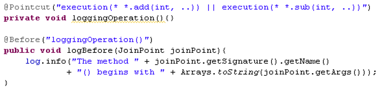

# Spring

<font color="green">*@Author:hanguixian*</font> 

<font color="green">*@Email:hn_hanguixian@163.com*</font>   

---------------

## 一 Spring是什么？

- Spring 是一个开源框架.

- Spring 为简化企业级应用开发而生. 使用 Spring 可以使简单的 JavaBean 实现以前只有 EJB 才能实现的功能.

- Spring 是一个 IOC(DI) 和 AOP 容器框架.

- 具体描述 Spring:

  - 轻量级：Spring 是非侵入性的 - 基于 Spring 开发的应用中的对象可以不依赖于 Spring 的 API
  - 依赖注入(DI --- dependency injection、IOC)
  - 面向切面编程(AOP --- aspect oriented programming)
  - 容器: Spring 是一个容器, 因为它包含并且管理应用对象的生命周期
  - 框架: Spring 实现了使用简单的组件配置组合成一个复杂的应用. 在 Spring 中可以使用 XML 和 Java 注解组合这些对象
  - 一站式：在 IOC 和 AOP 的基础上可以整合各种企业应用的开源框架和优秀的第三方类库 （实际上 Spring 自身也提供了展现层的 SpringMVC 和 持久层的 Spring JDBC）

- spring模块

  


## 二 第一个spring项目

### 2.1 搭建spring环境：spring依赖jar包（gradle）

```gradle
dependencies {
    // https://mvnrepository.com/artifact/org.springframework/spring-context
    compile group: 'org.springframework', name: 'spring-context', version: '5.0.8.RELEASE'
    compile group: 'junit', name: 'junit', version: '4.12'
}
```

### 2.2   建立spring项目 

- Spring 的配置文件: 一个典型的 Spring 项目需要创建一个或多个 Bean 配置文件, 这些配置文件用于在 Spring IOC 容器里配置 Bean. Bean 的配置文件可以放在 classpath 下, 也可以放在其它目录下. 

### 2.3 HelloWorld

- HelloWorld.java

```java
public class HelloWorld {

    private String user;

    public HelloWorld() {
        System.out.println("HelloWorld's constructor...");
    }

    public void setUser(String user) {
        System.out.println("setUser:" + user);
        this.user = user;
    }

    public HelloWorld(String user) {
        this.user = user;
    }

    public void hello(){
        System.out.println("Hello: " + user);
    }

}
```


- applicationContext.xml

```xml
<?xml version="1.0" encoding="UTF-8"?>
<beans xmlns="http://www.springframework.org/schema/beans"
       xmlns:xsi="http://www.w3.org/2001/XMLSchema-instance" xmlns:p="http://www.springframework.org/schema/p"
       xsi:schemaLocation="http://www.springframework.org/schema/beans http://www.springframework.org/schema/beans/spring-beans.xsd">

    <!-- 配置一个 bean -->
    <bean id="helloWorld" class="xxxx.xxxx.HelloWorld">
        <!-- 为属性赋值 -->
        <property name="user" value="Jerry"></property>
    </bean>

</beans>
```

- test

  ```java
  public class TestBean {
  
  	private static ClassPathXmlApplicationContext context;
  
      static {
          context = new ClassPathXmlApplicationContext("applicationContext.xml");
      }
  
      @Test
      public void testBean() {
          HelloWorld helloWorld = context.getBean("helloWorld", HelloWorld.class);
          System.out.println(helloWorld);
      }
  }
  ```


## 三 Spring中Bean的配置

### 3.1   IOC & DI 概述  

- IOC(Inversion of Control)：其思想是反转资源获取的方向. 传统的资源查找方式要求组件向容器发起请求查找资源. 作为回应, 容器适时的返回资源. 而应用了 IOC 之后, 则是容器主动地将资源推送给它所管理的组件, 组件所要做的仅是选择一种合适的方式来接受资源. 这种行为也被称为查找的被动形式
- DI(Dependency Injection) — IOC 的另一种表述方式：即组件以一些预先定义好的方式(例如: setter 方法)接受来自如容器的资源注入. 相对于 IOC 而言，这种表述更直接

### 3.2 配置 bean

#### 3.2.1 概要

- 配置形式：基于 XML 文件的方式；基于注解的方式
- Bean 的配置方式：通过全类名（反射）、通过工厂方法（静态工厂方法 & 实例工厂方法）、FactoryBean
- IOC 容器 BeanFactory & ApplicationContext 概述
- 依赖注入的方式：属性注入；构造器注入
- 注入属性值细节
- 自动转配
- bean 之间的关系：继承；依赖
- bean 的作用域：singleton；prototype；WEB 环境作用域
- 使用外部属性文件
- spEL 
- IOC 容器中 Bean 的生命周期
- Spring 4.x 新特性：泛型依赖注入


#### 3.2.2 在 Spring 的 IOC 容器里配置 Bean

- 在 xml 文件中通过 bean 节点来配置 bean 
  - id：Bean 的名称。
    - 在 IOC 容器中必须是唯一的
    - 若 id 没有指定，Spring 自动将权限定性类名作为 Bean 的名字
    - id 可以指定多个名字，名字之间可用逗号、分号、或空格分隔


#### 3.2.3 Spring IOC 容器

- 在 Spring IOC 容器读取 Bean 配置创建 Bean 实例之前, 必须对它进行实例化. 只有在容器实例化后, 才可以从 IOC 容器里获取 Bean 实例并使用.
- Spring 提供了两种类型的 IOC 容器实现. 
  - BeanFactory: IOC 容器的基本实现.
  - ApplicationContext: 提供了更多的高级特性. 是 BeanFactory 的子接口.
  - BeanFactory 是 Spring 框架的基础设施，面向 Spring 本身；ApplicationContext 面向使用 Spring 框架的开发者，几乎所有的应用场合都直接使用 ApplicationContext 而非底层的 BeanFactory
  - 无论使用何种方式, 配置文件时相同的.
- **ApplicationContext** 的主要实现类：
  - ClassPathXmlApplicationContext：从 类路径下加载配置文件
  - FileSystemXmlApplicationContext: 从文件系统中加载配置文件
  - ConfigurableApplicationContext 扩展于 ApplicationContext，新增加两个主要方法：refresh() 和 close()， 让 ApplicationContext 具有启动、刷新和关闭上下文的能力
  - ApplicationContext 在初始化上下文时就实例化所有单例的 Bean。
  - WebApplicationContext 是专门为 WEB 应用而准备的，它允许从相对于 WEB 根目录的路径中完成初始化工作


- 从 IOC 容器中获取 Bean 

  


#### 3.2.4 依赖注入的方式 

- Spring 支持 3 种依赖注入的方式
  - 属性注入
  - 构造器注入
  - 工厂方法注入（很少使用，不推荐）

##### 3.2.4.1属性注入 

- 属性注入即通过 setter 方法注入Bean 的属性值或依赖的对象
- 属性注入使用 `<property>` 元素, 使用 name 属性指定 Bean 的属性名称，value 属性或 `<value>` 子节点指定属性值 
- 属性注入是实际应用中最常用的注入方式

```xml
<!-- 配置一个 bean -->
<bean id="helloWorld2" class="xxxxx.xxx.HelloWorld">
    <!-- 为属性赋值 -->
    <!-- 通过属性注入: 通过 setter 方法注入属性值 -->
    <property name="user" value="Tom"></property>
</bean>
```


##### 3.2.4.2构造方法注入 

- 通过构造方法注入Bean 的属性值或依赖的对象，它保证了 Bean 实例在实例化后就可以使用。
- 构造器注入在` <constructor-arg>` 元素里声明属性, `<constructor-arg> `中没有 name 属性

```xml
<!-- 通过构造器注入属性值 -->
<bean id="helloWorld3" class="xxx.HelloWorld">
    <!-- 要求: 在 Bean 中必须有对应的构造器.  -->
    <constructor-arg value="Mike"></constructor-arg>
</bean>

<!-- 若一个 bean 有多个构造器, 如何通过构造器来为 bean 的属性赋值 -->
<!-- 可以根据 index 和 value 进行更加精确的定位. (了解) -->
<!-- 对应了相应的构造器 -->
<bean id="car" class="xxx.Car">
    <constructor-arg value="KUGA" index="1"></constructor-arg>
    <constructor-arg value="ChangAnFord" index="0"></constructor-arg>
    <constructor-arg value="250000" type="float"></constructor-arg>
</bean>
```


#### 3.2.5 字面值 

- 字面值：可用字符串表示的值，可以通过 `<value>` 元素标签或 value 属性进行注入。
- 基本数据类型及其封装类、String 等类型都可以采取字面值注入的方式
- 若字面值中包含特殊字符，可以使用 <![CDATA[]]> 把字面值包裹起来。

```xml
<bean id="car2" class="xxx.Car">
    <constructor-arg value="ChangAnMazda"></constructor-arg>
    <!-- 若字面值中包含特殊字符, 则可以使用 DCDATA 来进行赋值. (了解) -->
    <constructor-arg>
        <value><![CDATA[<ATARZA>]]></value>
    </constructor-arg>
    <constructor-arg value="180" type="int"></constructor-arg>
</bean>
```


#### 3.2.6 引用其它 Bean 

- 组成应用程序的 Bean 经常需要相互协作以完成应用程序的功能. 要使 Bean 能够相互访问, 就必须在 Bean 配置文件中指定对 Bean 的引用
- 在 Bean 的配置文件中, 可以通过 `<ref>` 元素或 ref  属性为 Bean 的属性或构造器参数指定对 Bean 的引用. 
- 也可以在属性或构造器里包含 Bean 的声明, 这样的 Bean 称为内部 Bean

```xml
<bean id="dao5" class="xxx.Dao"></bean>

<bean id="service" class="xxx.Service">
    <!-- 通过 ref 属性值指定当前属性指向哪一个 bean! -->
    <property name="dao" ref="dao5"></property>
</bean>
```


#### 3.2.7 内部 Bean 

- 当 Bean 实例仅仅给一个特定的属性使用时, 可以将其声明为内部 Bean. 内部 Bean 声明直接包含在` <property> `或 `<constructor-arg> `元素里, 不需要设置任何 id 或 name 属性
- 内部 Bean 不能使用在任何其他地方

```xml
<!-- 声明使用内部 bean -->
<bean id="service2" class="xxx.Service">
    <property name="dao">
        <!-- 内部 bean, 类似于匿名内部类对象. 不能被外部的 bean 来引用, 也没有必要设置 id 属性 -->
        <bean class="xxx.Dao">
            <property name="dataSource" value="c3p0"></property>
        </bean>
    </property>
</bean>
```


#### 3.2.8 注入参数详解：null 值和级联属性 

- 可以使用专用的 `<null/>` 元素标签为 Bean 的字符串或其它对象类型的属性注入 null 值
- 和 Struts、Hiberante 等框架一样，Spring 支持级联属性的配置。

```xml
<bean id="action" class="xxx.Action">
    <property name="service" ref="service2"></property>
    <!-- 设置级联属性(了解) -->
    <property name="service.dao.dataSource" value="DBCP2"></property>
</bean>

<bean id="dao2" class="xxx.Dao">
    <!-- 为 Dao 的 dataSource 属性赋值为 null, 若某一个 bean 的属性值不是 null, 使用时需要为其设置为 null(了解) -->
    <property name="dataSource"><null/></property>
</bean>
```


#### 3.2.9 集合属性 

- 在 Spring中可以通过一组内置的 xml 标签(例如: `<list>`, `<set>` 或` <map>`) 来配置集合属性.
- 配置 java.util.List 类型的属性, 需要指定` <list> ` 标签, 在标签里包含一些元素. 这些标签可以通过` <value>` 指定简单的常量值, 通过 `<ref>` 指定对其他 Bean 的引用. 通过`<bean>` 指定内置 Bean 定义. 通过` <null/> `指定空元素. 甚至可以内嵌其他集合.
- 数组的定义和 List 一样, 都使用 `<list>`
- 配置 java.util.Set 需要使用 `<set>` 标签, 定义元素的方法与 List 一样.
- Java.util.Map 通过 `<map>` 标签定义, `<map> `标签里可以使用多个` <entry> `作为子标签. 每个条目包含一个键和一个值. 
- 必须在 `<key>` 标签里定义键
- 因为键和值的类型没有限制, 所以可以自由地为它们指定` <value>`, `<ref>`, `<bean>` 或 `<null>` 元素. 
- 可以将 Map 的键和值作为` <entry>` 的属性定义: 简单常量使用 key 和 value 来定义; Bean 引用通过 key-ref 和 value-ref 属性定义
- 使用 `<props> `定义 java.util.Properties, 该标签使用多个 `<prop>` 作为子标签. 每个 `<prop>` 标签必须定义 key 属性. 


```xml
<!-- 装配集合属性 -->
<bean id="user" class="xxx.User">
    <property name="userName" value="Jack"></property>
    <property name="cars">
        <!-- 使用 list 元素来装配集合属性 -->
        <list>
            <ref bean="car"/>
            <ref bean="car2"/>
        </list>
    </property>
</bean>
```


#### 3.2.10 使用 utility scheme 定义集合

- 使用基本的集合标签定义集合时, 不能将集合作为独立的 Bean 定义, 导致其他 Bean 无法引用该集合, 所以无法在不同 Bean 之间共享集合.
- 可以使用 util schema 里的集合标签定义独立的集合 Bean. 需要注意的是, 必须在 <beans> 根元素里添加 util schema 定义

```xml
<!-- 声明集合类型的 bean -->
<util:list id="cars">
    <ref bean="car"/>
    <ref bean="car2"/>
</util:list>

<bean id="user2" class="xxx.User">
    <property name="userName" value="Rose"></property>
    <!-- 引用外部声明的 list -->
    <property name="cars" ref="cars"></property>
</bean>
```


#### 3.2.11 使用 p 命名空间 

- 为了简化 XML 文件的配置，越来越多的 XML 文件采用属性而非子元素配置信息。
- Spring 从 2.5 版本开始引入了一个新的 p 命名空间，可以通过 `<bean> `元素属性的方式配置 Bean 的属性。
- 使用 p 命名空间后，基于 XML 的配置方式将进一步简化

```xml
<bean id="user3" class="xxx.User" p:cars-ref="cars" p:userName="Titannic"></bean>
```


#### 3.2.12 XML 配置里的 Bean 自动装配 

- Spring IOC 容器可以自动装配 Bean. 需要做的仅仅是在 `<bean>` 的 autowire 属性里指定自动装配的模式
- byType(根据类型自动装配): 若 IOC 容器中有多个与目标 Bean 类型一致的 Bean. 在这种情况下, Spring 将无法判定哪个 Bean 最合适该属性, 所以不能执行自动装配.
- byName(根据名称自动装配): 必须将目标 Bean 的名称和属性名设置的完全相同.
- constructor(通过构造器自动装配): 当 Bean 中存在多个构造器时, 此种自动装配方式将会很复杂. **不推荐使用**

```xml
<!-- 自动装配: 只声明 bean, 而把 bean 之间的关系交给 IOC 容器来完成 -->
<!--  
  byType: 根据类型进行自动装配. 但要求 IOC 容器中只有一个类型对应的 bean, 若有多个则无法完成自动装配.
  byName: 若属性名和某一个 bean 的 id 名一致, 即可完成自动装配. 若没有 id 一致的, 则无法完成自动装配
 -->
<!-- 在使用 XML 配置时, 自动转配用的不多. 但在基于 注解 的配置时, 自动装配使用的较多.  -->
<bean id="car" class="xxx.Car" p:id="45949" p:name="kksssk"></bean>
<!--Person{Car car} ,Person 有Car 类型的 car 属性-->
<bean id="person" class="xxx.Person" autowire="byName"></bean>
```

- XML 配置里的 Bean 自动装配的缺点 
  - 在 Bean 配置文件里设置 autowire 属性进行自动装配将会装配 Bean 的所有属性. 然而, 若只希望装配个别属性时, autowire 属性就不够灵活了. 
  - autowire 属性要么根据类型自动装配, 要么根据名称自动装配, 不能两者兼而有之.
  - 一般情况下，在实际的项目中很少使用自动装配功能，因为和自动装配功能所带来的好处比起来，明确清晰的配置文档更有说服力一些

####  3.2.13 继承 Bean 配置&依赖 Bean 配置  

##### 3.2.13.1 继承 Bean 配置

- Spring 允许继承 bean 的配置, 被继承的 bean 称为父 bean. 继承这个父 Bean 的 Bean 称为子 Bean
- 子 Bean 从父 Bean 中继承配置, 包括 Bean 的属性配置
- 子 Bean 也可以覆盖从父 Bean 继承过来的配置
- 父 Bean 可以作为配置模板, 也可以作为 Bean 实例. 若只想把父 Bean 作为模板, 可以设置 <bean> 的abstract 属性为 true, 这样 Spring 将不会实例化这个 Bean
- 并不是 `<bean>` 元素里的所有属性都会被继承. 比如: autowire, abstract 等.
- 也可以忽略父 Bean 的 class 属性, 让子 Bean 指定自己的类, 而共享相同的属性配置. 但此时 abstract 必须设为 true

##### 3.2.13.2 依赖 Bean 配置 
- Spring 允许用户通过 depends-on 属性设定 Bean 前置依赖的Bean，前置依赖的 Bean 会在本 Bean 实例化之前创建好
- 如果前置依赖于多个 Bean，则可以通过逗号，空格或的方式配置 Bean 的名称

```xml
<!-- bean 的配置能够继承吗 ? 使用 parent 来完成继承 -->	
<bean id="user4" parent="user" p:userName="Bob"></bean>

<bean id="user6" parent="user" p:userName="维多利亚"></bean>

<!-- 测试 depents-on -->	
<bean id="user5" parent="user" p:userName="Backham" depends-on="user6"></bean>
```


#### 3.2.14 Bean 的作用域 

- 在 Spring 中, 可以在 `<bean>` 元素的 scope 属性里设置 Bean 的作用域. 
- 默认情况下, Spring 只为每个在 IOC 容器里声明的 Bean 创建唯一一个实例, 整个 IOC 容器范围内都能共享该实例：所有后续的 getBean() 调用和 Bean 引用都将返回这个唯一的 Bean 实例.该作用域被称为 **singleton**, 它是所有 Bean 的默认作用域.


#### 3.2.15 使用外部属性文件 

- •在配置文件里配置 Bean 时, 有时需要在 Bean 的配置里混入系统部署的细节信息(例如: 文件路径, 数据源配置信息等). 而这些部署细节实际上需要和 Bean 配置相分离
- Spring 提供了一个 **PropertyPlaceholderConfigurer** 的 BeanFactory 后置处理器, 这个处理器允许用户将 Bean 配置的部分内容外移到属性文件中. 可以在 Bean 配置文件里使用形式为 ${var} 的变量, PropertyPlaceholderConfigurer 从属性文件里加载属性, 并使用这些属性来替换变量.
- Spring 还允许在属性文件中使用 ${propName}，以实现属性之间的相互引用。

```xml
<!-- 导入外部的资源文件 -->
<context:property-placeholder location="classpath:db.properties"/>
	
<!-- 配置数据源 -->
<bean id="dataSource" class="com.mchange.v2.c3p0.ComboPooledDataSource">
    <property name="user" value="${jdbc.user}"></property>
    <property name="password" value="${jdbc.password}"></property>
    <property name="driverClass" value="${jdbc.driverClass}"></property>
    <property name="jdbcUrl" value="${jdbc.jdbcUrl}"></property>

    <property name="initialPoolSize" value="${jdbc.initPoolSize}"></property>
    <property name="maxPoolSize" value="${jdbc.maxPoolSize}"></property>
</bean>
```


#### 3.2.16 Spring表达式语言：SpEL  

- Spring 表达式语言（简称SpEL）：是一个支持运行时查询和操作对象图的强大的表达式语言。
- 语法类似于 EL：SpEL 使用 #{…} 作为定界符，所有在大框号中的字符都将被认为是 SpEL
- SpEL 为 bean 的属性进行动态赋值提供了便利
- 通过 SpEL 可以实现：
  - 通过 bean 的 id 对 bean 进行引用
  - 调用方法以及引用对象中的属性
  - 计算表达式的值
  - 正则表达式的匹配

##### 3.2.16.1 字面量的表示：

- 整数：`<property name="count" value="#{5}"/>`
- 小数：`<property name="frequency" value="#{89.7}"/>`
- 科学计数法：`<property name="capacity" value="#{1e4}"/>`
- String可以使用单引号或者双引号作为字符串的定界符号：`<property name=“name” value="#{'Chuck'}"/> 或 <property name='name' value='#{"Chuck"}'/>`
- Boolean：`<property name="enabled" value="#{false}"/>`

##### 3.2.16.2 SpEL：引用 Bean、属性和方法 

- 引用其他对象 
- 引用其他对象的属性
- 调用其他方法，还可以链式操作 
- •调用静态方法或静态属性：通过 T() 调用一个类的静态方法，它将返回一个 Class Object，然后再调用相应的方法或属性： 

```xml
<bean id="girl" class="xxx.User">
    <property name="userName" value="周迅"></property>
</bean>
<bean id="boy" class="xxxx.User" >
    <property name="userName" value="高胜远"></property>
    <property name="wifeName" value="#{girl.userName}"></property>
</bean>

<bean id="car" class="xxx.Car" p:id="45949" p:name="kksssk"></bean>
<bean id="person2" class="xxx.Person">
    <property name="car" value="#{car}"></property>
 	<property name="id" value="#{T(java.lang.Math).abs(23)}"></property>
</bean>

<bean id="car2" class="xxx.Car">
    <property name="id" value="#{car.getId()}"></property>
    <property name="name" value="#{person2.car.name}"></property>
</bean>
```

##### 3.2.16.3 SpEL支持的运算符号 

- 逻辑运算符号： and, or, not, | 
- if-else 运算符：?: (ternary), ?: (Elvis) 
- •正则表达式：matches 


#### 3.2.17  IOC 容器中Bean的生命周期 

##### 3.2.17.1  IOC 容器中Bean的生命周期方法

- Spring IOC 容器可以管理 Bean 的生命周期, Spring 允许在 Bean 生命周期的特定点执行定制的任务. 
- Spring IOC 容器对 Bean 的生命周期进行管理的过程:
  - 通过构造器或工厂方法创建 Bean 实例
  - 为 Bean 的属性设置值和对其他 Bean 的引用
  - 调用 Bean 的初始化方法
  - Bean 可以使用了
  - 当容器关闭时, 调用 Bean 的销毁方法
- 在 Bean 的声明里设置 init-method 和 destroy-method 属性, 为 Bean 指定初始化和销毁方法.

##### 3.2.17.2 创建 Bean后置处理器

- Bean 后置处理器允许在调用初始化方法前后对 Bean 进行额外的处理.
- Bean 后置处理器对 IOC 容器里的所有 Bean 实例逐一处理, 而非单一实例. 其典型应用是: 检查 Bean 属性的正确性或根据特定的标准更改 Bean 的属性.
- 对Bean 后置处理器而言, 需要实现 `org.springframework.beans.factory.config.BeanPostProcessor`                         接口. 在初始化方法被调用前后, Spring 将把每个 Bean 实例分别传递给上述接口的以下两个方法:

```java
public interface BeanPostProcessor {
	@Nullable
	default Object postProcessBeforeInitialization(Object bean, String beanName) throws BeansException {
		return bean;
	}
	@Nullable
	default Object postProcessAfterInitialization(Object bean, String beanName) throws BeansException {
		return bean;
	}
}
```


##### 3.2.17.3 添加Bean后置处理器后Bean的生命周期 

- Spring IOC 容器对 Bean 的生命周期进行管理的过程:
  - 通过构造器或工厂方法创建 Bean 实例
  - 为 Bean 的属性设置值和对其他 Bean 的引用
  - 将 Bean 实例传递给 Bean 后置处理器的 postProcessBeforeInitialization 方法
  - 调用 Bean 的初始化方法
  - 将 Bean 实例传递给 Bean 后置处理器的 postProcessAfterInitialization方法
  - Bean 可以使用了
  - 当容器关闭时, 调用Bean的销毁方法


 - MyBeanPostProcessor.java
```java
public class MyBeanPostProcessor implements BeanPostProcessor {
    @Override
    public Object postProcessBeforeInitialization(Object bean, String beanName) throws BeansException {
        System.out.println("postProcessBeforeInitialization---->bean:"+bean + ",beanName:"+beanName);
        return bean;
    }

    @Override
    public Object postProcessAfterInitialization(Object bean, String beanName) throws BeansException {
        System.out.println("postProcessAfterInitialization---->bean:"+bean + ",beanName:"+beanName);
        return bean;
    }
}
```

 - Car.java
```java
public class Car {

    private Integer id ;
    private String name ;

    public void init(){
        System.out.println("init ...");
    }
    public void destroy(){
        System.out.println("destroy ....");
    }
    public Car() {
        System.out.println("Car's Constructor  ...");
    }
    public Integer getId() {
        return id;
    }
    public void setId(Integer id) {
        System.out.println("设置id");
        this.id = id;
    }
    public String getName() {
        return name;
    }
    public void setName(String name) {
        this.name = name;
    }
}
```

- application.xml 中配置bean

```xml
<bean id="car" class="xxx.Car" p:id="45949" p:name="kksssk" init-method="init" destroy-method="destroy"></bean>
<!-- 配置 bean 后置处理器: 不需要配置 id 属性, IOC 容器会识别到他是一个 bean 后置处理器, 并调用其方法 -->
<bean class="xxx.MyBeanPostProcessor"></bean>
```


#### 3.2.18 通过工厂方法配置Bean(静态工厂方法 & 实例工厂方法&)

##### 3.2.18.1 静态工厂方法

- 调用静态工厂方法创建 Bean是将对象创建的过程封装到静态方法中. 当客户端需要对象时, 只需要简单地调用静态方法, 而不同关心创建对象的细节.
- 要声明通过静态方法创建的 Bean, 需要在 Bean 的 class 属性里指定拥有该工厂的方法的类, 同时在 factory-method 属性里指定工厂方法的名称. 最后, 使用 `<constrctor-arg> `元素为该方法传递方法参数.

- CarStaticFactory.java

```java
public class CarStaticFactory {
    private static Map<Integer, Car> cars = new HashMap<>();
    static {
        cars.put(1, new Car(1, "大奔"));
        cars.put(2, new Car(2, "劳斯莱斯"));
    }
    public static Car getCar(Integer id) {
        return cars.get(2);
    }
}
```

- applicationContext.xml

```xml
<!-- 通过工厂方法的方式来配置 bean -->
<!-- 1. 通过静态工厂方法: 一个类中有一个静态方法, 可以返回一个类的实例 -->
<!-- 在class中指定静态工厂方法的全类名, 在factory-method中指定静态工厂方法的方法名 -->
<bean class="xxx.CarStaticFactory" id="car3" factory-method="getCar">
        <constructor-arg value="1"></constructor-arg>
</bean>
```

##### 3.2.18.2 实例工厂方法 

- 实例工厂方法: 将对象的创建过程封装到另外一个对象实例的方法里. 当客户端需要请求对象时, 只需要简单的调用该实例方法而不需要关心对象的创建细节.
- 要声明通过实例工厂方法创建的 Bean
  - 在 bean 的 factory-bean 属性里指定拥有该工厂方法的 Bean
  - 在 factory-method 属性里指定该工厂方法的名称
  - 使用 construtor-arg 元素为工厂方法传递方法参数

- CarInstanceFactory.java

```java
public class CarInstanceFactory {
    private Map<Integer,Car> cars ;

    public CarInstanceFactory() {
        cars = new HashMap<>() ;
        cars.put(1, new Car(1, "大奔"));
        cars.put(2, new Car(2, "劳斯莱斯"));
    }
    public Car getCar(Integer id){
        return cars.get(id) ;
    }
}

```

- applicationContext.xml

```xml
<!-- 2. 实例工厂方法: 先需要创建工厂对象, 再调用工厂的非静态方法返回实例 -->
<!-- ①. 创建工厂对应的 bean -->
<bean class="xxx.CarInstanceFactory" id="carInstanceFactory"></bean>
<!-- ②. 有实例工厂方法来创建 bean 实例 -->
<!-- factory-bean 指向工厂 bean, factory-method 指定工厂方法 -->
<bean class="xxx.Car" id="car4" factory-bean="carInstanceFactory" factory-method="getCar">
    <constructor-arg value="1"></constructor-arg>
</bean>
```


##### 3.2.18.3 FactoryBean

- Spring 中有两种类型的 Bean, 一种是普通Bean, 另一种是工厂Bean, 即FactoryBean. 
- 工厂 Bean 跟普通Bean不同, 其返回的对象不是指定类的一个实例, 其返回的是该工厂 Bean 的 getObject 方法所返回的对象 
- CarFactoryBean.java

```java
public class CarFactoryBean implements FactoryBean<Car> {

    //返回Bean的对象
    @Override
    public Car getObject() throws Exception {
        return new Car(1,"大奔");
    }
    //返回Bean的类型
    @Override
    public Class<?> getObjectType() {
        return Car.class;
    }
    //返回的实例是不是单实例的
    @Override
    public boolean isSingleton() {
        return true;
    }
}
```

- applicationContext.xml

```xml
 <bean class="com.ifox.hgx.spring.factory.CarFactoryBean" id="car5"></bean>
```


#### 3.2.19 注解的方式配置Bean

##### 3.2.19.1 在 classpath 中扫描组件 

- 组件扫描(component scanning):  Spring 能够从 classpath 下自动扫描, 侦测和实例化具有特定注解的组件. 

- 特定组件包括:

  - @Component: 基本注解, 标识了一个受 Spring 管理的组件
  - @Respository: 标识持久层组件
  - @Service: 标识服务层(业务层)组件
  - @Controller: 标识表现层组件

- 对于扫描到的组件, Spring 有默认的命名策略: 使用非限定类名, 第一个字母小写. 也可以在注解中通过 value 属性值标识组件的名称

- 当在组件类上使用了特定的注解之后, 还需要在 Spring 的配置文件中声明 `<context:component-scan>` ：

  - base-package 属性指定一个需要扫描的基类包，Spring 容器将会扫描这个基类包里及其子包中的所有类. 

  - 当需要扫描多个包时, 可以使用逗号分隔.

  - 如果仅希望扫描特定的类而非基包下的所有类，可使用 `resource-pattern` 属性过滤特定的类，示例：

    - `<context:include-filter>` 子节点表示要包含的目标类

    - `<context:exclude-filter>` 子节点表示要排除在外的目标类
    - `<context:component-scan>` 下可以拥有若干个` <context:include-filter>` 和 `<context:exclude-filter>` 子节点

  - `<context:include-filter>` 和` <context:exclude-filter> `子节点支持多种类型的过滤表达式： 


| 类别       | 示例                  | 说明                                                         |
| ---------- | --------------------- | ------------------------------------------------------------ |
| annotation | com.xxx.XxxAnnotation | 所有标注了XxxAnnotation的类。该类型采用目标类是否标注了某个注解进行过滤 |
| assinable  | com.xxx.XxxService    | 所有继承或扩展XxService的类。该类型采用目标类是否继承或扩展某个特定类进行过滤 |
| aspectj    | com.xxx.. Service+    | 所有类名以Service结束的类及继承或扩展它们的类。该类型采用AspejctJ表达式进行过滤 |
| regex      | com.\xxx\.anno..*     | 所有com.xxx.anno包下的类。该类型采用正则表达式根据类的类名进行过滤 |
| custom     | com.xxx.XxxTypeFilter | 该类采用XxxTypeFilter通过代码的方式定义过滤规则。必须实现org.springframework.core.type.TypeFiter接口 |


- beans-annotation.xml

```xml
<!-- 配置自动扫描的包: 需要加入 aop 对应的 jar 包 -->
<context:component-scan base-package="xxxx.annotation"></context:component-scan>
```

- java类

```java
//controller
@Controller
public class UserCnntroller {
    public void execute(){
        System.out.println("UserController,execute ...");
    }
}

//serice
public interface UserService {
  void getUser() ;
}
//serviceImpl
@Service("userService")
public class UserServiceImpl implements UserService {
    public void getUser(){
        System.out.println("UserServiceImpl,getUser");
    }
}

//repository
@Repository
public class UserDao {
    public void save(){
        System.out.println("UserDao,save");
    }
}
```

- test

```java
public class TestAnnotation {
    private static ClassPathXmlApplicationContext context;

    static {
        context = new ClassPathXmlApplicationContext("beans-annotation.xml");
    }

    @Test
    public void test1() {
        String[] s = context.getBeanDefinitionNames();
        for (String name : s) {
            System.out.println(name);
        }
         
    @Test
    public void  test2(){
            UserService userService = context.getBean(UserServiceImpl.class) ;
            userService.getUser();
    	}
    }
```


##### 3.2.19.2 组件装配

- `<context:component-scan>` 元素还会自动注册 `AutowiredAnnotationBeanPostProcessor` 实例, 该实例可以自动装配具有 `@Autowired `和 `@Resource` 、`@Inject`注解的属性. 
- 使用 @Autowired 自动装配 Bean
  - @Autowired 注解自动装配具有兼容类型的单个 Bean属性
    - 构造器, 普通字段(即使是非public), 一切具有参数的方法都可以应用@Authwired 注解
    - 默认情况下, 所有使用 @Authwired 注解的属性都需要被设置. 当 Spring 找不到匹配的 Bean 装配属性时, 会抛出异常, **若某一属性允许不被设置, 可以设置 @Authwired 注解的 required 属性为 false**
    - 默认情况下, 当 IOC 容器里存在多个类型兼容的 Bean 时, 通过类型的自动装配将无法工作. 此时可以在 **@Qualifier 注解里提供 Bean 的名称. Spring 允许对方法的入参标注 @Qualifiter 已指定注入 Bean 的名称**
    -  @Authwired 注解也可以应用在数组类型的属性上, 此时 Spring 将会把所有匹配的 Bean 进行自动装配.
    - @Authwired 注解也可以应用在集合属性上, 此时 Spring 读取该集合的类型信息, 然后自动装配所有与之兼容的 Bean. 
    - @Authwired 注解用在 `java.util.Map` 上时, 若该 Map 的键值为 String, 那么 Spring 将自动装配与之 Map 值类型兼容的 Bean, 此时 Bean 的名称作为键值
- 使用 @Resource 或 @Inject   自动装配 Bean
  - Spring 还支持 @Resource 和 @Inject 注解，这两个注解和 @Autowired 注解的功用类似
  - @Resource 注解要求提供一个 Bean 名称的属性，若该属性为空，则自动采用标注处的变量或方法名作为 Bean 的名称
  - @Inject 和 @Autowired 注解一样也是按类型匹配注入的 Bean， 但没有 reqired 属性
  - **建议使用 @Autowired 注解**

#### 3.2.20 泛型依赖注入 

- Spring 4.x 中可以为子类注入子类对应的泛型类型的成员变量的引用 


- java代码

```java
//BaseDao
public class BaseDao<T> {
    public void save(T t) {
        System.out.println("dao: save:" + t);

    }
}
//BaseService
public class BaseService<T> {

    @Autowired
    protected BaseDao<T> baseDao ;

    public void save(T t){
        baseDao.save(t);
        System.out.println("service: save" + t);
    }
}

//Student
public class Student {
}

//StudentDao
@Repository
public class StudentDao extends BaseDao<Student> {
}

//StudentService
@Service
public class StudentService extends BaseService<Student> {
}

//TestGeneric
public class TestGeneric {
    private static ClassPathXmlApplicationContext context;
    static {
        context = new ClassPathXmlApplicationContext("beans-annotation.xml");
    }
    
    @Test
    public void test1(){
        StudentService studentService = context.getBean(StudentService.class) ;
        studentService.save(new Student());
    }
}
```


## 四 Spring AOP

### 4.1 AOP 简介

- AOP(Aspect-Oriented Programming, 面向切面编程): 是一种新的方法论, 是对传统 OOP(Object-Oriented Programming, 面向对象编程) 的补充.
- AOP 的主要编程对象是切面(aspect), 而切面模块化横切关注点.
- 在应用 AOP 编程时, 仍然需要定义公共功能, 但可以明确的定义这个功能在哪里, 以什么方式应用, 并且不必修改受影响的类. 这样一来横切关注点就被模块化到特殊的对象(切面)里.
- AOP 的好处:
  - 每个事物逻辑位于一个位置, 代码不分散, 便于维护和升级
  - 业务模块更简洁, 只包含核心业务代码.


### 4.2 AOP 术语

- 切面(Aspect):  横切关注点(跨越应用程序多个模块的功能)被模块化的特殊对象
- 通知(Advice):  切面必须要完成的工作
- 目标(Target): 被通知的对象
- 代理(Proxy): 向目标对象应用通知之后创建的对象
- 连接点（Joinpoint）：程序执行的某个特定位置：如类某个方法调用前、调用后、方法抛出异常后等。连接点由两个信息确定：方法表示的程序执行点；相对点表示的方位。例如 ArithmethicCalculator#add() 方法执行前的连接点，执行点为 ArithmethicCalculator#add()； 方位为该方法执行前的位置
- 切点（pointcut）：每个类都拥有多个连接点：例如 ArithmethicCalculator 的所有方法实际上都是连接点，即连接点是程序类中客观存在的事务。AOP 通过切点定位到特定的连接点。类比：连接点相当于数据库中的记录，切点相当于查询条件。切点和连接点不是一对一的关系，一个切点匹配多个连接点，切点通过 org.springframework.aop.Pointcut 接口进行描述，它使用类和方法作为连接点的查询条件。

### 4.3 AspectJ 

- Java 社区里最完整最流行的 AOP 框架.在 Spring2.0 以上版本中, 可以使用基于 AspectJ 注解或基于 XML 配置的 AOP

#### 4.3.1 在 Spring 中启用 AspectJ 注解支持

- 要在 Spring 应用中使用 AspectJ 注解, 必须在 classpath 下包含 AspectJ 类库: aopalliance.jar、aspectj.weaver.jar 和 spring-aspects.jar
- 将 aop Schema 添加到 `<beans> `根元素中.
- 要在 Spring IOC 容器中启用 AspectJ 注解支持, 只要在 Bean 配置文件中定义一个空的 XML 元素 `<aop:aspectj-autoproxy>`
- 当 Spring IOC 容器侦测到 Bean 配置文件中的 `<aop:aspectj-autoproxy> `元素时, 会自动为与 AspectJ 切面匹配的 Bean 创建代理.

#### 4.3.2 用 AspectJ 注解声明切面 

- 要在 Spring 中声明 AspectJ 切面, 只需要在 IOC 容器中将切面声明为 Bean 实例. 当在 Spring IOC 容器中初始化 AspectJ 切面之后, Spring IOC 容器就会为那些与 AspectJ 切面相匹配的 Bean 创建代理.
- 在 AspectJ 注解中, 切面只是一个带有 @Aspect 注解的 Java 类. 
- 通知是标注有某种注解的简单的 Java 方法.
- AspectJ 支持 5 种类型的通知注解: 
  - @Before: 前置通知, 在方法执行之前执行
  - @After: 后置通知, 在方法执行之后执行 
  - @AfterRunning: 返回通知, 在方法返回结果之后执行
  - @AfterThrowing: 异常通知, 在方法抛出异常之后
  - @Around: 环绕通知, 围绕着方法执行
- **前置通知**
  -  在方法执行之前执行的通知
  - 前置通知使用 @Before 注解, 并将切入点表达式的值作为注解值.
- **后置通知**
  - 后置通知是在连接点完成之后执行的, 即连接点返回结果或者抛出异常的时候, 下面的后置通知记录了方法的终
- **返回通知**
  - 无论连接点是正常返回还是抛出异常, 后置通知都会执行. 如果只想在连接点返回的时候记录日志, 应使用返回通知代替后置通知.
  - **在返回通知中访问连接点的返回值** 
    - 在返回通知中, 只要将 returning 属性添加到 @AfterReturning 注解中, 就可以访问连接点的返回值. 该属性的值即为用来传入返回值的参数名称. 
    - 必须在通知方法的签名中添加一个同名参数. 在运行时, Spring AOP 会通过这个参数传递返回值.
    - 原始的切点表达式需要出现在 pointcut 属性中
- **异常通知**
  - 只在连接点抛出异常时才执行异常通知
  - 将 throwing 属性添加到 @AfterThrowing 注解中, 也可以访问连接点抛出的异常. Throwable 是所有错误和异常类的超类. 所以在异常通知方法可以捕获到任何错误和异常.
  - 如果只对某种特殊的异常类型感兴趣, 可以将参数声明为其他异常的参数类型. 然后通知就只在抛出这个类型及其子类的异常时才被执行.
- **环绕通知** 
  - 环绕通知是所有通知类型中功能最为强大的, 能够全面地控制连接点. 甚至可以控制是否执行连接点.
  - 对于环绕通知来说, 连接点的参数类型必须是 ProceedingJoinPoint . 它是 JoinPoint 的子接口, 允许控制何时执行, 是否执行连接点.
  - 在环绕通知中需要明确调用 ProceedingJoinPoint 的 proceed() 方法来执行被代理的方法. 如果忘记这样做就会导致通知被执行了, 但目标方法没有被执行.
  - 注意: 环绕通知的方法需要返回目标方法执行之后的结果, 即调用 joinPoint.proceed(); 的返回值, 否则会出现空指针异常


 #### 4.3.3 利用方法签名编写AspectJ 切入点表达式 

- 最典型的切入点表达式时根据方法的签名来匹配各种方法:
  - `execution * xxx.ArithmeticCalculator.*(..)`: 匹配 ArithmeticCalculator 中声明的所有方法,第一个 * 代表任意修饰符及任意返回值. 第二个 * 代表任意方法. `.. `匹配任意数量的参数. 若目标类与接口与该切面在同一个包中, 可以省略包名.
  - `execution public * ArithmeticCalculator.*(..)`: 匹配 ArithmeticCalculator 接口的所有公有方法.
  - `execution public double ArithmeticCalculator.*(..)`: 匹配 ArithmeticCalculator 中返回 double 类型数值的方法
  - `execution public double ArithmeticCalculator.*(double, ..)`: 匹配第一个参数为 double 类型的方法, `.. `匹配任意数量任意类型的参数
  - `execution public double ArithmeticCalculator.*(double, double)`: 匹配参数类型为 double, double 类型的方法.

#### 4.3.4 合并切入点表达式 

- 在 AspectJ 中, 切入点表达式可以通过操作符 &&, ||, ! 结合起来.  



#### 4.3.5 让通知访问当前连接点的细节

- 可以在通知方法中声明一个类型为 JoinPoint 的参数. 然后就能访问链接细节. 如方法名称和参数值. 


#### 4.3.6 实践

- gradle中引入aspectj

```gradle
dependencies {
    compile group: 'org.springframework', name: 'spring-context', version: '5.0.8.RELEASE'
    compile group: 'org.springframework', name: 'spring-aspects', version: '5.0.8.RELEASE'
    compile group: 'junit', name: 'junit', version: '4.12'
}
```

- java逻辑代码

```java
//ArithmeticCalculator
public interface ArithmeticCalculator {
	int add(int i, int j);
	int sub(int i, int j);
	int mul(int i, int j);
	int div(int i, int j);
	
}

//ArithmeticCalculatorImpl
@Component("arithmeticCalculator")
public class ArithmeticCalculatorImpl implements ArithmeticCalculator {

    @Override
    public int add(int i, int j) {
        int result = i + j;
        return result;
    }

    @Override
    public int sub(int i, int j) {
        int result = i - j;
        return result;
    }

    @Override
    public int mul(int i, int j) {
        int result = i * j;
        return result;
    }

    @Override
    public int div(int i, int j) {
        int result = i / j;
        return result;
    }
}
```

- LoggingAspect

```java
//LoggingAspect
@Aspect
@Component
public class LoggingAspect {

    //@Before 表示在目标方法执行之前执行 @Before 标记的方法的方法体.
    //@Before("execution(public int xxx.aop.ArithmeticCalculator.add(int,int))")
    //@Before("execution(public int xxx.aop.*.*(int,int))")
    //@Before("execution(public int xxx.aop.*.*(..))")
    //前置通知, 在方法执行之前执行
    //在方法执行之后执行的代码. 无论该方法是否出现异常
    @Before("execution(* xxx.aop.*.*(..))")
    public void beforeMethod(JoinPoint joinPoint){
        String methodName = joinPoint.getSignature().getName() ;
        List<Object> args = Arrays.asList(joinPoint.getArgs());
        System.out.println("The method"+methodName+" begins" + args);
    }
    
    //后置通知, 在方法执行之后执行 
    //在方法执行之后执行的代码. 无论该方法是否出现异常
    @After("execution(* xxx.aop.*.*(..))")
    public void afterMethod(JoinPoint joinPoint){
        String methodName = joinPoint.getSignature().getName();
        System.out.println("The method " + methodName + " ends");
    }
    
    //返回通知, 在方法返回结果之后执行
    //方法法正常结束执行的代码 返回通知是可以访问到方法的返回值的!
    @AfterReturning(value = "execution(* xxx.aop.*.*(..))",returning = "result")
    public void afterReturning(JoinPoint joinPoint,Object result){
        String methodName = joinPoint.getSignature().getName();
        System.out.println("The method " + methodName + " afterReturning with " + result);
    }

    //异常通知, 在方法抛出异常之后
    //在目标方法出现异常时会执行的代码. 可以访问到异常对象; 且可以指定在出现特定异常时在执行通知代码
    @AfterThrowing(value = "execution(* xxx.aop.*.*(..))",throwing = "ex")
    public void afterThrowing(JoinPoint joinPoint,Exception ex){
        String methodName = joinPoint.getSignature().getName();
        System.out.println("The method " + methodName + " afterThrowing with " + ex);
    }
    
	//异常通知, 在方法抛出异常之后
    @AfterThrowing(value = "execution(* xxx.aop.*.*(..))",throwing = "ex")
    public void afterThrowingNull(JoinPoint joinPoint,NullPointerException ex){
        String methodName = joinPoint.getSignature().getName();
        System.out.println("The method " + methodName + " afterThrowing NullPointerException " + ex);
    }
    
    
    /**
	 * 环绕通知需要携带 ProceedingJoinPoint 类型的参数. 
	 * 环绕通知类似于动态代理的全过程: ProceedingJoinPoint 类型的参数可以决定是否执行目标方法.
	 * 且环绕通知必须有返回值, 返回值即为目标方法的返回值
	 */
    
	/*
	@Around("execution(public int xxx.aop.ArithmeticCalculator.*(..))")
	public Object aroundMethod(ProceedingJoinPoint pjd){
		
		Object result = null;
		String methodName = pjd.getSignature().getName();
		
		try {
			//前置通知
			System.out.println("The method " + methodName + " begins with " + Arrays.asList(pjd.getArgs()));
			//执行目标方法
			result = pjd.proceed();
			//返回通知
			System.out.println("The method " + methodName + " ends with " + result);
		} catch (Throwable e) {
			//异常通知
			System.out.println("The method " + methodName + " occurs exception:" + e);
			throw new RuntimeException(e);
		}
		//后置通知
		System.out.println("The method " + methodName + " ends");
		
		return result;
	}
	*/
}

/**
The methodadd begins[1, 2]
The method add ends
The method add afterReturning with 3
3
The methoddiv begins[3, 0]
The method div ends
The method div afterThrowing with java.lang.ArithmeticException: / by zero
*/
```


- application-aop.xml

```xml
<?xml version="1.0" encoding="UTF-8"?>
<beans xmlns="http://www.springframework.org/schema/beans"
       xmlns:xsi="http://www.w3.org/2001/XMLSchema-instance"
       xmlns:context="http://www.springframework.org/schema/context"
       xmlns:aop="http://www.springframework.org/schema/aop"
       xsi:schemaLocation="http://www.springframework.org/schema/beans http://www.springframework.org/schema/beans/spring-beans.xsd http://www.springframework.org/schema/context http://www.springframework.org/schema/context/spring-context.xsd http://www.springframework.org/schema/aop http://www.springframework.org/schema/aop/spring-aop.xsd">
    <!--自动扫描包-->
    <context:component-scan base-package="xxx.aop "></context:component-scan>
    <!-- 使 AspectJ 的注解起作用 -->
    <aop:aspectj-autoproxy></aop:aspectj-autoproxy>
</beans>
```

- test

```java
public class Main {

    private static ClassPathXmlApplicationContext context;
	static {
        context = new ClassPathXmlApplicationContext("application-aop.xml");
    }
    
    @Test
    public void  test1(){
        ArithmeticCalculator arithmeticCalculator = context.getBean(ArithmeticCalculator.class) ;
        System.out.println(arithmeticCalculator.add(1,2));
        System.out.println(arithmeticCalculator.div(3,2));
    }
}
```


#### 4.3.7 指定切面的优先级 

- 在同一个连接点上应用不止一个切面时, 除非明确指定, 否则它们的优先级是不确定的.
- 切面的优先级可以通过实现 Ordered 接口或利用 @Order 注解指定.
- 实现 Ordered 接口, getOrder() 方法的返回值越小, 优先级越高.
- 若使用 @Order 注解, 序号出现在注解中

```java
@Order(0)
@Aspect
@Component
public class LoggingAspect {}
```


#### 4.3.8 重用切入点 

- 在编写 AspectJ 切面时, 可以直接在通知注解中书写切入点表达式. 但同一个切点表达式可能会在多个通知中重复出现.
- 在 AspectJ 切面中, 可以通过 @Pointcut 注解将一个切入点声明成简单的方法. 切入点的方法体通常是空的, 因为将切入点定义与应用程序逻辑混在一起是不合理的. 
- 切入点方法的访问控制符同时也控制着这个切入点的可见性. 如果切入点要在多个切面中共用, 最好将它们集中在一个公共的类中. 在这种情况下, 它们必须被声明为 public. 在引入这个切入点时, 必须将类名也包括在内. 如果类没有与这个切面放在同一个包中, 还必须包含包名.
- 其他通知可以通过方法名称引入该切入点.

```java
/**
	 * 定义一个方法, 用于声明切入点表达式. 一般地, 该方法中再不需要添入其他的代码. 
	 * 使用 @Pointcut 来声明切入点表达式. 
	 * 后面的其他通知直接使用方法名来引用当前的切入点表达式. 
	 */
	@Pointcut("execution(public int xxx.aop.ArithmeticCalculator.*(..))")
	public void declareJointPointExpression(){}
	
	/**
	 * 在 com.xxx.spring.aop.ArithmeticCalculator 接口的每一个实现类的每一个方法开始之前执行一段代码
	 */
	@Before("declareJointPointExpression()")
	public void beforeMethod(JoinPoint joinPoint){
		String methodName = joinPoint.getSignature().getName();
		Object [] args = joinPoint.getArgs();
		System.out.println("The method " + methodName + " begins with " + Arrays.asList(args));
	}
	
```


#### 4.3.9 用基于 XML 的配置声明切面 

- 除了使用 AspectJ 注解声明切面, Spring 也支持在 Bean 配置文件中声明切面. 这种声明是通过 aop schema 中的 XML 元素完成的.
- 正常情况下, 基于注解的声明要优先于基于 XML 的声明. 通过 AspectJ 注解, 切面可以与 AspectJ 兼容, 而基于 XML 的配置则是 Spring 专有的. 由于 AspectJ 得到越来越多的 AOP 框架支持, 所以以注解风格编写的切面将会有更多重用的机会.
- 基于 XML ---- 声明切面 
  - 当使用 XML 声明切面时, 需要在 `<beans>` 根元素中导入 aop Schema
  - 在 Bean 配置文件中, 所有的 Spring AOP 配置都必须定义在 `<aop:config>` 元素内部. 对于每个切面而言, 都要创建一个` <aop:aspect> `元素来为具体的切面实现引用后端 Bean 实例. 
  - 切面 Bean 必须有一个标示符, 供` <aop:aspect>` 元素引用
- 基于 XML ---- 声明切入点 
  - 切入点使用 `<aop:pointcut>` 元素声明
  - 切入点必须定义在` <aop:aspect> `元素下, 或者直接定义在` <aop:config> `元素下.
    - 定义在` <aop:aspect> `元素下: 只对当前切面有效
    - 定义在` <aop:config> `元素下: 对所有切面都有效
  - 基于 XML 的 AOP 配置不允许在切入点表达式中用名称引用其他切入点. 
- 基于 XML ---- 声明通知 
  - 在 aop Schema 中, 每种通知类型都对应一个特定的 XML 元素. 
  - 通知元素需要使用` <pointcut-ref> `来引用切入点, 或用 `<pointcut> `直接嵌入切入点表达式.  method 属性指定切面类中通知方法的名称.
- 示例
  - java逻辑代码

```java
//ArithmeticCalculator
public interface ArithmeticCalculator {
	int add(int i, int j);
	int sub(int i, int j);
	int mul(int i, int j);
	int div(int i, int j);
	
}

//ArithmeticCalculatorImpl
public class ArithmeticCalculatorImpl implements ArithmeticCalculator {
	@Override
	public int add(int i, int j) {
		int result = i + j;
		return result;
	}
	@Override
	public int sub(int i, int j) {
		int result = i - j;
		return result;
	}
	@Override
	public int mul(int i, int j) {
		int result = i * j;
		return result;
	}
	@Override
	public int div(int i, int j) {
		int result = i / j;
		return result;
	}
}

```


- LoggingAspect 日志切面 & VlidationAspect 校验切面

```java
//LoggingAspect
public class LoggingAspect {
	
	public void beforeMethod(JoinPoint joinPoint){
		String methodName = joinPoint.getSignature().getName();
		Object [] args = joinPoint.getArgs();
		System.out.println("The method " + methodName + " begins with " + Arrays.asList(args));
	}
	
	public void afterMethod(JoinPoint joinPoint){
		String methodName = joinPoint.getSignature().getName();
		System.out.println("The method " + methodName + " ends");
	}
	
	public void afterReturning(JoinPoint joinPoint, Object result){
		String methodName = joinPoint.getSignature().getName();
		System.out.println("The method " + methodName + " ends with " + result);
	}
	
	public void afterThrowing(JoinPoint joinPoint, Exception e){
		String methodName = joinPoint.getSignature().getName();
		System.out.println("The method " + methodName + " occurs excetion:" + e);
	}

	public Object aroundMethod(ProceedingJoinPoint pjd){
		Object result = null;
		String methodName = pjd.getSignature().getName();	
		try {
			System.out.println("The method " + methodName + " begins with " + Arrays.asList(pjd.getArgs()));
			result = pjd.proceed();
			System.out.println("The method " + methodName + " ends with " + result);
		} catch (Throwable e) {
			System.out.println("The method " + methodName + " occurs exception:" + e);
			throw new RuntimeException(e);
		}
		System.out.println("The method " + methodName + " ends");	
		return result;
	}
}

//VlidationAspect
public class VlidationAspect {

	public void validateArgs(JoinPoint joinPoint){
		System.out.println("-->validate:" + Arrays.asList(joinPoint.getArgs()));
	}	
}
```

- test

```java
public class Main {
	
	public static void main(String[] args) {
		
		ApplicationContext ctx = new ClassPathXmlApplicationContext("application-xml.xml");
		ArithmeticCalculator arithmeticCalculator = (ArithmeticCalculator) ctx.getBean("arithmeticCalculator");
		System.out.println(arithmeticCalculator.getClass().getName());
		
		int result = arithmeticCalculator.add(1, 2);
		System.out.println("result:" + result);
		
		result = arithmeticCalculator.div(1000, 0);
		System.out.println("result:" + result);
	}
}
```

-  application-xml.xml

```xml
<?xml version="1.0" encoding="UTF-8"?>
<beans xmlns="http://www.springframework.org/schema/beans"
       xmlns:xsi="http://www.w3.org/2001/XMLSchema-instance" xmlns:aop="http://www.springframework.org/schema/aop"
       xsi:schemaLocation="http://www.springframework.org/schema/beans http://www.springframework.org/schema/beans/spring-beans.xsd http://www.springframework.org/schema/aop http://www.springframework.org/schema/aop/spring-aop.xsd">


    <!-- 配置 bean -->
    <bean id="arithmeticCalculator"
          class="xxx.aop.xml.ArithmeticCalculatorImpl"></bean>

    <!-- 配置切面的 bean. -->
    <bean id="loggingAspect"
          class="xxx.aop.xml.LoggingAspect"></bean>

    <bean id="vlidationAspect"
          class="xxx.xml.VlidationAspect"></bean>

    <!-- 配置 AOP -->
    <aop:config>
        <!-- 配置切点表达式 -->
        <aop:pointcut expression="execution(* xxx.aop.xml.ArithmeticCalculator.*(int, int))"
                      id="pointcut"/>
        <!-- 配置切面及通知 -->
        <aop:aspect ref="loggingAspect" order="2">
            <aop:before method="beforeMethod" pointcut-ref="pointcut"/>
            <aop:after method="afterMethod" pointcut-ref="pointcut"/>
            <aop:after-throwing method="afterThrowing" pointcut-ref="pointcut" throwing="e"/>
            <aop:after-returning method="afterReturning" pointcut-ref="pointcut" returning="result"/>
            <!--
            <aop:around method="aroundMethod" pointcut-ref="pointcut"/>
            -->
        </aop:aspect>
        <aop:aspect ref="vlidationAspect" order="1">
            <aop:before method="validateArgs" pointcut-ref="pointcut"/>
        </aop:aspect>
    </aop:config>
</beans>
```


## 五 JDBC

#### 5.1 JdbcTemplate 简介 

- 为了使 JDBC 更加易于使用, Spring 在 JDBC API 上定义了一个抽象层, 以此建立一个 JDBC 存取框架.
- 作为 Spring JDBC 框架的核心, JDBC 模板的设计目的是为不同类型的 JDBC 操作提供模板方法. 每个模板方法都能控制整个过程, 并允许覆盖过程中的特定任务. 通过这种方式, 可以在尽可能保留灵活性的情况下, 将数据库存取的工作量降到最低.
- 使用 JdbcTemplate 更新数据库 

```java
public <T> T queryForObject(String sql, RowMapper<T> rowMapper, @Nullable Object... args) throws DataAccessException {
    List<T> results = query(sql, args, new RowMapperResultSetExtractor<>(rowMapper, 1));
    return DataAccessUtils.nullableSingleResult(results);
}
```

- 批量更新数据库: 

```java
@Override
public int[] batchUpdate(String sql, List<Object[]> batchArgs) throws DataAccessException {
    return batchUpdate(sql, batchArgs, new int[0]);
}
```

- 使用 JdbcTemplate 查询数据库 

```java
//查询单行	
@Override
@Nullable
public <T> T queryForObject(String sql, RowMapper<T> rowMapper, @Nullable Object... args) throws DataAccessException {
    List<T> results = query(sql, args, new RowMapperResultSetExtractor<>(rowMapper, 1));
    return DataAccessUtils.nullableSingleResult(results);
}
//查询多行
@Override
public <T> List<T> query(String sql, RowMapper<T> rowMapper) throws DataAccessException {
    return result(query(sql, new RowMapperResultSetExtractor<>(rowMapper)));
}
//单值查询
@Override
public <T> T queryForObject(String sql, Class<T> requiredType, @Nullable Object... args) throws DataAccessException {
    return queryForObject(sql, args, getSingleColumnRowMapper(requiredType));
}
```

#### 5.2 简化 JDBC 模板查询

- 每次使用都创建一个 JdbcTemplate 的新实例, 这种做法效率很低下.
- JdbcTemplate 类被设计成为线程安全的, 所以可以再 IOC 容器中声明它的单个实例, 并将这个实例注入到所有的 DAO 实例中.
- JdbcTemplate 也利用了 Java 1.5 的特定(自动装箱, 泛型, 可变长度等)来简化开发
- Spring JDBC 框架还提供了一个 JdbcDaoSupport 类来简化 DAO 实现. 该类声明了 jdbcTemplate 属性, 它可以从 IOC 容器中注入, 或者自动从数据源中创建.

#### 5.3 在 JDBC 模板中使用具名参数

- 在经典的 JDBC 用法中, SQL 参数是用占位符 ? 表示,并且受到位置的限制. 定位参数的问题在于, 一旦参数的顺序发生变化, 就必须改变参数绑定. 
- 在 Spring JDBC 框架中, 绑定 SQL 参数的另一种选择是使用具名参数(named parameter). 
- 具名参数: SQL 按名称(以冒号开头)而不是按位置进行指定. 具名参数更易于维护, 也提升了可读性. 具名参数由框架类在运行时用占位符取代
- 具名参数只在 **NamedParameterJdbcTemplate** 中得到支持 
- 在 SQL 语句中使用具名参数时, 可以在一个 Map 中提供参数值, 参数名为键
- 也可以使用 SqlParameterSource 参数
- 批量更新时可以提供 Map 或 SqlParameterSource 的数组

#### 5.4 案例

- (前置条件：建立相应的数据表)

- gradle加入依赖`

```gradle
compile group: 'org.springframework', name: 'spring-context', version: '5.0.8.RELEASE'
compile group: 'org.springframework', name: 'spring-aspects', version: '5.0.8.RELEASE'
//新增
compile group: 'org.springframework', name: 'spring-jdbc', version: '5.0.8.RELEASE'
compile group: 'com.mchange', name: 'c3p0', version: '0.9.5.2'
compile group: 'mysql', name: 'mysql-connector-java', version: '5.1.47'

//...
compile group: 'junit', name: 'junit', version: '4.12'
```


- javaBean

```java
//Department
public class Department {
	private Integer id;
	private String name;
    //setter,getter ....

}
//Employee
public class Employee {
	private Integer id;
	private String lastName;
	private String email;
	private Integer dpetId;
    //setter,getter ...
}

```

- dao

```java
//DepartmentDao
//不推荐使用 JdbcDaoSupport, 而推荐直接使用 JdbcTempate 作为 Dao 类的成员变量 
@Repository
public class DepartmentDao extends JdbcDaoSupport{
	@Autowired
	public void setDataSource2(DataSource dataSource){
		setDataSource(dataSource);
	}
	public Department get(Integer id){
		String sql = "SELECT id, dept_name name FROM departments WHERE id = ?";
		RowMapper<Department> rowMapper = new BeanPropertyRowMapper<>(Department.class);
		return getJdbcTemplate().queryForObject(sql, rowMapper, id);
	}
}

//EmployeeDao
@Repository
public class EmployeeDao {
	@Autowired
	private JdbcTemplate jdbcTemplate;
	public Employee get(Integer id){
		String sql = "SELECT id, last_name lastName, email FROM employees WHERE id = ?";
		RowMapper<Employee> rowMapper = new BeanPropertyRowMapper<>(Employee.class);
		Employee employee = jdbcTemplate.queryForObject(sql, rowMapper, id);
		return employee;
	}
}
```

- test

```java
public class JDBCTest {
	
	private ApplicationContext ctx = null;
	private JdbcTemplate jdbcTemplate;
	private EmployeeDao employeeDao;
	private DepartmentDao departmentDao;
	private NamedParameterJdbcTemplate namedParameterJdbcTemplate;
	
	{
		ctx = new ClassPathXmlApplicationContext("application-jdbc.xml");
		jdbcTemplate = (JdbcTemplate) ctx.getBean("jdbcTemplate");
		employeeDao = ctx.getBean(EmployeeDao.class);
		departmentDao = ctx.getBean(DepartmentDao.class);
		namedParameterJdbcTemplate = ctx.getBean(NamedParameterJdbcTemplate.class);
	}
	

    /**
	 * 使用具名参数时, 可以使用 update(String sql, SqlParameterSource paramSource) 方法进行更新操作
	 * 1. SQL 语句中的参数名和类的属性一致!
	 * 2. 使用 SqlParameterSource 的 BeanPropertySqlParameterSource 实现类作为参数. 
	 */
	@Test
	public void testNamedParameterJdbcTemplate2(){
		String sql = "INSERT INTO employees(last_name, email, dept_id) "
				+ "VALUES(:lastName,:email,:dpetId)";
		
		Employee employee = new Employee();
		employee.setLastName("XYZ");
		employee.setEmail("xyz@sina.com");
		employee.setDpetId(3);
		
		SqlParameterSource paramSource = new BeanPropertySqlParameterSource(employee);
		namedParameterJdbcTemplate.update(sql, paramSource);
	}

    /**
	 * 可以为参数起名字. 
	 * 1. 好处: 若有多个参数, 则不用再去对应位置, 直接对应参数名, 便于维护
	 * 2. 缺点: 较为麻烦. 
	 */
	@Test
	public void testNamedParameterJdbcTemplate(){
		String sql = "INSERT INTO employees(last_name, email, dept_id) VALUES(:ln,:email,:deptid)";
		
		Map<String, Object> paramMap = new HashMap<>();
		paramMap.put("ln", "FF");
		paramMap.put("email", "ff@xxx.com");
		paramMap.put("deptid", 2);
		
		namedParameterJdbcTemplate.update(sql, paramMap);
	}
	
	@Test
	public void testDepartmentDao(){
		System.out.println(departmentDao.get(1));
	}
	
	@Test
	public void testEmployeeDao(){
		System.out.println(employeeDao.get(1));
	}	

    /**
	 * 获取单个列的值, 或做统计查询
	 * 使用 queryForObject(String sql, Class<Long> requiredType) 
	 */
	@Test
	public void testQueryForObject2(){
		String sql = "SELECT count(id) FROM employees";
		long count = jdbcTemplate.queryForObject(sql, Long.class);
		
		System.out.println(count);
	}

    /**
	 * 查到实体类的集合
	 * 注意调用的不是 queryForList 方法
	 */
	@Test
	public void testQueryForList(){
		String sql = "SELECT id, last_name lastName, email FROM employees WHERE id > ?";
		RowMapper<Employee> rowMapper = new BeanPropertyRowMapper<>(Employee.class);
		List<Employee> employees = jdbcTemplate.query(sql, rowMapper,5);
		
		System.out.println(employees);
	}

    /**
	 * 从数据库中获取一条记录, 实际得到对应的一个对象
	 * 注意不是调用 queryForObject(String sql, Class<Employee> requiredType, Object... args) 方法!
	 * 而需要调用 queryForObject(String sql, RowMapper<Employee> rowMapper, Object... args)
	 * 1. 其中的 RowMapper 指定如何去映射结果集的行, 常用的实现类为 BeanPropertyRowMapper
	 * 2. 使用 SQL 中列的别名完成列名和类的属性名的映射. 例如 last_name lastName
	 * 3. 不支持级联属性. JdbcTemplate 到底是一个 JDBC 的小工具, 而不是 ORM 框架
	 */
	@Test
	public void testQueryForObject(){
		String sql = "SELECT id, last_name lastName, email, dept_id as \"department.id\" FROM employees WHERE id = ?";
		RowMapper<Employee> rowMapper = new BeanPropertyRowMapper<>(Employee.class);
		Employee employee = jdbcTemplate.queryForObject(sql, rowMapper, 1);
		
		System.out.println(employee);
	}
    
	/**
	 * 执行批量更新: 批量的 INSERT, UPDATE, DELETE
	 * 最后一个参数是 Object[] 的 List 类型: 因为修改一条记录需要一个 Object 的数组, 那么多条不就需要多个 Object 的数组吗
	 */
	@Test
	public void testBatchUpdate(){
		String sql = "INSERT INTO employees(last_name, email, dept_id) VALUES(?,?,?)";
		
		List<Object[]> batchArgs = new ArrayList<>();
		
		batchArgs.add(new Object[]{"AA", "aa@xxx.com", 1});
		batchArgs.add(new Object[]{"BB", "bb@xxx.com", 2});
		batchArgs.add(new Object[]{"CC", "cc@xxx.com", 3});
		batchArgs.add(new Object[]{"DD", "dd@xxx.com", 3});
		batchArgs.add(new Object[]{"EE", "ee@xxx.com", 2});
		
		jdbcTemplate.batchUpdate(sql, batchArgs);
	}
    /**
	 * 执行 INSERT, UPDATE, DELETE
	 */
	@Test
	public void testUpdate(){
		String sql = "UPDATE employees SET last_name = ? WHERE id = ?";
		jdbcTemplate.update(sql, "Jack", 5);
	}
	@Test
	public void testDataSource() throws SQLException {
		DataSource dataSource = ctx.getBean(DataSource.class);
		System.out.println(dataSource.getConnection());
	}
}
```


- application-jdbc.xml

```xml
<?xml version="1.0" encoding="UTF-8"?>
<beans xmlns="http://www.springframework.org/schema/beans"
       xmlns:xsi="http://www.w3.org/2001/XMLSchema-instance"
       xmlns:context="http://www.springframework.org/schema/context"
       xsi:schemaLocation="http://www.springframework.org/schema/beans http://www.springframework.org/schema/beans/spring-beans.xsd http://www.springframework.org/schema/context http://www.springframework.org/schema/context/spring-context.xsd">


    <context:component-scan base-package="com.ifox.hgx.spring.jdbc"></context:component-scan>

    <!-- 导入资源文件 -->
    <context:property-placeholder location="classpath:db.properties"/>

    <!-- 配置 C3P0 数据源 -->
    <bean id="dataSource"
          class="com.mchange.v2.c3p0.ComboPooledDataSource">
        <property name="user" value="${jdbc.user}"></property>
        <property name="password" value="${jdbc.password}"></property>
        <property name="jdbcUrl" value="${jdbc.jdbcUrl}"></property>
        <property name="driverClass" value="${jdbc.driverClass}"></property>

        <property name="initialPoolSize" value="${jdbc.initPoolSize}"></property>
        <property name="maxPoolSize" value="${jdbc.maxPoolSize}"></property>
    </bean>

    <!-- 配置 Spirng 的 JdbcTemplate -->
    <bean id="jdbcTemplate"
          class="org.springframework.jdbc.core.JdbcTemplate">
        <property name="dataSource" ref="dataSource"></property>
    </bean>

    <!-- 配置 NamedParameterJdbcTemplate, 该对象可以使用具名参数, 其没有无参数的构造器, 所以必须为其构造器指定参数 -->
    <bean id="namedParameterJdbcTemplate"
          class="org.springframework.jdbc.core.namedparam.NamedParameterJdbcTemplate">
        <constructor-arg ref="dataSource"></constructor-arg>
    </bean>
</beans>
```

- db.properties

```properties
jdbc.user=root
jdbc.password=123456
jdbc.driverClass=com.mysql.jdbc.Driver
jdbc.jdbcUrl=jdbc:mysql:///spring
jdbc.initPoolSize=5
jdbc.maxPoolSize=10
```


## 六 Spring中的事务管理 

### 6.1 事务简介 

- 事务管理是企业级应用程序开发中必不可少的技术,  用来确保数据的完整性和一致性. 
- 事务就是一系列的动作, 它们被当做一个单独的工作单元. 这些动作要么全部完成, 要么全部不起作用
- 事务的四个关键属性(ACID)
  - 原子性(atomicity): 事务是一个原子操作, 由一系列动作组成. 事务的原子性确保动作要么全部完成要么完全不起作用.
  - 一致性(consistency): 一旦所有事务动作完成, 事务就被提交. 数据和资源就处于一种满足业务规则的一致性状态中.
  - 隔离性(isolation): 可能有许多事务会同时处理相同的数据, 因此每个事物都应该与其他事务隔离开来, 防止数据损坏.
  - 持久性(durability): 一旦事务完成, 无论发生什么系统错误, 它的结果都不应该受到影响. 通常情况下, 事务的结果被写到持久化存储器中.

### 6.2 Spring 中的事务管理器 

- 作为企业级应用程序框架, Spring 在不同的事务管理 API 之上定义了一个抽象层. 而应用程序开发人员不必了解底层的事务管理 API, 就可以使用 Spring 的事务管理机制.
- Spring 既支持编程式事务管理, 也支持声明式的事务管理. 
- 编程式事务管理: 将事务管理代码嵌入到业务方法中来控制事务的提交和回滚. 在编程式管理事务时, 必须在每个事务操作中包含额外的事务管理代码. 
- 声明式事务管理: 大多数情况下比编程式事务管理更好用. 它将事务管理代码从业务方法中分离出来, 以声明的方式来实现事务管理. 事务管理作为一种横切关注点, 可以通过 AOP 方法模块化. Spring 通过 Spring AOP 框架支持声明式事务管理.
- Spring 从不同的事务管理 API 中抽象了一整套的事务机制. 开发人员不必了解底层的事务 API, 就可以利用这些事务机制. 有了这些事务机制, 事务管理代码就能独立于特定的事务技术了.
- Spring 的核心事务管理抽象是`org.springframework.transaction.PlatformTransactionManager`,它为事务管理封装了一组独立于技术的方法. 无论使用 Spring 的哪种事务管理策略(编程式或声明式), 事务管理器都是必须的.

### 6.3 Spring 中的事务管理器的不同实现

- `org.springframework.jdbc.datasource.DataSourceTransactionManager`:在应用程序中只需要处理一个数据源, 而且通过 JDBC 存取 
- `org.springframework.transaction.jta.JtaTransactionManager`: 在 JavaEE 应用服务器上用 JTA(Java Transaction API) 进行事务管理
- `org.springframework.orm.hibernate5.HibernateTransactionManager`: 用 Hibernate 框架存取数据库 
-  .....
- 事务管理器以普通的 Bean 形式声明在 Spring IOC 容器中 

 ### 6.4 用事务通知声明式地管理事务 

- 事务管理是一种横切关注点
- 为了在 Spring 2.x 中启用声明式事务管理, 可以通过 tx Schema 中定义的 `<tx:advice>` 元素声明事务通知, 为此必须事先将这个 Schema 定义添加到 `<beans>` 根元素中去.
- 声明了事务通知后, 就需要将它与切入点关联起来. 由于事务通知是在` <aop:config> `元素外部声明的, 所以它无法直接与切入点产生关联. 所以必须在` <aop:config> `元素中声明一个增强器通知与切入点关联起来.
- 由于 Spring AOP是基于代理的方法, 所以只能增强公共方法. 因此, 只有公有方法才能通过 Spring AOP 进行事务管理
- 在 Spring 2.x 事务通知中配置传播属性 
  - 在 Spring 2.x 事务通知中, 可以在 `<tx:method>` 元素中设定传播事务属性 

```xml
<?xml version="1.0" encoding="UTF-8"?>
<beans xmlns="http://www.springframework.org/schema/beans"
       xmlns:xsi="http://www.w3.org/2001/XMLSchema-instance"
       xmlns:context="http://www.springframework.org/schema/context" xmlns:tx="http://www.springframework.org/schema/tx"
       xsi:schemaLocation="http://www.springframework.org/schema/beans http://www.springframework.org/schema/beans/spring-beans.xsd http://www.springframework.org/schema/context http://www.springframework.org/schema/context/spring-context.xsd http://www.springframework.org/schema/tx http://www.springframework.org/schema/tx/spring-tx.xsd">


   <context:component-scan base-package="xxx"></context:component-scan>
	
	<!-- 导入资源文件 -->
	<context:property-placeholder location="classpath:db.properties"/>
	
	<!-- 配置 C3P0 数据源 -->
	<bean id="dataSource"
		class="com.mchange.v2.c3p0.ComboPooledDataSource">
		<property name="user" value="${jdbc.user}"></property>
		<property name="password" value="${jdbc.password}"></property>
		<property name="jdbcUrl" value="${jdbc.jdbcUrl}"></property>
		<property name="driverClass" value="${jdbc.driverClass}"></property>

		<property name="initialPoolSize" value="${jdbc.initPoolSize}"></property>
		<property name="maxPoolSize" value="${jdbc.maxPoolSize}"></property>
	</bean>
	
	<!-- 配置 Spirng 的 JdbcTemplate -->
	<bean id="jdbcTemplate" 
		class="org.springframework.jdbc.core.JdbcTemplate">
		<property name="dataSource" ref="dataSource"></property>
	</bean>
	
	<!-- 配置 bean -->
	<bean id="bookShopDao" class="xxx.BookShopDaoImpl">
		<property name="jdbcTemplate" ref="jdbcTemplate"></property>
	</bean>
	
	<bean id="bookShopService" class="xxx.service.impl.BookShopServiceImpl">
		<property name="bookShopDao" ref="bookShopDao"></property>
	</bean>
	
	<bean id="cashier" class="xxx.service.impl.CashierImpl">
		<property name="bookShopService" ref="bookShopService"></property>
	</bean>
	
	<!-- 1. 配置事务管理器 -->
	<bean id="transactionManager" class="org.springframework.jdbc.datasource.DataSourceTransactionManager">
		<property name="dataSource" ref="dataSource"></property>
	</bean>
	
	<!-- 2. 配置事务属性 -->
	<tx:advice id="txAdvice" transaction-manager="transactionManager">
		<tx:attributes>
			<!-- 根据方法名指定事务的属性 -->
			<tx:method name="purchase" propagation="REQUIRES_NEW"/>
			<tx:method name="get*" read-only="true"/>
			<tx:method name="find*" read-only="true"/>
			<tx:method name="*"/>
		</tx:attributes>
	</tx:advice>
	
	<!-- 3. 配置事务切入点, 以及把事务切入点和事务属性关联起来 -->
	<aop:config>
		<aop:pointcut expression="execution(* xxx.service.*.*(..))" 
			id="txPointCut"/>
		<aop:advisor advice-ref="txAdvice" pointcut-ref="txPointCut"/>	
	</aop:config>
	
</beans>
```

### 6.5  用 @Transactional 注解声明式地管理事务 

- 除了在带有切入点, 通知和增强器的 Bean 配置文件中声明事务外, Spring 还允许简单地用 @Transactional 注解来标注事务方法. 
- 为了将方法定义为支持事务处理的, 可以为方法添加 @Transactional 注解. 根据 Spring AOP 基于代理机制, 只能标注`**公有方法**.
- 可以在方法或者类级别上添加 @Transactional 注解. 当把这个注解应用到类上时, 这个类中的所有公共方法都会被定义成支持事务处理的. 
- 在 Bean 配置文件中只需要启用` <tx:annotation-driven> `元素, 并为之指定事务管理器就可以了. 
- 如果事务处理器的名称是 transactionManager, 就可以在`<tx:annotation-driven>` 元素中省略 transaction-manager 属性. 这个元素会自动检测该名称的事务处理器.

```xml
<?xml version="1.0" encoding="UTF-8"?>
<beans xmlns="http://www.springframework.org/schema/beans"
       xmlns:xsi="http://www.w3.org/2001/XMLSchema-instance"
       xmlns:context="http://www.springframework.org/schema/context" xmlns:tx="http://www.springframework.org/schema/tx"
       xsi:schemaLocation="http://www.springframework.org/schema/beans http://www.springframework.org/schema/beans/spring-beans.xsd http://www.springframework.org/schema/context http://www.springframework.org/schema/context/spring-context.xsd http://www.springframework.org/schema/tx http://www.springframework.org/schema/tx/spring-tx.xsd">

    <context:component-scan base-package="xxx"></context:component-scan>

    <!-- 导入资源文件 -->
    <context:property-placeholder location="classpath:db.properties"/>

    <!-- 配置 C3P0 数据源 -->
    <bean id="dataSource"
          class="com.mchange.v2.c3p0.ComboPooledDataSource">
        <property name="user" value="${jdbc.user}"></property>
        <property name="password" value="${jdbc.password}"></property>
        <property name="jdbcUrl" value="${jdbc.jdbcUrl}"></property>
        <property name="driverClass" value="${jdbc.driverClass}"></property>

        <property name="initialPoolSize" value="${jdbc.initPoolSize}"></property>
        <property name="maxPoolSize" value="${jdbc.maxPoolSize}"></property>
    </bean>

    <!-- 配置 Spirng 的 JdbcTemplate -->
    <bean id="jdbcTemplate"
          class="org.springframework.jdbc.core.JdbcTemplate">
        <property name="dataSource" ref="dataSource"></property>
    </bean>

    <!-- 配置 NamedParameterJdbcTemplate, 该对象可以使用具名参数, 其没有无参数的构造器, 所以必须为其构造器指定参数 -->
    <bean id="namedParameterJdbcTemplate"
          class="org.springframework.jdbc.core.namedparam.NamedParameterJdbcTemplate">
        <constructor-arg ref="dataSource"></constructor-arg>
    </bean>

    <!-- 配置事务管理器 -->
    <bean id="transactionManager"
          class="org.springframework.jdbc.datasource.DataSourceTransactionManager">
        <property name="dataSource" ref="dataSource"></property>
    </bean>

    <!-- 启用事务注解 -->
    <tx:annotation-driven transaction-manager="transactionManager"/>
</beans>
```

### 6.6 事务传播属性 

- •当事务方法被另一个事务方法调用时, 必须指定事务应该如何传播. 例如: 方法可能继续在现有事务中运行, 也可能开启一个新事务, 并在自己的事务中运行.
- 事务的传播行为可以由传播属性指定. Spring 定义了 7  种类传播行为.


#### 6.6.1 REQUIRED 传播行为 

- 当purchase() 方法被另一个事务方法 checkout() 调用时, 它默认会在现有的事务内运行. 这个默认的传播行为就是 REQUIRED. 因此在 checkout() 方法的开始和终止边界内只有一个事务. 这个事务只在 checkout() 方法结束的时候被提交, 结果如果回滚，则全部都回滚
- 事务传播属性可以在 @Transactional 注解的 propagation 属性中定义


#### 6.6.2 REQUIRES_NEW 传播行为 

- 另一种常见的传播行为是 REQUIRES_NEW. 它表示该方法必须启动一个新事务, 并在自己的事务内运行. 如果有事务在运行, 就应该先挂起它. 


### 6.6.3  并发事务所导致的问题 

- 当同一个应用程序或者不同应用程序中的多个事务在同一个数据集上并发执行时, 可能会出现许多意外的问题
- 并发事务所导致的问题可以分为下面三种类型:
  - 脏读: 对于两个事物 T1, T2, T1  读取了已经被 T2 更新但 还没有被提交的字段. 之后, 若 T2 回滚, T1读取的内容就是临时且无效的.
  - 不可重复读:对于两个事物 T1, T2, T1  读取了一个字段, 然后 T2 更新了该字段. 之后, T1再次读取同一个字段, 值就不同了.
  - 幻读:对于两个事物 T1, T2, T1  从一个表中读取了一个字段, 然后 T2 在该表中插入了一些新的行. 之后, 如果 T1 再次读取同一个表, 就会多出几行.

### 6.6.4 事务的隔离级别 


- 事务的隔离级别要得到底层数据库引擎的支持, 而不是应用程序或者框架的支持.
- Oracle 支持的 2 种事务隔离级别：READ_COMMITED , SERIALIZABLE
- Mysql 支持 4 中事务隔离级别.
- 设置隔离事务属性 
  - 用 @Transactional 注解声明式地管理事务时可以在 @Transactional 的 isolation 属性中设置隔离级别. 
  - 在 Spring 2.x 事务通知中, 可以在 `<tx:method> `元素中指定隔离级别 

### 6.6.5 设置回滚事务属性 

- 默认情况下只有未检查异常(RuntimeException和Error类型的异常)会导致事务回滚. 而受检查异常不会.
- 事务的回滚规则可以通过 @Transactional 注解的 rollbackFor 和 noRollbackFor 属性来定义. 这两个属性被声明为 Class[] 类型的, 因此可以为这两个属性指定多个异常类.
  - rollbackFor:  遇到时必须进行回滚
  - noRollbackFor: 一组异常类，遇到时必须不回滚
- 在 Spring 2.x 事务通知中, 可以在` <tx:method`> 元素中指定回滚规则. 如果有不止一种异常, 用逗号分隔. 

### 6.6.6 超时和只读属性  

- 由于事务可以在行和表上获得锁,  因此长事务会占用资源, 并对整体性能产生影响. 
- 如果一个事物只读取数据但不做修改, 数据库引擎可以对这个事务进行优化.
- 超时事务属性: 事务在强制回滚之前可以保持多久. 这样可以防止长期运行的事务占用资源.
- 只读事务属性: 表示这个事务只读取数据但不更新数据, 这样可以帮助数据库引擎优化事务.
- 超时和只读属性可以在 @Transactional 注解中定义.超时属性以秒为单位来计算.在 Spring 2.x 事务通知中, 超时和只读属性可以在` <tx:method>`元素中进行指定

## 七 整合

### 7.1 Spring 整合 Hibernate

- Spring 支持大多数流行的 ORM 框架, 包括 Hibernate JDO, TopLink, Ibatis 和 JPA。
- Spring 对这些 ORM 框架的支持是一致的, 因此可以把和 Hibernate 整合技术应用到其他 ORM 框架上.

#### 7.1.1 在 Spring 中配置 SessionFactory 

- 对于 Hibernate 而言, 必须从原生的 Hibernate API 中构建 SessionFactory. 此外, 应用程序也无法利用 Spring 提供的数据存储机制(例如: Spring 的事务管理机制)
- Spring 提供了对应的工厂 Bean, 可以用单实例的形式在 IOC 容器中创建 SessionFactory实例
- 可以利用 **LocalSessionFactoryBean** 工厂 Bean, 声明一个使用 XML 映射文件的 SessionFactory 实例.
- 需要为该工厂 Bean 指定 configLocation 属性来加载 Hibernate 配置文件.
- 如果在 Spring IOC 容器中配置数据源. 可以将该数据源注入到 LocalSessionFactoryBean 的 dataSource 属性中. 该属性可以指定的数据源会覆盖掉 Hibernate 配置文件里的数据库配置
- 可以将所有配置合并到 LocalSessionFactoryBean 中,从而忽略 Hibernate 配置文件. 
- 可以在 LocalSessionFactoryBean 的 mappingResources 属性中指定 XML 映射文件的位置.该属性为 String[] 类型. 因此可以指定一组映射文件.
- 在 hibernateProperties 属性中指定数据库方言等.

```xml
 <!-- 配置 Hibernate 的 SessionFactory 实例: 通过 Spring 提供的 LocalSessionFactoryBean 进行配置 -->
    <bean id="sessionFactory" class="org.springframework.orm.hibernate5.LocalSessionFactoryBean">
        <!-- 配置数据源属性 -->
        <property name="dataSource" ref="dataSource"></property>
        <!-- 配置 hibernate 配置文件的位置及名称 -->

        <property name="configLocation" value="classpath:hibernate.cfg.xml"></property>

        <!--&lt;!&ndash; 使用 hibernateProperties 属相来配置 Hibernate 原生的属性 &ndash;&gt;-->
        <!--<property name="hibernateProperties">-->
            <!--<props>-->
                <!--<prop key="hibernate.dialect">org.hibernate.dialect.MySQL57Dialect</prop>-->
                <!--<prop key="hibernate.show_sql">true</prop>-->
                <!--<prop key="hibernate.format_sql">true</prop>-->
                <!--<prop key="hibernate.hbm2ddl.auto">update</prop>-->
            <!--</props>-->
        <!--</property>-->
        <!-- 配置 hibernate 映射文件的位置及名称, 可以使用通配符 -->
        <property name="packagesToScan"
                  value="com.ifox.hgx.spring.hibernate.entity"></property>
    </bean>

    <!-- 配置 Spring 的声明式事务 -->
    <!-- 1. 配置事务管理器 -->
    <bean id="transactionManager" class="org.springframework.orm.hibernate5.HibernateTransactionManager">
        <property name="sessionFactory" ref="sessionFactory"></property>
    </bean>
```


#### 7.1.2 用 Spring 的 ORM 模板持久化对象 

- 在单独使用 ORM 框架时, 必须为每个 DAO 操作重复某些常规任务. 例如: 打开关闭 Session 对象; 启动, 提交, 回滚事务等.

- 同 JDBC 一样, Spring 采取了相同的方法 ------ 定义模板类和 DAO 支持类来简化 ORM 框架的使用. 而且 Spring 在不同的事务管理 API 之上定义了一个事务抽象层. 对于不同的 ORM 框架, 只需要选择相应的事务管理器实现.

- Spring 对不同数据存储策略的支持类 

  - HibernateTemplate 确保了 Hibernate 会话能够正确地打开和关闭. 
  - HibernateTemplate 也会让原生的 Hibernate 事务参与到 Spring 的事务管理体系中来. 从而利用 Spring 的声明式事务管理事务.

  


#### 7.1.3 使用 Hibernate 模板 

- HibernateTemplate 中的模板方法管理会话和事务. 如果在一个支持事务的 DAO 方法中有多个 Hibernate 操作, 模板方法可以确保它们会在同一个会话和事务中运行. 因此没有必要为了会话和事务管理去和 Hibernate API 打交道.
- 通过为 DAO 方法添加 @Transactional 注解将其声明为受事务管理的.
- HibernateTemplate 类是线程安全的, 因此可以在 Bean 配置文件中只声明一个实例, 并将该实例注入到所有的 Hibernate DAO 中.


#### 7.1.4 继承 Hibernate 的 DAO 支持类

- Hibernate DAO 可以通过继承 HibernateDaoSupport 来继承 setSessionFactory() 和 setHibernateTemplate() 方法. 然后, 只要在 DAO 方法中调用 getHibernateTemplate() 方法就可以获取到模板实例.
- 如果为 HibernateDaoSupport 实现类注入了 SessionFactory 实例, 就不需要在为之注入 HibernateTemplate 实例了, 因为HibernateDaoSupport  会根据传入的 SessionFactory 在其构造器内创建 HibernateTemplate 的实例, 并赋给 hibernateTemplate 属性

#### 7.1.5 用 Hibernate 的上下文 Session 持久化对象

- •Spring 的 HibernateTemplate 可以管理会话和事务, 简化 DAO 实现. 但使用 HibernateTemplate 意味着DAO 必须依赖于 Spring 的 API

- 代替 HibernateTemplate 的另一种办法是使用 Hibernate 的上下文 Session 对象. 

- Hibernate 上下文 Session 对象和 Spring 的事务管理合作的很好, 但此时需保证所有的DAO 方法都支持事务

- 注意此时不需在 beans.xml 文件中配置, 因为 Spring 此时已经开始事务, 所以已经在 ThreadLocal 对象中绑定了 Session 对象 

- 在 Hibernate 会话中调用原生的方法时, 抛出的异常依旧是原生的 HibernateException. 

- 为了保持一致的异常处理方法, 即把 Hibernate 异常转换为 Spring 的 DataAccessException 异常, 那么必须为需要异常转换的 DAO 类添加 @Respository 注解.

  然后在注册一个`org.springframework.dao.annotation.PersistenceExceptionTranslationPostProcessor` 实例, 将原生的 Hibernate 异常转换为 Spring的DataAccessException层次结构中的数据存取异常. 这个 Bean 后置处理器只为添加了@Respository注解的 Bean 转换异常

```xml
 <!-- 配置事务异常封装 -->
   <bean id="persistenceExceptionTranslationPostProcessor" 
       class="org.springframework.dao.annotation.PersistenceExceptionTranslationPostProcessor" />
```

#### 7.1.6 Hibernate 上下文相关的 Session

- 从 Hibernate 3 开始, SessionFactory 新增加了 getCurrentSession() 方法, 该方法可直接获取“上下文“相关的 Session. 

- Hibernate 通过 CurrentSessionContext 接口的实现类和 配置参数`hibernate.current_session_context_class`定义 “上下文”

  - JTASessionContext: 根据 JTA 来跟踪和界定 Session 对象.
  - ThreadLocalSessionContext: 通过当前正在执行的线程来跟踪和界定 Session 对象
  - ManagedSessionContext: 通过正在当前执行来跟踪和界定 Session 对象. 但程序需要调用该类的静态方法来绑定 Sessio 对象, 取消绑定, flush 或者关闭 Session 对象.

- 如果使用 ThreadLocalSessionContext 策略, Hibernate 的 Session 会随着 getCurrentSession() 方法自动打开, 随着事务提交自动关闭.

- 若当前应用是基于 JTA 的分布式事务, 通常采用第一种方式; 而对于独立的 Hibernate 应用则使用第二种应用.

- 配置:

  - 根据 JTA 来跟踪和界定 Session 对象:

  ```xml
  <property name="hibernate.current_session_context_class">thread</property>
  ```

  - 通过当前正在执行的线程来跟踪和界定 Session 对象：

  ```xml
  <property name="hibernate.current_session_context_class">jta</property>
  ```


#### 7.1.7 案例

- gradle

```gradle
compile group: 'org.springframework', name: 'spring-context', version: '5.0.8.RELEASE'
compile group: 'org.springframework', name: 'spring-aspects', version: '5.0.8.RELEASE'
compile group: 'org.springframework', name: 'spring-jdbc', version: '5.0.8.RELEASE'
compile group: 'com.mchange', name: 'c3p0', version: '0.9.5.2'
compile group: 'mysql', name: 'mysql-connector-java', version: '5.1.47'
compile group: 'org.springframework', name: 'spring-orm', version: '5.0.8.RELEASE'
compile group: 'org.hibernate', name: 'hibernate-core', version: '5.2.17.Final'
```

- application-hibernate.xml

```xml
<?xml version="1.0" encoding="UTF-8"?>
<beans xmlns="http://www.springframework.org/schema/beans"
       xmlns:xsi="http://www.w3.org/2001/XMLSchema-instance"
       xmlns:context="http://www.springframework.org/schema/context"
       xmlns:aop="http://www.springframework.org/schema/aop" xmlns:tx="http://www.springframework.org/schema/tx"
       xsi:schemaLocation="http://www.springframework.org/schema/beans http://www.springframework.org/schema/beans/spring-beans.xsd http://www.springframework.org/schema/context http://www.springframework.org/schema/context/spring-context.xsd http://www.springframework.org/schema/aop http://www.springframework.org/schema/aop/spring-aop.xsd http://www.springframework.org/schema/tx http://www.springframework.org/schema/tx/spring-tx.xsd">

    <!-- 配置自动扫描的包 -->
    <context:component-scan base-package="xxx.spring.hibernate"></context:component-scan>

    <!-- 配置数据源 -->
    <!-- 导入资源文件 -->
    <context:property-placeholder location="classpath:db.properties"/>

    <bean id="dataSource" class="com.mchange.v2.c3p0.ComboPooledDataSource">
        <property name="user" value="${jdbc.user}"></property>
        <property name="password" value="${jdbc.password}"></property>
        <property name="driverClass" value="${jdbc.driverClass}"></property>
        <property name="jdbcUrl" value="${jdbc.jdbcUrl}"></property>

        <property name="initialPoolSize" value="${jdbc.initPoolSize}"></property>
        <property name="maxPoolSize" value="${jdbc.maxPoolSize}"></property>
    </bean>

    <!-- 配置 Hibernate 的 SessionFactory 实例: 通过 Spring 提供的 LocalSessionFactoryBean 进行配置 -->
    <bean id="sessionFactory" class="org.springframework.orm.hibernate5.LocalSessionFactoryBean">
        <!-- 配置数据源属性 -->
        <property name="dataSource" ref="dataSource"></property>
        <!-- 配置 hibernate 配置文件的位置及名称 -->

        <property name="configLocation" value="classpath:hibernate.cfg.xml"></property>

        <!--&lt;!&ndash; 使用 hibernateProperties 属相来配置 Hibernate 原生的属性 &ndash;&gt;-->
        <!--<property name="hibernateProperties">-->
            <!--<props>-->
                <!--<prop key="hibernate.dialect">org.hibernate.dialect.MySQL57Dialect</prop>-->
                <!--<prop key="hibernate.show_sql">true</prop>-->
                <!--<prop key="hibernate.format_sql">true</prop>-->
                <!--<prop key="hibernate.hbm2ddl.auto">update</prop>-->
            <!--</props>-->
        <!--</property>-->
        <!-- 配置 hibernate 映射文件的位置及名称, 可以使用通配符 -->
        <property name="packagesToScan"
                  value="xxx.spring.hibernate.entity"></property>
    </bean>

    <!-- 配置 Spring 的声明式事务 -->
    <!-- 1. 配置事务管理器 -->
    <bean id="transactionManager" class="org.springframework.orm.hibernate5.HibernateTransactionManager">
        <property name="sessionFactory" ref="sessionFactory"></property>
    </bean>

    <!--<tx:annotation-driven transaction-manager="transactionManager"></tx:annotation-driven>-->
     <!--2. 配置事务属性, 需要事务管理器-->
    <tx:advice id="txAdvice" transaction-manager="transactionManager">
        <tx:attributes>
            <tx:method name="get*" read-only="true"/>
            <!--<tx:method name="purchase" propagation="REQUIRES_NEW"/>-->
            <tx:method name="purchase" propagation="REQUIRES_NEW"></tx:method>
            <tx:method name="*"/>
        </tx:attributes>
    </tx:advice>

    <!-- 3. 配置事务切点, 并把切点和事务属性关联起来 -->
    <aop:config>
        <aop:pointcut expression="execution(* xxx.spring.hibernate.service.*.*(..))"
                      id="txPointcut"/>
        <aop:advisor advice-ref="txAdvice" pointcut-ref="txPointcut"/>
    </aop:config>
</beans>
```

- db.properties

```properties
jdbc.user=root
jdbc.password=123456
jdbc.driverClass=com.mysql.jdbc.Driver
#jdbc.jdbcUrl=jdbc:mysql:///spring
jdbc.jdbcUrl=jdbc:mysql:///hibernate
jdbc.initPoolSize=5
jdbc.maxPoolSize=10
```

- hibernate.cfg.xml

```xml
<?xml version='1.0' encoding='utf-8'?>
<!DOCTYPE hibernate-configuration PUBLIC
        "-//Hibernate/Hibernate Configuration DTD//EN"
        "http://www.hibernate.org/dtd/hibernate-configuration-3.0.dtd">
<hibernate-configuration>
    <session-factory>
        <!-- 配置 hibernate 的基本属性 -->
        <!-- 1. 数据源需配置到 IOC 容器中, 所以在此处不再需要配置数据源 -->
        <!-- 2. 关联的 .hbm.xml 也在 IOC 容器配置 SessionFactory 实例时在进行配置 -->
        <!-- 3. 配置 hibernate 的基本属性: 方言, SQL 显示及格式化, 生成数据表的策略以及二级缓存等. -->
        <property name="hibernate.dialect">org.hibernate.dialect.MySQL57Dialect</property>
        <property name="hibernate.show_sql">true</property>
        <property name="hibernate.format_sql">true</property>
        <property name="hibernate.hbm2ddl.auto">update</property>
        <!--<mapping class="com.ifox.hgx.spring.hibernate.entity.Account"/>-->
        <!--<mapping class="com.ifox.hgx.spring.hibernate.entity.Book"/>-->
        <!-- 配置 hibernate 二级缓存相关的属性. -->
    </session-factory>
</hibernate-configuration>
```

- Entity

```java
@Entity
public class Account {
    private int id;
    //用户名
    private String username;
    //余额
    private Integer balance;

    @Id
    @GeneratedValue(strategy = GenerationType.IDENTITY)
    @Column(name = "id")
    public int getId() {
        return id;
    }

    public void setId(int id) {
        this.id = id;
    }

    @Basic
    @Column(name = "username")
    public String getUsername() {
        return username;
    }

    public void setUsername(String username) {
        this.username = username;
    }

    @Basic
    @Column(name = "balance")
    public Integer getBalance() {
        return balance;
    }

    public void setBalance(Integer balance) {
        this.balance = balance;
    }

    @Override
    public boolean equals(Object o) {
        if (this == o) return true;
        if (o == null || getClass() != o.getClass()) return false;
        Account account = (Account) o;
        return id == account.id &&
                Objects.equals(username, account.username) &&
                Objects.equals(balance, account.balance);
    }

    @Override
    public int hashCode() {
        return Objects.hash(id, username, balance);
    }
}
//Book
@Entity
public class Book {
    private int id;
    //书名
    private String bookName;
    //书号：如1001
    private String isbn;
    //价格
    private Integer price;
    //库存
    private Integer stock;

    @Id
    @GeneratedValue(strategy = GenerationType.IDENTITY)
    @Column(name = "id")
    public int getId() {
        return id;
    }

    public void setId(int id) {
        this.id = id;
    }

    @Basic
    @Column(name = "bookName")
    public String getBookName() {
        return bookName;
    }

    public void setBookName(String bookName) {
        this.bookName = bookName;
    }

    @Basic
    @Column(name = "isbn")
    public String getIsbn() {
        return isbn;
    }

    public void setIsbn(String isbn) {
        this.isbn = isbn;
    }

    @Basic
    @Column(name = "price")
    public Integer getPrice() {
        return price;
    }

    public void setPrice(Integer price) {
        this.price = price;
    }

    @Basic
    @Column(name = "stock")
    public Integer getStock() {
        return stock;
    }

    public void setStock(Integer stock) {
        this.stock = stock;
    }

    @Override
    public boolean equals(Object o) {
        if (this == o) return true;
        if (o == null || getClass() != o.getClass()) return false;
        Book book = (Book) o;
        return id == book.id &&
                Objects.equals(bookName, book.bookName) &&
                Objects.equals(isbn, book.isbn) &&
                Objects.equals(price, book.price) &&
                Objects.equals(stock, book.stock);
    }

    @Override
    public int hashCode() {

        return Objects.hash(id, bookName, isbn, price, stock);
    }
}

```

- dao

```java
//BookShopService
public interface BookShopService {
    void purchase(String username, String isbn);
    void save(Book book);
}
//Cashier
public interface Cashier {
	void checkout(String username, List<String> isbns);
}

//BookShopServiceImpl
@Service
public class BookShopServiceImpl implements BookShopService {

    @Autowired
    private BookShopDao bookShopDao;
    /**
     * Spring hibernate 事务的流程
     * 1. 在方法开始之前
     * ①. 获取 Session
     * ②. 把 Session 和当前线程绑定, 这样就可以在 Dao 中使用 SessionFactory 的
     * getCurrentSession() 方法来获取 Session 了
     * ③. 开启事务
     * <p>
     * 2. 若方法正常结束, 即没有出现异常, 则
     * ①. 提交事务
     * ②. 使和当前线程绑定的 Session 解除绑定
     * ③. 关闭 Session
     * <p>
     * 3. 若方法出现异常, 则:
     * ①. 回滚事务
     * ②. 使和当前线程绑定的 Session 解除绑定
     * ③. 关闭 Session
     */
    @Override
    public void purchase(String username, String isbn) {
        int price = bookShopDao.findBookPriceByIsbn(isbn);
        bookShopDao.updateBookStock(isbn);
        bookShopDao.updateUserAccount(username, price);
    }

    @Override
    public void save(Book book) {
        bookShopDao.save(book);
    }

    @Override
    public TestA findById(Integer id) {
        return bookShopDao.getTestA(id);
    }
}
//CashierImpl
@Service
public class CashierImpl implements Cashier {

    @Autowired
    private BookShopService bookShopService;

    @Override
    public void checkout(String username, List<String> isbns) {
        for (String isbn : isbns) {
            bookShopService.purchase(username, isbn);
        }
    }
}
```

- Exception

```java
//BookStockException
public class BookStockException extends RuntimeException{
    private static final long serialVersionUID = 1L;
    public BookStockException() {
        super();
    }
    public BookStockException(String message, Throwable cause,
                              boolean enableSuppression, boolean writableStackTrace) {
        super(message, cause, enableSuppression, writableStackTrace);
    }
    public BookStockException(String message, Throwable cause) {
        super(message, cause);
    }
    public BookStockException(String message) {
        super(message);
    }
    public BookStockException(Throwable cause) {
        super(cause);
    }
}

//UserAccountException
public class UserAccountException extends RuntimeException{
    private static final long serialVersionUID = 1L;
    public UserAccountException() {
        super();
    }
    public UserAccountException(String message, Throwable cause,
                                boolean enableSuppression, boolean writableStackTrace) {
        super(message, cause, enableSuppression, writableStackTrace);
    }
    public UserAccountException(String message, Throwable cause) {
        super(message, cause);
    }
    public UserAccountException(String message) {
        super(message);
    }
    public UserAccountException(Throwable cause) {
        super(cause);
    }
}
```

- test

```java
public class SpringHibernateTest {

    private ApplicationContext ctx = null;
    private BookShopService bookShopService = null;
    private Cashier cashier = null;
    private BookShopDao bookShopDao = null;

    {
        ctx = new ClassPathXmlApplicationContext("application-hibernate.xml");
        bookShopService = ctx.getBean(BookShopService.class);
        cashier = ctx.getBean(Cashier.class);
        bookShopDao = ctx.getBean(BookShopDao.class);
    }

    @Test
    public void testCashier() {
        cashier.checkout("aa", Arrays.asList("1001", "1002"));
    }

    @Test
    public void testBookShopService() {
        bookShopService.purchase("aa", "1001");
    }
    @Test
    public void testDataSource() {
        DataSource dataSource = ctx.getBean(DataSource.class);
        SessionFactory sessionFactory = ctx.getBean(SessionFactory.class) ;
    }
```


### 7.2 spring整合Struts2

#### 7.2.1 在通用的 web 应用中访问 Spring 

- 通过注册 Servlet 监听器 ContextLoaderListener, Web 应用程序可以加载 Spring 的ApplicationContext 对象. 这个监听器会将加载好的ApplicationContext 对象保存到 Web 应用程序的 ServletContext 中. 随后, Servlet 或可以访问 ServletContext 的任意对象就能通过一个辅助方法来访问 Spring 的应用程序上下文了. 
- 在 web.xml 文件中注册 Spring 提供的 Servlet 监听器`org.springframework.web.context.ContextLoaderListener`, 它会在当前 web 应用被加载时将 Spring 的 ApplicationContext 保存到 ServletContext 对象中. 
- `org.springframework.web.context.ContextLoaderListener`监听器通过查找 web 应用初始化参数contextConfigLocation 来获取 Bean 配置文件的位置. 如果有多个 Bean 配置文件, 可以通过逗号或空格进行分隔. contextConfigLocation 的默认值为 /WEB-INF/applicationContext.xml. 若实际的文件和默认值一致则可以省略这个 web 应用的初始化参数

```xml
<!-- 配置 Spring 配置文件的名称和位置 -->
<context-param>
    <param-name>contextConfigLocation</param-name>
    <param-value>classpath:application-web.xml</param-value>
</context-param>

<!-- 启动 IOC 容器的 ServletContextListener -->
<listener>
    <listener-class>org.springframework.web.context.ContextLoaderListener</listener-class>
</listener>
```

- 在 web 应用程序中访问 Spring 的 ApplicationContext 对象 

```jsp
<% 
    //1. 从 appication 域对象中得到 IOC 容器的实例
    ApplicationContext ctx = WebApplicationContextUtils.getWebApplicationContext(application);
    //2. 从 IOC 容器中得到 bean
    Person person = ctx.getBean(Person.class);
    //3. 使用 bean
    person.hello();
%>
```

#### 7.2.2 整合Struts2

- Struts2 通过插件实现和 Spring 的整合. 
- Struts2 提供了两种和 Spring整合基本的策略:
  - 将 Action 实例交给 Spring 容器来负责生成, 管理, 通过这种方式, 可以充分利用 Spring 容器的 IOC 特性, 提供最好的解耦
  - 利用  Spring 插件的自动装配功能, 当 Spring 插件创建 Action 实例后, 立即将 Spring 容器中对应的业务逻辑组件注入 Action 实例. 

##### 7.2.2.1 让 Spring 管理控制器 

- 将 Action 实例交给 Spring 容器来负责生成, 管理, 通过这种方式, 可以充分利用 Spring 容器的 IOC 特性, 提供最好的解耦
- 整合流程:
  - 安装 Spring 插件: 把 struts2-spring-plugin-xxx.jar 复制到当前 WEB 应用的 WEB-INF/lib 目录下
  - 在 Spring 的配置文件中配置 Struts2 的 Action 实例
  - 在 Struts 配置文件中配置 action, 但其 class 属性不再指向该 Action 的实现类, 而是指向 Spring 容器中 Action 实例的 ID

##### 7.2.2.2 自动装配

- 利用  Spring 插件的自动装配功能, 当 Spring 插件创建 Action 实例后, 立即将 Spring 容器中对应的业务逻辑组件注入 Action 实例. 
- 配置自动装配策略: Spring 插件的自动装配可以通过 struts.objectFactory.spring.autoWire 常量指定, 该常量可以接受如下值:
  - name: 根据属性名自动装配. 
  - type: 根据类型自动装配. 若有多个 type 相同的 Bean, 就抛出一个致命异常; 若没有匹配的 Bean, 则什么都不会发生, 属性不会被设置
  - auto: Spring 插件会自动检测需要使用哪种方式自动装配方式
  - constructor: 同 type 类似, 区别是 constructor 使用构造器来构造注入所需的参数
- 整合流程:
  - 安装 Spring 插件
  - 正常编写 struts 配置文件
  - 编写 spring 配置文件, 在该配置文件中不需要配置 Action 实例

#### 7.2.3 小总结

Spring 如何在 WEB 应用中使用 ?

1). 需要额外加入的 jar 包:

spring-web-x.x.x.RELEASE.jar
spring-webmvc-x.x.x.RELEASE.jar

2). Spring 的配置文件, 没有什么不同

3). 如何创建 IOC 容器 ? 

①. 非 WEB 应用在 main 方法中直接创建
②. 应该在 WEB 应用被服务器加载时就创建 IOC 容器: 

在 ServletContextListener#contextInitialized(ServletContextEvent sce) 方法中创建 IOC 容器.

③. 在 WEB 应用的其他组件中如何来访问 IOC 容器呢 ?

在 ServletContextListener#contextInitialized(ServletContextEvent sce) 方法中创建 IOC 容器后, 可以把其放在
ServletContext(即 application 域)的一个属性中. 

④. 实际上, Spring 配置文件的名字和位置应该也是可配置的! 将其配置到当前 WEB 应用的初始化参数中较为合适. 

4). 在 WEB 环境下使用 Spring

①. 需要额外加入的 jar 包:

spring-web-x.x.x.RELEASE.jar
spring-webmvc-x.x.x.RELEASE.jar

②. Spring 的配置文件, 和非 WEB 环境没有什么不同

③. 需要在 web.xml 文件中加入如下配置:

```xml
<!-- 配置 Spring 配置文件的名称和位置 -->
<context-param>
	<param-name>contextConfigLocation</param-name>
	<param-value>classpath:applicationContext.xml</param-value>
</context-param>
<!-- 启动 IOC 容器的 ServletContextListener -->
<listener>
	<listener-class>org.springframework.web.context.ContextLoaderListener</listener-class>
</listener>
```

2. Spring 如何整合 Struts2 ?

1). 整合目标 ? 使 IOC 容器来管理 Struts2 的 Action!

2). 如何进行整合 ? 

①. 正常加入 Struts2

②. 在 Spring 的 IOC 容器中配置 Struts2 的 Action
注意: 在 IOC 容器中配置 Struts2 的 Action 时, 需要配置 scope 属性, 其值必须为 prototype

```xml
<bean id="personAction" 
	class="xxx.spring.struts2.actions.PersonAction" scope="prototype">
	<property name="personService" ref="personService"></property>	
</bean>
```

③. 配置 Struts2 的配置文件: action 节点的 class 属性需要指向 IOC 容器中该 bean 的 id

```xml
<action name="person-save" class="personAction">
	<result>/success.jsp</result>
</action> 
```

④. 加入 struts2-spring-plugin-xxxx.jar

3). 整合原理: 通过添加 struts2-spring-plugin-xxx.jar 以后, Struts2 会先从 IOC 容器中
获取 Action 的实例.

```java
if (appContext.containsBean(beanName)) {
    o = appContext.getBean(beanName);
} else {
    Class beanClazz = getClassInstance(beanName);
    o = buildBean(beanClazz, extraContext);
}
```


#### 7.2.4 案例

- gradle

```xml
compile group: 'org.springframework', name: 'spring-context', version: '5.0.8.RELEASE'
compile group: 'org.springframework', name: 'spring-aspects', version: '5.0.8.RELEASE'
compile group: 'org.springframework', name: 'spring-jdbc', version: '5.0.8.RELEASE'
compile group: 'org.springframework', name: 'spring-web', version: '5.0.8.RELEASE'
compile group: 'org.springframework', name: 'spring-webmvc', version: '5.0.8.RELEASE'
compile group: 'com.mchange', name: 'c3p0', version: '0.9.5.2'
compile group: 'mysql', name: 'mysql-connector-java', version: '5.1.47'
compile group: 'org.springframework', name: 'spring-orm', version: '5.0.8.RELEASE'
compile group: 'org.hibernate', name: 'hibernate-core', version: '5.2.17.Final'
compile group: 'org.apache.struts', name: 'struts2-core', version: '2.5.16'
compile group: 'org.apache.struts', name: 'struts2-spring-plugin', version: '2.5.16'
```

- application-web.xml

```xml
<?xml version="1.0" encoding="UTF-8"?>
<beans xmlns="http://www.springframework.org/schema/beans"
       xmlns:xsi="http://www.w3.org/2001/XMLSchema-instance"
       xsi:schemaLocation="http://www.springframework.org/schema/beans http://www.springframework.org/schema/beans/spring-beans.xsd">
    <bean id="person" class="com.ifox.hgx.spring.web.bean.Person">
        <property name="name" value="spring"></property>
    </bean>
    <bean id="personService"
          class="com.ifox.hgx.spring.web.service.PersonService"></bean>
    <!-- 注意: 在 IOC 容器中配置 Struts2 的 Action 时, 需要配置 scope 属性, 其值必须为 prototype -->
    <bean id="personAction"
          class="com.ifox.hgx.spring.web.controller.PersonAction"
          scope="prototype">
        <property name="personService" ref="personService"></property>
    </bean>
</beans>
```

- bean

```java
public class Person {
    private String name;
    public String getName() {
        return name;
    }
    public void setName(String name) {
        this.name = name;
    }
    public void hello() {
        System.out.println("this is " + name + " Hello!");
    }
}

```

- service

```java
public class PersonService {
	public void save(){
		System.out.println("PersonService's save....");
	}
}
```

- controller

```java
public class PersonAction {
	private PersonService personService;
	public void setPersonService(PersonService personService) {
		this.personService = personService;
	}
	public String execute(){
		System.out.println("execute....");
		personService.save();
		return "success";
	}
}
```

- struts.xml

```xml
<?xml version="1.0" encoding="UTF-8"?>

<!DOCTYPE struts PUBLIC
        "-//Apache Software Foundation//DTD Struts Configuration 2.5//EN"
        "http://struts.apache.org/dtds/struts-2.5.dtd">
<struts>
    <constant name="struts.enable.DynamicMethodInvocation" value="false"/>
    <constant name="struts.devMode" value="true"/>

    <package name="default" namespace="/" extends="struts-default">
        <!--
            Spring 整合 Struts2 时, 在 Struts2 中配置的 Spring 的 Action 的 class 需要指向 IOC 容器中该 bean 的 id
        -->
        <action name="person-save" class="personAction">
            <result>/success.jsp</result>
        </action>
    </package>
</struts>
```

- web.xml

```xml
<?xml version="1.0" encoding="UTF-8"?>
<web-app xmlns="http://xmlns.jcp.org/xml/ns/javaee"
         xmlns:xsi="http://www.w3.org/2001/XMLSchema-instance"
         xsi:schemaLocation="http://xmlns.jcp.org/xml/ns/javaee http://xmlns.jcp.org/xml/ns/javaee/web-app_3_1.xsd"
         version="3.1">

    <!-- 配置 Spring 配置文件的名称和位置 -->
    <context-param>
        <param-name>contextConfigLocation</param-name>
        <param-value>classpath:application-web.xml</param-value>
    </context-param>

    <!-- 启动 IOC 容器的 ServletContextListener -->
    <listener>
        <listener-class>org.springframework.web.context.ContextLoaderListener</listener-class>
    </listener>

    <!-- 配置 Struts2 的 Filter -->
    <filter>
        <filter-name>struts2</filter-name>
        <filter-class>org.apache.struts2.dispatcher.filter.StrutsPrepareAndExecuteFilter</filter-class>
    </filter>

    <filter-mapping>
        <filter-name>struts2</filter-name>
        <url-pattern>/*</url-pattern>
    </filter-mapping>

</web-app>
```

- jsp

```jsp
<%@ page contentType="text/html;charset=UTF-8" language="java" %>
<html>
<head>
    <meta http-equiv="Content-Type" content="text/html; charset=UTF-8">
    <title>Insert title here</title>
</head>
<body>
	<a href="person-save">Person Save</a>
</body>
</html>
```


