# webService

<font color="green">*@Author:hanguixian*</font> 

<font color="green">*@Email:hn_hanguixian@163.com*</font>  

##  一 WebService概述 

### 1.1 WebService是什么 

**WebService是一种跨编程语言和跨操作系统平台的远程调用技术。** 

- Web service是一个[平台](https://baike.baidu.com/item/%E5%B9%B3%E5%8F%B0/1064049)独立的，低耦合的，自包含的、基于可[编程](https://baike.baidu.com/item/%E7%BC%96%E7%A8%8B)的web的应用程序，可使用开放的[XML](https://baike.baidu.com/item/XML)（[标准通用标记语言](https://baike.baidu.com/item/%E6%A0%87%E5%87%86%E9%80%9A%E7%94%A8%E6%A0%87%E8%AE%B0%E8%AF%AD%E8%A8%80/6805073)下的一个子集）[标准](https://baike.baidu.com/item/%E6%A0%87%E5%87%86/219665)来[描述](https://baike.baidu.com/item/%E6%8F%8F%E8%BF%B0/8928757)、发布、发现、协调和配置这些应用程序，用于开发分布式的互操作的[应用程序](https://baike.baidu.com/item/%E5%BA%94%E7%94%A8%E7%A8%8B%E5%BA%8F/5985445)。
- Web Service技术， 能使得运行在不同机器上的不同应用无须借助附加的、专门的第三方软件或硬件， 就可相互交换数据或集成。依据Web Service规范实施的应用之间， 无论它们所使用的语言、 平台或内部协议是什么， 都可以相互交换数据。Web Service是自描述、 自包含的可用网络模块， 可以执行具体的业务功能。Web Service也很容易部署， 因为它们基于一些常规的产业标准以及已有的一些技术，诸如[标准通用标记语言](https://baike.baidu.com/item/%E6%A0%87%E5%87%86%E9%80%9A%E7%94%A8%E6%A0%87%E8%AE%B0%E8%AF%AD%E8%A8%80/6805073)下的子集[XML](https://baike.baidu.com/item/XML)、HTTP。Web Service减少了应用接口的花费。Web Service为整个企业甚至多个组织之间的业务流程的集成提供了一个通用机制。

### 1.2 WebService能做什么 

- 不同系统、不同平台、不同语言之间的通信访问和远程调用
- 应用程序的集成，不同业务的整合

### 1.3 WebService官方定义 

- Web服务是一种服务导向架构的技术，通过标准的Web协议提供服务，目的是保证不同平台的应用服务可以互操作。
- 表面上看WebService就是一个应用程序，它向外界暴露出一个能够通过Web进行调用的方法API，能用编程的方法通过Web调用来实现某个功能的应用程序。
- 深层次上看WebService是一种新的Web应用程序分支，它们是自包含、自描述模块化的应用，可以在网络中被描述、发布、查找以及通过Web来调用。

### 1.4 WebService的两种类型 

- 一种是以SOAP协议风格的Webservice
- 一种是Restful风格的Webservice

### 1.5 WebService结构(SOAP风格)

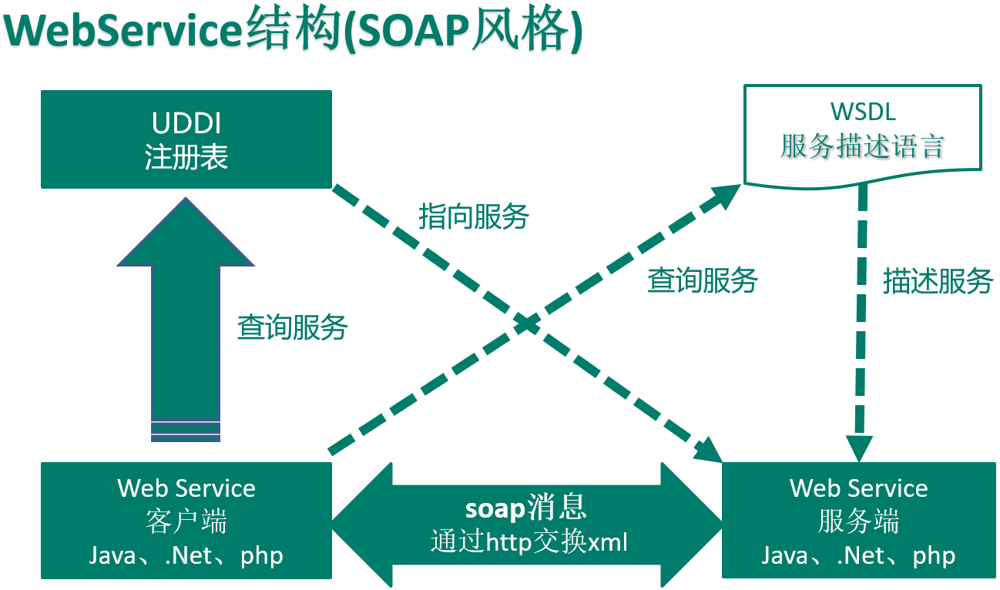


### 1.6 WebService核心组件 

- XML和HTTP
- SOAP： 简单对象访问协议
- WSDL： WebService描述语言
-  UDDI：统一描述、发现和集成协议

**SOAP**

Web service建好以后，你或者其他人就会去调用它。[简单对象访问协议](https://baike.baidu.com/item/%E7%AE%80%E5%8D%95%E5%AF%B9%E8%B1%A1%E8%AE%BF%E9%97%AE%E5%8D%8F%E8%AE%AE)(SOAP)提供了标准的RPC方法来调用Web service。实际上，SOAP在这里有点用词不当：它意味着下面的Web service是以对象的方式表示的，但事实并不一定如此：你完全可以把你的Web service写成一系列的C函数，并仍然使用SOAP进行调用。SOAP规范定义了SOAP消息的格式，以及怎样通过HTTP协议来使用SOAP。SOAP也是基于[XML](https://baike.baidu.com/item/XML)（[标准通用标记语言](https://baike.baidu.com/item/%E6%A0%87%E5%87%86%E9%80%9A%E7%94%A8%E6%A0%87%E8%AE%B0%E8%AF%AD%E8%A8%80)下的一个子集）和XSD的，XML是SOAP的数据编码方式。

**WSDL**

你会怎样向别人介绍你的Web service有什么功能，以及每个[函数调用](https://baike.baidu.com/item/%E5%87%BD%E6%95%B0%E8%B0%83%E7%94%A8)时的参数呢？你可能会自己写一套文档，你甚至可能会口头上告诉需要使用你的Web service的人。这些非正式的方法至少都有一个严重的问题：当程序员坐到电脑前，想要使用你的Web service的时候，他们的工具(如Visual Studio)无法给他们提供任何帮助，因为这些工具根本就不了解你的Web service。

解决方法是：用机器能阅读的方式提供一个正式的描述文档。Web service描述语言([WSDL](https://baike.baidu.com/item/WSDL))就是这样一个基于[XML](https://baike.baidu.com/item/XML)（[标准通用标记语言](https://baike.baidu.com/item/%E6%A0%87%E5%87%86%E9%80%9A%E7%94%A8%E6%A0%87%E8%AE%B0%E8%AF%AD%E8%A8%80)下的一个子集）的语言，用于描述Web service及其函数、[参数](https://baike.baidu.com/item/%E5%8F%82%E6%95%B0)和返回值。[WSDL](https://baike.baidu.com/item/WSDL)既是机器可阅读的，又是人可阅读的，这将是一个很大的好处。一些最新的开发工具既能根据你的Web service生成WSDL文档，又能导入WSDL文档，生成调用相应Web service的代码。

**UDDI**

Universal Description, Discovery and Integration

为加速Web Service的推广、加强Web Service的互操作能力而推出的一个计划,基于标准的服务描述和发现的规范(specification)。

以[资源共享](https://baike.baidu.com/item/%E8%B5%84%E6%BA%90%E5%85%B1%E4%BA%AB)的方式由多个运作者一起以Web Service的形式运作UDDI商业注册中心。

UDDI计划的核心组件是UDDI商业注册，它使用[XML文档](https://baike.baidu.com/item/XML%E6%96%87%E6%A1%A3)来描述企业及其提供的Web Service。

UDDI商业注册提供三种信息：

White Page包含地址、联系方法、已知的[企业标识](https://baike.baidu.com/item/%E4%BC%81%E4%B8%9A%E6%A0%87%E8%AF%86)。

Yellow Page包含基于标准分类法的行业类别。

Green Page包含关于该企业所提供的Web Service的技术信息，其形式可能是指向文件或[URL](https://baike.baidu.com/item/URL)的指针，而这些文件或URL是为服务发现机制服务的。


## 二 WebService主流框架 

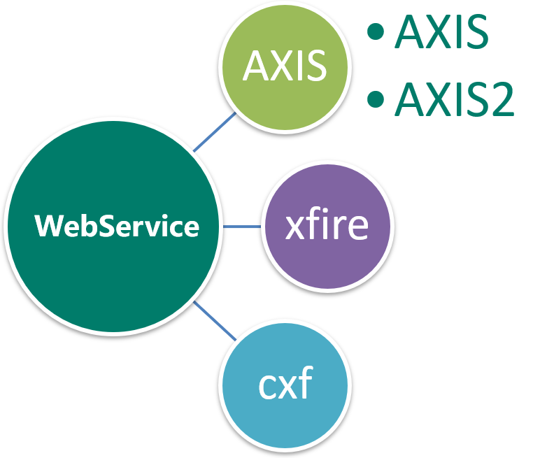

### 2.1 AXIS

- AXIS（Apache eXtensible Interaction System）阿帕奇可扩展交互系统
- AXIS是一款开源的WebService运行引擎，本质上就是一个SOAP引擎，提供创建服务器端、客户端和网关SOAP操作的基本框架。
- AXIS分为1.x系列和2系列，两个系列体系结构和使用上有较大的区别，相对而言，Axis1.x更加稳定，文档也比较齐全。
- 官网：http://axis.apache.org/

### 2.2 XFire

- XFire 是下一代的java SOAP 框架。XFire 提供了非常方便的API，使用这些API 可以 
- 开发面向服务(SOA)的程序。它支持各种标准，性能优良（基于低内存的STAX 模型）。
- 官网：http://xfire.codehaus.org/

### 2.3 CXF 

- Apache CXF = Celtix + XFire
- Apache CXF 的前身叫 Apache CeltiXfire，现在已经正式更名为 Apache CXF 了，以下简称为 CXF。CXF 继承了 Celtix 和 XFire 两大开源项目的精华，提供了对 JAX-WS 全面的支持，并且提供了多种 Binding 、DataBinding、Transport 以及各种 Format 的支持，并且可以根据实际项目的需要，采用代码优先（Code First）或者 WSDL 优先（WSDL First）来轻松地实现 Web Services 的发布和使用。Apache CXF已经是一个正式的Apache顶级项目。
- 官网：http://cxf.apache.org/

## 三 CXF 案例

### 3.1 Demo

#### 3.1.1 Demo概要

- 建工程添Jar包
- 建Demo服务接口(@WebService注解添加)
- 建Demo服务实现类
- 建MainServer服务启动类(JaxWsServerFactoryBean)
- 测试访问有两方法：
  - 1)通过图形化工具直接测试调用 
  - 2)建ClientTest调用对外暴露的服务，编码测试(JaxWsProxyFactoryBean)
- （包及工具）下载地址：http://cxf.apache.org/download.html

#### 3.1.2 demo详细（maven项目）

- 项目结构

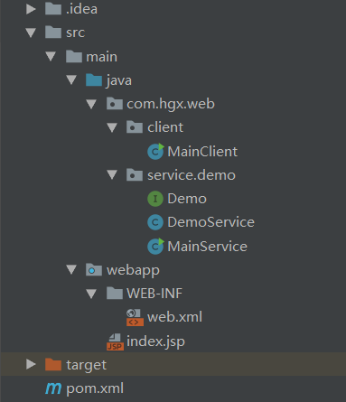

- 用maven创建一个web项目，maven依赖：pom.xml

```xml
<dependencies>
    <!-- https://mvnrepository.com/artifact/org.apache.cxf/cxf-rt-frontend-jaxws -->
    <dependency>
      <groupId>org.apache.cxf</groupId>
      <artifactId>cxf-rt-frontend-jaxws</artifactId>
      <version>3.2.7</version>
    </dependency>
    <!-- https://mvnrepository.com/artifact/org.apache.cxf/cxf-rt-transports-http-jetty -->
    <dependency>
      <groupId>org.apache.cxf</groupId>
      <artifactId>cxf-rt-transports-http-jetty</artifactId>
      <version>3.2.7</version>
    </dependency>
  </dependencies>
```

- demo服务接口（@WebService注解）

```java
import javax.jws.WebService;

@WebService
public interface Demo {
    String sayHello(String name, int age);
}
```

- 建DemoService服务实现类 

```java
public class DemoService implements Demo {
    @Override
    public String sayHello(String name, int age) {
        return "Hello!!!" + name + "(" + age + " years old)";
    }
}
```

- 建MainServer服务启动类 

```java
import org.apache.cxf.endpoint.Server;
import org.apache.cxf.jaxws.JaxWsServerFactoryBean;

public class MainService {
    public static void main(String[] args) {
        JaxWsServerFactoryBean jaxWsServerFactoryBean = new JaxWsServerFactoryBean();
        jaxWsServerFactoryBean.setAddress("http://localhost:8080/demo");
        jaxWsServerFactoryBean.setServiceClass(DemoService.class);
        Server server = jaxWsServerFactoryBean.create();
        server.start();
        System.out.println("demo服务启动 。。。。");
    }
}
```

- 客户端MainClient

```java
import com.hgx.web.service.demo.Demo;
import org.apache.cxf.jaxws.JaxWsProxyFactoryBean;

public class MainClient {
    public static void main(String[] args) {
        JaxWsProxyFactoryBean jaxWsProxyFactoryBean = new JaxWsProxyFactoryBean();
        jaxWsProxyFactoryBean.setAddress("http://localhost:8080/demo");
        jaxWsProxyFactoryBean.setServiceClass(Demo.class);
        Demo demo = (Demo) jaxWsProxyFactoryBean.create();
        System.out.println(demo.sayHello("hgx", 24));
    }
}
```


## 四 Soap协议+TCP/IPMoniter监控 

 ###  4.1 SOAP协议是什么？

- 简单对象访问协议（Simple Object Access Protocol，SOAP）是一种轻量的、简单的、基于XML的协议，它被设计成在WEB上交换结构化的和固化的信息。
- SOAP 是基于 XML 的简易协议，可使应用程序在 HTTP 之上进行信息交换。

### 4.2  SOAP协议什么样？

**一条 SOAP 消息就是一个普通的 XML 文档，包含下列元素**：

- Envelope 元素，必有，可把此 XML 文档标识为一条 SOAP 消息
- Header 元素，可选，包含头部信息
- Body 元素，必有，包含所有的调用和响应信息
- Fault 元素，可选，提供有关在处理此消息所发生错误的信息

```xml
<soap:Envelope xmlns:soap="http://schemas.xmlsoap.org/soap/envelope/">
	<soap:Body>
		<soap:Fault>
			<faultcode>soap:Server</faultcode>
			<faultstring>
				No binding operation info while invoking unknown method with params unknown.
			</faultstring>
		</soap:Fault>
	</soap:Body>
</soap:Envelope>
```

### 4.3 SOAP消息的调试抓取 

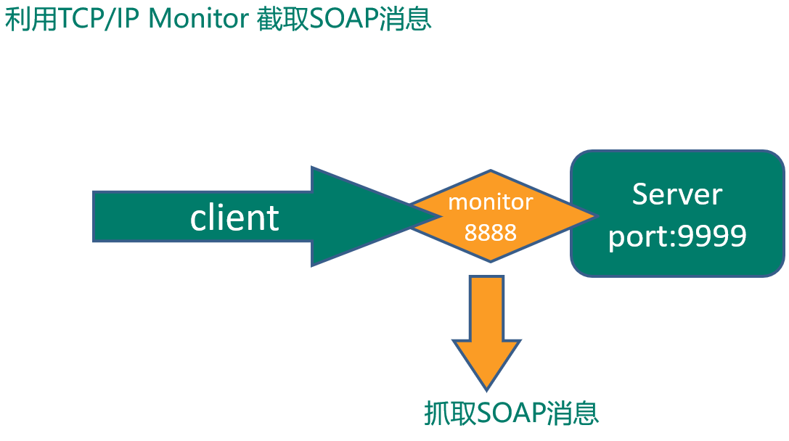

- request

```xml
<soapenv:Envelope 
xmlns:soapenv="http://schemas.xmlsoap.org/soap/envelope/" 
xmlns:q0="http://test.cxf.hgx.com/" 
xmlns:xsd="http://www.w3.org/2001/XMLSchema"
xmlns:xsi="http://www.w3.org/2001/XMLSchema-instance">
   <soapenv:Body> 
     <q0:sayhello>
         <arg0>Jack</arg0> 
         <arg1>16</arg1> 
     </q0:sayhello>
  </soapenv:Body>
</soapenv:Envelope>
```

- response   

```xml
<soap:Envelope xmlns:soap="http://schemas.xmlsoap.org/soap/envelope/">
  <soap:Body>
    <ns2:sayhelloResponse xmlns:ns2="http://test.cxf.hgx.com/">
      <return>Hello, Jack(16 years old)</return>
    </ns2:sayhelloResponse>
  </soap:Body>
</soap:Envelope>
```

  

## 五 WSDL文件解析

### 5.1 WSDL报文总体概述 

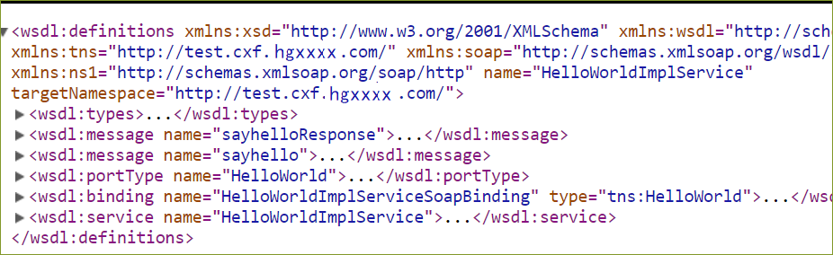

```xml
<definitions>
	<types>
	  	定义 web service 使用的数据类型
	</types>
	<message>
		每个消息均由一个或多个部件组成。可以把它当做java中一个函数调用的参数。
	</message>

	<portType>
		它类似Java中的一个函数库（或一个模块、或一个类）
	</portType>

	<binding>
		为每个端口定义消息格式和协议细节。
    </binding>
</definitions>
```


### 5.2  WSDL报文之wsdl:definitions 

```xml
<wsdl:definitions 
		xmlns:xsd="http://www.w3.org/2001/XMLSchema" 
		xmlns:wsdl="http://schemas.xmlsoap.org/wsdl/" 
		xmlns:tns="http://service.hgx.com/" 
		xmlns:soap="http://schemas.xmlsoap.org/wsdl/soap/" 
		xmlns:ns1="http://schemas.xmlsoap.org/soap/http" 
		name="HelloWorldImplService" 
		targetNamespace="http://service.hgx.com/">
</wsdl:definitions>
```

| 标签            | 描述                                                         |
| --------------- | ------------------------------------------------------------ |
| name            | 我们java程序中服务接口的实现类，SEI定义是:服务接口类+Service后缀，Service自动追加 |
| targetNamespace | 命名空间：   相当于Java里面的package它刚好是和我们Java定义中的包名相反 |
| 其它            | 不变化，不关心                                               |
| xmlns:tns       | 相当于Java里面的import，   包名反转                          |


### 5.4 WSDL报文之wsdl:types 

- 我们java定义的服务接口中某方法的输入参数和返回值。 

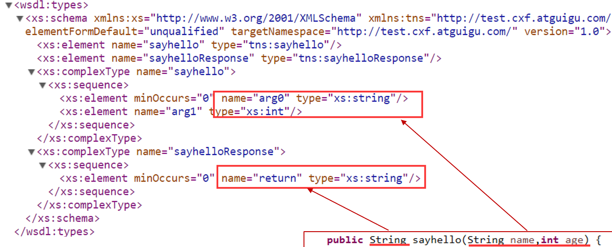

### 5.5 WSDL报文之wsdl:message

- 通信消息的数据结构的抽象类型化定义。使用Types所定义的类型来定义整个消息的数据结构。 

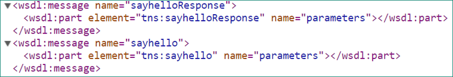

- WebService中每个方法包含两部分：
  - 一个是方法的输入参数；另一个是方法的输出参数。
  - 其实质都是基于SOAP协议将其封装为消息，所以每一个方法对应有两个消息，一个输入一个输出回应。简单而言，就是方法和Message的关系是N:2N的关系。一对二。
  - Message中的具体内容是part,结合前面可知，message中的part内容请到前面定义过的types中去看，它会引用之前的type相关内容

### 5.6 WSDL报文之wsdl:portType 

- portType = 接口  
- operation = 接口中定义的方法 

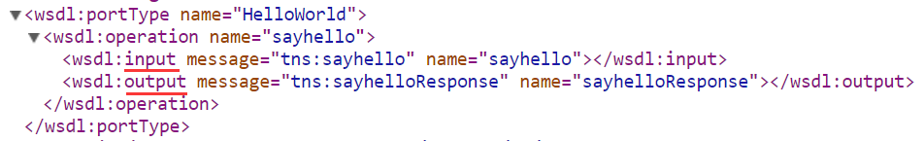

### 5.7 WSDL报文之wsdl:binding

- 特定端口类型的具体协议和数据格式规范的绑定 

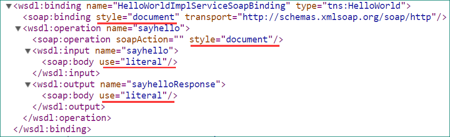

### 5.8 WSDL报文之wsdl:service 

- 负责将网络通信地址赋给一个具体的绑定 

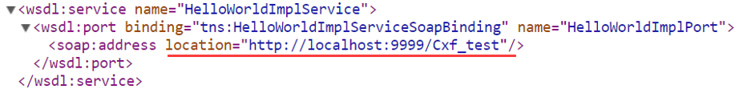


## 六 JAX-WS工具

 ### 6.1 是什么?

- JAX-WS = Java API For XML Web Service 
- JAX-WS规范是一组XML web services的JAVA API，它运行时实现会将这些API的调用转换成为对应的SOAP消息，是Sun公司提出的一套关于WebService的开发标准

### 6.2  能干嘛? 

- 服务端开发完成后客户端如何编码调用？全手写麻烦否？ 
  - 解决了上面的问题

### 6.3 怎么用?

- 下载的压缩包里面包含了工具,下载地址:http://cxf.apache.org/download.html
- bin目录下运行wsdl2java命令，通过wsdl生成java代码,例如使用:`wsdl2java` 根据wsdl生成文件

```powershell
D:\devEnv\apache-cxf-3.2.7\apache-cxf-3.2.7\bin>wsdl2java  http://localhost:8080/demo?wsdl
```

- 正常执行后,在bin目录下会生成一个文件包，里面内容如下:


- 包含了客户端需要的服务相关的代码,只需要自己写客户端部分代码,并把生成的代码复制到工程下就可以了.

```java
import com.hgx.web.service.demo.Demo;
import org.apache.cxf.jaxws.JaxWsProxyFactoryBean;

public class WSDLMain {
    public static void main(String[] args) {
        JaxWsProxyFactoryBean jaxWsProxyFactoryBean = new JaxWsProxyFactoryBean();
        jaxWsProxyFactoryBean.setAddress("http://localhost:8080/demo");
        jaxWsProxyFactoryBean.setServiceClass(Demo.class);
        Demo demo = (Demo) jaxWsProxyFactoryBean.create();
        System.out.println(demo.sayHello("hgx", 24));
    }
}
```

- 也可以同时生成Client代码,只需要简单修改即可测试

```powershell
D:\devEnv\apache-cxf-3.2.7\apache-cxf-3.2.7\bin>wsdl2java -client http://localhost:8080/demo?wsdl
```

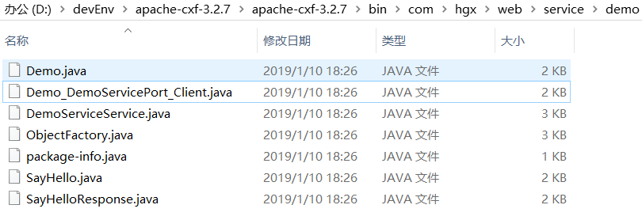

```java
import java.io.File;
import java.net.MalformedURLException;
import java.net.URL;
import javax.xml.namespace.QName;

/**
 * This class was generated by Apache CXF 3.2.7
 * 2019-01-10T18:26:18.045+08:00
 * Generated source version: 3.2.7
 *
 */
public final class Demo_DemoServicePort_Client {

    private static final QName SERVICE_NAME = new QName("http://demo.service.web.hgx.com/", "DemoServiceService");

    private Demo_DemoServicePort_Client() {
    }

    public static void main(String args[]) throws Exception {
        URL wsdlURL = DemoServiceService.WSDL_LOCATION;
        if (args.length > 0 && args[0] != null && !"".equals(args[0])) {
            File wsdlFile = new File(args[0]);
            try {
                if (wsdlFile.exists()) {
                    wsdlURL = wsdlFile.toURI().toURL();
                } else {
                    wsdlURL = new URL(args[0]);
                }
            } catch (MalformedURLException e) {
                e.printStackTrace();
            }
        }

        DemoServiceService ss = new DemoServiceService(wsdlURL, SERVICE_NAME);
        Demo port = ss.getDemoServicePort();

        {
        System.out.println("Invoking sayHello...");
        String _sayHello_arg0 = "";
        int _sayHello_arg1 = 0;
        String _sayHello__return = port.sayHello(_sayHello_arg0, _sayHello_arg1);
        System.out.println("sayHello.result=" + _sayHello__return);
            
        }

        System.exit(0);
    }

}
```


## 七 调用天气服务

- 寻找webservice服务获得wsdl 
- 根据wsdl生成接口
- 编写接口程序
- 将接口文件打包 

**1.获得wsdl**

http://www.webxml.com.cn/zh_cn/index.aspx 

天气:http://ws.webxml.com.cn/WebServices/WeatherWS.asmx

**2.根据wsdl生成接口**

- bin目录下运行wsdl2java命令

```powershell
D:\devEnv\apache-cxf-3.2.7\apache-cxf-3.2.7\bin>wsdl2java http://ws.webxml.com.cn/WebServices/WeatherWS.asmx?wsdl

WSDLToJava Error: http://ws.webxml.com.cn/WebServices/WeatherWS.asmx?wsdl [15,19]: undefined element declaration 's:schema'
http://ws.webxml.com.cn/WebServices/WeatherWS.asmx?wsdl [61,19]: undefined element declaration 's:schema'
http://ws.webxml.com.cn/WebServices/WeatherWS.asmx?wsdl [101,13]: undefined element declaration 's:schema'
```

- 官方发布的webservice用的.Net生成wsdl与java稍有不兼容，所以不能直接用wsdl2java生成，必须把原wsdl的代码复制到本地的一个文本文件里比如`e:\weather.wsdl`，先编辑一下，去掉报错的`<s:element ref="s:schema" />`
-   再次根据wsdl生成接口 

```shell
wsdl2java  e:\weather.wsdl
```

**3.将生成的类包，拷贝到项目下**

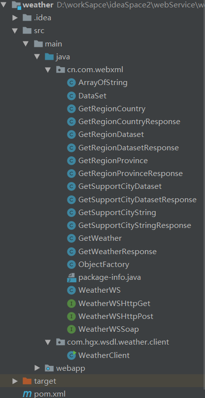

- maven依赖的pom.xml

```xml
 <dependencies>
    <!-- https://mvnrepository.com/artifact/org.apache.cxf/cxf-rt-frontend-jaxws -->
    <dependency>
      <groupId>org.apache.cxf</groupId>
      <artifactId>cxf-rt-frontend-jaxws</artifactId>
      <version>3.2.7</version>
    </dependency>
    <!-- https://mvnrepository.com/artifact/org.apache.cxf/cxf-rt-transports-http-jetty -->
    <dependency>
      <groupId>org.apache.cxf</groupId>
      <artifactId>cxf-rt-transports-http-jetty</artifactId>
      <version>3.2.7</version>
    </dependency>
  </dependencies>
```

- 客户端代码

```java
import cn.com.webxml.ArrayOfString;
import cn.com.webxml.WeatherWS;
import cn.com.webxml.WeatherWSSoap;

import java.util.List;

public class WeatherClient {

    public static void main(String[] args) {
        
       WeatherWSSoap weatherWSSoap = new WeatherWS().getWeatherWSSoap();
       
        //获取国家
        ArrayOfString arrayOfString = weatherWSSoap.getRegionCountry();
        List<String> list = arrayOfString.getString();

        for (String result : list) {
            System.out.println(result);
        }

        //获取省份
        ArrayOfString arrayOfString1 =  weatherWSSoap.getRegionProvince() ;
        List<String> list1 = arrayOfString1.getString();
        for (String s:
             list1) {
            System.out.println(s);
        }

		//获取城市
        ArrayOfString arrayOfString2 =  weatherWSSoap.getSupportCityString("311104") ;
        List<String> list2 = arrayOfString2.getString();
        for (String s:
             list2) {
            System.out.println(s);
        }
		//获取天气需要账号
        ArrayOfString arrayOfString3 = weatherWSSoap.getWeather("1605","123123123") ;
        List<String> list3 = arrayOfString3.getString();
        for (String s:
                list3) {
            System.out.println(s);
        }

    }
```


## 八 Restful Web Services (JAX-RS) 

 ### 8.1  是什么

-  JAX-RS = Java API For Restful Web Services 
- JAX-RS是JAVA EE6 引入的一个新规范。 是一个Java 编程语言的应用程序接口，支持按照表述性状态转移（REST）架构风格创建Web服务。
- JAX-RS使用了Java标注来简化Web服务的客户端和服务端的开发和部署。
-  除了JAX-RS方式发布Restful风格的Webservice,SpringMVC也可以发布Restful风格的Webservice

### 8.2  JAX-RS提供了一些标注将一个资源类，一个POJO Java类，封装为Web资源。 

**包括：**

- @Path，标注资源类或者方法的相对路径
- @GET，@PUT，@POST，@DELETE，标注方法是HTTP请求的类型。
- @Produces，标注返回的MIME媒体类型
- @Consumes，标注可接受请求的MIME媒体类型
- @PathParam，@QueryParam，@HeaderParam，@CookieParam，@MatrixParam，@FormParam,分别标注方法的参数来自于HTTP请求的不同位置，例如：
  - @PathParam来自于URL的路径，
  - @QueryParam来自于URL的查询参数，
  - @HeaderParam来自于HTTP请求的头信息，
  - @CookieParam来自于HTTP请求的Cookie。
- 基于JAX-RS实现的框架有Jersey，RESTEasy等。这两个框架创建的应用可以很方便地部署到Servlet 容器中


### 8.3 怎么用

- 1 建工程添jar包(Cxf的jar包)
- 2 建Customer.java的entity并添加注解@XmlRootElement
- 3 建CustomerService接口并添加Restful风格相关的注释
- 4 编写CustomerServiceImpl实现类
- 5 编写MainServer类，启动Restful的Webservice,启动后注意目前用rest而不是soap了，所以没有WSDL的描述了
- 6 浏览器地址栏里面按照Restful风格的路径进行访问+测试


#### 8.3.1 restful Demo

- 项目结构

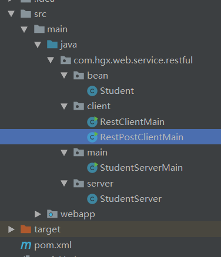

- maven依赖pom.xml

```xml
<dependencies>
    <!-- https://mvnrepository.com/artifact/org.apache.cxf/cxf-rt-frontend-jaxws -->
    <dependency>
        <groupId>org.apache.cxf</groupId>
        <artifactId>cxf-rt-frontend-jaxws</artifactId>
        <version>3.2.7</version>
    </dependency>
    <!-- https://mvnrepository.com/artifact/org.apache.cxf/cxf-rt-transports-http -->
    <dependency>
        <groupId>org.apache.cxf</groupId>
        <artifactId>cxf-rt-transports-http</artifactId>
        <version>3.2.7</version>
    </dependency>
    <!-- https://mvnrepository.com/artifact/org.apache.cxf/cxf-rt-frontend-jaxrs -->
    <dependency>
        <groupId>org.apache.cxf</groupId>
        <artifactId>cxf-rt-frontend-jaxrs</artifactId>
        <version>3.2.7</version>
    </dependency>
    <!-- https://mvnrepository.com/artifact/org.apache.cxf/cxf-rt-transports-http-jetty -->
    <dependency>
        <groupId>org.apache.cxf</groupId>
        <artifactId>cxf-rt-transports-http-jetty</artifactId>
        <version>3.2.7</version>
    </dependency>

    <!--没有这两个依赖会：No message body writer has been found for class com.hgx.web.service.restful.bean.Student, ContentType: application/json-->
    <!-- https://mvnrepository.com/artifact/org.apache.cxf/cxf-rt-rs-extension-providers -->
    <dependency>
        <groupId>org.apache.cxf</groupId>
        <artifactId>cxf-rt-rs-extension-providers</artifactId>
        <version>3.2.7</version>
    </dependency>
    <!-- https://mvnrepository.com/artifact/org.codehaus.jettison/jettison -->
    <dependency>
        <groupId>org.codehaus.jettison</groupId>
        <artifactId>jettison</artifactId>
        <version>1.4.0</version>
    </dependency>

 <!--http客服端依赖 -->
    <dependency>
        <groupId>org.apache.httpcomponents</groupId>
        <artifactId>httpclient</artifactId>
        <version>4.5.2</version>
    </dependency>
</dependencies>
```


- bean

```java
import javax.ws.rs.FormParam;
import javax.xml.bind.annotation.XmlRootElement;
import java.util.Date;

@XmlRootElement
public class Student {

    @FormParam("number")
    private Integer number;

    @FormParam("name")
    private String name;

    @FormParam("age")
    private Integer age;

    @FormParam("birth")
    private Date birth;

    public Student() {
    }

    public Student(Integer number, String name, Integer age, Date birth) {
        this.number = number;
        this.name = name;
        this.age = age;
        this.birth = birth;
    }

    public Integer getNumber() {
        return number;
    }

    public void setNumber(Integer number) {
        this.number = number;
    }

    public String getName() {
        return name;
    }

    public void setName(String name) {
        this.name = name;
    }

    public Integer getAge() {
        return age;
    }

    public void setAge(Integer age) {
        this.age = age;
    }

    public Date getBirth() {
        return birth;
    }

    public void setBirth(Date birth) {
        this.birth = birth;
    }

    @Override
    public String toString() {
        return "Student{" +
                "number=" + number +
                ", name='" + name + '\'' +
                ", age=" + age +
                ", birth=" + birth +
                '}';
    }
}
```

- server

```java
import javax.ws.rs.*;
import javax.ws.rs.core.MediaType;
import java.sql.Date;
import java.time.Instant;

@Path("/rest")
public class StudentServer {
    
    @Path("/student/{id}")
    @GET
//    @Produces("application/json")
    @Produces(MediaType.APPLICATION_JSON)
    public Student getStudentById(@PathParam("id") String id) {
        return new Student(6666, "韩哈哈哈", 20, Date.from(Instant.now()));
    }
}
```

- 服务启动类

```java
import com.hgx.web.service.restful.server.StudentServer;
import org.apache.cxf.jaxrs.JAXRSServerFactoryBean;

public class StudentServerMain {
    public static void main(String[] args) {
        JAXRSServerFactoryBean jAXRSServerFactoryBean = new JAXRSServerFactoryBean();
        jAXRSServerFactoryBean.setAddress("http://localhost:8080/studentServce");
        jAXRSServerFactoryBean.setResourceClasses(StudentServer.class);
        jAXRSServerFactoryBean.create().start();
        System.out.println("student server 启动");
    }
}
```

- 浏览器测试

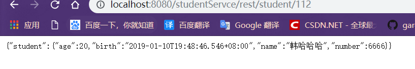

#### 8.3.2 编写客户端测试Get

**使用 HttpClient需要以下6个步骤**：

1. 创建 HttpClient 的实例
2. 创建某种连接方法的实例
3. 调用第一步中创建好的实例的execute方法来执行第二步中创建好的链接类实例
4. 读response获取HttpEntity
5. 对得到后的内容进行处理
6. 释放连接。无论执行方法是否成功，都必须释放连接

- 客户端类 

```java
import org.apache.http.HttpEntity;
import org.apache.http.HttpResponse;
import org.apache.http.HttpStatus;
import org.apache.http.client.methods.HttpGet;
import org.apache.http.impl.client.CloseableHttpClient;
import org.apache.http.impl.client.HttpClientBuilder;
import org.apache.http.util.EntityUtils;

import java.io.IOException;

public class RestClientMain {

    public static void main(String[] args) throws IOException {
//		1. 创建 HttpClient 的实例
        CloseableHttpClient httpClient = HttpClientBuilder.create().build();
//		2. 创建某种连接方法的实例
        HttpGet httpGet = new HttpGet("http://localhost:8080/studentServce/rest/student/0101");
//		3. 调用第一步中创建好的实例的execute方法来执行第二步中创建好的链接类实例
        HttpResponse httpResponse = httpClient.execute(httpGet);
//		4. 读response获取HttpEntity
        if (httpResponse.getStatusLine().getStatusCode() == HttpStatus.SC_OK) {
            HttpEntity entity = httpResponse.getEntity();
//		5. 对得到后的内容进行处理
            String result = EntityUtils.toString(entity, "utf-8");
            System.out.println(result);
            EntityUtils.consume(entity);
        } else {
            System.err.println(httpResponse.getStatusLine());
        }
//		6. 释放连接。无论执行方法是否成功，都必须释放连接
        httpClient.close();
    }
}
```

- 结果

```json
{"student":{"age":20,"birth":"2019-01-10T19:52:48.014+08:00","name":"韩哈哈哈","number":6666}}
```


#### 8.3.3  编写客户端测试post 

- server

```java
import javax.ws.rs.*;
import javax.ws.rs.core.MediaType;
import java.sql.Date;
import java.time.Instant;

@Path("/rest")
public class StudentServer {
    
    @Path("/student")
    @POST
    @Consumes("application/x-www-form-urlencoded")
    public String Student(@BeanParam Student student){
        
        System.out.println(student);
        return "success:"+student.toString();
    }
}
```

- 客户端

```java
import org.apache.http.HttpEntity;
import org.apache.http.HttpResponse;
import org.apache.http.HttpStatus;
import org.apache.http.client.ClientProtocolException;
import org.apache.http.client.entity.UrlEncodedFormEntity;
import org.apache.http.client.methods.HttpPost;
import org.apache.http.impl.client.CloseableHttpClient;
import org.apache.http.impl.client.HttpClientBuilder;
import org.apache.http.message.BasicNameValuePair;
import org.apache.http.util.EntityUtils;

import java.io.IOException;
import java.time.Instant;
import java.util.ArrayList;
import java.util.Date;
import java.util.List;

@SuppressWarnings("all")
public class RestPostClientMain {

    public static void main(String[] args) throws ClientProtocolException, IOException {

        CloseableHttpClient httpClient = HttpClientBuilder.create().build();

        HttpPost httpPost = new HttpPost("http://localhost:8080/studentServce/rest/student");

        List<BasicNameValuePair> list = new ArrayList<BasicNameValuePair>();

        list.add(new BasicNameValuePair("number", "0222"));
        list.add(new BasicNameValuePair("name", "张三"));
        list.add(new BasicNameValuePair("age", "19"));
        list.add(new BasicNameValuePair("birth", Date.from(Instant.now()).toString())) ;


        HttpEntity httpEntity = new UrlEncodedFormEntity(list, "utf-8");

        httpPost.setEntity(httpEntity);

        HttpResponse httpResponse = httpClient.execute(httpPost);

        if (httpResponse.getStatusLine().getStatusCode() == HttpStatus.SC_OK) {
            HttpEntity entity = httpResponse.getEntity();
            String result = EntityUtils.toString(entity, "utf-8");

            System.out.println(result);

            EntityUtils.consume(entity);
        } else {
            System.err.println(httpResponse.getStatusLine());
        }
        httpClient.close();

    }

}
```

- 结果

```json
//服务端打印
Student{number=222, name='张三', age=19, birth=Fri Jan 11 10:02:51 CST 2019}
//客户端打印
success:Student{number=222, name='张三', age=19, birth=Fri Jan 11 10:02:51 CST 2019}
```


## 九 Spring整合cxf  

 **整合步骤：**

1. 建web工程 
2. 导入cxf的jar包 
3. 加入接口和实现类 
4. 修改web.xml 
5. 新建applicationContext.xml  

### 9.1 整合详细

- 项目结构

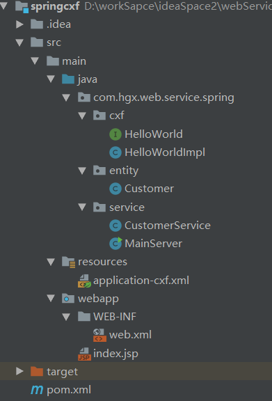

- maven依赖pom.xml

```xml
<dependencies>
    <dependency>
      <groupId>org.springframework</groupId>
      <artifactId>spring-core</artifactId>
      <version>5.1.3.RELEASE</version>
    </dependency>
    <dependency>
      <groupId>org.springframework</groupId>
      <artifactId>spring-beans</artifactId>
      <version>5.1.3.RELEASE</version>
    </dependency>
    <dependency>
      <groupId>org.springframework</groupId>
      <artifactId>spring-tx</artifactId>
      <version>5.1.3.RELEASE</version>
    </dependency>
    <dependency>
      <groupId>org.springframework</groupId>
      <artifactId>spring-context</artifactId>
      <version>4.1.7.RELEASE</version>
    </dependency>
    <dependency>
      <groupId>org.springframework</groupId>
      <artifactId>spring-context-support</artifactId>
      <version>5.1.3.RELEASE</version>
    </dependency>
    <dependency>
      <groupId>org.springframework</groupId>
      <artifactId>spring-web</artifactId>
      <version>5.1.3.RELEASE</version>
    </dependency>
    <dependency>
      <groupId>org.springframework</groupId>
      <artifactId>spring-webmvc</artifactId>
      <version>5.1.3.RELEASE</version>
    </dependency>
    <dependency>
      <groupId>org.springframework</groupId>
      <artifactId>spring-aop</artifactId>
      <version>5.1.3.RELEASE</version>
    </dependency>
    <dependency>
      <groupId>org.springframework</groupId>
      <artifactId>spring-aspects</artifactId>
      <version>5.1.3.RELEASE</version>
    </dependency>
    <dependency>
      <groupId>org.springframework</groupId>
      <artifactId>spring-jdbc</artifactId>
      <version>5.1.3.RELEASE</version>
    </dependency>

    <!-- 添加CXF dependency  -->
    <!-- https://mvnrepository.com/artifact/org.apache.cxf/cxf-rt-frontend-jaxws -->
    <dependency>
      <groupId>org.apache.cxf</groupId>
      <artifactId>cxf-rt-frontend-jaxws</artifactId>
      <version>3.2.7</version>
    </dependency>
    <!-- https://mvnrepository.com/artifact/org.apache.cxf/cxf-rt-transports-http -->
    <dependency>
      <groupId>org.apache.cxf</groupId>
      <artifactId>cxf-rt-transports-http</artifactId>
      <version>3.2.7</version>
    </dependency>
    <!-- https://mvnrepository.com/artifact/org.apache.cxf/cxf-rt-frontend-jaxrs -->
    <dependency>
      <groupId>org.apache.cxf</groupId>
      <artifactId>cxf-rt-frontend-jaxrs</artifactId>
      <version>3.2.7</version>
    </dependency>
    <!-- https://mvnrepository.com/artifact/org.apache.cxf/cxf-rt-transports-http-jetty -->
    <dependency>
      <groupId>org.apache.cxf</groupId>
      <artifactId>cxf-rt-transports-http-jetty</artifactId>
      <version>3.2.7</version>
    </dependency>

    <!--没有这两个依赖会：No message body writer has been found for class com.hgx.web.service.restful.bean.Student, ContentType: application/json-->
    <!--https://mvnrepository.com/artifact/org.apache.cxf/cxf-rt-rs-extension-providers-->
    <dependency>
      <groupId>org.apache.cxf</groupId>
      <artifactId>cxf-rt-rs-extension-providers</artifactId>
      <version>3.2.7</version>
    </dependency>
    <!-- https://mvnrepository.com/artifact/org.codehaus.jettison/jettison -->
    <dependency>
      <groupId>org.codehaus.jettison</groupId>
      <artifactId>jettison</artifactId>
      <version>1.4.0</version>
    </dependency>

    <!--解决rest风格的api没有wadl-->
    <!-- https://mvnrepository.com/artifact/org.apache.cxf/cxf-rt-rs-service-description -->
    <dependency>
      <groupId>org.apache.cxf</groupId>
      <artifactId>cxf-rt-rs-service-description</artifactId>
      <version>3.2.7</version>
    </dependency>
    
    <!-- https://mvnrepository.com/artifact/com.google.code.gson/gson -->
    <dependency>
      <groupId>com.google.code.gson</groupId>
      <artifactId>gson</artifactId>
      <version>2.8.5</version>
    </dependency>
    
  </dependencies>
```

- 接口

```java
import javax.jws.WebMethod;
import javax.jws.WebParam;
import javax.jws.WebResult;
import javax.jws.WebService;

@WebService
public interface HelloWorld {

    @WebMethod
    @WebResult(name = "sayHelloResult")
    String sayHello(@WebParam(name = "userName") String name, @WebParam(name = "userAge") int age);
}
```

- 接口实现类(soap)

```java
import javax.jws.WebMethod;
import javax.jws.WebParam;
import javax.jws.WebResult;

public class HelloWorldImpl implements HelloWorld {
    @Override
    @WebMethod
    @WebResult(name = "sayHelloResult")
    public String sayHello(@WebParam(name = "userName") String name, @WebParam(name = "userAge") int age) {
        return "spring say hello to: " + name + "\t" + "age: " + age;
    }
}
```

- service(rest风格)

```java
package com.hgx.web.service.spring.service;

import com.google.gson.Gson;
import com.hgx.web.service.spring.entity.Customer;

import javax.ws.rs.*;

@Path("/crm")
public class CustomerService {

    @GET
    @Path("/customer/{customer_id}")
    @Produces("application/json")
    public Customer getCustomerById(@PathParam("customer_id") String customer_id) {
        Customer customer = new Customer(customer_id, "z3", 18);
        return customer;
    }

    @POST
    @Path("/addcustomer")
    @Consumes("application/json")
    @Produces("application/json")
    public String addCustomer(String customer_json) {
        Gson gson = new Gson();
        Customer customer = (Customer) gson.fromJson(customer_json, Customer.class);
        System.out.println(customer);
        return "success:  " + customer.toString();
    }

}

```

- application-cxf.xml

```xml
<?xml version="1.0" encoding="UTF-8"?>
<beans xmlns="http://www.springframework.org/schema/beans"
       xmlns:xsi="http://www.w3.org/2001/XMLSchema-instance"
       xmlns:jaxws="http://cxf.apache.org/jaxws"
       xmlns:jaxrs="http://cxf.apache.org/jaxrs"
       xsi:schemaLocation="http://www.springframework.org/schema/beans http://www.springframework.org/schema/beans/spring-beans.xsd http://cxf.apache.org/jaxws http://cxf.apache.org/schemas/jaxws.xsd http://cxf.apache.org/jaxrs http://cxf.apache.org/schemas/jaxrs.xsd">

    <import resource="classpath:META-INF/cxf/cxf.xml"/>
    
   
    <jaxws:endpoint id="helloworld" implementor="com.hgx.web.service.spring.cxf.HelloWorldImpl" address="/HelloWorld"></jaxws:endpoint>

    <!--注意：坑爹的idea 导入的jaxrs-common.xsd不正确 应该是jaxrs.xsd -->
    <jaxrs:server id="customerService" address="/CustService">
        <jaxrs:serviceBeans>
            <bean class="com.hgx.web.service.spring.service.CustomerService"/>
        </jaxrs:serviceBeans>
    </jaxrs:server>
</beans>
```

- web.xml

```xml
<?xml version="1.0" encoding="UTF-8"?>
<web-app xmlns="http://xmlns.jcp.org/xml/ns/javaee"
         xmlns:xsi="http://www.w3.org/2001/XMLSchema-instance"
         xsi:schemaLocation="http://xmlns.jcp.org/xml/ns/javaee http://xmlns.jcp.org/xml/ns/javaee/web-app_3_1.xsd"
         version="3.1">

    <!-- 配置 Spring 配置文件的名称和位置 -->
    <context-param>
        <param-name>contextConfigLocation</param-name>
        <param-value>classpath:application-cxf.xml</param-value>
    </context-param>

    <!-- 启动 IOC 容器的 ServletContextListener -->
    <listener>
        <listener-class>org.springframework.web.context.ContextLoaderListener</listener-class>
    </listener>

    <!--webservice -->
    <servlet>
        <display-name>spring-cxf</display-name>
        <servlet-name>spring-cxf</servlet-name>
        <servlet-class>org.apache.cxf.transport.servlet.CXFServlet</servlet-class>
    </servlet>
    <servlet-mapping>
        <servlet-name>spring-cxf</servlet-name>
        <url-pattern>/*</url-pattern>
    </servlet-mapping>
    <!--webservice-->

</web-app>
```

- 结果

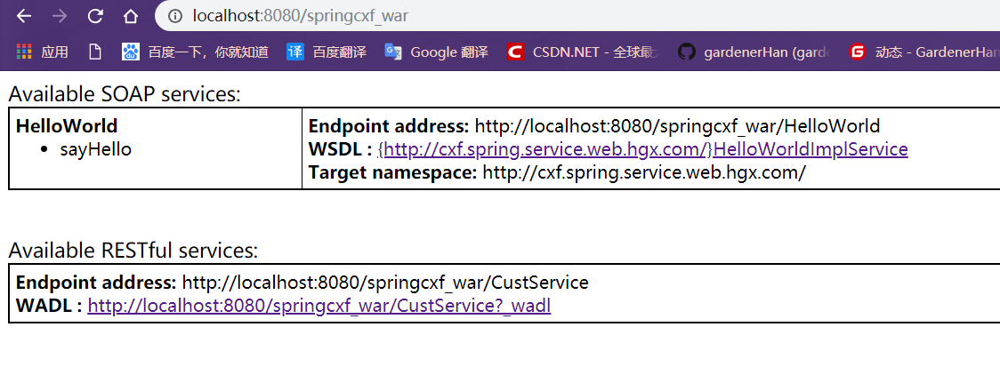


