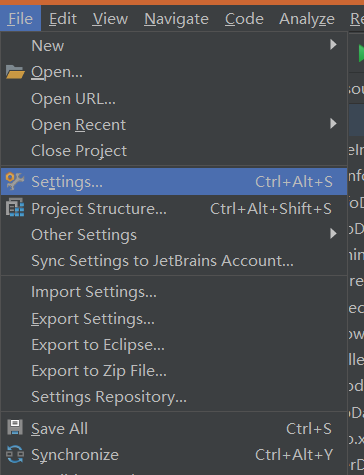
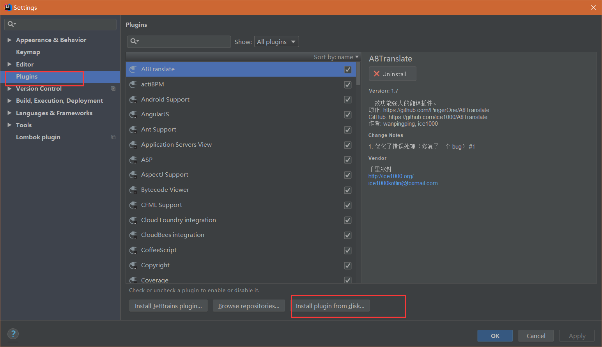
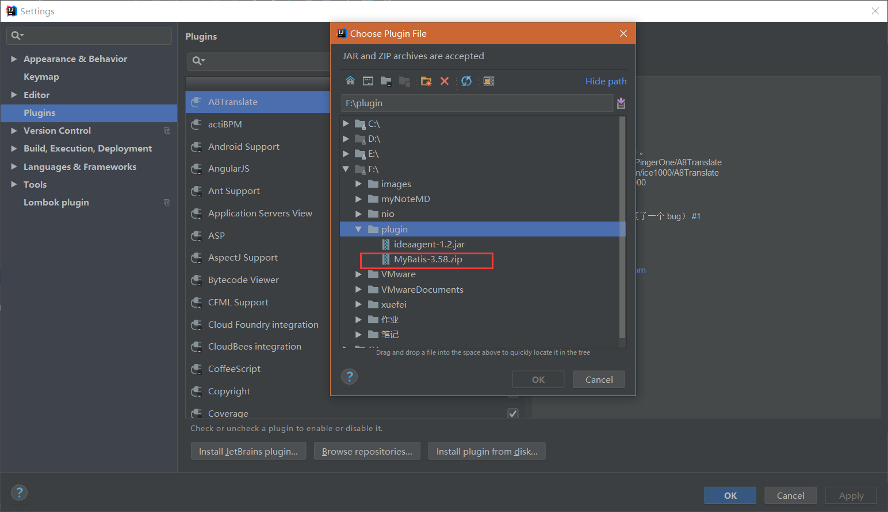
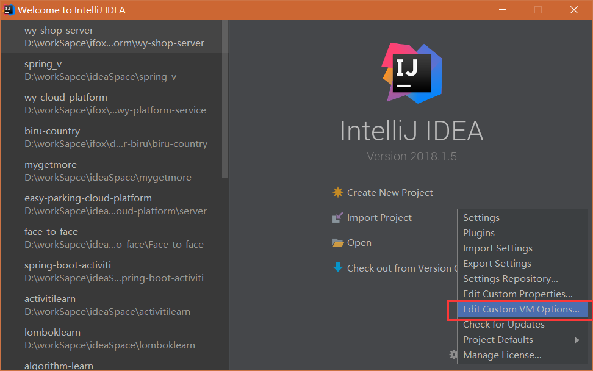
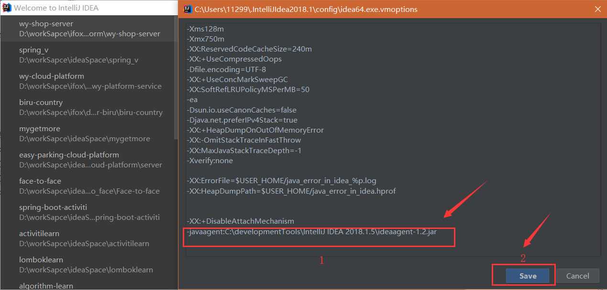
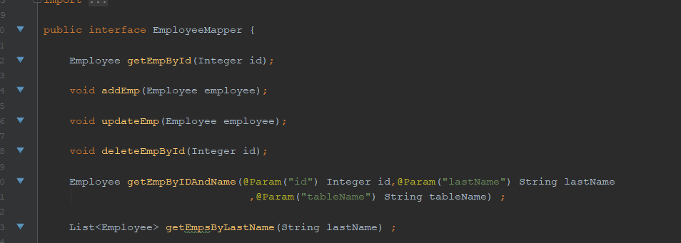
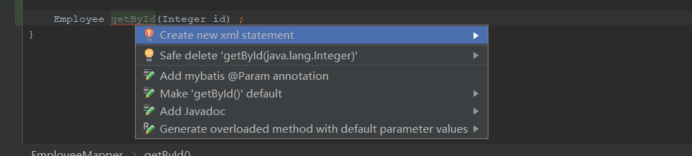
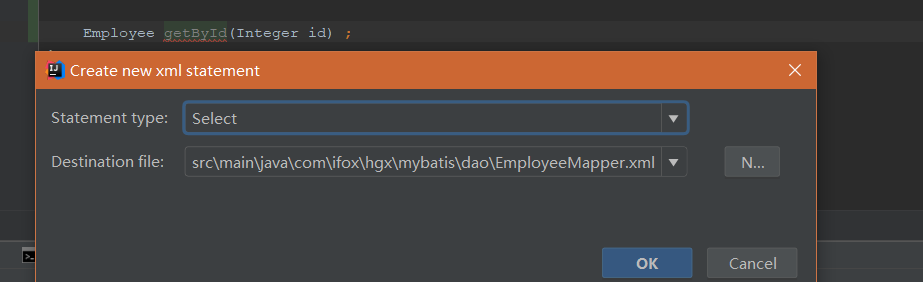

# IDEA2018 Mybatis plugin破解 

## 一、Mybatis Plugin插件是什么

- 提供Mapper接口与配置文件中对应SQL的导航
- 编辑XML文件时自动补全
- 根据Mapper接口, 使用快捷键生成xml文件及SQL标签
- ResultMap中的property支持自动补全，支持级联(属性A.属性B.属性C)
- 快捷键生成@Param注解
- XML中编辑SQL时, 括号自动补全
- XML中编辑SQL时, 支持参数自动补全(基于@Param注解识别参数)
- 自动检查Mapper XML文件中ID冲突
- 自动检查Mapper XML文件中错误的属性值
- 支持Find Usage
- 支持重构从命名
- 支持别名
- 自动生成ResultMap属性
- 快捷键: Option + Enter(Mac) | Alt + Enter(Windows)

 

## 二、Mybatis Plugin安装破解

- 打开IDEA ，Configure-> plugins到达下面页面 或进入idea后

  

- 点击红色框按钮，选择mybatis插件。（这里选择你下载下来的插件地址）插件以及破解包地址：https://pan.baidu.com/s/17zCJQ_YK-cn_WDFb_YxT1Q，密码：e6zc

点击OK

- 紧接着点击Configure -> Edit Custom VM Options

- 来到如下界面，在后面加上两行代码

- 代码如下：

-XX:+DisableAttachMechanism
-javaagent:C:\developmentTools\IntelliJ IDEA 2018.1.5\ideaagent-1.2.jar

红色地址是你刚刚下载下来jar包的位置，地址中最好不要有中文

点击Save，重启IDEA。（重启过程比较慢，如果一直卡在启动界面，那就是你的电脑不支持破解，关掉IDEA进程，重新启动）

 

## 三、Mybatis Plugin安装是否成功

- 随便新建一个Dao接口，当方法名旁边出现如下三角形，则安装破解成功

- 点击三角形会跳转到相应mapper.xml文件的对应id。

## 四、Mybatis Plugin使用方法

添加一个方法，鼠标停留在方法名上，使用快捷键: Option + Enter(Mac) | Alt + Enter(Windows)，出现如下界面。选择第一个选项

 

这里第一个选项选择对应SQL语句的类型，第二个选项选择你对应mapper.xml文件位置
 

点击ok，来到对应mapper.xml文件，插件已经帮你生成了相关代码，你只需要编写对应sql语句
