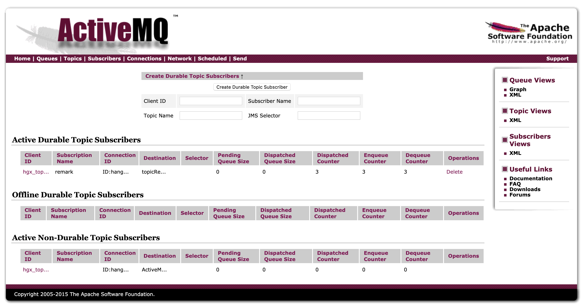
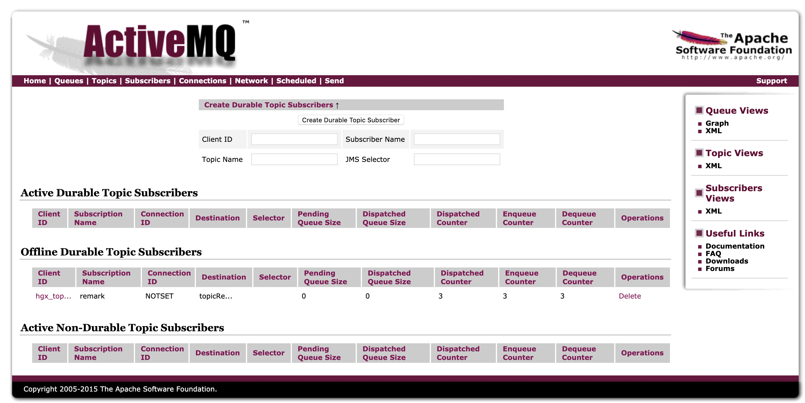

# ActiveMQ

<font color="green">*@Author:hanguixian*</font> 

<font color="green">*@Email:hn_hanguixian@163.com*</font>


- MQ产品：Kafka、RabbitMQ、RocketMQ、ActiveMQ ...


## 一  概述

### 1 前言

- 何种场景下使用消息中间件
- 为什么要在系统中引入消息中间件

### 2 背景

#### 2.1系统之间直接调用--实际工程和存在的问题

- 微服务架构后，链式调用是我们在写程序时候的一般流程，为了完成一个整体功能会将其拆分成多个函数(或子模块)，比如模块A调用模块B,模块B调用模块C，模块C调用模块D。但在大型分布式应用中，系统间的RPC交互繁杂，一个功能背后要调用上百个接口并非不可能，从单机架构过渡到分布式微服务架构的通例，这种架构会有哪些问题???

#####  2.1.1 系统之间接口耦合严重

- 系统之间接口耦合比较严重，每新增一个下游功能，都要对上有的相关接口进行改造;
- 举个例子:假如系统A要发送数据给系统B和C，发送给每个系统的数据可能有差异，因此系统A对要发送给每个系统的数据进行了组装，然后逐一发送;
- 当代码上线后又新增了一个需求:把数据也发送给D,新上了一个D系统也要接受A系统的数据。此时就需要修改A系统，让他感知到D的存在，同时把数据处理好再给D。在这个过程中你会看到，每接入一个下游系统，都要对A系统进行代码改造，开发联调的效率很低。
- 其整体架构如下图


##### 2.2.2 面对大流量并发时，容易被冲垮

- 每个接口模块的吞吐能力是有限的，这个上限能力如同堤坝，当大流量(洪水)来临时，容易被冲垮。
  举个栗子秒杀业务: 
  - 上游系统发起下单购买操作，我就是下单一个操作
  - 下游系统完成秒杀业务逻辑(读取订单，库存检查，库存冻结，余额检查，余额冻结，订单生成，余额扣减，库存扣减，生成流水，余额解冻，库存解冻)

##### 2.1.3 等待同步存在性能问题

- RPC接口基本上是同步调用，整体的服务性能遵循“木桶理论”，即整体系统的耗时取决于链路中最慢的那个接口。比如A调用B/C/D都是50ms，但此时B又调用了B1，花费2000ms,那么直接就拖累了整个服务性能。


####  2.2 解决方案

根据上述的几个问题，在设计系统时可以明确要达到的目标:

- 能够解耦：要做到系统解耦，当新的模块接进来时，可以做到代码改动最小
- 能够削峰：设置流量缓冲池，可以让后端系统按照自身吞吐能力进行消费，不被冲垮
- 能够异步：强弱依赖梳理能将非关键调用链路的操作异步化并提升整体系统的吞吐能力

### 3 是什么？

#### 3.1 定义

- 面向消息的中间件(message-oriented middleware)MOM能够很好的解决以上问题。
- 是指利用高效可靠的消息传递机制进行与平台无关的数据交流，并基于数据通信来进行分布式系统的集成。
- 通过提供消息传递和消息排队模型在分布式环境下提供应用解耦、弹性伸缩、冗余存储、流量削峰、异步通信、数据同步等功能。
- 大致的过程是这样的: 
  发送者把消息发送给消息服务器，消息服务器将消息存放在若干队列/主题中，在合适的时候，消息服务器会将消息转发给接受者。在这个过程中，发送和接受是异步的，也就是发送无需等待，而且发送者和接受者的生命周期也没有必然关系: 尤其在发布pub/订阅sub模式下，也可以完成一对多的通信，即让一个消息有多个接受者。

#### 3.2 特点

##### 3.2.1 采用异步处理模式

- 消息发送者可以发送一个消息而无须等待响应。消息发送者将消息发送到一条虛拟的通道(主题或队列)上;
- 消息接收者则订阅或监听该通道。一条信息可能最终转发给一个或多个消息接收者，这些接收者都无需对消息发送者做出同步回应。整个过程都是异步的。
- 案例:也就是说，一个系统跟另外一个系统之间进行通信的时候，假如系统A希望发送一个消息给系统B，让他去处理。但是系统A不关注系统B到底怎么处理或者有没有处理好，所以系统A把消息发送给MQ,然后就不管这条消息的“死活”了，接着系统B从MQ里消费出来处理即可。至于怎么处理，是否处理完毕，什么时候处理，都是系统B的事儿，与系统A无关。


- 这样的一种通信方式，就是所谓的“异步”通信方法，对于系统A来说，只要把消息发送给MQ，然后系统B就会异步去进行处理了，系统A不需要“同步”的等待系统B处理完。这样的好处是什么呢？解耦。

##### 3.2.2 应用系统之间解耦合

- 发送者和接受者不必了解对方，只需要确认消息。
- 发送者和接受者不必同时在线。

### 4 作用

- 异步
- 削峰
- 解耦

### 5 下载

- ActiveMQ官网：http://activemq.apache.org/

### 6 内容

- 最重要的功能：实现高可用、高性能、可伸缩、易用和安全的企业级功能
- 异步消息的消费和处理
- 控制消息的消费顺序
- 与spring/springboot整合
- MQ的集群容错
- ................


## 二 ActiveMQ安装和控制台

### 1 下载与安装

- 官网下载：http://activemq.apache.org/


- 下载到/opt目录下面
- 解压缩apache - activemq -5.15.6-bin. tar .gz
- 在根目录下mkdir /myactiveMQ
-  cp -r apache -activemq-5.15.6/myactiveMQ/
- 普通启动/停止mq:

```shell
 ./activemq start/stop
```

- activemq的默认进程端口是:61616

- 查看后台进程

```shell
ps -ef |grep activemq |  grep -v grep
```

- 带运行日志的启动方式

```shell
./activemq start > /myactiveMQ/run_activemq.log
```

### 2 Apache ActiveMQ控制台

- 控制台web地址：http://xxx:8161/admin
- 登录：
  - 默认用户：admin 默认密码：admin


​	


### 3 说明

- 采用61616端口人提供JMS服务
- 采用8161端口提供管理控制台服务


## 三 JAVA编程实现ActiveMQ通讯

### 1 JMS编程总体架构


### 2目的地Destination

- 队列queue
- 主题topic


- 比较

|            | Topic                                                        | Queue                                                        |
| ---------- | ------------------------------------------------------------ | ------------------------------------------------------------ |
| 工作模式   | 订阅发布模式，如果当前没有订阅者，消息将会被丢弃。如果有多个订阅者，那么这些订阅者都会收到消息 | 负载均衡模式，如果当前没有消费者，消息也不会丢弃如果有多个消费者，那么-条消息也只会发送给其中-个消费者, 并且要求消费者ack信息 |
| 有无状态   | 无状态                                                       | Queue数据默认会在mq服务器上以文件形式保存，比如Active MQ一般保存在${AMQ_ HOME}\data\kr -store\data下面。也可以配置成DB存储。 |
| 传递完整性 | 如果没有订阅者，消息会被丢弃                                 | 消息不会丢弃                                                 |
| 处理效率   | 由于消息要按照订阅者的数量进行复制，所以处理性能会随着订阅者的增加而明显降低，并且还要结合不同消息协议自身的性能差异 | 由于条消息只发送给一个消费者， 所以就算消费者再多，性能也不会有明显降低。当然不同消息协议的具体性能也是有差异的 |

负载均衡模式，如果当前没有消费者，消息也不会丢弃如果有多个消费者，那么-条消息也只会发送给其中-个消费者, 并且要求
消费者ack信息.

Queue数据默认会在mq服务器上以文件形式保存，比如Active MQ一般保存在SAMQ_ HOMEIdatakr storeldata下面。也可以配置成
DB存储。

消息不会丢弃
由于条消息只发送给一个消费者， 所以就算消费者再多，性能也不会有明显降低。当然不同消息协议的具体性能也是有差异的

### 3 在点对点的消息传递域中，目的地被称为队列(Queue)

- 每个消息只能有一个消费者，类似1对1的关系。好比个人快递自己领取自己的。
- 消息的生产者和消费者之间没有时间上的相关性。无论消费者在生产者发送消息的时候是否处于运行状态，消费者都可以提取消息。好比我们的发送短信，发送者发送后不见得接收者会即收即看。
- 消息被消费后队列中不会再存储，所以消费者不会消费到已经被消费掉的消息。

### 4 在发布订阅消息传递域中，目的地被称为主题(topic)

- 生产者将消息发布到topic中， 每个消息可以有多个消费者，属于1: N的关系
- 生产者和消费者之间有时间上的相关性。订阅某一个主题的消费者只能消费自它订阅之后发布的消息。
- 生产者生产时，topic不保存消息它是无状态的不落地，假如无人订阅就去生产，那就是一条废消息，所以，一般先启动消费者再启动生产者。
- JMS规范允许客户创建持久订阅，这在一定程度上放松了时间上的相关性要求。持久订阅允许消费者消费它在未处于激活状态时发送的消息。好比微信公众号订阅

### 5 入门代码

- pom.xml

```xml
<?xml version="1.0" encoding="UTF-8"?>

<project xmlns="http://maven.apache.org/POM/4.0.0" xmlns:xsi="http://www.w3.org/2001/XMLSchema-instance"
         xsi:schemaLocation="http://maven.apache.org/POM/4.0.0 http://maven.apache.org/xsd/maven-4.0.0.xsd">
    <modelVersion>4.0.0</modelVersion>

    <groupId>com.hgx</groupId>
    <artifactId>activemq-start</artifactId>
    <version>1.0-SNAPSHOT</version>
    
    <dependencies>
        <dependency>
            <groupId>org.apache.activemq</groupId>
            <artifactId>activemq-all</artifactId>
            <version>5.15.10</version>
        </dependency>
        <dependency>
            <groupId>junit</groupId>
            <artifactId>junit</artifactId>
            <version>4.11</version>
            <scope>test</scope>
        </dependency>
    </dependencies>

</project>

```

- 队列queue生产者

```java
import org.apache.activemq.ActiveMQConnectionFactory;
import javax.jms.*;

public class FirstQueueProvider {

    private static final String url = "tcp://xxx:61616";

    public static void main(String[] args) throws JMSException {

        //1.创建连接工厂，按照给定的URL地址，使用默认的用户和密码
        ConnectionFactory connectionFactory = new ActiveMQConnectionFactory(url);
        //2.通过连接工厂获取connection并访问
        Connection connection = connectionFactory.createConnection();
        connection.start();
        //3.创建会话session
        //两个参数，第一参数：事务，第二个参数：签收
        Session session = connection.createSession(false, Session.AUTO_ACKNOWLEDGE);
        //4.创建目的地，具体是队列Queue还是主题topic
        Queue queue01 = session.createQueue("queue01");
        //5.创建消息的生产者
        MessageProducer messageProducer = session.createProducer(queue01);
        //6. 通过消息生产者生产消息到MQ
        for (int i = 0; i < 3; i++) {
            //6.1 创建消息
            //文本消息
            TextMessage textMessage = session.createTextMessage("hello activeMQ--msg " + i);
            //6.2 发送到MQ
            messageProducer.send(textMessage);
        }

        //7.关闭资源
        messageProducer.close();
        session.close();
        connection.close();

        System.out.println("消息发送成功************");
    }
}
```

- 队列queue消费者

```java
import org.apache.activemq.ActiveMQConnectionFactory;
import javax.jms.*;
import java.io.IOException;

public class FirstQueueConsumer {
    private static final String url = "tcp://xxx:61616";

    public static void main(String[] args) throws JMSException, IOException {
        //1.创建连接工厂，按照给定的URL地址，使用默认的用户和密码
        ConnectionFactory connectionFactory = new ActiveMQConnectionFactory(url);
        //2.通过连接工厂获取connection并访问
        Connection connection = connectionFactory.createConnection();
        connection.start();
        //3.创建会话session
        //两个参数，第一参数：事务，第二个参数：签收
        Session session = connection.createSession(false, Session.AUTO_ACKNOWLEDGE);
        //4.创建目的地，具体是队列Queue还是主题topic
        Queue queue01 = session.createQueue("queue01");
        //5.创建消费者
        MessageConsumer messageConsumer = session.createConsumer(queue01);

        //消费方式1：同步阻塞方式（receive）订阅者或接收者调用MessageConsumer的receive方法来接收，receive方法在接收到消息之前或超时之前将一直阻塞
//        while (true) {
//            Message message = messageConsumer.receive(6000);
//            if (message instanceof TextMessage) {
//                TextMessage textMessage = (TextMessage) message;
//                System.out.println(textMessage.getText());
//            } else {
//                break;
//            }
//
//        }

        //消费方式2：异步非阻塞方式（监听器onMessage()方法）订阅者或接收者通过MessageConsumer的setMessageListener注册监听器，当消息到达之后，系统自动调用监听器MessageListener的onMessage方法
        messageConsumer.setMessageListener(new MessageListener() {
            public void onMessage(Message message) {
                if (message instanceof TextMessage) {
                    TextMessage textMessage = (TextMessage) message;
                    try {
                        String text = textMessage.getText();
                        System.out.println(text);
                    } catch (JMSException e) {
                        e.printStackTrace();
                    }
                }
            }
        });
        System.in.read();

        //关闭资源
        messageConsumer.close();
        session.close();
        connection.close();
    }

}
```

- 主题topic生产者

```java
import org.apache.activemq.ActiveMQConnectionFactory;
import javax.jms.*;

public class FirstTopicProvider {

    private static final String url = "tcp://xxx:61616";

    public static void main(String[] args) throws JMSException {

        //1.创建连接工厂，按照给定的URL地址，使用默认的用户和密码
        ConnectionFactory connectionFactory = new ActiveMQConnectionFactory(url);
        //2.通过连接工厂获取connection并访问
        Connection connection = connectionFactory.createConnection();
        connection.start();
        //3.创建会话session
        //两个参数，第一参数：事务，第二个参数：签收
        Session session = connection.createSession(false, Session.AUTO_ACKNOWLEDGE);
        //4.创建目的地，具体是队列Queue还是主题topic
        Topic topic01 = session.createTopic("topic01");
        //5.创建消息的生产者
        MessageProducer messageProducer = session.createProducer(topic01);
        //6. 通过消息生产者生产消息到MQ
        for (int i = 0; i < 3; i++) {
            //6.1 创建消息
            //文本消息
            TextMessage textMessage = session.createTextMessage("hello activeMQ--topic msg " + i);
            //6.2 发送到MQ
            messageProducer.send(textMessage);
        }

        //7.关闭资源
        messageProducer.close();
        session.close();
        connection.close();

        System.out.println("消息发送成功************");
    }
}
```

- 主题topic消费者

```java
import org.apache.activemq.ActiveMQConnectionFactory;
import javax.jms.*;
import java.io.IOException;

public class FirstTopicConsumer {
    private static final String url = "tcp://xxx:61616";

    public static void main(String[] args) throws JMSException, IOException {
        //1.创建连接工厂，按照给定的URL地址，使用默认的用户和密码
        ConnectionFactory connectionFactory = new ActiveMQConnectionFactory(url);
        //2.通过连接工厂获取connection并访问
        Connection connection = connectionFactory.createConnection();
        connection.start();
        //3.创建会话session
        //两个参数，第一参数：事务，第二个参数：签收
        Session session = connection.createSession(false, Session.AUTO_ACKNOWLEDGE);
        //4.创建目的地，具体是队列Queue还是主题topic
        Topic topic01 = session.createTopic("topic01");
        //5.创建消费者
        MessageConsumer messageConsumer = session.createConsumer(topic01);
        messageConsumer.setMessageListener(message->{
            if (message instanceof TextMessage) {
                TextMessage textMessage = (TextMessage) message;
                try {
                    String text = textMessage.getText();
                    System.out.println(text);
                } catch (JMSException e) {
                    e.printStackTrace();
                }
            }
        });
        System.in.read();

        //关闭资源
        messageConsumer.close();
        session.close();
        connection.close();
    }

}
```


## 四 JMS规范与落地产品

### 1 是什么

#### 1.1 JavaEE

- JavaEE是一套使用Java进行企业级应用开发的大家一致遵循的13个核心规范工业标准。JavaEE平台提供了一个基于组件的方法来加快设计、开发、装配及部署企业应用程序
  - JDBC(Java Database) 数据库连接
  - JNDI(Java Naming and Directory Interfaces) Java的命名和目录接口
  - EJB(Enterprise JavaBean)
  - RMI(Remote Method Invoke) 远程方法调用Java IDL(Interface Description Language)/CORBA(Common Object Broker Architecture) 接口定义语言公用对象请求代理程序体系结构
  - JSP(Java Server Pages)
  - Servlet
  - XML(Extensible Markup Language)可扩展白标记语言
  - JMS(Java Message Service) Java 消息服务
  - JTA(Java Transaction API) Java事务API 
  - JTS(Java Transaction Service) Java事务服务
  - JavaMail
  - JAF(JavaBean Activation Framework)

#### 1.2 Java Message Service(Java消息服务是JavaEE中的一个技术

- Java消息服务指的是两个应用程序之间进行异步通信的API,它为标准消息协议和消息服务提供了一组通用接口，包括创建、发送、读取消息等，用于支持JAVA应用程序开发。在JavaEE中，当两个应用程序使用JMS进行通信时，它们之间并不是直接相连的，而是通过一个共同的消息收发服务组件关联起来以达到解耦、异步、削峰的效果。


### 2 MQ中间件的其他落地产品

- Kafka、RabbitMQ、RocketMQ、ActiveMQ .....

### 3 JMS的组成结构和特点

#### 3.1 JMS Provider

- 实现JMs接口和规范的消息中间件，也就是我们的MQ服务器

#### 3.2 JMS producer

- 消息生产者，创建和发送JMS消息的客户端应用

#### 3.3 JMS consumer

- 消息消费者，接收和处理JMS消息的客户端应用

#### 3.4 JMS message

##### 3.4.1 消息头

- JMSDestination：消息发送的目的地，主要是指Queue和Topic
- JMSDeliveryMode：
  - 持久模式和非持久模式。
  - 一条持久性的消息:应该被传送“一次仅仅一次”，这就意味者如果JMS提供者出现故障，该消息并不会丢失，它会在服务器恢复之后再次传递。
  - 一条非持久的消息:最多会传送一次，这意味这服务器出现故障，该消息将永远丢失。
- JMSExpiration
  - 可以设置消息在一定时间后过期，默认是永不过期
  - 消息过期时间，等于Destination的send方法中的timeToLive值加上发送时刻的GMT时间值。
  - 如果timeToLive值等于零，则JMSExpiration 被设为零，表示该消息永不过期。
  - 如果发送后，在消息过期时间之后消息还没有被发送到目的地，则该消息被清除。
- JMSPriority
  - 消息优先级，从0-9十个级别，0到4是普通消息,5到9是加急消息。
  - JMS不要求MQ严格按照这十个优先级发送消息，但必须保证加急消息要先于普通消息到达。默认是4级。
- JMSMessageID
  - 唯一识别每个消息的标识由MQ产生

##### 3.4.2 消息体

- 封装具体的消息数据
- 5种消息格式
  - TextMessage：普通字符串消息， 包含一个string
  - MapMessage：一个Map类型的消息，key为string类型，而值为Java的基本类型
  - BytesMessage：二进制数组消息，包含一个byte[]
  - StreamMessage：Java数据流消息，用标准流操作来顺序的填充和读取。
  - ObjectMessage：对象消息，包含一个可序列化的Java对象
- 发送和接受的消息体类型必须一致对应

##### 3.4.3 消息属性

- 如果需要除消息头字段以外的值，那么可以使用消息属性
- 识别/去重/重点标注等操作非常有用的方
- 是什么
  - 他们是以属性名和属性值对的形式制定的。可以将属性视为消息头的扩展，属性指定一些消息头没有包括的附加信息，比如可以在属性里指定消息选择器。
  - 消息的属性就像可以分配给一条消息的附加消息头一样。 它们允许开发者添加有关消息的不透明附加信息。它们还用于暴露消息选择器在消息过滤时使用的数据。

```java
TextMessage message = session.createTextMessage();
message.setText(text);
message. setStringProperty("username'","z3"); /自定义属性
```

### 4 JMS的可靠性

#### 4.1 持久化PERSISTENT

##### 4.1.1 参数设置说明

- 持久

  - `messageProducer.setDeliveryMode(DeliveryMode.NON_PERSISTENT)`
  - 当服务器宕机，消息不存在
- 非持久
  - `messageProducer.setDeliveryMode(DeliveryMode.PERSISTENT)`
  - 当服务器宕机，消息依然存在
- 默认是持久还是非持久？

##### 4.1.2 持久的Queue

- 持久化消息是队列的的默认传送模式，此模式保证这些消息只被传送一次和成功使用一次。对于这些消息，可靠性是优先考虑的因素。可靠性的另一个重要方面是确保持久性消息传送至目标后，消息服务在向消费者传送它们之前不会丢失这些消息。
- 设置队列消息非持久

```java
/**
生产者新增：messageProducer.setDeliveryMode(DeliveryMode.NON_PERSISTENT)
消费者不变，保持queue name 一致
*/
import org.apache.activemq.ActiveMQConnectionFactory;

import javax.jms.*;

public class ReliabilityQueueProvider {

    private static final String url = "tcp://xxx:61616";

    public static void main(String[] args) throws JMSException {

        //1.创建连接工厂，按照给定的URL地址，使用默认的用户和密码
        ConnectionFactory connectionFactory = new ActiveMQConnectionFactory(url);
        //2.通过连接工厂获取connection并访问
        Connection connection = connectionFactory.createConnection();
        connection.start();
        //3.创建会话session
        //两个参数，第一参数：事务，第二个参数：签收
        Session session = connection.createSession(false, Session.AUTO_ACKNOWLEDGE);
        //4.创建目的地，具体是队列Queue还是主题topic
        Queue queue01 = session.createQueue("queueReliability");
        //5.创建消息的生产者
        MessageProducer messageProducer = session.createProducer(queue01);
        //消息持久化PERSISTENT、非持久化NON_PERSISTENT
        messageProducer.setDeliveryMode(DeliveryMode.NON_PERSISTENT);
        //6. 通过消息生产者生产消息到MQ
        for (int i = 0; i < 3; i++) {
            //6.1 创建消息
            //文本消息
            TextMessage textMessage = session.createTextMessage("hello activeMQ--queueReliability msg  " + i);
            //6.2 发送到MQ
            textMessage.acknowledge();
            messageProducer.send(textMessage);
        }

        //7.关闭资源
        messageProducer.close();
        session.close();
        connection.close();

        System.out.println("消息发送成功************");
    }
}
```

- 非持久下控制台变化：生产消息-->服务器宕机-->重启


- 设置设置队列消息持久

```java
//修该非持久代码段：messageProducer.setDeliveryMode(DeliveryMode.NON_PERSISTENT);为-->
messageProducer.setDeliveryMode(DeliveryMode.PERSISTENT);
```

- 持久下控制台：生产消息-->服务器宕机-->重启 控制台变化


- 不写该段代码，队列默认为持久化。

##### 4.1.3 持久的Topic

- 类似微信公众号订阅发布
- 持久化主题topic生产者代码

```java
import org.apache.activemq.ActiveMQConnectionFactory;

import javax.jms.*;

public class ReliabilityTopicProvider {

    private static final String url = "tcp://xxx:61616";

    public static void main(String[] args) throws JMSException {

        //1.创建连接工厂，按照给定的URL地址，使用默认的用户和密码
        ConnectionFactory connectionFactory = new ActiveMQConnectionFactory(url);
        //2.通过连接工厂获取connection
        Connection connection = connectionFactory.createConnection();
        //3.创建会话session
        //两个参数，第一参数：事务，第二个参数：签收
        Session session = connection.createSession(false, Session.AUTO_ACKNOWLEDGE);
        //4.创建目的地，具体是队列Queue还是主题topic
        Topic topic01 = session.createTopic("topicReliability");
        //5.创建消息的生产者
        MessageProducer messageProducer = session.createProducer(topic01);
      	//持久化
        messageProducer.setDeliveryMode(DeliveryMode.PERSISTENT);

        connection.start();

        //6. 通过消息生产者生产消息到MQ
        for (int i = 0; i < 3; i++) {
            //6.1 创建消息
            //文本消息
            TextMessage textMessage = session.createTextMessage("hello activeMQ--topic Reliability  msg " + i);
            //6.2 发送到MQ
            messageProducer.send(textMessage);
        }

        //7.关闭资源
        messageProducer.close();
        session.close();
        connection.close();

        System.out.println("消息发送成功************");
    }
}

```

- 持久化主题topic消费者代码

```java
import org.apache.activemq.ActiveMQConnectionFactory;

import javax.jms.*;
import java.io.IOException;

public class ReliabilityTopicConsumer {
    private static final String url = "tcp://106.14.217.80:61616";

    public static void main(String[] args) throws JMSException, IOException {
        //1.创建连接工厂，按照给定的URL地址，使用默认的用户和密码
        ConnectionFactory connectionFactory = new ActiveMQConnectionFactory(url);
        //2.通过连接工厂获取connection并访问
        Connection connection = connectionFactory.createConnection();
        connection.setClientID("hgx_topic01");
        //3.创建会话session
        //两个参数，第一参数：事务，第二个参数：签收
        Session session = connection.createSession(false, Session.AUTO_ACKNOWLEDGE);
        //4.创建目的地，具体是队列Queue还是主题topic
        Topic topic01 = session.createTopic("topicReliability");
        TopicSubscriber topicSubscriber = session.createDurableSubscriber(topic01, "remark");


        connection.start();

        Message message = topicSubscriber.receive();
        while (message instanceof TextMessage) {
            TextMessage textMessage = (TextMessage) message;
            System.out.println("接收到持久化topic --->" + textMessage.getText());
            message = topicSubscriber.receive();
        }

        //关闭资源
        session.close();
        connection.close();
    }
}
```

- 控制台：启动订阅者（消费者）-->关闭订阅者-->启动生产者（发布者）-->启动订阅者-->关闭订阅者

消费者启动


消费者关闭


生产者启动


生产者启动，消费者启动-->消费成功




消费者关闭



#### 4.2 事务

- 事务偏生产者，签收偏消费者

##### 4.2.1 producer提交时的事务

- false
  - 只要执行send，消息就进入到队列中
  - 关闭事务，那第二个签收参数需要设置有效
- true
  - 先执行send，再执行commit，消息才被真正的提交到队列中
  - 消息需要批量发送，需要缓冲区处理

#### 4.3 签收Acknowledge

##### 4.3.1 非事务

- 自动签收（默认）：`Session.AUTO_ACKNOWLEDGE`
- 手动签收:`Session.CLIENT_ACKNOWLEDGE`,客户端调用acknowledge方法手动签收 
- 允许重复消息:`Session.DUPS_OK_ACKNOWLEDGE`

##### 4.3.2 事务

- 事务开启后，只有commit后才能将消息生产或消费
- 消息生产者
- 消息消费者

- 签收和事务关系
  - 在事务性会话中，当一个事务成功提交则消息被自动签收。如果事务回滚，则消息会被再次传送
  - 在非事务性会话中，消息何时被确认取决于创建会话时的应答模式（Acknowledgement mode）

##### 4.3.3 签收和事务关系


### 5 JMS的点对点总结

### 6 JMS的发布订阅总结


## 五 ActiveMQ的Broker

## 六 Spring整合ActiveMQ

## 七 SpringBoot整合ActiveMQ

## 八 ActiveMQ的传输协议

## 九 ActiveMQ的消息存储与持久化

## 十 ActiveMQ多节点集群

## 十一 高级特性与大厂常考重点


