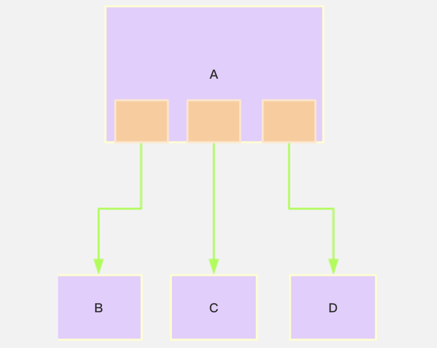
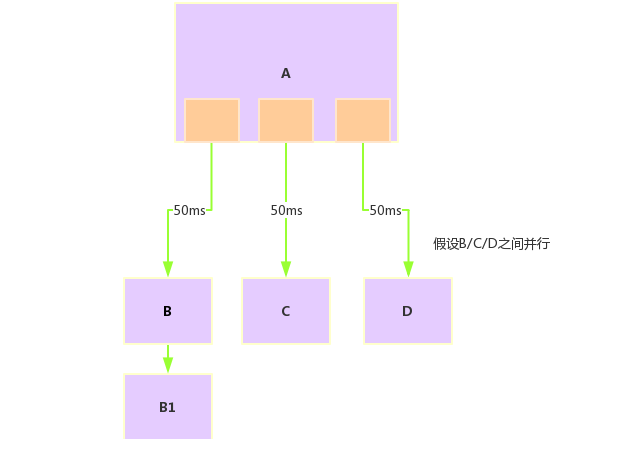
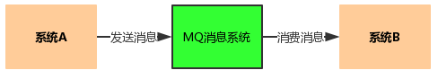
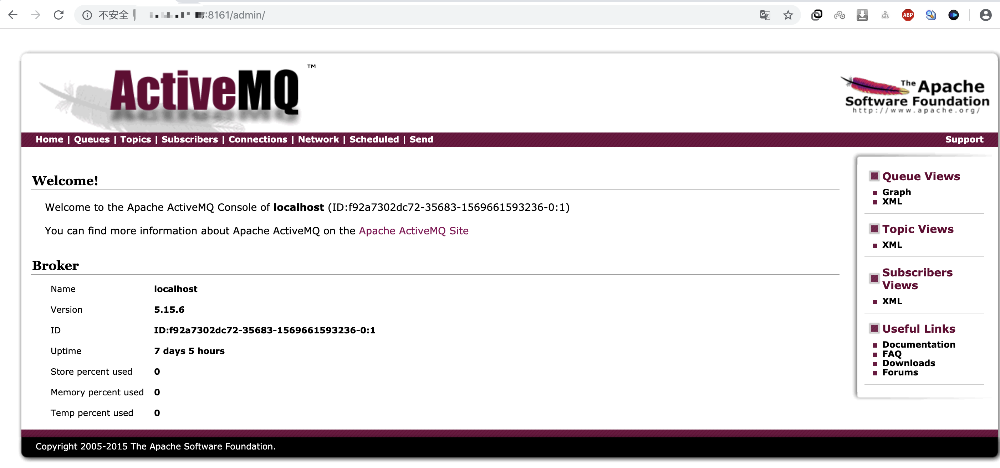

ActiveMQ

<font color="green">*@Author:hanguixian*</font> 

<font color="green">*@Email:hn_hanguixian@163.com*</font>


- MQ产品：Kafka、RabbitMQ、RocketMQ、ActiveMQ ...


## 一  概述

### 1 前言

- 何种场景下使用消息中间件
- 为什么要在系统中引入消息中间件

### 2 背景

#### 2.1系统之间直接调用--实际工程和存在的问题

- 微服务架构后，链式调用是我们在写程序时候的一般流程，为了完成一个整体功能会将其拆分成多个函数(或子模块)，比如模块A调用模块B,模块B调用模块C，模块C调用模块D。但在大型分布式应用中，系统间的RPC交互繁杂，一个功能背后要调用上百个接口并非不可能，从单机架构过渡到分布式微服务架构的通例，这种架构会有哪些问题???

#####  2.1.1 系统之间接口耦合严重

- 系统之间接口耦合比较严重，每新增一个下游功能，都要对上有的相关接口进行改造;
- 举个例子:假如系统A要发送数据给系统B和C，发送给每个系统的数据可能有差异，因此系统A对要发送给每个系统的数据进行了组装，然后逐一发送;
- 当代码上线后又新增了一个需求:把数据也发送给D,新上了一个D系统也要接受A系统的数据。此时就需要修改A系统，让他感知到D的存在，同时把数据处理好再给D。在这个过程中你会看到，每接入一个下游系统，都要对A系统进行代码改造，开发联调的效率很低。
- 其整体架构如下图



##### 2.2.2 面对大流量并发时，容易被冲垮

- 每个接口模块的吞吐能力是有限的，这个上限能力如同堤坝，当大流量(洪水)来临时，容易被冲垮。
  举个栗子秒杀业务: 
  - 上游系统发起下单购买操作，我就是下单一个操作
  - 下游系统完成秒杀业务逻辑(读取订单，库存检查，库存冻结，余额检查，余额冻结，订单生成，余额扣减，库存扣减，生成流水，余额解冻，库存解冻)

##### 2.1.3 等待同步存在性能问题

- RPC接口基本上是同步调用，整体的服务性能遵循“木桶理论”，即整体系统的耗时取决于链路中最慢的那个接口。比如A调用B/C/D都是50ms，但此时B又调用了B1，花费2000ms,那么直接就拖累了整个服务性能。



####  2.2 解决方案

根据上述的几个问题，在设计系统时可以明确要达到的目标:

- 能够解耦：要做到系统解耦，当新的模块接进来时，可以做到代码改动最小
- 能够削峰：设置流量缓冲池，可以让后端系统按照自身吞吐能力进行消费，不被冲垮
- 能够异步：强弱依赖梳理能将非关键调用链路的操作异步化并提升整体系统的吞吐能力

### 3 是什么？

#### 3.1 定义

- 面向消息的中间件(message-oriented middle ware)MOM能够很好的解决以上问题。
- 是指利用高效可靠的消息传递机制进行与平台无关的数据交流，并基于数据通信来进行分布式系统的集成。
- 通过提供消息传递和消息排队模型在分布式环境下提供应用解耦、弹性伸缩、冗余存储、流量削峰、异步通信、数据同步等功能。
- 大致的过程是这样的: 
  发送者把消息发送给消息服务器，消息服务器将消息存放在若干队列/主题中，在合适的时候，消息服务器会将消息转发给接受者。在这个过程中，发送和接受是异步的，也就是发送无需等待，而且发送者和接受者的生命周期也没有必然关系: 尤其在发布pub/订阅sub模式下，也可以完成一对多的通信，即让一个消息有多个接受者。

#### 3.2 特点

##### 3.2.1 采用异步处理模式

- 消息发送者可以发送一个消息而无须等待响应。消息发送者将消息发送到一条虛拟的通道(主题或队列)上;
- 消息接收者则订阅或监听该通道。一条信息可能最终转发给一个或多个消息接收者，这些接收者都无需对消息发送者做出同步回应。整个过程都是异步的。
- 案例:也就是说，一个系统跟另外一个系统之间进行通信的时候，假如系统A希望发送一个消息给系统B，让他去处理。但是系统A不关注系统B到底怎么处理或者有没有处理好，所以系统A把消息发送给MQ,然后就不管这条消息的“死活”了，接着系统B从MQ里消费出来处理即可。至于怎么处理，是否处理完毕，什么时候处理，都是系统B的事儿，与系统A无关。



- 这样的一种通信方式，就是所谓的“异步”通信方法，对于系统A来说，只要把消息发送给MQ，然后系统B就会异步去进行处理了，系统A不需要“同步”的等待系统B处理完。这样的好处是什么呢？解耦。

##### 3.2.2 应用系统之间解耦合

- 发送者和接受者不必了解对方，只需要确认消息。
- 发送者和接受者不必同时在线。

### 4 作用

- 异步
- 削峰
- 解耦

### 5 下载

- ActiveMQ官网：http://activemq.apache.org/

### 6 内容

- 最重要的功能：实现高可用、高性能、可伸缩、易用和安全的企业级功能
- 异步消息的消费和处理
- 控制消息的消费顺序
- 与spring/springboot整合
- MQ的集群容错
- ................


## 二 ActiveMQ安装和控制台

### 1 下载与安装

- 官网下载：http://activemq.apache.org/


- 下载到/opt目录下面
- 解压缩apache - activemq -5.15.6-bin. tar .gz
- 在根目录下mkdir /myactiveMQ
-  cp -r apache -activemq-5.15.6/myactiveMQ/
- 普通启动/停止mq:

```shell
 ./activemq start/stop
```

- activemq的默认进程端口是:61616

- 查看后台进程

```shell
ps -ef |grep activemq |  grep -v grep
```

- 带运行日志的启动方式

```shell
./activemq start > /myactiveMQ/run_activemq.log
```

### 2 Apache ActiveMQ控制台

- 控制台web地址：http://xxx:8161/admin
- 登录：
  - 默认用户：admin 默认密码：admin


​	



### 3 说明

- 采用61616端口人提供JMS服务
- 采用8161端口提供管理控制台服务


## 三 JAVA编程实现ActiveMQ通讯

### 1 JMS编程总体架构


### 2目的地Destination

- 队列queue
- 主题topic


- 比较

|            | Topic                                                        | Queue                                                        |
| ---------- | ------------------------------------------------------------ | ------------------------------------------------------------ |
| 工作模式   | 订阅发布模式，如果当前没有订阅者，消息将会被丢弃。如果有多个订阅者，那么这些订阅者都会收到消息 | 负载均衡模式，如果当前没有消费者，消息也不会丢弃如果有多个消费者，那么-条消息也只会发送给其中-个消费者, 并且要求消费者ack信息 |
| 有无状态   | 无状态                                                       | Queue数据默认会在mq服务器上以文件形式保存，比如Active MQ一般保存在${AMQ_ HOME}\data\kr -store\data下面。也可以配置成DB存储。 |
| 传递完整性 | 如果没有订阅者，消息会被丢弃                                 | 消息不会丢弃                                                 |
| 处理效率   | 由于消息要按照订阅者的数量进行复制，所以处理性能会随着订阅者的增加而明显降低，并且还要结合不同消息协议自身的性能差异 | 由于条消息只发送给一个消费者， 所以就算消费者再多，性能也不会有明显降低。当然不同消息协议的具体性能也是有差异的 |

### 3 在点对点的消息传递域中，目的地被称为队列(Queue)

- 每个消息只能有一个消费者，类似1对1的关系。好比个人快递自己领取自己的。
- 消息的生产者和消费者之间没有时间上的相关性。无论消费者在生产者发送消息的时候是否处于运行状态，消费者都可以提取消息。好比我们的发送短信，发送者发送后不见得接收者会即收即看。
- 消息被消费后队列中不会再存储，所以消费者不会消费到已经被消费掉的消息。

### 4 在发布订阅消息传递域中，目的地被称为主题(topic)

- 生产者将消息发布到topic中， 每个消息可以有多个消费者，属于1: N的关系
- 生产者和消费者之间有时间上的相关性。订阅某一个主题的消费者只能消费自它订阅之后发布的消息。
- 生产者生产时，topic不保存消息它是无状态的不落地，假如无人订阅就去生产，那就是一条废消息，所以，一般先启动消费者再启动生产者。
- JMS规范允许客户创建持久订阅，这在一定程度上放松了时间上的相关性要求。持久订阅允许消费者消费它在未处于激活状态时发送的消息。好比微信公众号订阅

### 5 入门代码

- pom.xml

```xml
<?xml version="1.0" encoding="UTF-8"?>

<project xmlns="http://maven.apache.org/POM/4.0.0" xmlns:xsi="http://www.w3.org/2001/XMLSchema-instance"
         xsi:schemaLocation="http://maven.apache.org/POM/4.0.0 http://maven.apache.org/xsd/maven-4.0.0.xsd">
    <modelVersion>4.0.0</modelVersion>

    <groupId>com.hgx</groupId>
    <artifactId>activemq-start</artifactId>
    <version>1.0-SNAPSHOT</version>
    
    <dependencies>
        <dependency>
            <groupId>org.apache.activemq</groupId>
            <artifactId>activemq-all</artifactId>
            <version>5.15.10</version>
        </dependency>
        <dependency>
            <groupId>junit</groupId>
            <artifactId>junit</artifactId>
            <version>4.11</version>
            <scope>test</scope>
        </dependency>
    </dependencies>

</project>

```

- 队列queue生产者

```java
import org.apache.activemq.ActiveMQConnectionFactory;
import javax.jms.*;

public class FirstQueueProvider {

    private static final String url = "tcp://xxx:61616";

    public static void main(String[] args) throws JMSException {

        //1.创建连接工厂，按照给定的URL地址，使用默认的用户和密码
        ConnectionFactory connectionFactory = new ActiveMQConnectionFactory(url);
        //2.通过连接工厂获取connection并访问
        Connection connection = connectionFactory.createConnection();
        connection.start();
        //3.创建会话session
        //两个参数，第一参数：事务，第二个参数：签收
        Session session = connection.createSession(false, Session.AUTO_ACKNOWLEDGE);
        //4.创建目的地，具体是队列Queue还是主题topic
        Queue queue01 = session.createQueue("queue01");
        //5.创建消息的生产者
        MessageProducer messageProducer = session.createProducer(queue01);
        //6. 通过消息生产者生产消息到MQ
        for (int i = 0; i < 3; i++) {
            //6.1 创建消息
            //文本消息
            TextMessage textMessage = session.createTextMessage("hello activeMQ--msg " + i);
            //6.2 发送到MQ
            messageProducer.send(textMessage);
        }

        //7.关闭资源
        messageProducer.close();
        session.close();
        connection.close();

        System.out.println("消息发送成功************");
    }
}
```

- 队列queue消费者

```java
import org.apache.activemq.ActiveMQConnectionFactory;
import javax.jms.*;
import java.io.IOException;

public class FirstQueueConsumer {
    private static final String url = "tcp://xxx:61616";

    public static void main(String[] args) throws JMSException, IOException {
        //1.创建连接工厂，按照给定的URL地址，使用默认的用户和密码
        ConnectionFactory connectionFactory = new ActiveMQConnectionFactory(url);
        //2.通过连接工厂获取connection并访问
        Connection connection = connectionFactory.createConnection();
        connection.start();
        //3.创建会话session
        //两个参数，第一参数：事务，第二个参数：签收
        Session session = connection.createSession(false, Session.AUTO_ACKNOWLEDGE);
        //4.创建目的地，具体是队列Queue还是主题topic
        Queue queue01 = session.createQueue("queue01");
        //5.创建消费者
        MessageConsumer messageConsumer = session.createConsumer(queue01);

        //消费方式1：同步阻塞方式（receive）订阅者或接收者调用MessageConsumer的receive方法来接收，receive方法在接收到消息之前或超时之前将一直阻塞
//        while (true) {
//            Message message = messageConsumer.receive(6000);
//            if (message instanceof TextMessage) {
//                TextMessage textMessage = (TextMessage) message;
//                System.out.println(textMessage.getText());
//            } else {
//                break;
//            }
//
//        }

        //消费方式2：异步非阻塞方式（监听器onMessage()方法）订阅者或接收者通过MessageConsumer的setMessageListener注册监听器，当消息到达之后，系统自动调用监听器MessageListener的onMessage方法
        messageConsumer.setMessageListener(new MessageListener() {
            public void onMessage(Message message) {
                if (message instanceof TextMessage) {
                    TextMessage textMessage = (TextMessage) message;
                    try {
                        String text = textMessage.getText();
                        System.out.println(text);
                    } catch (JMSException e) {
                        e.printStackTrace();
                    }
                }
            }
        });
        System.in.read();

        //关闭资源
        messageConsumer.close();
        session.close();
        connection.close();
    }

}
```

- 主题topic生产者

```java
import org.apache.activemq.ActiveMQConnectionFactory;
import javax.jms.*;

public class FirstTopicProvider {

    private static final String url = "tcp://xxx:61616";

    public static void main(String[] args) throws JMSException {

        //1.创建连接工厂，按照给定的URL地址，使用默认的用户和密码
        ConnectionFactory connectionFactory = new ActiveMQConnectionFactory(url);
        //2.通过连接工厂获取connection并访问
        Connection connection = connectionFactory.createConnection();
        connection.start();
        //3.创建会话session
        //两个参数，第一参数：事务，第二个参数：签收
        Session session = connection.createSession(false, Session.AUTO_ACKNOWLEDGE);
        //4.创建目的地，具体是队列Queue还是主题topic
        Topic topic01 = session.createTopic("topic01");
        //5.创建消息的生产者
        MessageProducer messageProducer = session.createProducer(topic01);
        //6. 通过消息生产者生产消息到MQ
        for (int i = 0; i < 3; i++) {
            //6.1 创建消息
            //文本消息
            TextMessage textMessage = session.createTextMessage("hello activeMQ--topic msg " + i);
            //6.2 发送到MQ
            messageProducer.send(textMessage);
        }

        //7.关闭资源
        messageProducer.close();
        session.close();
        connection.close();

        System.out.println("消息发送成功************");
    }
}
```

- 主题topic消费者

```java
import org.apache.activemq.ActiveMQConnectionFactory;
import javax.jms.*;
import java.io.IOException;

public class FirstTopicConsumer {
    private static final String url = "tcp://xxx:61616";

    public static void main(String[] args) throws JMSException, IOException {
        //1.创建连接工厂，按照给定的URL地址，使用默认的用户和密码
        ConnectionFactory connectionFactory = new ActiveMQConnectionFactory(url);
        //2.通过连接工厂获取connection并访问
        Connection connection = connectionFactory.createConnection();
        connection.start();
        //3.创建会话session
        //两个参数，第一参数：事务，第二个参数：签收
        Session session = connection.createSession(false, Session.AUTO_ACKNOWLEDGE);
        //4.创建目的地，具体是队列Queue还是主题topic
        Topic topic01 = session.createTopic("topic01");
        //5.创建消费者
        MessageConsumer messageConsumer = session.createConsumer(topic01);
        messageConsumer.setMessageListener(message->{
            if (message instanceof TextMessage) {
                TextMessage textMessage = (TextMessage) message;
                try {
                    String text = textMessage.getText();
                    System.out.println(text);
                } catch (JMSException e) {
                    e.printStackTrace();
                }
            }
        });
        System.in.read();

        //关闭资源
        messageConsumer.close();
        session.close();
        connection.close();
    }

}
```


## 四 JMS规范与落地产品

### 1 是什么

#### 1.1 JavaEE

- JavaEE是一套使用Java进行企业级应用开发的大家一致遵循的13个核心规范工业标准。JavaEE平台提供了一个基于组件的方法来加快设计、开发、装配及部署企业应用程序
  - JDBC(Java Database) 数据库连接
  - JNDI(Java Naming and Directory Interfaces) Java的命名和目录接口
  - EJB(Enterprise JavaBean)
  - RMI(Remote Method Invoke) 远程方法调用Java IDL(Interface Description Language)/CORBA(Common Object Broker Architecture) 接口定义语言公用对象请求代理程序体系结构
  - JSP(Java Server Pages)
  - Servlet
  - XML(Extensible Markup Language)可扩展白标记语言
  - JMS(Java Message Service) Java 消息服务
  - JTA(Java Transaction API) Java事务API 
  - JTS(Java Transaction Service) Java事务服务
  - JavaMail
  - JAF(JavaBean Activation Framework)

#### 1.2 Java Message Service(Java消息服务是JavaEE中的一个技术

- Java消息服务指的是两个应用程序之间进行异步通信的API,它为标准消息协议和消息服务提供了一组通用接口，包括创建、发送、读取消息等，用于支持JAVA应用程序开发。在JavaEE中，当两个应用程序使用JMS进行通信时，它们之间并不是直接相连的，而是通过一个共同的消息收发服务组件关联起来以达到解耦、异步、削峰的效果。


### 2 MQ中间件的其他落地产品

- Kafka、RabbitMQ、RocketMQ、ActiveMQ .....

### 3 JMS的组成结构和特点

#### 3.1 JMS Provider

- 实现JMs接口和规范的消息中间件，也就是我们的MQ服务器

#### 3.2 JMS producer

- 消息生产者，创建和发送JMS消息的客户端应用

#### 3.3 JMS consumer

- 消息消费者，接收和处理JMS消息的客户端应用

#### 3.4 JMS message

##### 3.4.1 消息头

- JMSDestination：消息发送的目的地，主要是指Queue和Topic
- JMSDeliveryMode：
  - 持久模式和非持久模式。
  - 一条持久性的消息:应该被传送“一次仅仅一次”，这就意味者如果JMS提供者出现故障，该消息并不会丢失，它会在服务器恢复之后再次传递。
  - 一条非持久的消息:最多会传送一次，这意味这服务器出现故障，该消息将永远丢失。
- JMSExpiration
  - 可以设置消息在一定时间后过期，默认是永不过期
  - 消息过期时间，等于Destination的send方法中的timeToLive值加上发送时刻的GMT时间值。
  - 如果timeToLive值等于零，则JMSExpiration 被设为零，表示该消息永不过期。
  - 如果发送后，在消息过期时间之后消息还没有被发送到目的地，则该消息被清除。
- JMSPriority
  - 消息优先级，从0-9十个级别，0到4是普通消息,5到9是加急消息。
  - JMS不要求MQ严格按照这十个优先级发送消息，但必须保证加急消息要先于普通消息到达。默认是4级。
- JMSMessageID
  - 唯一识别每个消息的标识由MQ产生

##### 3.4.2 消息体

- 封装具体的消息数据
- 5种消息格式
  - TextMessage：普通字符串消息， 包含一个string
  - MapMessage：一个Map类型的消息，key为string类型，而值为Java的基本类型
  - BytesMessage：二进制数组消息，包含一个byte[]
  - StreamMessage：Java数据流消息，用标准流操作来顺序的填充和读取。
  - ObjectMessage：对象消息，包含一个可序列化的Java对象
- 发送和接受的消息体类型必须一致对应

##### 3.4.3 消息属性

- 如果需要除消息头字段以外的值，那么可以使用消息属性
- 识别/去重/重点标注等操作非常有用的方
- 是什么
  - 他们是以属性名和属性值对的形式制定的。可以将属性视为消息头的扩展，属性指定一些消息头没有包括的附加信息，比如可以在属性里指定消息选择器。
  - 消息的属性就像可以分配给一条消息的附加消息头一样。 它们允许开发者添加有关消息的不透明附加信息。它们还用于暴露消息选择器在消息过滤时使用的数据。

```java
TextMessage message = session.createTextMessage();
message.setText(text);
message. setStringProperty("username'","z3"); /自定义属性
```

### 4 JMS的可靠性

#### 4.1 持久化PERSISTENT

##### 4.1.1 参数设置说明

- 持久

  - `messageProducer.setDeliveryMode(DeliveryMode.NON_PERSISTENT)`
  - 当服务器宕机，消息不存在
- 非持久
  - `messageProducer.setDeliveryMode(DeliveryMode.PERSISTENT)`
  - 当服务器宕机，消息依然存在
- 默认是持久还是非持久？

##### 4.1.2 持久的Queue

- 持久化消息是队列的的默认传送模式，此模式保证这些消息只被传送一次和成功使用一次。对于这些消息，可靠性是优先考虑的因素。可靠性的另一个重要方面是确保持久性消息传送至目标后，消息服务在向消费者传送它们之前不会丢失这些消息。
- 设置队列消息非持久

```java
/**
生产者新增：messageProducer.setDeliveryMode(DeliveryMode.NON_PERSISTENT)
消费者不变，保持queue name 一致
*/
import org.apache.activemq.ActiveMQConnectionFactory;

import javax.jms.*;

public class ReliabilityQueueProvider {

    private static final String url = "tcp://xxx:61616";

    public static void main(String[] args) throws JMSException {

        //1.创建连接工厂，按照给定的URL地址，使用默认的用户和密码
        ConnectionFactory connectionFactory = new ActiveMQConnectionFactory(url);
        //2.通过连接工厂获取connection并访问
        Connection connection = connectionFactory.createConnection();
        connection.start();
        //3.创建会话session
        //两个参数，第一参数：事务，第二个参数：签收
        Session session = connection.createSession(false, Session.AUTO_ACKNOWLEDGE);
        //4.创建目的地，具体是队列Queue还是主题topic
        Queue queue01 = session.createQueue("queueReliability");
        //5.创建消息的生产者
        MessageProducer messageProducer = session.createProducer(queue01);
        //消息持久化PERSISTENT、非持久化NON_PERSISTENT
        messageProducer.setDeliveryMode(DeliveryMode.NON_PERSISTENT);
        //6. 通过消息生产者生产消息到MQ
        for (int i = 0; i < 3; i++) {
            //6.1 创建消息
            //文本消息
            TextMessage textMessage = session.createTextMessage("hello activeMQ--queueReliability msg  " + i);
            //6.2 发送到MQ
            textMessage.acknowledge();
            messageProducer.send(textMessage);
        }

        //7.关闭资源
        messageProducer.close();
        session.close();
        connection.close();

        System.out.println("消息发送成功************");
    }
}
```

- 非持久下控制台变化：生产消息-->服务器宕机-->重启


- 设置设置队列消息持久

```java
//修该非持久代码段：messageProducer.setDeliveryMode(DeliveryMode.NON_PERSISTENT);为-->
messageProducer.setDeliveryMode(DeliveryMode.PERSISTENT);
```

- 持久下控制台：生产消息-->服务器宕机-->重启 控制台变化


- 不写该段代码，队列默认为持久化。

##### 4.1.3 持久的Topic

- 类似微信公众号订阅发布
- 持久化主题topic生产者代码

```java
import org.apache.activemq.ActiveMQConnectionFactory;

import javax.jms.*;

public class ReliabilityTopicProvider {

    private static final String url = "tcp://xxx:61616";

    public static void main(String[] args) throws JMSException {

        //1.创建连接工厂，按照给定的URL地址，使用默认的用户和密码
        ConnectionFactory connectionFactory = new ActiveMQConnectionFactory(url);
        //2.通过连接工厂获取connection
        Connection connection = connectionFactory.createConnection();
        //3.创建会话session
        //两个参数，第一参数：事务，第二个参数：签收
        Session session = connection.createSession(false, Session.AUTO_ACKNOWLEDGE);
        //4.创建目的地，具体是队列Queue还是主题topic
        Topic topic01 = session.createTopic("topicReliability");
        //5.创建消息的生产者
        MessageProducer messageProducer = session.createProducer(topic01);
      	//持久化
        messageProducer.setDeliveryMode(DeliveryMode.PERSISTENT);

        connection.start();

        //6. 通过消息生产者生产消息到MQ
        for (int i = 0; i < 3; i++) {
            //6.1 创建消息
            //文本消息
            TextMessage textMessage = session.createTextMessage("hello activeMQ--topic Reliability  msg " + i);
            //6.2 发送到MQ
            messageProducer.send(textMessage);
        }

        //7.关闭资源
        messageProducer.close();
        session.close();
        connection.close();

        System.out.println("消息发送成功************");
    }
}

```

- 持久化主题topic消费者代码

```java
import org.apache.activemq.ActiveMQConnectionFactory;

import javax.jms.*;
import java.io.IOException;

public class ReliabilityTopicConsumer {
    private static final String url = "tcp://xxx:61616";

    public static void main(String[] args) throws JMSException, IOException {
        //1.创建连接工厂，按照给定的URL地址，使用默认的用户和密码
        ConnectionFactory connectionFactory = new ActiveMQConnectionFactory(url);
        //2.通过连接工厂获取connection并访问
        Connection connection = connectionFactory.createConnection();
        connection.setClientID("hgx_topic01");
        //3.创建会话session
        //两个参数，第一参数：事务，第二个参数：签收
        Session session = connection.createSession(false, Session.AUTO_ACKNOWLEDGE);
        //4.创建目的地，具体是队列Queue还是主题topic
        Topic topic01 = session.createTopic("topicReliability");
        TopicSubscriber topicSubscriber = session.createDurableSubscriber(topic01, "remark");

        connection.start();

        Message message = topicSubscriber.receive();
        while (message instanceof TextMessage) {
            TextMessage textMessage = (TextMessage) message;
            System.out.println("接收到持久化topic --->" + textMessage.getText());
            message = topicSubscriber.receive();
        }

        //关闭资源
        session.close();
        connection.close();
    }
}
```

- 控制台：启动订阅者（消费者）-->关闭订阅者-->启动生产者（发布者）-->启动订阅者-->关闭订阅者

消费者启动


消费者关闭


生产者启动


生产者启动，消费者启动-->消费成功


消费者关闭


#### 4.2 事务

- 事务偏生产者，签收偏消费者

##### 4.2.1 producer提交时的事务

- false
  - 只要执行send，消息就进入到队列中
  - 关闭事务，那第二个签收参数需要设置有效
- true
  - 先执行send，再执行commit，消息才被真正的提交到队列中
  - 消息需要批量发送，需要缓冲区处理

##### 4.2.2 示例代码

- 生产者

```java
import org.apache.activemq.ActiveMQConnectionFactory;
import javax.jms.*;

public class TransactionQueueProvider {

    private static final String url = "tcp://xxx:61616";

    public static void main(String[] args) throws JMSException {

        //1.创建连接工厂，按照给定的URL地址，使用默认的用户和密码
        ConnectionFactory connectionFactory = new ActiveMQConnectionFactory(url);
        //2.通过连接工厂获取connection并访问
        Connection connection = connectionFactory.createConnection();
        connection.start();
        //3.创建会话session
        //两个参数，第一参数：事务，第二个参数：签收
        //true 开启事务
        Session session = connection.createSession(true, Session.AUTO_ACKNOWLEDGE);
        //4.创建目的地，具体是队列Queue还是主题topic
        Queue queue01 = session.createQueue("queueTransaction");
        //5.创建消息的生产者
        MessageProducer messageProducer = session.createProducer(queue01);
        //6. 通过消息生产者生产消息到MQ
        for (int i = 0; i < 3; i++) {
            //6.1 创建消息
            //文本消息
            TextMessage textMessage = session.createTextMessage("hello activeMQ--transaction msg " + i);
            //6.2 发送到MQ
            messageProducer.send(textMessage);
        }

        //7.关闭资源
        messageProducer.close();
        //提交事务
        session.commit();
        session.close();
        connection.close();

        System.out.println("消息发送成功************");
    }
}
```

- 消费者

```java
import org.apache.activemq.ActiveMQConnectionFactory;
import javax.jms.*;
import java.io.IOException;

public class TransactionQueueConsumer {
    private static final String url = "tcp://xxx:61616";

    public static void main(String[] args) throws JMSException, IOException {
        //1.创建连接工厂，按照给定的URL地址，使用默认的用户和密码
        ConnectionFactory connectionFactory = new ActiveMQConnectionFactory(url);
        //2.通过连接工厂获取connection并访问
        Connection connection = connectionFactory.createConnection();
        connection.start();
        //3.创建会话session
        //两个参数，第一参数：事务，第二个参数：签收
        //开启事务
        Session session = connection.createSession(true, Session.AUTO_ACKNOWLEDGE);
        //4.创建目的地，具体是队列Queue还是主题topic
        Queue queue01 = session.createQueue("queueTransaction");
        //5.创建消费者
        MessageConsumer messageConsumer = session.createConsumer(queue01);

        //消费方式1：同步阻塞方式（receive）订阅者或接收者调用MessageConsumer的receive方法来接收，receive方法在接收到消息之前或超时之前将一直阻塞
        while (true) {
            Message message = messageConsumer.receive(4000);
            if (message instanceof TextMessage) {
                TextMessage textMessage = (TextMessage) message;
                System.out.println(textMessage.getText());
            } else {
                break;
            }

        }

        //关闭资源
        messageConsumer.close();
        //提交事务
        session.commit();
        session.close();
        connection.close();
    }

}
```

##### 4.2.3  控制台效果

- 生产者启动，开始事务，不commit，控制台中可以看到没有任何消息进入MQ


- 生产者启动，开始事务，并commit，控制台中可以看到消息进入MQ


- 消费者启动，开始事务，不commit，可以看到消息没有出MQ，消费者端可以重复消费


- 消费者启动，开始事务，并commit，可以看到消息消费成功


- idea控制台打印如下


#### 4.3 签收Acknowledge

##### 4.3.1 非事务

- 自动签收（默认）：`Session.AUTO_ACKNOWLEDGE`
- 手动签收:`Session.CLIENT_ACKNOWLEDGE`,客户端调用acknowledge方法手动签收 
- 允许重复消息:`Session.DUPS_OK_ACKNOWLEDGE`

###### 4.3.1.1 代码

- 生产者

```java
import org.apache.activemq.ActiveMQConnectionFactory;
import javax.jms.*;

public class AcknowledgeNoTransactionQueueProvider {

    private static final String url = "tcp://xxx:61616";

    public static void main(String[] args) throws JMSException {

        //1.创建连接工厂，按照给定的URL地址，使用默认的用户和密码
        ConnectionFactory connectionFactory = new ActiveMQConnectionFactory(url);
        //2.通过连接工厂获取connection并访问
        Connection connection = connectionFactory.createConnection();
        connection.start();
        //3.创建会话session
        //两个参数，第一参数：事务，第二个参数：签收
        Session session = connection.createSession(false, Session.AUTO_ACKNOWLEDGE);
        //4.创建目的地，具体是队列Queue还是主题topic
        Queue queue01 = session.createQueue("queueAcknowledgeNoTransaction");
        //5.创建消息的生产者
        MessageProducer messageProducer = session.createProducer(queue01);
        //6. 通过消息生产者生产消息到MQ
        for (int i = 0; i < 3; i++) {
            //6.1 创建消息
            //文本消息
            TextMessage textMessage = session.createTextMessage("hello activeMQ-- AcknowledgeNoTransaction msg " + i);
            //6.2 发送到MQ
            messageProducer.send(textMessage);
        }

        //7.关闭资源
        messageProducer.close();
        session.close();
        connection.close();

        System.out.println("消息发送成功************");
    }
}
```

- 消费者

```java
package com.hgx.activemq.acknowledge.consumers;

import org.apache.activemq.ActiveMQConnectionFactory;

import javax.jms.*;
import java.io.IOException;

public class AcknowledgeNoTransactionQueueConsumer {
    private static final String url = "tcp://106.14.217.80:61616";

    public static void main(String[] args) throws JMSException, IOException {
        //1.创建连接工厂，按照给定的URL地址，使用默认的用户和密码
        ConnectionFactory connectionFactory = new ActiveMQConnectionFactory(url);
        //2.通过连接工厂获取connection并访问
        Connection connection = connectionFactory.createConnection();
        connection.start();
        //3.创建会话session
        //两个参数，第一参数：事务，第二个参数：签收
        Session session = connection.createSession(false, Session.CLIENT_ACKNOWLEDGE);
        //4.创建目的地，具体是队列Queue还是主题topic
        Queue queue01 = session.createQueue("queueAcknowledgeNoTransaction");
        //5.创建消费者
        MessageConsumer messageConsumer = session.createConsumer(queue01);

        //消费方式1：同步阻塞方式（receive）订阅者或接收者调用MessageConsumer的receive方法来接收，receive方法在接收到消息之前或超时之前将一直阻塞
        while (true) {
            Message message = messageConsumer.receive(2000);
            if (message instanceof TextMessage) {
                TextMessage textMessage = (TextMessage) message;
                //手动签收
                message.acknowledge();
                System.out.println(textMessage.getText());
            } else {
                break;
            }

        }

        //关闭资源
        messageConsumer.close();
        session.close();
        connection.close();
    }

}
```

###### 4.3.1.2 控制台效果

- 生产者启动，消费者启动，消费者设置手动签收`Session.CLIENT_ACKNOWLEDGE`，不写 `message.acknowledge()`,即不显示签收，消息不出MQ，消费者端存在重复消费


- 生产者启动，消费者启动，消费者设置手动签收`Session.CLIENT_ACKNOWLEDGE`，写 `message.acknowledge()`,即显示签收，消息消费成功


##### 4.3.2 事务

- 事务开启后，只有commit后才能将消息生产或消费

###### 4.3.2.1 代码

- 消息生产者
```java
import org.apache.activemq.ActiveMQConnectionFactory;
import javax.jms.*;

public class AcknowledgeTransactionQueueProvider {

    private static final String url = "tcp://xxx:61616";

    public static void main(String[] args) throws JMSException {

        //1.创建连接工厂，按照给定的URL地址，使用默认的用户和密码
        ConnectionFactory connectionFactory = new ActiveMQConnectionFactory(url);
        //2.通过连接工厂获取connection并访问
        Connection connection = connectionFactory.createConnection();
        connection.start();
        //3.创建会话session
        //两个参数，第一参数：事务，第二个参数：签收
        Session session = connection.createSession(true, Session.AUTO_ACKNOWLEDGE);
        //4.创建目的地，具体是队列Queue还是主题topic
        Queue queue01 = session.createQueue("queueAcknowledgeTransaction");
        //5.创建消息的生产者
        MessageProducer messageProducer = session.createProducer(queue01);
        //6. 通过消息生产者生产消息到MQ
        for (int i = 0; i < 3; i++) {
            //6.1 创建消息
            //文本消息
            TextMessage textMessage = session.createTextMessage("hello activeMQ-- AcknowledgeTransaction msg " + i);
            //6.2 发送到MQ
            messageProducer.send(textMessage);
        }

        //7.关闭资源
        messageProducer.close();
        session.commit();
        session.close();
        connection.close();

        System.out.println("消息发送成功************");
    }
}
```

- 消息消费者
```java
import org.apache.activemq.ActiveMQConnectionFactory;
import javax.jms.*;
import java.io.IOException;

/**
 * 在事务开启的情况下，签收参数无所谓，事务提交成功则默认签收，如果不commit，则签收无效，消息会被重复消费到
 */
public class AcknowledgeTransactionQueueConsumer {
    private static final String url = "tcp://xxx:61616";

    public static void main(String[] args) throws JMSException, IOException {
        //1.创建连接工厂，按照给定的URL地址，使用默认的用户和密码
        ConnectionFactory connectionFactory = new ActiveMQConnectionFactory(url);
        //2.通过连接工厂获取connection并访问
        Connection connection = connectionFactory.createConnection();
        connection.start();
        //3.创建会话session
        //两个参数，第一参数：事务，第二个参数：签收
        Session session = connection.createSession(true, Session.CLIENT_ACKNOWLEDGE);
        //4.创建目的地，具体是队列Queue还是主题topic
        Queue queue01 = session.createQueue("queueAcknowledgeTransaction");
        //5.创建消费者
        MessageConsumer messageConsumer = session.createConsumer(queue01);

        //消费方式1：同步阻塞方式（receive）订阅者或接收者调用MessageConsumer的receive方法来接收，receive方法在接收到消息之前或超时之前将一直阻塞
        while (true) {
            Message message = messageConsumer.receive(1000);
            if (message instanceof TextMessage) {
                TextMessage textMessage = (TextMessage) message;
                //手动签收
                //message.acknowledge();
                System.out.println(textMessage.getText());
            } else {
                break;
            }

        }

        //关闭资源
        messageConsumer.close();
        session.commit();
        session.close();
        connection.close();
    }

}
```

###### 4.3.2.2 控制台效果

- 生产者开启，并开启事务，生产消息，commit；消费者开启，并开启事务，不管ack参数是自动签收还是手动签收，只要没有commit提交，消息不会出MQ


- 生产者开启，并开启事务，生产消息，commit；消费者开启，并开启事务，不管ack参数是自动签收还是手动签收，commit提交，消息会被消费


##### 4.3.3 签收和事务关系
- 签收和事务关系
  - 在事务性会话中，当一个事务成功提交则消息被自动签收。如果事务回滚，则消息会被再次传送
  - 在非事务性会话中，消息何时被确认取决于创建会话时的应答模式（Acknowledgement mode）

### 5 JMS的点对点总结

- 点对点模型是基于队列的，生产者发消息到队列，消费者从队列接收消息，队列的存在使得消息的异步传输成为可能。和我们平时给朋友发送短信类似。
  - 1:如果在Session关闭时有部分消息已被收到但还没有被签收(acknowledged)， 那当消费者下次连接到相同的队列时，这些消息还会被再次接收
  - 2:队列可以长久地保存消息直到消费者收到消息。消费者不需要因为担心消息会丢失而时刻和队列保持激活的连接状态，充分体现了异步传输模式的优势

### 6 JMS的发布订阅总结

- JMS的Pub/Sub模型定义了如何向一个内容节点发布和订阅消息，这些节点被称作topic
- 主题可以被认为是消息的传输中介，发布者(publisher)发布消息到主题，订阅者(subscribe)从主题订阅消息。主题使得消息订阅者和消息发布者保持互相独立，不需要接触即可保证消息的传送。

##### 6.1 非持久订阅

- 非持久订阅只有当客户端处于激活状态，也就是和MQ保持连接状态才能收到发送到某个主题的消息。如果消费者处于离线状态，生产者发送的主题消息将会丢失作废，消费者永远不会收到。
- 一句话:先要订阅注册才能接受到发布，只给订阅者发布消息。

##### 6.2 持久订阅

- 客户端首先向MQ注册一个自己的身份ID识别号，当这个客户端处于离线时，生产者会为这个ID保存所有发送到主题的消息，当客户再次连接到MQ时会根据消费者的ID得到所有当自己处于离线时发送到主题的消息。
- 非持久订阅状态下，不能恢复或重新派送一个未签收的消息。
- 持久订阅才能恢复或重新派送一个未签收的消息。

##### 6.3 说明

- 当所有的消息必须被接受，则用持久订阅。当丢失消息能够被容忍，则可以用非持久订阅

## 五 ActiveMQ的Broker

### 1 是什么

- 相当于一个ActiveMQ服务器实例
- Broker其实就是实现了用代码的形式启动ActiveMQ将MQ嵌入到Java代码中，以便随用随事启动，达到了节约资源的目的，同时也保证了可靠性。

### 2 嵌入式Broker

- 用ActiveMQ Broker作单独立的消息服多器来杓建JAVA应用。
- ActiveMQ也支持在vm中通信基于嵌入式的broker,能移无缝的集成其它java应用

#### 2.1 代码

- pom.xml

```xml
<dependencies>
    <dependency>
      <groupId>org.apache.activemq</groupId>
      <artifactId>activemq-all</artifactId>
      <version>5.15.10</version>
    </dependency>
    <!-- https://mvnrepository.com/artifact/com.fasterxml.jackson.core/jackson-databind -->
    <dependency>
      <groupId>com.fasterxml.jackson.core</groupId>
      <artifactId>jackson-databind</artifactId>
      <version>2.10.0</version>
    </dependency>
</dependencies>
```

- BrokerServer

```java
import org.apache.activemq.broker.Broker;
import org.apache.activemq.broker.BrokerService;

public class ActiveBrokerServer {

    public static void main(String[] args) throws Exception {
        //activeMQ也支持在VM中通信给予嵌入式的broker
        BrokerService brokerService = new BrokerService() ;
        brokerService.setUseJmx(true);
        brokerService.addConnector("tcp://localhost:61616") ;
        brokerService.start();
    }
}
```

## 六 Spring整合ActiveMQ

### 1 代码

- 项目结构


- pom.xml 依赖

```xml
<dependencies>
    <!-- https://mvnrepository.com/artifact/org.springframework/spring-context -->
    <dependency>
      <groupId>org.springframework</groupId>
      <artifactId>spring-context</artifactId>
      <version>5.2.0.RELEASE</version>
    </dependency>

    <!-- https://mvnrepository.com/artifact/org.springframework/spring-jms -->
    <dependency>
      <groupId>org.springframework</groupId>
      <artifactId>spring-jms</artifactId>
      <version>5.2.0.RELEASE</version>
    </dependency>
    <!-- https://mvnrepository.com/artifact/org.apache.activemq/activemq-pool -->
    <dependency>
      <groupId>org.apache.activemq</groupId>
      <artifactId>activemq-pool</artifactId>
      <version>5.15.10</version>
    </dependency>
    <!-- https://mvnrepository.com/artifact/com.fasterxml.jackson.core/jackson-databind -->
    <dependency>
      <groupId>com.fasterxml.jackson.core</groupId>
      <artifactId>jackson-databind</artifactId>
      <version>2.10.0</version>
    </dependency>

    <dependency>
      <groupId>junit</groupId>
      <artifactId>junit</artifactId>
      <version>4.11</version>
      <scope>test</scope>
    </dependency>

    <dependency>
      <groupId>org.slf4j</groupId>
      <artifactId>slf4j-simple</artifactId>
      <version>1.7.25</version>
    </dependency>

  </dependencies>
```

- spring配置:applicationContext.xml

```xml
<?xml version="1.0" encoding="UTF-8"?>
<beans xmlns="http://www.springframework.org/schema/beans"
       xmlns:xsi="http://www.w3.org/2001/XMLSchema-instance"
       xmlns:context="http://www.springframework.org/schema/context"
       xsi:schemaLocation="http://www.springframework.org/schema/context
http://www.springframework.org/schema/context/spring-context.xsd
 http://www.springframework.org/schema/beans http://www.springframework.org/schema/beans/spring-beans.xsd">

    <context:component-scan base-package="com.hgx.spring.activemq"/>

      <!--配置activeMQ连接信息-->
    <bean id="jmsFactory" class="org.apache.activemq.pool.PooledConnectionFactory" destroy-method="stop">
        <property name="connectionFactory">
            <bean class="org.apache.activemq.ActiveMQConnectionFactory">
                <property name="brokerURL" value="tcp://106.14.217.80:61616"/>
            </bean>
        </property>
        <property name="maxConnections" value="100"/>
    </bean>

    <!--配置队列-->
    <bean id="destinationQueue" class="org.apache.activemq.command.ActiveMQQueue">
        <constructor-arg index="0" value="spring-active-queue"/>
    </bean>

    <!--配置主题-->
    <bean id="destinationTopic" class="org.apache.activemq.command.ActiveMQTopic">
        <constructor-arg index="0" value="spring-active-topic"/>
    </bean>

 <!--配置JmsTemplate信息，jmsTemplate配置好后，使用jmsTemplate操作ActiveMQ生产及消费-->
    <bean id="jmsTemplate" class="org.springframework.jms.core.JmsTemplate">
        <!--配置连接工厂-->
        <property name="connectionFactory" ref="jmsFactory"/>
         <!--配置目的地，是主题还是队列，目前配置是队列，要配置主题，只需要修改为上面配置的主题bean的id:destinationTopic即可-->
        <property name="defaultDestination" ref="destinationQueue"/>
         <!--消息转换器-->
        <property name="messageConverter">
            <bean class="org.springframework.jms.support.converter.SimpleMessageConverter"/>
        </property>
    </bean>

     <!--消息监听消费，手动消费，无需配置-->
    <bean id="jmsContainer" class="org.springframework.jms.listener.DefaultMessageListenerContainer">
        <property name="connectionFactory" ref="jmsFactory"/>
        <property name="destination" ref="destinationQueue"/>
        <property name="messageListener" ref="myMessageListener"/>
    </bean>

</beans>
```

- 消息生产者:ActiveMQProduce.java

```java
import org.springframework.beans.factory.annotation.Autowired;
import org.springframework.context.ApplicationContext;
import org.springframework.context.support.ClassPathXmlApplicationContext;
import org.springframework.jms.core.JmsTemplate;
import org.springframework.stereotype.Component;

@Component
public class ActiveMQProduce {

    @Autowired
    private JmsTemplate jmsTemplate;

    public static void main(String[] args) {
        ApplicationContext applicationContext = new ClassPathXmlApplicationContext("applicationContext.xml");
        ActiveMQProduce activeMQProduce = (ActiveMQProduce) applicationContext.getBean("activeMQProduce");
        activeMQProduce.jmsTemplate.send(session -> session.createTextMessage("-------spring activeMQ message--------"));
        System.out.println("--------spring message send success-----------");
    }
}
```

- 消息消费者--方式一：手动消费 只需要使用`jmsTemplate.receiveAndConvert()` 即可

```java
//消费
String content = (String)jmsTemplate.receiveAndConvert();
```

- 消息消费者--方式二：监听消费，实现MessageListener接口，重写onMessage方法，在sping配置中配置监听，如上面applicationContext.xml配置所示（jmsContainer）

```java
import org.springframework.stereotype.Component;
import javax.jms.JMSException;
import javax.jms.Message;
import javax.jms.MessageListener;
import javax.jms.TextMessage;

@Component
public class MyMessageListener implements MessageListener {

    @Override
    public void onMessage(Message message) {
        if (message instanceof TextMessage) {
            TextMessage textMessage = (TextMessage) message;
            try {
                System.out.println("消费：" + textMessage.getText());
            } catch (JMSException e) {
                e.printStackTrace();
            }
        }
    }
}
```

## 七 SpringBoot整合ActiveMQ

### 1 代码

- 项目结构


- pom.xml

```xml
<?xml version="1.0" encoding="UTF-8"?>
<project xmlns="http://maven.apache.org/POM/4.0.0" xmlns:xsi="http://www.w3.org/2001/XMLSchema-instance"
         xsi:schemaLocation="http://maven.apache.org/POM/4.0.0 https://maven.apache.org/xsd/maven-4.0.0.xsd">
    <modelVersion>4.0.0</modelVersion>
    <parent>
        <groupId>org.springframework.boot</groupId>
        <artifactId>spring-boot-starter-parent</artifactId>
        <version>2.2.1.RELEASE</version>
        <relativePath/>
    </parent>
    <groupId>com.hgx</groupId>
    <artifactId>springboot-activemq</artifactId>
    <version>0.0.1-SNAPSHOT</version>
    <name>springboot-activemq</name>
    <description>Demo project for Spring Boot</description>

    <properties>
        <java.version>1.8</java.version>
    </properties>

    <dependencies>
        <dependency>
            <groupId>org.springframework.boot</groupId>
            <artifactId>spring-boot-starter-web</artifactId>
        </dependency>
        
        <dependency>
            <groupId>org.springframework.boot</groupId>
            <artifactId>spring-boot-starter-activemq</artifactId>
            <version>2.2.1.RELEASE</version>
        </dependency>
        
        <dependency>
            <groupId>org.springframework.boot</groupId>
            <artifactId>spring-boot-starter-test</artifactId>
            <scope>test</scope>
            <exclusions>
                <exclusion>
                    <groupId>org.junit.vintage</groupId>
                    <artifactId>junit-vintage-engine</artifactId>
                </exclusion>
            </exclusions>
        </dependency>
        <dependency>
            <groupId>junit</groupId>
            <artifactId>junit</artifactId>
            <version>4.12</version>
            <scope>test</scope>
        </dependency>
    </dependencies>

    <build>
        <plugins>
            <plugin>
                <groupId>org.springframework.boot</groupId>
                <artifactId>spring-boot-maven-plugin</artifactId>
            </plugin>
        </plugins>
    </build>

</project>
```

- 配置：application.yml

```yaml
server:
  port: 8888

spring:
  activemq:
    broker-url: tcp://106.14.217.80:61616
    user: admin
    password: admin
  jms:
    pub-sub-domain: true   # false=Queue true=Topic

#自定义队列名称
myQueue: boot-active-queue
#自定义主题名
myTopic: boot-active-Topic
```

- 配置类:ConfigBean.java

```java
import org.apache.activemq.command.ActiveMQQueue;
import org.apache.activemq.command.ActiveMQTopic;
import org.springframework.beans.factory.annotation.Value;
import org.springframework.context.annotation.Bean;
import org.springframework.jms.annotation.EnableJms;
import org.springframework.stereotype.Component;

import javax.jms.Queue;
import javax.jms.Topic;
import javax.validation.Valid;

@Component
@EnableJms
public class ConfigBean {

    @Value("${myQueue}")
    private String myQueue ;

    @Value("${myTopic}")
    private String myTopic;

    @Bean
    public Queue queue(){
        return new ActiveMQQueue(myQueue) ;
    }

    @Bean
    public Topic topic(){
        return new ActiveMQTopic(myTopic) ;
    }
}
```

 - springboot启动类

```java
import org.springframework.boot.SpringApplication;
import org.springframework.boot.autoconfigure.SpringBootApplication;
import org.springframework.scheduling.annotation.EnableScheduling;

@SpringBootApplication
@EnableScheduling
public class SpringbootActivemqApplication {

    public static void main(String[] args) {
        SpringApplication.run(SpringbootActivemqApplication.class, args);
    }

}
```


- 生产者-队列：QueueProduce.java

```java
import org.springframework.beans.factory.annotation.Autowired;
import org.springframework.jms.core.JmsMessagingTemplate;
import org.springframework.scheduling.annotation.Scheduled;
import org.springframework.stereotype.Component;

import javax.jms.Queue;
import java.util.UUID;

@Component
public class QueueProduce {

    @Autowired
    private JmsMessagingTemplate jmsMessagingTemplate;

    @Autowired
    private Queue queue;

    public void produceMsg() {
        jmsMessagingTemplate.convertAndSend(queue, "kkkkk" + UUID.randomUUID().toString());
    }

    /**
     * 3秒一次
     */
//    @Scheduled(fixedDelay = 3000)
    public void produceMSgScheduled() {

        jmsMessagingTemplate.convertAndSend(queue, "produceMSgScheduled" + UUID.randomUUID().toString());

        System.out.println("produceMSgScheduled.................");

    }

}
```

- 消费者-队列:QueueConsumer.java

```java
import org.springframework.jms.annotation.JmsListener;
import org.springframework.stereotype.Component;

import javax.jms.JMSException;
import javax.jms.TextMessage;

@Component
public class QueueConsumer {

    @JmsListener(destination = "${myQueue}")
    public void receive(TextMessage textMessage) throws JMSException {
        System.out.println(".....消费者收到消息：" + textMessage.getText());
    }
}

```

- 生产者-主题:TopicProduce.java

```java
import org.springframework.beans.factory.annotation.Autowired;
import org.springframework.jms.core.JmsMessagingTemplate;
import org.springframework.scheduling.annotation.Scheduled;
import org.springframework.stereotype.Component;

import javax.jms.Queue;
import javax.jms.Topic;
import java.util.UUID;

@Component
public class TopicProduce {

    @Autowired
    private JmsMessagingTemplate jmsMessagingTemplate;

    @Autowired
    private Topic topic;

    public void produceMsg() {
        jmsMessagingTemplate.convertAndSend(topic, "topic" + UUID.randomUUID().toString());
    }

    /**
     * 3秒一次
     */
   // @Scheduled(fixedDelay = 3000)
    public void produceMSgScheduled() {

        jmsMessagingTemplate.convertAndSend(topic, "produceMSgScheduled topic" + UUID.randomUUID().toString());

        System.out.println("produceMSgScheduled topic.................");

    }

}
```

- 消费者-主题:TopicConsumer.java

```java
import org.springframework.jms.annotation.JmsListener;
import org.springframework.stereotype.Component;

import javax.jms.JMSException;
import javax.jms.TextMessage;

@Component
public class TopicConsumer {

    @JmsListener(destination = "${myTopic}")
    public void receive(TextMessage textMessage) throws JMSException {
        System.out.println(".....消费者收到消息：" + textMessage.getText());
    }

}
```

- 测试类:

```java
import com.hgx.activemq.produce.QueueProduce;
import com.hgx.activemq.produce.TopicProduce;
import org.junit.jupiter.api.Test;
import org.junit.runner.RunWith;
import org.springframework.beans.factory.annotation.Autowired;
import org.springframework.boot.test.context.SpringBootTest;
import org.springframework.test.context.junit4.SpringJUnit4ClassRunner;
import org.springframework.test.context.web.WebAppConfiguration;

@SpringBootTest(classes = SpringbootActivemqApplication.class)
@WebAppConfiguration
@RunWith(SpringJUnit4ClassRunner.class)
class SpringbootActivemqApplicationTests {

    @Autowired
    private QueueProduce queueProduce ;
    @Autowired
    private TopicProduce topicProduce ;

    @Test
    public void testSend(){
        queueProduce.produceMsg();
    }

    @Test
    public void testSendSch(){
        queueProduce.produceMSgScheduled();
    }

    @Test
    public void testTopicSend(){
        topicProduce.produceMsg();
    }

    @Test
    public void testTopicSendSch(){
        topicProduce.produceMSgScheduled();
    }
}

```

- 说明：测试主题，修改配置`jms.pub-sub-domain:true`;测试队列，修改`jms.pub-sub-domain:false`。如果是使用间隔投递，方法上使用`@Scheduled(fixedDelay = xxx)`注解,不需要启动测试类，启动springboot启动类即可看到效果。

## 八 ActiveMQ的传输协议

### 1 是什么

- ActiveMQ支持的client-broker通讯协议有: TCP、NIO、UDP、Http(s)、VM。
- 其中配置Transport Connector的文件在activeMQ安装目录的config/activemq.xml中的` <transportConnectors>`标签内。

```xml
<transportConnectors>
            <!-- DOS protection, limit concurrent connections to 1000 and frame size to 100MB -->
            <transportConnector name="openwire" uri="tcp://0.0.0.0:61616?maximumConnections=1000&amp;wireFormat.maxFrameSize=104857600"/>
            <transportConnector name="amqp" uri="amqp://0.0.0.0:5672?maximumConnections=1000&amp;wireFormat.maxFrameSize=104857600"/>
            <transportConnector name="stomp" uri="stomp://0.0.0.0:61613?maximumConnections=1000&amp;wireFormat.maxFrameSize=104857600"/>
            <transportConnector name="mqtt" uri="mqtt://0.0.0.0:1883?maximumConnections=1000&amp;wireFormat.maxFrameSize=104857600"/>
            <transportConnector name="ws" uri="ws://0.0.0.0:61614?maximumConnections=1000&amp;wireFormat.maxFrameSize=104857600"/>
        </transportConnectors>
```

- 在上文给出的配置信息中，URI描述的头部文件都是采用协议名称，例如：
  - 描述maqp协议的监听端口时，采用的URI描述格式为“amqp://.....” ;
  - 描述stomp协议的监听端口时，采用的URI描述格式为“stomp://....” ;
  - 但是在进行openwire协议描述时，URI采用的是“tcp://...”。这是因为ActiveMQ中默认的消息协议就是openwire。

### 2 有哪些

- Transmission Control Protocol（TCP） 默认
- New I/O API Protocol (NIO)
- AMQP协议
- stomp
- Secure Sockets Layer Protocol（SSL）
- mqtt协议
- ws协议

#### 2.1 Transmission Control Protocol（TCP）【默认】

- 默认的Broker配置，TCP的Client监听端口61616
- 在网络传输数据前，必须要序列化数据，消息是通过一个叫wire protocol来序列化字节流。默认情况下activeMQ把wire protocol叫做openWire，它的目的是促使网络上的效率和数据快速交互。
- TCP连接的URI形式如：tcp://hostname:port?key=value&key=value,后面的参数是可选
- TCP传输的有点：
  - TCP协议传输可靠性高，稳定性强。
  - 高效性：字节流方式传递，效率很高
  - 有效性、可用性：应用广泛，支持任何平台
- 配置参数可参考:http://activemq.apache.org/configuring-version-5-transports.html ，选择TCP Transport Reference，即可看到参数配置详情文档
  - 直接地址:http://activemq.apache.org/tcp-transport-reference

| 参数名称                | 默认值            | 描述                                                         |
| ----------------------- | ----------------- | ------------------------------------------------------------ |
| backlog                 | 5000              | 指定等待传输服务器套接字接受的最大连接数。                   |
| closeAsync              | true              | 如果`true`套接字关闭调用异步发生。`false`对于诸如STOMP之类的协议，应将此参数设置为常用于为每个读取或写入创建新连接的情况下。这样做可以确保套接字关闭调用同步发生。同步关闭可防止代理由于连接的快速循环而耗尽可用的套接字。 |
| connectionTimeout       | 30000             | 如果`>=1`该值设置连接超时（以毫秒为单位）。值`0`表示没有超时。负值将被忽略。 |
| daemon                  | false             | 如果`true`运输线将在守护模式下运行。将`true`代理嵌入Spring容器或Web容器时，请将此参数设置为，以允许该容器正确关闭。 |
| dynamicManagement       | false             | 如果`true`在`TransportLogger`可以通过JMX进行管理。   |
| ioBufferSize            | 8 * 1024          | 指定在`wireFormat`发生基于基础封送处理的TCP层和OpenWire层之间使用的缓冲区大小。 |
| jmxPort                 | 1099              | （仅客户端）指定JMX服务器将用于管理的端口`TransportLoggers`。当代理创建自己的JMX服务器时，仅应由客户端生产者或消费者通过URI进行设置。指定备用JMX端口对于在同一台计算机上测试代理和客户端并且需要通过JMX进行控制的开发人员很有用。 |
| keepAlive               | false             | 如果为`true`，则在代理连接上启用[TCP KeepAlive](http://tldp.org/HOWTO/TCP-Keepalive-HOWTOoverview)，以防止连接在TCP级别超时。这应该*不会*有混淆`KeepAliveInfo`的消息13759的`InactivityMonitor`。|
| logWriterName           | default           | 设置`org.apache.activemq.transport.LogWriter`要使用的实现的名称。名称被映射到`resources/META-INF/services/org/apache/activemq/transport/logwriters`目录中的类。 |
| maximumConnections      | Integer.MAX_VALUE | 此代理允许的最大套接字数。                                   |
| minmumWireFormatVersion | 0                 | `wireFormat`可接受的最低远程版本（请注意拼写错误）。注意：当远程`wireFormat`版本低于配置的最低可接受版本时，将引发异常并拒绝连接尝试。值`0`表示不检查远程`wireFormat`版本。 |
| socketBufferSize        | 64 * 1024         | 设置接受套接字的读写缓冲区的大小（以字节为单位）。           |
| soLinger                | Integer.MIN_VALUE | `soLinger`值为时设置套接字的选项`> -1`。当设置`-1`的`soLinger`套接字选项被禁用。 |
| soTimeout               | 0                 | 设置套接字的读取超时（以毫秒为单位）。值`0`表示没有超时。 |
| soWriteTimeout          | 0                 | 设置套接字的写超时（以毫秒为单位）。如果套接字写操作在指定的超时之前未完成，则套接字将被关闭。值为0表示没有超时。 |
| stackSize               | 0                 | 设置传输的背景读取线程的堆栈大小。必须以的倍数指定`128K`。值`0`表示此参数被忽略。 |
| startLogging            | true              | 如果传输堆栈`true`的`TransportLogger`对象最初会将消息写入日志。除非，否则将忽略此参数`trace=true`。 |
| tcpNoDelay              | false             | 如果设置`true`了套接字的选项 `TCP_NODELAY`。这将禁用Nagle的小数据包传输算法。 |
| threadName              | N/A               | 指定此参数后，将在调用传输期间修改线程的名称。附加了远程地址，以便停留在传输方法中的调用将在线程名称中包含目标信息。当使用线程转储进行脱胶时，这非常有用。 |
| trace                   | false             | 导致记录通过传输发送的所有命令。要查看记录的输出，请定义`Log4j`记录器：`log4j.logger.org.apache.activemq.transport.TransportLogger=DEBUG`。 |
| trafficClass            | 0                 | 要在套接字上设置的流量类别。                                 |
| diffServ                | 0                 | （仅限客户端）将在传出数据包上设置首选的区分服务流量类，如RFC 2475中所述。有效整数值：`[0,64]`。有效的字符串值：`EF`，`AF[1-3][1-4]`或`CS[0-7]`。对于JDK 6，仅在JVM使用IPv4堆栈时有效。要使用IPv4堆栈，请设置系统属性`java.net.preferIPv4Stack=true`。注意：同时指定' diffServ和typeOfService ' 是无效的，因为它们在TCP / IP数据包头中共享相同的位置 |
| typeOfService           | 0                 | （仅客户端）要在传出数据包上设置的首选服务类型值。有效整数值：`[0,256]`。对于JDK 6，仅在将JVM配置为使用IPv4堆栈时有效。要使用IPv4堆栈，请设置系统属性`java.net.preferIPv4Stack=true`。注意：同时指定' diffServ和typeOfService ' 是无效的，因为它们在TCP / IP数据包头中共享相同的位置。 |
| useInactivityMonitor    | true              | 当`false`该`InactivityMonitor`被禁用，连接永不超时。 |
| useKeepAlive            | true              | 在`true` `KeepAliveInfo`空闲连接上发送消息时，以防止其超时。如果此参数为，`false`如果在指定的时间内没有在连接上接收到任何数据，连接仍将超时。 |
| useLocalHost            | false             | 当`true`使用值`localhost`代替实际的本地主机名进行本地连接时。在某些操作系统（例如）上`OS X`，无法使用本地主机名进行连接，因此`localhost`更好。 |
| useQueueForAccept       | true              | 将`true`接受的套接字放置到队列中以使用单独的线程进行异步处理时。 |
| wireFormat              | default           | `wireFormat`要使用的工厂名称。                           |
| wireFormat。          | N/A               | 具有此前缀的属性用于配置`wireFormat`。                   |


#### 2.2 New I/O API Protocol(NIO)

- NIO协议和TCP协议类似，但NIO更侧重于底层的访问操作。它允许开发 员对同一资源可有更多的client调用和服务端有更多的负 
  栽。
- 适合使用NIO协议的场景：
  -  可能有大量的Client去连接到Broker上，一般情况下，大量的Client去连接Broker是被操作系统的线程所限制的。因此，NIO的实现比TCP需要更少的线程区运行，所以建议使用NIO协议
  - 可能对于Broker有—个很迟钝的网络传输，NIO比TCP提供更好的性能。
- NI0连接的 URI 形式：nio//hostname:port?key=value
- Transport Connector配置示例，参考官网：http://activemq.apache.org/configuring-version-5-transports.html 

```xml
<broker>
  ...
  <transportConnectors>
    <transportConnector name="nio" uri="nio://0.0.0.0:61616"/>  
  </<transportConnectors>
  ...
</broker>
```


#### 2.3 AMQP协议

- 即Advanced Message Queuing Protocol，一个提供统一消息服务的应用层标准高级消息队列协议，是应用层协议的一个开放标准，为面向消息的中间件设计。基于此协议的客户端与消息中间件可传递消息，并不受客服端/中间件不同产品,不同开发语言等条件的限制。
- 官方文档链接：http://activemq.apache.org/amqp

```xml
<!-- ActiveMQ supports the AMQP 1.0 protocol which is an OASIS standard.
Availability
 - Available from ActiveMQ version 5.8 onward.

Enabling the ActiveMQ Broker for AMQP
 - To enable AMQP protocol support on the broker add the following transport connector configuration referencing the amqp scheme in its URI: -->

<transportConnectors>
   <transportConnector name="amqp" uri="amqp://0.0.0.0:5672"/>
</transportConnectors>
```

####  2.4 stomp协议

- STOMP,Streaming Text Orientated Message Protocol,是流文本定向消息协议，是一种MOM(Message Oriented Middleware，面向消息的中间件）设计的简单文本协议。

#### 2.5 MQTT协议

- MQTT（Message Queuing Telemetry Transport,消息队列遥测传输）IBM开发的一个即时通讯议，有可能成为物联网的重要组成部分。该协议支持所有平台，几乎可以把所有联网物品和外部连起来，被用来当做传感器和致动器（比如通过Twitter让房屋联网）的通信协议。
- MQTT编码代码参考：https://github.com/fusesource/mqtt-client

#### 2.6 ws协议

- webSocket：此传输使用新的HTML5 WebSocket与代理交换消息。有关更多信息，请参见[WebSockets](http://activemq.apache.org/websockets) Transport Reference。

#### 2.7 小总结

| 协议    | 描述                                                         |
| ------- | ------------------------------------------------------------ |
| TCP     | 默认的协议，性能相对可以                                     |
| NIO     | 基于TCP协议之上的，进行了扩展和优化，具有更好的扩晨性        |
| UDP     | 性能比TCP更好但是不具有可靠性                                |
| SSL     | 安全链接                                                     |
| HTTP(S) | 基于HTTP或SHTTPS                                             |
| VM      | VM本身不是协议，当客户端和代理在同一个Java虚拟机（VM）中运行时，他们之间需要通信，但不想占用网络通信，而是直接通信，可以使用该方式 |

### 3 NIO协议

#### 3.1 修改配置文件:activemq.xml

- (1)停止activeMQ服务: bin目录下执行

```shell
./activemq stop
```

- (2)修改配置文件：进入conf目录下执行

  - ①备份：修改配置前最好先备份，改坏了还可以恢复`cp activemq.xml activemq-backups.xml`
  - ②修改：执行vim后，在这个节点中修改 `<transportConnectors> </transportConnectors>`,修改后保存退出
```xml
<transportConnectors>
            <!-- DOS protection, limit concurrent connections to 1000 and frame size to 100MB -->
            <transportConnector name="openwire" uri="tcp://0.0.0.0:61616?maximumConnections=1000&amp;wireFormat.maxFrameSize=104857600"/>
            <transportConnector name="amqp" uri="amqp://0.0.0.0:5672?maximumConnections=1000&amp;wireFormat.maxFrameSize=104857600"/>
            <transportConnector name="stomp" uri="stomp://0.0.0.0:61613?maximumConnections=1000&amp;wireFormat.maxFrameSize=104857600"/>
            <transportConnector name="mqtt" uri="mqtt://0.0.0.0:1883?maximumConnections=1000&amp;wireFormat.maxFrameSize=104857600"/>
            <transportConnector name="ws" uri="ws://0.0.0.0:61614?maximumConnections=1000&amp;wireFormat.maxFrameSize=104857600"/>
     		<!-- 默认没有NIO协议，参照官网开启nio协议支持，端口61618 -->
            <transportConnector name="nio" uri="nio://0.0.0.0:61618?maximumConnections=1000&amp;wireFormat.maxFrameSize=104857600"/> 
        </transportConnectors>
```

- (3)重启服务:`./active start`

- (4)控制台效果


#### 3.2 NIO协议编码示例

- 只需要将TCP协议代码中activeMQ路径修改为NIO协议对应的路径和端口即可.

```java
public class FirstQueueConsumer {
//    private static final String url = "tcp://localhost:61616";
    private static final String url = "nio://localhost:61618";

// ....
}


public class FirstQueueProvider {

//    private static final String url = "tcp://localhost:61616";
    private static final String url = "nio://localhost:61618";

// ....
}
```

### 4 NIO增强

- 上述NIO性能不错了，URL格式头以"nio"开头，表示这个端口使用以TCP协议为基础的NIO网IO模型。但是这样的设置方式，只能使这个端口支持Openwire协议。那么我们怎么既让这个端口支持NIO网IO模型，又让它支持多个协议呢？
- 从5.13.0版开始，ActiveMQ支持有线格式协议检测。可以自动检测OpenWire，STOMP，AMQP和MQTT。这样一来，所有4种类型的客户端都可以共享一种传输方式。(Starting with version 5.13.0, ActiveMQ supports wire format protocol detection.  OpenWire, STOMP, AMQP, and MQTT can be automatically detected.  This allows one transport to be shared for all 4 types of clients.)[原谅我，使用的Google翻译]
  - 官网http://activemq.apache.org/auto
  - 使用auto关键字
  -  使用“+"符号来为端口设置多种特性 
  -  为某一个端口支持NIO网络IO模型,又让它支持多个协议

```xml
        <transportConnectors>
            <!-- DOS protection, limit concurrent connections to 1000 and frame size to 100MB -->
           <!-- <transportConnector name="openwire" uri="tcp://0.0.0.0:61616?maximumConnections=1000&amp;wireFormat.maxFrameSize=104857600"/>
            <transportConnector name="amqp" uri="amqp://0.0.0.0:5672?maximumConnections=1000&amp;wireFormat.maxFrameSize=104857600"/>
            <transportConnector name="stomp" uri="stomp://0.0.0.0:61613?maximumConnections=1000&amp;wireFormat.maxFrameSize=104857600"/>
            <transportConnector name="mqtt" uri="mqtt://0.0.0.0:1883?maximumConnections=1000&amp;wireFormat.maxFrameSize=104857600"/>
            <transportConnector name="ws" uri="ws://0.0.0.0:61614?maximumConnections=1000&amp;wireFormat.maxFrameSize=104857600"/>
            <transportConnector name="nio" uri="nio://0.0.0.0:61618?maximumConnections=1000&amp;wireFormat.maxFrameSize=104857600"/> -->
            <!-- auto+nio 端口支持NIO网络IO模型,支持多个协议 -->
            <transportConnector name="auto+nio" uri="auto+nio://0.0.0.0:61608?maximumConnections=1000&amp;wireFormat.maxFrameSize=104857600&amp;org.apache.activemq.transport.nio.SeIectorManager.corePoolSize=20&amp;org.apache.activemq.transpot.nio.SeIectorManager.maximumPoolSize=50"/>
        </transportConnectors>
<!-- 注意：你可以选择保留默认的配置，也是比较推荐的；这里为了显示效果明显，注释掉了默认的配置，只保留了auto+nio -->
```

- 测试代码

```java
public class FirstQueueConsumer {
//    private static final String url = "tcp://localhost:61616";
    private static final String url = "nio://localhost:61608";

// ....
}


public class FirstQueueProvider {

//    private static final String url = "tcp://localhost:61616";
    private static final String url = "nio://localhost:61608";

// ....
}
```

- 控制台显示效果


## 九 ActiveMQ的消息存储与持久化

- 官网: http://activemq.apache.org/persistence

### 1 是什么

- 为了避免意外宕机以后丢失信息，需要做到重启后可以恢复消息队列，消息系统一般都会采用持久化机制。
- ActiveMQ的消息持久化机制有JDBC，AMQ，KahaDB和LevelDB，无论使用哪种持久化方式，消息的存储逻辑都是一致的。
- 在发送者将消息发送出去后，消息中心首先将消息存储到本地数据文件、内存数据库或者远程数据库等，再试图将消息发送给接收者，成功则将消息从存储中删除，失败则继续尝试发送。
- 消息中心启动以后首先要检查指定的存储位置，如果有未发送成勘的消息，则需要把消息发送出去。

### 2 有哪些

#### 2.1 AMQ Message Store 

- 基于文件的存储方式，是以前的默认消息存储，现在不用了

- AMQ是一种文件存储形式，它具有写入速度快和容易恢复的特点。消息存储在一个个文件中，文件的默认大小为32M，当一个存储文件中的消息己经全部被消费，那么这个文件将被标识为可删除，在下一个清除阶段，这个文件被删除。AMQ适用于ActiveMQ5.3之前的版本

#### 2.2 KahaDB消息存储（默认）

- 基于日志文件，从ActiveMQ 5.4开始默认的持久化插件 

- 官网: http://activemq.apache.org/kahadb
  - KahaDB is a file based persistence database that is local to the message broker that is using it. It has been optimized for fast persistence. It is the the default storage mechanism since **ActiveMQ 5.4**. KahaDB uses less file descriptors and provides faster recovery than its predecessor, the [AMQ Message Store](http://activemq.apache.org/amq-message-store)[KahaDB 是一个基于文件的持久性数据库，它是使用它的消息代理的本地数据库。它针对快速持久性进行了优化。它是自**ActiveMQ 5.4**以来的默认存储机制。KahaDB使用的文件描述符较少，并且比其前身[AMQ 消息存储](http://activemq.apache.org/amq-message-store)提供更快的恢复]

- 验证: 在 activeMQ.xml 配置文件中可以看到 默认的持久化插件是KahaDB

```xml
 <!--
            Configure message persistence for the broker. The default persistence
            mechanism is the KahaDB store (identified by the kahaDB tag).
            For more information, see:

            http://activemq.apache.org/persistence.html
 -->
<persistenceAdapter>
            <kahaDB directory="${activemq.data}/kahadb"/>
</persistenceAdapter>
```

- 说明

  - KahaDB是目前默认的存储方式，可用于任何场景，提高了性能和恢复能力。
  - 消息存储使用一个事务日志和仅仅用一个索引文件来存储它所有的地址。
  - KahaDB是一个专门针对消息持久化的解决方案，它对典型的消息使用模式进行了优化。
  - 数据被追加到data logs中。当不再需要log文件中的数据时,log文件会被丢弃
  - 存在位置:activeMQ安装目录data下的kahadb

- KahaDB 的 存 储 原 理

  - kahadb在消息保存目录中只有四类文件和一个lock，跟activeMQ的其他文件存储引擎相比这就非常简洁了。
    - db-1.log(可能会有多个 db-number.log)
    - db.data
    - db.free
    - db.redo
    - lock

  - `db-<Number>.log` KahaDB存储消息到预定义大小的数据记录文件中，文件命名为`db-<Number>.log` 当数据文件己满时，一个新的文件会随之创建，number数值也会随之递增，它随着消息数量的增多，如每32M一个文件，文件名按照数字进行编号，如db-1.log、db-2.log、…。当不再有引用到数据文件中的任何消息时，文件会被删除或归档。
  
    
  
  - db.data该文件包含了持久化的BTree索引，索引了消息数据记录中的消息，它是消息的索引文件，本质上是B-Tree（B树），使用B-Tree作为索引指向db-<Number>.log里面存储的消息。
  
  - db.free当前db.data文件里哪些页面是空闲的，文件具体内容是所有空闲页的ID
  
  - db.redo用来进行消息恢复，如果KahaDB消息存储在强制退出后启动，用于恢复BTree索引。
  
  - lock文件锁，表示当前获得kahadb读写权限的broker。

#### 2.3 JDBC消息存储

- 消息基于JDBC存储

#### 2.4 LevelDB消息存储

- 这种文件系统是从ActiveMQ5.8之后引进的，它和KahaDB非常相似，也是基于文件的本地数据库储存形式，但是它提供比KahaDB更快的持久性。但它不使用自定义B-Tree实现来索引预写日志，而是使用基于LevelDB的索引
- 默认配置如下:

```xml
<persistenceAdapter> 
	<levelDBdirectory="activemq-data"/> 
</persistenceAdapter> 
```

#### 2.5 JDBC Message store with ActiveMQ Journal

- For long term persistence we recommend using JDBC coupled with our high performance journal. You can use just JDBC if you wish but its quite slow.[对于长期持久性，我们建议使用 JDBC 和高性能日志。你可以只使用JDBC，如果你想，但它相当缓慢。]

### 3 JDBC消息存储

1. 准备mysql数据库

2. 添加mysql数据库的驱动包到lib文件夹中（我使用的是mysql-connector-java-5.1.37.jar）

3. persistenceAdapter配置:在conf路径下修改activemq.xml配置文件

```xml
<!--  <persistenceAdapter>
            <kahaDB directory="${activemq.data}/kahadb"/>
        </persistenceAdapter> -->

<persistenceAdapter>
    <jdbcPersistenceAdapter dataSource="#mysql-ds" createTablesOnStartup="true"/>
</persistenceAdapter>

<!-- dataSource指定将要引用的持久化数据库bean名称，createTablesOnStartup是否在启动的时候创建数据表，默认值是true，这样每次启动都会去创建数据表了，一般是第一次启动的时候设置为true，之后改成false.  -->
```

4. 数据库连接池配置

```xml
<bean id="mysql-ds" class="org.apache.commons.dbcp2.BasicDataSource" destroy-method="close"> 
        <property name="driverClassName" value="com.mysql.jdbc.Driver"/> 
        <property name="url" value="jdbc:mysql://127.0.0.1:3306/activemq_persistence?relaxAutoCommit=true"/> 
        <property name="username" value="root"/> 
        <property name="password" value="123456"/> 
        <property name="poolPreparedStatements" value="true"/> 
</bean>

<!-- 注意：添加位置在 </broker> 之后 ，在  <import resource="jetty.xml"/> 之前-->
```

5. 建立数据库和数据表
   1. 建一个和上面url中配置的数据库名相同的数据库，这里就建一个名为activemq_persistence的数据库
   2. 在第一启动，正常的情况下会建立三张表ACTIVEMQ_MSGS，ACTIVEMQ_LOCK，ACTIVEMQ_MSGS。
   3. ACTIVEMQ_MSGS（消息表，queue和topic都存在里面），字段说明
      1. ID：自增的数据库主键
      2. CONTAINER：消息的Destination
      3. MSGID_PROD：消息发送者的主键
      4. MSG_SEQ：是发送消息的顺序，MSGID_PROD+MSG_SEQ可以组成JMS的MessageID
      5. EXPIRATION：消息的过期时间，存储的是从1970-01-01到现在的亳秒数
      6. MSG：消息本体的Java序列化对象的二进制数据
      7. PRIORITY：优先级，从0-9，数值越大优先级越高
   4. ACTIVEMQ_ACKS 用于存储订阅关系，存储持久订阅的信息和最后一个持久订阅接收的消息ID。如果是持久化Topic，订阅者和服务器的订阅关系在这个表保存。数据库字段如下：
      1. CONTAINER：消息的Destination
      2. SUB_DEST：如果是使用Static集群，这个字段会有集群其他系统的信息
      3. CLIENT_ID：每个订阅者都必须有一个唯一的客户端ID用以区分
      4. SUBNAME: 订阅者名称
      5. SELECTOR：选择器，可以选择只消费满足条件的消息。条件可以用自定义属性实现，可支持多属性AND和OR操作
      6. LAST_ACKED_ID：记录消费过的消息的ID
   5. ACTIVEMQ_LOCK 在集群环境中才有用，只有一个Broker可以获得消息，称为Master Broker，其他的只能作为备份等待Master Broker不可用，才可能成为下一个Master Broker.这个表用于记录哪个Broker是当前的Master Broker.
6. 代码运行检验
   1. 一定要开启持久化`messageProducer.setDeliveryMode(DeliveryMode.PERSISTENT);`
   2. 运行队列代码检验
   3. 运行发布/订阅代码检验
7. 数据库情况
   1. 在点对点类型，当DeliveryMode设置为NON_PERSISTENT时，消息被保存在内存中；当DeliveryMode设置为PERSISTENT时，消息保存在broker的相应文件或数据库中；而且点对点类型中消息一旦被Consumer小就从broker中删除，数据库中的数据会被立即清除。
   2. 发布/订阅类型:消息消费后数据库中依然会有消费历史记录

### 4 JDBC Message store with ActiveMQ Journal

- Journal介绍
  - 这种方式克服了JDBC Store的不足，JDBC每次消息过来，都需要去写库和读库。
  - ActiveMQ Journal，使用高速缓存写入技术，大大提高了性能。
  - 当消费者的消费速度能够及时跟上生产者消息的生产速度时，journal文件能够大大减少需要写入到DB中的消息。
  - 举个例子，生产者生产了1000条消息，这1000条消息会保存到Journal文件，如果消费者的消费速度很快的情况下，在Journal文件还没有同步到DB之前，消费者己经消费了90％的以上的消息，那么这个时候只需要同步剩余的10%的消息到DB；如果消费者的消费速度很慢，这个时候Journal文件可以使消息以批量方式写到DB

- 配置

```xml
      <!--  <persistenceAdapter>
            <kahaDB directory="${activemq.data}/kahadb"/>
        </persistenceAdapter> -->
      <!--  <persistenceAdapter>
             <jdbcPersistenceAdapter dataSource="#mysql-ds" createTablesOnStartup="true"/>
        </persistenceAdapter> -->

    <persistenceFactory>
      <journalPersistenceAdapterFactory journalLogFiles="4" journalLogFileSize="32789" 
        useJournal="true" 
        useQuickJournal="true"
        dataSource="#mysql-ds"
        dataDirectory="activemq-data" /> 
    </persistenceFactory> 
```

- 使用Journal后，消息首先会被保存到缓存中，一段时候后才会放到数据库中，提升了性能。

### 5 小总结

1. 如果是queue：在没有消费者消费的情况下会将消息保存到activemq_msgs表中，只要有任意一个消费者已经消费过了，消费之后这些消息将会立即被删除。
2. 如果是topic：一般是先启动消费订阅然后再生产的情况下会将消息保存到activemq_acks。
3. 开发遇到的坑（在配置关系型数据库作为ActiveMQ的持久化存储方案时，有坑）
   1. 数据jar包：记得需要使用到的相关jar文件放置到ActiveMQ安装路径下的lib目录。mysq-jdbc驱动ar包和对应的数据库连接池jar包
   2. createTablesOnStaltup属性：在jdbcPersistenceAdapter标签中设置了createTablesOnStartup属性为true时在第一次启动ActiveMQ时，ActiveMQ服务节点会自动创建所需要的数据表。启动完成后可以去掉这个属性，或者更改为false
   3. 下滑线：`java.lang.IllegalStateException:BeanFactory not initialized or already closed`这是因为您的操作系统的机器名中有“_”符号。请更改机器名并且重启后即可解决问题。

## 十 ActiveMQ多节点集群

## 十一 高级特性与大厂常考重点


